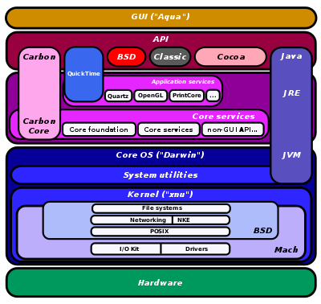

# Posix

[TOC]

## Intro
> Not to be confused with [Unix](https://en.wikipedia.org/wiki/Unix "Unix"), [Unix-like](https://en.wikipedia.org/wiki/Unix-like "Unix-like"), or [Linux](https://en.wikipedia.org/wiki/Linux "Linux"). Differ from Windows NT.
>
> ⚠️  to understand what is Posix you need to first understand **[what is API](https://cloud.tencent.com/developer/ask/26856)**, and the system-level API & user-lever API. 

> 🔗 <https://en.wikipedia.org/wiki/POSIX>

The **Portable Operating System Interface** (**POSIX**) is a family of standards specified by the [IEEE Computer Society](https://en.wikipedia.org/wiki/IEEE_Computer_Society "IEEE Computer Society") for maintaining compatibility between operating systems. POSIX defines both the system and user level application programming interfaces (API), along with command line shells and utility interfaces, for software compatibility (portability) with variants of Unix and other operating systems. 

POSIX is also a trademark of the IEEE. POSIX is intended to be used by both application and system developers.

### POSIX-certified (2022)
Current versions of the following operating systems have been certified to conform to one or more of the various POSIX standards. This means that they passed the automated conformance tests and their certification has not expired and the operating system has not been discontinued.
|                                                        |                                                    |                                                  |                                                              |                                                              |
| ------------------------------------------------------ | -------------------------------------------------- | ------------------------------------------------ | ------------------------------------------------------------ | ------------------------------------------------------------ |
| [AIX](https://en.wikipedia.org/wiki/IBM_AIX)           | [EulerOS](https://en.wikipedia.org/wiki/EulerOS)   | [HP-UX](https://en.wikipedia.org/wiki/HP-UX)     | [INTEGRITY](https://en.wikipedia.org/wiki/Integrity_(operating_system)) | [macOS](https://en.wikipedia.org/wiki/MacOS) (since [10.5 Leopard](https://en.wikipedia.org/wiki/Mac_OS_X_Leopard)) |
| [OpenServer](https://en.wikipedia.org/wiki/OpenServer) | [UnixWare](https://en.wikipedia.org/wiki/UnixWare) | [VxWorks](https://en.wikipedia.org/wiki/VxWorks) | [z/OS](https://en.wikipedia.org/wiki/Z/OS)                   |                                                              |

<small>OS X Architecture 'Darwin' and POSIX API. See more on <a>https://en.wikipedia.org/wiki/Architecture_of_macOS</a></small>

### POSIX for Microsoft Windows
- [Cygwin](https://en.wikipedia.org/wiki/Cygwin) provides a largely POSIX-compliant development and run-time environment for Microsoft Windows.
- [MinGW](https://en.wikipedia.org/wiki/MinGW), a fork of Cygwin, provides a less POSIX-compliant development environment and supports compatible [C](https://en.wikipedia.org/wiki/C_(programming_language))-programmed applications via [Msvcrt](https://en.wikipedia.org/wiki/Msvcrt), Microsoft's old Visual C runtime library.
- [Microsoft POSIX subsystem](https://en.wikipedia.org/wiki/Microsoft_POSIX_subsystem), an optional Windows subsystem included in Windows NT-based operating systems up to Windows 2000. POSIX-1 as it stood in 1990 revision, without threads or sockets.
- [Interix](https://en.wikipedia.org/wiki/Interix), originally OpenNT by Softway Systems, Inc., is an upgrade and replacement for [Microsoft POSIX subsystem](https://en.wikipedia.org/wiki/Microsoft_POSIX_subsystem) that was purchased by [Microsoft](https://en.wikipedia.org/wiki/Microsoft) in 1999. It was initially marketed as a stand-alone add-on product and then later included it as a component in [Windows Services for UNIX](https://en.wikipedia.org/wiki/Windows_Services_for_UNIX) (SFU) and finally incorporated it as a component in [Windows Server 2003 R2](https://en.wikipedia.org/wiki/Windows_Server_2003_R2) and later Windows OS releases under the name "Subsystem for UNIX-based Applications" (SUA); later made deprecated in 2012 (Windows 8) and dropped in 2013 (2012 R2, 8.1). It enables full POSIX compliance for certain Microsoft Windows products.
- [Windows Subsystem for Linux](https://en.wikipedia.org/wiki/Windows_Subsystem_for_Linux), also known as WSL, is a compatibility layer for running Linux binary executables natively on Windows 10 using a Linux image such as Ubuntu, Debian, or OpenSUSE among others, acting as an upgrade and replacement for Windows Services for UNIX. It was released in beta in April 2016. The first distribution available was Ubuntu.
- [UWIN](https://en.wikipedia.org/wiki/UWIN) from AT&T Research implements a POSIX layer on top of the Win32 APIs.
- [MKS Toolkit](https://en.wikipedia.org/wiki/MKS_Toolkit), originally created for MS-DOS, is a software package produced and maintained by [MKS Inc.](https://en.wikipedia.org/wiki/MKS_Inc.) that provides a Unix-like environment for scripting, connectivity and porting Unix and Linux software to both 32- and 64-bit Microsoft Windows systems. A subset of it was included in the first release of [Windows Services for UNIX](https://en.wikipedia.org/wiki/Windows_Services_for_UNIX) (SFU) in 1998.
- [Windows C Runtime Library](https://en.wikipedia.org/wiki/Microsoft_Windows_library_files#Runtime_libraries) and [Windows Sockets API](https://en.wikipedia.org/wiki/Winsock) implement commonly used POSIX API functions for file, time, environment, and socket access, although the support remains largely incomplete and not fully interoperable with POSIX-compliant implementations.

### Mostly POSIX-compliant (2022)
The following are not certified as POSIX compliant yet comply in large part:
|                                                              |                                                              |                                                              |      |                                                              |                                                              |
| ------------------------------------------------------------ | ------------------------------------------------------------ | ------------------------------------------------------------ | ---- | ------------------------------------------------------------ | ------------------------------------------------------------ |
| [Android](https://en.wikipedia.org/wiki/Android_(operating_system)) (Available through Android NDK) | [BeOS](https://en.wikipedia.org/wiki/BeOS) (and subsequently [Haiku](https://en.wikipedia.org/wiki/Haiku_(operating_system))) | [Contiki](https://en.wikipedia.org/wiki/Contiki)             |      | [Darwin](https://en.wikipedia.org/wiki/Darwin_(operating_system)) (core of [macOS](https://en.wikipedia.org/wiki/MacOS) and [iOS](https://en.wikipedia.org/wiki/IOS)) | [DragonFly BSD](https://en.wikipedia.org/wiki/DragonFly_BSD) |
| [FreeBSD](https://en.wikipedia.org/wiki/FreeBSD)             | [illumos](https://en.wikipedia.org/wiki/Illumos)             | [Linux](https://en.wikipedia.org/wiki/Linux) (most distributions) |      | [LynxOS](https://en.wikipedia.org/wiki/LynxOS)               | [MINIX](https://en.wikipedia.org/wiki/MINIX) (now [MINIX3](https://en.wikipedia.org/wiki/MINIX3)) |
| [OpenBSD](https://en.wikipedia.org/wiki/OpenBSD)             | [OpenSolaris](https://en.wikipedia.org/wiki/OpenSolaris)     | [Redox](https://en.wikipedia.org/wiki/Redox_(operating_system)) |      | [NetBSD](https://en.wikipedia.org/wiki/NetBSD)               | [MPE/iX](https://en.wikipedia.org/wiki/HP_Multi-Programming_Executive) |
| [VMware ESXi](https://en.wikipedia.org/wiki/VMware_ESXi)     | [Xenix](https://en.wikipedia.org/wiki/Xenix)                 | [RTEMS](https://en.wikipedia.org/wiki/RTEMS)                 |      |                                                              |                                                              |
|                                                              |                                                              |                                                              |      |                                                              |                                                              |
| ... And Much More!                                           |                                                              |                                                              |      |                                                              |                                                              |
|                                                              |                                                              |                                                              |      |                                                              |                                                              |

## See POSIX also
- [Single UNIX Specification](https://en.wikipedia.org/wiki/Single_UNIX_Specification)
- [POSIX signal](https://en.wikipedia.org/wiki/POSIX_signal)
- [POSIX Threads](https://en.wikipedia.org/wiki/POSIX_Threads)
- [C POSIX library](https://en.wikipedia.org/wiki/C_POSIX_library)
- [Common User Access](https://en.wikipedia.org/wiki/Common_User_Access) – User interface standard
- [Portable character set](https://en.wikipedia.org/wiki/Portable_character_set), set of 103 characters which should be supported in any POSIX-compliant character set locale
- [Real-time operating system](https://en.wikipedia.org/wiki/Real-time_operating_system)
- [Interix](https://en.wikipedia.org/wiki/Interix) – a full-featured POSIX and Unix environment subsystem for Microsoft's Windows NT-based operating systems
- [TRON project](https://en.wikipedia.org/wiki/TRON_project) – alternative OS standards to POSIX

## Refs
[What is POSIX? -- stackoverflow]: https://stackoverflow.com/questions/1780599/what-is-the-meaning-of-posix

- The most important things [POSIX 7](http://pubs.opengroup.org/onlinepubs/9699919799/nfindex.html) defines
- Who conforms to POSIX?
- And .. more!

