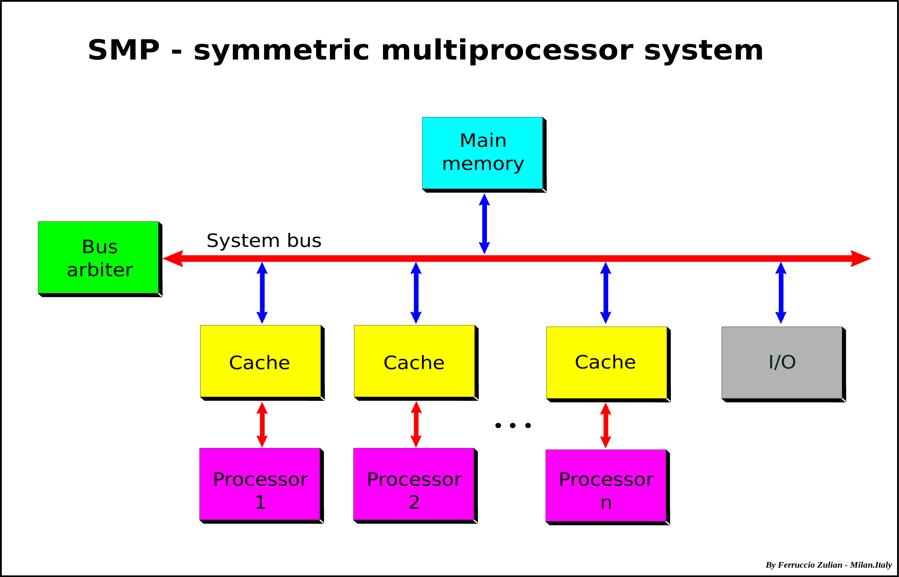

# Symmetric Multiprocessing & Shared Memory Multiprocessors (SMP)

[TOC]

## Res
### Related Topics

## Intro
> 🔗 https://en.wikipedia.org/wiki/Symmetric_multiprocessing

**Symmetric multiprocessing** or **shared-memory multiprocessing (SMP)** involves a multiprocessor computer hardware and software architecture where two or more identical processors are connected to a single, shared main memory, have full access to all input and output devices, and are controlled by a single operating system instance that treats all processors equally, reserving none for special purposes. **Most multiprocessor systems today use an SMP architecture**. In the case of multi-core processors, the SMP architecture applies to the cores, treating them as separate processors.

<small>Diagram of a symmetric multiprocessing system</small>

Professor John D. Kubiatowicz considers traditionally SMP systems to contain processors without caches. Culler and Pal-Singh in their 1998 book "Parallel Computer Architecture: A Hardware/Software Approach" mention: "The term SMP is widely used but causes a bit of confusion. The more precise description of what is intended by SMP is a shared memory multiprocessor where the cost of accessing a memory location is the same for all processors; that is, it has uniform access costs when the access actually is to memory. If the location is cached, the access will be faster, but cache access times and memory access times are the same on all processors."

SMP systems are tightly coupled multiprocessor systems with a pool of homogeneous processors running independently of each other. Each processor, executing different programs and working on different sets of data, has the capability of sharing common resources (memory, I/O device, interrupt system and so on) that are connected using a system bus or a crossbar.

## Ref
[Difference between Chip Multiprocessing and Symmetric Multiprocessing? | Stackoverflow]: https://stackoverflow.com/a/32048969/16542494

#SMP #CMP

You're mixing shared memory and shared caches. System with no shared cache exists (e.g. - some GPUs), strict private memory is more rare since you can use shared memory and just have distinct ranges. No one is forcing you to share it. 

What makes SMP a true subset of CMP is the symmetry - some CMP systems are heterogeneous - for example the arm little.BIG concept. Some are not.

Regardless of all that, these definitions aren't written in stone, they only provide some high level taxonomy, but many processors today don't easily fall into such simple (even outdated) criteria, making it less useful to distinguish them.
