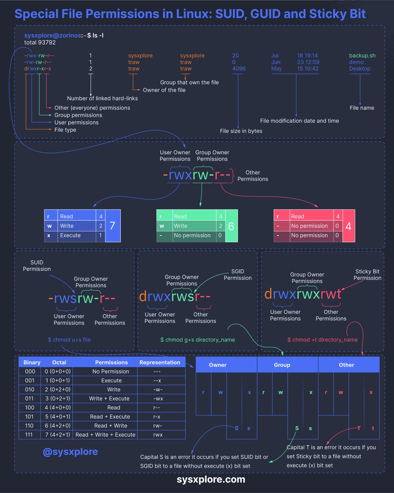

# File Permissions

[TOC]

## Res
### Related Topics
↗ [SeedLab - Software Security / Set-UID](../../../../../../../CyberSecurity/☠️%20Kill%20Chain/🎯%20Cyber%20Ranges%20&%20Labs/🧪%20Labs/SEED%20Project/SeedLab%20-%20Software%20Security.md)

↗ [Text & File & Dir Management Basics](../../../../../../🥷🏼%20Operating%20System%20(Engineering)/Linux%20(Derived%20From%20UNIX%20Family)/🪓%20Free%20Software/Text%20&%20File%20&%20Dir%20Management/Text%20&%20File%20&%20Dir%20Management%20Basics.md)

## Intro

## Ref
[👍 Linux Cygwin知识库（二）：目录、文件及基本操作]: https://silaoa.github.io/2019/2019-05-04-Linux%20Cygwin知识库（二）：目录、文件及基本操作.html

