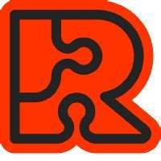

# Rust-VMM

[TOC]

## Intro

> 🔗 https://opensource.com/article/19/3/rust-virtual-machine

The [rust-vmm](https://github.com/rust-vmm) project came to life in December 2018 when Amazon, Google, Intel, and Red Hat employees started talking about the best way of sharing virtualization packages. More contributors have joined this initiative along the way. We are still at the beginning of this journey, with only one component published to [Crates.io](https://crates.io/) (Rust's package registry) and several others (such as Virtio devices, Linux kernel loaders, and KVM ioctls wrappers) being developed. With two VMMs written in Rust under active development and growing interest in building other specialized VMMs, rust-vmm was born as the host for sharing core virtualization components.

The goal of rust-vmm is to enable the community to create custom VMMs that import just the required building blocks for their use case. We decided to organize rust-vmm as a multi-repository project, where each repository corresponds to an independent virtualization component. Each individual building block is published on [Crates.io](https://crates.io).

## Ref

