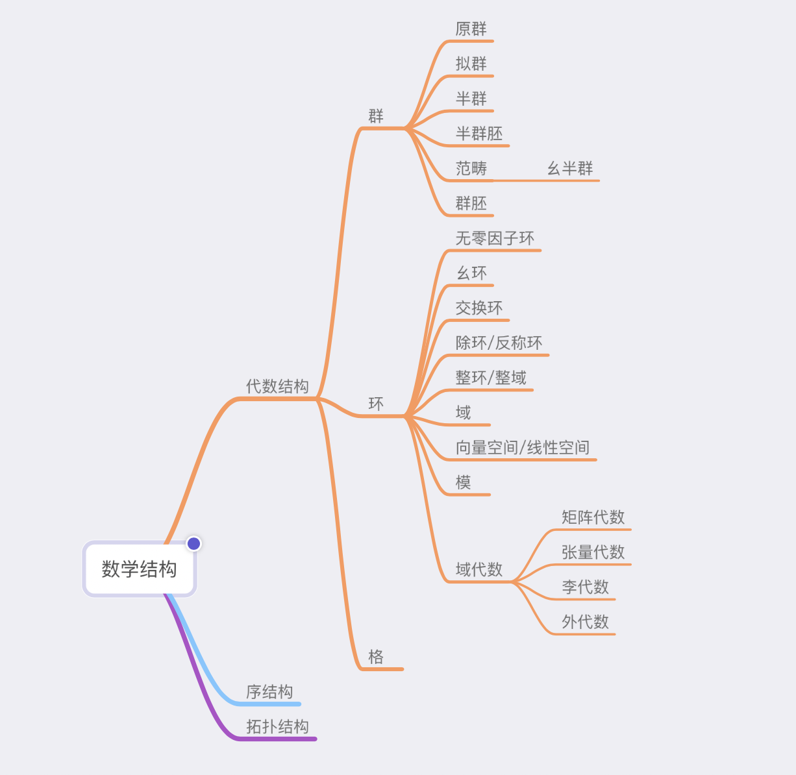

# Math for CS

[TOC]

## Res

[香蕉空间](https://www.bananaspace.org/wiki/探索:讲义)

[oi-wiki - 数学部分](https://oi-wiki.org/math/)

[数学分支](https://blog.csdn.net/shi_kan/article/details/8990951)

## 🛐 Modern Math Structure

> :link: 
>
> [代数结构简介：群、环, 域、格、模...]: https://blog.yelf.me/notes/math/algebra/algebra-101/
> [Mathematical structure]: https://en.wikipedia.org/wiki/Mathematical_structure

In [mathematics](https://en.wikipedia.org/wiki/Mathematics), a **structure** is a [set](https://en.wikipedia.org/wiki/Set_(mathematics)) endowed with some additional features on the set (e.g. an [operation](https://en.wikipedia.org/wiki/Operation_(mathematics)), [relation](https://en.wikipedia.org/wiki/Relation_(mathematics)), [metric](https://en.wikipedia.org/wiki/Metric_(mathematics)), or [topology](https://en.wikipedia.org/wiki/Topological_space)). Often, the additional features are attached or related to the set, so as to provide it with some additional meaning or significance.

A partial list of possible structures are:

-  [measures](https://en.wikipedia.org/wiki/Measure_theory)
- [algebraic structures](https://en.wikipedia.org/wiki/Algebraic_structure) ([groups](https://en.wikipedia.org/wiki/Group_(mathematics)), [fields](https://en.wikipedia.org/wiki/Field_(mathematics)), etc.)
- [topologies](https://en.wikipedia.org/wiki/Topology)
- [metric structures](https://en.wikipedia.org/wiki/Metric_space) ([geometries](https://en.wikipedia.org/wiki/Geometry))
- [orders](https://en.wikipedia.org/wiki/Order_theory)
- [events](https://en.wikipedia.org/wiki/Event_structure)
- [equivalence relations](https://en.wikipedia.org/wiki/Equivalence_relation)
- [differential structures](https://en.wikipedia.org/wiki/Differential_structure)
- [categories](https://en.wikipedia.org/wiki/Category_(mathematics)).

Sometimes, a set is endowed with more than one feature simultaneously, which allows mathematicians to study the interaction between the different structures more richly. For example, an ordering imposes a rigid form, shape, or topology on the set, and if a set has both a topology feature and a group feature, such that these two features are related in a certain way, then the structure becomes a [topological group](https://en.wikipedia.org/wiki/Topological_group).[[1\]](https://en.wikipedia.org/wiki/Mathematical_structure#cite_note-1)

[Mappings](https://en.wikipedia.org/wiki/Map_(mathematics)) between sets which preserve structures (i.e., structures in the [domain](https://en.wikipedia.org/wiki/Domain_of_a_function) are mapped to equivalent structures in the [codomain](https://en.wikipedia.org/wiki/Codomain)) are of special interest in many fields of mathematics. Examples are [homomorphisms](https://en.wikipedia.org/wiki/Homomorphism), which preserve algebraic structures; [homeomorphisms](https://en.wikipedia.org/wiki/Homeomorphism), which preserve topological structures;[[2\]](https://en.wikipedia.org/wiki/Mathematical_structure#cite_note-2) and [diffeomorphisms](https://en.wikipedia.org/wiki/Diffeomorphism), which preserve differential structures.

## 📝 Math Course List for CS

https://www.cnblogs.com/TIMON123/p/16222362.html#/c/subject/p/16222362.html

工科数学分析基础

线性代数与解析几何

离散数学

计算方法

最优化方法

运筹学

Mathematics for Computer Science

矩阵论及其工程应用

应用回归分析

数值最优化方法

凸优化

概率论与数理统计

复变函数

积分变换

博弈论

信息论

