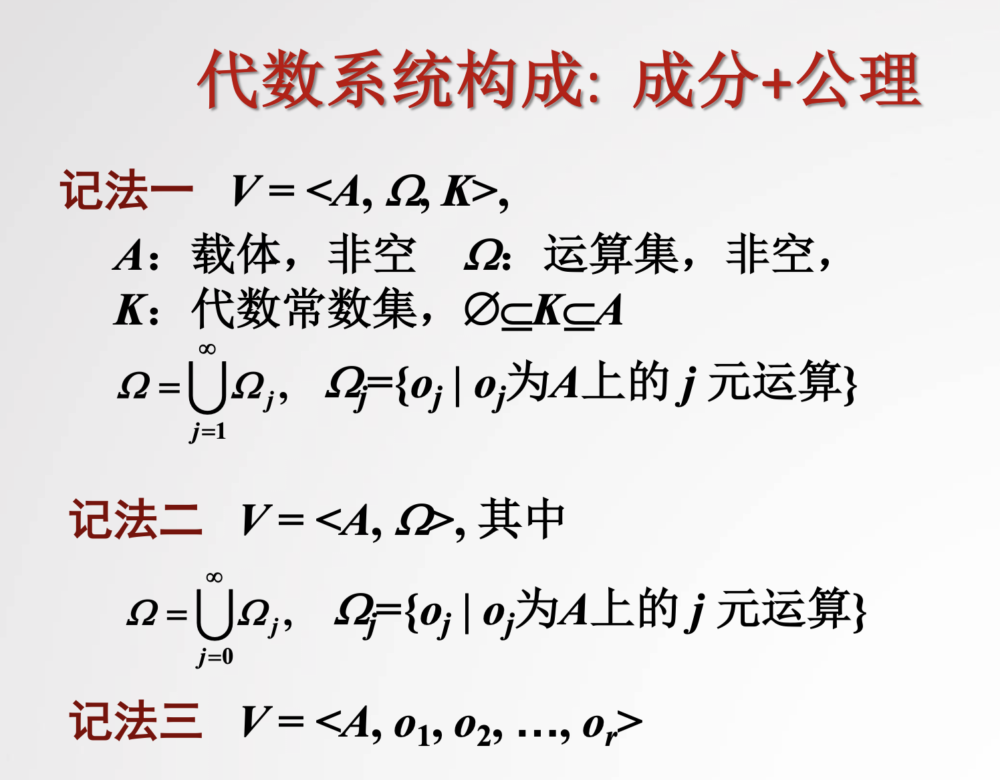
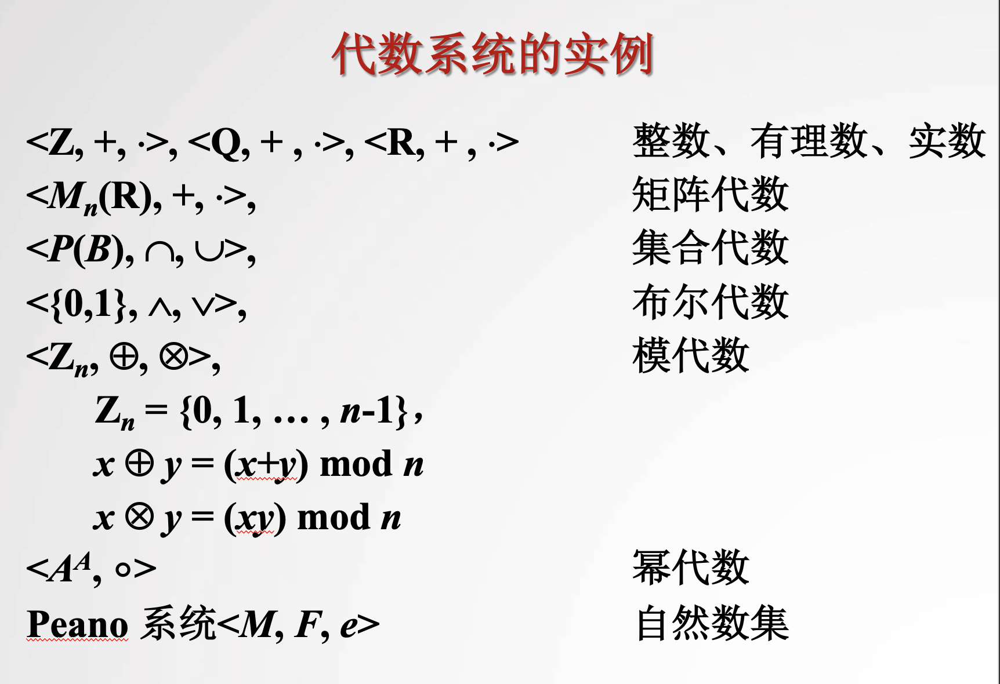
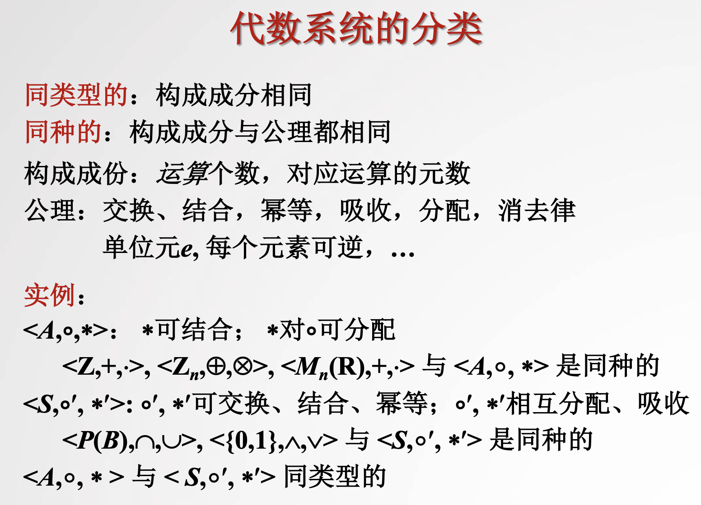
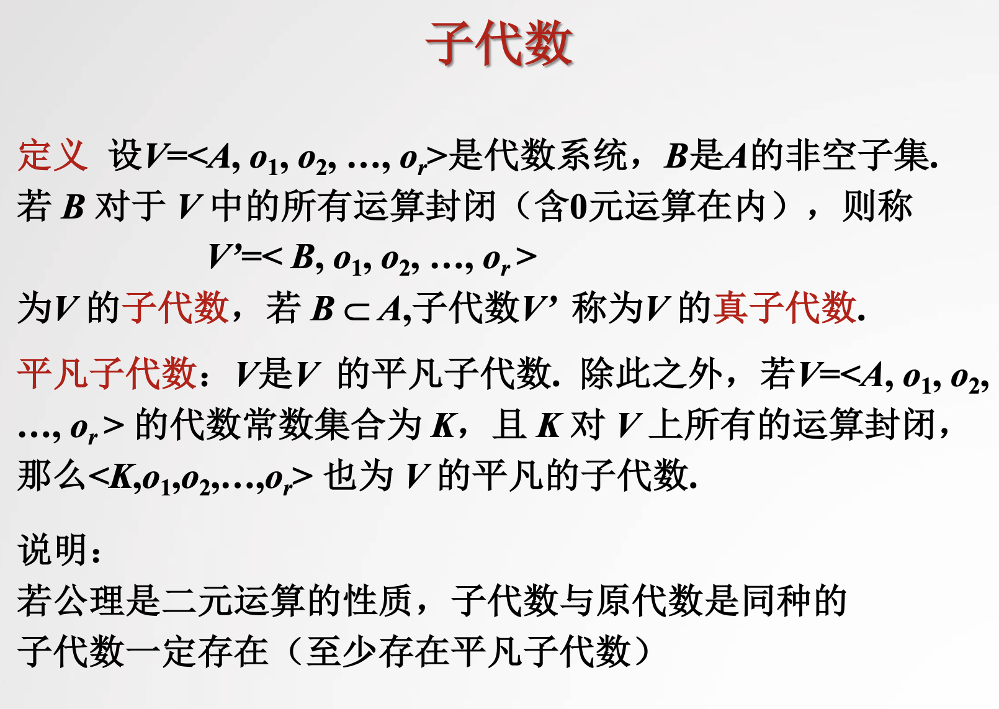
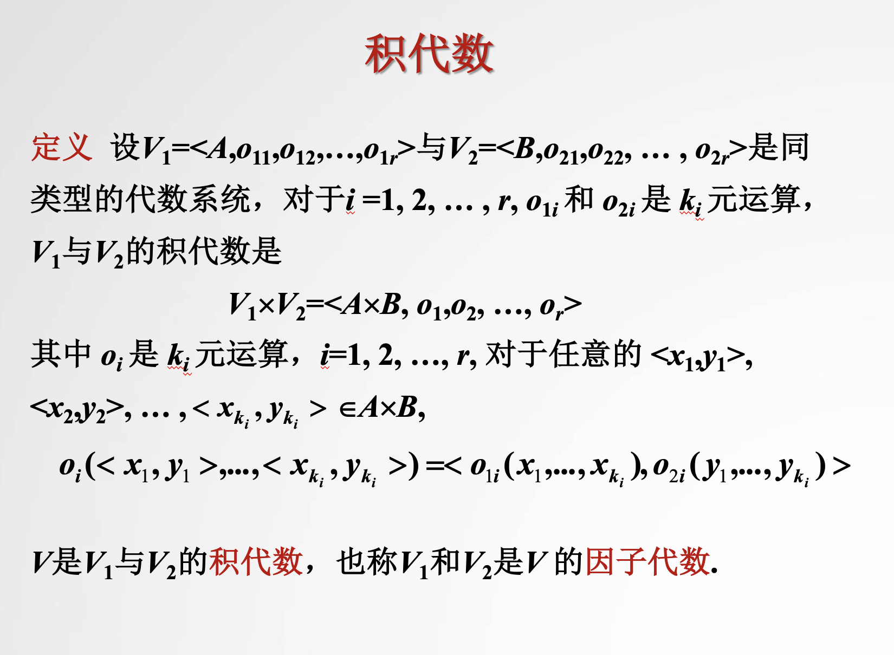
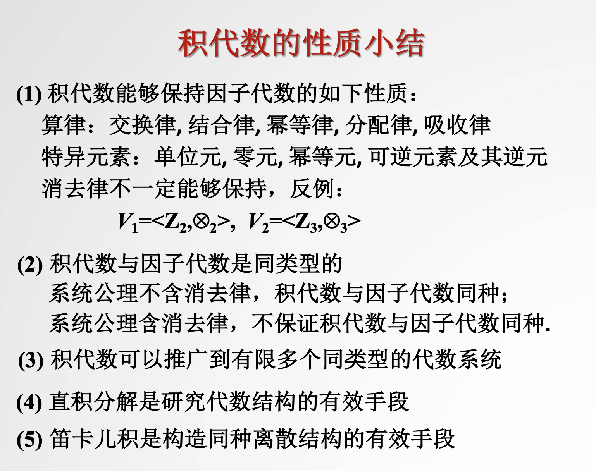

# Alebraic System

[TOC]

## Defination

> :bulb: 
>
> 【离散数学（全）-北京大学】 https://www.bilibili.com/video/BV1BW411n7gw/?p=44&share_source=copy_web&vd_source=7740584ebdab35221363fc24d1582d9d

## Classification

## Generation(?)

> :bulb: 
>
> 【离散数学（全）-北京大学】 https://www.bilibili.com/video/BV1BW411n7gw/?p=45&share_source=copy_web&vd_source=7740584ebdab35221363fc24d1582d9d

### subalgebra

### direct product algebra

#### Properties

### Quotient Algebra