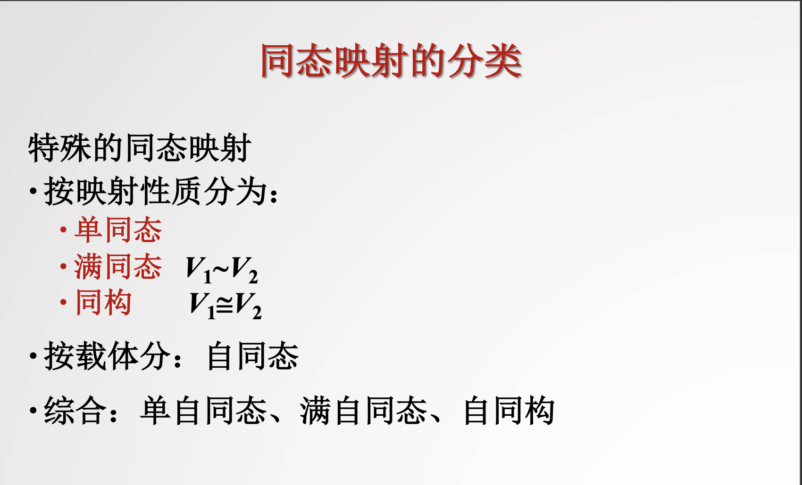
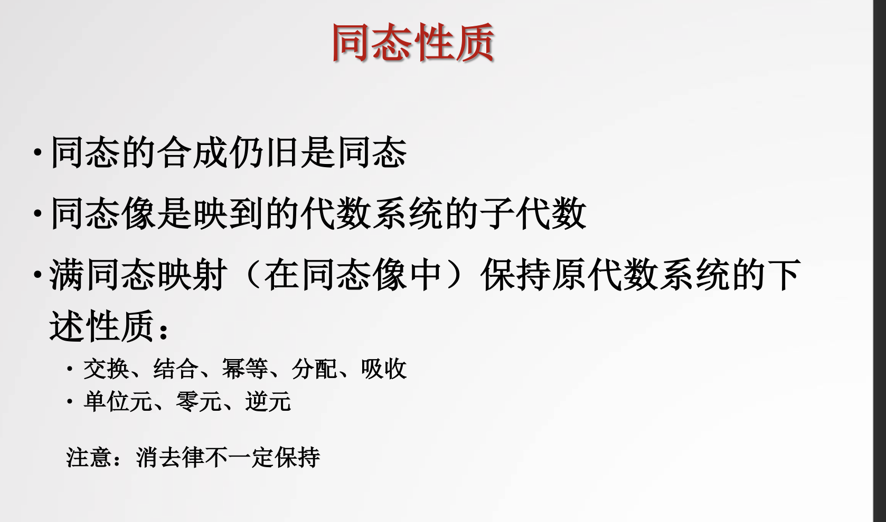

# Homomorphism & Isomorphism

[TOC]

同态与同构

> :link:
>
> https://zh.m.wikipedia.org/wiki/同态

## Definition of Homomorphism

### Different kinds of Homomorphism

## Properties of Homomorphism

## Ref

[如何直观地理解同态和同构]: https://www.zhihu.com/question/293890350/answer/488445108

