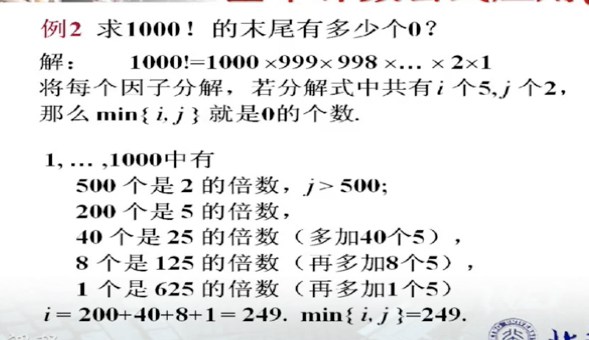
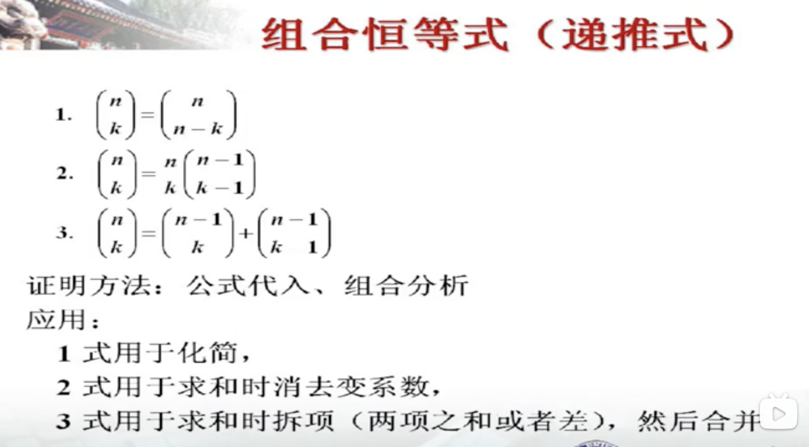
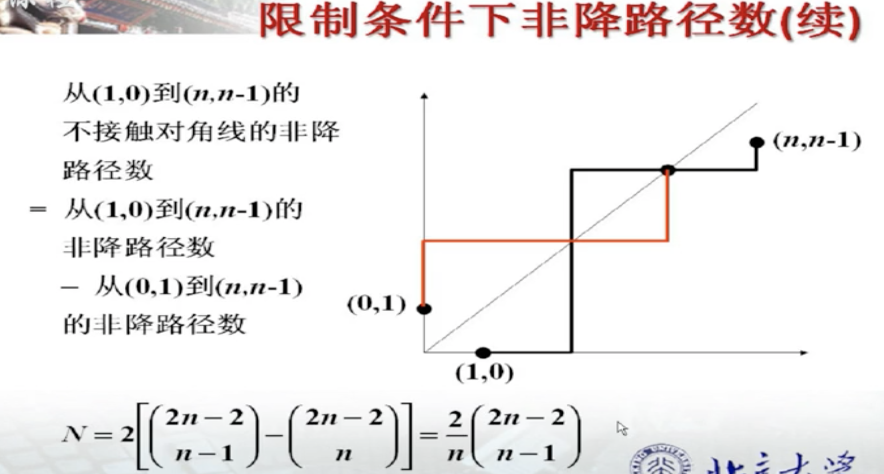

# Fundamental Counting Principle

[TOC]

## The Addition Rule and The Product Rule

## Arrangement

## Combination

对于每次 $5^i$ 的枚举，前一次 $5^{i-1}$ 已经计算过了当前的 $5^i$ 的 $i-1$ 次，所以当前的计数只需要加一。所以最终 $i=200+40+8+1$

[多重集的组合数（容斥原理）——杨子曰数学？题目？](https://www.luogu.com.cn/blog/HenryYang/duo-zhong-ji-di-zu-ge-shuo-rong-chi-yuan-li-yang-zi-yue-shuo-xue-ti)

## Binomial Theorem

## Combinatorial Identities

## Multinomial Theorem