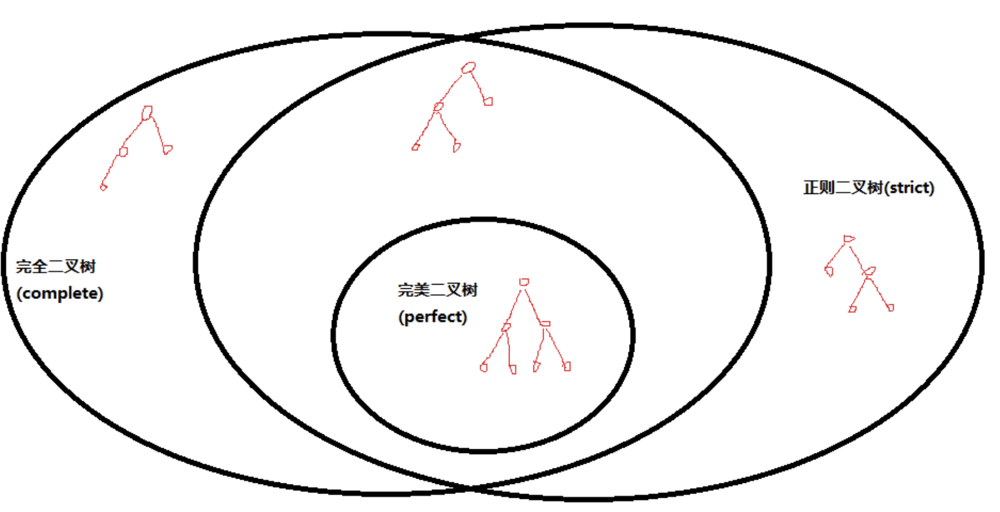

# FAQ

[TOC]

### [完美二叉树(perfect)与正则二叉树(strict)的概念](https://blog.csdn.net/Justme0/article/details/8608370)

“满[二叉树](https://so.csdn.net/so/search?q=二叉树&spm=1001.2101.3001.7020)(full)”的定义在国内和国外完全不同，国内指“完美二叉树(perfect)”，国外指“正则二叉树(strict)”，所以我建议国内外都取消“满二叉树(full)”这个叫法，这样就没有不必要的麻烦了。

### [“正则”是什么意思？](https://www.zhihu.com/question/21056295)

1. 正则的英语原文是regular，可以理解为有规律的，有规则的。在英语里面被描述为regular的对象其实是比较简单的，容易掌握的对象。比如说正则语言只有几条简单的定义，除了原子（atom）的定义就是各种连接（concatenation）和求并（union），并且可以简单的用确定状态有限自动机表达；相对而言，上下文无关以及上下文相关语言就要复杂的多了，需要下推自动机和线性有限自动机来表示了。另一个例子是图论里的正则图（regular graph），也就是完全图，因为性质非常对称和规律，所以比较容易研究；其他各种不正则的图就没那么规律的性质了。

   

   P.S. 现在大部分情况提到的正则表达式都是各种编程语言里的正则表达式，这种“正则表达式”的表达能力往往超过了正则语言的范围。

2. 机器学习中的正则化：

   > “正则化 (Regularization）是一类通过限制模型复杂度，从而避免过拟合，提高泛化能力的方法，比如引入约束、增加先验、提前停止等。“” —nndl-book 7.7

   可以看出，从英语单词 "regular"的本意（规约、限制、范式）而不是翻译后的中文词语"正则"来理解这一个术语的意思会更有帮助。

   

3. 正则有正其礼仪法则；正规；常规等意思。 的意思。 汉 张衡 《东京赋》：“辩方位而正则，五精帅而来摧。” 则:《说文解字》：“则，等画物也。从刀，从贝。贝，古之物货也。”会意字，本义为定出差等而区划物体（分画），以刀、贝示意。用常规命名太容易引起歧义，这样命名更显专用意义。

