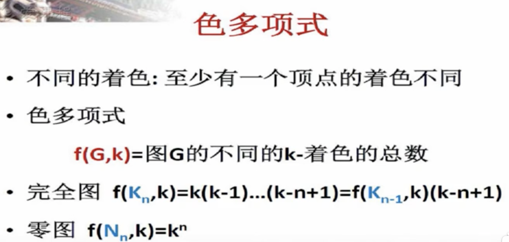
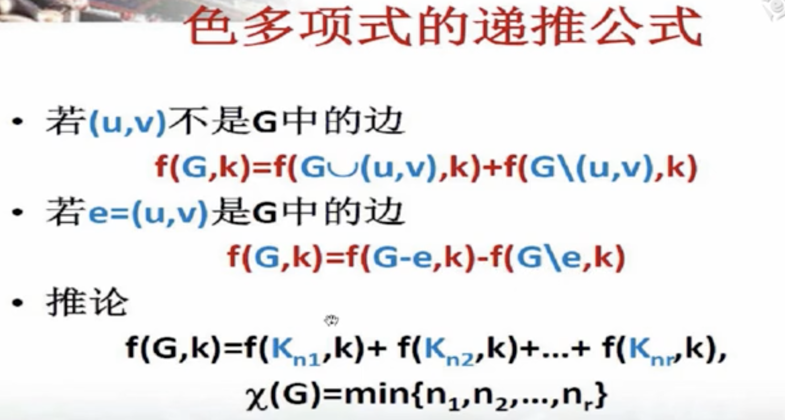
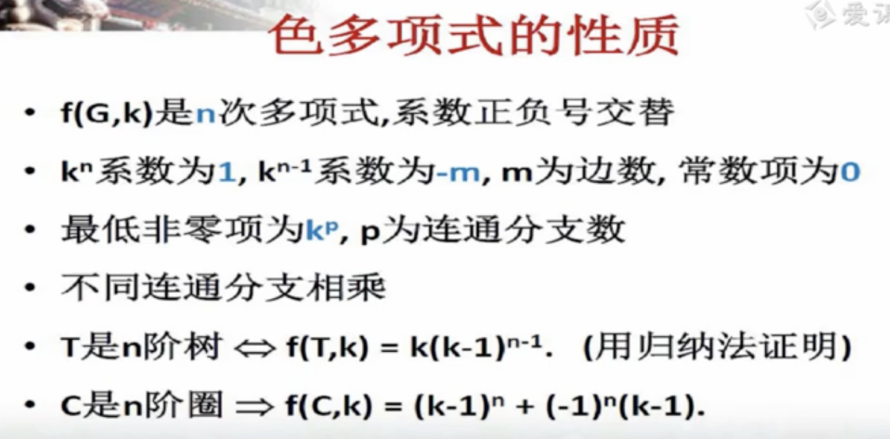
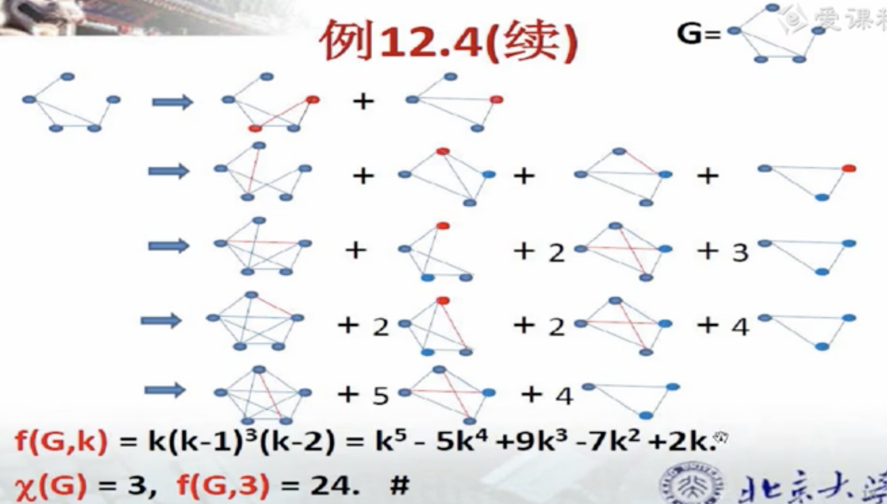
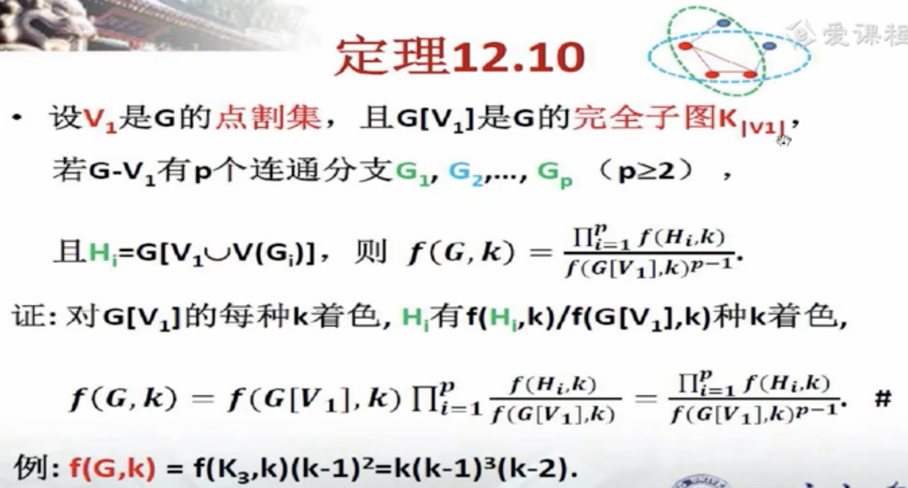

# GCP, Graph Coloring Problem

[TOC]

【离散数学（全）-北京大学】 https://www.bilibili.com/video/BV1BW411n7gw/?p=33&share_source=copy_web&vd_source=7740584ebdab35221363fc24d1582d9d

## Vertex Coloring

## Edge Coloring

## Chromatic Polynomial

## Face Coloring

## Total Coloring

## Unlabeled coloring