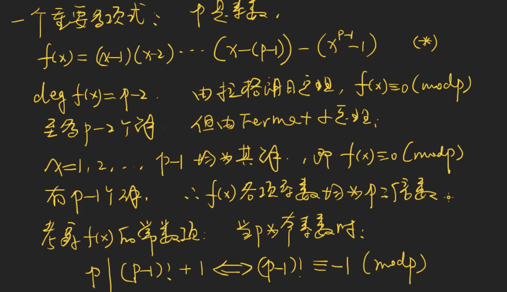
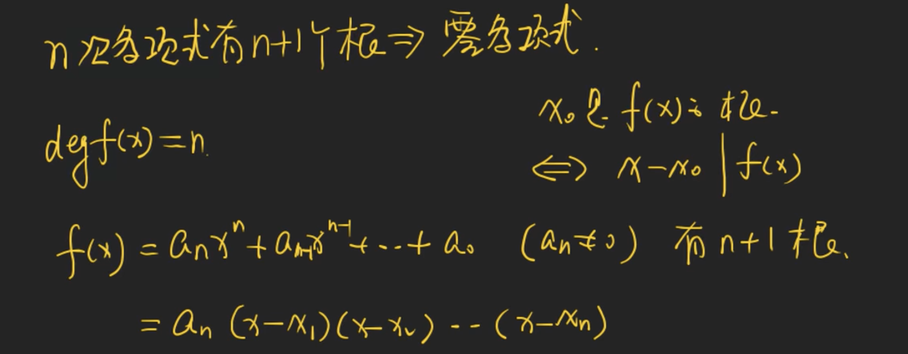
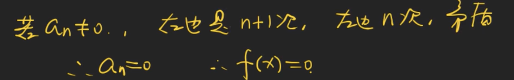
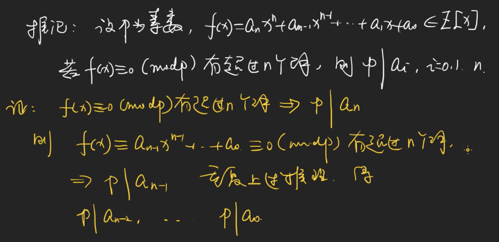
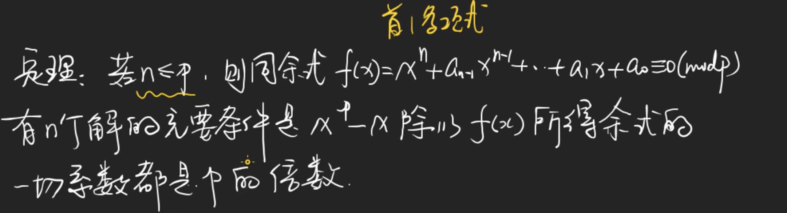
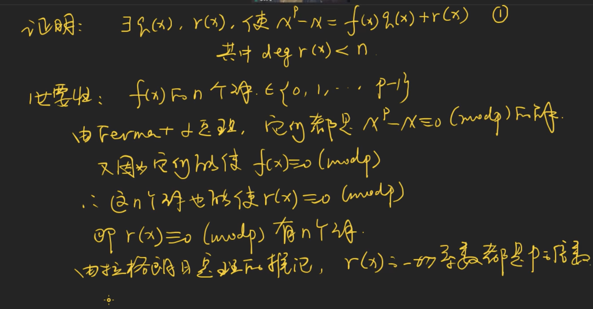
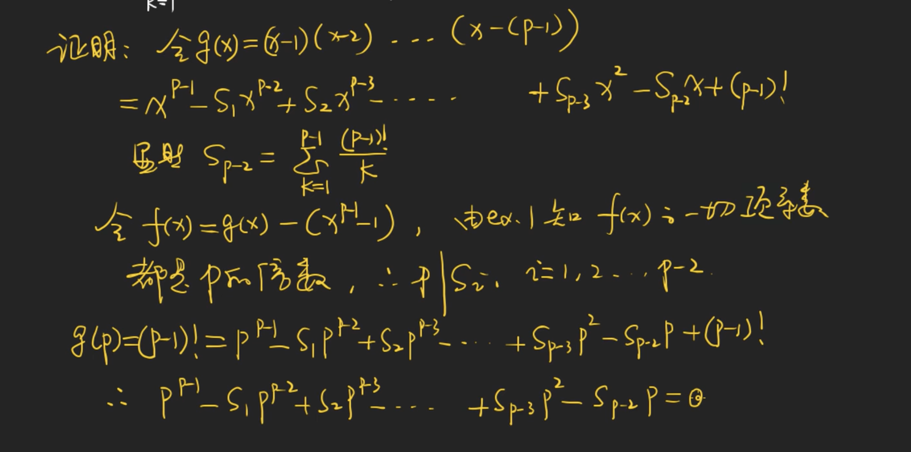

# Lagrange Theorem & Wolstenholme Theorem

[TOC]

## lagrange theorem

## 由拉格朗日定理得到威尔逊定理

https://www.bilibili.com/video/BV1TQ4y1f7CJ?p=3

## 零多项式

## 推论

意义： f(x) 是 模P 意义下的零多项式。

## 一个重要引理

## Wolstenholme Theorem

https://www.bilibili.com/video/BV1TQ4y1f7CJ?p=4

