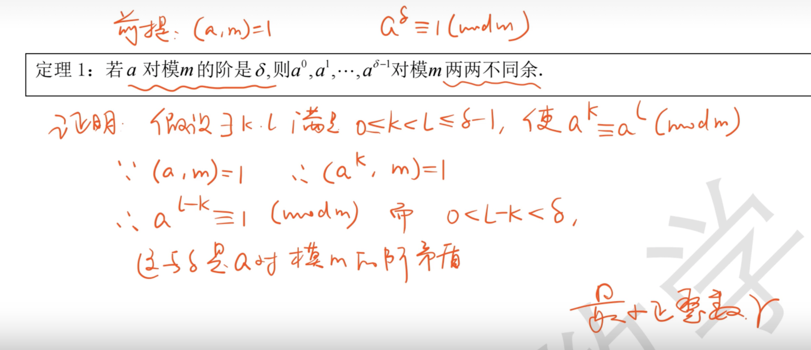
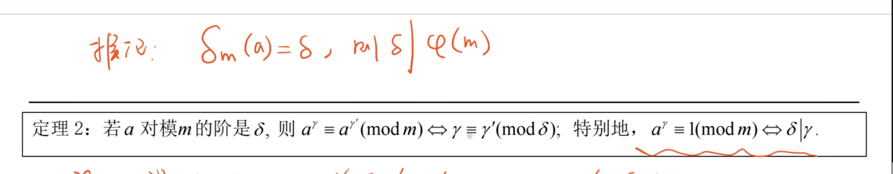
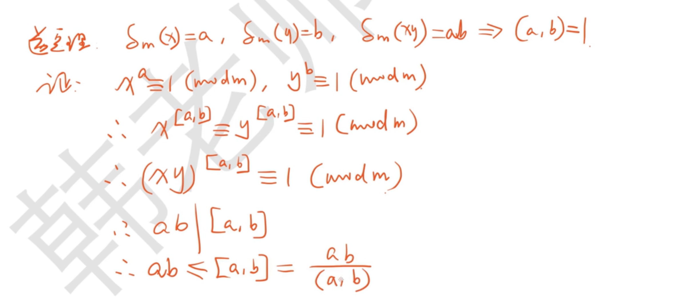
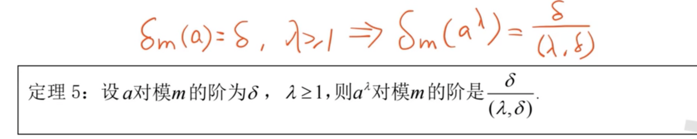
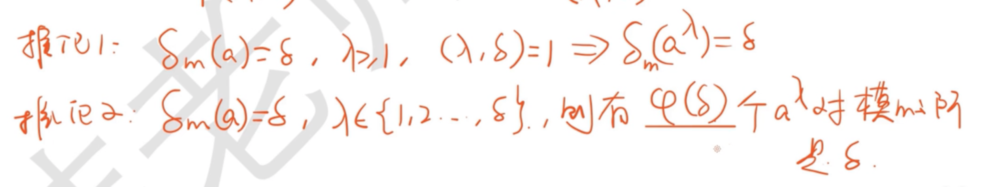
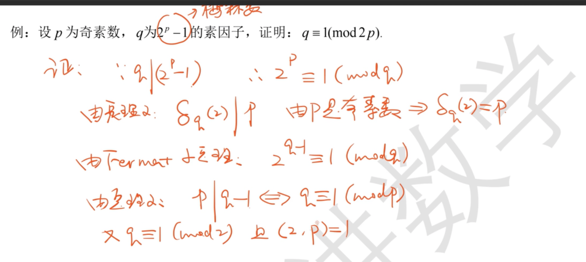

# Degree

[TOC]

> :bulb: https://www.bilibili.com/video/BV1rX4y1A7dd

## Defination

### Primitive Root Modulo

> :bulb: https://en.wikipedia.org/wiki/Primitive_root_modulo_n

## Properties

揭示了模的周期性。一个阶内就是一个周期。

