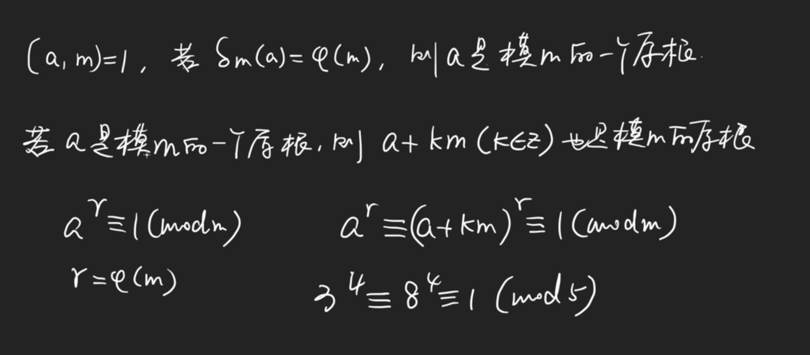
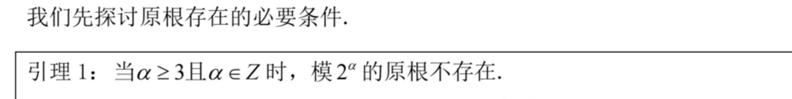
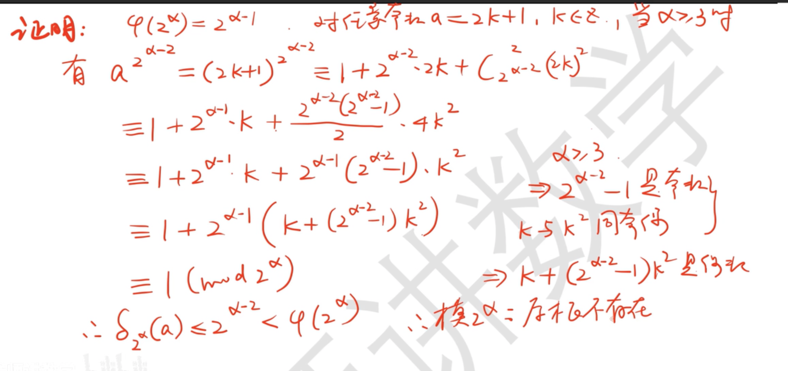
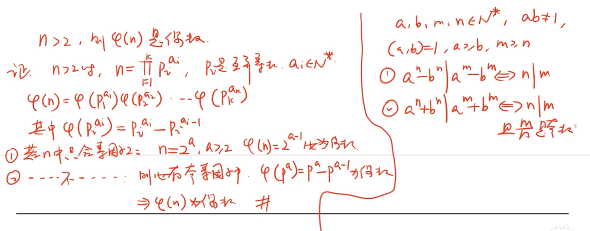
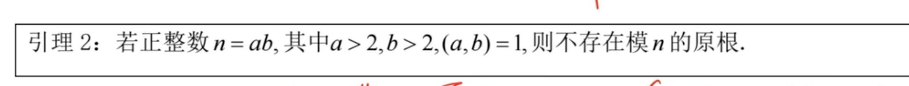
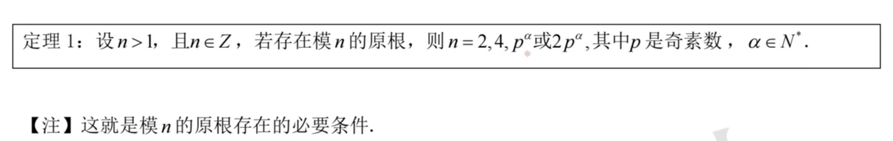
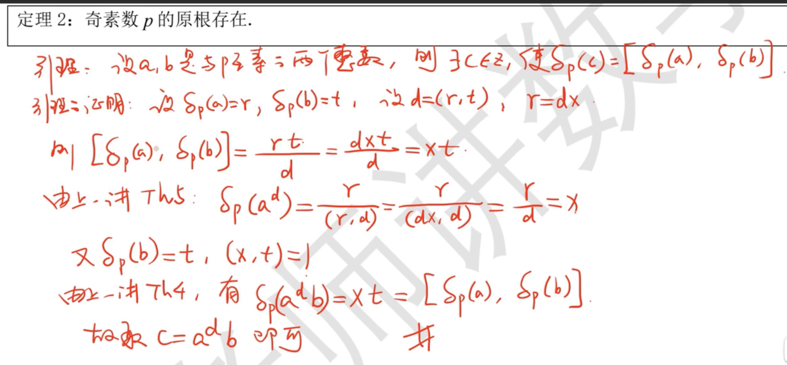

# Primitive Root

[TOC]

> :bulb:
>
>  https://en.wikipedia.org/wiki/Primitive_root_modulo_n
>
> 【【韩涛老师大学初等数论系列讲座（24）】原根】 https://www.bilibili.com/video/BV1Y64y1t7Sg/?share_source=copy_web&vd_source=7740584ebdab35221363fc24d1582d9d

## Definition

易知原根在模数P的一个缩系内考虑即可。

## Necessary Condition

### Lemma 1

### Lemma 2

### Theorem

## Sufficient Condition

欧拉给出证明，上述必要条件也是模n存在的充分条件。

