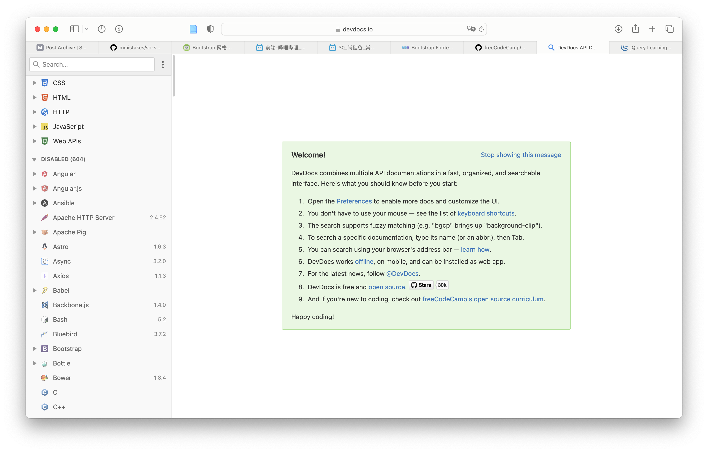

# [DevDocs](https://devdocs.io)

:house: https://devdocs.io

:family:  https://github.com/freeCodeCamp/devdocs

DevDocs combines multiple developer documentations in a clean and organized web UI with instant search, offline support, mobile version, dark theme, keyboard shortcuts, and more.

DevDocs was created by [Thibaut Courouble](https://thibaut.me/) and is operated by [freeCodeCamp](https://www.freecodecamp.org/).

## Documentation

- [Adding documentations to DevDocs](https://github.com/freeCodeCamp/devdocs/blob/main/docs/adding-docs.md)
- [Scraper Reference](https://github.com/freeCodeCamp/devdocs/blob/main/docs/scraper-reference.md)
- [Filter Reference](https://github.com/freeCodeCamp/devdocs/blob/main/docs/filter-reference.md)
- [Maintainers’ Guide](https://github.com/freeCodeCamp/devdocs/blob/main/docs/maintainers.md)

## Related Projects

Made something cool? Feel free to open a PR to add a new row to this table!

| Project                                                      | Description                                                  | Last commit                                                  |
| ------------------------------------------------------------ | ------------------------------------------------------------ | ------------------------------------------------------------ |
| [Sublime Text plugin](https://sublime.wbond.net/packages/DevDocs) | Sublime Text plugin to search DevDocs by selection or by input. |  |
| [Atom plugin](https://atom.io/packages/devdocs)              | Atom plugin adding the `doc` command to search DevDocs.      |  |
| [gruehle/dev-docs-viewer](https://github.com/gruehle/dev-docs-viewer) | Brackets extension for searching and viewing DevDocs content. |  |
| [naquad/devdocs-shell](https://github.com/naquad/devdocs-shell) | GTK shell with Vim integration.                              |  |
| [skeeto/devdocs-lookup](https://github.com/skeeto/devdocs-lookup) | Quick Emacs API lookup on DevDocs.                           |  |
| [yannickglt/alfred-devdocs](https://github.com/yannickglt/alfred-devdocs) | Alfred workflow for DevDocs.                                 |  |
| [waiting-for-dev/vim-www](https://github.com/waiting-for-dev/vim-www) | Vim search plugin with DevDocs in its defaults.              |  |
| [vscode-devdocs for VS Code](https://marketplace.visualstudio.com/items?itemName=akfish.vscode-devdocs) | VS Code plugin to open and search DevDocs inside VS Code.    |  |
| [devdocs for VS Code](https://marketplace.visualstudio.com/items?itemName=deibit.devdocs) | VS Code plugin to open the browser to search selected text on DevDocs. |  |
| [egoist/devdocs-desktop](https://github.com/egoist/devdocs-desktop) | Cross-platform desktop application for DevDocs.              |  |
| [qwfy/doc-browser](https://github.com/qwfy/doc-browser)      | Native Linux app that supports DevDocs docsets.              |  |
| [hardpixel/devdocs-desktop](https://github.com/hardpixel/devdocs-desktop) | GTK3 application for DevDocs with search integrated in the headerbar. |  |
| [dteoh/devdocs-macos](https://github.com/dteoh/devdocs-macos) | Native macOS application for DevDocs.                        |  |
| [Merith-TK/devdocs_webapp_kotlin](https://github.com/Merith-TK/devdocs_webapp_kotlin) | Android application which shows DevDocs in a webview.        |  |
| [astoff/devdocs.el](https://github.com/astoff/devdocs.el)    | Emacs viewer for DevDocs                                     |  |
| [DevDocs Tab for VS Code](https://github.com/mohamed3nan/DevDocs-Tab) | VS Code extension to search displaying DevDocs.io in a tab.  |  |
| [quickDocs](https://github.com/mdh34/quickDocs)              | DevDocs viewer written in Vala/Python.                       |  |
| [romainl/vim-devdocs](https://github.com/romainl/vim-devdocs) | Look up keyword on DevDocs from Vim.                         |  |