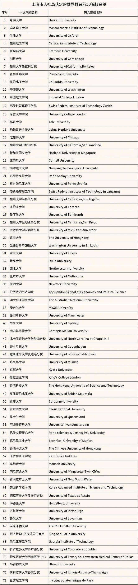
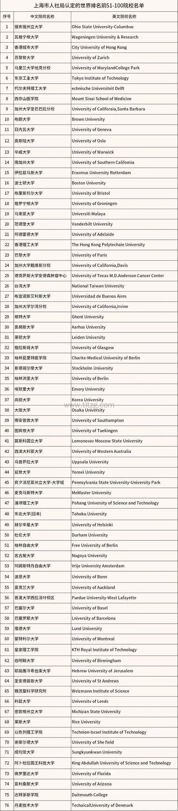
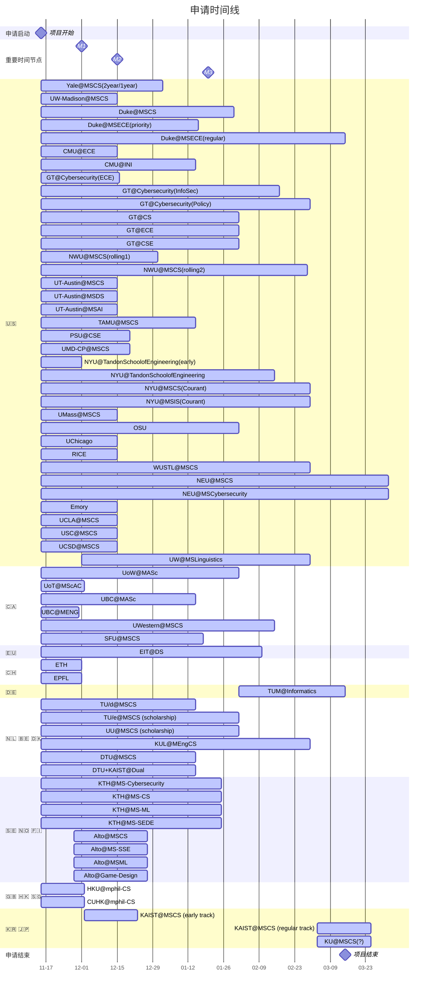

# International Master & PhD Programs List

[TOC]

## Res
### Related Topics
↗ [CS International Universities & Degrees](CS%20International%20Universities%20&%20Degrees.md)
↗ [Academics](../../../../Academics/Academics.md)
↗ [Academic Research Group Profiles](../../../../Academics/Academic%20Research%20Group%20Profiles/Academic%20Research%20Group%20Profiles.md)

↗ [Natural Science Information](../../../🔑%20CS%20Core/🧰%20Generic%20Tools%20&%20Projects/😅%20Wiki%20Projects%20&%20Wikimedia%20Foundation%20(WMF)/Natural%20Science%20Information.md)

### CS School Academic Ranking
↗ [CS International Universities & Degrees](../CS%20International%20Universities%20&%20Degrees.md)

↗ [Academics](../../../Academics/Academics.md) | 文献计量学与学术评价
bibliometrics
- https://www.topuniversities.com/world-university-rankings | QS, Quacquarelli Symonds
- https://www.shanghairanking.com/rankings/arwu/ | ARWU, Shanghai Jiao Tong University
- https://www.timeshighereducation.com/world-university-rankings | THE, Times Higher Education
- https://www.usnews.com/best-colleges/rankings/national-universities | U.S. News, 

https://www.tltzg.com/luohu/8402.html

### Programs, Universities, Countries, Personal Development, and Universe 🤯
https://www.topuniversities.com/university-rankings/university-subject-rankings/2023/computer-science-information-systems?page=0
QS World University Rankings by Subject 2023: Computer Science and Information Systems

我的奋斗：从找不到工作的穷留学生到沙特阿卜杜拉国王科技大学（KAUST）第一位华人高级网络工程师 - 弈心的文章 - 知乎 https://zhuanlan.zhihu.com/p/146003181

🤔 中科院敏感专业，学硕转博还是硬刚美国博士？
https://www.1point3acres.com/bbs/thread-648011-1-1.html

### Application Info
https://www.1point3acres.com/bbs/forum.php?mod=forumdisplay&fid=82&filter=sortid&sortid=164&orderby=dateline
一亩三分地 - 录取汇报 - 研究生

https://offer.gter.net/summary/Z8pDorvJyr3y6IOSu2SeHAsDTRKhfH5rEWQ2MGQ~
985低均分欧陆➕港新英混申总结 （2024fall）

https://offer.gter.net/summary/Z8pDorvJyrj56IOSuzmbHV9eRRKhfH5rEWQ2MGQ~
24Fall欧陆CS硕士低绩点海投DIY总结

https://www.1point3acres.com/bbs/home.php?mod=space&uid=689679&do=thread&view=me&from=space
申请总结 (TUd, ETH, EFPL, UCSD, UPenn, USC, NEU)

https://offer.gter.net/summary/Z8pDorvJybj56IOSu2vJHV0HQBKhfH5rEWQ2MGQ~
 24Fall cs加硕申请

https://www.1point3acres.com/bbs/home.php?mod=space&do=thread&view=me&type=thread&uid=852709&from=space
24fall 欧美混申

https://www.1point3acres.com/bbs/home.php?mod=space&do=thread&view=me&type=thread&uid=1030896&from=space
华五某校（nju）SE本科，加权均分82，WES3.3（还没做，自己手算的），雅思7.5（6），GRE 325，无实习科研，两段暑校。美硕回国向。

https://www.1point3acres.com/bbs/home.php?mod=space&do=thread&view=me&type=thread&uid=939705&from=space
东北大学，3.93/5，一段实习，两三段比较水的科研，TOFEL103，GRE324

https://www.1point3acres.com/bbs/home.php?mod=space&do=thread&view=me&type=thread&uid=733390&from=space
大工（？）3.9/4，软工，

https://www.1point3acres.com/bbs/home.php?mod=space&do=thread&view=me&type=thread&uid=1012282&from=space
美本top40，major是math-cs，minor是data science。gpa 3.92，专业课gpa4.0，gre：332+4。目标是AI/ML方向

软背景贼菜。research有一段线上（买的）深度学习的科研，有一篇关于深度学习在stock market应用的共一paper已见刊。在学校跟着一个实验室做的CNN方向的科研，后来没有发表。

自己的project比较杂，有neural style transfer，object detection这种然后做成前段网页这种。

推荐信也不咋滴都是任课prof，估计一篇会偏强推一点，剩下两篇应该就一般推，只能夸一下上的课成绩那种。

### Application Windows 2024CS

## 🧔🏼‍♀️ Europe
### Europe Overview
https://mp.weixin.qq.com/s/5SaU4nU76vLGH7LCR9PJBg

### 🇪🇺 Associated Programs 
#### 👉 Erasmus Mundus
[在荷兰留学是怎么样的体验？ - 德国Viviane的回答 - 知乎]: https://www.zhihu.com/question/28504528/answer/3234657391

Erasmus Mundus，是欧洲大学间的硕士（多数项目）、博士（少数项目）联合培养项目，从你一入学起，同时在至少2个国家，至少2所高校注册，最终拿联合学位，或者至少2个单独的学位。
**Erasmus+奖学金金额：硕士约为25000欧元/年，包括以下内容：**
1.3000欧元/年+1000欧元/项目的旅游安置费；  
2.每月1000欧元生活津贴，每学年按12个月算；
3.免除学费（学费约为9000欧元/年），提供保险费。

**硕士奖学金申请条件如下**
1．学习成绩优秀
2．国籍为第三世界国家的学生
3．近5年内在欧盟国家居留时间总共不超过12个月

[想读热门专业，拿双学位+高额奖学金？计算机AI相关欧盟Erasmus奖学金项目汇总！]: https://mp.weixin.qq.com/s/RdnVXLGDQ5zaptgsi-RjDQ

🔍 https://www.eacea.ec.europa.eu/scholarships/erasmus-mundus-catalogue_en
Erasmus Mundus Catalogue
##### CyberMACS - Master of Applied Cybersecurity
🏠 https://erasmus-plus.ec.europa.eu/projects/search/details/101082683
##### CYBERUS - Erasmus Mundus Joint Master in Cybersecurity
https://erasmus-plus.ec.europa.eu/projects/search/details/101049712
##### Master's programme in Security and Cloud Computing (SECCLO)
https://erasmus-plus.ec.europa.eu/projects/search/details/619612-EPP-1-2020-1-FI-EPPKA1-JMD-MOB

🏠 https://www.secclo.eu
##### EMAI - Erasmus Mundus Joint Master In Artificial Intelligence
https://erasmus-plus.ec.europa.eu/projects/search/details/101082433
##### EMJMD in GENIAL  GrEen NetworkIng And cLoud computing
http://genial.univ-lorraine.fr
##### SE4GD
🏠 https://se4gd.lutsoftware.com
#### 👉 EIT (European Institute of Innovation and Technology)
🏠 https://eit.europa.eu

All EIT Digital Master School programmes follow the same scheme:
- Students study one year at an ‘entry’ university and one year at an ‘exit’ university.
- The first year is similar at all entry points, with a focus on basic courses that lay the foundation for the chosen technical programme. Students are introduced to business and management during this first year. During the second semester, a design project is combined with business development exercises to demonstrate how technology can be transformed into a successful business with optional elective courses. Students are taught how to prepare and present a convincing business plan. 
- In between the first year and the second year, students participate in the EIT Digital 2 week Summer School programme that addresses business opportunities within a socially relevant theme.
- The second year offers a specialisation and a graduation project. The graduation project includes an internship at a company or a research institute and cumulates with a Master thesis having a strong innovation and entrepreneurship dimension.
- Graduates receive degrees from the two universities and a certificate awarded by the European Institute of Innovation and Technology.

To learn more about the I&E minor please click [here](https://masterschool.eitdigital.eu/innovation-entrepreneurship-minor).

---

[在荷兰留学是怎么样的体验？ - 德国Viviane的回答 - 知乎]: https://www.zhihu.com/question/28504528/answer/3234657391

EIT的全称是European Institute of Innovation and Technology（欧洲创新与技术研究院），2008年欧盟创立了EIT,旨在旨在推动欧盟产业和科研之间建立合作伙伴关系，推动创新活动，促进就业和经济增长。目前EIT汇聚了上百所欧洲知名理工院校，开设EIT硕士与博士项目，一般为两年在两个不同的欧洲大学学习，将获得两个硕士学位和一份欧洲技术学院的证书，学校有：芬兰Aalto大学，[瑞典皇家理工大学](https://www.zhihu.com/search?q=%E7%91%9E%E5%85%B8%E7%9A%87%E5%AE%B6%E7%90%86%E5%B7%A5%E5%A4%A7%E5%AD%A6&search_source=Entity&hybrid_search_source=Entity&hybrid_search_extra=%7B%22sourceType%22%3A%22answer%22%2C%22sourceId%22%3A2944144664%7D)，[德国柏林工业大学](https://www.zhihu.com/search?q=%E5%BE%B7%E5%9B%BD%E6%9F%8F%E6%9E%97%E5%B7%A5%E4%B8%9A%E5%A4%A7%E5%AD%A6&search_source=Entity&hybrid_search_source=Entity&hybrid_search_extra=%7B%22sourceType%22%3A%22answer%22%2C%22sourceId%22%3A3120977729%7D)，[意大利特伦托大学](https://www.zhihu.com/search?q=%E6%84%8F%E5%A4%A7%E5%88%A9%E7%89%B9%E4%BC%A6%E6%89%98%E5%A4%A7%E5%AD%A6&search_source=Entity&hybrid_search_source=Entity&hybrid_search_extra=%7B%22sourceType%22%3A%22answer%22%2C%22sourceId%22%3A3092557404%7D)，[法国通信系统工程师学校](https://www.zhihu.com/search?q=%E6%B3%95%E5%9B%BD%E9%80%9A%E4%BF%A1%E7%B3%BB%E7%BB%9F%E5%B7%A5%E7%A8%8B%E5%B8%88%E5%AD%A6%E6%A0%A1&search_source=Entity&hybrid_search_source=Entity&hybrid_search_extra=%7B%22sourceType%22%3A%22answer%22%2C%22sourceId%22%3A2944144664%7D)等，具体方向包括：  
  
EIT Digital Master School（EIT数字硕士学校）
EIT Health（EIT健康）领域
EIT InnoEnergy Master School（EIT创新能源硕士学校）
EIT RawMaterials（EIT原材料）领域
EIT Climate-KIC Master Programme（EIT气候硕士课程）
EIT Manufacturing（EIT制造）

**课程时间：** 2年
  
**学费：** 14000欧/年  
**奖学金：** 50%或100%学费减免，每月500-850欧生活费

近几年来EIT项目的经费越来越少，**发放的奖学金也是逐年下降，而且发放门槛也是越来越高，**
  
**录取要求：** 相关专业大四在读及以上学历，托福92分（写作不低于22），雅思6.5以上（单项不低于6）及以上。  
需要注意的是奖学金是**择优发放，** 这里给出几个往年获得奖学金的学生情况，供大家参考：  
（1）北京航天航空大学[电子信息工程专业](https://www.zhihu.com/search?q=%E7%94%B5%E5%AD%90%E4%BF%A1%E6%81%AF%E5%B7%A5%E7%A8%8B%E4%B8%93%E4%B8%9A&search_source=Entity&hybrid_search_source=Entity&hybrid_search_extra=%7B%22sourceType%22%3A%22answer%22%2C%22sourceId%22%3A2944144664%7D),2019年毕业，**GPA 87.5/100 托福103,GRE** **321，** 被欧盟**EIT视觉计算和通信项目**，学制2年，并获得**奖学金24,000欧元；**  
（2）[华北电力大学](https://www.zhihu.com/search?q=%E5%8D%8E%E5%8C%97%E7%94%B5%E5%8A%9B%E5%A4%A7%E5%AD%A6&search_source=Entity&hybrid_search_source=Entity&hybrid_search_extra=%7B%22sourceType%22%3A%22answer%22%2C%22sourceId%22%3A3120977729%7D)（北京)[核工程与核技术专业](https://www.zhihu.com/search?q=%E6%A0%B8%E5%B7%A5%E7%A8%8B%E4%B8%8E%E6%A0%B8%E6%8A%80%E6%9C%AF%E4%B8%93%E4%B8%9A&search_source=Entity&hybrid_search_source=Entity&hybrid_search_extra=%7B%22sourceType%22%3A%22answer%22%2C%22sourceId%22%3A2944144664%7D)，**GPA81.4/100**，**雅思7.5**，被欧盟**EIT核能硕士**录取，学制2年，并获得欧盟**奖学金30000欧元**  
（3）[同济大学](https://www.zhihu.com/search?q=%E5%90%8C%E6%B5%8E%E5%A4%A7%E5%AD%A6&search_source=Entity&hybrid_search_source=Entity&hybrid_search_extra=%7B%22sourceType%22%3A%22answer%22%2C%22sourceId%22%3A3120977729%7D)[电气工程及其自动化专业](https://www.zhihu.com/search?q=%E7%94%B5%E6%B0%94%E5%B7%A5%E7%A8%8B%E5%8F%8A%E5%85%B6%E8%87%AA%E5%8A%A8%E5%8C%96%E4%B8%93%E4%B8%9A&search_source=Entity&hybrid_search_source=Entity&hybrid_search_extra=%7B%22sourceType%22%3A%22answer%22%2C%22sourceId%22%3A2944144664%7D)；2019年毕业；**GPA 4.62/5.0 雅思 7，** 被E**IT[嵌入式系统](https://www.zhihu.com/search?q=%E5%B5%8C%E5%85%A5%E5%BC%8F%E7%B3%BB%E7%BB%9F&search_source=Entity&hybrid_search_source=Entity&hybrid_search_extra=%7B%22sourceType%22%3A%22answer%22%2C%22sourceId%22%3A3120977729%7D)硕士** 项目，学制2年，并获得 **奖学金24,000欧元**
##### EIT Digital /Masterschool
https://masterschool.eitdigital.eu
###### Cyber Security (CSE)
https://masterschool.eitdigital.eu/cyber-security/entry-exit
###### Cloud and Networking Infrastructure 
###### Data Science
https://masterschool.eitdigital.eu/data-science
###### Embedded Systems Design

#### 👉 Marie Skłodowska-Curie actions
[在荷兰留学是怎么样的体验？ - 德国Viviane的回答 - 知乎]: https://www.zhihu.com/question/28504528/answer/3234657391

“玛丽居里”行动（Marie Skłodowska-Curie actions）是[欧盟框架计划](https://www.zhihu.com/search?q=%E6%AC%A7%E7%9B%9F%E6%A1%86%E6%9E%B6%E8%AE%A1%E5%88%92&search_source=Entity&hybrid_search_source=Entity&hybrid_search_extra=%7B%22sourceType%22%3A%22answer%22%2C%22sourceId%22%3A3120977729%7D)在科研人才培养方面发起的旨在增强欧盟科研人员竞争力的计划。行动命名源于两次诺贝尔奖获得者波兰-法国科学家“居里夫人”。该行动支持的研究学者包括各个研究领域，而且涵盖到所有国籍，包括学术界和企业界，从科研到培训。  
玛丽居里项目针对不同的目标共有5种类型：

**01 DN- Doctoral Network**  
Doctoral Networks 的目标是通过来自欧洲及其他地区不同部门的组织的合作伙伴关系实施博士课程，以培养高技能的博士候选人，激发他们的创造力，提高他们的创新能力，并提高他们的长期就业能力。  

**02 PF- Postdoctoral Fellowships**  
PF的目标是支持研究人员的职业生涯并培养卓越的研究。博士后奖学金行动的目标是拥有博士学位的研究人员，他们将在国外开展研究活动，获得新技能并发展自己的职业生涯。PF 帮助研究人员在其他国家、学科和非学术部门获得经验。  

**03 SE-Staff Exchanges**  
SE 行动支持参与组织的研究和创新活动的工作人员的短期国际和跨部门交流。目的是在欧洲及其他地区的学术和非学术部门（特别是中小企业）的不同组织之间开展可持续的合作项目。交换的员工可以获得新的知识、技能和职业发展前景，同时参与组织也可以提高了他们的研究和创新能力。  
SE项目向大学、研究机构、企业、中小企业和其他非学术组织开放。  

**04 COFUND**  
COFUND行动通过联合资助机制为区域、国家和国际培训和职业发展计划提供资金。它通过推广高标准和优良的工作条件来传播 MSCA 的最佳实践。COFUND促进可持续培训和国际、跨学科和跨部门流动。  

**05 MSCA and Citizens**  
MSCA and Citizens行动目标是让研究和研究人员更接近大众。它通过组织[欧洲研究](https://www.zhihu.com/search?q=%E6%AC%A7%E6%B4%B2%E7%A0%94%E7%A9%B6&search_source=Entity&hybrid_search_source=Entity&hybrid_search_extra=%7B%22sourceType%22%3A%22answer%22%2C%22sourceId%22%3A3120977729%7D)人员之夜来实现这一目标，这是一项在欧盟成员国和[地平线](https://www.zhihu.com/search?q=%E5%9C%B0%E5%B9%B3%E7%BA%BF&search_source=Entity&hybrid_search_source=Entity&hybrid_search_extra=%7B%22sourceType%22%3A%22answer%22%2C%22sourceId%22%3A3120977729%7D)欧洲相关国家开展的研究交流和推广活动  
**简单来说，玛丽居里项目的面向人员主要为博士和研究人员。**  
**拿其中的01 DN- Doctoral Network来说：**
**Doctoral Networks资助的研究人员必须符合：**
- 在招聘之日不得拥有博士学位
- 可以是任何国籍
- 应在项目期间注册博士课程
- 对于工业博士学位，应该将至少 50% 的时间花在学术之外
- 应遵守流动规则：一般而言，他们在招聘日期前36 个月内，在招聘机构所在国家/地区居住或从事主要活动（工作、学习等）的时间不得超过 12 个月（举例说明：如果在英国攻读了硕士学位，可以申请玛丽居里项目内的荷兰博士项目，但不可以申请伦敦博士项目。）

### 🇬‍🇧 U.K.
#### IC

### 🇧‍🇪 Belgium
#### 👉👉 KU Leuven 👈👈
🚪 https://webwsp.aps.kuleuven.be/sap/bc/ui5_ui5/sap/zc_ad_appl/index.html?sap-syscmd=nocookie&saml2idp=https://idp.kuleuven.be/idpx&instelling=50000050

https://webwsp.aps.kuleuven.be/sap/bc/ui5_ui5/sap/zc_ad_appl/index.html?&sap-syscmd=nocookie&sap-client=200&sap-language=EN&instelling=50000050&saml2idp=https%3a%2f%2fidp.kuleuven.be%2fidpx#

https://www.kuleuven.be/english/apply/application-instructions/instructions-degree **(Application instructions for degree seeking students)**
This guide explains the different steps to apply to KU Leuven. We advise all students **to apply for your programme of interest well before the deadline**.

https://www.kuleuven.be/english/apply/application-instructions/apply-to-kuleuven
This brief guide will explain all major steps you need to take to prepare your application in case you do not have a Flemish degree that gives direct access to your desired programme. Make sure you check all steps: it will significantly improve your chances to get admitted.

---
https://www.kuleuven.be/english/application/FAQ
- 可以之后申请APS
- 可以同时申请多个项目
- **Motivation letter** (recommended length: one A4-page)

https://www.kuleuven.be/english/apply/requested-documents#master
Requested documents
##### Master of Engineering: Computer Science (2 years)
https://www.kuleuven.be/programmes/master-engineering-computer-science
- The master of computer science programme, courses, and areas of specialisation are **strongly linked to the research groups**, guaranteeing state-of-the-art education in the field of computer science.
- A significant number of courses are focused on **industry-relevant skills and content**. The high volume of industry-related research projects in the Department of Computer Science allows us to include relevant content in our courses. 
- Students are also encouraged to carry out an **industrial and research internship abroad** under the supervision of the Internship Coordinator.

https://onderwijsaanbod.kuleuven.be/opleidingen/e/SC_52364422.htm#activetab=voorwaarden_1
**Additional requirements**
We ask you to submit two extra documents with your application:  
1.  **Summary of Key Application Data**: We request [this document](https://eng.kuleuven.be/en/study/masters/master-of-engineering-computer-science/applications/mcs-form-2.docx) in order to obtain more information about your previous study program(s) and the courses you followed.  
2.  **Selftest**: We request [this document](https://eng.kuleuven.be/en/study/masters/master-computer-science/applications/selftest-mcs) since we expect you can give correct answers to these kind of questions when applying for our master.  

In order to be considered for admission, applicants are required to submit their GRE score. Please contact [ETS](https://www.ets.org/gre) requesting an original score card to be forwarded to us using the following Institutional Code: 0749. Students who obtained a bachelor’s or a master’s degree in one of the EEA countries, the UK, or Switzerland are exempted from providing GRE scores.
##### Advanced Master of Cybersecurity (1 year)
https://onderwijsaanbod.kuleuven.be/2024/opleidingen/e/SC_56224748.htm#activetab=voorwaarden_1

https://www.kuleuven.be/programmes/master-cybersecurity#About

The admission policy is intended to ensure equal opportunity of access to higher education for qualified European and third country students. There are two ways to be admitted to the programme:

1. **Direct admission**, on the basis of a relevant degree obtained in the Flemish Community. You can check the [list of relevant programmes here](https://onderwijsaanbod.kuleuven.be/opleidingen/e/SC_56224748.htm#activetab=voorwaarden_1&bl=).
2. **After an admission process**, which is meant for students that obtained a degree outside the Flemish Community. They have to meet the conditions below. 
	1. All applications from students who have obtained a degree outside the Flemish Community are evaluated by both KU Leuven Admissions Office and the relevant master’s programme director. Final admission decisions will made be at the discretion of the Faculty.
- **Academic background**: Candidates should hold a master's degree in ICT related fields; an academic degree of at least 4-year is required.
- **GRE test results**: in order to be considered for admission, applicants are required to submit their GRE score (at the moment, there is no minimum requirement for GRE scores). Please contact ETS requesting an original score card to be forwarded to us using the following Institutional Code: 0749. Students who obtained a bachelor’s or a master’s degree in one of the EEA countries, the UK, or Switzerland are exempted from providing GRE scores. However, submitting GRE scores might still be considered as an asset when applying.
- **Strong motivation**: all candidates must submit a statement of purpose to express your motivation to start the Advanced Master of Cybersecurity.
- **Reference**: all candidates must submit 2 reference letters
- **English language proficiency**: students should have a good command of English, both spoken and written. Check the [specific language requirements](http://eng.kuleuven.be/en/study/prospective-students/degree-seeking-students/prerequisites-for-degree-seeking-students).
- Relevant **professional certifications** and **work experience** can be taken into account.
### 🇩🇪 Germany
https://www.aps.org.cn/zh/
https://www.tum.de/en/studies/application/application-info-portal/uni-assist

---

[在荷兰留学是怎么样的体验？ - 德国Viviane的回答 - 知乎]: https://www.zhihu.com/question/28504528/answer/3234657391

德国的留学制度确实值得黑，关于德国留学的一些吐槽....  

- **留学时间长：** 德语一般要学两年，很少见到能解决这个问题的，硕士申请，会经常有本科的补课，以及实习或者项目要求，也就意味着很难正常时间毕业
- **存在种族歧视** ：无论是学校还是工作，总会有人轻视你德语不好，占你便宜（比如恶房东和办事人员），在职场中，有女性朋友拿错了报告，结果被一白男同事当着众人面，被骂亚洲蠢货，中国垃圾，当时她德语不好不敢反击，只能自己哭泣（建议千万不要这样！！会助长恶人气焰，种族歧视在职场中，非常严重，请立刻保留证据，拉上证人证词，投诉到工会和HR，德国公司是有权保护你的权益，严重时，甚至是必须开除种族歧视者，如果没有，你是可以起诉公司巨额赔偿的）
- **德国医疗系统**：贵，全，慢，其实德国医疗系统真的很慢，虽然全报销，但真的贵，而且公保看病，约到的termin特别差。但在德国，公保是必须买的，就是公民的义务Pflicht.....
- **税收高：** 如果你没家庭没孩子，恭喜你，每个月接近一半的收入都要上交给政府！！

除了留学便宜，好移民，工作足够躺平，没有内卷和内耗，**其它方面没有优势，有钱建议去美国**。讲优势的话，如下：  
- 德国公立大学大多**免学费**：比起英美，确实是白菜价...
- **学生福利确实不错**：我大学报的高尔夫课和骑马课才30欧一学期...球场特别大...还有去法国的冲浪课，滑翔课都很便宜..
- **相比英美，很容易找工作和留欧**...如果你语言没问题，就能找到工作，前提也是语言没问题（德语真的难...所以工作好找，语言关不好过）
- 德国在欧洲的**工资水平相对较高**（远远高于比利时意大利西班牙，算上生活成本次高于英国与法国，至于和美国和瑞士比的话，那确实比不了，但没法，美国是学费贵留不下来，瑞士是生活贵留不下来）
- 确实**不卷**，万分**躺平**，绝对不会出现加班到八点的情况，工会十分十分强大，全公司没人希望你加班，你加班了，你老板还会找你谈话，让你别加班
- **社会福利确实不错**：我得吐槽下，这个社会福利是建立在高税收的情况下，但社会福利确实很好，你失业了有失业金和再培训（上万欧的培训费，德国就业处会替你出，之前有朋友没找到工作，找就业处报了SAP培训课12000多欧，快10w的培训费，是就业处帮忙出的...确实很不错）

---
-德国大学通常不设奖学金，主要由DAAD等组织和各类基金会提供。DAAD 面向中国学生提供的奖学金项目可以在 DAAD 中国官网查询及下载：[http://www.daad.org.cn](https://link.zhihu.com/?target=http%3A//www.daad.org.cn/)（请点击“奖学金信息”）。根据项目不同，申请截止时间和申请材料均有所区别，按照项目规定提交申请即可。有关 DAAD 奖学金的申请问题可以发邮件至 scholarship@daad.org.cn 询问。除此之外，DAAD 还建立了一个奖学金数据库用于搜索德国其他的奖学金项目，其网址为：[http://www.funding-guide.de](https://link.zhihu.com/?target=http%3A//www.funding-guide.de/)。

---
坚持听本地德语栏目，且每日坚持精听（听+写），比如：
1. 新闻节目（Nachrichtensendungen）：例如德国电视一台（ARD）的Tagesschau，ZDF的Heute，以及RTL的RTL Aktuell等。
2. 脱口秀节目（Talkshows）：例如《人间绝配》（Menschen bei Maischberger），《哈特但斯谈话秀》（Hart aber fair），以及《日常生活秀》（DAS!）等。
3. 喜剧节目（Comedy-Shows）：例如《儿童们》（Die Sendung mit der Maus），《领先的角色》（Stromberg），以及《音乐喜剧》（Die Anstalt）等。
4. 真人秀节目（Reality Shows）：例如《德国一号才智》（Deutschland sucht den Superstar），《[舞动奇迹](https://www.zhihu.com/search?q=%E8%88%9E%E5%8A%A8%E5%A5%87%E8%BF%B9&search_source=Entity&hybrid_search_source=Entity&hybrid_search_extra=%7B%22sourceType%22%3A%22answer%22%2C%22sourceId%22%3A3120977729%7D)》（Let's Dance），以及《[德国之声](https://www.zhihu.com/search?q=%E5%BE%B7%E5%9B%BD%E4%B9%8B%E5%A3%B0&search_source=Entity&hybrid_search_source=Entity&hybrid_search_extra=%7B%22sourceType%22%3A%22answer%22%2C%22sourceId%22%3A3120977729%7D)》（The Voice of Germany）等。
5. 厨艺节目（Cooking Shows）：例如《美味世界》（Die Küchenschlacht），《披萨巴士》（Pizza-Bus），以及《时尚料理》（Lafer! Lichter! Lecker!）等。
6. 体育节目（Sports Shows）：例如《运动报告》（Sportschau），《足球时间》（Das aktuelle Sportstudio），以及《体育星期五》（sportstudio am freitag）等。
7. 纪录片（Documentaries）：例如《地球脉动》（Unser blauer Planet），《动物星球》（Unser blauer Planet II），以及《奇迹的发生》（Der große Zampano）等。
8. 历史节目（History Shows）：例如《时间之旅》（Terra X），《历史档案》（ZDF-History），以及《探索历史》（ZDFinfo Doku）等。
9. 文化节目（Cultural Shows）：例如《开卷时刻》（Druckfrisch），《纪录时代》（Kulturzeit），以及《德国情书》（Deutschland schreibt Briefe）等。
10. 科学节目（Science Shows）：例如《世界奇观》（Terra X: Faszination Erde），《科学时代》（Quarks），以及《无限可能》（Wissen vor acht）等。

---
[去读KIT计算机专业是怎样的感受？](https://cloud.tencent.com/developer/news/406324)
- 教授水平高
- 学习过程严格
- 就业好
- 同学实干

[去德国留学你后悔了吗](https://www.zhihu.com/question/52903813)

[如何准备德国留学](https://zhuanlan.zhihu.com/p/27510802)

[GRE考试](https://baike.baidu.com/item/GRE/49868)

[德国留学计算机专业的优势和就业前景](https://zhuanlan.zhihu.com/p/187037108)

[Saarland  -- masater degree/Visual Computing](https://www.uni-saarland.de/en/study/programmes/master/visual-computing.html)

[求问德国萨尔大学计算机科学的水平，因为在各类专排都看不见其身影，在计算机这块，是否是德国最佳的大学？](https://www.zhihu.com/question/37453835)

[Saarland -- application](https://www.mia.uni-saarland.de/mvc/application.shtml)

[APS](https://www.aps.org.cn/zh/verfahren-und-services-deutschland)

[TMU -- SE](https://www.tum.de/en/studies/degree-programs/detail/software-engineering-master-of-science-msc)
#### 👉 CISPA (Helmholtz Center For Information Security)
##### Young Researcher Internship Program
https://career.cispa.de/yrip.html
#### 👉 Max Planck Institute

#### 👉 Technical University of Munich
https://www.tum.de/en/studies/application/master/application-master
##### Informatics Master of Science 
https://www.cit.tum.de/en/cit/studies/degree-programs/master-informatics/
The following documents have to be submitted for the application (the required documents may vary depending on the applicant):
- A statement of reasons explaining why you have chosen this master’s program and TUM specifically (max. 2 pages)
- Your CV/résumé
- A scientific essay of approx. 1,000 words on a specified topic (see below)
- Form "**Analysis of the Curriculum**" (see below)
- Bachelor's degree certificate, including a list of courses and grades OR an official transcript of records. Documents not issued in German or English must be translated and [notarized by a sworn translator](https://www.tum.de/en/studies/application/application-info-portal/notarization "Notarization of Documents").
- Curriculum (module descriptions, course catalog or syllabus) of the underlying university degree; this document is very important for the check of the academic qualification!
- Proof of your [English language proficiency](https://www.tum.de/en/studies/application/application-info-portal/admission-requirements/language-certificates)
- GRE or Gate score for applicants with a B.Sc. degree from Bangladesh, China, India, Iran, Pakistan (original scorecard or have the score transmitted directly via ETS)
- [Preliminary documentation from uni-assist](https://www.tum.de/en/studies/application/application-info-portal/uni-assist) for all applicants with a Bachelor's degree from outside the EU/EEA
- [APS certificate](https://www.tum.de/en/studies/application/application-info-portal/aps) for applicants with a Bachelor's from China, Vietnam or India
- Certificates from professional training or additional qualifications related to the program (e.g. participation in research competitions, internships, etc.) (not mandatory)
- A passport photo
- A copy of your passport

Applicants with a Degree from Bangladesh, China, India, Iran or Pakistan have to submit a GRE (General) Test. **We have defined required minimum scores, lower scores will not be accepted!**

The required scores are:  
Verbal reasoning: (will not be taken into account anymore)  
Quantitative reasoning: 164  
Analytical writing: 4.0  
The Institution Code: 7806, Department: 5199 ("all other departments").

#### 👉 Ludwig-Maximilians-Universität München
#### 👉 Universität Heidelberg
#### 👉 KIT, Karlsruhe Institute of Technologsy
#### 👉 RWTH Aachen University
##### Computer Science M.Sc. (German + English )
https://www.rwth-aachen.de/go/id/bcfg?lidx=1#aaaaaaaaaaabcfh
##### Computer Engineering M.Eng (English)
https://www.rwth-aachen.de/go/id/bhgyzl?lidx=1#aaaaaaaaabhgzcs

#### 👉 Freie Universitaet Berlin

#### 👉 Humboldt-Universität zu Berlin

#### 👉 Ruhr-University Bochum

#### 👉 University of Stuttgart
##### Master of Science, Computer Science
https://www.uni-stuttgart.de/en/study/study-programs/Computer-Science-M.Sc.-00001/

### 🇫‍🇷 France
**“卓越大学计划 (IDEX)”院校** (2022)
- **永久资格：** 巴黎文理研究大学、 巴黎萨克雷大学、斯特拉斯堡大学、波尔多大学、艾克斯－马赛大学、索邦大学。
- **试行期资格：** 巴黎大学、格勒诺布尔大学、蔚蓝海岸大学、里昂大学、图卢兹大学。
#### 👉 Paris-Saclay University

#### 👉 IPP (Insitut Polytechnique de Paris)
🚪 https://candidatures.polytechnique.fr/candidatures-mutualisees/logincandidature/?cursus=

https://www.ip-paris.fr/en
1. Engineer Program
2. Masters (2,1)
3. Masters of Science and Technology
4. Advanced Masters (1)
5. PhD Track (2+3)
	1. https://www.ip-paris.fr/en/education/phd-track
6. PhD Program (3)

Cooperation with China

#### 👉 PSL (Paris Sciences & Lettres University)
apply portal https://espacecandidature.psl.eu/s/?language=en_US
##### Computer Science (2-year Master /5-year MS+PhD)
https://psl.eu/en/graduate-programs/graduate-program-computer-science1
https://psl.eu/en/education/masters-degree-computer-science
https://psl.eu/en/phd-track-computer-science
https://psl.eu/en/education/find-your-curriculum/psl-phd-tracks
Given the very high selectivity of the PhD Tracks, it is strongly recommended that you apply for the Master’s degree in parallel if you are interested in both programs.

[详细介绍PSL巴黎文理研究大学(为什么排名法国第一) - 五度教育法国留学的文章 - 知乎]: https://zhuanlan.zhihu.com/p/571867889

### 🇨🇭 Switzerland
#### 👉 ETH Zurich
https://ethz.ch/staffnet/en/news-and-events/internal-news/archive/2024/10/dual-use-and-sanctions-these-applications-require-security-screening.html
Dual use and sanctions: these applications require security screening

---
https://ethz.ch/en/studies/master/application/international-bachelor.html

**International Bachelor's degrees: 1 - 30 November 2024**

This application window is mandatory for: 
- students with a Bachelor's degree from outside Switzerland
- students who wish to apply for the [Excellence & Opportunity Scholarship Programme (ESOP)](https://ethz.ch/en/studies/financial.html) or a Direct doctorate programme (DD)
- students with a Master's degree/PhD from a Swiss university who obtained their undergraduate degree outside Switzerland

All other candidates are also welcome to apply during this period. 

| **Online application (MSc/MA and ESOP or DD)   **         | 1 - 30 November 2024                                                                                                |
| ------------------------------------------------------------ | ------------------------------------------------------------------------------------------------------------------- |
| **Submission deadline**                                      | 30 November 2024, **11:59am CET***                                                                                  |
| **Decision regarding admission   **                       | By the end of March 2025                                                                                            |
| **Decision regarding ESOP**                                  | see [ESOP selection process](https://ethz.ch/students/en/studies/financial/scholarships/excellencescholarship.html) |
| **Receive confirmation of registration (for visa purposes)** | as of May 2025                                                                                                      |
| **Registration deadline**                                    | Monday, 15 September 2025                                                                                           |
| **Lectures begin**                                           | 16 September 2025                                                                                                   |
##### Computer Science
##### Cyber Security
https://ethz.ch/en/studies/master/application/master-cybsec.html
##### Data Science

#### 👉 EPFL École polytechnique fédérale de Lausanne

### 🇳🇱 Netherlands | Holland
🚪 https://www.studielink.nl/dashboard/home

---
[在荷兰留学是怎么样的体验？ - 德国Viviane的回答 - 知乎]: https://www.zhihu.com/question/28504528/answer/3234657391

荷兰留学H类和U类大学有什么区别？
荷兰的大学体系中确实存在两种主要类型的大学，分别是U类大学（Universiteit）和H类大学（Hogeschool）。以下是它们之间的主要区别，涉及到申请和国际认可度：
1. **U类大学（Universiteit）** 
	1. **学术研究为主** U类大学侧重于提供学术研究和理论导向的课程，包括学士、硕士和博士学位
	2. **科学研究** 这些大学通常有强大的科学研究基础，涵盖多个学科领域。
	3. **学术学位** U类大学颁发的学位更倾向于学术性，适用于追求深入研究和学术职业的学生。
2. **H类大学（Hogeschool）**
	1. **职业教育** H类大学主要提供职业教育，强调实践和应用技能的培养。
	2. **应用科学** 课程更加注重应用科学，旨在使学生具备直接应用于职场的实用技能。
	3. **专业学位** H类大学颁发的学位通常是与特定职业领域相关的专业学位，如工程师、护士等。
3. **申请**
	1. **U类大学** 申请U类大学通常需要更强调学术背景、研究兴趣和学术成就。需要提交推荐信、个人陈述以及可能的学术考试成绩（如IELTS或TOEFL）。
	2. **H类大学** 申请H类大学更注重实际经验和职业目标。可能需要工作经验、实习经历，以及与所选专业相关的实际技能。

4. **国际认可度**
	1. **U类大学** 由于其强调学术研究，U类大学的学位在国际上通常更受认可，特别是对于追求学术研究职业或进入全球性公司的学生。
	2. **H类大学** H类大学的学位在荷兰国内具有很高的声望，但在国际上可能相对较少被认可。然而，这并不意味着其学位毫无价值，特别是对于那些寻求职业培训和实际技能的学生。

---
**荷兰Top奖学金汇总/Top Scholarships in the Netherlands**
- University of Twente Scholarship
- Leiden University Excellence Scholarship
- Utrecht Excellence Scholarship
- Leiden University Excellence Scholarship
- Delft University of Technology Scholarship (TU Delft)

**List of Fully Funded Scholarships in Netherlands (2024)**

**1) VU Amsterdam Scholarship 2024**
The VU Amsterdam University each year offers scholarships for international master’s students. Various number of scholarships are offered and acceptable at VU University like the Holland scholarship, and OKP Scholarship.
- **Degree Level:** Master’s Degree Scholarship
- **Website Link:** **[Visit Here](https://link.zhihu.com/?target=https%3A//vu.nl/en/education/more-about/scholarships-for-international-masters-students)**

**2) Leiden University Excellence Scholarship (LexS) 2024**
The Leiden University is a popular University in the Netherlands. The Leiden University is a Tuition Fee scholarship for master’s degree students.

There are three available levels of awards:
- € 10,000 of the tuition fee, € 15,000 of the tuition fee, Total tuition fee minus. the **[statutory tuition fee](https://link.zhihu.com/?target=https%3A//www.universiteitleiden.nl/en/education/admission-and-application/masters/tuition-fee)**
- **Degree Level:** Master’s Degree Scholarship
- **Deadline**: 1st October 2023
- **Website Link:** **[Visit Here](https://link.zhihu.com/?target=https%3A//www.universiteitleiden.nl/en/scholarships/sea/leiden-university-excellence-scholarship-lexs)**

**3) Utrecht University Scholarships for International Students 2024**
Utrecht University scholarship is an opportunity to pursue a **master’s degree program** in a selected number of fields at Utrecht University. The Utrecht University, the Dutch government, and other organizations offer the following number of scholarships.
- **Degree Level:** Master’s Degree Scholarship
- **Website Link:** **[Visit Here](https://link.zhihu.com/?target=https%3A//www.uu.nl/en/masters/general-information/application-and-admission/scholarships-and-grants)**

**4) Maastricht University Holland High Potential Scholarships 2024**
The **Maastricht University Holland High Potential Scholarships 2024** is a **[Fully funded scholarship](https://link.zhihu.com/?target=https%3A//opportunitiescorners.com/)** to study in the Netherlands. Each year they offer **24** full scholarships for international students.
The scholarship covers living expenses, health and liability insurance, visa application costs, tuition fees, and pre-academic training costs.
- **Degree Level:** Master’s Degree Scholarship
- **Deadline**: 1st February 2024
- **Website Link:** **[Visit Here](https://link.zhihu.com/?target=https%3A//www.uu.nl/en/masters/general-information/application-and-admission/scholarships-and-grants)**

**5) TU Delft University Scholarship 2024**
The aim of the Delft University of Technology (TU Delft) is to attract the world’s brightest students. For that, they have scholarship programs for international students. All TU Delft MSc degree programs are available.
- **Deadline**: 1st December 2023
- **Website Link:** **[Visit Here](https://link.zhihu.com/?target=https%3A//www.tudelft.nl/en/education/practical-matters/scholarships)**

**6) Radboud University Scholarship 2024**
The Radboud University scholarship program will open in October 2023. It offers a scholarship for a complete English-taught Radboud University **Master’s degree program.**
The scholarship covers partial tuition fees, Visa costs, residence permits, and health insurance.
- **Website Link:** **[Visit Here](https://link.zhihu.com/?target=https%3A//www.ru.nl/en/education/scholarships/radboud-scholarship-programme)**

**7) Eric Bleumink Scholarships 2024**
This is a Fully funded scholarship for international students that also covers traveling costs. Eric Bleumink Scholarships are awarded for **master’s programs** that typically span a duration of either one or two years.
- **Website Link:** **[Visit Here](https://link.zhihu.com/?target=https%3A//www.rug.nl/education/scholarships/eric-bleumink-fund%3Flang%3Den)**

**More Scholarships by Netherlands Universities**
- University of Twente Scholarship
- **Orange Knowledge Programme in The Netherlands**
- Holland Scholarship for Non-EEA International Students
- Erasmus University Holland Scholarship
- Amsterdam Merit Scholarships for Excellent International Students
- Amsterdam Excellence Scholarships (AES)
- Erasmus Mundus Scholarship 2024

**List of Netherlands Universities Without IELTS**
Netherlands universities **offer exemption from IELTS** if you are from English-speaking countries or if you have completed your previous degree from an English medium institute.
- I have written an article on how to **[Study in Netherlands Universities Without IELTS (2023)](https://link.zhihu.com/?target=https%3A//opportunitiescorners.com/study-in-netherlands-universities-without-ielts/)**

#### 👉 University of Amsterdam (UvA)
🚪 https://www.studielink.nl/dashboard/home

---
https://www.uva.nl/en
https://vu.nl/en/education/more-about/apply-masters-programme
##### Computer Science (joint degree UvA/VU) (2 years)
https://www.uva.nl/shared-content/programmas/en/masters/computer-science/study-programme/study-programme.html#Courses
##### Software Engineering
https://www.uva.nl/en/programmes/masters/software-engineering/software-engineering.html?origin=5BOaRAofTjCccATraJp2XA
##### Security and Network Engineering
https://www.uva.nl/en/programmes/masters/security-and-network-engineering/security-and-network-engineering.html?origin=5BOaRAofTjCccATraJp2XA
##### Information Studies: Information Systems (track)
https://www.uva.nl/en/programmes/masters/information-studies-information-systems/information-systems.html?origin=5BOaRAofTjCccATraJp2XA
##### Information Studies: Data Science (track)
https://www.uva.nl/en/programmes/masters/information-studies-data-science/data-science.html?origin=5BOaRAofTjCccATraJp2XA
#### 👉 University of Twente
🚪 https://www.studielink.nl/dashboard/home
🚪 https://osiris.utwente.nl/inkomend/Welkom.do (application portal)
Username: YSun206  
Password: 0WZJNZEB76AOVO

---
STEP BY STEP: DETAILED APPLICATION PROCESS FOR NON-DUTCH STUDENTS (MSC)
https://www.utwente.nl/en/education/student-services/upcoming-students/enrolment/Archive/admission/process/?step=echeck&utm_source=application-message&utm_medium=email&utm_campaign=admission-status-visualisatie
##### Master of Computer Science
https://www.utwente.nl/en/education/master/programmes/computer-science/
- [Cyber Security](https://www.utwente.nl/en/education/master/programmes/computer-science/specialisation/cyber-security/) 
- [Data Science & Technology](https://www.utwente.nl/en/education/master/programmes/computer-science/specialisation/data-science-technology/)
- [Software Txechnology](https://www.utwente.nl/en/education/master/programmes/computer-science/specialisation/software-technology/)
- [Internet Science & Technology](https://www.utwente.nl/en/education/master/programmes/computer-science/specialisation/internet-science-technology/)
#### 👉👉 TU/e (Eindhoven University of Technology) 👈👈
🚪 https://www.studielink.nl/dashboard/home
🚪 https://osiris.tue.nl/osiris_aanmeld_tueprd/Welkom.do (Application Portal)

roadmap
https://www.tue.nl/en/education/become-a-tue-student/admission-and-enrollment/programtype/master-program/program/computer-science-and-engineering-1/country/china
- materials
	- https://www.tue.nl/en/education/become-a-tue-student/admission-and-enrollment/documents-for-admission?_gl=1*b6ao6p*_up*MQ..*_ga*MTYyMzI0OTA5Ny4xNzMxODgyNjc2*_ga_JN37M497TT*MTczMTg4MjY3Ni4xLjAuMTczMTg4MjY3Ni4wLjAuMA..
	- **A concise description of courses from your previous degree(s)**
		- N.B. this is not your academic transcript, but a description of the courses in your degree program. Usually this entails your Bachelor's degree, but if you are taking or have completed a further degree course, please also provide a description of these courses, if relevant to your application. The description should be concise, but must have sufficient detail to determine whether the combined subject matter of your courses demonstrates eligibility for the Master program. It typically lists 5 to 10 topics or learning objectives treated in each course or subject. You do not have to include all courses or subjects, only the ones which are relevant to evaluate eligibility.
	- **Résumé / curriculum vitae**
	- **Motivation letter**
	- **A summary of your dissertation (in English)**  
		- This is a summary of the dissertation or thesis you wrote to complete your academic education. It may also be a description of a final year project. If you have completed a Master’s program it may be your thesis. If you have not (yet) written such a document, please upload a short explanation, explaining either that you have not yet completed your dissertation, thesis or final project, or that your university does not require a dissertation, thesis or final project for graduation. This document should be in the English language.
	- **Proof of financial means (applies to students with non-EEA nationality).**
		- The proof of financial means is a statement from your bank showing you have access to a minimum amount for living expenses. The IND (Dutch immigration service) settles this amount every year in December for the upcoming academic year. For academic year 2024-2015 it was settled at a (equivalent to) €14,700. Because we expect this amount to rise, we ask you now to upload a proof showing you have access to a minimum amount of (equivalent to) €18,000,-. The bank statement may not be older than 3 months.
- 
	- <small><a>https://www.tue.nl/en/education/become-a-tue-student/admission-and-enrollment/overview-admission-enrollment-process?_gl=1*7dw7d7*_up*MQ..*_ga*MTYyMzI0OTA5Ny4xNzMxODgyNjc2*_ga_JN37M497TT*MTczMTg4MjY3Ni4xLjAuMTczMTg4MjY3Ni4wLjAuMA..</a></small>
##### Master Program: Computer Science and Engineering (CSE)
https://www.tue.nl/en/education/graduate-school/master-computer-science-and-engineering?_gl=1*2pgqpn*_up*MQ..*_ga*MTcwNzczNjg4My4xNzI4MTYwOTUw*_ga_JN37M497TT*MTcyODE2MDk0OS4xLjEuMTcyODE2MTAzOC4wLjAuMA..
##### Master Artificial Intelligence and Engineering Systems (AIES)
https://www.tue.nl/en/education/graduate-school/master-artificial-intelligence-and-engineering-systems?_gl=1*1z11o6w*_up*MQ..*_ga*MTI0NTA0ODU0OS4xNzMxODgxMzgy*_ga_JN37M497TT*MTczMTg4MTM4MS4xLjEuMTczMTg4MTQ5Ny4wLjAuMA..
##### Research Group: Security (SEC)
https://www.tue.nl/en/research/research-groups/computer-science/security
#### 👉👉👉 TU Delft 👈👈👈
🚪 https://www.studielink.nl/dashboard/home (studentlink)
🚪 https://osiaan.tudelft.nl/osiris_ioi/AanmeldingenSecure.do (application portal)
https://my.tudelft.nl/home
Student Personal Webpage
https://www.tudelft.nl/en/student/
Student portal

https://www.tudelft.nl/en/education/admission-and-application/msc-international-diploma (Application Instructions)
- https://www.tudelft.nl/en/education/admission-and-application/msc-international-diploma/application-procedure (Application Procedure)

https://www.tudelft.nl/en/education/study-programme-orientation/practical-matters/scholarships (Scholarship)

##### MSc Computer Science
https://www.tudelft.nl/en/education/programmes/masters/cs/msc-computer-science
Application Info
- https://www.tudelft.nl/en/education/admission-and-application/msc-international-diploma/dates-deadlines (deadlines)
- https://www.tudelft.nl/en/education/admission-and-application/msc-international-diploma/required-documents (materials)
	- **Motivation Letter**: A clear and relevant essay in English (1,000 – 1,500 words) addrsessing the following:
		- Your motivation for choosing this MSc programme.
		- Why you are interested in TU Delft and what you expect to find here.
		- If this MSc programme has specialisation(s), which specialisation interests you the most and why?
		- Describe your hypothetical thesis project: what kind of project would you prefer? What would you want to explore? Please limit your answer to three possible topics.
		- Summarize in a maximum of 250 words your BSc thesis work or final assignment/project. Please include information about the workload.
	- **Reference Letters** (if applicable)
		- Only required for applicants applying for a scholarship listed on our [website](https://www.tudelft.nl/en/education/study-programme-orientation/practical-matters/scholarships).
		- Two reference letters in either English or Dutch. These letters must be
		- from either a previous professor or assistant professor. If you have work experience, one of these letters may be from your employer.
		- preferably written on the official letterhead /have the official stamp of the university or company.
		- signed by the referee and include your complete name.
	- GRE (if applicable)
		- Applicants applying for the following MSc programmes are required to take the GRE revised General Test, either taken at the Test centre or by Home Edition, and upload their results in TU Delft’s application portal:
			- [Aerospace Engineering](https://www.tudelft.nl/en/education/programmes/masters/ae/msc-aerospace-engineering)
			- [Computer & Embedded Systems Engineering](https://www.tudelft.nl/en/education/programmes/masters/msc-computer-embedded-systems-engineering)
			- [Computer Science](https://www.tudelft.nl/en/education/programmes/masters/cs/msc-computer-science)
			- [Data Science and Artificial Intelligence Technology](https://www.tudelft.nl/en/onderwijs/opleidingen/masters/data-science-and-artificial-intelligence-technology/msc-data-science-and-artificial-intelligence-technology/admission-and-application)
		- When registering for the test:
			- Indicate TU Delft’s institutional code, 3823.
			- For 'school type' select 'graduate schools’.
			- For 'department' select ‘any other department not listed'.
		- Your GRE test scores are an important part of your application and you should strive to submit the best possible scores. We do not set minimum GRE scores, but we look for applicants who attain a minimum score of 154 for Verbal Reasoning, 163 for Quantitative Reasoning, and 4.0 for Analytical Writing. We reserve the right to reject applicants who do not have these scores.

**Ranked batch admission**
Please note: admission for Non-EU nationals with an international (Non-Dutch) bachelor degree will be granted based on ranked batch admission.
- The application deadline is **15 January (23:59 CEST)** after which applications are ranked by the admission committee.
- The ranking criteria are Academic Performance and Study Load in Key Subjects, CGPA, GRE, English level, Motivation and Demonstrated Self-Efficacy.
- Applicants that do not meet our admission requirements will receive the admission decision (rejection letter) within 12 weeks after applying.
- Applicants that fulfil the admission requirements will receive the admission letter mid-March.
- Admission is granted to the best ranked students. Students who are ranked outside of the capacity receive a rejection letter.

There will be no correspondence on ranking criteria or relative ranking numbers.

---
**Required Documents**
https://www.tudelft.nl/en/education/admission-and-application/msc-international-diploma/required-documents#c425778
- **Motivation Letter**
	- A clear and relevant essay in English (1,000 – 1,500 words) addressing the following:
		- Your motivation for choosing this MSc programme.
		- Why you are interested in TU Delft and what you expect to find here.
		- If this MSc programme has specialisation(s), which specialisation interests you the most and why?
		- Describe your hypothetical thesis project: what kind of project would you prefer? What would you want to explore? Please limit your answer to three possible topics.
		- Summarize in a maximum of 250 words your BSc thesis work or final assignment/project. Please include information about the workload.
- **Reference Letters (if applicable)**
	- Only required for applicants applying for a scholarship listed on our [website](https://www.tudelft.nl/en/education/study-programme-orientation/practical-matters/scholarships).
	- Two reference letters in either English or Dutch. These letters must be
		- from either a previous professor or assistant professor. If you have work experience, one of these letters may be from your employer.
		- preferably written on the official letterhead /have the official stamp of the university or company.
		- signed by the referee and include your complete name.
#### 👉👉 Utrecht University 👈👈
🚪 https://www.studielink.nl/dashboard/home
https://www.uu.nl/en/education/studielink
🚪 https://osiris.uu.nl/osiris_aanmeld_uuprd/Aanmeldingen.do (Application Portal)

https://www.uu.nl/en/masters/general-information/application-and-admission/scholarships-and-grants
Scholarships and Grants
##### Master of Computing Science
https://www.uu.nl/en/masters/computing-science

https://www.uu.nl/en/masters/computing-science/admission-and-application/degree-from-a-non-dutch-university

The programme is build around [3 specialized tracks](https://www.uu.nl/en/masters/computing-science/tracks), each focussing on a different area of computing science. At the start of the programme you must select 1 track to determine the focus of your programme. The curriculum then consists of a 75 EC course part, followed by a 45 EC research part in year 2. 

Course part (75 EC) The course part contains: 
- 3 compulsory courses (22,5 EC)
- 7 elective courses (52,5 EC)

---
https://www.uu.nl/en/masters/computing-science/admission-and-application/degree-from-a-non-dutch-university

The following documents must be uploaded before the application deadline:
- A scan of your diploma (if necessary with [official translations](https://www.uu.nl/en/masters/general-information/application-and-admission/certified-digital-documents#paragraph-355187)) or [Proof of anticipated degree](https://www.uu.nl/masters/file/2273) 
- A scan of your transcript (if necessary with [official translations](https://www.uu.nl/en/masters/general-information/application-and-admission/certified-digital-documents#paragraph-355187))
- [Motivation statement](https://www.uu.nl/masters/file/16227) 
- [Curriculum vitae / resume](https://www.uu.nl/masters/file/16221) 
- [Contact details of two referees](https://www.uu.nl/sites/default/files/referees-letter-of-recommendation-UU.pdf) 
	- Please ensure your referees fill in the required form prior to the application deadline.
- A scan of your official English language test report or certificate.
- Passport copy

### 🇩🇰 Danmark
[浅聊丹麦找工/移居情况]: https://www.reddit.com/r/iwanttorun/comments/1d9knjq/浅聊丹麦找工移居情况/?utm_source=share&utm_medium=web3x&utm_name=web3xcss&utm_term=1&utm_content=share_button

#### 👉 University of Copenhagen
#### 👉 Technical University of Denmark (DTU)
##### Master of Science (MSc) in Computer Science and Engineering
https://www.dtu.dk/english/education/graduate/msc-programmes/computer-science-and-engineering
- 🚪 [Application links for non-EU/EEA applicants](https://www.dtu.dk/english/education/graduate/admission-and-deadlines/application_procedure/apply/application_form/non-eu-eea-applicant)
- [Application links for joint programmes](https://www.dtu.dk/english/education/graduate/admission-and-deadlines/application_procedure/apply/application_form/joint-programmes)
- [Application links for Industry MSc programmes](https://www.dtu.dk/english/education/graduate/admission-and-deadlines/application_procedure/apply/application_form/industry-msc-programmes)

[Applying for an MSc at DTU - Required documents](https://www.dtu.dk/english/education/graduate/admission-and-deadlines/application_procedure/apply/required-documents)
- no letter of motivation unless applying for honor degree

- MSc by DTU
	- https://www.dtu.dk/english/education/graduate/admission-and-deadlines/application_procedure (how to apply)
- dual degree (DTU + KAIST) 
	- https://www.dtu.dk/english/education/graduate/joint-international-programmes/all-programmes/computer-science-and-engineering
	- The KAIST-DTU Double Degree Master's program is only open to students, who have been formally admitted to DTU’s regular [MSc programme in Computer Science and Engineering](https://www.dtu.dk/english/education/graduate/msc-programmes/computer-science-and-engineering). Therefore, it is not possible to apply for admission directly to the dual degree program. The application form is only accessible with DTU credentials.
- honor program
	- https://www.dtu.dk/english/education/graduate/honours-programmes
- industry program
	- https://www.dtu.dk/english/education/graduate/industry-master-of-science-in-engineering
- Tuition fee waivers for International non-EU/EEA MSc students
	- https://www.dtu.dk/english/education/graduate/fees-and-funding/tuition_fee_waivers

### 🇳🇴 Norway
#### 👉 NTNU (Norway University of Science and Technology)
**Verification reports of educational documents** (bachelor’s/undergraduate degrees). This only applies to applicants with a first degree from China or Pakistan: 
- Applicants who have a **first degree from China** must [submit an application to CSSD.](https://www.chsi.com.cn/en/)  The document must be uploaded to Søknadsweb by the deadline 1 December.  
- Applicants who have a **first degree from Pakistan** must submit an [application to HEC](http://www.hec.gov.pk/english/Pages/Home.aspx). Once the transcripts and diplomas have a HEC stamp, they must be uploaded to Søknadsweb by the deadline 1 December.
##### Applied Computer Science 
##### Information Security
##### Information Security - Experience-based
##### Digital Infrastructure and Cyber Security
##### Informatics

### 🇫🇮 Finland
#### 👉 Aalto University
70
30 - 60
100

https://www.aalto.fi/en/study-at-aalto#/
https://www.aalto.fi/en/study-at-aalto/applying-to-masters-programmes

- ##### Software and Service Engineering - Computer, Communication and Information Sciences, Master of Science (Technology)
	- https://www.aalto.fi/en/study-options/software-and-service-engineering-computer-communication-and-information-sciences-master-of-science
- ##### Computer Science - Computer, Communication and Information Sciences, Master of Science (Technology)
	- https://www.aalto.fi/en/study-options/computer-science-computer-communication-and-information-sciences-master-of-science-technology
- ##### Game Design and Development - Computer, Communication and Information Sciences, Master of Science (Technology)
	- https://www.aalto.fi/en/study-options/game-design-and-development-computer-communication-and-information-sciences-master-of-science
- ##### Machine Learning, Data Science and Artificial Intelligence - Computer, Communication and Information Sciences, Master of Science (Technology)
	- https://www.aalto.fi/en/study-options/machine-learning-data-science-and-artificial-intelligence-computer-communication-and-information
- ##### Signal Processing and Data Science - Computer, Communication and Information Sciences, Master of Science (Technology)
	- https://www.aalto.fi/en/study-options/signal-processing-and-data-science-computer-communication-and-information-sciences-master-of-science
- ##### Speech and Language Technology - Computer, Communication and Information Sciences, Master of Science (Technology)
	- https://www.aalto.fi/en/study-options/speech-and-language-technology-computer-communication-and-information-sciences-master-of-science
- ##### Communications Engineering - Computer, Communication and Information Sciences, Master of Science (Technology)
	- https://www.aalto.fi/en/study-options/communications-engineering-computer-communication-and-information-sciences-master-of-science
- ##### Human-Computer Interaction - Computer, Communication and Information Sciences, Master of Science (Technology)
	- https://www.aalto.fi/en/study-options/human-computer-interaction-computer-communication-and-information-sciences-master-of-science
- ##### Human-Computer Interaction and Design - ICT Innovation (EIT Digital Master School), Master of Science (Technology)
	- https://www.aalto.fi/en/study-options/human-computer-interaction-and-design-ict-innovation-eit-digital-master-school-master-of-science

### 🇸‍🇪 Sweden
#### 👉👉👉 KTH Royal Institute of Technology 👈👈👈
https://www.kth.se/en/studies/master

https://www.kth.se/en/studies/become-a-kth-student/international-applicants-1.1334601

🚪 https://www.universityadmissions.se/intl/login

To increase your chances of getting admitted to KTH, we advise you to select more than one programme when applying. You can apply for up to four programmes and rank them in your order of preference.

---
**Selection Procedure /Criteria**
The selection process is based on the following criteria: Study results (grades, relevant subjects and English), motivation for studies (motivation letter, references, courses and relevant work experience) and prior education.

Prior education is evaluated based on the quality and suitability of the subjects that are relevant for the programme applied for. Prior education is evaluated based on the Swedish Higher Education Authority´s standards for Swedish higher education institutions. For international higher education institutions, university rankings are used. The merit rating is carried out on a scale of 1-75.

**Supporting Documents**
https://www.universityadmissions.se/en/apply-to-masters/provide-application-documents-masters/country-instructions/china-mainland/
- **The letter of motivation** explains why you have chosen this programme at KTH, what you hope to gain from it and how your interests and skills will help you succeed in your studies. Include an autobiography with the development and relevance of your academic and professional pursuits, extra-curricular activities and related experiences. KTH does not require a standard template, but it must be in English and less than 500 words. If you apply to multiple programmes that require a letter of motivation, you should submit one for each and state which programme each letter applies to at the top of the page.
- **Two letters of recommendation** describing why you are the right choice for admission. Preferably, have one referee from an academic environment and one from a professional setting. If you apply for multiple programmes at KTH that request letters of recommendation, you may use the same letters for several programmes. You must provide an English translation if the letters are in a different language. The letters must have the referees' full contact details. If your referee wants to submit the letter themselves, they must send it by post to [University Admissions](https://bit.ly/2NQFQuV) and state your name and application number. They can not submit the letter via email.
- Summary Sheet
##### Engineering Sciences
###### MSc Computer Simulations for Science and Engineering
https://www.kth.se/en/studies/master/computer-simulations-for-science-and-engineering
##### Electrical Engineering and Computer Science
###### MSc Cybersecurity
https://www.kth.se/en/studies/master/cybersecurity/entry-requirements-cybersecurity-1.1076016
###### MSc Computer Science
https://www.kth.se/en/studies/master/computer-science
- Cognitive Systems track
- Data Science track
- Interaction Design track
- Scientific Computing track
- Software Technology track
- Theoretical Computer Science track
- Visualization and Interactive Graphics track
###### MSc Software Engineering of Distributed Systems
https://www.kth.se/en/studies/master/software-engineering-distributed-systems
- Data Science Track
- Software Track
###### MSc Machine Learning
https://www.kth.se/en/studies/master/machine-learning
###### MSc Information and Network Engineering
https://www.kth.se/en/studies/master/information-and-network-engineering
Tracks
- **Information engineering** focuses on machine learning, pattern recognition, information theory and signal processing.
- **Multimedia processing and analysis** focuses on problem-oriented solutions for multimedia signals such as video, images, and audio using principles of data analysis and coding.
- **Communications engineering** focuses on wireless communications with the possibility of specialising in communication theory, coding, machine-type communications or antenna design.
- **Networked systems** focuses on the design, performance analysis, management and, not least, security of wired and wireless networks and networked systems.
#### 👉 Lund University

#### 👉 Uppsala University

### 🇷🇺 Russia

### 🇮🇪 Ireland
#### The University of Edinburgh
📄 https://www.topuniversities.com/universities/university-edinburgh

## 🧔🏻‍♀️🧔🏿‍♀️ North American
### 🇺🇸 USA
#### USA Overview
66 【美国留学生居然可申请这么多奖学金！ - 杰夫学长Consulting | 小红书 - 你的生活指南】 😆 dSmsdZ6NyDV7Jf3 😆 https://www.xiaohongshu.com/discovery/item/668e5ce200000000250144ed?source=webshare&xsec_token=CBpUEjSM36bmX-0dO4EwW7M40_pLNK9l2vQANFH-cPezo=&xsec_source=pc_share

https://studentaid.gov
Federal Student Aid

https://instant.1point3acres.cn/thread/1092579
25fall 上交CS一实习两科研 申请美新CSMaster 选校求定位

选校：  
冲刺
Columbia, MSCS
CMU, MITS
UCLA, MSCS
UIUC, MCS
主申
UCSD, MSCS
Gatech, CSE
Gatech, MSECE
NYU, MSDS (?)
Umich, MSDS (?)
Rice, MCS
保底
USC, CS28
USC, CS37
UCSD, MS in Machine Learning & Data Science Focus
NYU Tandon, MCS (?)
UCI, MSCS
NTU, MSAI
NUS, Msc in Data Science & Machine Learning
#### USA: From Master to Ph.D?
https://www.1point3acres.com/bbs/thread-570119-2-1.html (2019)

> 首先你必须找老师做科研，这样一方面丰富cv和sop，另一方面有一封推荐信，其实，我个人认为同时找两个老师做也不是不可以，当然需要看时间和经历。其次gpa也很重要，大部分科研好的人，gpa都不差，所以除非你在某一方向极其突出，否则gpa也要搞好

> 感觉评论里都说很容易，但是我目前美硕申请phd的感觉压力很大ಥ_ಥ可能是我太菜了 
> 找了俩老师做research+master gpa 4.0/4.0+要到了三封这边推荐信 ..
> 主要问题是论文被拒了，但是我套瓷下来还不错的program老师对master的期待就是要有1-2篇以上论文（顶会一作）但我觉得美硕真的时间紧张
> 总之我觉得很难，ಥ_ಥ不知道有没有大佬能提点目前的建议

> 求推荐转博良好的学校～
> 一般私立学校还有导师制（弱committee）都很好转

https://www.1point3acres.com/bbs/thread-705454-1-1.html (2021)
> 你太不了解Phd录取了 大多数老师都倾向于招跟自己干过的学生 因为不仅省事 不用去翻申请找学生 而且也相对更了解 所以他显然是想要招你的 尤其还用你的项目申了funding 直接让你上手最合适 然而他想招人必须要过了研究生院和你们系的committee这两关 不是说他想捞就捞的 他可以推荐你给committee但是如果你真的不能让commiittee满意 他还真的是一点办法都没有 至于fellowship 能争取干嘛不多争取 剩下来的钱又可以多找一个人 楼主你不要想太多 不过话又说回来了 申Phd不能押宝在一家上 你既然要申 虽然是同校 但是肯定也走了流程的 好歹多申几家啊

https://www.1point3acres.com/bbs/thread-648011-1-1.html (2020)
#### 👉 Arizona State University (ASU)
##### Computer Science (Cybersecurity), MS
Applicants must fulfill the requirements of both the Graduate College and the Ira A. Fulton Schools of Engineering.

Applicants are eligible to apply for the program if they have earned a bachelor's or master's degree in computer science, computer engineering or a closely related area from a regionally accredited institution.

Applicants must have a minimum cumulative GPA of 3.25 (scale is 4.00 = "A") in the last 60 hours of their first bachelor's degree program, or applicants must have a minimum cumulative GPA of 3.25 (scale is 4.00 = "A") in an applicable master's degree program.

All applicants must submit:
1. graduate admission application and application fee
2. official transcripts
3. scores for the GRE
4. a statement of purpose
5. proof of English proficiency

**Additional Application Information**  
An applicant whose native language is not English must provide proof of [English proficiency](https://admission.asu.edu/international/graduate/english-proficiency) regardless of their current residency.

GRE scores are not required if the student has graduated with an undergraduate degree in computer science or computer systems engineering at ASU.

Students assigned any deficiency coursework upon admission must complete those classes with a grade of "B" (scale is 4.00 = "A") or higher within two semesters of admission to the program. Deficiency courses include:

CSE 230 Computer Organization and Assembly Language Programming  
CSE 310 Data Structures and Algorithms  
CSE 330 Operating Systems  
CSE 340 Principles of Programming Languages or CSE 355 Introduction to Theoretical Computer Science

The applicant's undergraduate GPA and depth of preparation in computer science and engineering are the primary factors affecting admission.
#### 👉 University of Pittsburgh (UP)
#### 👉 Boston University (BU)
[apply now for BU](https://mycas.bu.edu/100457380/apply_now)
[FAQ](https://www.bu.edu/cas/admissions/ma-ms/frequently-asked-questions/)
#### 👉 Carnegie Mellon University  (CMU)
https://www.cmu.edu/graduate/prospective/index.html

[CMU MSISPM小众项目在读分享 - 2018.11.07]: https://www.chasedream.com/show.aspx?id=24718&cid=24
##### Carnegie Mellon Institute for Strategy & Technology
- ###### Master of Information Technology Strategy (MITS)
	- https://www.cmu.edu/cmist/academics/graduate-programs/mits/index.html
##### College of Engineering
🏠 https://engineering.cmu.edu
🚪 https://gradadmissions.engineering.cmu.edu/apply/

https://engineering.cmu.edu/education/graduate-studies/programs/index.html
- ###### Electrical and Computer Engineering (ECE)
	- https://www.ece.cmu.edu/index.html
	- MS in ECE
	- MS in Artificial Intelligence Engineering
	- MS in Software Engineering
	- MS in Civil and Computer Engineering
- ###### Information Networking Institute (INI)
	- https://www.cmu.edu/ini/academics/index.html
	- https://www.cmu.edu/ini/admissions/howtoapply.html
	- MSIN (information networking)
	- MSIS (information security)
	- MSAIE-IS (Artificial Intelligence Engineering - Information Security)
	- MSIMITE and MSIT-IS (Bicoastal Programs)
##### School of Computer Science
🏠 https://www.cs.cmu.edu/academics/overview-programs

- ###### Computer Science (CSD)
	- [M.S. in Computer Science](https://csd.cmu.edu/academics/masters/overview)
	- [Master of Computational Data Science](https://mcds.cs.cmu.edu/) (with [LTI](https://lti.cs.cmu.edu/))
	- [Fifth-Year Master's in Computer Science](https://csd.cmu.edu/academics/masters/fifth-year)
- ###### Software and Societal System Department (S3D)
	- [Master of Software Engineering](https://mse.s3d.cmu.edu/)
	- [Master of Software Engineering Online](https://mse.s3d.cmu.edu/applicants/mse-as-online/index.html)
	- [Master of Software Engineering - Embedded Systems](https://mse.isri.cmu.edu/applicants/mse-ap/index.html)
	- [Master of Software Engineering - Scalable Systems](https://mse.isri.cmu.edu/applicants/mse-ap/index.html)
	- [M.S. in Information Technology - Privacy Engineering](https://privacy.cs.cmu.edu/)
- ###### Language Technologies Institute (LTI)
	- https://lti.cmu.edu/index.html
	- [Master of Language Technologies (MLT)](https://lti.cmu.edu/academics/masters-programs/mlt.html)
	- [The Master's in Intelligent Information Systems (MIIS)](https://lti.cmu.edu/academics/masters-programs/miis.html)
	- [Master of Computational Data Science (MCDS)](https://lti.cmu.edu/academics/masters-programs/mcds.html)
	- [The Master of Science in Artificial Intelligence and Innovation (MSAII)](https://lti.cmu.edu/academics/masters-programs/msaii.html)
- ###### Machine Learning (ML)
	- http://www.ml.cmu.edu/
	- [M.S. in Machine Learning](https://www.ml.cmu.edu/academics/primary-ms.html)
	- [Fifth Year Master's in Machine Learning](https://www.ml.cmu.edu/academics/5th-year-ms.html)
- ###### Human-Computer Interaction Institute (HCII)
	- http://www.hcii.cmu.edu/
	- [Master of Human-Computer Interaction](https://www.hcii.cmu.edu/academics/mhci)
	- [Master of Educational Technology and Applied Learning Sciences](https://metals.hcii.cmu.edu/) (with [Dietrich College](https://www.cmu.edu/dietrich/))
	- [M.S. in Product Management](https://www.cmu.edu/tepper/programs/master-product-management/index.html) (with [Tepper School of Business](http://tepper.cmu.edu/))
	- [Accelerated Master of Human-Computer Interaction](https://hcii.cmu.edu/academics/hci-undergraduate/accelerated-masters)
##### Heinz College of Information Systems and Public Policy
🏠 https://www.heinz.cmu.edu/

https://www.heinz.cmu.edu/programs/
- ###### Information Systems Management (MISM)
- ###### AI Systems Management (AIM)
- ###### Business Intelligence & Data Analytics (BIDA)
- ###### Master of Science in Information Security Policy & Management (MSISPM)
- ###### Master of Information Systems Management (MISM)
#### 👉 Cornell University
##### Cornell Tech
https://tech.cornell.edu
##### Computer Science M.S. (Ithaca)
https://gradschool.cornell.edu/academics/fields-of-study/subject/computer-science/computer-science-ms-ithaca/
#### 👉 University of Wisconsin-Madison
https://grad.wisc.edu/apply/

🚪 https://gradapply.wisc.edu/apply/

Below is your applicant ID and application reference ID. Please include these when communicating with the university.  
Applicant ID:  982679701  
Application Reference ID:  704684540
##### Computer Science, MS
https://guide.wisc.edu/graduate/computer-sciences/computer-sciences-ms/
Visit the [department website](https://www.cs.wisc.edu/) for faculty interests, research activities, courses, and additional program information. Students may also be interested in other programs offered by the Department of Computer Sciences, including:
- [Computer Sciences Master's Program](https://guide.wisc.edu/graduate/computer-sciences/computer-sciences-ms/computer-sciences-computer-sciences-ms/) (MS Computer Sciences: Computer Sciences): A research-oriented master’s degree that prepares students for careers in industry research or for PhD level education in Computer Sciences.
- [Professional Master's Program](https://guide.wisc.edu/graduate/computer-sciences/computer-sciences-ms/computer-sciences-professional-program-ms/) (MS Computer Sciences: Professional Program): This degree is designed for students who are primarily interested in a professional career as a computer scientist in a variety of industries. 
- [Data Engineering MS](https://guide.wisc.edu/graduate/computer-sciences/data-engineering-ms/): A master’s program focused on principles and practices of managing large data sets.

---
**Computer Sciences Master's Program**

https://guide.wisc.edu/graduate/computer-sciences/computer-sciences-ms/computer-sciences-computer-sciences-ms/#text

https://www.cs.wisc.edu/research/research-groups/
research groups

Visit the [department website](https://www.cs.wisc.edu/) for faculty interests, research activities, courses, and additional program information. Students may also be interested in other programs offered by the Department of Computer Sciences, including:
- [Computer Sciences Master's Program](https://guide.wisc.edu/graduate/computer-sciences/computer-sciences-ms/computer-sciences-computer-sciences-ms/) (MS Computer Sciences: Computer Sciences): A research-oriented master’s degree that prepares students for careers in industry research or for PhD level education in Computer Sciences.
- [Professional Master's Program](https://guide.wisc.edu/graduate/computer-sciences/computer-sciences-ms/computer-sciences-professional-program-ms/) (MS Computer Sciences: Professional Program): This degree is designed for students who are primarily interested in a professional career as a computer scientist in a variety of industries. 
- [Data Engineering MS](https://guide.wisc.edu/graduate/computer-sciences/data-engineering-ms/): A master’s program focused on principles and practices of managing large data sets.
#### 👉 University of Washington (UW) - Seattle
🏫 https://www.washington.edu

https://www.cs.washington.edu/academics/apply#GradInfo
##### Department of Computer Science & Engineering
https://www.cs.washington.edu/research/
- NLP https://www.cs.washington.edu/research/nlp
- PLSE
	- https://homes.cs.washington.edu/~rjust/
- Security & Privacy Research Lab https://seclab.cs.washington.edu
##### Master of Human-Computer Interaction and Design at University of Washington
https://mhcid.washington.edu
##### Master of Science in Computational Linguistics
https://www.compling.uw.edu
#### 👉 Washington University in St.Louis (WashU, WUSTL)
https://gradadmit.wustl.edu/apply/?sr=4503835c-76a0-44d8-b086-00f19e2bb810
##### McKelvey School of Engineering 
Computer Science & Engineering (CSE)
https://cse.washu.edu/academics/graduate/index.html
- [PhD in Computer Science or Computer Engineering](https://cse.washu.edu/academics/graduate/PhD-in-Computer-Science-or-Computer-Engineering.html)
- [MS in Computer Science](https://cse.washu.edu/academics/graduate/MS-in-Computer-Science.html)
- [MS in Computer Engineering](https://cse.washu.edu/academics/graduate/MS-in-Computer-Engineering.html)
- [MS in Cybersecurity Engineering](https://cse.washu.edu/academics/graduate/MS-in-Cybersecurity-Engineering.html)
- [MEng in Computer Science & Engineering](https://cse.washu.edu/academics/graduate/MEng-in-Computer-Science-Engineering.html)

Research Areas
- [Computational Systems Biology](https://cse.washu.edu/faculty-research/research-areas/Computational-Systems-Biology.html)
- [Computer Engineering](https://cse.washu.edu/faculty-research/research-areas/Computer-Engineering.html)
- [Cyberphysical systems](https://cse.washu.edu/faculty-research/research-areas/Cyber-Physical-Systems.html) 
- [Cybersecurity](https://cse.washu.edu/faculty-research/research-areas/Cybersecurity.html)
- [Graphics, Vision & Imaging](https://cse.washu.edu/faculty-research/research-areas/Graphics-Vision-Imaging.html)
- [Human-Computer Interaction](https://cse.washu.edu/faculty-research/research-areas/Human-Computer-Interaction.html) 
- [Machine Learning & Artificial Intelligence](https://cse.washu.edu/faculty-research/research-areas/Machine-Learning-Artificial-Intelligence.html)
- [Networked Systems](https://cse.washu.edu/faculty-research/research-areas/Networked-Systems.html) [Parallel Computing Technology](https://cse.washu.edu/faculty-research/research-areas/Parallel-Computing-Technology.html) 
- [Theoretical Computer Science](https://cse.washu.edu/faculty-research/research-areas/Theoretical-Computer-Science.html)

#### 👉 Dartmouth College

#### 👉 California Institute of Technology (Caltech)
📄 https://www.topuniversities.com/universities/california-institute-technology-caltech
#### 👉 University of Texas at Austin (UT Austin)
📄 https://www.topuniversities.com/universities/university-texas-austin

🚪 https://students.gradschool.utexas.edu/portal/app
🚪 https://utdirect.utexas.edu/apps/adm/mystatus/statuscheck/admission/00/
🚪 https://students.gradschool.utexas.edu/apply/status

how to apply
https://www.cs.utexas.edu/graduate-program/prospective-students/apply

##### College of Natural Sciences | Computer Science /Master &PhD
https://www.cs.utexas.edu/graduate-program
https://www.cs.utexas.edu/graduate-program/prospective-students

To be eligible for admission consideration, applicants must meet the Graduate School's [minimum requirements](http://catalog.utexas.edu/general-information/admission/graduate-admission/).

**Bachelor's Degree**
The Graduate School requires applicants to have earned a bachelor’s degree from a [regionally accredited institution](https://gradschool.utexas.edu/sites/default/files/Regional%20Accrediting%20Organizations.pdf) in the United States or a [comparable degree](https://utexas.app.box.com/s/x8w7gs3xacr8dsicpjhdl9dyv8jv9a41) from a foreign academic institution.

**Upper-division GPA of 3.0 or higher**
A grade-point average (GPA) of at least 3.0 (on a 4.0 scale) or a comparable GPA in upper-division work—junior- and senior-level courses—and in any graduate work already completed is required.

Applicants admitted to the Department of Computer Science graduate program usually have shown their skills in CS by achieving a better than average GPA in their CS courses.

**Official Test Scores (GRE, TOEFL/IELTS)**
-  [GRE General Test](https://www.ets.org/gre/revised_general/about/?WT.ac=grehome_greabout_a_150213) scores (**optional for Fall 2024**)
    - There is no minimum GRE test score, however applicants admitted to the Computer Science graduate program usually have high quantitative GRE scores and a math background that includes study through some discrete math.
-  [TOEFL](https://www.ets.org/toefl/) or [IELTS](https://www.ielts.org/) score for international applicants**
    - The minimum scores considered acceptable for admission by the Graduate School are:
        - TOEFL: 79 on the Internet-based test (iBT)
        - IELTS: An overall band of 6.5 on the Academic Examination

https://cdso.utexas.edu/apply
- ###### Master of Computer Science
- ###### Master of Data Science
- ###### Master of Artificial Intelligence
##### Cockrell School of Engineering
https://cockrell.utexas.edu
https://cockrell.utexas.edu/academics/graduate-education/programs

- ###### Electrical and Computer Engineering
	- Software Engineering and Systems (SES)
		- https://www.ece.utexas.edu/academics/graduate/tracks/software
		- **International prospective students**
			- _Due to the structure of this professional master's degree program, it is not possible for students to register for more than 6 credit hours per semester, which does not meet the federal government minimum 9 credit-hour requirement to be eligible for an F-1 VISA. The university must abide by these regulations. Please note that the application fee is non-refundable._
			- _International students on eligible non-student VISA are welcome to apply._
	- Decision, Information, and Communications Engineering (DICE)
		- https://www.ece.utexas.edu/academics/graduate/tracks/dice
	- Architecture, Computer Systems, and Embedded Systems (ACSES)
- ###### Software Engineering
#### 👉 Texas A&M University (TAMU)
🚪 https://engineeringcas.liaisoncas.org/apply/#/login

[6th ad tamu mcs]: https://www.1point3acres.com/bbs/thread-1054630-1-1.html
> uva我其实也不是很了解，但我看中的就是tamu的性价比，相较于之前大家认为的tamu肯定没那么好，但是相较于uva还是要好不少。而且我感觉opencs上的写的有点主观了😂（，哪个学校都是那样，只能说tamu是其中之一，大环境不好啥学校也没办法（除了顶尖的）
> 同求组织，我也录到了UVA和这个，比较纠结，看opencs说TAMU现在地理位置没啥优点了，大厂也不愿意给面试，UVA那边介绍不太多，但是我听同学说UVA是google和amazon的target school。请问楼主怎么看
> 我倾向于tamu，首先花费tamu比uva要低不少，再加上这个比uva要灵活一年，而且我不太在意气候环境因素，title上两个学校大差不差，基本都是在找工作中没什么太大加成的，所以感觉tamu是更优选

[9th ad tamu mcs]: https://www.1point3acres.com/bbs/thread-1054604-1-1.html
> 北京时间上午11点发offer，就...挺抽象的，而且tamu似乎都没有一个正式的portal
> 应该不会去，尤其考虑到opencs上说这个项目性价比也在变低，虽然感觉b+/a-这一档的项目能看上我就不错了T T
> 再等等彩票和其它主申呗，因为我倾向回国所以相比找工更在乎title和排名一点qwq目前的ad里非要选一个可能就cmu msmite或者tandon mscs（？）

how to apply
https://engineering.tamu.edu/cse/admissions-and-aid/graduate-admissions/index.html

graduation requirements
https://engineering.tamu.edu/cse/academics/degrees/graduate/index.html

Computer Engineering | MS | College Station | [VIEW DETAILS](https://grad.tamu.edu/academics/program-directory/computer-engineering-ms) 
Computer Engineering | MEngr | College Station | [VIEW DETAILS](https://grad.tamu.edu/academics/program-directory/computer-engineering-mengr) 
Computer Engineering | PHD | College Station | [VIEW DETAILS](https://grad.tamu.edu/academics/program-directory/computer-engineering-phd) 
Computer Engineering | MEngr | College Station, Distance, Remote 
 [VIEW DETAILS](https://grad.tamu.edu/academics/program-directory/computer-engineering-menenxde) 
Computer Engineering | MS | College Station | [VIEW DETAILS](https://grad.tamu.edu/academics/program-directory/computer-engineering-msen) 
Computer Engineering | PHD | College Station | [VIEW DETAILS](https://grad.tamu.edu/academics/program-directory/computer-engineering-phden) 
Computer Science | MCS | College Station | [VIEW DETAILS](https://grad.tamu.edu/academics/program-directory/computer-science-mcs) 
Computer Science | MS | College Station | [VIEW DETAILS](https://grad.tamu.edu/academics/program-directory/computer-science-ms) 
Computer Science | PHD | College Station | [VIEW DETAILS](https://grad.tamu.edu/academics/program-directory/computer-science-phd)
Cybersecurity Engineering | Stand-Alone Certificate | College Station, Distance, Remote | [VIEW DETAILS](https://grad.tamu.edu/academics/program-directory/cybersecurity-engineering)
#### 👉 Yale University
🚪 https://apply.grad.yale.edu/apply/
📄 https://www.topuniversities.com/universities/yale-university
##### Yale Graduate School of Arts and Sciences
https://gsas.yale.edu/programs-of-study/computer-science
https://cpsc.yale.edu/academics/graduate-program
1. Computer Science. The following programs are available to study at Yale University Computer Science.
	1. [The Master of Science](https://cpsc.yale.edu/academics/graduate-program/master-science) - The Master of Science (MS) program is intended for students planning to pursue a professional career directly after finishing the MS program, rather than continuing on in a PhD program.  The MS program is also suitable for students interested in undertaking a research project but who are not sure yet whether they want to make the multi-year commitment to a PhD program.
		1. **One-year MS degree:**
		2. **Two-year MS degree:**
	2. [The Doctor of Philosophy](https://cpsc.yale.edu/academics/graduate-program/doctor-philosophy) -  The Department offers a Doctoral Program leading to a Doctor of Philosophy (Ph.D.) degree. It typically takes four to six years to get a Ph.D. The Ph.D. program is focused on research. There are course requirements in the first three terms, but starting in the third term the main focus is on research, guided by an advisor and supervisory committee.
	3. [Yale Computer Science Graduate Handbook](https://cpsc.yale.edu/sites/default/files/files/CS_Graduate_Handbook__24_25.pdf) - Information about the department and more.
	4. [Yale Computer Science Admissions FAQ](https://cpsc.yale.edu/academics/graduate-program/yale-computer-science-graduate-program-admissions-faq) - Frequently Asked Questions for those who are interested in enrolling in the Yale Computer Science programs.

#### 👉 Ohio State University (OSU)
https://gpadmissions.osu.edu/grad/steps-to-apply.html
##### Computer Science and Engineering
https://gpadmissions.osu.edu/programs/program.aspx?prog=0052#&&tab=apply

[2nd ad OSU CS master]: https://www.1point3acres.com/bbs/thread-1058042-1-1.html

#### 👉 Pennsylvania State University (PSU)
🚪 https://accounts.psu.edu/manage

COMPUTER SCIENCE AND ENGINEERING (CSE)
https://bulletins.psu.edu/graduate/programs/majors/computer-science-engineering/
https://www.eecs.psu.edu/departments/EECS-Departments-Computer-Science-Engineering3.aspx

COMPUTER SCIENCE
https://bulletins.psu.edu/graduate/programs/majors/computer-science/

SOFTWARE ENGINEERING
https://bulletins.psu.edu/graduate/programs/majors/software-engineering/

CYBERSECURITY ANALYTICS AND OPERATIONS
https://bulletins.psu.edu/graduate/programs/majors/cybersecurity-analytics-operations/

#### 👉 University of Pennsylvania (UPenn)
##### Engineering
- ###### Master of Science in Engineering in Computer and Information Science (CIS/MSE)
	- https://www.cis.upenn.edu/graduate/program-offerings/mse-in-cis/
- ###### On-Campus MCIT Program Degree Requirements
	- https://www.cis.upenn.edu/graduate/program-offerings/master-of-computer-and-information-technology/requirements/
- ###### MSE in Data Science (DS)
	- https://dats.seas.upenn.edu
#### 👉 University of California, Irvine (UCI)
#### 👉 University of California, Los Angeles (UCLA)
https://grad.ucla.edu/admissions/steps-to-apply/
https://grad.ucla.edu/admissions/research-requirements/
##### UCLA Samueli Computer Science
https://grad.ucla.edu/programs/school-of-engineering-and-applied-science/computer-science/
https://grad.ucla.edu/admissions/materials-to-be-uploaded-or-sent-to-the-departmentprogramschool/
https://www.cs.ucla.edu/graduate-admissions/

Applicants, _including U.S. citizens and Permanent Residents_, who do not hold a bachelor’s or higher degree from a university located in the United States or in another country in which English is both the spoken language of daily life _and_ the medium of instruction, or who have not completed at least two years of full-time study at such an institution, please consult [English Requirements](https://grad.ucla.edu/admissions/english-requirements/).

Please review:
- [Materials to Be Uploaded into the Application or Sent to the Department/Program/School](https://grad.ucla.edu/admissions/materials-to-be-uploaded-or-sent-to-the-departmentprogramschool/)  
    Transcripts, Statements, and Letters of Recommendation.
- [Program specific forms](https://grad.ucla.edu/admissions/departmental-applications/)
- [Requirements for International Applicants](https://grad.ucla.edu/admissions/international-applicants/)  
    Includes English language requirements, required academic records, and visa procedures.
#### 👉 University of California, Berkeley (UCB)
##### UCB Academic Overview
https://grad.berkeley.edu

https://guide.berkeley.edu/courses/
Courses - 

https://dare.berkeley.edu
DARE: Diversifying Access to Research in Engineering
UC Berkeley program for promoting undergraduate research opportunities in EE&CS

https://www2.eecs.berkeley.edu/Research/Areas/Centers/
UCB EECS Research Centers & Labs

https://vcresearch.berkeley.edu/datascience
Labs - Data Science, AI & Robotics
- [swarm Lab](https://swarmlab.berkeley.edu)
	- Our research is committed to advancing the state of the art in cyber-physical systems (CPS) foundations and applications in the Internet of things (IoT).
- [sky lab](https://sky.cs.berkeley.edu)
- [CLTC (Center for Long Term Cybersecurity)](https://cltc.berkeley.edu)
	- CLTC and U.S. Department of Education Announce Partnership for Advancing Cybersecurity in Education (PACE)
- [Theory Group](http://theory.cs.berkeley.edu)

Faculty
- [David Wagner](https://people.eecs.berkeley.edu/~daw/)
- [Dawn Song](https://dawnsong.io)
- [Jonathan Stray](http://jonathanstray.com)
- [Avishay Tal](https://www.avishaytal.org)
- [Sanjam Garg](https://people.eecs.berkeley.edu/~sanjamg/)
- [Prasad Raghavendra](https://people.eecs.berkeley.edu/~prasad/)
- [Sylvia Ratnasamy](https://people.eecs.berkeley.edu/~sylvia/)
- [Peyrin Kao](https://peyrin.github.io)

bearX
https://bearx.co/
##### Computer Science, MS/PhD
https://eecs.berkeley.edu/academics/graduate/

- ###### Industry-Oriented Degree Programs
	1. https://eecs.berkeley.edu/academics/graduate/industry-programs/meng/
	2. Master of Engineering (M.Eng.)
		1. TOEFL:  No min requirement. Avg admittee: >100 score; iBT: 90 minimum (or 7 out of 9 on the IELTS)
		2. GPA: 3.0 min requirement. Avg admittee: 3.7
		3. Average admissions rate for M.Eng program: 12%
		4. Strong technical background equivalent to a computer science bachelor’s degree.
		5. Experience in programming, algorithms, data structures, and theory at or above the undergraduate level.
	3. Five Year Master of Science (M.S.) (_Berkeley undergraduates only_)
- ###### Research-Oriented Degree Programs
#### 👉 University of California, San Diego (UCSD)

[Offer 选择， ETH，EPFL, UCSD]: https://www.1point3acres.com/bbs/forum.php?mod=viewthread&tid=980363
##### Department of Computer Science & Engineering
https://cse.ucsd.edu/graduate/admissions

https://cse.ucsd.edu/graduate/cse-graduate-application-checklist

Engineering professionals are encouraged to consider the [Master of Advanced Studies (MAS) Degree Programs](https://cse.ucsd.edu/graduate/degree-programs/master-advanced-studies-mas).
- [Doctoral (PhD) Degree Program](https://cse.ucsd.edu/graduate/degree-programs/phd)
- [Master of Science (MS) Degree Program](https://cse.ucsd.edu/graduate/degree-programs/ms-program)
- [Master of Data Science (MDS) Online Degree Program](http://omds.ucsd.edu/)
- [Bachelor/Master (BS/MS) Combined Degree Program](https://cse.ucsd.edu/graduate/bachelorsmasters-program)
#### 👉 University of Southern California (USC)
🚪 https://usc.liaisoncas.com/applicant-ux/#/programSearch/new
##### USC Viterbi - Thomas Lord, Department of Computer Science
https://www.cs.usc.edu

how to apply?
https://viterbigradadmission.usc.edu/programs/masters/apply/
https://gradadm.usc.edu/prospective-international-students/how-to-apply-as-an-international-student/#chapter=step-1-review-program-and-application-requirements

🚪 https://usc.liaisoncas.com/applicant-ux/#/dashboard

- ###### Cyber Security Engineering (MS)
	- https://catalogue.usc.edu/preview_program.php?catoid=20&poid=28709
	- The Master of Science in Cyber Security Engineering is intended for: a) graduate students who desire to obtain jobs in which computer security knowledge and skills are required; b) graduate students who wish to continue on a path toward enrollment for a doctoral degree focusing on information security; c) individuals in degree programs or job fields that have responsibility for information security.
- ###### Computer Science (MS)
	- [Computer Science (Artificial Intelligence) (MS)](https://catalogue.usc.edu/preview_program.php?catoid=20&poid=29219&returnto=8371)
	- [Computer Science (Data Science) (MS)](https://catalogue.usc.edu/preview_program.php?catoid=20&poid=28677&returnto=8371)
	- [Computer Science (Game Development) (MS)](https://catalogue.usc.edu/preview_program.php?catoid=20&poid=28678&returnto=8371)
	- [Computer Science (MS)](https://catalogue.usc.edu/preview_program.php?catoid=20&poid=28676&returnto=8371)
	- [Computer Science (Scientists and Engineers) (MS)](https://catalogue.usc.edu/preview_program.php?catoid=20&poid=28685&returnto=8371)
- ###### Computer Engineering (MS)
	- [Computer Engineering (MS)](https://catalogue.usc.edu/preview_program.php?catoid=20&poid=28670&returnto=8371)
- ###### Electrical and Computer Engineering (MS)
	- [Electrical and Computer Engineering (Analog, Mixed-Signal and Radio-frequency Integrated Circuits) (MS)](https://catalogue.usc.edu/preview_program.php?catoid=20&poid=29303&returnto=8371)
	- [Electrical and Computer Engineering (Hardware Systems for Machine Learning) (MS)](https://catalogue.usc.edu/preview_program.php?catoid=20&poid=29452&returnto=8371)
	- [Electrical and Computer Engineering (Machine Learning and Data Science) (MS)](https://catalogue.usc.edu/preview_program.php?catoid=20&poid=29202&returnto=8371)
- ###### Applied Data Science (MS)
	-  [Applied Data Science (MS)](https://catalogue.usc.edu/preview_program.php?catoid=20&poid=29114&returnto=8371)

#### 👉 Purdue University
##### Cybersecurity and Trusted Systems /Masters
https://polytechnic.purdue.edu/degrees/ms-computer-and-information-technology

[Admissions Requirements](https://polytechnic.purdue.edu/degrees/ms-computer-and-information-technology/admissions)
The admissions process selects highly qualified applicants into the MS program by considering each of the following criteria in judging the overall strength of the applicant. Typically, no single criterion is used as a sole determinant for admission.

- A relevant, earned baccalaureate degree in computer science, information technology, computer engineering, information systems, informatics, or other computer-related field of study. Minimally, students should have earned 15-18 credit hours of computational coursework. Students with insufficient academic preparation, in the faculty’s judgment, may be conditionally admitted but required to develop additional computing competencies by enrolling in designated undergraduate courses prior to undertaking their graduate study.
- An undergraduate grade point average of 3.00 or better (on a 4.00 scale) from accredited institutions is required for unconditional admission.
- Graduate Record Examination (GRE) scores at or above the 50th percentile (for each test subsection) are required for unconditional admission. There is no minimum score expectation. The GRE is not waived for admission to this program.
- Test of English as a Foreign Language (TOEFL) is required for international applicants whose first language is not English and who have not graduated from a university or college using English as the language of instruction. The following minimum scores are required for the Internet-based TOEFL:  Overall 90, Reading 20, Listening 20, Speaking 20, and Writing 20. For the paper-based TOEFL, the minimum score is 600.
- Demonstration of a high level of competence in written communication as evidenced by a writing sample such as the statement of purpose, a prior thesis, a research paper, or other significant and personally written product.
- Personal and professional characteristics commensurate with success in the computer and information technology profession.

Note: the faculty evaluators may also require a personal interview, usually by phone.

|**   Applying to start   Fall   Semester**|**Applying to start   Spring Semester**|**Applying to start   Summer Semester**|
|---|---|---|
|**US citizen or resident   (applying for on-campus program)**|March 1|October 15|No entry|
|**US citizen or resident   (applying for distance program)**|July 1|November 15|No entry|
|**International   (applying for on-campus program)**|March 1|September 1|No entry|
|**International   (applying for distance program)**|June 15|September 30|No entry|
##### Interdisciplinary Program in Information Security /Masters

##### Interdisciplinary Program in Information Security /PhD

#### 👉 University of Chicago (UC)
##### Computer Science /Masters Program in Computer Science (MPCS)
https://cs.uchicago.edu/mpcs/
[MPCS Webinars](https://cs.uchicago.edu/mpcs-webinars/)

Applications to the MS in CS Full-Time Program, MS in CS Part-Time Program, and Pre-Doctoral MS in CS Program must be complete with all application requirements in order to be reviewed for admission. _If you are a Joint MBA/MPCS Program Applicant, please refer to the [application requirements through the Booth School of Business.](https://www.chicagobooth.edu/mba/joint-degree/mpcs-mba)_ 
- Completed [online application](https://apply-psd.uchicago.edu/apply/)
- Essay questions
- Resume/CV
- Three recommendation letters
- [Official GRE or GMAT scores](https://cs.uchicago.edu/mpcs-gre-gmat-requirement/) (if required)
- [Official TOEFL or IELTS scores](https://grad.uchicago.edu/admissions/apply/english-language-requirements/) (if required)
- Transcripts
- Application Fee of $90
Our application process is completed entirely online. All of your materials should be submitted electronically through the online application. We do not accept additional materials sent on paper.

**MS in CS Full-Time Programs (9-Course and 12-Course)**

|   |   |   |
|---|---|---|
|**Deadline**|**Notification**|**Enrollment Deposit Due**|
|**Round 1**|January 8, 2024|Mid-February 2024|April 15, 2024|
|**Round 2**|April 1, 2024|Early May 2024|TBD|
|***Round 3**|August 5, 2024|Rolling decision|TBD|

**MS in CS Part-Time Program (9-Course and 12-Course)**

|   |   |
|---|---|
|**Deadline**|**Notification**|
|**Winter 2024**|November 6, 2023|Rolling decision|
|**Spring 2024**|January 8, 2024|Rolling decision|
|**Summer 2024**|April 1, 2024|Rolling  decision|
|**Autumn 2024**|August 5, 2024|Rolling decision|

**Pre-Doctoral MS in CS Program**

**Joint MBA/MPCS Program**
##### Data Science
#### 👉 University of Illinois Urbana-Champaign (UIUC)
https://grad.illinois.edu/admissions/instructions/02c
A complete list of our graduate programs is available in the [Illinois Graduate Programs of Study](http://catalog.illinois.edu/graduate/). Each program listing will provide an overview of the program, along with admissions and degree completion requirements.

The [Directory of Graduate Programs](https://grad.illinois.edu/admissions/depts) provides website and contact information for each available program. Your proposed program of study is best able to advise you throughout your application process.
##### Computer Science
https://siebelschool.illinois.edu/academics
https://cs.illinois.edu/admissions/graduate
http://catalog.illinois.edu/graduate/engineering/computer-science-ms/#admissionsfinancialaidtext

1. General University and Department requirements:
	1. Applicants must have been awarded (or are about to be awarded) a 4-year bachelor’s degree equivalent to that granted by the University of Illinois to be eligible for the graduate programs at the University of Illinois Urbana-Champaign. Applicants whose **undergraduate degree is a three-year program may not be eligible** for graduate-level admissions consideration at the University of Illinois. Eligibility depends on the country where the applicant received their degree -- please see the [Graduate College's list of eligible degrees](http://www.grad.illinois.edu/admissions/countries/).
	2. The University of Illinois Urbana-Champaign policy requires applicants **to hold at least a 3.0/4.0 or higher GPA** in the last two years of their undergraduate study to be eligible for graduate studies on this campus.
	3. **Applicants who already hold a master’s degree in computer science or computer engineering**whose degree requirements are equivalent to a Illinois Computer Science master’s degree **are not eligible to apply for our MS or Professional Master of Computer Science (MCS) degree.**
	4. Applicants who do not hold a bachelor’s degree _in computer science_ must have sufficient background in computer programming, data structures and algorithms, computer architecture, and theory of computation. We highly recommend applicants complete courses in these areas at a local university near them prior to submitting their application.
2. Online Application
3. Transcript
4. Request Letters of Recommendation
5. Write an Academic Statement of Purpose (required)
6. Write Personal Statements (required)
7. Create a CV/Resume
8. General Record Examination (GRE) – Not Required
9. English Proficiency and International Requirements
#### 👉 University of Michigan (UMICH) | Ann Arbor (UMAA) | Dearborn
📄 https://www.topuniversities.com/universities/university-michigan-ann-arbor
##### UMICH
Computer and Information Science | Doctoral
Computer Science and Engineering
- [Research Area | Networking, Operating Systems, and Distributed Systems](https://cse.engin.umich.edu/research/research-areas/networking-operating-systems-distributed-systems/)
Data Science Certificate
##### Dearborn
- [MS in Artificial Intelligence](https://umdearborn.edu/cecs/departments/computer-and-information-science/graduate-programs/ms-artificial-intelligence)
- [MS in Computer and Information Science](https://umdearborn.edu/cecs/departments/computer-and-information-science/graduate-programs/ms-computer-and-information-science)
- [MS in Cybersecurity and Information Assurance](https://umdearborn.edu/cecs/departments/computer-and-information-science/graduate-programs/ms-cybersecurity-and-information-assurance)
- [MS in Data Science](https://umdearborn.edu/cecs/departments/computer-and-information-science/graduate-programs/ms-data-science)
- [MS in Software Engineering](https://umdearborn.edu/cecs/departments/computer-and-information-science/graduate-programs/ms-software-engineering)
#### 👉 Vanderbilt University (Vandy)
#### 👉 University of Notre Dame (ND)
#### 👉 Rice University (RU)
#### 👉 Emory University (EU)
#### 👉 Northeastern University (NEU)

东北大学的硅谷分校值得去读吗？羽帆Go Campus学员带来就读体验分享 - 羽帆留学的文章 - 知乎
https://zhuanlan.zhihu.com/p/615432832

https://graduate.northeastern.edu/programs/#/master/computing-it,engineering/-/-/-/-/-
##### Computer Science, MS/Ph.D
https://www.khoury.northeastern.edu/programs/computer-science-ms/
##### Cybersecurity, MS/Ph.D
https://warmup.khoury.northeastern.edu/programs/cybersecurity-ms-2/#request-information
#### 👉 Northwestern University (NWU)
##### McCORMICK School of Engineering
🚪 https://www.applyweb.com/nugrad/index.ftl

The Department of Computer Science offers the following graduate degrees:
- [Master of Science (MS) in Computer Science](https://www.mccormick.northwestern.edu/computer-science/academics/graduate/masters/index.html)
- [Doctor of Philosophy (PhD) in Computer Science](https://www.mccormick.northwestern.edu/computer-science/academics/graduate/phd/index.html)

We partner with other Northwestern departments and schools to offer the following graduate degrees:
- [Master of Science (MS) in Computer Engineering](https://www.mccormick.northwestern.edu/electrical-computer/academics/graduate/masters/computer-engineering/index.html) _joint with the Department of Electrical and Computer Engineering_
- [Doctor of Philosophy (PhD) in Computer Engineering](https://www.mccormick.northwestern.edu/electrical-computer/academics/graduate/phd/computer-engineering.html) _joint with the Department of Electrical and Computer Engineering_
- [Doctor of Philosophy (PhD) in Computer Science and Learning Sciences](https://www.sesp.northwestern.edu/learning-sciences/phd-computer-science-learning-sciences/index.html)_joint with the School of Education and Social Policy (SESP)_
- [Doctor of Philosophy (PhD) in Technology and Social Behavior](https://tsb.northwestern.edu/) _joint with Computer Science and Communication_

We offer the following affiliated master’s degrees:
- [Master of Science in Artificial Intelligence (MSAI)](https://www.mccormick.northwestern.edu/artificial-intelligence/index.html "Visit the Master of Science in Artificial Intelligence program website.")
- [Master of Science in Information Technology (MSIT)](https://www.mccormick.northwestern.edu/information-technology/index.html "Learn more about the Master of Science in Information Technology.")
- [Master of Science in Robotics (MSR)](https://www.mccormick.northwestern.edu/robotics/index.html "Learn more about the Master of Science in Robotics.")
- [The MBAi Program](https://mbai.northwestern.edu/index.html "Learn more about the MBAi Program") _joint with the Kellogg School of Management_

---
how to apply 
https://www.mccormick.northwestern.edu/computer-science/academics/graduate/admissions/#not
https://www.mccormick.northwestern.edu/computer-science/academics/graduate/admissions/#how-apply

**Applications are accepted for Fall quarter only.**
For the MS program, applications
- Submitted by **November 30** will receive a decision by **January 10**
- Submitted by **December 31** will receive a decision by **February 10**
- Submitted by **February 28** will receive a decision by **April 30**

No applications after **February 28** will be considered.

#### 👉 University of Virginia (UVa)
##### Department of Computer Science
https://engineering.virginia.edu/department/computer-science/academics/cs-graduate-programs
#### 👉 Virginia Tech (VT)
##### Computer Science & Applications
https://secure.graduateschool.vt.edu/graduate_catalog/program.htm?programID=002d14431ce38e83011ce38e96c30044&nocache=1705737207838
(with accelerated BS/MS programs)
#### 👉 Duke University
##### M.S. in Computer Science (MSCS)
https://gradschool.duke.edu/academics/programs-degrees/computer-science-ms/
##### M.S. in Electrical and Computer Engineering (MSECE)
https://gradschool.duke.edu/academics/programs-degrees/electrical-and-computer-engineering-ms/
#### 👉 University of Maryland (UMD)
##### Department of Computer Science
https://www.cs.umd.edu/grad
🚪 https://terpengage.umd.edu/community/ERx_Forms__Homepage

Computer Science (CMSC)
https://gradschool.umd.edu/computermathematicalnatural-sciences/cmsc
https://academiccatalog.umd.edu/graduate/programs/computer-science-cmsc/
#### 👉 Georgia Institution of Technology (GIT, GaTech)
https://www.gtsi.edu.cn/apply （天津大学佐治亚理工深圳学院）
https://www.europe.gatech.edu/en (佐治亚理工欧洲学院)

https://grad.gatech.edu/admissions/international
🚪 https://gradapp.gatech.edu/apply/

[4th AD MSCS@Gatech]: https://www.1point3acres.com/bbs/thread-1060772-1-1.html
一个很让人纠结的项目，上个月在这个项目和 ucsd 之间比较了很久，详细地列了各自的优缺点
最后还是觉得 gatech 一学期四个课太累，ucsd 生活质量高，而且想做的 mlsys 方向 ucsd 确实更强一点，所以也不后悔拒掉 gatech 啦～
个人留美意愿没那么强烈，完全接受回国工作，所以 gatech 最具优势的 coop 对我也没那么重要啦
##### Cybersecurity (On Campus)
https://grad.gatech.edu/degree-programs/cybersecurity-campus
https://catalog.gatech.edu/programs/cybersecurity-ms/#overviewtext
##### Computer Science (On Campus)
https://grad.gatech.edu/degree-programs/computer-science-campus
https://catalog.gatech.edu/programs/computer-science-ms/

**TOEFL Requirements**
- Institute Code: 5248
- Department Code: 78
- Minimum Score Required:
    - Internet-based: 100, with minimum section scores of 19

**IELTS Academic Requirements**
- Scores submitted to Georgia Institute of Technology, "Graduate"
- Minimum Score Required: ≥ 7.5
    - Minimum band score for Reading, Listening, and Speaking is 6.5
    - Minimum band score for Writing is 5.5

**GRE Requirements**
- Institute Code: R5248
- Department Code: 0402
- **Master's**
    - General Test: Applicants scores are expected to be at least 153 Verbal, 155 Quantitative, and 3.0 in the Analytical sections
- **PhD**
    - General Test: Scores are optional
##### Computational Science & Engineering (CSE)
https://grad.gatech.edu/degree-programs/computational-science-engineering
##### Electrical and Computer Engineering (ECE)
https://grad.gatech.edu/degree-programs/electrical-and-computer-engineering
#### 👉 New York University (NYU)
Master Courses
- [Computer Engineering](https://engineering.nyu.edu/academics/programs/computer-engineering-bs) (Engineering)
- [Computer Science](https://cs.nyu.edu/csweb/index.html) (Arts & Science/Courant)
- [Computer Science](https://engineering.nyu.edu/academics/departments/computer-science-engineering) (Engineering)
- [Computer Science Education](https://steinhardt.nyu.edu/programs/computer-science-education) (Steinhardt)
- [Computer Science & Economics](https://cs.nyu.edu/home/undergrad/overview.html) (Arts & Science)
- [Cybersecurity](https://engineering.nyu.edu/academics/programs/cybersecurity-ms) (Engineering)
- [Cybersecurity Risk and Strategy](https://cybersecurity-strategy-masters.nyu.edu/) (Law, Engineering)

Analytics/Computers/Cybersecurity/Data
1. **Applied Urban Science and Informatics:** [MS](https://engineering.nyu.edu/academics/programs/applied-urban-science-and-informatics-ms)  
	1. _Center for Urban Science and Progress_
3. **Computer Science:** [MS](https://cs.nyu.edu/home/master/prospective_mscs.html), [PhD](https://cs.nyu.edu/home/phd/)*  
	1. _Courant Institute of Mathematical Sciences_
5. **Computer Science:** [MS](https://engineering.nyu.edu/academics/programs/computer-science-ms), [PhD](https://engineering.nyu.edu/academics/programs/computer-science-phd)  
	1. _Tandon School of Engineering_
7. **Computing, Entrepreneurship, and Innovation:** [MS](https://cs.nyu.edu/ms-cei/index.html)  
	1. _Courant Institute of Mathematical Sciences_
9. **Cybersecurity:** [MS](https://engineering.nyu.edu/academics/programs/cybersecurity-ms)  
	1. _Tandon School of Engineering_
11. **Cybersecurity Risk and Strategy:** [MS](https://cybersecurity-strategy-masters.nyu.edu/)  
	1. _School of Law and Tandon School of Engineering_
13. **Data Analytics and Business Computing:** [MS](https://stern.shanghai.nyu.edu/en/program/ms-data-analytics-business-computing)  
	1. _NYU Shanghai and Stern School of Business_  
15. **Data Science:** [MS](https://cds.nyu.edu/masters-program/), [PhD](https://cds.nyu.edu/academics/phd/)
	1. _Center for Data Science_
17. **Digital Humanities:** [AdvC](https://as.nyu.edu/dhss/program/advanced-certificate.html)  
	1. _Graduate School of Arts and Science_
19. **Global Security, Conflict, and Cybercrime:** [MS](https://www.sps.nyu.edu/homepage/academics/masters-degrees/ms-in-global-security--conflict--and-cybercrime.html)  
	1. _School of Professional Studies_
20. **Human Capital Analytics and Technology:** [MS](https://www.sps.nyu.edu/homepage/academics/masters-degrees/ms-in-human-capital-analytics-and-technology.html)  
	1. _School of Professional Studies_
21. **Quantitative Management:** [MS](https://www.stern.nyu.edu/programs-admissions/masters-programs/online-ms-quantitative-management/)  
	1. _Stern School of Business_
22. **Scientific Computing:** [MS](https://www.math.nyu.edu/dynamic/masters/ms-scientific-computing/)  
	1. _Courant Institute of Mathematical Sciences_

**Difference between Tandon and Courant?**
https://www.1point3acres.com/bbs/thread-377234-2-1.html (2018)
> courant 毕业要修满36个学分，tandon 毕业要修满30个学分。两个cs在不同的学院，上课校区不一样，选课不一样，教授应该也是不一样的。貌似courant可以选tandon的但是tandon不能选courant的课，但是两个cs都可以选其他学院，例如ds或者math的课。不过tandon在布鲁克林，如果上其他学院的课就需要到曼岛，略麻烦了。因为两个校区，所以两个学院的学生基本上没有什么交集。career fair倒是每年都在tandon那边开。招人这个bar很玄学，感觉courant对转专业的优秀生非常友好，tandon好像更喜欢科班出身。然后courant招人比tandon少很多。个人感觉，这两个cs很独立了，并没有看到要合并的倾向。

> 再补充下其他人的内容
> 
> 课程设置上，courant非常偏理论，基本没什么可以写project然后放简历上的课；tandon据说要好一些？会有web之类比较实用的课
> courant的教授什么还是要强一些的，但差别也不大就是 courant和tandon应该不会合并，毕竟是两个完全不同的校区，而且两个学院也分别招了不少教授。 虽说tandon这两年形势见好bar不停上涨，可是tandon的bar比courant高？这还是过分了吧。毕竟分开排名的时候，courant在30左右，tandon是70.
> 
> 找工各方面不会被差别对待的，反正大家简历上都写的NYU，即使写了学院，大部分recruiter不知道，知道了也不会在乎courant和tandon之间的区别。
> 虽然现在在courant，但确实没有感受到courant相较于tandon的有什么明显的优势。。可能周围有很强的大佬算一点？学费还贵不少。。。emmmm 只能用bar高来安慰自己了

##### Tandon School of Engineering
https://engineering.nyu.edu/admissions/graduate
https://bulletins.nyu.edu/graduate/engineering/programs/

🚪 https://apply.engineering.nyu.edu/apply/

- Cybersecurity
	- https://engineering.nyu.edu/academics/programs/cybersecurity-ms
- Computer Science
	- https://bulletins.nyu.edu/graduate/engineering/programs/computer-science-tandon-ms/#text
	- https://engineering.nyu.edu/academics/programs/computer-science-ms
##### Courant School of Computer Science
https://cs.nyu.edu/home/index.html
🚪 https://apply.gsas.nyu.edu/apply/

- MSCS: Master in Computer Science
	- 
- MSIS: Master's of Science Information Systems
	- https://cs.nyu.edu/home/master/prospective_msis.html
- MS-CEI: Computing, Entrepreneurship, and Innovation
	- https://cs.nyu.edu/ms-cei/index.html

#### 👉 Columbia University in the City of New York
##### Computer Engineering
Computer Engineering: MS
##### Computer Science
https://www.cs.columbia.edu/education/admissions8/

Computer Science: MS, MS/PhD, PhD, Eng.Sc.D.
Computer Science [CS@CU MS Bridge](http://www.cs.columbia.edu/ms-bridge/)
Journalism and Computer Science [Dual MS](http://www.cs.columbia.edu/education/ms/journalism/) (apply via [Columbia Journalism School](https://journalism.columbia.edu/admissions))

|  |  |  |
| ---- | ---- | ---- |
| _**CS Programs**_ | _**Fall**_ | _**Spring**_ |
| **Doctoral:** MS/PhD*, PhD | December 15 | October 15 |
| Master of Science (CS MS) | **Priority: January 15** | October 15 |
| Final Deadline: February 15 |  |  |
| MS Express Application    _(Columbia Undergrads only)_ | **Priority**: February 15 | October 15 |
| Final Deadline: May 1st |  |  |
| Dual MS, CS & Journalism | January 15 | N/A |
| CS@CU MS Bridge Program | **Priority:** February 15th Final Deadline: March 1st | N/A |
\* This is NOT a CS MS; it is a degree earned en route to the PhD. CS MS applicants need to follow the Master of Science Deadlines.
#### 👉 University of Florida (UF)
##### Florida Institute for Cybersecurity Research (FICS  Research)
🏠 https://fics.institute.ufl.edu/index.php/about/
#### 👉 University of Minnesota (Twin-City)
https://grad.umn.edu/admissions
https://grad.umn.edu/admissions/application-instructions
##### Department of Computer Science & Engineering
https://cse.umn.edu/cs/ms-admissions

---
https://cse.umn.edu/cs/graduate-admissions-overview
- [Ph.D. in Computer Science](https://cse.umn.edu/cs/phd-overview): This is a research degree that culminates in a unique dissertation that demonstrates original and creative research. [Application instructions can be found here](https://cse.umn.edu/cs/phd-admissions). 
- [M.S. in Computer Science](https://cse.umn.edu/cs/ms-overview): The department offers three types of M.S.  degrees: (i) Plan A with a research thesis, (ii) Plan B with an independent project, and (iii) Plan C that only requires coursework-based projects. [Application instructions can be found here.](https://cse.umn.edu/cs/ms-admissions) 
- [M.C.S.](https://cse.umn.edu/cs/mcs-overview) (Masters of Computer Science): This is a coursework-only degree designed to meet the needs of working professionals. [Application instructions can be found here](https://cse.umn.edu/cs/mcs-admissions). 
- [M.S. in Software Engineering](https://cse.umn.edu/node/67691): This degree focuses on working professionals that want to get a deeper understanding of software engineering. This is a coursework-only Plan C.

In addition, the department’s faculty members play a significant role in two other graduate degree programs, which are:
- [Data Science](https://datascience.umn.edu/)*
- [Bioinformatics and Computational Biology](https://r.umn.edu/academics-research/graduate/bicb)*

*Please note that the respective programs handle admissions in these programs.

---
- ##### Personal statement/statement of purpose
	- Concisely discuss your computer science educational, research, or industrial background as they relate to your objectives. Include any unique experiences relevant to the research you have done. Discuss why you are applying to the University of Minnesota. Please include names of faculty members and research groups at the University of Minnesota whose research is of interest to you. Use this area to list any extenuating circumstances such as poor grades or test scores. 
	- A 4000 character limit (or approximately 700 words) is strongly recommended.  This character limit does not include spaces, and not strictly enforced.
- ##### Optional 
	- The following items are **optional** in the application, and there are no character limits:
		- Diversity statement (for international applicants only—this is required for domestic applicants)
		- Extenuating circumstances statement
		- Writing sample
		- Description of research - examples include publications, research papers, or research you are interested in conducting
	- ###### Diversity Statement
		- This is only required of domestic applicants. A 4000-character limit (not including spaces) is recommended. International applicants do not need to complete this statement, but they are welcome to complete a statement.  
		- The statement should cover how your background, experiences, and achievements will contribute to the University's and our Department’s goal of promoting excellence through diversity and inclusion. If applicable, you should mention hardships or obstacles you have overcome to complete your undergraduate education. Some University of Minnesota graduate student applicants will be considered for funding opportunities, like the [DOVE Fellowship](https://grad.umn.edu/funding/program-requests-nominations/nominations/diversity-of-views-experience-fellowship-dove), based on their diversity statement.
#### 👉 University of Massechusett (UMass)
##### Master of Science in Computer Science
https://www.umass.edu/graduate/academics/master-science-computer-science

### 🇨🇦 Canada
为什么去加拿大读研究生不是那么火？ - 加拿大ophelia的回答 - 知乎 https://www.zhihu.com/question/379401223/answer/1860006662 
#### 👉 University of Waterloo
📄 https://www.topuniversities.com/universities/university-waterloo
🔍 https://uwaterloo.ca/graduate-studies-postdoctoral-affairs/future-students/programs

[Engineering Graduate Programs /Electrical & Computer Engineering](https://uwaterloo.ca/future-graduate-students/programs/by-faculty/engineering)
- [Electrical and Computer Engineering - Doctor of Philosophy (PhD)](https://uwaterloo.ca/future-graduate-students/programs/by-faculty/engineering/electrical-and-computer-engineering-doctor-philosophy-phd)
- [Electrical and Computer Engineering (Aeronautics) - Doctor of Philosophy (PhD)](https://uwaterloo.ca/future-graduate-students/programs/by-faculty/engineering/electrical-and-computer-engineering-aeronautics-doctor) 
- [​Electrical and Computer Engineering (Nanotechnology) - Doctor of Philosophy (PhD)](https://uwaterloo.ca/future-graduate-students/programs/by-faculty/engineering/electrical-and-computer-engineering-nanotechnology-doctor)
- [Electrical and Computer Engineering (Quantum Information) - Doctor of Philosophy (PhD)](https://uwaterloo.ca/future-graduate-students/programs/by-faculty/engineering/electrical-and-computer-engineering-quantum-information-phd)
- [Electric Power Engineering - Graduate Diploma (GDip) (Online)](https://uwaterloo.ca/future-graduate-students/programs/by-faculty/engineering/electric-power-engineering-graduate-diploma-gdip-online)
##### Computer Science - MMath at Waterloo
https://uwaterloo.ca/graduate-studies-postdoctoral-affairs/future-students/programs/computer-science-mmath-waterloo

Minimum admission requirements
- An Honours Bachelor degree in Computer Science or Engineering (or equivalent degree) with at least a 78% standing.
Supervisors
- Review the [finding a supervisor resources](https://uwaterloo.ca/graduate-studies-postdoctoral-affairs/future-students/applying-graduate-school/before-you-apply/finding-supervisor)
- Applicants do not need to have a confirmed supervisor before applying. If offered admission, a supervisor will be assigned at that time 
Application materials
- Resume
- Supplementary information form (SIF)
    - The SIF contains questions specific to your program, typically about why you want to enrol and your experience in that field. Review the [application documents web page](https://uwaterloo.ca/graduate-studies-postdoctoral-affairs/future-students/applying-graduate-school/applying/application-documents#sif) for more information about this requirement
    - If a statement or letter is required by your program, review the [writing your personal statement resources](https://uwaterloo.ca/graduate-studies-postdoctoral-affairs/future-students/applying-graduate-school/writing-your-personal-statement) for helpful tips and tricks on completion
- Transcript(s)
- References
    - Three [references](https://uwaterloo.ca/graduate-studies-postdoctoral-affairs/future-students/applying-graduate-school/before-you-apply/references) are required; at least two academic
- Proof of [English language proficiency](https://uwaterloo.ca/graduate-studies-postdoctoral-affairs/future-students/applying-graduate-school/before-you-apply/admission-and-english-language-proficiency-requirements), if applicable
    - TOEFL 93 (writing 22, speaking 22), IELTS 6.5 (writing 6.0, speaking 6.5)
##### Electrical and Computer Engineering - Master of Applied Science (MASc)
 [Electrical and Computer Engineering - Master of Applied Science (MASc)](https://uwaterloo.ca/future-graduate-students/programs/by-faculty/engineering/electrical-and-computer-engineering-master-applied-science)
- [Electrical and Computer Engineering (Aeronautics) - Master of Applied Science (MASc)](https://uwaterloo.ca/future-graduate-students/programs/by-faculty/engineering/electrical-and-computer-engineering-aeronautics-master) 
- [Electrical and Computer Engineering (Nanotechnology) - Master of Applied Science (MASc)](https://uwaterloo.ca/future-graduate-students/programs/by-faculty/engineering/electrical-and-computer-engineering-nanotechnology-master) 
- [Electrical and Computer Engineering (Quantum Information) - Master of Applied Science (MASc)](https://uwaterloo.ca/future-graduate-students/programs/by-faculty/engineering/electrical-and-computer-engineering-quantum-information-masc) 
##### Electrical and Computer Engineering - Master of Engineering (MEng)
- [Electrical and Computer Engineering - Master of Engineering (MEng)](https://uwaterloo.ca/future-graduate-students/programs/by-faculty/engineering/electrical-and-computer-engineering-master-engineering-meng)
- [Electrical and Computer Engineering (Co-op) - Master of Engineering (MEng)](https://uwaterloo.ca/future-graduate-students/programs/by-faculty/engineering/electrical-and-computer-engineering-co-op-master-engineering)
- [Electrical and Computer Engineering (Electric Power Engineering) - Master of Engineering (MEng) (Online)](https://uwaterloo.ca/future-graduate-students/programs/by-faculty/engineering/electrical-and-computer-engineering-electric-power)
#### 👉 McGill University

#### 👉 Ottawa University
The School of Electrical Engineering and Computer Science
https://www.uottawa.ca/faculty-engineering/school-electrical-engineering-computer-science

Sedna (Engineering Trustworthy IoT Systems)
https://www.uoiot.ca

Nanda Laboratory (AI for software engineering automation | Software engineering for AI-enabled systems)
https://www.nanda-lab.ca
##### Master of Computer Science
https://catalogue.uottawa.ca/en/graduate/master-computer-science/#text
- Have a bachelor of science degree with honours in computer science (or equivalent), with a minimum average of B (70%).

Note: International candidates must check the [admission equivalencies](https://www.uottawa.ca/graduate-studies/international/study-uottawa/admission-equivalencies) for the diploma they received in their country of origin.
- Identify at least one professor who is willing to supervise your research and thesis. We recommend that you contact potential thesis supervisors as soon as possible.

**The Accelerated Stream has three additional requirements. Candidates must:**
- Complete up to 6 units from the OCICS master’s courses each with 70% (B) or higher grade (taken during their Bachelor’s program in Computer Science or Software Engineering).
- Have an admission average of A- (80%) or higher.
- Have a thesis supervisor.
#### 👉 University of British Columbia (UBC)
##### UBC Vancouver
###### MASTER OF ENGINEERING IN ELECTRICAL AND COMPUTER ENGINEERING (MENG)
https://www.grad.ubc.ca/prospective-students/graduate-degree-programs/master-of-engineering-electrical-computer-engineering
###### MASTER OF APPLIED SCIENCE IN ELECTRICAL AND COMPUTER ENGINEERING (MASc)
https://www.grad.ubc.ca/prospective-students/graduate-degree-programs/master-of-applied-science-electrical-computer-engineering
##### UBC Okanagan
###### COMPUTER SCIENCE
Master of Science (MSc), Doctor of Philosophy (PhD)

https://cmps.ok.ubc.ca/graduate/computer-science/
#### 👉 Simon Fraser University (SFU)
🚪 https://gograd.sfu.ca/apply/
##### COMPUTING SCIENCE GRADUATE STUDENTS
https://www.sfu.ca/fas/computing/current-students/graduates/work-experience.html

6 terms, 2 years, 2,500$ per term

#### 👉 Western University - London
##### Computer Science
https://grad.uwo.ca/admissions/programs/program.cfm?p=37

5 terms, < 2 years, 3,000$ per term

#### 👉 University of Toronto (UoT)
##### Computer Science
https://sgs.calendar.utoronto.ca/degree/Computer-Science

International applicants considering applying to graduate programs in Computer Science are strongly encouraged to apply to either the [Master of Science in Applied Computing](https://mscac.utoronto.ca/prospective-students/) or the [Direct-Entry PhD Program](https://web.cs.toronto.edu/graduate/phd).

**International applicants are not considered for the MSc in Computer Science.**

> 只要托福成绩，≥ 93/120

Computer Science offers two degrees: 
- ###### Applied Computing (MScAC)
	- https://mscac.utoronto.ca/apply/
	- Can i apply for both ?
		- Yes. Please note that the two programs have separate application forms, and payment of the application fee is required for both.
	- Can I defer my offer of admission?
		- Deferrals are granted at the discretion of the Program Director, in line with the deferral policy applicable to the respective admissions cycle. Deferrals are usually only permitted once and are valid until the following academic year.
	- Program Fees
		- For the September 2024 program start date, tuition and fees for the entire 16-month MScAC program are estimated at approximately:
			- **$26,300 CAD** for domestic students (Canadian citizens and permanent residents)
			- **$77,800 CAD** for international students
		- Fall-term tuition fees are posted to the [University of Toronto Student Accounts](https://studentaccount.utoronto.ca/) website in mid-July each year and are subject to change.
		- For the purpose of financial planning, students should know that it is common to receive a salary during the internship phase of the program (semesters 3 and 4). Currently, the average salary earned by students over this period is $65,000.
- ###### Computer Science (MSc and PhD)
	- https://web.cs.toronto.edu/graduate/msc
There is also Collaborative Specializations:
- [Genome Biology and Bioinformatics](https://sgs.calendar.utoronto.ca/collaborative/Genome-Biology-and-Bioinformatics) 
    - Computer Science, PhD
- [Knowledge Media Design](https://sgs.calendar.utoronto.ca/collaborative/Knowledge-Media-Design)
    - Computer Science, MSc, PhD
- [Neuroscience](https://sgs.calendar.utoronto.ca/collaborative/Neuroscience)
    - Computer Science, MSc, PhD
- [Robotics](https://sgs.calendar.utoronto.ca/collaborative/Robotics)
    - Computer Science, MSc, PhD

---
👍 https://www.1point3acres.com/bbs/thread-878724-1-1.html

> 忙里偷闲写了个体验。我也不想它单纯地被解读为吐槽贴。因为这个项目还是有很多优点。比如较为轻松的安排， ML方面的资源。 毕业即可申请进枫叶卡pool。中国同学拿到这个项目的offer也是一件不容易的事，是对你学术和工作能力的肯定。但是希望有其他offer的同学，慎重考虑。尤其是有美国和瑞士offer的同学。调整好对教学的心理预期。 调整好对工资，大厂和实习配对的心理预期。总体上，我觉得项目的faculty也是在苦心经营。然而多大研究生CS教学的局限，加拿大的整体就业环境，和隔壁uw的竞争，带来一些预期上的天花板。个人建议想来的话，可以先自己补点CV和NLP,  做点小project, 用处会比刷题大。
> 
> 有美国CS前八，瑞士两个理工MSCS offer和多大MSCS的大佬，就不要考虑了吧。MSCS开学就有supervisor带着一起做research，对个人学术和职业发展的帮助肯定会大于这个项目的实习。

https://www.1point3acres.com/bbs/thread-1054665-1-1.html
补一下面经:

总共耗时55分钟, Claire提问33分钟, 反问22分钟. 

Claire提问:
自我介绍
1. 为什么选择多大
2. 为什么选择MScAC.
3. 本科求学经历中最有价值的事. Waral dи,
4. 本科求学过程中所培养的最有价值的能力是什么
5. 在实习中你认为最重要的能力是什么
6. 课业学习和实习之间的主要区别
7. 为什么选择主动寻找了多段实习
8. 拷问CV中某个项目做的内容, 具体的创新点是什么
9. 意向的COOP公司有哪些
10. 感兴趣的课有哪些, 打算选什么课, 为什么

反问:
1. 从linkedin上注意到往年毕业生都有TA经历, 请问本项目鼓励学生做TA吗? . check 1point3acres for more.
答: 每年七月会给录取的学生群发TA招募邮件, 感兴趣的同学可以自行报名申请
2. 注意到本项目这几年选择继续读博的同学越来越多, 请问过去一年深造的同学占比和去向大致是什么
答: 大约占比5%-10%, 基本都是留本校. 大部分的同学毕业后选择接return offer.
3. 注意到部分concentration选课有限制, 请问如果感兴趣的话是否可以旁听课程
答: 只要和授课的教授打好招呼就行, 但是不计入GPA, 不能参加考试
4. 不同Concentration的找工有限制吗?. check 1point3acres for more.
答: 没有. 我们本来是打算加以限制的, 但后来发现不同concentration之间的overlap太大, 这么做基本不可能...
5. 大概多久可以知道结果?
答: 两周内, 如果两周还没消息发邮件找我

附当时准备的思维导图一份

https://www.1point3acres.com/bbs/thread-1040690-1-1.html
11.22 Submit
11.28 推荐信齐
12.12 面邀. .и
1.17面试 with Susan (Susan 人很好，问题都很基础，除了问到当时几门数学课考的不高的原因，还有问我为什么选CS concentration而不是ML或者其他（这个我当时都忘记了之前选过的concentration，好在最后还是下的CS的没有被调剂到其他地方去）之外其他基本上都准备到了的，整个过程1h10min，氛围没有那么紧张)
1.24 Ad
求加米~

https://www.1point3acres.com/bbs/thread-1035284-1-1.html
（24fall）
BG：陆本计算机较强211，科班（非计算机科学与技术专业）；
成绩：专业rk1， overall GPA3.87（学校官方，未使用其他证明或换算），百分制93.6；
语言：雅思8（7）；
GRE：156+170+3.5；
推荐信：两校内老师，一科研加导（从结果看应该为强推，但是因为科研本身较水，导和项目也不强，所以推荐信可能作用不大）
软背景：一段科研一段实习，均为三个月，都比较水（但是简历和面试问起要有的说）其中科研为Mitacs，在加拿大蒙特利尔开展；实习为线上.1point3acres
就个人所知，有至少3位22/23去了此项目的学长学姐，1人同专业，3人同学院

时间线：
10.19 submitted/
10.25完成申请所有步骤/
11.28收到面试邀请邮件，选择12.12/
12.12面试/
12.18发邮件询问进度/
12.19回复大概率可以在寒假前更新我的申请结果/
12.21凌晨（多大寒假前最后一天的下午）收到邮件，进入项目官网查看录取结果. check 1point3acres for more.

面经：
为Claire的非技术面试。持续约42分钟。
Claire的语速非常快，并且不是像雅思考官一样会一板一眼、清晰地直接地问问题，所以要把问题的落脚点听仔细（通常是最后几个单词），并且回答问题要灵活一些，充分利用上准备的内容中和问题相关的部分。. ----
流程上，Claire首先会简单自我介绍，而后会介绍面试的目的。接着就是你的第一个问题：tell about yourself
比起往年面经，个人感觉会更重视你本人的成长经历和意愿。具体来讲：
①前两个问题问的是为什么选择此专业和此本科学校，这不是我准备的重点，所以上来非常慌乱，举人名例子甚至举了埃隆马斯克（多大出身的人工智能泰斗Hinton，及其学生OpenAI首席科学家Ilya都是很好的例子，以及矢量研究院的大佬或是其他不太出圈的技术专家都更好）。从结果来看，这可能反而显得我没有“刻意准备”，或是被认为并不是致命问题。
②看起来很关心我在简历上写的经历。我的科研和实习两段经历都被详细问了，还有追问（此处可以适当引导，比如说我认为选择xx可以让我怎么怎么样，她就会就这个“怎么怎么样”再追问下去）。

其他问题包括：
①why MScAC?（并没有问why abroad/Canada/Toronto，我当时也是脑子木了，没有说这些，当然切题是最重要的，如果你在这里洋洋洒洒说很多，准备的痕迹就比较重了；这些问题可以穿插在你的其他回答中，例如我在回答关于我的加拿大科研的问题时，提及了上述内容）.1point3acres
②有没有internship时想去的公司？
③因为楼主在addtional information提交了简单的课程兴趣，所以Claire问除了我提及的几门课，还有没有其他想上的课. 1point 3 acres
④没有问我认为肯定会问的：如果有了offer A再来offer B怎么办/某门课为什么分数低/本科学习中印象深刻的事（而是将重心放在你简历中提及的经历，看看你是不是真的在认真做）

到这里Claire的问题就结束了，时间只有30分钟出头。我努力撑时长问了5个问题，平均每个问题回答约2分钟。

还没有拿到面试邀请邮件的伙伴请不要慌，楼主个人认为拿到的早有几个原因，大家可以对照着看看：
①submit和完成所有申请步骤的时间都较早，在10月份结束之前
②有GRE（GRE在此项目中是比较重要的补充材料）
③比较有力的BG，主要是GPA（或许和②可以归结为一点），以及有同本科学校专业的在读学长

多大寒假放到1月8日，在那之前都不会上班；比我晚提交的同学可能还没入池，就更不要着急啦，可以适当练习英语口语……地里的面经总结是很完善的，可结合我的个人体验食用。

最后，感谢大家看到这里，祝大家都能去自己想去的地方~

## 🧔‍♀️ Asia
### 🇭🇰 🇲🇴 🌙 CHINA
http://hk.szrhztc.com/a/794.html
#### 👉 The University of Hong Kong
- ##### 修课式研究生
	- https://admissions.hku.hk/tpg/
- ##### 研究式研究生
	- https://gradsch.hku.hk/prospective_students/application/supporting_documents
##### School of Computing and Data Science
https://admissions.hku.hk/tpg/faculty/school-computing-and-data-science
#### 👉 The Chinese University of Hong Kong (CUHK)
##### The Faculty of Engineering
https://www.gs.cuhk.edu.hk/admissions/programme/engineering#
research program /taught programme

https://www.gs.cuhk.edu.hk/admissions/admissions/how-to-apply
how to apply?
https://www.gs.cuhk.edu.hk/admissions/admissions/documents-required
Documents Required

- ###### Computer Science and Engineering
- ###### Information Engineering
	- [MPhil-PhD in Information Engineering](https://www.ie.cuhk.edu.hk/programmes/mphil-phd-in-information-engineering/)
- ###### Systems Engineering and Engineering Management

#### 👉 The Hong Kong University of Science and Technology

#### 👉 City University of Hong Kong

#### 👉 The Hong Kong Polytechnic University

### 🇰🇷 North Korea
#### 👉 KAIST
https://admission.kaist.ac.kr/intl-graduate
https://gradapply.kaist.ac.kr/intergradapply/
##### School of Computing
https://cs.kaist.ac.kr
https://gradapply.kaist.ac.kr/intergradapply/apply/step1.do
##### Graduate School of Metaverse
https://meta.kaist.ac.kr
##### Kim Jaechul Graduate School of AI
https://gsai.kaist.ac.kr/?ckattempt=1
#### 👉 Seoul National University

#### 👉 Sungkyunkwan University

#### 👉 Korea University
https://cs.korea.edu/en_cs/research/lab_intro.do
- CCS Lab 
	- https://ccs.korea.ac.kr/about/

#### 👉 Yonsei University

### 🇯🇵 Japan
https://bbs.gter.net/thread-2553299-1-1.html
2023FALL申请总结兼日本CS SGU申请及劝退贴（东大京都东工大阪）

https://www.cnblogs.com/orangestar/p/16995900.html
国内修考单冲东京大学情报理工CS\复杂理工 23.4经验贴

https://www.1point3acres.com/bbs/thread-931508-1-1.html
直达东京大学CS低GPA修考飘过

### 🇸🇬 Singapore
↗ [Singapore 🇸🇬](../../../../International%20Politics%20&%20Countries'%20Overview/Countries'%20Overview/Singapore%20🇸🇬.md)
#### 👉 National University of Singapore (NUS)
##### School of Computing
https://nusgs.nus.edu.sg/programmes/?faculty=Computing

- M.Sc + Ph.D (Research)
- Master of Computing (Infocomm Security Specialisation) (Coursework)
##### ISS
https://nusgs.nus.edu.sg/programmes/?faculty=NUS-ISS
#### 👉 Nayang Technological University (NTU)
https://www.ntu.edu.sg/admissions/graduate-programmes?listingKeyword=computing&disciplines=all&programmelevels=master-(research)%7Cmaster&programmetypes=all&page=1

Master of Science in Cyber Security (MSCS)

Master of Science in Data Science (MSDS)

### 🇸🇦 Saudi Arabia
#### 👉 KAUST
🏠 https://www.kaust.edu.sa/en

[personal profile](https://app.askadmissions.co.uk/AYApplicantMain/fl_AYApplicantMain.asp?AYID=98A94D1-26C2-495A-BEF3-A15660463D6)

[CV/CG/AI申请]阿卜杜拉国王科技大学（KAUST）导师汇总 - Guohao Li的文章 - 知乎 https://zhuanlan.zhihu.com/p/102331024

首先KAUST有三个学院：

- [Biological and Environmental Science and Engineering Division (BESE)](https://link.zhihu.com/?target=https%3A//bese.kaust.edu.sa/)
- [Computer, Electrical and Mathematical Science and Engineering Division (CEMSE)](https://link.zhihu.com/?target=https%3A//cemse.kaust.edu.sa/)
- [Physical Science and Engineering Division (PSE)](https://link.zhihu.com/?target=https%3A//pse.kaust.edu.sa/)

CV/CG/AI相关的导师主要在CEMSE中。其中CEMSE下又主要有三个负责不同方向的研究中心：

- [Computational Bioscience Research Center (CBRC)](https://link.zhihu.com/?target=https%3A//cemse.kaust.edu.sa/cbrc)
- [Extreme Computing Research Center (ECRC)](https://link.zhihu.com/?target=https%3A//cemse.kaust.edu.sa/ecrc)
- [Visual Computing Center (VCC)](https://link.zhihu.com/?target=https%3A//cemse.kaust.edu.sa/vcc)

除此之外：

- **Jeff Shamma**, Professor, EE/ME，机器人/[控制系统](https://www.zhihu.com/search?q=控制系统&search_source=Entity&hybrid_search_source=Entity&hybrid_search_extra={"sourceType"%3A"article"%2C"sourceId"%3A"102331024"})，[个人主页](https://link.zhihu.com/?target=https%3A//cemse.kaust.edu.sa/people/person/jeff-shamma)，[实验室主页](https://link.zhihu.com/?target=https%3A//risc.kaust.edu.sa/Pages/Home.aspx)
- **Mikhail Moshkov**, Professor, CS/AMCS，数据挖掘/[离散优化](https://www.zhihu.com/search?q=离散优化&search_source=Entity&hybrid_search_source=Entity&hybrid_search_extra={"sourceType"%3A"article"%2C"sourceId"%3A"102331024"})，[个人主页](https://link.zhihu.com/?target=https%3A//cemse.kaust.edu.sa/people/person/mikhail-moshkov)，[实验室主页](https://link.zhihu.com/?target=https%3A//trees.kaust.edu.sa/Pages/Home.aspx)
- **Jesper Tegner**, Professor, Bioscience，生物系统/机器学习，[个人主页](https://link.zhihu.com/?target=https%3A//scholar.google.com/citations%3Fuser%3D_DUppAgAAAAJ%26hl%3Dcs)

以上是作者自己所了解到的，可能并不全，但希望对申请的同学有所帮助。另外，最近学校在筹备AI学院，应该还会新招不少Faculty，AI学院的院长也还在物色人选，AI未来几年应该是学校大力发展的方向。关于KAUST的申请条件，截止时间等，请到[https://admissions.kaust.edu.sa/admission-requirment.html](https://link.zhihu.com/?target=https%3A//admissions.kaust.edu.sa/admission-requirment.html)去了解。

>  你可以大三大四的时候申请去KAUST实习，去体验一下那边的环境，和那边的老师建立联系。KAUST给实习生提供丰厚的工资和[往返机票](https://www.zhihu.com/search?q=往返机票&search_source=Entity&hybrid_search_source=Entity&hybrid_search_extra={"sourceType"%3A"answer"%2C"sourceId"%3A"921555530"})。详情搜索KAUST VSRP，需翻墙。

> 虽然申请季已经接近尾声，但KAUST的申请Deadline好像还有最后两轮，分别在1.15和2.15结束。

如果不去美国，哪个国家适合计算机专业硕士留学的？ - CS GOGOGO的回答 - 知乎 https://www.zhihu.com/question/322327430/answer/1643243699

Kaust面试 - Xperia的文章 - 知乎 https://zhuanlan.zhihu.com/p/345703199

阿卜杜拉国王科技大学 (KAUST) AI Initiative 研究中心 Jrgen Schmidhuber 课题组招聘 - 军师与皮匠的文章 - 知乎 https://zhuanlan.zhihu.com/p/584241858

> KAUST AI Initiative正在招聘优秀的教授、博士后、博士生和访问岗位。请按照Schmidhuber教授和KAUST的相关网站的指示：
>
> [招聘详情](https://link.zhihu.com/?target=https%3A//cemse.kaust.edu.sa/ai/hiring-faculty-postdocs-phd-students-ai) . 
>
> 官方[申请网站](https://link.zhihu.com/?target=https%3A//www.kaust.edu.sa/en/study/applying-to-kaust). 
>
> [Prof. Jürgen Schmidhuber在AII担任主任](https://link.zhihu.com/?target=https%3A//people.idsia.ch/~juergen/kaust-2021.html). 
>
> [Prof. Jürgen Schmidhuber博客](https://link.zhihu.com/?target=https%3A//people.idsia.ch/~juergen/blog.html)

欢迎加入KAUST VCC 计算成像Wolfgang Heidrich 组 - Singer Yang的文章 - 知乎 https://zhuanlan.zhihu.com/p/545986372

>  学生出路，[学术界](https://www.zhihu.com/search?q=学术界&search_source=Entity&hybrid_search_source=Entity&hybrid_search_extra={"sourceType"%3A"article"%2C"sourceId"%3A"545986372"})工业界都有，比如Stanford 的Gordon，Princeton 的Felix 都是老板的得意弟子，还有去CUHK, HKU, UCB 的，这些实验室也招人：
>
> [http://web.stanford.edu/~gordonwz/web.stanford.edu/~gordonwz/](https://link.zhihu.com/?target=http%3A//web.stanford.edu/~gordonwz/)
>
> [Felix Heidewww.cs.princeton.edu/~fheide/](https://link.zhihu.com/?target=https%3A//www.cs.princeton.edu/~fheide/)
>
> [孙启霖 | 香港中文大学（深圳）数据科学学院sds.cuhk.edu.cn/teacher/489](https://link.zhihu.com/?target=https%3A//sds.cuhk.edu.cn/teacher/489)
>
> [Faculty of Engineering, HKUengg.hku.hk/News-Events/Details/mode/single/id/7176](https://link.zhihu.com/?target=https%3A//engg.hku.hk/News-Events/Details/mode/single/id/7176)
>
> 去工业界有去meta, adobe, sony, disney 各种和camera/computational photography 有关系的厂，也有自己创业的，具体我不了解我也没法多说了。

在阿卜杜拉国王科技大学(KAUST)工作是一种怎样的体验？ - 弈心的回答 - 知乎 https://www.zhihu.com/question/319635794/answer/647707571

KAUST申请经验：面试失败的我，被教授反套磁“重获”全奖硕博 offer - 棕榈大道的文章 - 知乎 https://zhuanlan.zhihu.com/p/343490760

## Oceania
### 🇦🇺 Australia
#### 👉 UTS (University of Technology Sydney)

[UTS | Wikipedia]: https://en.wikipedia.org/wiki/University_of_Technology_Sydney

## Ref
[欧洲留学︱中国学分如何转化为ECTS学分？]: https://www.eic.org.cn/news/detail/7fc55e8b300042a2b5d7277836577ae4

[中德学分转换：德国留学之欧洲学分互认体系ECTS ]: https://www.51deguo.com/thread-16747-1-1.html
