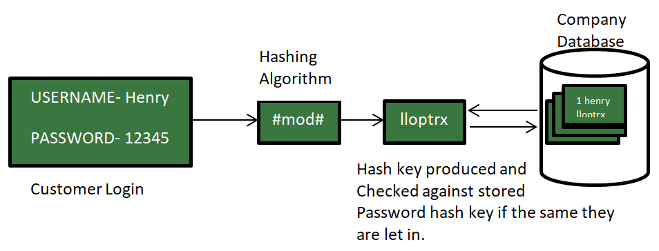
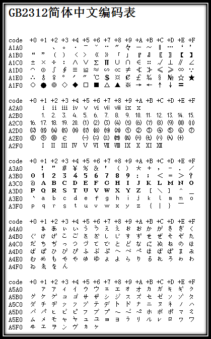
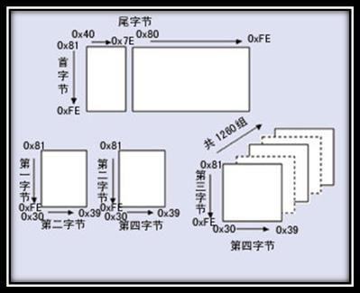

# Encodings

[TOC]

## Res
### Related Topics
↗ [Codec & Media Formats & Standards](../../../🔑%20CS%20Core/👩‍💻%20Programming%20Methodology%20and%20Languages/Codec%20&%20Media%20Formats%20&%20Standards/Codec%20&%20Media%20Formats%20&%20Standards.md)
↗ [Data Compression Technologies](../../../🔑%20CS%20Core/🦄%20Algorithm%20&%20Data%20Structure/Data%20Compression%20Technologies/Data%20Compression%20Technologies.md)
↗ [ASCII Arts](../../../🔑%20CS%20Core/🥷🏼%20Operating%20Systems%20(Engineering%20Part)/🪪%20Open%20Source%20(Free%20Software)%20Spirits%20&%20Software%20License/📌%20Awesome%20Open%20Source%20CLI%20Software/ASCII%20Arts.md)

### Other Resources
【【CTF全套120集】清华大学顶尖蓝莲花战队站教你学CTF从零基础内卷成大佬！| ctf入门| ctf比赛| ctf夺旗赛|ctfweb】 https://www.bilibili.com/video/BV1DL4y1T7v7/?p=8&share_source=copy_web&vd_source=7740584ebdab35221363fc24d1582d9

## Intro
Encoding, in an universal explanation, is the mapping between two sets. 

In CS, encoding in general maps a set of digits/value/character to another set of digits/value/character. 

In fact, the classic cryptographic methods are all based on encoding methods. That's why encoding is brought up here as a part of the Cryptography.
↗️ [Classic Cryptography](Classic Cryptography/Classic Cryptography.md).

### Encoding 🆚 Encryption & Cryptography 🆚 Hashing
#encoding #encryption #cryptography #hashing

> 🔗 https://www.geeksforgeeks.org/encryption-encoding-hashing/
#### Encoding
In the Encoding method, data is transformed from one form to another. The main aim of encoding is to transform data into a form that is readable by most of the systems or that can be used by any external process.
It can’t be used for securing data, various publicly available algorithms are used for encoding.

Encoding can be used for **reducing the size** of audio and video files. Each audio and video file format has a corresponding coder-decoder (codec) program that is used to code it into the appropriate format and then decodes for playback.
#### Encryption
Encryption in encoding technique in which message is encoded by using encryption algorithm in such a way that only authorized personnel can access the message or information.

It is a special type of encoding that is used for transferring private data, for example sending a combination of username and password over the internet for email login.

In encryption, data to be encrypted(called plain-text) is transformed using an encryption algorithm like AES encryption or RSA encryption using a secret key called cipher. The encrypted data is called cipher-text, and finally, the secret key can be used by the intended recipient to convert it back to plain-text.

There are two types of encryption algorithms – symmetric and asymmetric encryption.
In case of symmetric encryption data is encoded and decoded with the help of same key, for example AES encryption algorithm but in case of asymmetric encryption algorithm, data is encrypted with help of two keys, namely public and private key, for example. [RSA algorithm](https://www.geeksforgeeks.org/rsa-algorithm-cryptography/).

#### Hashing
In hashing, data is converted to the hash using some hashing function, which can be any number generated from string or text. Various hashing algorithms are MD5, SHA256. Data once hashed is non-reversible.

Hash function can be any function that is used to map data of arbitrary size to data of fixed size. The data structure [hash table](https://www.geeksforgeeks.org/hashing-data-structure/) is used for storing of data.

For example: When you send pictures and text messages over WhatsApp over StackOverflow(posting in questions), images are sent to different server and text is sent to a different server for efficiency purposes. So for verifying images that the images are not tampered in between data transfer over the internet, hashing algorithm like MD5 can be used.

### Encoding Schemes
The number of characters encoded has a direct relationship to the length of each representation which typically is measured as the number of bytes. **Having more characters to encode essentially means needing lengthier binary representations.**
#### Single-Byte Encoding
#### Multi-Byte Encoding

### 🤔 Escape Character & Line Break in Encodings
> 🔗 https://silaoa.github.io/2019/2019-03-20-Cygwin系列（六）：使用Cygwin常见问题及应对.html

在机械打字机时代，打字机上有个“打印头（print head）”的零部件，打印时从左往右自动移动，满一行时需要手动推到最左边，这个动作叫“回车（Carriage Return）”，同时卷轴需要向上卷使纸张上移一行，打印头相对于纸张就是下移一行，这个动作叫做“移行（Line Feed）”。

<small>打字机CR和LF键位（图片来源于网络）</small>

在计算机发明早期，电传打字机键盘上仍有这2个键位，在终端操作光标就类似于在打字机上操作打字头。ANSI标准规定，转义字符“\\r”指代CR，“\\n”指代LF，计算机系统早期广泛采用CR+LF指示换行。UNIX系统时代存储资源很贵，仅采用1个字符“\\n”指示换行，而MS-DOS出于兼容性采用“\\r\\n”指示换行，后来搬到了Windows上，而Mac系统则采用“\\r”指示换行，Linux、Cygwin照搬了“\\n”。于是，主流的几大系统上换行符各不相同。“\\r\\n”换行的文本文件在Windows显示正常，在UNIX、Linux、Cygwin中行末多出1个“^M”，“^M”指真实的Ctrl-M组合字符；“\\n”换行的文本文件在UNIX、Linux、Cygwin显示正常，在Windows中整个文件显示为一行。

Shell在逐行分析内容时，遇到“\n”，认为是一行内容结束。对于“\r\n”换行的文本，解析过程中发现，“\r”就在行末，既不是关键字，也不是命令或者参数什么的，只能当作是不识别字符了，于是报错。

解决办法，就是将文本文件中的换行符全局替换掉：
- `dos2unix dos_file`，`dos2unix`专门用于将‘\r\n’替换为‘\n’，有个与之作用相反的命令是`unix2dos`，将‘\n’替换为‘\r\n’；
- `tr -d ‘\r’ dos_file > unix_file`，`tr`本是字符“翻译（translate）”工具，其中`-d`选项专门用于删除特定字符，处理后的结果输出到`unix_file`；
- `sed -i ‘s/^M//g' dos_file`，`sed`是行编辑工具，这条命令是将每行文本的‘^M’替换为空，亦即删除‘^M’，其中‘^M’在终端的输入方式是Ctrl-V（指示后续按字面含义输入不转义），然后Ctrl-M；
- Windows平台的某些编辑器，如Notepad++、VS Code、VIM、Emacs等可以设置默认换行符，也可以在打开文件后转换为其他换行符保存；

再扯点换行符在C语言中的实现，比如`printf(“Hello, World\n”);`这个语句往标准输出`stdout`中打印一句话并使用“\n”换行，分别在Linux和Windows上编译源码并执行，好像并未出现换行符不兼容的问题。事实是，**C语言中虽然也有转义字符‘\r’、‘\n’，但并不保证与ASCII码CR、LF等价**，在文本模式下，写入‘\n’由系统底层翻译成换行符，读入文本时换行符再由系统底层翻译为‘\n’。UNIX系统正是C语言写出来的，系统底层就使用LF作换行符，系统内外表示一致不需翻译；而MS-DOS、Windows系统底层，则在系统内外需要进行‘\n’与CR+LF的转换工作。

## 🧑🏽‍💻 Common Encodings in Web
### Base64

### Base32

### URL Encoding

### JS Obfuscation
↗ [JS Obfuscation](../../../Software%20Engineering/Web%20Development/🖥️%20Web%20FrontEnd%20Dev/⬆️%20Frontend%20Optimization/JS%20Obfuscation.md)
#### JSfuck
#### Jother
#### aaencode

### 📚 More Encoding Methods?
More of this part is included in ↗️ [CTF /Crypto](../../../CyberSecurity/🏰%20Cybersecurity%20Basics%20&%20InfoSec/CTF%20&%20AWD/Crypto/Crypto.md)

## 🔠 Charset & Character Encoding
A charset is a set of characters.  Usually a new charset comes along with a new encoding mechanism.

> 🔗 http://en.wikipedia.org/wiki/Character_encoding
>
> Character encoding is the process of assigning numbers to graphical characters, especially the written characters of human language, allowing them to be stored, transmitted, and transformed using digital computers. The numerical values that make up a character encoding are known as "code points" and collectively comprise a "code space", a "code page", or a "character map".

Character encoding or just simply encoding in CS refers to the mapping processing /mechanism from a charset to numerical values, which is to be used in digital devices (computer) for communication /storages / etc.. 

A **"code point**" is an integer reference to a particular character.

### EBCDIC
> .... To maintain compatibility with earlier computers and peripheral equipment, the IBM engineers decided that it would be best to simply expand BCD from 6 bits to 8 bits. Accordingly, this new code was called Extended Binary Coded Decimal Interchange Code (EBCDIC). IBM continues to use EBCDIC in IBM mainframe and midrange computer systems; however, IBM’s AIX operating system (found on the RS/6000 and its successors) and operating systems for the IBM PC use ASCII.

### [ASCII](https://www.ascii-code.com)
**ASCII**, stands for American Standard Code for Information Interchange. It's a **7-bit character code** where every single bit represents a unique character. 

Besides ASCII code, there are various extended ASCII which use 8-bit cahracter encoding. 

**Windows-1252** is probably the most-used 8-bit character encoding in the world. 

On [this webpage](https://www.ascii-code.com) you will find 8 bits, 256 characters, **ASCII table according to Windows-1252** (code page 1252) which is a superset of ISO 8859-1 in terms of printable characters. In the range 128 to 159 (hex 80 to 9F), ISO/IEC 8859-1 has invisible control characters, while Windows-1252 has writable characters. 

Find other extended ASCII codes on ↗️ https://www.ascii-code.com

### Extended ASCII
#### EASCII
#### ANSI (or formally, Windows-1252)
> 🔗 https://stackoverflow.com/questions/701882/what-is-ansi-format

ANSI encoding is a slightly generic term used to refer to the standard code page on a system, usually Windows. It is more properly referred to as [Windows-1252](http://en.wikipedia.org/wiki/Windows-1252) on Western/U.S. systems. (It can represent certain other [Windows code pages](http://en.wikipedia.org/wiki/Windows_code_page) on other systems.) This is essentially an [extension of the ASCII character set](http://en.wikipedia.org/wiki/Extended_ASCII) in that **it includes all the ASCII characters with an additional 128 character codes**. This difference is due to the fact that "ANSI" encoding is 8-bit rather than 7-bit as ASCII is (ASCII is almost always encoded nowadays as 8-bit bytes with the [MSB](https://en.wikipedia.org/wiki/Most_significant_bit) set to 0). See the article for an explanation of why this encoding is usually referred to as ANSI.

The name "ANSI" is a misnomer, since it doesn't correspond to any actual ANSI standard, but the name has stuck. ANSI is not the same as UTF-8.

### GBxxx
#### GB2312-1980
计算机发明之处及后面很长一段时间，只用应用于美国及西方一些发达国家，ASCII能够很好满足用户的需求。但是当天朝也有了计算机之后，为了显示中文，必须设计一套编码规则用于将汉字转换为计算机可以接受的数字系统的数。

天朝专家把那些127号之后的奇异符号们（即EASCII）取消掉，规定：一个小于127的字符的意义与原来相同，但两个大于127的字符连在一起时，就表示一个汉字，前面的一个字节（高字节）从0xA1用到 0xF7，后面一个字节（低字节）从0xA1到0xFE，这样我们就可以组合出大约7000多个简体汉字了。在这些编码里，还把数学符号、罗马希腊的 字母、日文的假名们都编进去了，连在ASCII里本来就有的数字、标点、字母都统统重新编了**两个字节长的编码**，这就是常说的"全角"字符，而原来在127号以下的那些就叫"半角"字符了。

<small>GB2312编码表的开始部分</small>
#### GBK
由于GB 2312-80只收录6763个汉字，有不少汉字，如部分在GB 2312-80推出以后才简化的汉字（如"啰"），部分人名用字（如中国前总理朱镕基的"镕"字），台湾及香港使用的繁体字，日语及朝鲜语汉字等，并未有收录在内。于是厂商微软利用GB 2312-80未使用的编码空间，收录GB 13000.1-93全部字符制定了GBK编码。根据微软资料，GBK是对GB2312-80的扩展，也就是CP936字码表 (Code Page 936)的扩展（之前CP936和GB 2312-80一模一样），最早实现于Windows 95简体中文版。虽然GBK收录GB 13000.1-93的全部字符，但编码方式并不相同。GBK自身并非国家标准，只是曾由国家技术监督局标准化司、电子工业部科技与质量监督司公布为"技术规范指导性文件"。原始GB13000一直未被业界采用，后续国家标准GB18030技术上兼容GBK而非GB13000。
#### GB 18030
GB 18030，全称：国家标准GB 18030-2005《信息技术 中文编码字符集》，是中华人民共和国现时最新的内码字集，是GB 18030-2000《信息技术 信息交换用汉字编码字符集 基本集的扩充》的修订版。与GB 2312-1980完全兼容，与GBK基本兼容，支持GB 13000及Unicode的全部统一汉字，共收录汉字70244个。GB 18030主要有以下特点： 
- 与UTF-8相同，采用多字节编码，**每个字可以由1个、2个或4个字节组成**。 
- 编码空间庞大，最多可定义161万个字符。
- 支持中国国内少数民族的文字，不需要动用造字区。
- 汉字收录范围包含繁体汉字以及日韩汉字。

<small>GB18030编码总体结构</small>

本规格的初版使中华人民共和国信息产业部电子工业标准化研究所起草，由国家质量技术监督局于2000年3月17日发布。现行版本为国家质量监督检验总局和中国国家标准化管理委员会于2005年11月8日发布，2006年5月1日实施。此规格为在中国境内所有软件产品支持的强制规格。

### BIG5
Big5，又称为大五码或五大码，是使用繁体中文（正体中文）社区中最常用的电脑汉字字符集标准，共收录13,060个汉字。中文码分为内码及交换码两类，Big5属中文内码，知名的中文交换码有CCCII、CNS11643。Big5虽普及于台湾、香港与澳门等繁体中文通行区，但长期以来并非当地的国家标准，而只是业界标准。倚天中文系统、Windows等主要系统的字符集都是以Big5为基准，但厂商又各自增加不同的造字与造字区，派生成多种不同版本。2003年，Big5被收录到CNS11643中文标准交换码的附录当中，取得了较正式的地位。这个最新版本被称为Big5-2003。 

**Big5码是一套双字节字符集，使用了双八码存储方法，以两个字节来安放一个字。** 第一个字节称为"高位字节"，第二个字节称为"低位字节"。"高位字节"使用了0x81-0xFE，"低位字节"使用了0x40-0x7E，及0xA1-0xFE。

### Unicode
[Unicode](https://home.unicode.org) is a character set. It defines that a character can be represented by 1, 2, 4bytes. While another different character set, ASCII, defines that a character represented by 1 bytes, and GB2312 defines that a character represented by 2 bytes. 

Unicode is now the universal standard for encoding all human languages. And yes, it even includes [emojis](https://unicode.org/emoji/charts/full-emoji-list.html) 😅🤣🤺👋🏻🙏🏿💃🏻🙉🎳🏂🍑🇦🇷

> **About the Unicode Consortium**
>
> The Unicode Consortium is the standards body for the internationalization of software and services.
>
> - Founded in 1988, incorporated in 1991
> - Public benefit, 501(c)3 non-profit organization
> - Open source standards, data, and software development
> - Orchestrates the contributions of 100s of professionals, expert volunteers, and language experts
> - 30+ [organizational members](https://home.unicode.org/membership/members/) across corporate, academic, and governmental institutions
> - Funded by [membership dues](https://home.unicode.org/membership/membership-levels/) and [donations](https://home.unicode.org/support-unicode/)
>
> 🔗 more on https://home.unicode.org/about-unicode/

| Unicode Character | code point |
| ----------------- | ---------- |
| A                 | U+0041     |
| a                 | U+0061     |
| 0                 | U+0030     |
| 9                 | U+0039     |
| !                 | U+0021     |
| Ø                 | U+00D8     |
| ڃ                 | U+0683     |
| ಚ                 | U+0C9A     |
| 𠜎                | U+2070E    |
| 😁                 | U+1F601    |

Unicode 使用4字节的数字来表达每个字母、符号，或者表意文字(ideograph)。每个数字代表唯一的至少在某种语言中使用的符号。（并不是所有的数字都用上了，但是总数已经超过了65535，所以2个字节的数字是不够用的。）被几种语言共用的字符通常使用相同的数字来编码，除非存在一个在理的语源学(etymological)理由使不这样做。不考虑这种情况的话，每个字符对应一个数字，每个数字对应一个字符。即不存在二义性。不再需要记录"模式"了。U+0041总是代表'A'，即使这种语言没有'A'这个字符。

Unicode是一套字符集，在其之下有不同的编码方案。UTF-32/ UTF-16/ UTF-8是其中三种字符编码方案。
#### UTF-8 (8-bit Unicode Transformation Format)
> 🔗 https://blog.hubspot.com/website/what-is-utf-8

UTF-8 stands for 8-bit Unicode Transformation Format. It is **another encoding scheme for Unicode which employs a variable length of bytes to encode**. While it uses a single byte to encode characters generally, it can use a higher number of bytes if needed, thus saving space. Remember that one byte consists of eight bits, hence the “-8” in its name.

More specifically, UTF-8 converts a code point (which represents a single character in Unicode) into a set of one to four bytes. The first 128 characters in the Unicode library — the characters we saw in ASCII — are represented as one byte. Characters that appear later in the Unicode library are encoded as two-byte, three-byte, and eventually four-byte binary units.

| UNICODE CHARACTER | CODE POINT | UTF-8 BINARY ENCODING               |
| ----------------- | ---------- | ----------------------------------- |
| A                 | U+0041     | 01000001                            |
| a                 | U+0061     | 01100001                            |
| 0                 | U+0030     | 00110000                            |
| 9                 | U+0039     | 00111001                            |
| !                 | U+0021     | 00100001                            |
| Ø                 | U+00D8     | 11000011 10011000                   |
| ڃ                 | U+0683     | 11011010 10000011                   |
| ಚ                 | U+0C9A     | 11100000 10110010 10011010          |
| 𠜎                | U+2070E    | 11110000 10100000 10011100 10001110 |
| 😁                 | U+1F601    | 11110000 10011111 10011000 10000001 |
#### UTF-16 (16-bit Unicode Transformation Format)
#### UTF-32 (32-bit Unicode Transformation Format)

[Guide to Character Encoding]: https://www.baeldung.com/java-char-encoding
[字符集和字符编码]: https://www.cnblogs.com/notbecoder/p/4840783.html
[字符集和字符编码（Charset & Encoding）]: https://www.runoob.com/w3cnote/charset-encoding.html

## 🧮 Numeral System & Number Encoding
> 🔗 https://en.wikipedia.org/wiki/List_of_numeral_systems

There are many different [numeral systems](https://en.wikipedia.org/wiki/Numeral_system "Numeral system"), that is, [writing systems](https://en.wikipedia.org/wiki/Writing_system "Writing system") for expressing [numbers](https://en.wikipedia.org/wiki/Numbers "Numbers").

### Positional Notation (Place-Value Notation)

#### Positional Notation Systems
1. Binary Numbering Systems
2. Decimal Numbering Systems
3. Octal Numbering Systems
4. Hexadecimal Numbering Systems
#### 💡 Converting Between Bases
##### 1️⃣ Successful Subtraction Methods
##### 2️⃣ Division Remainder Methods
#### \* Non-positional notation
All known numeral systems developed before the [Babylonian numerals](https://en.wikipedia.org/wiki/Babylonian_numerals "Babylonian numerals") are non-positional, as are many developed later, such as the [Roman numerals](https://en.wikipedia.org/wiki/Roman_numerals "Roman numerals"). The French Cistercian monks created [their own numeral system.](https://en.wikipedia.org/wiki/Cistercian_numerals "Cistercian numerals")

### BCD (Binary-coded Decimal)
> 🔗 https://en.wikipedia.org/wiki/Binary-coded_decimal

In computing and electronic systems, **binary-coded decimal** (**BCD**) is a class of binary encodings of decimal numbers where each digit is represented by a fixed number of bits, usually four or eight. Sometimes, special bit patterns are used for a [sign](https://en.wikipedia.org/wiki/Sign_(mathematics) "Sign (mathematics)") or other indications (e.g. error or overflow).

### RBC (Gray Code)
> 🔗 https://en.wikipedia.org/wiki/Gray_code

The **reflected binary code** (**RBC**), also known as **reflected binary** (**RB**) or **Gray code** after [Frank Gray](https://en.wikipedia.org/wiki/Frank_Gray_(researcher) "Frank Gray (researcher)"), is an ordering of the binary numeral system such that two successive values differ in only one bit (binary digit).

### Precision Number /Float Type
> - Floating-point overflow and underflow can cause programs to crash.
> - **Overflow** occurs when there is no room to store the high-order bits resulting from a calculation.
> - **Underflow** occurs when a value is too small to store, possibly resulting in division by zero (P).

#### Precision Number Intro

#### 👉 Float Data Type (Single-precision Floating-point Format)

> 🔗 https://polarisxu.studygolang.com/posts/basic/diagram-float-point/

#### 👉 Double Data Type (Double-precision Floating-point Format)

## Ref
[👍 15 张图带你深入理解浮点数]: https://polarisxu.studygolang.com/posts/basic/diagram-float-point/
[简单理解float和double、单精度和双精度 | CSDN]: https://blog.csdn.net/x18094/article/details/84147423

[一文读懂 IEEE754 浮点数的表示方法 | CSDN]: https://blog.csdn.net/K346K346/article/details/50487127

[为什么单精度浮点数的阶码取值范围是1-254 | CSDN]: https://blog.csdn.net/weiliangliang111/article/details/51156038

[👍 字符编码笔记：ASCII，Unicode 和 UTF-8 | 阮一峰]: http://www.ruanyifeng.com/blog/2007/10/ascii_unicode_and_utf-8.html
- [The Absolute Minimum Every Software Developer Absolutely, Positively Must Know About Unicode and Character Sets](http://www.joelonsoftware.com/articles/Unicode.html)（关于字符集的最基本知识）
- [谈谈Unicode编码](http://www.pconline.com.cn/pcedu/empolder/gj/other/0505/616631.html)
- [RFC3629：UTF-8, a transformation format of ISO 10646](http://www.ietf.org/rfc/rfc3629.txt)（如果实现UTF-8的规定）
