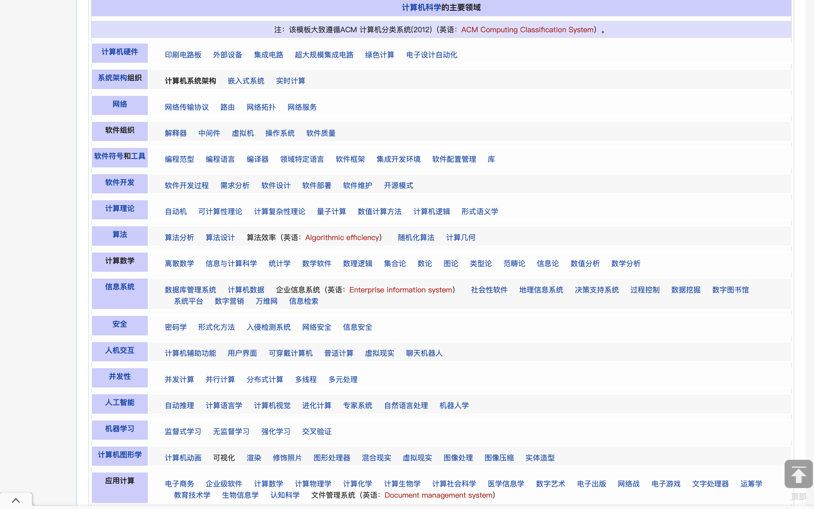

# 计算机科学的主要领域

  

| [计算机科学](https://www.wanweibaike.net/wiki-%E8%AE%A1%E7%AE%97%E6%9C%BA%E7%A7%91%E5%AD%A6 "计算机科学")的主要领域 |
| ------------------------------------------------------------ |
| 注：该模板大致遵循ACM 计算机分类系统(2012)（英语：ACM Computing Classification System）。 |

| **主要种类**                                                 |                                                              |                                                              |                                                              |                                                              |                                                              |                                                              |                                                              |
| ------------------------------------------------------------ | ------------------------------------------------------------ | ------------------------------------------------------------ | ------------------------------------------------------------ | ------------------------------------------------------------ | ------------------------------------------------------------ | ------------------------------------------------------------ | ------------------------------------------------------------ |
| **[计算机硬件](https://www.wanweibaike.net/wiki-%E8%AE%A1%E7%AE%97%E6%9C%BA%E7%A1%AC%E4%BB%B6 "计算机硬件")** | [印刷电路板](https://www.wanweibaike.net/wiki-%E5%8D%B0%E5%88%B7%E7%94%B5%E8%B7%AF%E6%9D%BF "印刷电路板") | [外部设备](https://www.wanweibaike.net/wiki-%E5%A4%96%E9%83%A8%E8%AE%BE%E5%A4%87 "外部设备") | [集成电路](https://www.wanweibaike.net/wiki-%E9%9B%86%E6%88%90%E7%94%B5%E8%B7%AF "集成电路") | [超大规模集成电路](https://www.wanweibaike.net/wiki-%E8%B6%85%E5%A4%A7%E8%A7%84%E6%A8%A1%E9%9B%86%E6%88%90%E7%94%B5%E8%B7%AF "超大规模集成电路") | [绿色计算](https://www.wanweibaike.net/wiki-%E7%BB%BF%E8%89%B2%E8%AE%A1%E7%AE%97 "绿色计算") | [电子设计自动化](https://www.wanweibaike.net/wiki-%E9%9B%BB%E5%AD%90%E8%A8%AD%E8%A8%88%E8%87%AA%E5%8B%95%E5%8C%96 "电子设计自动化") |                                                              |
| **[系统架构](https://www.wanweibaike.net/wiki-%E7%B3%BB%E7%BB%9F%E6%9E%B6%E6%9E%84 "系统架构")组织** | 计算机系统架构                                               | [嵌入式系统](https://www.wanweibaike.net/wiki-%E5%B5%8C%E5%85%A5%E5%BC%8F%E7%B3%BB%E7%BB%9F "嵌入式系统") | [实时计算](https://www.wanweibaike.net/wiki-%E5%AE%9E%E6%97%B6%E8%AE%A1%E7%AE%97 "实时计算") |                                                              |                                                              |                                                              |                                                              |
| **[网络](https://www.wanweibaike.net/wiki-%E8%AE%A1%E7%AE%97%E6%9C%BA%E7%BD%91%E7%BB%9C "计算机网络")** | [网络传输协议](https://www.wanweibaike.net/wiki-%E7%BD%91%E7%BB%9C%E4%BC%A0%E8%BE%93%E5%8D%8F%E8%AE%AE "网络传输协议") | [路由](https://www.wanweibaike.net/wiki-%E8%B7%AF%E7%94%B1 "路由") | [网络拓扑](https://www.wanweibaike.net/wiki-%E7%BD%91%E7%BB%9C%E6%8B%93%E6%89%91 "网络拓扑") | [网络服务](https://www.wanweibaike.net/wiki-%E7%BD%91%E7%BB%9C%E6%9C%8D%E5%8A%A1 "网络服务") |                                                              |                                                              |                                                              |
| **软件组织**                                                 | [解释器](https://www.wanweibaike.net/wiki-%E7%9B%B4%E8%AD%AF%E5%99%A8 "解释器") | [中间件](https://www.wanweibaike.net/wiki-%E4%B8%AD%E9%97%B4%E4%BB%B6 "中间件") | [虚拟机](https://www.wanweibaike.net/wiki-%E8%99%9B%E6%93%AC%E6%A9%9F%E5%99%A8 "虚拟机") | [操作系统](https://www.wanweibaike.net/wiki-%E6%93%8D%E4%BD%9C%E7%B3%BB%E7%BB%9F "操作系统") | [软件质量](https://www.wanweibaike.net/wiki-%E8%BD%AF%E4%BB%B6%E8%B4%A8%E9%87%8F "软件质量") |                                                              |                                                              |
| **[软件符号](https://www.wanweibaike.net/wiki-%E7%A8%8B%E5%BC%8F%E8%AA%9E%E8%A8%80%E7%90%86%E8%AB%96 "编程语言理论")和[工具](https://www.wanweibaike.net/wiki-%E8%BD%AF%E4%BB%B6%E5%BC%80%E5%8F%91%E5%B7%A5%E5%85%B7 "软件开发工具")** | [编程范型](https://www.wanweibaike.net/wiki-%E7%BC%96%E7%A8%8B%E8%8C%83%E5%9E%8B "编程范型") | [编程语言](https://www.wanweibaike.net/wiki-%E7%BC%96%E7%A8%8B%E8%AF%AD%E8%A8%80 "编程语言") | [编译器](https://www.wanweibaike.net/wiki-%E7%B7%A8%E8%AD%AF%E5%99%A8 "编译器") | [领域特定语言](https://www.wanweibaike.net/wiki-%E9%A2%86%E5%9F%9F%E7%89%B9%E5%AE%9A%E8%AF%AD%E8%A8%80 "领域特定语言") | [软件框架](https://www.wanweibaike.net/wiki-%E8%BB%9F%E9%AB%94%E6%A1%86%E6%9E%B6 "软件框架") | [集成开发环境](https://www.wanweibaike.net/wiki-%E9%9B%86%E6%88%90%E5%BC%80%E5%8F%91%E7%8E%AF%E5%A2%83 "集成开发环境") | [软件配置管理](https://www.wanweibaike.net/wiki-%E8%BD%AF%E4%BB%B6%E9%85%8D%E7%BD%AE%E7%AE%A1%E7%90%86 "软件配置管理") |
|                                                              | [库](https://www.wanweibaike.net/wiki-%E5%87%BD%E5%BC%8F%E5%BA%AB "库") |                                                              |                                                              |                                                              |                                                              |                                                              |                                                              |
| **[软件开发](https://www.wanweibaike.net/wiki-%E8%BD%AF%E4%BB%B6%E5%BC%80%E5%8F%91 "软件开发")** | [软件开发过程](https://www.wanweibaike.net/wiki-%E8%BD%AF%E4%BB%B6%E5%BC%80%E5%8F%91%E8%BF%87%E7%A8%8B "软件开发过程") | [需求分析](https://www.wanweibaike.net/wiki-%E9%9C%80%E6%B1%82%E5%88%86%E6%9E%90 "需求分析") | [软件设计](https://www.wanweibaike.net/wiki-%E8%BD%AF%E4%BB%B6%E8%AE%BE%E8%AE%A1 "软件设计") | [软件部署](https://www.wanweibaike.net/wiki-%E8%BD%AF%E4%BB%B6%E9%83%A8%E7%BD%B2 "软件部署") | [软件维护](https://www.wanweibaike.net/wiki-%E8%BB%9F%E9%AB%94%E7%B6%AD%E8%AD%B7 "软件维护") | [开源模式](https://www.wanweibaike.net/wiki-%E5%BC%80%E6%BA%90%E8%BD%AF%E4%BB%B6 "开源软件") |                                                              |
| **[算法](https://www.wanweibaike.net/wiki-%E7%AE%97%E6%B3%95 "算法")** | [算法分析](https://www.wanweibaike.net/wiki-%E7%AE%97%E6%B3%95%E5%88%86%E6%9E%90 "算法分析") | [算法设计](https://www.wanweibaike.net/wiki-%E7%AE%97%E6%B3%95%E8%AE%BE%E8%AE%A1 "算法设计") | 算法效率（英语：Algorithmic efficiency）                     | [随机化算法](https://www.wanweibaike.net/wiki-%E9%9A%8F%E6%9C%BA%E5%8C%96%E7%AE%97%E6%B3%95 "随机化算法") | [计算几何](https://www.wanweibaike.net/wiki-%E8%AE%A1%E7%AE%97%E5%87%A0%E4%BD%95 "计算几何") |                                                              |                                                              |
| **计算数学**                                                 | [离散数学](https://www.wanweibaike.net/wiki-%E7%A6%BB%E6%95%A3%E6%95%B0%E5%AD%A6 "离散数学") | [信息与计算科学](https://www.wanweibaike.net/wiki-%E4%BF%A1%E6%81%AF%E4%B8%8E%E8%AE%A1%E7%AE%97%E7%A7%91%E5%AD%A6 "信息与计算科学") | [统计学](https://www.wanweibaike.net/wiki-%E7%BB%9F%E8%AE%A1%E5%AD%A6 "统计学") | [数学软件](https://www.wanweibaike.net/wiki-%E6%95%B0%E5%AD%A6%E8%BD%AF%E4%BB%B6 "数学软件") | [数理逻辑](https://www.wanweibaike.net/wiki-%E6%95%B0%E7%90%86%E9%80%BB%E8%BE%91 "数理逻辑") | [集合论](https://www.wanweibaike.net/wiki-%E9%9B%86%E5%90%88%E8%AE%BA "集合论") | [数论](https://www.wanweibaike.net/wiki-%E6%95%B0%E8%AE%BA "数论") |
|                                                              | [图论](https://www.wanweibaike.net/wiki-%E5%9B%BE%E8%AE%BA "图论") | [类型论](https://www.wanweibaike.net/wiki-%E7%B1%BB%E5%9E%8B%E8%AE%BA "类型论") | [范畴论](https://www.wanweibaike.net/wiki-%E8%8C%83%E7%95%B4%E8%AE%BA "范畴论") | [信息论](https://www.wanweibaike.net/wiki-%E4%BF%A1%E6%81%AF%E8%AE%BA "信息论") | [数值分析](https://www.wanweibaike.net/wiki-%E6%95%B0%E5%80%BC%E5%88%86%E6%9E%90 "数值分析") | [数学分析](https://www.wanweibaike.net/wiki-%E6%95%B0%E5%AD%A6%E5%88%86%E6%9E%90 "数学分析") |                                                              |
| **[安全](https://www.wanweibaike.net/wiki-%E8%AE%A1%E7%AE%97%E6%9C%BA%E5%AE%89%E5%85%A8 "计算机安全")** | [密码学](https://www.wanweibaike.net/wiki-%E5%AF%86%E7%A0%81%E5%AD%A6 "密码学") | [形式化方法](https://www.wanweibaike.net/wiki-%E5%BD%A2%E5%BC%8F%E5%8C%96%E6%96%B9%E6%B3%95 "形式化方法") | [入侵检测系统](https://www.wanweibaike.net/wiki-%E5%85%A5%E4%BE%B5%E6%A3%80%E6%B5%8B%E7%B3%BB%E7%BB%9F "入侵检测系统") | [网络安全](https://www.wanweibaike.net/wiki-%E7%BD%91%E7%BB%9C%E5%AE%89%E5%85%A8 "网络安全") | [信息安全](https://www.wanweibaike.net/wiki-%E4%BF%A1%E6%81%AF%E5%AE%89%E5%85%A8 "信息安全") |                                                              |                                                              |
| **[人机交互](https://www.wanweibaike.net/wiki-%E4%BA%BA%E6%9C%BA%E4%BA%A4%E4%BA%92 "人机交互")** | [计算机辅助功能](https://www.wanweibaike.net/wiki-%E8%AE%A1%E7%AE%97%E6%9C%BA%E8%BE%85%E5%8A%A9%E5%8A%9F%E8%83%BD "计算机辅助功能") | [用户界面](https://www.wanweibaike.net/wiki-%E7%94%A8%E6%88%B7%E7%95%8C%E9%9D%A2 "用户界面") | [可穿戴计算机](https://www.wanweibaike.net/wiki-%E5%8F%AF%E7%A9%BF%E6%88%B4%E8%AE%A1%E7%AE%97%E6%9C%BA "可穿戴计算机") | [普适计算](https://www.wanweibaike.net/wiki-%E6%99%AE%E9%80%82%E8%AE%A1%E7%AE%97 "普适计算") | [虚拟现实](https://www.wanweibaike.net/wiki-%E8%99%9A%E6%8B%9F%E7%8E%B0%E5%AE%9E "虚拟现实") | [聊天机器人](https://www.wanweibaike.net/wiki-%E8%81%8A%E5%A4%A9%E6%A9%9F%E5%99%A8%E4%BA%BA "聊天机器人") |                                                              |
| **[并发性](https://www.wanweibaike.net/wiki-%E5%B9%B6%E5%8F%91%E6%80%A7 "并发性")** | [并发计算](https://www.wanweibaike.net/wiki-%E5%B9%B6%E5%8F%91%E8%AE%A1%E7%AE%97 "并发计算") | [并行计算](https://www.wanweibaike.net/wiki-%E5%B9%B6%E8%A1%8C%E8%AE%A1%E7%AE%97 "并行计算") | [分布式计算](https://www.wanweibaike.net/wiki-%E5%88%86%E5%B8%83%E5%BC%8F%E8%AE%A1%E7%AE%97 "分布式计算") | [多线程](https://www.wanweibaike.net/wiki-%E5%A4%9A%E7%BA%BF%E7%A8%8B "多线程") | [多元处理](https://www.wanweibaike.net/wiki-%E5%A4%9A%E5%85%83%E8%99%95%E7%90%86 "多元处理") |                                                              |                                                              |
| **[人工智能](https://www.wanweibaike.net/wiki-%E4%BA%BA%E5%B7%A5%E6%99%BA%E8%83%BD "人工智能")** | [自动推理](https://www.wanweibaike.net/wiki-%E8%87%AA%E5%8A%A8%E6%8E%A8%E7%90%86 "自动推理") | [计算语言学](https://www.wanweibaike.net/wiki-%E8%AE%A1%E7%AE%97%E8%AF%AD%E8%A8%80%E5%AD%A6 "计算语言学") | [计算机视觉](https://www.wanweibaike.net/wiki-%E8%AE%A1%E7%AE%97%E6%9C%BA%E8%A7%86%E8%A7%89 "计算机视觉") | [进化计算](https://www.wanweibaike.net/wiki-%E8%BF%9B%E5%8C%96%E8%AE%A1%E7%AE%97 "进化计算") | [专家系统](https://www.wanweibaike.net/wiki-%E4%B8%93%E5%AE%B6%E7%B3%BB%E7%BB%9F "专家系统") | [自然语言处理](https://www.wanweibaike.net/wiki-%E8%87%AA%E7%84%B6%E8%AF%AD%E8%A8%80%E5%A4%84%E7%90%86 "自然语言处理") | [机器人学](https://www.wanweibaike.net/wiki-%E6%9C%BA%E5%99%A8%E4%BA%BA%E5%AD%A6 "机器人学") |
| **[机器学习](https://www.wanweibaike.net/wiki-%E6%9C%BA%E5%99%A8%E5%AD%A6%E4%B9%A0 "机器学习")** | [监督式学习](https://www.wanweibaike.net/wiki-%E7%9B%A3%E7%9D%A3%E5%BC%8F%E5%AD%B8%E7%BF%92 "监督式学习") | [无监督学习](https://www.wanweibaike.net/wiki-%E7%84%A1%E7%9B%A3%E7%9D%A3%E5%AD%B8%E7%BF%92 "无监督学习") | [强化学习](https://www.wanweibaike.net/wiki-%E5%BC%BA%E5%8C%96%E5%AD%A6%E4%B9%A0 "强化学习") | [交叉验证](https://www.wanweibaike.net/wiki-%E4%BA%A4%E5%8F%89%E9%A9%97%E8%AD%89 "交叉验证") |                                                              |                                                              |                                                              |
| **[计算机图形学](https://www.wanweibaike.net/wiki-%E8%AE%A1%E7%AE%97%E6%9C%BA%E5%9B%BE%E5%BD%A2%E5%AD%A6 "计算机图形学")** |                                                              |                                                              |                                                              |                                                              |                                                              |                                                              |                                                              |
| **应用计算**                                                 |                                                              |                                                              |                                                              |                                                              |                                                              |                                                              |                                                              |
| **[计算理论](https://www.wanweibaike.net/wiki-%E8%AE%A1%E7%AE%97%E7%90%86%E8%AE%BA "计算理论")** | [自动机](https://www.wanweibaike.net/wiki-%E8%87%AA%E5%8A%A8%E6%9C%BA "自动机") | [可计算性理论](https://www.wanweibaike.net/wiki-%E5%8F%AF%E8%AE%A1%E7%AE%97%E6%80%A7 "可计算性") | [计算复杂性理论](https://www.wanweibaike.net/wiki-%E8%AE%A1%E7%AE%97%E5%A4%8D%E6%9D%82%E6%80%A7%E7%90%86%E8%AE%BA "计算复杂性理论") | [量子计算](https://www.wanweibaike.net/wiki-%E9%87%8F%E5%AD%90%E8%AE%A1%E7%AE%97 "量子计算") | [数值计算方法](https://www.wanweibaike.net/wiki-%E6%95%B0%E5%80%BC%E8%AE%A1%E7%AE%97%E6%96%B9%E6%B3%95 "数值计算方法") | [计算机逻辑](https://www.wanweibaike.net/wiki-%E8%AE%A1%E7%AE%97%E6%9C%BA%E9%80%BB%E8%BE%91 "计算机逻辑") | [形式语义学](https://www.wanweibaike.net/wiki-%E5%BD%A2%E5%BC%8F%E8%AF%AD%E4%B9%89%E5%AD%A6 "形式语义学") |
| **[信息系统](https://www.wanweibaike.net/wiki-%E4%BF%A1%E6%81%AF%E7%B3%BB%E7%BB%9F "信息系统")** | [数据库管理系统](https://www.wanweibaike.net/wiki-%E6%95%B0%E6%8D%AE%E5%BA%93%E7%AE%A1%E7%90%86%E7%B3%BB%E7%BB%9F "数据库管理系统") | [计算机数据](https://www.wanweibaike.net/wiki-%E9%9B%BB%E8%85%A6%E6%95%B8%E6%93%9A%E5%AD%98%E8%B2%AF%E5%99%A8 "计算机数据存贮器") | 企业信息系统（英语：Enterprise information system）          | [社会性软件](https://www.wanweibaike.net/wiki-%E7%A4%BE%E4%BC%9A%E6%80%A7%E8%BD%AF%E4%BB%B6 "社会性软件") | [地理信息系统](https://www.wanweibaike.net/wiki-%E5%9C%B0%E7%90%86%E4%BF%A1%E6%81%AF%E7%B3%BB%E7%BB%9F "地理信息系统") | [决策支持系统](https://www.wanweibaike.net/wiki-%E5%86%B3%E7%AD%96%E6%94%AF%E6%8C%81%E7%B3%BB%E7%BB%9F "决策支持系统") | [过程控制](https://www.wanweibaike.net/wiki-%E8%BF%87%E7%A8%8B%E6%8E%A7%E5%88%B6 "过程控制") |

|      |                                                              |                                                              |                                                              |                                                              |                                                              |
| ---- | ------------------------------------------------------------ | ------------------------------------------------------------ | ------------------------------------------------------------ | ------------------------------------------------------------ | ------------------------------------------------------------ |
|      | [数据挖掘](https://www.wanweibaike.net/wiki-%E6%95%B0%E6%8D%AE%E6%8C%96%E6%8E%98 "数据挖掘") | [数字图书馆](https://www.wanweibaike.net/wiki-%E6%95%B8%E4%BD%8D%E5%9C%96%E6%9B%B8%E9%A4%A8 "数字图书馆") | [系统平台](https://www.wanweibaike.net/wiki-%E7%B3%BB%E7%BB%9F%E5%B9%B3%E5%8F%B0 "系统平台") | [数字营销](https://www.wanweibaike.net/wiki-%E6%95%B8%E4%BD%8D%E8%A1%8C%E9%8A%B7 "数字营销") | [万维网](https://www.wanweibaike.net/wiki-%E4%B8%87%E7%BB%B4%E7%BD%91 "万维网") |
|      | [信息检索](https://www.wanweibaike.net/wiki-%E4%BF%A1%E6%81%AF%E6%AA%A2%E7%B4%A2 "信息检索") |                                                              |                                                              |                                                              |                                                              |
|      |                                                              |                                                              |                                                              |                                                              |                                                              |

[计算机图形学](https://www.wanweibaike.net/wiki-%E8%AE%A1%E7%AE%97%E6%9C%BA%E5%9B%BE%E5%BD%A2%E5%AD%A6 "计算机图形学")

-   [计算机动画](https://www.wanweibaike.net/wiki-%E8%AE%A1%E7%AE%97%E6%9C%BA%E5%8A%A8%E7%94%BB "计算机动画")
 -   可视化
 -   [渲染](https://www.wanweibaike.net/wiki-%E6%B8%B2%E6%9F%93 "渲染")
 -   [修饰照片](https://www.wanweibaike.net/wiki-%E4%BF%AE%E9%A3%BE%E7%85%A7%E7%89%87 "修饰照片")
 -   [图形处理器](https://www.wanweibaike.net/wiki-%E5%9C%96%E5%BD%A2%E8%99%95%E7%90%86%E5%99%A8 "图形处理器")
 -   [混合现实](https://www.wanweibaike.net/wiki-%E6%B7%B7%E5%90%88%E7%8E%B0%E5%AE%9E "混合现实")
 -   [虚拟现实](https://www.wanweibaike.net/wiki-%E8%99%9A%E6%8B%9F%E7%8E%B0%E5%AE%9E "虚拟现实")
 -   [图像处理](https://www.wanweibaike.net/wiki-%E5%9B%BE%E5%83%8F%E5%A4%84%E7%90%86 "图像处理")
 -   [图像压缩](https://www.wanweibaike.net/wiki-%E5%9B%BE%E5%83%8F%E5%8E%8B%E7%BC%A9 "图像压缩")
 -   [实体造型](https://www.wanweibaike.net/wiki-%E5%AE%9E%E4%BD%93%E9%80%A0%E5%9E%8B "实体造型")

应用计算

-   [电子商务](https://www.wanweibaike.net/wiki-%E7%94%B5%E5%AD%90%E5%95%86%E5%8A%A1 "电子商务")
 -   [企业级软件](https://www.wanweibaike.net/wiki-%E4%BC%81%E4%B8%9A%E7%BA%A7%E8%BD%AF%E4%BB%B6 "企业级软件")
 -   [计算数学](https://www.wanweibaike.net/wiki-%E8%AE%A1%E7%AE%97%E6%95%B0%E5%AD%A6 "计算数学")
 -   [计算物理学](https://www.wanweibaike.net/wiki-%E8%AE%A1%E7%AE%97%E7%89%A9%E7%90%86%E5%AD%A6 "计算物理学")
 -   [计算化学](https://www.wanweibaike.net/wiki-%E8%AE%A1%E7%AE%97%E5%8C%96%E5%AD%A6 "计算化学")
 -   [计算生物学](https://www.wanweibaike.net/wiki-%E8%AE%A1%E7%AE%97%E7%94%9F%E7%89%A9%E5%AD%A6 "计算生物学")
 -   [计算社会科学](https://www.wanweibaike.net/wiki-%E8%A8%88%E7%AE%97%E7%A4%BE%E6%9C%83%E7%A7%91%E5%AD%B8 "计算社会科学")
 -   [医学信息学](https://www.wanweibaike.net/wiki-%E5%8C%BB%E5%AD%A6%E4%BF%A1%E6%81%AF%E5%AD%A6 "医学信息学")
 -   [数字艺术](https://www.wanweibaike.net/wiki-%E6%95%B0%E5%AD%97%E8%89%BA%E6%9C%AF "数字艺术")
 -   [电子出版](https://www.wanweibaike.net/wiki-%E9%9B%BB%E5%AD%90%E5%87%BA%E7%89%88 "电子出版")
 -   [网络战](https://www.wanweibaike.net/wiki-%E7%B6%B2%E7%B5%A1%E6%88%B0 "网络战")
 -   [电子游戏](https://www.wanweibaike.net/wiki-%E7%94%B5%E5%AD%90%E6%B8%B8%E6%88%8F "电子游戏")
 -   [文字处理器](https://www.wanweibaike.net/wiki-%E6%96%87%E5%AD%97%E5%A4%84%E7%90%86%E5%99%A8 "文字处理器")
 -   [运筹学](https://www.wanweibaike.net/wiki-%E9%81%8B%E7%B1%8C%E5%AD%B8 "运筹学")
-   [教育技术学](https://www.wanweibaike.net/wiki-%E6%95%99%E8%82%B2%E6%8A%80%E6%9C%AF%E5%AD%A6 "教育技术学")
 -   [生物信息学](https://www.wanweibaike.net/wiki-%E7%94%9F%E7%89%A9%E4%BF%A1%E6%81%AF%E5%AD%A6 "生物信息学")
 -   [认知科学](https://www.wanweibaike.net/wiki-%E8%AE%A4%E7%9F%A5%E7%A7%91%E5%AD%A6 "认知科学")
 -   文件管理系统（英语：Document management system）