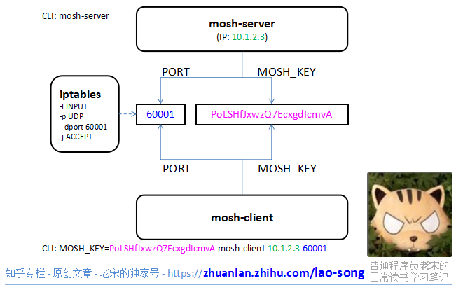

# 👏 The Missing Semester of Your CS Education

> Based on *MIT - The missing semester of your CS education*.
>
> 🌬 Read about the [motivation behind this class](https://missing.csail.mit.edu/about/).


See 💬 text tutorial on [./missing-semester](https://missing.csail.mit.edu)

And 🎬 video course on [MIT公开课 - 6.NULL 你计算机科学教育中遗失的一学期（完结·中英字幕·机翻）](https://www.bilibili.com/video/BV14E411J7n2?p=3&share_source=copy_web&vd_source=7740584ebdab35221363fc24d1582d9d)

Remember to go through 🚵‍♂️ every excersie&resource on that day's course list.


[TOC]


## 1️⃣ [The shell](https://missing.csail.mit.edu/2020/course-shell/)


## 2️⃣ [Shell Tools and Scripting](https://missing.csail.mit.edu/2020/shell-tools/)

### Shell Script

#### Bash Characters

:link:  [Special Characters in bash](https://tldp.org/LDP/abs/html/special-chars.html)

To name just few:

- `$0` - Name of the script
- `$1` to `$9` - Arguments to the script. `$1` is the first argument and so on.
- `$@` - All the arguments
- `$#` - Number of arguments
- `$?` - Return code of the previous command
- `$$` - Process identification number (PID) for the current script
- `!!` - Entire last command, including arguments. A common pattern is to execute a command only for it to fail due to missing permissions; you can quickly re-execute the command with sudo by doing `sudo !!`
- `$_` - Last argument from the last command. If you are in an interactive shell, 


#### Cmd execute

`$()` `$(())` and `$[[]]` `$[]`

Process Substitution: `<()`

[What is the difference between `[` and `[[` test ?](http://mywiki.wooledge.org/BashFAQ/031)


`test`


#### Shell Globbing

- wildcards
- curly braces

```shell
convert image.{png,jpg}
# Will expand to
convert image.png image.jpg

cp /path/to/project/{foo,bar,baz}.sh /newpath
# Will expand to
cp /path/to/project/foo.sh /path/to/project/bar.sh /path/to/project/baz.sh /newpath

# Globbing techniques can also be combined
mv *{.py,.sh} folder
# Will move all *.py and *.sh files


mkdir foo bar
# This creates files foo/a, foo/b, ... foo/h, bar/a, bar/b, ... bar/h
touch {foo,bar}/{a..h}
touch foo/x bar/y
# Show differences between files in foo and bar
diff <(ls foo) <(ls bar)
# Outputs
# < x
# ---
# > y
```

[shellcheck](https://github.com/koalaman/shellcheck) 

[shebang](https://en.wikipedia.org/wiki/Shebang_(Unix)) 

[env](https://www.man7.org/linux/man-pages/man1/env.1.html) 

qq211	qqqq

### Shell tools

#### Finding how-tosw

 `-h` or `--help` flags


`man` pages


[TLDR pages](https://tldr.sh/) 

:link: also check out  [fancy CLIs -- tldr](Awesome/🎩 FancyCLI.md) 


#### Finding files

`find`

```shell
# Find all directories named src
find . -name src -type d
# Find all python files that have a folder named test in their path
find . -path '*/test/*.py' -type f
# Find all files modified in the last day
find . -mtime -1
# Find all zip files with size in range 500k to 10M
find . -size +500k -size -10M -name '*.tar.gz'
# Delete all files with .tmp extension
find . -name '*.tmp' -exec rm {} \;
# Find all PNG files and convert them to JPG
find . -name '*.png' -exec convert {} {}.jpg \;
```


`fd`


`locate`

- `updatedb`

:link: [locate vs find: usage, pros and cons of each other](https://unix.stackexchange.com/questions/60205/locate-vs-find-usage-pros-and-cons-of-each-other) 


#### Finding codes

[`grep`](https://www.man7.org/linux/man-pages/man1/grep.1.html)

- [ack](https://github.com/beyondgrep/ack3)
- [ag](https://github.com/ggreer/the_silver_searcher) 
- [rg](https://github.com/BurntSushi/ripgrep). 


#### Finding shell cmds

`history` 

`Ctrl+R`: perform backwards search 

[fzf](https://github.com/junegunn/fzf/wiki/Configuring-shell-key-bindings#ctrl-r); Fuzzy search

> You can modify your shell’s history behavior, like preventing commands with a leading space from being included. This comes in handy when you are typing commands with passwords or other bits of sensitive information. To do this, add `HISTCONTROL=ignorespace` to your `.bashrc` or `setopt HIST_IGNORE_SPACE` to your `.zshrc`. If you make the mistake of not adding the leading space, you can always manually remove the entry by editing your `.bash_history` or `.zhistory`.


**history-based autosuggestions**


#### Dir Navigation

[`fasd`](https://github.com/clvv/fasd)

- `z` to jump around

[`autojump`](https://github.com/wting/autojump). 


:mag:  More complex tools exist to quickly get an overview of a directory structure: [`tree`](https://linux.die.net/man/1/tree), [`broot`](https://github.com/Canop/broot) or even full fledged file managers like [`nnn`](https://github.com/jarun/nnn) or [`ranger`](https://github.com/ranger/ranger).


[ripgrep](https://github.com/BurntSushi/ripgrep) 

[nnn](https://github.com/jarun/nnn) 

[Hammerspoon](https://www.hammerspoon.org/)

 

## 3️⃣ [Editors](https://missing.csail.mit.edu/2020/editors/)


## 4️⃣ [Data Wrangling](https://missing.csail.mit.edu/2020/data-wrangling/)

### `sed` --  “stream editor” that builds on top of the old `ed` editor.

TBD. 


### RE -- Regular Expression

👍 [short interactive regex tutorial](https://regexone.com/)

👍 [regex101](https://regex101.com/r/qqbZqh/2)


### `awk`

To learn awk begin with:  [Idiomatic awk](https://safjan.com/feeds/all.rss.xml), 


### 🤦🏻‍♀️ Others

`cut`

`sort`

`uniq`

`wc` / `bc`

`R`

`gnuplot`

`xargs`

`syslog` / `log`

`pup`

`jq`

`paste` 


## 5️⃣ [Command-Line Environment](https://missing.csail.mit.edu/2020/command-line/)

### `ssh` - `mosh` - `et`

**[SSH](https://www.openssh.com/)** stands for Secure Shell. It's the de facto standard for secure communication between two hosts on internet (LAN as well). 

**[Mosh](https://github.com/jarun/nnn/tree/master/plugins#installation)** is improved ssh. It adds some convinient features for dev test settings, though it has security concern under production environment for its UDP usage and port number attribution strategy. However, some of it's fancy functions such as internet roam and autometically reconnect after exiting shell still makes it a handy tool in dev.

[**Eternal Terminal (ET)**](https://eternalterminal.dev) is a remote shell that automatically reconnects without interrupting the session. 📂 Learn how to install and use it [here](https://eternalterminal.dev/usermanual).

ET is inspired & based on [**mosh**](https://mosh.org/). ([ssh](https://www.openssh.com/) and [autossh](https://linux.die.net/man/1/autossh) as well)


#### SSH

TBD..


use config file manage connections: 

```shell
Host Baidu
	HostName 106.13.222.111
	User dummy
	Port 22

Host *
  AddKeysToAgent yes
  UseKeychain yes
  IdentityFile ~/.ssh/id_ed25519
```

<small>My ssh config file </small>


#### Mosh



<small>Mosh Communication Architecture</small>


TBD...


#### Refs :

[mosh - 一款替代SSH的UDP远程终端软件]:https://zhuanlan.zhihu.com/p/28414523
[使用 Mosh 来优化 SSH 连接]: https://www.cnblogs.com/sunweiye/p/12003616.html
[ssh 配置文件详解]:https://www.jianshu.com/p/1e793e386beb


### `pfctl` - `iptable`

🛩 Refer to  [GNU/CLI -- iptables](../🔑 CS_Core/Computer System/OS/GNU-Linux/GNU/GNU-CLI.md#iptables).


### [`tmux`](https://github.com/tmux/tmux)

👍 [Tmux Tutorial](https://leimao.github.io/blog/Tmux-Tutorial/)

[How to use tmux](https://www.howtogeek.com/671422/how-to-use-tmux-on-linux-and-why-its-better-than-screen/)

[tmux-plugins](https://github.com/tmux-plugins/list) 

[tmuxcheatsheet](https://tmuxcheatsheet.com)


### `ps`

[Linux进程之如何查看进程详情？（ps命令）](https://juejin.cn/post/6844903721369862152#heading-1)

`watch`

`pstree`


### [`asdf`](https://asdf-vm.com)

- [Does asdf use Homebrew to install packages?](https://elixirforum.com/t/does-asdf-use-homebrew-to-install-packages/42321) 


### 🤦🏼 Others

`history | awk '{$1="";print substr($0,2)}' | sort | uniq -c | sort -n | tail -n 10`

`fg` - `bg` - `jobs`

[`pgrep`](https://www.man7.org/linux/man-pages/man1/pgrep.1.html)

[`pkill`](http://man7.org/linux/man-pages/man1/pgrep.1.html)


## 6️⃣ [Version Control - git](https://missing.csail.mit.edu/2020/version-control/)

> **About Tig**...
>
>  ==Tig is a highly-recommanded git visual solution.==
>
> It is doced on my Notes. -->  [FancyCLI.md](../🔑 CS_Core/Computer System/OS/GNU-Linux/GNU/FancyCLI.md#👉 tig)
>
> **More about git ...**
>
> I have doced git topic [here](../🔑 CS_Core/Software/CLI/VersionControl/Git.md).


### Res:

- [Pro Git](https://git-scm.com/book/en/v2) is **highly recommended reading**. Going through Chapters 1–5 should teach you most of what you need to use Git proficiently, now that you understand the data model. The later chapters have some interesting, advanced material.
- [Oh Shit, Git!?!](https://ohshitgit.com/) is a short guide on how to recover from some common Git mistakes.
- [Git for Computer Scientists](https://eagain.net/articles/git-for-computer-scientists/) is a short explanation of Git’s data model, with less pseudocode and more fancy diagrams than these lecture notes.
- [Git from the Bottom Up](https://jwiegley.github.io/git-from-the-bottom-up/) is a detailed explanation of Git’s implementation details beyond just the data model, for the curious.
- [How to explain git in simple words](https://smusamashah.github.io/blog/2017/10/14/explain-git-in-simple-words)
- [Learn Git Branching](https://learngitbranching.js.org/) is a browser-based game that teaches you Git.


## 7️⃣ [Debugging and Profiling](https://missing.csail.mit.edu/2020/debugging-profiling/)

[Reverse debugging for Python](https://morepypy.blogspot.com/2016/07/reverse-debugging-for-python.html)


### Logging

[dmesg](https://www.man7.org/linux/man-pages/man1/dmesg.1.html)

[log show](https://www.manpagez.com/man/1/log/) 

[logger](https://www.man7.org/linux/man-pages/man1/logger.1.html) 

[lnav](http://lnav.org/)

[journalctl](https://www.man7.org/linux/man-pages/man1/journalctl.1.html) 


### Debugging

#### Python

[pdb](https://docs.python.org/3/library/pdb.html) 

[ipdb](https://pypi.org/project/ipdb/) 


#### C-like

[gdb](https://www.gnu.org/software/gdb/) 

- [pwndbg](https://github.com/pwndbg/pwndbg) 

[lldb](https://lldb.llvm.org/) 


#### System Calls

[strace](https://www.man7.org/linux/man-pages/man1/strace.1.html) 

[dtrace](http://dtrace.org/blogs/about/) 

[dtruss](https://www.manpagez.com/man/1/dtruss/) 


#### Network

[tcpdump](https://www.man7.org/linux/man-pages/man1/tcpdump.1.html)

[Wireshark](https://www.wireshark.org/)


### Code Linting

**Error checker**

Python: 

- [pyflakes](https://pypi.org/project/pyflakes)

- [mypy](http://mypy-lang.org/) 
- [`pylint`](https://github.com/PyCQA/pylint)
- [`pep8`](https://pypi.org/project/pep8/)
- [`bandit`](https://pypi.org/project/bandit/)
- [`black`](https://github.com/psf/black)

Shell:

- [shellcheck](https://www.shellcheck.net/) 

Vim: 

- [`ale`](https://vimawesome.com/plugin/ale) 
- [`syntastic`](https://vimawesome.com/plugin/syntastic) will let you do that. 

Go:

- gofmt

Rust: 

- rustfmt

JS/HTML/CSS:

- [`prettier`](https://prettier.io/) 

For other languages people have compiled comprehensive lists of useful static analysis tools, such as [Awesome Static Analysis](https://github.com/mre/awesome-static-analysis) (you may want to take a look at the *Writing* section) and for linters there is [Awesome Linters](https://github.com/caramelomartins/awesome-linters).


### Profiling

#### Timing

Real time / User time / Sys time 


python -m  [time](https://docs.python.org/3/library/time.html) 


#### Profiler

🎛 CPU

- There are two main types of CPU profilers: *tracing* and *sampling* profilers. 

- python - cProfile

-  [line_profiler](https://github.com/pyutils/line_profiler)

📸 Memory

- [Valgrind](https://valgrind.org/) 
- [memory-profiler](https://pypi.org/project/memory-profiler/)

👩🏻‍🎨 Visualization

-  [Flame Graph](http://www.brendangregg.com/flamegraphs.html)  
- python -m [pycallgraph](https://pycallgraph.readthedocs.io/) 

🖥 Resource Monitoring

- **General Monitoring** - Probably the most popular is [`htop`](https://htop.dev/), which is an improved version of [`top`](https://www.man7.org/linux/man-pages/man1/top.1.html). `htop` presents various statistics for the currently running processes on the system. `htop` has a myriad of options and keybinds, some useful ones are: `<F6>` to sort processes, `t` to show tree hierarchy and `h` to toggle threads. See also [`glances`](https://nicolargo.github.io/glances/) for similar implementation with a great UI. For getting aggregate measures across all processes, [`dstat`](http://dag.wiee.rs/home-made/dstat/) is another nifty tool that computes real-time resource metrics for lots of different subsystems like I/O, networking, CPU utilization, context switches, &c.
- **I/O operations** - [`iotop`](https://www.man7.org/linux/man-pages/man8/iotop.8.html) displays live I/O usage information and is handy to check if a process is doing heavy I/O disk operations
- **Disk Usage** - [`df`](https://www.man7.org/linux/man-pages/man1/df.1.html) displays metrics per partitions and [`du`](http://man7.org/linux/man-pages/man1/du.1.html) displays **d**isk **u**sage per file for the current directory. In these tools the `-h` flag tells the program to print with **h**uman readable format. A more interactive version of `du` is [`ncdu`](https://dev.yorhel.nl/ncdu) which lets you navigate folders and delete files and folders as you navigate.
- **Memory Usage** - [`free`](https://www.man7.org/linux/man-pages/man1/free.1.html) displays the total amount of free and used memory in the system. Memory is also displayed in tools like `htop`.
- **Open Files** - [`lsof`](https://www.man7.org/linux/man-pages/man8/lsof.8.html) lists file information about files opened by processes. It can be quite useful for checking which process has opened a specific file.
- **Network Connections and Config** - [`ss`](https://www.man7.org/linux/man-pages/man8/ss.8.html) lets you monitor incoming and outgoing network packets statistics as well as interface statistics. A common use case of `ss` is figuring out what process is using a given port in a machine. For displaying routing, network devices and interfaces you can use [`ip`](http://man7.org/linux/man-pages/man8/ip.8.html). Note that `netstat` and `ifconfig` have been deprecated in favor of the former tools respectively.

  - [netstat的替代者-ss命令详解]:https://www.yanbinghu.com/2019/06/30/19183.html
  - 

- **Network Usage** - [`nethogs`](https://github.com/raboof/nethogs) and [`iftop`](http://www.ex-parrot.com/pdw/iftop/) are good interactive CLI tools for monitoring network usage.

If you want to test these tools you can also artificially impose loads on the machine using the [`stress`](https://linux.die.net/man/1/stress) command.


## 8️⃣  [Metaprogramming](https://missing.csail.mit.edu/2020/metaprogramming/)

[What is a REPL?](https://codewith.mu/en/tutorials/1.1/repl)

[replit](https://blog.replit.com)

### Build System

make

cmake


### Dependency management

**Versioning**

The exact meaning of each one varies between projects, but one relatively common standard is [*semantic versioning*](https://semver.org/). With semantic versioning, every version number is of the form: major.minor.patch. The rules are:

- If a new release does not change the API, increase the patch version.
- If you *add* to your API in a backwards-compatible way, increase the minor version.
- If you change the API in a non-backwards-compatible way, increase the major version.


### CI

Some of the big ones are Travis CI, Azure Pipelines, and GitHub Actions.


Some testing terminolog: 

- Test suite: a collective term for all the tests
- Unit test: a “micro-test” that tests a specific feature in isolation
- Integration test: a “macro-test” that runs a larger part of the system to check that different feature or components work *together*.
- Regression test: a test that implements a particular pattern that *previously*caused a bug to ensure that the bug does not resurface.
- Mocking: to replace a function, module, or type with a fake implementation to avoid testing unrelated functionality. For example, you might “mock the network” or “mock the disk”.


## 9️⃣ [Security and Cryptography](https://missing.csail.mit.edu/2020/security/)

### [Entropy](https://en.wikipedia.org/wiki/Entropy_(information_theory))

$$
Entropy(N)=log_2(p(N))
$$

where $p(n)$ stands for possibilites of N happended. 


### Cryptographic hash functions & KDF

[lifetimes of cryptographic hash functions](https://valerieaurora.org/hash.html) 


### Symmetric/ Asymmetric cryptography

#### Symmetric Cryptography

Openssl

[salt](https://en.wikipedia.org/wiki/Salt_(cryptography)) `salt = random()`

An example of a symmetric cryptosystem in wide use today is [AES](https://en.wikipedia.org/wiki/Advanced_Encryption_Standard).

- Aes-256-cbc


Encrypting files for storage in an untrusted cloud service. This can be combined with KDFs, so you can encrypt a file with a passphrase. Generate `key = KDF(passphrase)`, and then store `encrypt(file, key)`.


#### Asymmetric Cryptography

- [PGP email encryption](https://en.wikipedia.org/wiki/Pretty_Good_Privacy). People can have their public keys posted online (e.g. in a PGP keyserver, or on [Keybase](https://keybase.io/)). Anyone can send them encrypted email.
- Private messaging. Apps like [Signal](https://signal.org/) and [Keybase](https://keybase.io/) use asymmetric keys to establish private communication channels.
- Signing software. Git can have GPG-signed commits and tags. With a posted public key, anyone can verify the authenticity of downloaded software.


### Case Studies

#### Password managers

This is an essential tool that everyone should try to use (e.g. [KeePassXC](https://keepassxc.org/), [pass](https://www.passwordstore.org/), and [1Password](https://1password.com/)).


#### Two-factor authentication

[Two-factor authentication](https://en.wikipedia.org/wiki/Multi-factor_authentication) (2FA) requires you to use a passphrase (“something you know”) along with a 2FA authenticator (like a [YubiKey](https://www.yubico.com/), “something you have”) in order to protect against stolen passwords and [phishing](https://en.wikipedia.org/wiki/Phishing) attacks.


#### Full disk encryption

You can use [cryptsetup + LUKS](https://wiki.archlinux.org/index.php/Dm-crypt/Encrypting_a_non-root_file_system) on Linux,[BitLocker](https://fossbytes.com/enable-full-disk-encryption-windows-10/) on Windows, or [FileVault](https://support.apple.com/en-us/HT204837) on macOS. 


#### Private messaging

Use [Signal](https://signal.org/) or [Keybase](https://keybase.io/). 


#### SSH

>  Refer to [earlier lecture](https://missing.csail.mit.edu/2020/command-line/#remote-machines). 

In use, once the server knows the client’s public key (stored in the`.ssh/authorized_keys` file), a connecting client can prove its identity using asymmetric signatures. This is done through [challenge-response](https://en.wikipedia.org/wiki/Challenge–response_authentication).


## 🔟 [Potpourri](https://missing.csail.mit.edu/2020/potpourri/)

### Keyboard Remapping

Some software resources to get started on the topic:

- macOS - [karabiner-elements](https://pqrs.org/osx/karabiner/), [skhd](https://github.com/koekeishiya/skhd) or [BetterTouchTool](https://folivora.ai/)
- Linux - [xmodmap](https://wiki.archlinux.org/index.php/Xmodmap) or [Autokey](https://github.com/autokey/autokey)
- Windows - Builtin in Control Panel, [AutoHotkey](https://www.autohotkey.com/) or [SharpKeys](https://www.randyrants.com/category/sharpkeys/)
- QMK - If your keyboard supports custom firmware you can use [QMK](https://docs.qmk.fm/) to configure the hardware device itself so the remaps works for any machine you use the keyboard with.


### Daemons

Most computers have a series of processes that are always running in the background rather than waiting for a user to launch them and interact with them. These processes are called daemons and the programs that run as daemons often end with a `d` to indicate so.

In Linux, `systemd` (the system daemon) is the most common solution for running and setting up daemon processes.

`systemctl` is the client tool interact with `systemd` process. Common  `systemctl` command are `enable`, `disable`, `start`, `stop`, `restart` or check the `status` of services.

Also, `systemd` can be configured through config files. 

 [`cron`](https://www.man7.org/linux/man-pages/man8/cron.8.html) is a daemon your system already runs to perform scheduled tasks.


### FUSE

[FUSE](https://en.wikipedia.org/wiki/Filesystem_in_Userspace) (Filesystem in User Space) allows filesystems to be implemented by a user program.FUSE lets users run user space code for filesystem calls and then bridges the necessary calls to the kernel interfaces. In practice, this means that users can implement arbitrary functionality for filesystem calls.

Some interesting examples of FUSE filesystems are:

- [sshfs](https://github.com/libfuse/sshfs) - Open locally remote files/folder through an SSH connection.
- [rclone](https://rclone.org/commands/rclone_mount/) - Mount cloud storage services like Dropbox, GDrive, Amazon S3 or Google Cloud Storage and open data locally.
- [gocryptfs](https://nuetzlich.net/gocryptfs/) - Encrypted overlay system. Files are stored encrypted but once the FS is mounted they appear as plaintext in the mountpoint.
- [kbfs](https://keybase.io/docs/kbfs) - Distributed filesystem with end-to-end encryption. You can have private, shared and public folders.
- [borgbackup](https://borgbackup.readthedocs.io/en/stable/usage/mount.html) - Mount your deduplicated, compressed and encrypted backups for ease of browsing.


### APIs

[`jq`](https://stedolan.github.io/jq/) is an analyser tool for json. 

[OAuth](https://www.oauth.com/) is a tocken manager for differrent apis on different sites.

[IFTTT](https://ifttt.com/) is a website and service centered around the idea of APIs — it provides integrations with tons of services, and lets you chain events from them in nearly arbitrary ways. 


### VPN

> 👉 refer to [GFW & ShadowSocks](../CyberSecurity/Network/Proxy/GFW & ShadowSocks.md)

[WireGuard](https://www.wireguard.com/)


### Hammerspoon

[Hammerspoon](https://www.hammerspoon.org/) is a desktop automation framework for macOS. It lets you write Lua scripts that hook into operating system functionality, allowing you to interact with the keyboard/mouse, windows, displays, filesystem, and much more.

**Resources**

- [Getting Started with Hammerspoon](https://www.hammerspoon.org/go/)
- [Sample configurations](https://github.com/Hammerspoon/hammerspoon/wiki/Sample-Configurations)
- [Anish’s Hammerspoon config](https://github.com/anishathalye/dotfiles-local/tree/mac/hammerspoon)


### Booting + Live USBs

When your machine boots up, before the operating system is loaded, the[BIOS](https://en.wikipedia.org/wiki/BIOS)/[UEFI](https://en.wikipedia.org/wiki/Unified_Extensible_Firmware_Interface) initializes the system. Enter the boot menu to boot from an alternative device instead of hard drive.

[Live USBs](https://en.wikipedia.org/wiki/Live_USB) are USB flash drives containing an operating system. There are tools like [UNetbootin](https://unetbootin.github.io/) to help you create live USBs.


### Docker, Vagrant, VMs, Cloud, OpenStack

[Virtual machines](https://en.wikipedia.org/wiki/Virtual_machine) and similar tools like containers let you emulate a whole computer system, including the operating system. 

[Vagrant](https://www.vagrantup.com/) is a tool that lets you describe machine configurations (operating system, services, packages, etc.) in code, and then instantiate VMs with a simple `vagrant up`. 

[Docker](https://www.docker.com/) is conceptually similar but it uses containers instead.

Popular Cloud services include [Amazon AWS](https://aws.amazon.com/), [Google Cloud](https://cloud.google.com/),[ Microsoft Azure](https://azure.microsoft.com/),[DigitalOcean](https://www.digitalocean.com/).


### Notebook Programming

[Notebook programming environments](https://en.wikipedia.org/wiki/Notebook_interface) can be really handy for doing certain types of interactive or exploratory development.

[Jupyter](https://jupyter.org/) is a very popular notebook programming envrionment for Python (and several other languages). 

[Wolfram Mathematica](https://www.wolfram.com/mathematica/) is another notebook programming environment that’s great for doing math-oriented programming.


## 🏁 [Q&A](https://missing.csail.mit.edu/2020/qa/)
