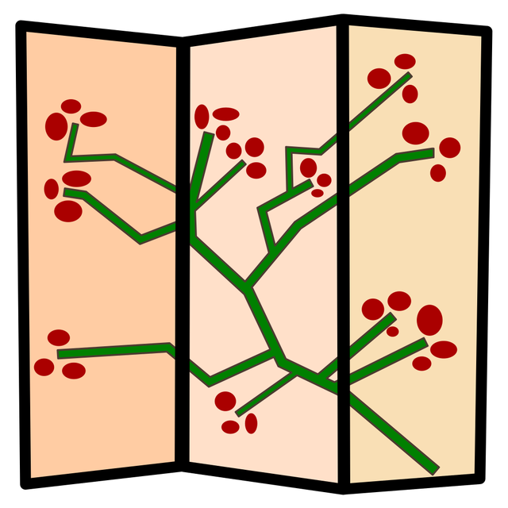

# Windows Manager

[TOC]


## 👉 Screen
Not as handy as tmux
TBD..


## 👉 Tmux
### Learn Tmux
👍 [Tmux Tutorial](https://leimao.github.io/blog/Tmux-Tutorial/)
📂 [Tmux Docs](https://github.com/tmux/tmux/wiki/Getting-Started)
- [Super Guide to the `split-window` tmux Subcommand (and Beyond)](https://gist.github.com/sdondley/b01cc5bb1169c8c83401e438a652b84e)


[How to use tmux](https://www.howtogeek.com/671422/how-to-use-tmux-on-linux-and-why-its-better-than-screen/)
[tmux-plugins](https://github.com/tmux-plugins/list) 
[tmuxcheatsheet](https://tmuxcheatsheet.com)


### Tmux in a Nutshell


[Everything you need to know about tmux – Status Bar]:https://arcolinux.com/everything-you-need-to-know-about-tmux-status-bar/
[Change Between Light and Dark Themes in tmux]:https://www.seanh.cc/2021/01/02/change-between-light-and-dark-themes-in-tmux/
[Writing Your tmux Config: a Detailed Guide]: https://thevaluable.dev/tmux-config-mouseless/


### 👍 [Byobu](https://www.byobu.org)


Byobu is a [GPLv3](http://www.google.com/url?q=http%3A%2F%2Fwww.gnu.org%2Flicenses%2Fgpl-3.0.txt&sa=D&sntz=1&usg=AOvVaw2SdxEQNfQHLvXbZdusdaQx) open source text-based window manager and terminal multiplexer. It was originally designed to provide elegant enhancements to the otherwise functional, plain, practical [GNU Screen](http://www.google.com/url?q=http%3A%2F%2Fwww.gnu.org%2Fsoftware%2Fscreen%2F&sa=D&sntz=1&usg=AOvVaw0m279_Wo9nqZfTvhyA6pAE), for the [Ubuntu](http://www.google.com/url?q=http%3A%2F%2Fwww.ubuntu.com%2F&sa=D&sntz=1&usg=AOvVaw3el9anN507B3WIzdxf9INt) server distribution. Byobu now includes an enhanced profiles, convenient keybindings, configuration utilities, and toggle-able system status notifications for both the GNU Screen window manager and the more modern [Tmux](https://www.google.com/url?q=https%3A%2F%2Fgithub.com%2Ftmux%2Ftmux&sa=D&sntz=1&usg=AOvVaw3njEytKxDbcSOXUKtIbAzh) terminal multiplexer, and works on most Linux, BSD, and Mac distributions.

> [byobu VS tmuxinator](https://www.saashub.com/compare-byobu-vs-tmuxinator)


#### Configuration
Byobu uses a quite complex (at least it is to me) configuration structure. And perhaps one of the reasons makes it complex is its configurations information is poor documented 💦
Byobu use tmux (default) and screen as its backend multiplexer, thus it has in many cases two sets of configuration files for them specificaly. ==And the thing to notice here is that although byobu uses these two as backend multiplexers it doesn't load their original configuration files (`~/.tmux.conf` for tmux, for example), instead all the configurations are writen within byobu.== This may cause some confusion.

##### Meta Configuration
```shell
$ env | grep BYOBU

BYOBU_ACCENT=#75507B
BYOBU_BACKEND=tmux
BYOBU_CHARMAP=UTF-8
BYOBU_CONFIG_DIR=/Users/mir0/.byobu
BYOBU_DARK=#333333
BYOBU_DATE=%Y-%m-%d
BYOBU_DISTRO=macOS
BYOBU_EDITOR=vim
BYOBU_HIGHLIGHT=#DD4814
BYOBU_LIGHT=#EEEEEE
BYOBU_PAGER=less
BYOBU_PREFIX=/usr/local/Cellar/byobu/5.133_3
BYOBU_READLINK=greadlink
BYOBU_RUN_DIR=/Users/mir0/.cache/byobu
BYOBU_SED=gsed
BYOBU_TERM=screen-256color
BYOBU_TIME=%H:%M:%S
BYOBU_TTY=/dev/ttys004
BYOBU_ULIMIT=ulimit
BYOBU_WINDOW_NAME=-
```

##### Configuration Structure
Byobu by default first load **software configuration files** `byoburc` at `$BYOBU_PREFIX/share/byobu/profiles` , and `tmuxrc`, `bashrc` as well provided they were detected to be used. 

Then configuration files above will invoke a bunch of **user configurationi files** at `BYOBU_CONFIG_DIR = ~/.byobu`, some of which invoke pre-defined user configurations files stored at software configuration folder of `$BYOBU_PREFIX/share/byobu/` , like `common`, `dircolors`, and `tmux` (since tmux is used as backend here ); while anothers have configurations writen in themselves, like `color.tmux`, `keybindings.tmux`, `profile.tmux` ... etc. stroed in `BYOBU_CONFIG_DIR = ~/.byobu`.

Simple put, there are both pre-defined user configuration files at `$BYOBU_PREFIX/share/byobu/profiles` and real user configuration files at `BYOBU_CONFIG_DIR = ~/.byobu`. User choose whichever they pleased; however you should only modify files at `BYOBU_CONFIG_DIR = ~/.byobu`


### 👍 [tmuxinator](https://github.com/tmuxinator/tmuxinator)
tmuxinator is a **tmux sessions manager**. 
```shell
tmuxinator new <project>
tmuxinator edit <project>
tmuxinator start <project>
tmuxinator stop <project>
tmuxinator list
```


### 👍 [tmux-config](https://github.com/samoshkin/tmux-config#installation)
Along with tmuxinator, tmux-config is a re-configured tmux with some fansy features.

To install tmux-config:
```shell
git clone https://github.com/samoshkin/tmux-config.git
./tmux-config/install.sh
```

The `install.sh` script does following:
- copies files to `~/.tmux` directory
- symlink tmux config file at `~/.tmux.conf`, existing `~/.tmux.conf` will be backed up
- [Tmux Plugin Manager](https://github.com/tmux-plugins/tpm) will be installed at default location `~/.tmux/plugins/tpm`, unless already presemt
- required tmux plugins will be installed

**bug fix**
The original config aims at tmux v2. With new tmux v3 some are off.
Edit `~/.tmux.conf` and add '\\' before everywhere reported error.


## Ref
