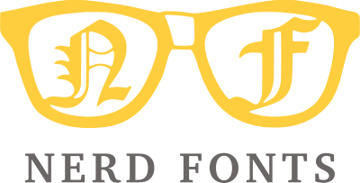
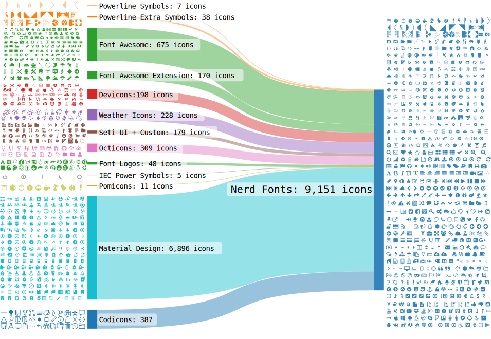

# NERD Fonts

[TOC]

## Res

## Intro
**Nerd Fonts** is a project that patches developer targeted fonts with a high number of glyphs (icons). Specifically to add a high number of extra glyphs from popular 'iconic fonts' such as [Font Awesome](https://github.com/FortAwesome/Font-Awesome), [Devicons](https://vorillaz.github.io/devicons/), [Octicons](https://github.com/primer/octicons), and [others](https://github.com/ryanoasis/nerd-fonts#glyph-sets).

The following Sankey flow diagram shows the current glyph sets included:

## Ref

