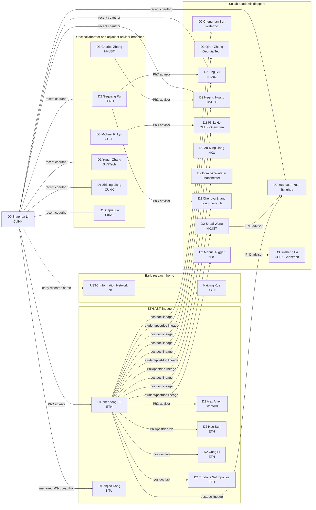

# CUHK Shaohua Li

> [!info] Scope and date
> Prepared on **2026-07-31** for a prospective PhD application to [Prof. Shaohua Li](https://shao-hua-li.github.io/) at CUHK. The corpus contains **33 publication records**: all **19** works on Li’s full [publication page](https://shao-hua-li.github.io/publications/), plus **14** additional records explicitly listed on the linked publication pages of current students after deduplication.
>
> Five linked student sites were inspected: [Batu Guan](https://asparticguan.github.io/), [Yunbo Ni](https://cardigan1008.github.io/publication.html), [Zirui Wang](https://rhys-wang-wannalearnmath.github.io/publications/), [Xiao Wu](https://xiaowu417.github.io/), and [Kangyu Zheng](https://kangyuz.academicwebsite.com/publications). Jinjie Liu and Xuan Huang are listed by Li without personal-page links; targeted searches did not find reliable publication pages attributable to these two students, so no papers were guessed from name matches.
>
> “Student-page-only” does **not** necessarily mean the work was conducted in Li’s group. Several are pre-CUHK works. They are included because they reveal the skills and research directions already present in the group.
>
> Analyses use the full paper where a public PDF/HTML manuscript was accessible and the official abstract plus bibliographic record otherwise. Results are reported as the authors’ claims rather than independently reproduced findings. Publication pages are living sources, so this is a dated snapshot rather than a permanent bibliography.

## Executive assessment

Shaohua Li’s central research identity is **reliability and security for critical software systems**, with compilers as the main experimental object. His work combines programming languages, software engineering, systems, and security. The publication trajectory has three phases:

1. **Privacy-preserving systems (2017–2020):** cryptographic databases, SGX-enabled smart grids, and privacy-preserving neural-network inference.
2. **Testing and semantic reliability (2022–2025):** differential testing, undefined behavior, sanitizer correctness, compiler fuzzing, kernel fuzzing, Android functional testing, and Rust-specific reliability.
3. **Grounded AI for critical software (2025–2026):** LLM-assisted compiler testing, compiler review and repair agents, dynamic code-model benchmarks, AI-native systems evaluation, GPU-kernel correctness, and learning-guided quantum compilation.

The through-line is more precise than “AI for software engineering.” The group repeatedly:

- identifies an expensive, unreliable, or poorly observed inner loop;
- constructs a cheaper signal or representation—execution prefixes, execution patterns, real-code fragments, type/dependency graphs, compiler feedback, retrieved historical patches, state snapshots;
- constrains automation with program semantics or executable evidence;
- tests on real, maintained systems and reports confirmed bugs, merged fixes, upstream adoption, or reproducible artifacts.

This is a strong group for a student who wants to build **real tools for hard systems**, not merely train a model and report benchmark accuracy. Strong implementation, experimental discipline, and comfort with compilers or systems will likely matter more than having a long prior publication list; Li’s [openings page](https://shao-hua-li.github.io/openings/) explicitly emphasizes real-world impact, strong programming, and open source.

## Group and capability map

| Person | Stated or evidenced focus | What the publication record adds to the group |
|---|---|---|
| Shaohua Li | Compilers, software engineering, security; reliability of critical software; AI for and reliability of AI software | Compiler testing, fuzzing optimization, sanitizers, differential oracles, agentic compiler engineering |
| Batu Guan | PL, SE, language models | Code-model benchmarking, compiler-agent patching, code watermarking, compiler-feedback code generation |
| Yunbo Ni | Code correctness and optimization across source/IR/assembly | LLM-based compiler testing, Rust compiler bugs, Rust program repair, compiler code review |
| Jinjie Liu | No linked profile or reliable attributable publication page found | Incoming PhD student; public research direction not yet verifiable from the group page |
| Xuan Huang | No linked profile or reliable attributable publication page found | Incoming PhD student; public research direction not yet verifiable from the group page |
| Zirui Wang | AI-driven computing systems, system performance/reliability, AI4SE | GPU-kernel correctness, AI-native and cloud-agent benchmarks, LLM deployment reliability, edge WebAssembly inference |
| Xiao Wu | Security and software reliability | WebAssembly binary sanitization, native-to-Wasm differential testing, dynamic code-model benchmarking |
| Kangyu Zheng | AI with emerging technology, especially quantum computing for scientific discovery | Quantum circuit search and compilation, quantum chemistry, AI-for-science benchmarking |

The group therefore has four mutually reinforcing technical assets:

- **Compiler and program semantics:** LLVM/GCC, rustc, quantum compilers, differential testing, optimization passes.
- **Dynamic analysis and fuzzing:** coverage-guided fuzzing, concolic execution, sanitization, binary instrumentation, test-case synthesis and minimization.
- **Grounded agents and LLMs:** compiler feedback, executable validation, retrieval of historical fixes, white-box traces and process metrics.
- **Emerging execution stacks:** GPU kernels, WebAssembly, AI-native/cloud systems, quantum computing.

## Complete paper inventory and detailed analyses

### A. Papers on Shaohua Li’s publication page

#### 1. Archer: Towards Agentic Review for Compiler Optimizations

**Yunbo Ni and Shaohua Li. arXiv, 2026.** [Paper](https://arxiv.org/abs/2607.01808) · [Code](https://github.com/cuhk-s3/Archer) · [Live reports](https://archer.top/)

- **Problem.** Modern compiler optimization pull requests are difficult to review: changes are semantically subtle, reviewer capacity is scarce, and ordinary code-review agents do not understand compiler obligations well enough to distinguish style issues from miscompilations.
- **Method.** Archer is presented as the first agentic reviewer specialized for compiler optimizations. It “constrains from both ends”: explicit review obligations focus the agent’s reasoning, while a deterministic validation guard requires executable evidence before a finding is admitted. This is a notable architecture because the LLM proposes and investigates, but does not get final authority over correctness.
- **Evidence.** On 70 open and 328 recently closed LLVM pull requests, Archer reported semantic bugs in 21% of open PRs and 11% of closed PRs. If the evaluation withstands independent replication, the closed-PR result is especially consequential: already-reviewed changes may still carry a substantial semantic defect rate.
- **Assessment.** The strongest contribution is the **evidence-gated review protocol**, not simply using an agent. Threats include the narrow time window, LLVM-specific engineering, possible selection effects among reproducible PRs, and the need to distinguish unique defects from duplicate manifestations. It is the clearest statement of the lab’s emerging direction: agents should be bounded by compiler semantics and executable tests.

#### 2. Understanding Agent-Based Patching of Compiler Missed Optimizations

**Batu Guan, Zirui Wang, and Shaohua Li. arXiv, 2026.** [Paper](https://arxiv.org/abs/2607.02370) · [Code](https://github.com/cuhk-s3/understanding-generalization)

- **Problem.** A patch can optimize the reported example yet fail to implement the general optimization intended by compiler developers. Standard repair metrics such as “passes the reproducer” therefore overestimate success for missed-optimization issues.
- **Method.** The paper builds a benchmark of real LLVM missed-optimization issues and evaluates agent patches against developer patches by **optimization scope**, separating under-generalization, partial overlap, developer-aligned behavior, and over-generalization. It then augments agents with historical LLVM optimization knowledge through retrieval and distillation of prior optimization PRs.
- **Evidence.** Coding agents often repair the given example, but many cover only part of the developer-intended input space or overlap it imperfectly; some generalize beyond the reference patch. Historical-knowledge augmentation improves developer-aligned generalization and produces practical benefits on real LLVM IR.
- **Assessment.** This work corrects a fundamental evaluation error in agentic repair: a reference patch is not merely a target diff but an implicit semantic region. Its limitation is that developer patches are treated as the best available specification even though they may be incomplete. A natural next step is to synthesize explicit semantic obligations and adversarial test families that characterize scope independently of the human patch.

#### 3. QuTuner: Feature- and Learning-Guided Optimization Pass Tuning for Quantum Compilers

**Ming Zhong, Xiangyu Ren, Jinglei Cheng, Shaohua Li, and Zhiding Liang. arXiv, 2026.** [Paper](https://arxiv.org/abs/2607.04586)

- **Problem.** Quantum compilers must choose and order optimization passes under circuit- and objective-dependent behavior. Classical pass-tuning techniques do not transfer cleanly because circuits have quantum-specific structure and the search space is large.
- **Method.** QuTuner constructs a large offline optimization dataset and represents a circuit using both static structural features and **optimization-aware pass embeddings** that summarize how it responds to individual passes. Two offline models retrieve and rank candidate pass sequences for unseen circuits, followed by lightweight refinement.
- **Evidence.** Evaluated on Qiskit and PyTKET with two benchmark suites, QuTuner improves metric reduction by up to 84.85% over the strongest baseline on Qiskit while reducing tuning time by 73.59%; on PyTKET, the respective improvements are up to 18.68% and 64.49%.
- **Assessment.** The important idea is to learn not only what a program is, but how it **reacts to transformations**. This connects directly to Li’s classical-compiler work. Limits include offline-dataset bias, sensitivity to compiler/version changes, and uncertainty about transfer to hardware-aware noise objectives. It opens a route toward continual, semantics-aware optimization models across classical and quantum compilers.

#### 4. Agentic Harness for Real-World Compilers

**Yingwei Zheng, Cong Li, Shaohua Li, Yuqun Zhang, and Zhendong Su. arXiv, 2026.** [Paper](https://arxiv.org/abs/2603.20075) · [Code](https://github.com/dtcxzyw/llvm-harness)

- **Problem.** General-purpose coding agents degrade on compiler bugs because reports are sparse, compiler internals span several semantic layers, and reproducing or validating miscompilations requires specialized tools.
- **Method.** The work introduces `llvm-autofix`, an agentic harness consisting of agent-friendly LLVM tools, `llvm-bench` for reproducible real bugs, and a deliberately small agent, `llvm-autofix-mini`. The harness supplies the operational environment and feedback loop that a model needs to inspect, modify, build, and validate LLVM.
- **Evidence.** Frontier models suffer a reported 60% performance decline on compiler bugs relative to ordinary software bugs. The minimal harnessed agent outperforms the prior state of the art by roughly 22%.
- **Assessment.** The paper argues persuasively that progress depends on **harness design**, not model scale alone. Benchmark reproducibility and the definition of a correct patch remain central threats, particularly for semantically broad fixes. Together with Archer and the missed-optimization study, it forms a three-part agenda: equip agents, measure semantic generalization, and require executable evidence.

#### 5. SQD-Enabled Circuit Compression for Resource-Efficient Quantum Chemistry

**Kangyu Zheng, Yidong Zhou, Jinglei Cheng, Zhemin Zhang, Shaohua Li, and Zhiding Liang. ICCAD, 2026.** [Paper](https://arxiv.org/abs/2607.15076)

- **Problem.** Variational quantum chemistry circuits can be too deep and non-Clifford-heavy for efficient simulation or near-term hardware. Subspace Quantum Diagonalization (SQD), however, only needs samples with sufficient ground-state overlap, suggesting that the sampling circuit may tolerate aggressive compression.
- **Method.** The paper combines gradient-based operator pruning with Clifford rounding of remaining parameters. These compress different axes of a VQE ansatz applied to a qubit-reduced Hamiltonian; SQD then classically diagonalizes in the sampled subspace.
- **Evidence.** Across 21 molecules, median SQD error remains within chemical accuracy at 50% compression on both axes, while simulation speedup reaches 33×. Hardware tests on six molecules show up to 2.8× reduction in transpiled depth with no loss in SQD accuracy.
- **Assessment.** The key insight is task-aware semantic slack: preserve what downstream SQD actually requires rather than exact circuit expressivity. Generalization to larger molecules, noisier devices, and other ansätze remains open. This work is adjacent to Li’s core reliability agenda but provides a valuable co-design setting for compiler transformations whose correctness is defined by downstream scientific utility.

#### 6. Belobog: Move Language Fuzzing Framework for Real-World Smart Contracts

**Wanxu Xia, Ziqiao Kong, Zhengwei Li, Yi Lu, Pan Li, Liqun Yang, Yang Liu, Xiapu Luo, and Shaohua Li. ISSTA, 2026.** [Paper](https://arxiv.org/abs/2512.02918) · [Code](https://github.com/abortfuzz/belobog)

- **Problem.** Move’s resource-oriented type system blocks many malformed transactions, which is good for safety but makes conventional smart-contract fuzzers inefficient. Important logic vulnerabilities remain beyond the type system.
- **Method.** Belobog is a type-aware fuzzer. It builds a dependency graph from the contract and Move types, generates or mutates transaction sequences along valid graph traces, and adds concolic execution to cross complex contract checks.
- **Evidence.** On 109 real projects, it detects 100% of critical and 79% of major vulnerabilities previously found by human audit. It reproduces the Cetus and Nemo exploits without prior knowledge and finds seven new vulnerabilities—two critical, two major, and three medium—in ongoing audits, all acknowledged by developers.
- **Assessment.** This is an unusually strong real-world validation. The framework demonstrates that language semantics can guide input generation without sacrificing exploit depth. The remaining questions are false-negative behavior outside audited categories, scalability of concolic execution, and transfer across evolving Move dialects and blockchain runtimes.

#### 7. LegoFuzz: Interleaving Large Language Models for Compiler Testing

**Yunbo Ni and Shaohua Li. OOPSLA, 2025.** [Paper](https://arxiv.org/abs/2508.18955) · [Code](https://github.com/cuhk-s3/LegoFuzz)

- **Problem.** Direct LLM generation in a fuzzing loop is costly and tends to produce short, invalid, or semantically unsafe C programs that cannot expose deep optimization bugs.
- **Method.** LegoFuzz separates an offline LLM phase from online fuzzing. Offline, LLMs transform real-world functions into diverse, validated numeric code pieces; compilation, sanitizers, and profiling filter them. Online, the system repeatedly composes pieces using function calls and shared globals while runtime profiles preserve valid behavior and create cross-function dependencies.
- **Evidence.** It finds 66 GCC/LLVM bugs, including 30 miscompilations; the paper reports 56 fixed. It increases line coverage over its seed/function baseline by 12.5% in GCC and 4.9% in LLVM and covers substantially more compiler code than prior LLM fuzzers.
- **Assessment.** LegoFuzz’s lasting idea is **amortizing model intelligence into reusable structured artifacts** rather than paying for an LLM call per test. Validity filtering may bias the generated corpus toward easily checked semantics, and results focus on C compilers. The design should transfer to other languages, IRs, and agent-generated transformation components.

#### 8. An Empirical Study of Rust-Specific Bugs in the rustc Compiler

**Zixi Liu, Yang Feng, Yunbo Ni, Shaohua Li, Xizhe Yin, Qingkai Shi, Baowen Xu, and Zhendong Su. OOPSLA, 2025.** [Paper](https://arxiv.org/abs/2503.23985)

- **Problem.** Rust’s ownership, lifetime, trait, and compiler-IR mechanisms create bug classes that studies of C/C++ compilers do not capture. Tool builders lack a grounded taxonomy of these failures.
- **Method.** The authors manually inspect 301 valid rustc issues and fixes reported from 2022–2024, classifying cause, symptom, compilation stage, and test-case features. They also evaluate existing rustc testing tools against the observed bug distribution.
- **Evidence.** Bugs cluster around the type system and lifetime model, especially HIR/MIR checkers and optimizations. Triggering cases frequently use unstable features, advanced traits, lifetimes, standard APIs, and particular optimization levels. Existing tools are weak on non-crash errors.
- **Assessment.** The paper supplies a research agenda rather than a single detector: generation must become feature-aware, and oracles must move beyond crashes. Manual taxonomy validity and the limited temporal window are the main threats. It complements PanicFI by connecting compiler-side Rust reliability with program-side repair.

#### 9. Optimizing Input Minimization in Kernel Fuzzing

**Hui Guo, Hao Sun, Shan Huang, Ting Su, Geguang Pu, and Shaohua Li. USENIX ATC, 2025.** [Paper](https://www.usenix.org/conference/atc25/presentation/guo) · [Code](https://github.com/ecnusse/SyzMini)

- **Problem.** Syzkaller spends more than half of its fuzzing resources minimizing new coverage-preserving syscall programs. Naive removal and argument simplification repeatedly execute the kernel to check coverage preservation.
- **Method.** SyzMini adds influence-guided call removal and type-informed argument simplification. Both reduce the number of dynamic validation runs by using dependency influence and syscall type knowledge to group or prioritize minimization decisions.
- **Evidence.** The prototype reduces minimization cost by 60.7%, increases branch coverage by 12.5%, and finds 1.7–2× more unique bugs. It discovers 13 previously unknown upstream-kernel bugs; all were confirmed and four were fixed at the time of publication.
- **Assessment.** This is a clean example of optimizing an overlooked support stage rather than inventing a new mutator. Dependence on Syzkaller’s representations and kernel nondeterminism may affect portability, but the two strategies are conceptually general. It reinforces the group’s recurring focus on removing wasted executions from testing loops.

#### 10. Is Your Benchmark (Still) Useful? Dynamic Benchmarking for Code Language Models

**Batu Guan, Xiao Wu, Yuanyuan Yuan, and Shaohua Li. DL4C at NeurIPS, 2025.** [Paper](https://arxiv.org/abs/2503.06643)

- **Problem.** Static code benchmarks lose discriminative value when their examples enter model training data. Reported scores can reflect memorization or contamination rather than code understanding.
- **Method.** The framework applies semantics-preserving program mutations at evaluation time, creating syntactically new but behaviorally equivalent versions of code-understanding and reasoning tasks.
- **Evidence.** Across ten popular language models, all perform materially worse on dynamic variants; some model rankings change sharply. The transformed benchmarks also show resistance to contamination.
- **Assessment.** Dynamic generation is a practical response to benchmark half-life, but the validity of every transformation is crucial. A transformation set may emphasize invariance to syntax without measuring broader software competence, and models could eventually train directly against the mutation distribution. The work anticipates a larger lab interest in continuously refreshed, executable evaluation.

#### 11. SAND: Decoupling Sanitization from Fuzzing for Low Overhead

**Ziqiao Kong, Shaohua Li, Heqing Huang, and Zhendong Su. ICSE, 2025.** [Paper](https://shao-hua-li.github.io/assets/pdf/2024_sand_preprint.pdf) · [AFL++ upstream integration](https://github.com/AFLplusplus/AFLplusplus/commit/6a4b580)

- **Problem.** Sanitizers provide strong bug oracles but slow every fuzzing execution—dramatically in the case of MemorySanitizer—even though very few inputs are interesting.
- **Method.** SAND fuzzes an ordinary binary and re-executes only inputs with new approximate **execution patterns** on sanitizer-enabled binaries. The pattern discards path order for speed while retaining enough signal to identify executions likely to reveal new bugs.
- **Evidence.** On 12 real programs over 24 hours, SAND achieves 2.6× and 15× throughput relative to ASan/UBSan and MSan fuzzing and detects 51% and 242% more bugs, respectively. Fewer than 2% of inputs have new execution patterns, while more than 96% of buggy executions have a unique pattern. The approach was upstreamed into AFL++.
- **Assessment.** This is one of the group’s most reusable ideas: **move an expensive oracle off the hot path and invoke it selectively using a cheap proxy**. Data-sensitive bugs whose control-flow signature is not unique remain the conceptual risk.

#### 12. Boosting Compiler Testing by Injecting Real-World Code

**Shaohua Li, Theodoros Theodoridis, and Zhendong Su. PLDI, 2024. Distinguished Artifact Award.** [Paper](https://shao-hua-li.github.io/assets/pdf/2024_pldi_creal_final.pdf) · [Code](https://github.com/cuhk-s3/Creal)

- **Problem.** Hand-engineered random generators produce valid programs but support only a limited subset of real language features; arbitrary real code is expressive but difficult to compose while preserving defined behavior.
- **Method.** Creal extracts functions from real projects, inserts calls into seed programs, and uses dynamic execution information to preserve semantics and build nontrivial data dependencies between injected functions and seeds.
- **Evidence.** Over nine months, Creal reports 132 GCC/LLVM bugs; 121 were confirmed as previously unknown and 101 fixed. Most were miscompilations, including long-latent defects.
- **Assessment.** The paper demonstrates that real code can become a generative substrate rather than only a seed corpus. Dynamic profiling cannot prove semantic validity for all inputs, and the extraction/composition rules may constrain reachable interactions. Still, Creal directly foreshadows LegoFuzz: both turn real code into validated reusable building blocks.

#### 13. UBfuzz: Finding Bugs in Sanitizer Implementations

**Shaohua Li and Zhendong Su. ASPLOS, 2024. Distinguished Artifact Award.** [Paper](https://shao-hua-li.github.io/assets/pdf/2024_asplos_ubfuzz.pdf) · [Code](https://github.com/shao-hua-li/UBGen)

- **Problem.** Sanitizers are widely trusted as fuzzing oracles, but their own false negatives receive little systematic testing. Differential sanitizer output alone is ambiguous because compiler optimization can also change behavior.
- **Method.** UBfuzz uses **shadow-statement insertion** to inject known undefined behavior into valid seed programs, runs sanitizer implementations differentially, and applies **crash-site mapping** to determine whether a discrepancy is truly a sanitizer implementation error.
- **Evidence.** In five months, the tool finds 31 bugs in GCC and LLVM sanitizers, exposing serious cases where inserted UB was not reported.
- **Assessment.** The work usefully turns the test oracle into the system under test. Its generator covers the inserted UB templates and seed distribution rather than the complete UB space; crash-site mapping is an engineering oracle, not a formal proof. It fits the group’s broader skepticism toward assumed-correct infrastructure.

#### 14. Accelerating Fuzzing through Prefix-Guided Execution

**Shaohua Li and Zhendong Su. OOPSLA, 2023. Distinguished Paper Award.** [Paper](https://shao-hua-li.github.io/assets/pdf/2023_oopsla_pge.pdf) · [Code](https://github.com/shao-hua-li/AFLplusplus-PGE)

- **Problem.** Coverage-guided fuzzers fully execute every mutation even though fewer than one in many thousands may increase coverage.
- **Method.** Prefix-guided execution monitors a test’s partial execution and terminates it early when the prefix predicts that full execution is unlikely to add coverage. The AFL++-PGE prototype operationalizes the prediction within an existing fuzzer.
- **Evidence.** On the 21-program MAGMA ground-truth benchmark over 48-hour campaigns, PGE finds more bugs, finds them sooner, and achieves higher coverage than baseline AFL++.
- **Assessment.** PGE established a recurring lab pattern: predict the value of an execution before paying its full cost. False early termination is the central risk, so calibration across targets is essential. Later work applies analogous reasoning at different points: SAND gates sanitizer execution, SyzMini reduces minimization checks, and agentic systems gate findings with validation.

#### 15. Finding Unstable Code via Compiler-Driven Differential Testing

**Shaohua Li and Zhendong Su. ASPLOS, 2023.** [Paper](https://shao-hua-li.github.io/assets/pdf/2023_asplos_compdiff.pdf) · [Code](https://github.com/shao-hua-li/compdiff)

- **Problem.** C/C++ programs can contain undefined behavior beyond the reach of existing sanitizers. Optimizing compilers may exploit that UB and produce binaries with inconsistent runtime behavior.
- **Method.** CompDiff compiles the same program with different compiler implementations and compares binary outputs on the same inputs. Output disagreement becomes a generic oracle for unstable code. The method is integrated into AFL++ for real-project exploration.
- **Evidence.** It uniquely detects 1,409 Juliet benchmark bugs not found by sanitizers. Across 23 popular projects, CompDiff-AFL++ finds 78 new bugs; 52 were fixed and 36 were outside sanitizer detection.
- **Assessment.** Differential behavior is powerful but can also arise from environmental nondeterminism, implementation-defined behavior, or library differences; careful triage is therefore required. The paper explicitly positions CompDiff as complementary to sanitizers, an appropriately restrained claim.

#### 16. Detecting Non-crashing Functional Bugs in Android Apps via Deep-State Differential Analysis

**Jue Wang, Yanyan Jiang, Ting Su, Shaohua Li, Chang Xu, Jian Lu, and Zhendong Su. ESEC/FSE, 2022.** [Paper](https://shao-hua-li.github.io/assets/pdf/2022_fse_odin.pdf) · [Project](https://automatedoracleforandroid.github.io/)

- **Problem.** Android functional bugs may not crash and often occur only after long event sequences. Existing oracles cover narrow bug types.
- **Method.** Odin groups traces that reach similar GUI layouts, appends the same events, clusters the resulting behaviors, and treats minority outcomes as anomalies. Input calibration balances common and rare paths so true bugs are not hidden by trace frequency.
- **Evidence.** On 17 popular Android apps, Odin identifies 28 non-crashing functional bugs, five previously unknown. Eleven of the 28 are not detected by contemporary techniques.
- **Assessment.** The paper generalizes differential testing from implementations to **deep application states**. Similar GUI layouts do not guarantee semantically equivalent states, creating possible false positives; rare but legitimate outcomes may also appear anomalous. This early work helps explain the group’s continued interest in constructing oracles from behavioral equivalence classes.

#### 17. FALCON: A Fourier Transform Based Approach for Fast and Secure Convolutional Neural Network Predictions

**Shaohua Li, Kaiping Xue, Bin Zhu, Chenkai Ding, Xindi Gao, David S. L. Wei, and Tao Wan. CVPR, 2020. Oral.** [Paper](https://openaccess.thecvf.com/content_CVPR_2020/html/Li_FALCON_A_Fourier_Transform_Based_Approach_for_Fast_and_Secure_CVPR_2020_paper.html)

- **Problem.** A client wants a prediction from a server-owned CNN without exposing its private input, while the server must not reveal the model. Existing secure inference is expensive, especially for convolution and nonlinear layers.
- **Method.** FALCON evaluates CNN linear layers using a Fourier-transform formulation with homomorphic encryption, combines optimized secure protocols for ReLU and pooling, and introduces an efficient privacy-preserving softmax protocol.
- **Evidence.** Experiments on real CNNs report lower computation and communication cost than prior secure-inference systems with negligible accuracy loss; published results include 99.26% on MNIST and 81.61% on CIFAR-10.
- **Assessment.** This is an earlier privacy/cryptography line rather than the current compiler core. It nevertheless shows Li’s long-standing preference for system-level optimization of trustworthy computation. Comparisons reflect 2020 architectures and cryptographic baselines, so they should not be treated as current secure-inference state of the art.

#### 18. SecGrid: A Secure and Efficient SGX-Enabled Smart Grid System with Rich Functionalities

**Shaohua Li, Kaiping Xue, David S. L. Wei, Hao Yue, Nenghai Yu, and Peilin Hong. IEEE TIFS, 2019/2020.** [Paper](https://arxiv.org/abs/1810.01651)

- **Problem.** Smart-grid analytics require rich operations on private household measurements. Homomorphic-encryption solutions impose heavy asymmetric cryptography on constrained smart meters and support limited functionality.
- **Method.** SecGrid places sensitive utility computation inside Intel SGX enclaves and designs protocols so meters perform only AES encryption while utilities can execute richer protected analytics.
- **Evidence.** The paper’s security analysis covers malicious-adversary attacks, and experiments report substantially better performance than cryptography-only privacy-preserving smart-grid schemes.
- **Assessment.** The design trades cryptographic generality for a trusted-hardware assumption. SGX side channels, rollback, enclave compromise, and deployment trust are therefore the decisive limitations. The paper belongs to Li’s earlier secure-systems period but contributes experience in threat models and trusted execution.

#### 19. Two-Cloud Secure Database for Numeric-Related SQL Range Queries with Privacy Preserving

**Kaiping Xue, Shaohua Li, Jianan Hong, Yingjie Xue, Nenghai Yu, and Peilin Hong. IEEE TIFS, 2017.** [DOI](https://doi.org/10.1109/TIFS.2017.2675864)

- **Problem.** Searchable encrypted databases often leak value distributions, access patterns, and increasing information across repeated numeric range queries.
- **Method.** The paper proposes a two-cloud architecture and a family of secure intersection protocols supporting numeric SQL predicates such as greater-than and less-than while preventing either provider from observing complete query/data relationships.
- **Evidence.** Formal/security analysis argues protection of numerical information against the cloud providers, while experiments assess the functionality/performance trade-off.
- **Assessment.** Security depends on non-collusion between the two clouds, which is a strong operational assumption. Leakage outside the modeled protocol and modern volume/access-pattern attacks should be re-evaluated. This paper is historically useful for understanding Li’s foundation in privacy-preserving infrastructure, but it is peripheral to his present PhD agenda.

### B. Additional papers listed only on student publication pages

#### 20. CodeIP: A Grammar-Guided Multi-Bit Watermark for Large Language Models of Code

**Batu Guan, Yao Wan, Zhangqian Bi, Zheng Wang, Hongyu Zhang, Pan Zhou, and Lichao Sun. Findings of EMNLP, 2024.** [Paper](https://aclanthology.org/2024.findings-emnlp.541/)

- **Problem.** Existing code-generation watermarks largely encode only a binary signal, insufficient for model/vendor provenance, and unconstrained token changes can break syntax.
- **Method.** CodeIP embeds multi-bit identifiers during generation. A trained type predictor constrains next-token sampling according to grammar/type categories to preserve syntactic correctness.
- **Evidence.** Evaluation on a real-world dataset across five programming languages reports effective multi-bit recovery while maintaining code syntax.
- **Assessment.** Watermark robustness must be examined under formatting, refactoring, transpilation, model sampling changes, and adversarial removal; syntactic validity also does not guarantee semantic equivalence. The paper shows Batu’s prior experience combining language structure with LLM control, directly relevant to constrained compiler agents.

#### 21. Iterative Refinement of Project-Level Code Context for Precise Code Generation with Compiler Feedback

**Zhangqian Bi, Yao Wan, Zheng Wang, Hongyu Zhang, Batu Guan, Fangxin Lu, Zili Zhang, Yulei Sui, Hai Jin, and Xuanhua Shi. Findings of ACL, 2024.** [Paper](https://aclanthology.org/2024.findings-acl.138/)

- **Problem.** LLMs lack repository-specific APIs, types, and data structures, while an entire project cannot fit in the prompt. One-shot retrieval often fetches the wrong context.
- **Method.** CoCoGen generates code, uses static analysis and compiler feedback to identify project-context mismatches, retrieves targeted repository information, and iteratively repairs the code. It is evaluated with GPT-3.5-Turbo and Code Llama 13B on Python.
- **Evidence.** The method improves vanilla models by more than 80% on context-dependent generation and consistently beats retrieval-based baselines.
- **Assessment.** Compiler feedback acts as an active query for missing context, a stronger design than passive retrieval. Results are tied to Python and the studied error classes, and repeated feedback can still converge to compilable but incorrect code. This is an important precursor to the group’s current execution-grounded agents.

#### 22. PanicFI: An Infrastructure for Fixing Panic Bugs in Real-World Rust Programs

**Yunbo Ni, Zixi Liu, Yang Feng, Runtao Chen, and Baowen Xu. ACM TOSEM, 2025.** [Paper](https://cardigan1008.github.io/assets/pdf/TOSEM25-PanicFI.pdf) · [Artifact](https://github.com/cardigan1008/panic4r)

- **Problem.** Rust prevents many memory errors but still suffers unrecoverable `panic` failures. Repair patterns and benchmarks designed for Java/C++ do not reflect Rust ownership, smart pointers, error handling, and cross-file dependencies.
- **Method.** PanicFI includes Panic4R, a manually reproducible dataset of 102 panic bugs/fixes from the 500 most-downloaded crates; Rust-specific fix-pattern mining; and PanicKiller, a dependency-aware pattern-based repair tool that ranks semantically informed patches.
- **Evidence.** PanicKiller outperforms evaluated LLM and LLM-based repair baselines and has 28 fixes validated and merged in open-source Rust projects.
- **Assessment.** Merged real-world fixes are a strong external validity signal. The top-crate selection may underrepresent unusual code, and mined patterns naturally favor recurrent bug shapes. This expertise could help extend Li’s compiler agents from LLVM/C++ into rustc and Rust tooling.

#### 23. LegoFuzz: Interleaving Large Language Models for Compiler Testing — SPLASH Companion version

**Yunbo Ni. SPLASH Companion, 2025.** [Paper](https://cardigan1008.github.io/assets/pdf/SPLASH25-LegoFuzz.pdf)

- **Relationship to paper 7.** This is a three-page companion presentation of the same LegoFuzz research, not an independent empirical study. It is retained because Yunbo’s page lists it as a separate publication record.
- **Contribution.** The short paper concisely describes the offline database of more than 500,000 transformed functions from 146 projects, runtime validation/profiling, and iterative online synthesis using calls and global-variable dependencies.
- **Evidence.** It repeats the 66-bug result, including 30 miscompilations, along with coverage improvements and robustness when GPT-4o is replaced by weaker/cheaper models.
- **Assessment.** Use the OOPSLA paper for technical claims and the companion paper as a clear high-level presentation. Counting both as independent scientific contributions would double-count the same work.

#### 24. Rethinking Correctness Evaluation for GPU Kernel Optimization

**Zirui Wang, Yunbo Ni, and Shaohua Li. Preprint/workshop manuscript, 2026.** [Student-page preprint](https://drive.google.com/file/d/1jE1rZP1_CuKsUZT-nKPzumM7m6QASptm/view?usp=sharing)

- **Problem.** GPU-kernel generation systems usually declare correctness when outputs are elementwise within a numeric tolerance. Local closeness does not establish that the optimized kernel is a safe replacement inside an end-to-end model.
- **Method.** The study applies dtype-scaled, bounded perturbations at individual kernel sites while holding weights, inputs, and all other computation fixed, then measures downstream task-output changes. A complementary multi-layer ViT GELU trace studies accumulated error.
- **Evidence.** Across 13 models, 9,510 runs, and 8.62 million evaluated cases, within-tolerance perturbations cause 371,537 task-output flips (4.3%). Risk concentrates in attention-probability, activation, and normalization sites; low precision amplifies risk by up to 50×. In the ViT trace, every local check passes, but drift exceeds tolerance at 11 of 12 layers and changes top-1 predictions.
- **Assessment.** This challenges a core oracle used by GPU coding agents. Artificial perturbations are not identical to errors produced by real optimized kernels, so the study measures sensitivity rather than actual defect prevalence. The natural next step is a context-aware replacement contract combining numerical, operator-role, compositional, and performance evidence.

#### 25. Why Does the LLM Stop Computing? An Empirical Study of User-Reported Failures in Open-Source LLMs

**Guangba Yu, Zirui Wang, Yujie Huang, Renyi Zhong, Yuedong Zhong, Yilun Wang, and Michael R. Lyu. arXiv, 2026.** Zirui’s page uses the earlier descriptive title “The First Mile of LLM Deployment.” [Paper](https://arxiv.org/abs/2601.13655)

- **Problem.** Reliability research often treats an LLM as an API, but self-hosting exposes a “first mile” of fine-tuning, orchestration, drivers, tokenizers, runtimes, and inference infrastructure.
- **Method.** The authors perform a large-scale empirical analysis of 705 user-reported failures from the DeepSeek, Llama, and Qwen ecosystems.
- **Evidence.** They identify diagnostic divergence (crashes point toward infrastructure friction, incorrect output toward tokenizer defects), systemic homogeneity across model families, and lifecycle escalation from configuration problems during fine-tuning to compounded environment incompatibilities at inference.
- **Assessment.** Issue reports reveal practical pain but are biased toward visible, reported, and diagnosable failures; frequency should not be read as incidence. The work broadens the lab’s reliability target from models to the software stack that makes models run.

#### 26. AI-NativeBench: An Open-Source White-Box Agentic Benchmark Suite for AI-Native Systems

**Zirui Wang, Guangba Yu, and Michael R. Lyu. FSE DISE workshop and extended ACM TOSEM version, 2026.** [Paper](https://arxiv.org/abs/2601.09393) · [Code](https://github.com/AINativeOps/AINativeBench)

- **Problem.** Conventional agent benchmarks score task output while hiding system-level execution dynamics such as protocol adherence, distributed traces, retries, tool calls, cost, and failure recovery.
- **Method.** AI-NativeBench treats agentic spans as first-class distributed-trace entities and evaluates application-centric systems built around MCP and A2A standards. It compares 21 system variants with white-box engineering metrics.
- **Evidence.** The study reports a “parameter paradox” in which lighter models may follow protocols better than flagship models, inference cost dominating protocol overhead, and self-healing mechanisms multiplying cost on fundamentally unviable workflows.
- **Assessment.** White-box traces are much more actionable than task accuracy alone. Results may age quickly as protocols and implementations change, and 21 variants cannot span the design space. The benchmark is conceptually aligned with Li’s demand for process evidence in compiler agents.

#### 27. Memoir: A Bounded KV Memory Architecture for Edge LLM Inference in WebAssembly Runtimes

**Zirui Wang, Yudan Long, Yuxin Su, Shan Jiang, Dan Li, and Zibin Zheng. Preprint under review, 2026.** [Student-page preprint](https://drive.google.com/file/d/1nk6Jl0UZLD7CczVP3a2z7R7sU1VWlsfS/view?usp=sharing)

- **Problem.** In `wasm32`, model tensors, runtime data, and a growing KV cache share a 4 GB linear address space that can grow but cannot return memory to the host. Long generation can therefore become infeasible.
- **Method.** Memoir uses two fixed resident KV regions: **Stream** retains recent tokens, while **Core** admits selected historical tokens using accumulated attention scores. The retained entries expose the ordinary K/V interface, avoiding custom model-side attention.
- **Evidence.** Across three models and Native, Wasmtime, WAMR, and WAVM, Memoir completes all 12 model/runtime settings while FullKV reaches the 4 GB boundary in three. It provides 1.25–1.98× geometric-mean speedups, lowers p95 inter-token latency, reduces `memory.grow` calls by an order of magnitude in measured non-boundary cases, improves HelloBench by 7.8%, and removes repetition.
- **Assessment.** The work is a strong runtime/model co-design example. Attention-derived retention may not generalize equally across tasks or architectures, and `wasm64` adoption will change the hard boundary without eliminating memory pressure. It creates a bridge between Xiao Wu’s WebAssembly work and Zirui’s AI-systems focus.

#### 28. Cloud-OpsBench: A Reproducible Benchmark for Agentic Root Cause Analysis in Cloud Systems

**Yilun Wang, Guangba Yu, Haiyu Huang, Zirui Wang, Yujie Huang, Pengfei Chen, and Michael R. Lyu. arXiv, 2026.** [Paper](https://arxiv.org/abs/2603.00468) · [Code](https://github.com/LLM4Ops/Cloud-OpsBench)

- **Problem.** Static RCA datasets reduce agents to classifiers, while live cloud experiments are realistic but slow, costly, and nondeterministic. Outcome-only scores also fail to assess whether an agent gathered valid evidence.
- **Method.** A **state-snapshot** paradigm freezes Kubernetes “crime scenes” into interactive deterministic twins. The benchmark contains 452 cases across 40 full-stack root-cause types and includes process-oriented evaluation of investigation trajectories.
- **Evidence.** The benchmark can act as a data engine for reasoning traces, a safe RL environment, and a diagnostic standard. Reported analysis suggests that exhaustive exploration and operational redundancy can matter more than efficiency-first strategies, and procedural demonstrations can outperform purely declarative retrieval.
- **Assessment.** Snapshotting resolves reproducibility at the cost of temporal dynamics; Kubernetes also limits ecosystem coverage. The design is highly relevant to compiler agents: reproducible interactive snapshots of compiler states could support process-level evaluation and training without repeatedly rebuilding expensive environments.

#### 29. Broken Promise: Differential Analysis of Functional Discrepancies Between WebAssembly and Native Binaries

**Xiao Wu, Alan Romano, Liyan Huang, Qiwen Yan, Cai Fu, and Weihang Wang. WWW, 2026.** [DOI](https://doi.org/10.1145/3774904.3792193)

- **Problem.** WebAssembly promises portable cross-compilation, yet identical native and Wasm builds may exhibit input-dependent functional discrepancies that alter results, generate misleading messages, or force platform-specific workarounds.
- **Method.** WasmDiff differentially executes identical code across native and WebAssembly stacks, fuzzing inputs and comparing observable behavior. The authors then characterize discrepancy causes and practical effects.
- **Evidence.** The study reports 14,053 discrepancies in 64,001 basic-benchmark samples and 3,102 discrepancies across eight real projects. Causes span multiple layers of the execution stack rather than a single compiler component.
- **Assessment.** Differential findings require careful normalization of intentionally different platform semantics and environments. Nevertheless, the real-project results show that portability is a behavioral property that must be tested, not inferred from successful compilation. This expertise complements Li’s compiler differential-testing work.

#### 30. WBSan: WebAssembly Bug Detection for Sanitization and Binary-Only Fuzzing

**Xiao Wu, Junzhou He, Liyan Huang, Cai Fu, and Weihang Wang. WWW, 2025.** [Paper](https://weihang-wang.github.io/papers/WBSan.pdf) · [OpenReview](https://openreview.net/forum?id=AN6WvJ24hw)

- **Problem.** Source/IR-level Wasm sanitizers cannot be applied when only a binary is available. Native binary instrumentation does not directly fit Wasm’s separated code/data, indexed calls, managed stack, and lost memory-bound information.
- **Method.** WBSan statically identifies anchor instructions using control/data dependencies, adds Wasm-specific shadow memory, and instruments checks for four memory-error and six undefined-behavior classes without breaking stack balance.
- **Evidence.** It reports a 16.8% false-detection rate while outperforming contemporary Wasm and native binary checkers. Integrated with a binary-only fuzzer on 11 real programs for 120 hours, it finds 1,174 crashes versus 556 and explores 162,385 versus 22,237 unique paths.
- **Assessment.** A 16.8% false rate remains meaningful triage cost, and static recovery of legal objects is necessarily imperfect. Still, WBSan fills an operational gap for closed-source binaries and demonstrates Xiao’s strong fit with the group’s sanitizer/fuzzing agenda.

#### 31. Beyond Affinity: A Benchmark of 1D, 2D, and 3D Methods Reveals Critical Trade-offs in Structure-Based Drug Design

**Kangyu Zheng, Kai Zhang, Jiale Tan, Xuehan Chen, Yingzhou Lu, Zaixi Zhang, Lichao Sun, Marinka Zitnik, Tianfan Fu, and Zhiding Liang. TMLR, 2026.** [Paper](https://arxiv.org/abs/2601.14283) · [OpenReview](https://openreview.net/forum?id=gaTwx1rzCw) · [Code](https://github.com/zkysfls/2025-sbdd-benchmark)

- **Problem.** Structure-based drug design evaluations usually compare models within one algorithm family and overemphasize docking affinity, obscuring trade-offs in validity, pose quality, and pharmaceutical properties.
- **Method.** The benchmark evaluates 15 search-based, generative, and reinforcement-learning models spanning 1D, 2D, and 3D representations on multiple targets and metrics.
- **Evidence.** 3D models tend to achieve strong affinity but inconsistent validity and pose quality; 1D methods are reliable on standard molecular metrics but rarely best in affinity; 2D methods offer a more balanced profile.
- **Assessment.** Docking and pose metrics are still computational proxies for real biochemical success, and benchmark conclusions depend on target selection. The paper is valuable as evidence that Kangyu approaches AI-for-science through careful cross-paradigm evaluation rather than assuming geometric models dominate.

#### 32. QCS-ADME: Quantum Circuit Search for Drug Property Prediction with Imbalanced Data and Regression Adaptation

**Kangyu Zheng, Tianfan Fu, and Zhiding Liang. Quantum Machine Intelligence, 2026.** [Paper](https://arxiv.org/abs/2503.01927)

- **Problem.** Existing quantum circuit search scoring is poorly suited to ADME tasks, which combine imbalanced classification and regression.
- **Method.** QCS-ADME develops training-free circuit scores for imbalanced classification and continuous quantum-state similarity measures for predicting regression performance.
- **Evidence.** On one representative imbalanced classification task and one regression task, the proposed scores have moderate positive correlation with final circuit performance and materially outperform baseline scores with negligible correlation.
- **Assessment.** Training-free scoring can make circuit search much cheaper, but two tasks are too narrow to establish broad biomedical or quantum advantage. The work should be read as search methodology, not evidence that QML beats classical drug-property models. It supplies expertise relevant to Li’s growing quantum-compiler collaboration.

#### 33. Structure-Based Drug Design Benchmark: Do 3D Methods Really Dominate?

**Kangyu Zheng, Yingzhou Lu, Zaixi Zhang, Zhongwei Wan, Yao Ma, Marinka Zitnik, and Tianfan Fu. Preprint/workshop work, 2024.** [Paper](https://arxiv.org/abs/2406.03403) · [Code](https://github.com/zkysfls/DrugDesign)

- **Problem.** Earlier SBDD evaluation rarely compared search, deep generative, and RL approaches across representation families.
- **Method.** This earlier benchmark evaluates 16 models using pharmaceutical properties and docking affinity. It explicitly treats docking as a black-box oracle so 1D/2D ligand-centric generators can compete in a structure-conditioned task.
- **Evidence.** 1D/2D methods are competitive with explicit 3D methods, and the 2D graph genetic algorithm AutoGrow4 dominates the studied optimization objective.
- **Assessment.** This is the precursor to the expanded TMLR paper, not a duplicate title/version. The later work adds authors, revises the model set, and deepens analysis of pose quality and trade-offs. The evolution itself is instructive: an initially provocative “do 3D methods dominate?” result became a more nuanced multi-objective benchmark.

## Cross-paper synthesis: what the group actually knows how to do

### 1. Build oracles where no clean specification exists

The group repeatedly uses relational or behavioral specifications:

- different compilers should agree on defined C/C++ behavior (CompDiff);
- similar Android deep states should respond similarly (Odin);
- a sanitizer should report deliberately injected UB (UBfuzz);
- native and Wasm binaries should preserve behavior (WasmDiff);
- a GPU kernel should preserve downstream model behavior, not only local tensor tolerance;
- a compiler-agent finding should survive deterministic execution (Archer);
- a repair should generalize over the optimization scope, not only pass one reproducer.

The common research question is: **what observable relation is strong enough to serve as a practical oracle without requiring a complete formal specification?**

### 2. Remove cost from hot loops without weakening evidence too much

PGE stops unpromising executions early; SAND runs sanitizers only on novel execution patterns; SyzMini reduces kernel minimization runs; LegoFuzz moves LLM calls offline; QuTuner moves search knowledge into offline models; Cloud-OpsBench freezes live systems into deterministic snapshots. These papers use different mechanisms, but all optimize the same ratio:

> **useful semantic evidence obtained / expensive executions performed**

### 3. Treat real software as the primary benchmark

The strongest papers validate on LLVM, GCC, rustc, Linux, AFL++, Syzkaller, Move contracts, real Android apps, open-source Rust crates, Kubernetes, real molecular targets, or IBM quantum hardware. Confirmed bugs, fixed bugs, merged patches, and upstream adoption recur as outcome measures. A proposal to this group should therefore include a plausible path to a maintained artifact and real developer feedback.

### 4. Use AI as a component inside a software method

The group’s best AI work does not ask an LLM to solve an unconstrained problem:

- CoCoGen grounds generation in compiler/static-analysis feedback.
- LegoFuzz uses LLMs offline and validates every component.
- Dynamic benchmarking uses executable semantics-preserving mutations.
- `llvm-autofix` supplies compiler-specific tools and reproducible bugs.
- The missed-optimization study evaluates semantic scope.
- Archer requires obligations and executable proof.

The implicit thesis is that **program analysis, testing, and systems design should structure the agent’s action and evidence space**.

---

## Academic lineage and research-community map

> [!info] Scope and method — snapshot taken 2026-08-01
> This section maps **people, institutions, research themes, and representative publications from 2022 onward**. It does not attempt to summarize every paper. Publication selections emphasize works that reveal a relationship or a live research direction; each researcher's full publication page is linked where available.
>
> “Advisor,” “postdoctoral mentor,” and “student” are used only where an official biography, CV, thesis record, or laboratory page supports the relation. A coauthor is **not** automatically an advisor. The graph reaches practical depth 4 from Shaohua Li (depth 0), rather than expanding to the allowed maximum of 8, because further expansion becomes a general PL/SE community graph rather than a useful application map.

### 1. How to read the map

| Edge | Meaning |
|---|---|
| **PhD/MS/BS advisor** | A documented degree-supervision relationship |
| **Postdoc mentor / host** | A documented postdoctoral laboratory relationship |
| **Mentored** | A documented thesis or research-project mentoring relationship |
| **Coauthor** | A publication relationship; it makes no claim about supervision |
| **Research home** | A laboratory or institution in which the person studied or published; it makes no claim about the formal advisor |
| **Academic descendant** | Used informally for an advised student or hosted postdoc who later established an independent academic group |

Depth is counted by relationship hops from Li:

- **D0:** Shaohua Li.
- **D1:** Li’s formal advisor, documented mentee, recurring early research home, and direct recent collaborators.
- **D2:** Zhendong Su’s advisor and Su’s students/postdocs who now lead independent groups.
- **D3:** researchers trained by those D2 academics, or another advisor behind a D1 collaborator.
- **D4:** current students and coauthors who form a visible new branch through 2022–present work.

### 2. Shaohua Li’s academic path

| Period | Institution and role | People and relationship | Research transition |
|---|---|---|---|
| Until 2016 | University of Science and Technology of China (USTC), BEng, Department of Information Security | Early papers repeatedly connect Li with **Kaiping Xue**, **Nenghai Yu**, **Peilin Hong**, and **David S. L. Wei**. This is a coauthor/research-home relation, not verified degree supervision. | Network and cloud security, privacy, cryptographic computation |
| 2016–2019 | USTC, graduate study in Communication and Information Systems | USTC’s Information Network Laboratory lists Li’s 2019 thesis, *Research on Security Enhancement Mechanism for Convolutional Neural Network Predictions in Cloud*. The accessible record does not identify the formal supervisor. | Secure outsourced neural-network inference; a bridge from network security to software and ML assurance |
| 2019–2024 | ETH Zürich, PhD, Advanced Software Technologies Lab | **PhD advisor: Zhendong Su.** Dissertation examiners: **Mathias Payer** and **Andreas Zeller**. Dissertation: [*Advancing Software Reliability from Code to Compilation*](https://doi.org/10.3929/ethz-b-000676103). | Compiler testing, undefined behavior, program generation, fuzzing efficiency |
| 2022–2023 | ETH Zürich, teaching and research mentorship | Head TA for Compiler Design; mentored **Ziqiao Kong’s** MSc project that became SAND. See Li’s [teaching record](https://shao-hua-li.github.io/teaching/). | Research mentorship and sanitizer-guided fuzzing |
| 2025–present | The Chinese University of Hong Kong, Assistant Professor, CSE | Independent group; active links to CUHK, ETH AST, ECNU, SUSTech, PolyU, and quantum-computing researchers | Reliable compilers and systems; fuzzing; LLM agents for SE; quantum-software testing |

Primary biographical sources: [Li’s homepage](https://shao-hua-li.github.io/), [CUHK profile](https://www.cse.cuhk.edu.hk/people/faculty/shaohuali/), [ETH dissertation record](https://www.research-collection.ethz.ch/handle/20.500.11850/676103), and [USTC Information Network Laboratory thesis list](https://if.ustc.edu.cn/research/thesis.php).

### 3. Relationship graph

This graph is deliberately selective. A line labeled “student/postdoc lineage” means the person appears in Su’s supervision/placement record, but the exact category should be checked in the edge register below before interpreting it.

### 4. Verified relationship register

| From           | Relation                                      | To                                                                                                              | Evidence and significance                                                                                                                                                                          |
| -------------- | --------------------------------------------- | --------------------------------------------------------------------------------------------------------------- | -------------------------------------------------------------------------------------------------------------------------------------------------------------------------------------------------- |
| Shaohua Li     | PhD student of                                | Zhendong Su                                                                                                     | [Li biography](https://shao-hua-li.github.io/) and [Su CV](https://people.inf.ethz.ch/suz/Su-CV-full.pdf); the central intellectual lineage                                                        |
| Zhendong Su    | PhD/MS student of                             | Alex Aiken                                                                                                      | [Su CV](https://people.inf.ethz.ch/suz/Su-CV-full.pdf) and [Berkeley dissertation record](https://www2.eecs.berkeley.edu/Pubs/Dissertations/Years/2002.html)                                       |
| Zhendong Su    | BS student of                                 | Vladimir Lifschitz                                                                                              | Su’s CV; a more distant logic/programming-languages lineage, not expanded here                                                                                                                     |
| Shaohua Li     | MSc-project mentor and coauthor               | Ziqiao Kong                                                                                                     | [Li teaching page](https://shao-hua-li.github.io/teaching/) names Kong’s SAND MSc project                                                                                                          |
| Shaohua Li     | recurring early coauthor / USTC research home | Kaiping Xue and USTC Information Network Lab                                                                    | [USTC thesis list](https://if.ustc.edu.cn/research/thesis.php), [Xue profile](https://faculty.ustc.edu.cn/kpxue/en/index.htm), and Li’s early publications; **formal supervision not established** |
| Zhendong Su    | UC Davis/ETH student or postdoc mentor        | Earl Barr, Jed Crandall, Zhoulai Fu, Lingxiao Jiang, Ting Su, Chengnian Sun, Ke Wang, Shuai Wang, Qirun Zhang   | Academic placements recorded in [Su’s CV](https://people.inf.ethz.ch/suz/Su-CV-full.pdf)                                                                                                           |
| Zhendong Su    | ETH student or postdoc mentor                 | Jinsheng Ba, Pinjia He, Heqing Huang, Zu-Ming Jiang, Shaohua Li, Manuel Rigger, Dominik Winterer, Chengyu Zhang | Tenure-track placements recorded in Su’s CV                                                                                                                                                        |
| Manuel Rigger  | PhD advisor                                   | Jinsheng Ba                                                                                                     | [Ba’s CUHK-Shenzhen profile](https://sds.cuhk.edu.cn/en/teacher/2436)                                                                                                                              |
| Shuai Wang     | PhD advisor                                   | Yuanyuan Yuan                                                                                                   | [Yuan biography](https://yuanyuan-yuan.github.io/)                                                                                                                                                 |
| Geguang Pu     | PhD advisor                                   | Ting Su and Chengyu Zhang                                                                                       | [Ting Su biography](https://tingsu.github.io/) and [Chengyu Zhang biography](https://chengyuzhang.com/)                                                                                            |
| Charles Zhang  | PhD advisor                                   | Heqing Huang                                                                                                    | [Huang biography](https://5hadowblad3.github.io/)                                                                                                                                                  |
| Michael R. Lyu | PhD advisor                                   | Pinjia He                                                                                                       | [He biography](https://pinjiahe.github.io/)                                                                                                                                                        |
| Shaohua Li     | direct coauthor                               | Ting Su and Geguang Pu                                                                                          | Full reference: [R25](#map-r25)                                                                                                                                                                    |
| Shaohua Li     | direct coauthor                               | Heqing Huang and Ziqiao Kong                                                                                    | Full reference: [R13](#map-r13)                                                                                                                                                                    |
| Shaohua Li     | direct coauthor                               | Yuqun Zhang                                                                                                     | Full reference: [R20](#map-r20)                                                                                                                                                                    |
| Shaohua Li     | direct coauthor                               | Zhiding Liang                                                                                                   | Full references: [R71](#map-r71), [R72](#map-r72)                                                                                                                                                  |
| Shaohua Li     | direct coauthor                               | Xiapu Luo                                                                                                       | Full reference: [R24](#map-r24)                                                                                                                                                                    |
| Shaohua Li     | direct coauthor                               | Yuanyuan Yuan                                                                                                   | Full reference: [R59](#map-r59)                                                                                                                                                                    |

### 5. The central hub: Zhendong Su and ETH AST

**Zhendong Su — Professor, ETH Zürich; director of the Advanced Software Technologies Lab.** Before ETH, Su was a UC Davis faculty member. His group’s stable themes are programming languages, compilers, software engineering, systems security, and testing. The best starting points are the [AST group](https://ast.ethz.ch/), [current member list](https://ast.ethz.ch/the-group/group-members.html), [Su homepage](https://people.inf.ethz.ch/suz/), and [complete publications](https://people.inf.ethz.ch/suz/publications/index.html).

Representative 2022–present AST papers that define branches in this map are cited in full in the [reference catalogue](#13-full-paper-references-and-artifacts):

| Year | Full-reference keys | Branch exposed |
|---|---|---|
| 2022 | [R01](#map-r01), [R02](#map-r02), [R03](#map-r03) | Android functional oracles; SMT-solver testing; intramorphic test oracles |
| 2023 | [R04](#map-r04), [R05](#map-r05), [R06](#map-r06) | Prefix-guided fuzzing; JIT-compilation-space testing; undefined-behavior detection |
| 2024 | [R07](#map-r07)–[R12](#map-r12) | Sanitizers; real-code compiler testing; eBPF verification; SMT, database, and Android testing |
| 2025 | [R13](#map-r13)–[R16](#map-r16) | Sanitizer-aware fuzzing; kernel proof guidance; rustc bugs; graphics-compiler testing |
| 2026 | [R17](#map-r17)–[R20](#map-r20) | Semantics-first generation; negative type tests; database pushdown; compiler-agent harnesses |

#### Current and near-current AST bridge researchers

| Person | Current institution | Relation to the map | Research and full-reference keys |
|---|---|---|---|
| [Cong Li](https://connglli.github.io/) | ETH Zürich, postdoc | Su-group colleague; JIT/compiler-generation branch | [R05](#map-r05), [R17](#map-r17), [R20](#map-r20) |
| [Thodoris Sotiropoulos](https://theosotr.github.io/) | ETH Zürich, postdoc/researcher | Su-group colleague; static analysis, types, language infrastructure | [R17](#map-r17), [R18](#map-r18), [R21](#map-r21), [R22](#map-r22) |
| [Hao Sun](https://haosun.info/) | ETH Zürich, doctoral researcher | Su PhD branch; systems verification | [R09](#map-r09), [R14](#map-r14), [R23](#map-r23) |
| [Ziqiao Kong](https://conf.researchr.org/profile/ziqiaokong) | Nanyang Technological University | Li’s documented ETH MSc mentee and SAND coauthor | [R13](#map-r13), [R24](#map-r24) |

### 6. Su’s academic diaspora: independent groups worth exploring

The following are the most relevant independent branches for a PhD applicant interested in Li’s themes. The papers are representative, not complete.

#### A. Compiler, analyzer, and solver testing

| Researcher and institution | Relation | Current focus | Full-reference keys |
|---|---|---|---|
| [Ting Su](https://tingsu.github.io/), East China Normal University | Former Su postdoc; PhD under Geguang Pu; current Li coauthor | Fuzzing, property-based testing, compiler/static-analyzer testing, mobile systems | [R01](#map-r01), [R12](#map-r12), [R25](#map-r25)–[R30](#map-r30). [Full list](https://tingsu.github.io/files/publication.html) |
| [Chengnian Sun](https://cs.uwaterloo.ca/~cnsun/public/), University of Waterloo | Former Su postdoc and long-term coauthor | Compiler testing, reduction, debugging, AI for testing | [R31](#map-r31)–[R36](#map-r36). [Full list](https://cs.uwaterloo.ca/~cnsun/public/publication/) |
| [Qirun Zhang](https://faculty.cc.gatech.edu/~qzhang414/), Georgia Tech | Su-group academic descendant | Program analysis, compiler optimization, graph reachability | [R10](#map-r10), [R27](#map-r27), [R37](#map-r37)–[R40](#map-r40) |
| [Dominik Winterer](https://wintered.github.io/), University of Manchester | Su PhD graduate and former postdoc | Solver testing, formal methods, program generation | [R02](#map-r02), [R41](#map-r41). [Manchester profile](https://research.manchester.ac.uk/en/persons/dominik-winterer/) |
| [Chengyu Zhang](https://chengyuzhang.com/), Loughborough University | Former Su postdoc; PhD under Geguang Pu | Fuzzing, program analysis, formal-methods and LLM testing | [R11](#map-r11), [R19](#map-r19), [R28](#map-r28), [R42](#map-r42)–[R45](#map-r45). [Full list](https://chengyuzhang.com/publications/) |
| [Zhoulai Fu](https://zhoulaifu.com/), SUNY Korea / Stony Brook affiliation | Former Su postdoc | Formal verification, program logic, testing | The map retains his placement and links his full publication page; no shorthand paper claims are retained |

#### B. Database reliability

| Researcher and institution                                                                                                                | Relation                                                   | Current focus                                          | Full-reference keys                                                                                                                          |
| ----------------------------------------------------------------------------------------------------------------------------------------- | ---------------------------------------------------------- | ------------------------------------------------------ | -------------------------------------------------------------------------------------------------------------------------------------------- |
| [Manuel Rigger](https://www.comp.nus.edu.sg/cs/people/rigger/), National University of Singapore; [TEST Lab](https://nus-test.github.io/) | Former Su postdoc; advisor of Jinsheng Ba                  | DBMS/compiler testing and test oracles; leads SQLancer | [R03](#map-r03), [R11](#map-r11), [R42](#map-r42), [R46](#map-r46)–[R50](#map-r50). [SQLancer](https://nus-test.github.io/project/sqlancer/) |
| [Zu-Ming Jiang](https://www.cs.hku.hk/people/academic-staff/jzuming), University of Hong Kong                                             | Su-group academic descendant                               | Database and systems testing                           | [R08](#map-r08), [R19](#map-r19), [R51](#map-r51)                                                                                            |
| [Jinsheng Ba](https://sds.cuhk.edu.cn/en/teacher/2436), CUHK-Shenzhen, joining/starting 2026                                              | Rigger PhD graduate; ETH/Su postdoc; collaborator of Jiang | DBMS testing, fuzzing, query optimization              | [R19](#map-r19), [R46](#map-r46)–[R50](#map-r50)                                                                                             |

This is a particularly clear second-generation chain:

> **Zhendong Su → Manuel Rigger → Jinsheng Ba**, with Zu-Ming Jiang connecting the branch back to ETH through joint database-testing papers.

#### C. Fuzzing, security, and low-level systems

| Researcher and institution | Relation | Current focus | Full-reference keys |
|---|---|---|---|
| [Heqing Huang](https://5hadowblad3.github.io/), City University of Hong Kong | Former Su postdoc; PhD under Charles Zhang; Li’s SAND coauthor | Fuzzing, sanitizers, systems and AI security | [R13](#map-r13), [R52](#map-r52)–[R57](#map-r57) |
| [Shuai Wang](https://home.cse.ust.hk/~shuaiw/), HKUST | Former Su postdoc; advisor of Yuanyuan Yuan | Binary analysis, compiler and ML-system security | [R16](#map-r16), [R58](#map-r58) |
| [Yuanyuan Yuan](https://yuanyuan-yuan.github.io/), Tsinghua University | Former Su postdoc; PhD under Shuai Wang; recent Li coauthor | AI-system testing, binary/side-channel security, code-model evaluation | [R16](#map-r16), [R58](#map-r58), [R59](#map-r59). [Full list](https://yuanyuan-yuan.github.io/publications/) |
| [Lingxiao Jiang](https://faculty.smu.edu.sg/profile/jiang-lingxiao-896), Singapore Management University | Su PhD graduate at UC Davis | Software analysis, AI for code, security | Recent directions include dead/live-code analysis, symbolic-memory modeling, drone fuzzing, and causal interpretation of code clones. [Institutional research-output list](https://smusg.elsevierpure.com/en/persons/lingxiao-jiang/) |
| [Earl Barr](https://earlbarr.com/), University College London | Su PhD graduate at UC Davis | AI for code, program analysis, system software engineering | Leads UCL’s System Software Engineering/CREST work on AI4Code and cybersecurity. Use the [full publication list](https://www.earlbarr.com/publications.html) for the current paper inventory |

#### D. AI for software engineering and reliability

| Researcher and institution | Relation | Current focus | Full-reference keys |
|---|---|---|---|
| [Pinjia He](https://pinjiahe.github.io/), CUHK-Shenzhen | Former Su postdoc; PhD under Michael R. Lyu | AI4SE, log analysis, software operations, trustworthy LLMs | [R60](#map-r60)–[R65](#map-r65). [Full list](https://pinjiahe.github.io/publications/) |
| [Alex Aiken](https://theory.stanford.edu/~aiken/), Stanford University | Su’s PhD/MS advisor | Compilers, programming languages, systems, AI for optimization | [R66](#map-r66)–[R70](#map-r70). [Full list](https://theory.stanford.edu/~aiken/publications/publications.html) |
| [Yuqun Zhang](https://zhangyuqun.github.io/), Southern University of Science and Technology | Direct recent Li coauthor | Automated debugging, program repair, code agents, compiler testing | [R20](#map-r20); use the linked publication page for the rest of the group’s changing inventory |

### 7. Adjacent advisor branches behind Li’s collaborators

These people are not all descendants of Su. They matter because they explain how Li’s current collaborations connect to other active research groups.

| Researcher and institution | Connection | Group direction and full-reference keys |
|---|---|---|
| [Geguang Pu](https://ggpu-ecnu.github.io/), East China Normal University | PhD advisor of Ting Su and Chengyu Zhang; direct Li coauthor on SyzMini | Software modeling, formal methods, fuzzing, reliable AI: [R12](#map-r12), [R19](#map-r19), [R25](#map-r25), [R29](#map-r29), [R42](#map-r42) |
| [Charles Zhang](https://www.cse.ust.hk/~charlesz/), HKUST | PhD advisor of Heqing Huang | Program analysis and systems reliability: [R52](#map-r52)–[R57](#map-r57) |
| [Michael R. Lyu](https://www.cse.cuhk.edu.hk/lyu/home), CUHK | PhD advisor of Pinjia He; strong local CUHK AI4SE community | Software reliability, AI4SE, and LLM agents: [R60](#map-r60)–[R65](#map-r65). [Publication index](https://www.cse.cuhk.edu.hk/lyu/publications?do=index) |
| [Abhik Roychoudhury](https://www.comp.nus.edu.sg/cs/people/abhik/), NUS | Adjacent NUS program-repair/fuzzing community | Program repair, fuzzing, and trustworthy systems; the institutional page is retained instead of unsourced shorthand titles |

### 8. Direct collaboration perimeter around Li’s new CUHK group

| Person / institution | Edge to Li | Research bridge and full-reference keys |
|---|---|---|
| [Zhiding Liang](https://www.cse.cuhk.edu.hk/people/faculty/zhiding-liang/), CUHK | Coauthor on QuTuner and SQD | Quantum compilation and error correction: [R71](#map-r71), [R72](#map-r72) |
| [Xiapu Luo](https://www4.comp.polyu.edu.hk/~csxluo/), Hong Kong Polytechnic University | Coauthor on Belobog | Software and blockchain security: [R24](#map-r24) |
| [Yuqun Zhang](https://zhangyuqun.github.io/), SUSTech | Coauthor on Agentic Harness | Compiler testing, autonomous debugging, repair, and repository-level agents: [R20](#map-r20) |
| [Geguang Pu](https://ggpu-ecnu.github.io/) and [Ting Su](https://tingsu.github.io/), ECNU | Coauthors on SyzMini | Efficiency-centered testing, property-based testing, and fuzzing: [R25](#map-r25) |
| [Heqing Huang](https://5hadowblad3.github.io/), CityUHK | Coauthor on SAND | Sanitizer-aware fuzzing and systems security: [R13](#map-r13) |
| [Yuanyuan Yuan](https://yuanyuan-yuan.github.io/), Tsinghua | Coauthor on dynamic benchmarking | Code-generation evaluation and AI-system security: [R59](#map-r59) |
| [Kaiping Xue](https://faculty.ustc.edu.cn/kpxue/en/index.htm), USTC | Repeated early coauthor and USTC research-home connection; not verified as formal advisor | Modern branch: network/privacy security and quantum networking. [Research/publication page](https://faculty.ustc.edu.cn/kpxue/zh_CN/zhym/986300/list/index.htm); individual papers are not named here because they require a separate complete bibliography |

### 9. Wider Su placement directory

This compact directory preserves the larger people map without pretending that every branch is equally close to Li’s current agenda. Institution/status follows Su’s publicly available CV; current personal pages should be checked before contacting anyone.

| Researcher | Placement listed by Su | Map relevance |
|---|---|---|
| Earl Barr | University College London | AI4Code, software analysis, cybersecurity |
| Jedidiah Crandall | University of New Mexico | Systems and network security; more distant from Li’s current compiler focus |
| Zhoulai Fu | SUNY Korea | Formal verification, program logic |
| Lingxiao Jiang | Singapore Management University | Program analysis and AI for code |
| Ting Su | East China Normal University | Very close: fuzzing, compiler/analyzer testing; current Li coauthor |
| Chengnian Sun | University of Waterloo | Very close: compiler testing, reduction, debugging |
| Ke Wang | Nanjing University | Placement recorded by Su; recent-paper list omitted because public name matching is ambiguous |
| Shuai Wang | HKUST | Very close: binary, compiler, and AI-system security |
| Qirun Zhang | Georgia Tech | Very close: program analysis, compilers, solver testing |
| Jinsheng Ba | CUHK-Shenzhen | Very close: database testing; second-generation Rigger branch |
| Pinjia He | CUHK-Shenzhen | Close: AI4SE, operations and log intelligence |
| Heqing Huang | City University of Hong Kong | Very close: fuzzing/security; current Li coauthor |
| Zu-Ming Jiang | University of Hong Kong | Close: database and systems testing |
| Shaohua Li | CUHK | Root node |
| Manuel Rigger | National University of Singapore | Very close: database/compiler testing |
| Dominik Winterer | University of Manchester | Close: SMT/formal-methods testing |
| Chengyu Zhang | Loughborough University | Very close: fuzzing, analyzers, LLM testing |

### 10. Community structure: the shortest useful interpretation

The people map resolves into five overlapping research families:

1. **Compiler and analyzer testing:** Li, Su, Chengnian Sun, Ting Su, Qirun Zhang, Dominik Winterer, Chengyu Zhang, Cong Li, and Thodoris Sotiropoulos.
2. **Fuzzing and systems security:** Li, Heqing Huang, Hao Sun, Shuai Wang, Yuanyuan Yuan, Charles Zhang, Geguang Pu, and Xiapu Luo.
3. **Database reliability:** Su, Manuel Rigger, Zu-Ming Jiang, Jinsheng Ba, and Cong Li.
4. **AI/LLM for software engineering:** Li, Yuqun Zhang, Pinjia He, Michael Lyu, Chengnian Sun, Yuanyuan Yuan, and Alex Aiken.
5. **Quantum-software reliability:** Li, Zhiding Liang, and—at the wider lineage level—Aiken’s compiler/quantum-optimization work.

The strongest geographic cluster for another PhD search is unusually concentrated:

- **Hong Kong:** Shaohua Li and Michael Lyu at CUHK; Heqing Huang at CityUHK; Zu-Ming Jiang at HKU; Shuai Wang at HKUST; Xiapu Luo at PolyU.
- **Shenzhen:** Pinjia He and Jinsheng Ba at CUHK-Shenzhen; Yuqun Zhang at SUSTech.
- **East China:** Ting Su and Geguang Pu at ECNU; Yuanyuan Yuan at Tsinghua; Kaiping Xue at USTC.
- **Singapore:** Manuel Rigger and Abhik Roychoudhury at NUS.
- **Europe/North America:** Zhendong Su at ETH; Chengnian Sun at Waterloo; Qirun Zhang at Georgia Tech; Dominik Winterer at Manchester; Chengyu Zhang at Loughborough; Earl Barr at UCL; Alex Aiken at Stanford.

### 11. Application-oriented research-group radar

This is not a ranking. It is a way to find groups adjacent to Li while varying the technical emphasis.

| Group | Best fit if the proposal emphasizes | Relationship path from Li | Public application signal seen at snapshot date |
|---|---|---|---|
| Zhendong Su / ETH AST | Compiler, analyzer, DBMS, or systems testing at large scale | Li → Su | Use AST/ETH openings; group membership and projects are current on the lab site |
| Ting Su / ECNU | Property-based testing, fuzzing, compiler/static-analyzer validation | Li ↔ Ting Su; Su → Ting Su; Geguang Pu → Ting Su | Personal site states ongoing recruitment |
| Chengnian Sun / Waterloo | Compiler testing, reduction/debugging, LLM-assisted testing | Li → Su → Chengnian Sun | Check Waterloo admissions and current personal page |
| Qirun Zhang / Georgia Tech | Program analysis, compiler optimization, solver testing | Li → Su → Qirun Zhang | Personal page advertises student openings around Fall 2026 |
| Manuel Rigger / NUS TEST Lab | Database/compiler testing and test-oracle design | Li → Su → Rigger | TEST Lab and NUS pages provide project/admission routes |
| Jinsheng Ba / CUHK-Shenzhen | DBMS testing, fuzzing, query optimization | Li → Su → Rigger → Ba | Official profile announces PhD/MPhil opportunities around 2027 intakes |
| Heqing Huang / CityUHK | Fuzzing, systems security, AI security | Li ↔ Huang; Su → Huang; Charles Zhang → Huang | Personal page advertises PhD/MPhil/RA recruitment |
| Pinjia He / CUHK-Shenzhen | AI4SE, LLM reliability, log intelligence | Li → Su → Pinjia He; Michael Lyu → Pinjia He | Check current group recruitment page |
| Chengyu Zhang / Loughborough | Fuzzing, formal-methods testing, LLM testing | Li → Su → Chengyu Zhang; Geguang Pu → Chengyu Zhang | Personal site lists 2026/2027 funding routes |
| Dominik Winterer / Manchester | Solver testing and formal methods | Li → Su → Winterer | Personal/Manchester pages invite PhD enquiries |
| Yuanyuan Yuan / Tsinghua | AI-system security, code-model evaluation | Li ↔ Yuan; Su → Yuan; Shuai Wang → Yuan | Personal site states recruitment interest |
| Yuqun Zhang / SUSTech | Debugging agents, program repair, code LLMs | Li ↔ Yuqun Zhang | Personal page advertises PhD recruitment |
| Earl Barr / UCL | AI4Code and system software engineering | Li → Su → Barr | Personal site lists international PhD-studentship information |

Recruitment notices change quickly. Re-open the linked personal and institutional pages before writing or applying.

### 12. Suggested exploration route

For learning the community efficiently:

1. Start with **Li → Su → Chengnian Sun / Ting Su / Qirun Zhang** to understand the compiler-testing lineage.
2. Follow **Su → Manuel Rigger → Jinsheng Ba**, with **Zu-Ming Jiang**, for the clearest example of test-oracle ideas moving into database systems.
3. Follow **Li ↔ Heqing Huang → Charles Zhang** and **Su → Shuai Wang → Yuanyuan Yuan** for fuzzing and systems/AI security.
4. Follow **Li ↔ Yuqun Zhang** and **Su → Pinjia He → Michael Lyu’s wider CUHK community** for agentic software engineering.
5. Follow **Li ↔ Zhiding Liang** and **Su → Alex Aiken** for quantum compilation and quantum-software reliability.
6. Treat the USTC branch as Li’s **security and networking origin**, but do not infer a formal advisor until a degree record or CV explicitly names one.

The most useful comparison when evaluating any of these groups is not simply topic overlap. Ask which **oracle**, **artifact**, and **real system** anchors the research. That question is the strongest intellectual continuity across Li, Su, and the surrounding community.

### 13. Full paper references and artifacts

> [!note] Reference policy
> Every paper key used in Sections 5–8 resolves to a full citation below. A linked title opens the paper, publisher record, or official conference paper page. “Code,” “artifact,” “project,” and “data” links are included only when an official author, laboratory, publisher, or archival record exposed one. Absence of an artifact link means **not located**, not necessarily that no artifact exists. Forthcoming 2026 records use the accepted venue stated by the authors as of the snapshot date.

#### ETH AST core and direct Li connections

- **R01.** Jue Wang, Yanyan Jiang, Ting Su, Shaohua Li, Chang Xu, Jian Lu, and Zhendong Su. “[Detecting Non-crashing Functional Bugs in Android Apps via Deep-State Differential Analysis](https://shao-hua-li.github.io/assets/pdf/2022_fse_odin.pdf).” In *Proceedings of the 30th ACM Joint European Software Engineering Conference and Symposium on the Foundations of Software Engineering (ESEC/FSE)*, 2022. [Project](https://automatedoracleforandroid.github.io/)
- **R02.** Mauro Bringolf, Dominik Winterer, and Zhendong Su. “[Finding and Understanding Incompleteness Bugs in SMT Solvers](https://dblp.org/rec/conf/kbse/BringolfW022).” In *Proceedings of the 37th IEEE/ACM International Conference on Automated Software Engineering (ASE)*, Article 43, 2022.
- **R03.** Manuel Rigger and Zhendong Su. “[Intramorphic Testing: A New Approach to the Test Oracle Problem](https://arxiv.org/abs/2210.11228).” In *Proceedings of the ACM SIGPLAN International Symposium on New Ideas, New Paradigms, and Reflections on Programming and Software (Onward!)*, 2022.
- **R04.** Shaohua Li and Zhendong Su. “[Accelerating Fuzzing through Prefix-Guided Execution](https://shao-hua-li.github.io/assets/pdf/2023_oopsla_pge.pdf).” *Proceedings of the ACM on Programming Languages*, OOPSLA, 2023. [Code](https://github.com/shao-hua-li/AFLplusplus-PGE)
- **R05.** Cong Li, Yanyan Jiang, Chang Xu, and Zhendong Su. “[Validating JIT Compilers via Compilation Space Exploration](https://connglli.github.io/pdfs/artemis_sosp23.pdf).” In *Proceedings of the 29th ACM Symposium on Operating Systems Principles (SOSP)*, pp. 66–79, 2023. [DOI](https://doi.org/10.1145/3600006.3613140) · [Code](https://github.com/test-jit-compilers/artemis)
- **R06.** Shaohua Li and Zhendong Su. “[Finding Unstable Code via Compiler-Driven Differential Testing](https://shao-hua-li.github.io/assets/pdf/2023_asplos_compdiff.pdf).” In *Proceedings of the 28th ACM International Conference on Architectural Support for Programming Languages and Operating Systems (ASPLOS)*, 2023. [Code](https://github.com/shao-hua-li/compdiff)
- **R07.** Shaohua Li and Zhendong Su. “[UBfuzz: Finding Bugs in Sanitizer Implementations](https://shao-hua-li.github.io/assets/pdf/2024_asplos_ubfuzz.pdf).” In *Proceedings of the 29th ACM International Conference on Architectural Support for Programming Languages and Operating Systems (ASPLOS)*, 2024. [Code](https://github.com/shao-hua-li/UBGen)
- **R08.** Shaohua Li, Theodoros Theodoridis, and Zhendong Su. “[Boosting Compiler Testing by Injecting Real-World Code](https://shao-hua-li.github.io/assets/pdf/2024_pldi_creal_final.pdf).” *Proceedings of the ACM on Programming Languages*, PLDI, 2024. [Code](https://github.com/cuhk-s3/Creal)
- **R09.** Hao Sun and Zhendong Su. “[Validating the eBPF Verifier via State Embedding](https://www.usenix.org/conference/osdi24/presentation/sun-hao).” In *Proceedings of the 18th USENIX Symposium on Operating Systems Design and Implementation (OSDI)*, pp. 615–628, 2024. [PDF](https://www.usenix.org/system/files/osdi24-sun-hao.pdf)
- **R10.** Benjamin Mikek and Qirun Zhang. “[SMT Theory Arbitrage: Approximating Unbounded Constraints Using Bounded Theories](https://faculty.cc.gatech.edu/~qzhang414/papers/PLDI24_ben.pdf).” *Proceedings of the ACM on Programming Languages*, PLDI, 2024. [Project](https://github.com/boam41/SLOT)
- **R11.** Zu-Ming Jiang and Zhendong Su. “[Detecting Logic Bugs in Database Engines via Equivalent Expression Transformation](https://www.usenix.org/conference/osdi24/presentation/jiang).” In *Proceedings of the 18th USENIX Symposium on Operating Systems Design and Implementation (OSDI)*, pp. 821–835, 2024.
- **R12.** Yiheng Xiong, Ting Su, Jue Wang, Jingling Sun, Geguang Pu, and Zhendong Su. “[General and Practical Property-Based Testing for Android Apps](https://tingsu.github.io/files/ASE24-Kea.pdf).” In *Proceedings of the 39th IEEE/ACM International Conference on Automated Software Engineering (ASE)*, 2024. [Code](https://github.com/ecnusse/Kea)
- **R13.** Ziqiao Kong, Shaohua Li, Heqing Huang, and Zhendong Su. “[SAND: Decoupling Sanitization from Fuzzing for Low Overhead](https://shao-hua-li.github.io/assets/pdf/2024_sand_preprint.pdf).” In *Proceedings of the 47th IEEE/ACM International Conference on Software Engineering (ICSE)*, 2025. [AFL++ integration](https://github.com/AFLplusplus/AFLplusplus/commit/6a4b580)
- **R14.** Hao Sun and Zhendong Su. “[Prove It to the Kernel: Precise Extension Analysis via Proof-Guided Abstraction Refinement](https://haosun.info/assets/pdf/BCF.pdf).” In *Proceedings of the 31st ACM Symposium on Operating Systems Principles (SOSP)*, 2025. Best Paper Award.
- **R15.** Zixi Liu, Yang Feng, Yunbo Ni, Shaohua Li, Xizhe Yin, Qingkai Shi, Baowen Xu, and Zhendong Su. “[An Empirical Study of Bugs in the rustc Compiler](https://arxiv.org/abs/2503.23985).” *Proceedings of the ACM on Programming Languages*, OOPSLA, 2025.
- **R16.** Dongwei Xiao, Shuai Wang, Zhibo Liu, Yiteng Peng, Daoyuan Wu, and Zhendong Su. “[Divergence-Aware Testing of Graphics Shader Compiler Back-Ends](https://people.inf.ethz.ch/suz/publications/index.html).” *Proceedings of the ACM on Programming Languages*, PLDI, 2025. Official AST publication entry linked.
- **R17.** Kavya Chopra, Cong Li, Thodoris Sotiropoulos, and Zhendong Su. “[Semantic Reification: A New Paradigm for Random Program Generation](https://connglli.github.io/pdfs/reify_pldi26.pdf).” *Proceedings of the ACM on Programming Languages*, 10(PLDI), Article 190, 2026. [DOI](https://doi.org/10.1145/3808268)
- **R18.** Thodoris Sotiropoulos and Zhendong Su. “[Enumerating Ill-Typed Programs for Testing Type Analyzers](https://pldi26.sigplan.org/details/pldi-2026-papers/77/Enumerating-Ill-Typed-Programs-for-Testing-Type-Analyzers).” *Proceedings of the ACM on Programming Languages*, 10(PLDI), 2026. [DOI](https://doi.org/10.1145/3808320)
- **R19.** Jinsheng Ba, Zu-Ming Jiang, and Zhendong Su. “[Testing Computation Pushdown in Distributed Database Systems](https://people.inf.ethz.ch/suz/publications/index.html).” In *Proceedings of the 35th ACM SIGSOFT International Symposium on Software Testing and Analysis (ISSTA)*, 2026. Official AST accepted-paper entry linked.
- **R20.** Yingwei Zheng, Cong Li, Shaohua Li, Yuqun Zhang, and Zhendong Su. “[Agentic Harness for Real-World Compilers](https://arxiv.org/abs/2603.20075).” arXiv preprint, 2026. [Code](https://github.com/dtcxzyw/llvm-harness)
- **R21.** Thodoris Sotiropoulos, Stefanos Chaliasos, and Zhendong Su. “[API-Driven Program Synthesis for Testing Static Typing Implementations](https://people.inf.ethz.ch/suz/publications/index.html).” *Proceedings of the ACM on Programming Languages*, POPL, 2024. Official AST publication entry linked.
- **R22.** Georgios Alexopoulos, Thodoris Sotiropoulos, Georgios Gousios, Zhendong Su, and Dimitris Mitropoulos. “[PyXray: Practical Cross-Language Call Graph Construction through Object Layout Analysis](https://people.inf.ethz.ch/suz/publications/index.html).” In *Proceedings of the 48th IEEE/ACM International Conference on Software Engineering (ICSE)*, 2026. Official AST accepted-paper entry linked.
- **R23.** Hao Sun and Zhendong Su. “[Approximation Enforced Execution of Untrusted Linux Kernel Extensions](https://www.usenix.org/conference/usenixsecurity25/presentation/sun-hao).” In *Proceedings of the 34th USENIX Security Symposium*, pp. 7467–7485, 2025. [PDF](https://www.usenix.org/system/files/usenixsecurity25-sun-hao.pdf) · [Artifact](https://doi.org/10.5281/zenodo.15609051)
- **R24.** Wanxu Xia, Ziqiao Kong, Zhengwei Li, Yi Lu, Pan Li, Liqun Yang, Yang Liu, Xiapu Luo, and Shaohua Li. “[Belobog: Move Language Fuzzing Framework for Real-World Smart Contracts](https://arxiv.org/abs/2512.02918).” In *Proceedings of the 35th ACM SIGSOFT International Symposium on Software Testing and Analysis (ISSTA)*, 2026. [Code](https://github.com/abortfuzz/belobog)

#### Compiler, analyzer, and solver-testing diaspora

- **R25.** Hui Guo, Hao Sun, Shan Huang, Ting Su, Geguang Pu, and Shaohua Li. “[Optimizing Input Minimization in Kernel Fuzzing](https://www.usenix.org/conference/atc25/presentation/guo).” In *Proceedings of the 2025 USENIX Annual Technical Conference (USENIX ATC)*, 2025. [PDF](https://tingsu.github.io/files/atc25-SyzMini.pdf) · [Code](https://github.com/ecnusse/SyzMini)
- **R26.** Jingjing Liang, Shan Huang, and Ting Su. “[Finding Bugs in MLIR Compiler Infrastructure via Lowering Space Exploration](https://tingsu.github.io/files/ASE25-MLIR.pdf).” In *Proceedings of the 40th IEEE/ACM International Conference on Automated Software Engineering (ASE)*, pp. 636–647, 2025. [DOI](https://doi.org/10.1109/ASE63991.2025.00059) · [Code](https://github.com/ecnusse/LOBE)
- **R27.** Shan Huang, Jingjing Liang, Ting Su, and Qirun Zhang. “[Robustifying Debug Information Updates in LLVM via Control-Flow Conformance Analysis](https://faculty.cc.gatech.edu/~qzhang414/papers/PLDI25_shan.pdf).” *Proceedings of the ACM on Programming Languages*, 9(PLDI), Article 168, 2025. [DOI](https://doi.org/10.1145/3729267) · [Code](https://github.com/ecnusse/MetaLoc)
- **R28.** Weigang He, Peng Di, Mengli Ming, Chengyu Zhang, Ting Su, Shijie Li, and Yulei Sui. “[Finding and Understanding Defects in Static Analyzers by Constructing Automated Oracles](https://tingsu.github.io/files/fse24-sa-find-bugs.pdf).” In *Proceedings of the 32nd ACM International Conference on the Foundations of Software Engineering (FSE)*, 2024. [DOI](https://doi.org/10.1145/3660781) · [Artifact/data](https://github.com/Geoffrey1014/SA_Bugs)
- **R29.** Jingling Sun, Ting Su, Jiayi Jiang, Jue Wang, Geguang Pu, and Zhendong Su. “[Property-Based Fuzzing for Finding Data Manipulation Errors in Android Apps](https://tingsu.github.io/files/fse23-PBFDroid.pdf).” In *Proceedings of the 31st ACM Joint European Software Engineering Conference and Symposium on the Foundations of Software Engineering (ESEC/FSE)*, 2023. [Project/code](https://github.com/property-based-fuzzing/home)
- **R30.** Jiayi Jiang, Xiyuan Zhang, Chengcheng Wan, Haoyi Chen, Haiying Sun, and Ting Su. “[BinPRE: Enhancing Field Inference in Binary Analysis Based Protocol Reverse Engineering](https://tingsu.github.io/files/ccs24-BinPRE.pdf).” In *Proceedings of the 31st ACM SIGSAC Conference on Computer and Communications Security (CCS)*, 2024. [Code](https://github.com/ecnusse/BinPRE)
- **R31.** Zhenyang Xu, Hongxu Xu, Yongqiang Tian, Xintong Zhou, and Chengnian Sun. “[LPO: Discovering Missed Peephole Optimizations with Large Language Models](https://cs.uwaterloo.ca/~cnsun/public/publication/asplos26/).” In *Proceedings of the 31st ACM International Conference on Architectural Support for Programming Languages and Operating Systems (ASPLOS)*, 2026. [Artifact](https://github.com/uw-pluverse/lpo-artifact)
- **R32.** Yuanmin Xie, Zhenyang Xu, Yongqiang Tian, Min Zhou, Xintong Zhou, and Chengnian Sun. “[Kitten: A Simple Yet Effective Baseline for Evaluating LLM-Based Compiler Testing Techniques](https://cs.uwaterloo.ca/~cnsun/public/publication/issta25-tool/issta25-tool.pdf).” In *Proceedings of the 34th ACM SIGSOFT International Symposium on Software Testing and Analysis (ISSTA), Tool Demonstrations*, 2025. [DOI](https://doi.org/10.1145/3713081.3731731) · [Code](https://github.com/uw-pluverse/perses/tree/master/kitten)
- **R33.** Xintong Zhou, Zhenyang Xu, Mengxiao Zhang, Yongqiang Tian, and Chengnian Sun. “[WDD: Weighted Delta Debugging](https://arxiv.org/abs/2411.19410).” In *Proceedings of the 47th IEEE/ACM International Conference on Software Engineering (ICSE)*, pp. 1592–1603, 2025. [DOI](https://doi.org/10.1109/ICSE55347.2025.00071) · [Artifact](https://zenodo.org/records/14270380)
- **R34.** Zhenyang Xu, Yongqiang Tian, Mengxiao Zhang, and Chengnian Sun. “[Boosting Program Reduction with the Missing Piece of Syntax-Guided Transformations](https://cs.uwaterloo.ca/~cnsun/public/publication/oopsla25/oopsla25.pdf).” *Proceedings of the ACM on Programming Languages*, 9(OOPSLA2), Article 275, pp. 86–112, 2025. [DOI](https://doi.org/10.1145/3763053) · [Perses/SFC project](https://github.com/uw-pluverse/perses)
- **R35.** Puzhuo Liu, Yaowen Zheng, Chengnian Sun, Chuan Qin, Dongliang Fang, Mingdong Liu, and Limin Sun. “[FITS: Inferring Intermediate Taint Sources for Effective Vulnerability Analysis of IoT Device Firmware](https://cs.uwaterloo.ca/~cnsun/public/publication/asplos24/).” In *Proceedings of the 29th ACM International Conference on Architectural Support for Programming Languages and Operating Systems (ASPLOS)*, 2024.
- **R36.** Jie Liang, Zhiyong Wu, Jingzhou Fu, Mingzhe Wang, Chengnian Sun, and Yu Jiang. “[Mozi: Discovering DBMS Bugs via Configuration-Based Equivalent Transformation](https://cs.uwaterloo.ca/~cnsun/public/publication/icse24b/).” In *Proceedings of the 46th IEEE/ACM International Conference on Software Engineering (ICSE)*, 2024.
- **R37.** Shuo Ding and Qirun Zhang. “[Fast Constraint Synthesis for C++ Function Templates](https://faculty.cc.gatech.edu/~qzhang414/papers/oopsla25_shuo.pdf).” *Proceedings of the ACM on Programming Languages*, OOPSLA, 2025.
- **R38.** Benjamin Mikek and Qirun Zhang. “[Speeding Up SMT Solving via Compiler Optimization](https://faculty.cc.gatech.edu/~qzhang414/papers/FSE_23_Ben.pdf).” In *Proceedings of the 31st ACM Joint European Software Engineering Conference and Symposium on the Foundations of Software Engineering (ESEC/FSE)*, 2023. Distinguished Paper Award. [Project](https://github.com/boam41/SLOT)
- **R39.** Yuxiang Lei, Camille Bossut, Yulei Sui, and Qirun Zhang. “[Context-Free Language Reachability via Skewed Tabulation](https://faculty.cc.gatech.edu/~qzhang414/papers/PLDI24_camille.pdf).” *Proceedings of the ACM on Programming Languages*, PLDI, 2024.
- **R40.** Yuxiang Lei, Yulei Sui, Shuo Ding, and Qirun Zhang. “[Taming Transitive Redundancy for Context-Free Language Reachability](https://faculty.cc.gatech.edu/~qzhang414/papers/OOPSLA_2022_yuxiang.pdf).” *Proceedings of the ACM on Programming Languages*, OOPSLA, 2022.
- **R41.** Dominik Winterer and Zhendong Su. “[Validating SMT Solvers for Correctness and Performance via Grammar-Based Enumeration](https://doi.org/10.1145/3689795).” *Proceedings of the ACM on Programming Languages*, 8(OOPSLA2), pp. 2378–2401, 2024.
- **R42.** Shengping Xiao, Chengyu Zhang, Jianwen Li, and Geguang Pu. “[FuzzBtor2: A Random Generator of Word-Level Model Checking Problems in Btor2 Format](https://link.springer.com/chapter/10.1007/978-3-031-30820-8_5).” In *Proceedings of the 29th International Conference on Tools and Algorithms for the Construction and Analysis of Systems (TACAS)*, 2023. [Code](https://github.com/CoriolisSP/FuzzBtor2)
- **R43.** Chengyu Zhang and Zhendong Su. “[SMT2Test: From SMT Formulas to Effective Test Cases](https://dl.acm.org/doi/10.1145/3689719).” *Proceedings of the ACM on Programming Languages*, 8(OOPSLA2), Article 279, 2024. [Open-access ETH record](https://www.research-collection.ethz.ch/handle/20.500.11850/702588)
- **R44.** Wenjing Deng, Qiuyang Mang, Chengyu Zhang, and Manuel Rigger. “[Finding Logic Bugs in Spatial Database Engines via Affine Equivalent Inputs](https://doi.org/10.1145/3698810).” *Proceedings of the ACM on Management of Data*, 2(6), 2024.
- **R45.** Cyril Moser, Thodoris Sotiropoulos, Chengyu Zhang, and Zhendong Su. “[Validating Soundness and Completeness in Pattern-Match Coverage Analyzers](https://doi.org/10.1145/3763171).” *Proceedings of the ACM on Programming Languages*, 9(OOPSLA2), pp. 3371–3397, 2025.

#### Database-reliability branch

- **R46.** Jinsheng Ba and Manuel Rigger. “[Testing Database Engines via Query Plan Guidance](https://nus-test.github.io/publication/2023-icse-qpg/).” In *Proceedings of the 45th IEEE/ACM International Conference on Software Engineering (ICSE)*, 2023. [Preprint](https://arxiv.org/abs/2312.17510) · [SQLancer project](https://nus-test.github.io/project/sqlancer/)
- **R47.** Jinsheng Ba and Manuel Rigger. “[Keep It Simple: Testing Databases via Differential Query Plans](https://nus-test.github.io/publication/2024-sigmod-dqp/).” *Proceedings of the ACM on Management of Data*, 2(3), Article 188, 2024. [SQLancer project](https://nus-test.github.io/project/sqlancer/)
- **R48.** Jinsheng Ba and Manuel Rigger. “[CERT: Finding Performance Issues in Database Systems Through the Lens of Cardinality Estimation](https://arxiv.org/abs/2306.00355).” In *Proceedings of the 46th IEEE/ACM International Conference on Software Engineering (ICSE)*, Article 133, 2024. [DOI](https://doi.org/10.1145/3597503.3639076) · [Artifact-evaluation record](https://conf.researchr.org/details/icse-2024/icse-2024-artifact-evaluation/33/CERT-Finding-Performance-Issues-in-Database-Systems-Through-the-Lens-of-Cardinality-)
- **R49.** Matteo Kamm, Manuel Rigger, Chengyu Zhang, and Zhendong Su. “[Testing Graph Database Engines via Query Partitioning](https://chengyuzhang.com/publications/).” In *Proceedings of the 32nd ACM SIGSOFT International Symposium on Software Testing and Analysis (ISSTA)*, 2023. [Artifact](https://zenodo.org/record/7976809)
- **R50.** Jinsheng Ba, Yuancheng Jiang, and Manuel Rigger. “[Metamorphic Coverage](https://arxiv.org/abs/2508.16307).” In *Proceedings of the 35th ACM SIGSOFT International Symposium on Software Testing and Analysis (ISSTA)*, 2026. Preprint first posted in 2025.
- **R51.** Zu-Ming Jiang, Si Liu, Manuel Rigger, and Zhendong Su. “[Detecting Transactional Bugs in Database Engines via Graph-Based Oracle Construction](https://www.usenix.org/conference/osdi23/presentation/jiang).” In *Proceedings of the 17th USENIX Symposium on Operating Systems Design and Implementation (OSDI)*, pp. 397–417, 2023. [PDF](https://www.usenix.org/system/files/osdi23-jiang.pdf)

#### Fuzzing, systems security, and AI-system security

- **R52.** Heqing Huang, Yiyuan Guo, Qingkai Shi, Peisen Yao, Rongxin Wu, and Charles Zhang. “[BEACON: Directed Grey-Box Fuzzing with Provable Path Pruning](https://doi.org/10.1109/SP46214.2022.9833751).” In *Proceedings of the 43rd IEEE Symposium on Security and Privacy (S&P)*, pp. 36–50, 2022. [Artifact](https://github.com/5hadowblad3/Beacon_artifact)
- **R53.** Chengfeng Ye, Yuandao Cai, Anshunkang Zhou, Heqing Huang, Hao Ling, and Charles Zhang. “[Manta: Hybrid-Sensitive Type Inference toward Type-Assisted Bug Detection for Stripped Binaries](https://doi.org/10.1145/3622781.3674177).” In *Proceedings of the 29th ACM International Conference on Architectural Support for Programming Languages and Operating Systems (ASPLOS)*, 2024. [Author PDF](https://seviezhou.github.io/files/asplos24fall-final196.pdf)
- **R54.** Hao Ling, Heqing Huang, Chengpeng Wang, Yuandao Cai, and Charles Zhang. “[GIANTSAN: Efficient Memory Sanitization with Segment Folding](https://doi.org/10.1145/3620665.3640391).” In *Proceedings of the 29th ACM International Conference on Architectural Support for Programming Languages and Operating Systems (ASPLOS)*, 2024. Best Paper Award. [Author PDF](https://chengpeng-wang.github.io/publications/ASPLOS2024_GiantSan.pdf) · [Artifact](https://github.com/5hadowblad3/GiantSan-Artifact)
- **R55.** Anshunkang Zhou, Chengfeng Ye, Heqing Huang, Yuandao Cai, and Charles Zhang. “[Plankton: Reconciling Binary Code and Debug Information](https://doi.org/10.1145/3620665.3640382).” In *Proceedings of the 29th ACM International Conference on Architectural Support for Programming Languages and Operating Systems (ASPLOS)*, pp. 912–928, 2024.
- **R56.** Heqing Huang, Peisen Yao, Hung-Chun Chiu, Yiyuan Guo, and Charles Zhang. “[Titan: Efficient Multi-Target Directed Greybox Fuzzing](https://doi.org/10.1109/SP54263.2024.00059).” In *Proceedings of the 45th IEEE Symposium on Security and Privacy (S&P)*, pp. 1849–1864, 2024. [Author PDF](https://5hadowblad3.github.io/files/Oakland24-Titan.pdf) · [Artifact](https://github.com/5hadowblad3/Titan)
- **R57.** Anshunkang Zhou, Heqing Huang, and Charles Zhang. “[KRAKEN: Program-Adaptive Parallel Fuzzing](https://seviezhou.github.io/files/kraken.pdf).” *Proceedings of the ACM on Software Engineering*, 2(ISSTA), Article ISSTA013, 2025. [DOI](https://doi.org/10.1145/3728882) · [Artifact](https://github.com/seviezhou/Kraken)
- **R58.** Yuanyuan Yuan, Zhibo Liu, Sen Deng, Yanzuo Chen, Shuai Wang, Yinqian Zhang, and Zhendong Su. “[CipherSteal: Stealing Input Data from TEE-Shielded Neural Networks with Ciphertext Side Channels](https://people.inf.ethz.ch/suz/publications/index.html).” In *Proceedings of the 46th IEEE Symposium on Security and Privacy (S&P)*, 2025. Official AST publication entry linked.
- **R59.** Batu Guan, Xiao Wu, Yuanyuan Yuan, and Shaohua Li. “[Is Your Benchmark (Still) Useful? Dynamic Benchmarking for Code Language Models](https://arxiv.org/abs/2503.06643).” In *Proceedings of the Deep Learning for Code Workshop at NeurIPS*, 2025.

#### AI for software engineering and the Aiken advisor branch

- **R60.** Boxi Yu, Zhiqing Zhong, Jiaqi Li, Yixing Yang, Shilin He, and Pinjia He. “[ROME: Testing Image Captioning Systems via Recursive Object Melting](https://arxiv.org/abs/2306.02228).” In *Proceedings of the 32nd ACM SIGSOFT International Symposium on Software Testing and Analysis (ISSTA)*, pp. 766–778, 2023. [DOI](https://doi.org/10.1145/3597926.3598094) · [Artifact](https://zenodo.org/record/7980997)
- **R61.** Qiuyang Mang, Aoyang Fang, Boxi Yu, Hanfei Chen, and Pinjia He. “[Testing Graph Database Systems via Equivalent Query Rewriting](https://joyemang33.github.io/assets/pdf/GRev.pdf).” In *Proceedings of the 46th IEEE/ACM International Conference on Software Engineering (ICSE)*, 2024. [DOI](https://doi.org/10.1145/3597503.3639200)
- **R62.** Boxi Yu, Jiayi Yao, Qiuai Fu, Zhiqing Zhong, Haotian Xie, Yaoliang Wu, Yuchi Ma, and Pinjia He. “[Deep Learning or Classical Machine Learning? An Empirical Study on Log-Based Anomaly Detection](https://pinjiahe.github.io/publications/).” In *Proceedings of the 46th IEEE/ACM International Conference on Software Engineering (ICSE)*, 2024. Official author-hosted publication record linked.
- **R63.** Youliang Yuan, Wenxiang Jiao, Wenxuan Wang, Jen-tse Huang, Pinjia He, Shuming Shi, and Zhaopeng Tu. “[GPT-4 Is Too Smart to Be Safe: Stealthy Chat with LLMs via Cipher](https://openreview.net/forum?id=MbfAK4s61A).” In *Proceedings of the 12th International Conference on Learning Representations (ICLR)*, 2024.
- **R64.** Junjielong Xu, Qinan Zhang, Zhiqing Zhong, Shilin He, Chaoyun Zhang, Qingwei Lin, Dan Pei, Pinjia He, Dongmei Zhang, and Qi Zhang. “[OpenRCA: Can Large Language Models Locate the Root Cause of Software Failures?](https://proceedings.iclr.cc/paper_files/paper/2025/hash/d29b8d53678015079e1d245c023e49d2-Abstract-Conference.html).” In *Proceedings of the 13th International Conference on Learning Representations (ICLR)*, 2025.
- **R65.** Junjielong Xu, Ying Fu, Shin Hwei Tan, and Pinjia He. “[Aligning the Objective of LLM-Based Program Repair](https://arxiv.org/abs/2404.08877).” In *Proceedings of the 47th IEEE/ACM International Conference on Software Engineering (ICSE)*, pp. 2548–2560, 2025. [DOI](https://doi.org/10.1109/ICSE55347.2025.00169)
- **R66.** Mingkuan Xu, Zikun Li, Oded Padon, Sina Lin, Jessica Pointing, Auguste Hirth, Henry Ma, Jens Palsberg, Alex Aiken, Umut A. Acar, and Zhihao Jia. “[Quartz: Superoptimization of Quantum Circuits](https://theory.stanford.edu/~aiken/publications/papers/pldi22b.pdf).” In *Proceedings of the 43rd ACM SIGPLAN Conference on Programming Language Design and Implementation (PLDI)*, 2022. [Code](https://github.com/quantum-compiler/quartz)
- **R67.** Rohan Yadav, Alex Aiken, and Fredrik Kjolstad. “[DISTAL: The Distributed Tensor Algebra Compiler](https://theory.stanford.edu/~aiken/publications/papers/pldi22a.pdf).” In *Proceedings of the 43rd ACM SIGPLAN Conference on Programming Language Design and Implementation (PLDI)*, 2022.
- **R68.** Anjiang Wei, Allen Nie, Thiago S. F. X. Teixeira, Rohan Yadav, Wonchan Lee, Ke Wang, and Alex Aiken. “[Improving Parallel Program Performance with LLM Optimizers via Agent-System Interfaces](https://arxiv.org/abs/2410.15625).” In *Proceedings of the 42nd International Conference on Machine Learning (ICML)*, 2025.
- **R69.** Anjiang Wei, Jiannan Cao, Ran Li, Hongyu Chen, Yuhui Zhang, Ziheng Wang, Yuan Liu, Thiago S. F. X. Teixeira, Diyi Yang, Ke Wang, and Alex Aiken. “[EquiBench: Benchmarking Large Language Models’ Reasoning about Program Semantics via Equivalence Checking](https://arxiv.org/abs/2502.12466).” In *Proceedings of the 2025 Conference on Empirical Methods in Natural Language Processing (EMNLP)*, 2025. [Code and benchmark](https://github.com/Anjiang-Wei/equibench)
- **R70.** Rupanshu Soi, Rohan Yadav, Fredrik Kjolstad, Alex Aiken, Maryam Mehri Dehnavi, Michael Garland, and Michael Bauer. “[Optimal Software Pipelining and Warp Specialization for Tensor Core GPUs](https://arxiv.org/abs/2512.18134).” In *Proceedings of the 20th USENIX Symposium on Operating Systems Design and Implementation (OSDI)*, 2026. [Author PDF](https://fredrikbk.com/publications/twill.pdf)

#### Quantum-software collaboration

- **R71.** Ming Zhong, Xiangyu Ren, Jinglei Cheng, Shaohua Li, and Zhiding Liang. “[QuTuner: Feature- and Learning-Guided Optimization Pass Tuning for Quantum Compilers](https://arxiv.org/abs/2607.04586).” arXiv preprint, 2026.
- **R72.** Kangyu Zheng, Yidong Zhou, Jinglei Cheng, Zhemin Zhang, Shaohua Li, and Zhiding Liang. “[SQD-Enabled Circuit Compression for Resource-Efficient Quantum Chemistry](https://arxiv.org/abs/2607.15076).” In *Proceedings of the 2026 IEEE/ACM International Conference on Computer-Aided Design (ICCAD)*, 2026.
