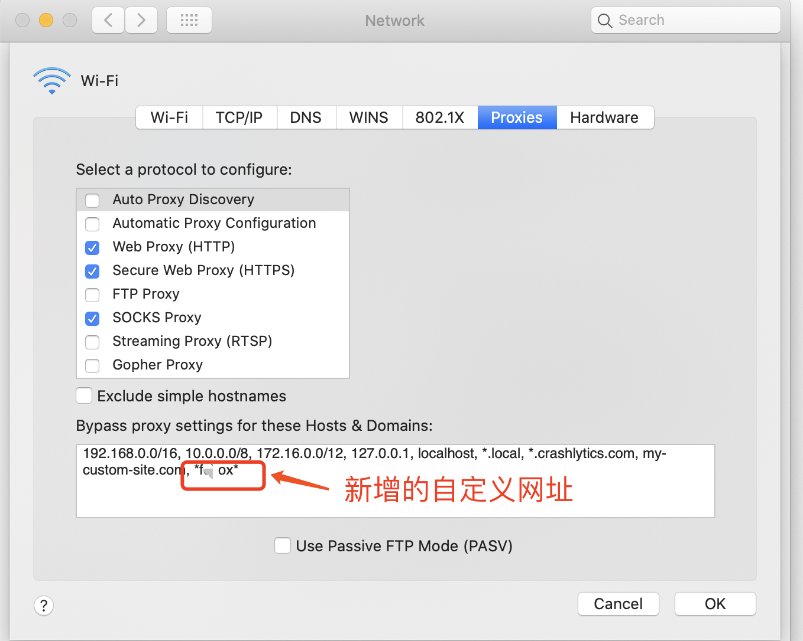

# FAQ

[TOC]


## 👉 How to Circumvent GFW and use Tor Network
#GFW #network #proxy #Tor 

📄 [how to circumvent GFW](https://support.torproject.org/censorship/connecting-from-china/)

To get an updated version of Tor Browser, try the Telegram bot first: [https://t.me/gettor_bot](https://t.me/gettor_bot). If that doesn't work, you can send an email to [gettor@torproject.org](mailto:gettor@torproject.org) with the subject "windows", "macos", or "linux" for the respective operating system.

After the installation, Tor Browser will try to connect to the Tor network. If Tor is blocked in your location, Connection Assist will try to automatically connect using a bridge or Snowflake. But if that doesn't work, the second step will be to obtain a bridge that works in China.

There are three options to unblock Tor in China:
1. **[Snowflake](https://support.torproject.org/censorship/what-is-snowflake/):** uses ephemeral proxies to connect to the Tor network. It's available in Tor Browser and other Tor powered apps like Orbot. You can select Snowflake from Tor Browser's [built-in bridge menu](https://support.torproject.org/censorship/how-can-i-use-snowflake/).
2. **Private and unlisted obfs4 bridges:** contact our Telegram Bot [@GetBridgesBot](https://t.me/GetBridgesBot) and type `/bridges`. Or send an email to [frontdesk@torproject.org](mailto:frontdesk@torproject.org) with the phrase "private bridge cn" in the subject of the email. If you are tech-savvy, you can run your own [obfs4 bridge](https://community.torproject.org/relay/setup/bridge/) from outside China. Remember that bridges distributed by [BridgeDB](https://bridges.torproject.org/), and built-in obfs4 bridges bundled in Tor Browser most likely won't work.
3. **meek-azure:** makes it look like you are browsing a Microsoft website instead of using Tor. However, because it has a bandwidth limitation, this option will be quite slow. You can select meek-azure from Tor Browser's built-in bridges dropdown.

If one of these options above is not working, check your [Tor logs](https://support.torproject.org/connecting/connecting-2/) and try another option.

If you need help, you can also get support on Telegram [https://t.me/TorProjectSupportBot](https://t.me/TorProjectSupportBot) and [Signal](https://signal.me/#p/+17787431312).


## 👉 Log  `~/.zshrc` .
#macos #proxy #clash 

Date: Nov.3.21
```shell
 # proxy list
alias setproxy="export https_proxy=http://127.0.0.1:7890;export http_proxy=http://127.0.0.1:7890;export all_proxy=socks5://127.0.0.1:7891;echo \"Set proxy successfully\" "
alias unsetproxy="unset http_proxy;unset https_proxy;unset all_proxy;echo \"Unset proxy successfully\" "
```
postscripts:
+ `http_proxy`,`https_proxy`,`ftp_proxy`,and `socks5_proxy` here is environment variable pre-defined by  [POSIX](http://pubs.opengroup.org/onlinepubs/9699919799/basedefs/V1_chap08.html) ?
	+ 👀 see questions on [What's the 'right' format for the HTTP_PROXY environment variable? Caps or no caps?](https://unix.stackexchange.com/questions/212894/whats-the-right-format-for-the-http-proxy-environment-variable-caps-or-no-ca)
+ `export` command here reset these environmnet variable. 


## 👉 mac配置clash代理忽略列表
#macos #clash

> 🔗 https://wonderlq.github.io/archives/87d77c17.html)

1. 在 ~/.config/clash/ 新建 proxyIgnoreList.plist文件

2. 编辑文件，内容如下:

   ```xml
   <?xml version="1.0" encoding="UTF-8"?>
   <!DOCTYPE plist PUBLIC "-//Apple//DTD PLIST 1.0//EN" "http://www.apple.com/DTDs/PropertyList-1.0.dtd">
   <plist version="1.0">
   <array>
       <string>192.168.0.0/16</string>
       <string>10.0.0.0/8</string>
       <string>172.16.0.0/12</string>
       <string>127.0.0.1</string>
       <string>localhost</string>
       <string>*.local</string>
       <string>*.crashlytics.com</string>
       <string>my-custom-site.com</string>
   </array>
   </plist>
   ```
3. 在array最后追加自定义需要忽略的网址。

4. 保存，重启。

5. 打开mac网络配置可以看到新配置。
   


## 👉 使用 Clash 加速同一局域网下其他设备
#clash #network 

Methods \#1: (directly connect to proxy process on the proxy server, simplest)
	1. make sure your proxy server's firewall policy allows income traffic & outcome traffic for the proxy request
	2. turn on the clash settings of "Allow connect from lan"

	1. set your device's proxy destination as your proxy server's destination in the LAN


[使用 Clash 加速同一局域网下其他设备]: https://blog.mebi.me/post/clash-speed-other-devices


Methods \#2:  (via Nginx / Apache HTTP Server)


[GoAccess Set the WebSocket server to listen on port 7890 and localhost]: https://stackoverflow.com/questions/38710438/goaccess-set-the-websocket-server-to-listen-on-port-7890-and-localhost


## 👉 Proxy for Linux / RaspberryPi via CLI & WebUI
#RaspberryPi #clash #linux

Here is a very detailed tutorial about how to set up proxy from both cli & ui via clash.

🏠 Clash: [https://github.com/Dreamacro/clash/releases](https://github.com/Dreamacro/clash/releases)

1. Dashboard UI
	1. https://github.com/razord/razord
	2. https://github.com/haishanh/yacd

2. Install clash core (without Web UI)

> 其他查看系统架构的命令： (树莓派) 
> 1. `uname -a`  
> 2. `cat /proc/cpuinfo`  
> 3. `getconf LONG_BIT`  
> 4. `file /bin/bash`  
> 5. `cat /proc/version`  
> 6. `dpkg --print-architecture`

3. Configuration
	1. `country.mmdb`
	2. `config.yaml`

> `clash` 默认配置文件放在 `/root/.config/clash` 目录下，需要两个文件，`config.yaml`、`Country.mmdb` 。
> - `config.yml` 是你的配置文件。但可能有的人并不喜欢把配置文件放在 `/root/.config/clash` 目录。也可以另外放。在运行的时候使用`/root/clash/clash -f 配置文件名 -d 配置文件路径` 
> - `Country.mmdb` 是一个设计用于存储IPv4和IPv6的数据信息的数据库，mmdb文件是一个二进制格式的文件，它使用一个二分查找树加速IP信息的查询。`clash` 分流的时候会用到，直接运行 `clash` 的话，他会从GitHub上下载，如果你是国内的话，下载链接是 [https://cdn.jsdelivr.net/gh/Dreamacro/maxmind-geoip@release/Country.mmdb](https://cdn.jsdelivr.net/gh/Dreamacro/maxmind-geoip@release/Country.mmdb)，原项目地址是：[https://github.com/Dreamacro/maxmind-geoip/releases](https://github.com/Dreamacro/maxmind-geoip/releases) ，但前几天`cdn.jsdelivr.net`刚被墙，所以不管是原来的项目地址还是国内都下不下来。

4. Launch clash

5. Clash usecase
	1. Use clash for single TCP pross (TCP App)
	2. Set shell proxy environment variables 
	3. Configure a paticular software's proxy settings for using Clash
		1. SSH `~/.ssh/config`
		2. Firefox
		3. etc..

6. ProxyChain

7. Set clash as system service


[👍【保姆级教程】Linux（树莓派）用代理上网并配置web界面]: https://pawswrite.xyz/posts/59203.html#


## 👉 为Clash添加代理规则
#clash 


[如何优雅地为 Clash 添加自定义代理规则？这是你要看的最后一篇教程]: https://v2ex.com/t/949462

看完这篇文章，只需要短短 4 步，你就可以实现：
- 配置一套属于自己的分流规则
- **无需** 自行搭建任何服务
- 在 **任意** 订阅上使用你的规则
- 拥有跨平台的、通用的、自动同步的自定义规则列表
下面是正文，原文链接在 [https://luxirty.com/article/custom-clash-rule](https://luxirty.com/article/custom-clash-rule) 内容跟这里没区别，只多了一两句话


## 👉 Comparing IPsec VPN vs SSL VPN
#VPN #IPSec #SSL/TLS

A Secure Socket Layer ([SSL](https://www.techtarget.com/searchsecurity/definition/Secure-Sockets-Layer-SSL)) VPN is another approach to securing a public network connection. The two can be used together or individually depending on the circumstances and security requirements.

With an IPsec VPN, IP packets are protected as they travel to and from the IPsec gateway at the edge of a private network and remote hosts and networks. An SSL VPN protects traffic as it moves between remote users and an SSL gateway. IPsec VPNs support all IP-based applications, while SSL VPNs only support browser-based applications, though they can support other applications with custom development.

Learn more about [how IPsec VPNs and SSL VPNs differ](https://www.techtarget.com/searchsecurity/feature/Tunnel-vision-Choosing-a-VPN-SSL-VPN-vs-IPSec-VPN)_ _in terms of authentication and access control, defending against attacks and client security. See what is best for your organization and where one type works best over the other.
