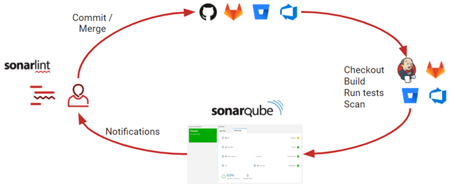

# Sonarqube

## 👀 Guides

### 🎁 Resources

📂 [Try Out SonarQube -- official docs](https://docs.sonarqube.org/latest/)


### 🚪Intro




**Sonarqube uses C/S architecture.** 

For Server side, install Sonarqube (community, professional)

For Client side, install Sonar-scanner, ant, maven or use IDE built-in plug-in. 


#### 💨 Quick-start

##### 🔨 Installation

👀 [Prerequisites and Overview](https://docs.sonarqube.org/latest/requirements/requirements/)

brew, docker, dmg, zip ...

skip.

 

##### Config:

###### 1. Server side

> config file found under installation directory. 
>
> Mine is `/usr/local/Cellar/sonarqube/9.5.0.56709/libexec/conf`


1. JDK
2. Database (choose one of the three)
   1. [PostgreSQL](http://www.postgresql.org/)

      1. Set configuration. See specifics on ↗ [PostgreSQL](../../../../../../../🔑%20CS%20Core/🤱🏻%20Computer%20Storage%20&%20Database%20Systems/Database%20Systems/Database%20System%20Implementation%20&%20Deployment%20&%20Maintenance/DBMS%20(DataBase%20Management%20System)%20Implementations/Object-Relational%20Database/PostgreSQL/PostgreSQL.md)
   2. [Microsoft SQL Server](http://www.microsoft.com/sqlserver/)
   3. [Oracle](http://www.oracle.com/database/)

      > ⚠️ NOTE:
      >
      > If no exterior database specified, Sonarqube uses its own built-in databases, which reads/writes data to RAM and thus not sustainable. 
      >
      > There will be a banner 🥓 at the bottom of the homepage warning data not persistent. Once connected to a persistent database system the banner goes off. 
3. Username/psword for server. 


```yaml
sonar.jdbc.username=testuser
sonar.jdbc.password=mypassword
sonar.jdbc.url=jdbc:postgresql://localhost:5432/sonarqube
```


###### 2. Client side

> config file found under installation directory. 
>
> Mine is `/usr/local/Cellar/sonar-scanner/4.7.0.2747/libexec/conf`


1. JDK
2. sonarqube server addr
3. etc. 

```properties
#Configure here general information about the environment, such as SonarQube server     connection details for example
#No information about specific project should appear here
#----- Default SonarQube server
sonar.host.url=http://localhost:9000
#----- Default source code encoding
sonar.sourceEncoding=UTF-8
```


##### 🔎 Scan

Depending on different clients, operation varies. 

Examples:

######  1️⃣ Sonar-scanner

```properties
# sonar-project.properties 

# 定义 sonarqube 服务器列表显示的项目名称
sonar.projectKey=devops-hello-service
 
# 定义项目名称
sonar.projectName=My project
 
# 定义项目的版本信息
sonar.projectVersion=1.0
 
# 指定扫描代码的目录位置（多个逗号分隔，java项目源代码一般在src目录下面）
# 此处为设置为当前目录
sonar.sources=./
 
# 执行项目编码
sonar.sourceEncoding=UTF-8

# 源代码储存目录
sonar.java.binaries=target
 
```


###### 2️⃣ Maven

Skip.


###### 3️⃣ Jenkins

Skip.


#### ⎈ Deploy Sonarqube on Kubernets

Tbd. 


#### 🖇 Refs

[SonarQube 03 SonarScanner的使用 java项目扫描]:https://blog.csdn.net/qq_34556414/article/details/117621335

