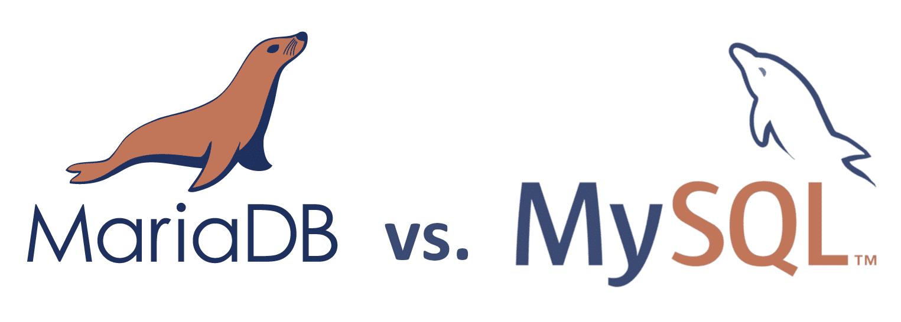

# FAQ

[TOC]

## 👉 mysql 🆚 Redis
#mysql #Redis #database #DBMS

- Mysql 是关系型数据库（SQL, Structured Query Language)，Redis 是非关系型数据库（non-SQL）

[mysql与Redis的区别---详细！]: https://www.cnblogs.com/Paul-watermelon/p/14211021.html

## 👉 mysql 🆚 mariaDB
#mysql #mariaDB #database #DBMS 

> [MariaDB had its first release](https://mariadb.com/kb/en/library/mariadb-5138-release-notes/) in October 2009, with version 5.1.38 Beta, based on MySQL 5.1.38. It was a fork meant to *[“to ensure that the MySQL code base would be free forever”](https://www.computerworld.com.au/article/457551/dead_database_walking_mysql_creator_why_future_belongs_mariadb/).*

> 此外,你也可以使用 MariaDB 代替，MariaDB 数据库管理系统是 MySQL 的一个分支，主要由开源社区在维护，采用 GPL 授权许可。开发这个分支的原因之一是：甲骨文公司收购了 MySQL 后，有将 MySQL 闭源的潜在风险，因此社区采用分支的方式来避开这个风险
> 
> MariaDB的目的是完全兼容MySQL，包括API和命令行，使之能轻松成为MySQL的代替品。

[mysql vs mariaDB]: https://kinsta.com/blog/mariadb-vs-mysql/

## 👉 Connect mysql running in docker from a local host
#mysql #docker #network 

[Connect to MySQL running in Docker container from a local machine | Medium]: https://towardsdatascience.com/connect-to-mysql-running-in-docker-container-from-a-local-machine-6d996c574e55

## 👉 Import `.sql` Files / Merge Multiple Databases
#mysql #database 

[How can i merge two mysql databases of same characteristics with out losing any data]: https://stackoverflow.com/questions/71050494/how-can-i-merge-two-mysql-databases-of-same-characteristics-with-out-losing-any

[Can I merge two databases into one in Mysql if they both have the same schema?]: https://stackoverflow.com/questions/6526824/can-i-merge-two-databases-into-one-in-mysql-if-they-both-have-the-same-schema

## Ref

