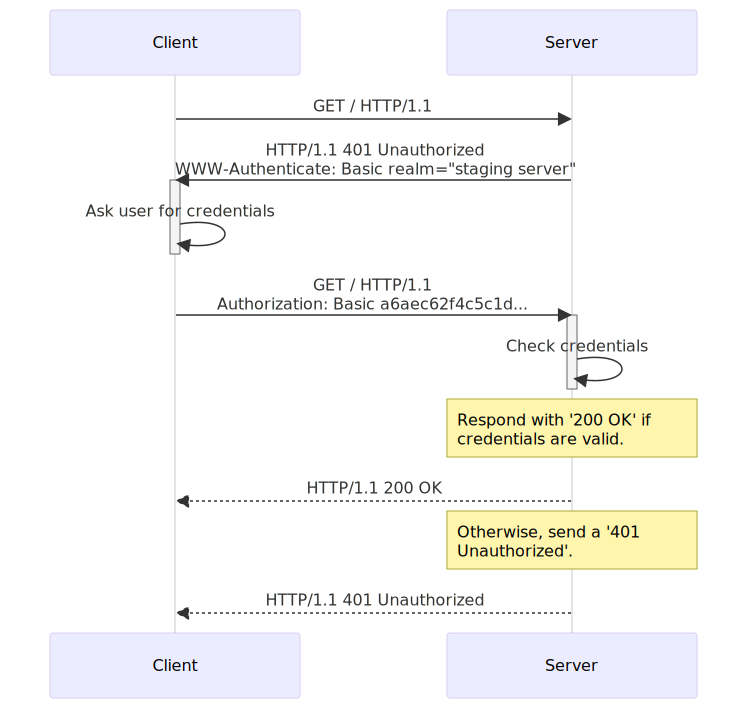

# HTTP Authentication

[TOC]


## Res
### Related Topics


## Intro: General HTTP Authentication Framework
> 🔗 https://developer.mozilla.org/en-US/docs/Web/HTTP/Guides/Authentication
> 
> HTTP provides a general framework for access control and authentication. This page is an introduction to the HTTP framework for authentication, and shows how to restrict access to your server using the HTTP "Basic" scheme.

[RFC 7235](https://datatracker.ietf.org/doc/html/rfc7235) defines the HTTP authentication framework, which can be used by a server to [challenge](https://developer.mozilla.org/en-US/docs/Glossary/Challenge) a client request, and by a client to provide authentication information.

The challenge and response flow works like this:
1. The server responds to a client with a [`401`](https://developer.mozilla.org/en-US/docs/Web/HTTP/Reference/Status/401) (Unauthorized) response status and provides information on how to authorize with a [`WWW-Authenticate`](https://developer.mozilla.org/en-US/docs/Web/HTTP/Reference/Headers/WWW-Authenticate) response header containing at least one challenge.
2. A client that wants to authenticate itself with the server can then do so by including an [`Authorization`](https://developer.mozilla.org/en-US/docs/Web/HTTP/Reference/Headers/Authorization) request header with the credentials.
3. Usually a client will present a password prompt to the user and will then issue the request including the correct `Authorization` header.



The general message flow above is the same for most (if not all) [authentication schemes](https://developer.mozilla.org/en-US/docs/Web/HTTP/Guides/Authentication#authentication_schemes). The actual information in the headers and the way it is encoded does change!


### `WWW-Authenticate` and `Proxy-Authenticate` Headers
> 🔗 https://developer.mozilla.org/en-US/docs/Web/HTTP/Guides/Authentication#www-authenticate_and_proxy-authenticate_headers

The [`WWW-Authenticate`](https://developer.mozilla.org/en-US/docs/Web/HTTP/Reference/Headers/WWW-Authenticate) and [`Proxy-Authenticate`](https://developer.mozilla.org/en-US/docs/Web/HTTP/Reference/Headers/Proxy-Authenticate) response headers define the authentication method that should be used to gain access to a resource. They must specify which authentication scheme is used, so that the client that wishes to authorize knows how to provide the credentials.

The syntax for these headers is the following:

``` http
WWW-Authenticate: <type> realm=<realm>
Proxy-Authenticate: <type> realm=<realm>
```

Here, `<type>` is the authentication scheme ("Basic" is the most common scheme and [introduced below](https://developer.mozilla.org/en-US/docs/Web/HTTP/Guides/Authentication#basic_authentication_scheme)). The _realm_ is used to describe the protected area or to indicate the scope of protection. This could be a message like "Access to the staging site" or similar, so that the user knows to which space they are trying to get access to.


### `Authorization` and `Proxy-Authorization` Headers
> 🔗 https://developer.mozilla.org/en-US/docs/Web/HTTP/Guides/Authentication#authorization_and_proxy-authorization_headers

The [`Authorization`](https://developer.mozilla.org/en-US/docs/Web/HTTP/Reference/Headers/Authorization) and [`Proxy-Authorization`](https://developer.mozilla.org/en-US/docs/Web/HTTP/Reference/Headers/Proxy-Authorization) request headers contain the credentials to authenticate a user agent with a (proxy) server. Here, the `<type>` is needed again followed by the credentials, which can be encoded or encrypted depending on which authentication scheme is used.

``` HTTP
Authorization: <type> <credentials>
Proxy-Authorization: <type> <credentials>
```


## Authentication Schemes
> 🔗 https://developer.mozilla.org/en-US/docs/Web/HTTP/Guides/Authentication#authentication_schemes

The general HTTP authentication framework is the base for a number of authentication schemes.

IANA maintains a [list of authentication schemes](https://www.iana.org/assignments/http-authschemes/http-authschemes.xhtml), but there are other schemes offered by host services, such as Amazon AWS.

Some common authentication schemes include:
- [**Basic**](https://developer.mozilla.org/en-US/docs/Web/HTTP/Guides/Authentication#basic)
	- See [RFC 7617](https://datatracker.ietf.org/doc/html/rfc7617), base64-encoded credentials. More information below.
- [**Bearer**](https://developer.mozilla.org/en-US/docs/Web/HTTP/Guides/Authentication#bearer)
	- See [RFC 6750](https://datatracker.ietf.org/doc/html/rfc6750), bearer tokens to access OAuth 2.0-protected resources
- [**Digest**](https://developer.mozilla.org/en-US/docs/Web/HTTP/Guides/Authentication#digest)
	- See [RFC 7616](https://datatracker.ietf.org/doc/html/rfc7616). Firefox 93 and later support the SHA-256 algorithm. Previous versions only support MD5 hashing (not recommended).
- [**HOBA**](https://developer.mozilla.org/en-US/docs/Web/HTTP/Guides/Authentication#hoba)
	- See [RFC 7486](https://datatracker.ietf.org/doc/html/rfc7486), Section 3, **H**TTP **O**rigin-**B**ound **A**uthentication, digital-signature-based
- [**Mutual**](https://developer.mozilla.org/en-US/docs/Web/HTTP/Guides/Authentication#mutual)
	- See [RFC 8120](https://datatracker.ietf.org/doc/html/rfc8120)
- [**Negotiate** / **NTLM**](https://developer.mozilla.org/en-US/docs/Web/HTTP/Guides/Authentication#negotiate)
	- See [RFC4599](https://datatracker.ietf.org/doc/html/rfc4559)
- [**VAPID**](https://developer.mozilla.org/en-US/docs/Web/HTTP/Guides/Authentication#vapid)
	- See [RFC 8292](https://datatracker.ietf.org/doc/html/rfc8292)
- [**SCRAM**](https://developer.mozilla.org/en-US/docs/Web/HTTP/Guides/Authentication#scram)
	- See [RFC 7804](https://datatracker.ietf.org/doc/html/rfc7804)
- [**AWS4-HMAC-SHA256**](https://developer.mozilla.org/en-US/docs/Web/HTTP/Guides/Authentication#aws4-hmac-sha256)
	- See [AWS docs](https://docs.aws.amazon.com/AmazonS3/latest/API/sigv4-auth-using-authorization-header.html). This scheme is used for AWS3 server authentication.

Schemes can differ in security strength and in their availability in client or server software.

The "Basic" authentication scheme offers very poor security, but is widely supported and easy to set up. It is introduced in more detail below.


### HTTP Basic Authentication Scheme
> 🔗 https://developer.mozilla.org/en-US/docs/Web/HTTP/Guides/Authentication#basic_authentication_scheme

The "Basic" HTTP authentication scheme is defined in [RFC 7617](https://datatracker.ietf.org/doc/html/rfc7617), which transmits credentials as user ID/password pairs, encoded using base64.


**Security of basic authentication**
As the user ID and password are passed over the network as clear text (it is base64 encoded, but base64 is a reversible encoding), the basic authentication scheme is not secure. HTTPS/TLS should be used with basic authentication to prevent credential interception.

In addition, sites that use HTTP Basic Auth are particularly vulnerable to [Cross-Site Request Forgery (CSRF)](https://developer.mozilla.org/en-US/docs/Glossary/CSRF) attacks because the user credentials are sent in all requests regardless of origin (this differs cookie-based credential mechanisms, because cookies are commonly blocked in cross site requests). Sites should always use the POST requests when changing data, and include [CSRF tokens](https://developer.mozilla.org/en-US/docs/Web/Security/Attacks/CSRF).

Without these security enhancements, basic authentication should not be used to protect sensitive or valuable information.


**HTTP Basic Authentication + Apache**
(skiped.)

**HTTP Basic Authentication + Nginx**
(skiped.)


## Ref
[ "Basic Authentication" in Five Minutes | OktaDev - Youtube]: https://youtu.be/rhi1eIjSbvk?si=9OI5sKXIJP0svBsH

[Brute Force HTTP Basic Authentication with Hydra | 0xBEN]: https://notes.benheater.com/books/hydra/page/brute-force-http-basic-authentication-with-hydra
The basic process to begin brute forcing web logins with Hydra goes like this:  
1. Open your web browser
2. Navigate to the target site
3. Open the browser developer tools  
    Or, configure traffic to go through a HTTP proxy (e.g. Burp Suite)
4. Make a login attempt to the target service
5. Inspect the request using the browser developer tools or proxied request
    - Note the target URL
    - Note the HTTP method
    - Note any special headers
    - Note any request body / payload
    - Note the server response for invalid logins
