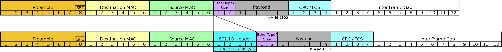

# 802.1Q

[TOC]

## Res
### Related Topics
↗ [IEEE 802.1 (Higher Layer LAN Protocols Working Group)](../../📌%20IEEE%20802%20Family/IEEE%20802.1%20(Higher%20Layer%20LAN%20Protocols%20Working%20Group).md)

## Intro
> 🔗 https://en.wikipedia.org/wiki/IEEE_802.1Q

IEEE 802.1Q, often referred to as Dot1q, is the networking standard that supports **virtual local area networking (VLANs)** on an IEEE 802.3 Ethernet network. The standard defines a system of VLAN tagging for Ethernet frames and the accompanying procedures to be used by bridges and switches in handling such frames. The standard also contains provisions for a quality-of-service prioritization scheme commonly known as IEEE 802.1p and defines the Generic Attribute Registration Protocol.
Portions of the network which are VLAN-aware (i.e., IEEE 802.1Q conformant) can include VLAN tags. When a frame enters the VLAN-aware portion of the network, a tag is added to represent the VLAN membership. Each frame must be distinguishable as being within exactly one VLAN. A frame in the VLAN-aware portion of the network that does not contain a VLAN tag is assumed to be flowing on the native VLAN.
The standard was developed by IEEE 802.1, a working group of the IEEE 802 standards committee, and continues to be actively revised with notable amendments including IEEE 802.1ad, IEEE 802.1ak and IEEE 802.1s. The 802.1Q-2014 revision incorporated the IEEE 802.1D-2004 standard

## Ref

