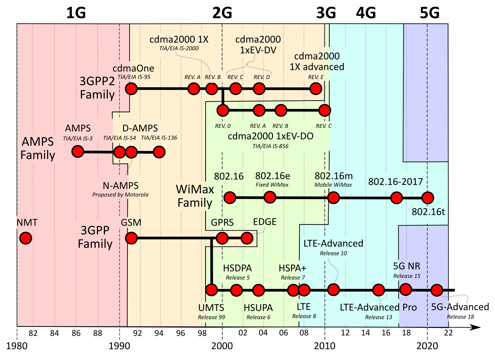

# Mobile Network Technology & Cellular Network

[TOC]

## Res
### Related Topics

### Other Resources

## Intro
> 🔗 https://en.wikipedia.org/wiki/Cellular_network

A **cellular network** or **mobile network** is a communication network where **the link to and from end nodes is wireless**. The network is distributed over land areas called "cells", each served by at least one fixed-location [transceiver](https://en.wikipedia.org/wiki/Transceiver) (typically three [cell sites](https://en.wikipedia.org/wiki/Cell_site) or [base transceiver stations](https://en.wikipedia.org/wiki/Base_transceiver_station)). These base stations provide the cell with the network coverage which can be used for transmission of voice, data, and other types of content. A cell typically uses a different set of frequencies from neighboring cells, to avoid interference and provide guaranteed service quality within each cell. 

When joined together, these cells provide radio coverage over a wide geographic area. This enables numerous portable transceivers (e.g., [mobile phones](https://en.wikipedia.org/wiki/Mobile_phone), [tablets](https://en.wikipedia.org/wiki/Tablet_computer) and [laptops](https://en.wikipedia.org/wiki/Laptop) equipped with [mobile broadband modems](https://en.wikipedia.org/wiki/Mobile_broadband_modem), [pagers](https://en.wikipedia.org/wiki/Pager), etc.) to communicate with each other and with fixed transceivers and telephones anywhere in the network, via base stations, even if some of the transceivers are moving through more than one cell during transmission.

## 🧗‍♀️ Evolution of Mobile Networks

<small>Cellular network standards and generation timeline.</small>

### 1️⃣ 1G Mobile Networks
1G是20世纪80年代推出的第一代无线移动通信。

1G是基于模拟信号通过电路交换技术，只提供语音通信(即没有数据)

### 2️⃣ [2G](https://en.wikipedia.org/wiki/2G) Mobile Networks (the first digital networks, 1G and 0G were analog)
- [GSM](https://en.wikipedia.org/wiki/GSM)
  - [Circuit Switched Data](https://en.wikipedia.org/wiki/Circuit_Switched_Data) (CSD)
  - [GPRS](https://en.wikipedia.org/wiki/GPRS)
  - [EDGE](https://en.wikipedia.org/wiki/EDGE)(IMT-SC)
  - [Evolved EDGE](https://en.wikipedia.org/wiki/Evolved_EDGE)
- [Digital AMPS](https://en.wikipedia.org/wiki/Digital_AMPS)
  - [Cellular Digital Packet Data](https://en.wikipedia.org/wiki/Cellular_Digital_Packet_Data) (CDPD)
- [cdmaOne](https://en.wikipedia.org/wiki/CdmaOne) (IS-95)
  - [Circuit Switched Data](https://en.wikipedia.org/wiki/Circuit_Switched_Data) (CSD)

### 3️⃣ [3G](https://en.wikipedia.org/wiki/3G) Mobile Networks
-  [UMTS](https://en.wikipedia.org/wiki/UMTS)
  - [W-CDMA](https://en.wikipedia.org/wiki/W-CDMA) (air interface)
  - [TD-CDMA](https://en.wikipedia.org/wiki/TD-CDMA) (air interface)
  - [TD-SCDMA](https://en.wikipedia.org/wiki/TD-SCDMA) (air interface)
    - [HSPA](https://en.wikipedia.org/wiki/High_Speed_Packet_Access)
    - [HSDPA](https://en.wikipedia.org/wiki/HSDPA)
    - [HSPA+](https://en.wikipedia.org/wiki/HSPA%2B)
- [CDMA2000](https://en.wikipedia.org/wiki/CDMA2000)
  - [OFDMA](https://en.wikipedia.org/wiki/OFDMA) (air interface)
    - [EVDO](https://en.wikipedia.org/wiki/EVDO)
      - [SVDO](https://en.wikipedia.org/wiki/SVDO)

### 4️⃣ [4G](https://en.wikipedia.org/wiki/4G) Mobile Networks
- [LTE](https://en.wikipedia.org/wiki/LTE_(telecommunication)) (TD-LTE/ FDD-LTE)
  - [LTE Advanced](https://en.wikipedia.org/wiki/LTE_Advanced)
  - [LTE Advanced Pro](https://en.wikipedia.org/wiki/LTE_Advanced_Pro)
- [WiMAX](https://en.wikipedia.org/wiki/WiMAX)
  - [WiMAX-Advanced](https://en.wikipedia.org/wiki/WiMAX-Advanced) (WirelessMAN-Advanced)
- [Ultra Mobile Broadband](https://en.wikipedia.org/wiki/Ultra_Mobile_Broadband) (never commercialized)
- [MBWA](https://en.wikipedia.org/wiki/IEEE_802.20) (IEEE 802.20, Mobile Broadband Wireless Access, HC-SDMA, iBurst, has been shut down)

### 5️⃣ [5G](https://en.wikipedia.org/wiki/5G) Mobile Networks
- [5G NR](https://en.wikipedia.org/wiki/5G_NR) /NG-RAN
- [5G-Advanced](https://en.wikipedia.org/wiki/5G-Advanced)
- 5GCN

## Ref
[Cellular Network | Wikipedia]: https://en.wikipedia.org/wiki/Cellular_network
[👍 移动通信网络架构 1G-5G]: https://www.cnblogs.com/R-bear/p/17978188
