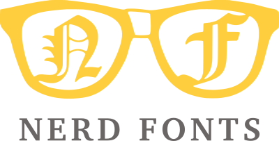
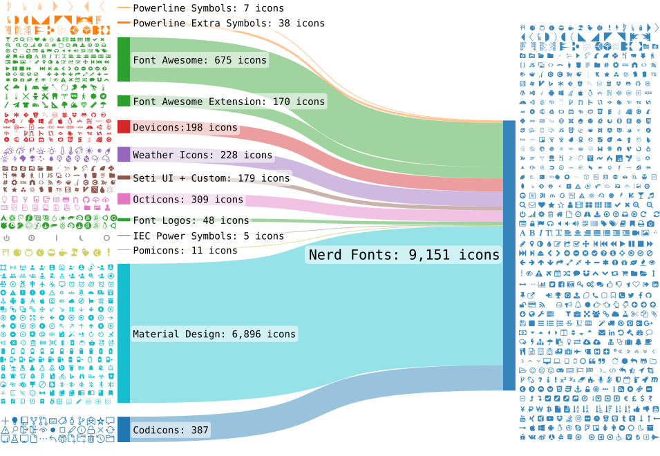

# Fonts

[TOC]

## Res
### Related Topics

## 👉 Nerd Fonts

**Nerd Fonts** is a project that patches developer targeted fonts with a high number of glyphs (icons). Specifically to add a high number of extra glyphs from popular 'iconic fonts' such as [Font Awesome](https://github.com/FortAwesome/Font-Awesome), [Devicons](https://vorillaz.github.io/devicons/), [Octicons](https://github.com/primer/octicons), and [others](https://github.com/ryanoasis/nerd-fonts#glyph-sets).

The following Sankey flow diagram shows the current glyph sets included:

## 👉 dejavu-sans-mono
https://www.fontsquirrel.com/fonts/dejavu-sans-mono
The DejaVu fonts are a font family based on the Bitstream Vera Fonts (http://gnome.org/fonts/). Its purpose is to provide a wider range of characters (see status.txt for more information) while maintaining the original look and feel.

DejaVu fonts are based on Bitstream Vera fonts version 1.10.

## Ref

