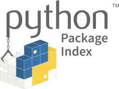

# Python Third-party Libs

[TOC]

## Res
🏠 🔍 https://pypi.org

### Related Topics
↗ [The Python Standard Library](../../../../GPL%20(General%20Purpose%20Languages)/🐍%20Python/🌷%20The%20Python%20Standard%20Library/The%20Python%20Standard%20Library.md)
↗ [Python Based ML Libraries](../../../../../../🧠%20Computing%20Methodologies/👽%20Artificial%20Intelligence/🏗️%20AI%20(Data)%20Infrastructure%20&%20Techniques%20Stack/🛫%20Foundation%20Models%20&%20Development%20&%20SDKs/ML%20Programming%20&%20Frameworks/⭐️%20Python%20Based%20ML%20Libraries/Python%20Based%20ML%20Libraries.md)

### Other Resources
🏠 https://palletsprojects.com
🚧 https://github.com/pallets
Pallets is the open source community organization that develops and supports popular Python frameworks. The goal of Pallets is to grow the community around these projects to create a sustainable group of maintainers, contributors, and users.
- flask
- jinja
- click
- werkzeug
- itsdangerours
- etc..

## Intro

## PyPI

🏠 https://pypi.org

The Python Package Index (PyPI) is a repository of software for the Python programming language.

PyPI helps you find and install software developed and shared by the Python community. [Learn about installing packages](https://packaging.python.org/installing/).

Package authors use PyPI to distribute their software. [Learn how to package your Python code for PyPI](https://packaging.python.org/tutorials/packaging-projects/).

## Ref
[👍 Hunting for Malicious Packages on PyPI]: https://jordan-wright.com/blog/post/2020-11-12-hunting-for-malicious-packages-on-pypi/
About a year ago, the Python Software Foundation [opened a Request for Information (RFI)](https://discuss.python.org/t/what-methods-should-we-implement-to-detect-malicious-content/2240) to discuss how we could detect malicious packages being uploaded to PyPI. Whether it’s [taking over abandoned packages](https://blog.npmjs.org/post/141577284765/kik-left-pad-and-npm), [typosquatting on popular libraries](https://github.com/dateutil/dateutil/issues/984), or [hijacking packages using credential stuffing](https://github.com/ChALkeR/notes/blob/master/Gathering-weak-npm-credentials.md), it’s clear this is a real issue affecting nearly every package manager. 

The truth is that package managers like PyPI are critical infrastructure that almost every company relies on. I could write for days on this topic, but I’ll just let this xkcd suffice for now.

[👍 Finding malicious PyPI packages through static code analysis: Meet GuardDog]: https://securitylabs.datadoghq.com/articles/guarddog-identify-malicious-pypi-packages/
