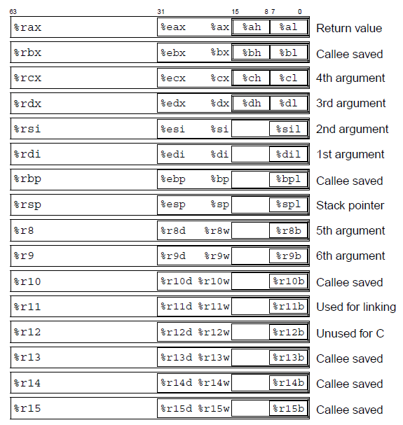

# x86_32 (x86)

[TOC]


## Res
📂 https://learn.microsoft.com/en-us/windows-hardware/drivers/debugger/annotated-x86-disassembly
Annotated x86 Disassembly, Windows Documentation/Windows Drivers/Windows Debugging Tools/

> Microsoft Win32 uses the x86 processor in _32-bit flat mode_. This documentation will focus only on the flat mode.


### Related Topics
↗ [x86_32 ASM (x86 ASM)](../../../../../../👩‍💻%20Computer%20Languages%20&%20Programming%20Methodology/Other%20Languages%20&%20Formats/ASM%20(Assembly%20Languages)%20🆘/x86%20ISA%20Based%20ASM/x86_32%20ASM%20(x86%20ASM)/x86_32%20ASM%20(x86%20ASM).md)


### Other Resources
🔍 👍 https://x86.syscall.sh


## Intro


## 🎯 x86_32 Registers
The x86 architecture consists of the following unprivileged integer registers.

|   |   |
|---|---|
|**eax**|Accumulator|
|**ebx**|Base register|
|**ecx**|Counter register|
|**edx**|Data register - can be used for I/O port access and arithmetic functions|
|**esi**|Source index register|
|**edi**|Destination index register|
|**ebp**|Base pointer register|
|**esp**|Stack pointer|

All integer registers are 32 bit. However, many of them have 16-bit or 8-bit subregisters. Below is a 64bit register illustration, but it applies to 32bit as well.



Operating on a subregister affects only the subregister and none of the parts outside the subregister. For example, storing to the **ax** register leaves the high 16 bits of the **eax** register unchanged.

When using the [**? (Evaluate Expression)**](https://learn.microsoft.com/en-us/windows-hardware/drivers/debugger/---evaluate-expression-) command, registers should be prefixed with an "at" sign ( **@** ). For example, you should use **? @ax** rather than **? ax**. This ensures that the debugger recognizes **ax** as a register rather than a symbol.

However, the (@) is not required in the [**r (Registers)**](https://learn.microsoft.com/en-us/windows-hardware/drivers/debugger/r--registers-) command. For instance, **r ax=5** will always be interpreted correctly.

Two other registers are important for the processor's current state.

|   |   |
|---|---|
|**eip**|instruction pointer|
|**flags**|flags|

- The instruction pointer is the address of the instruction being executed.
- The flags register is a collection of single-bit flags. Many instructions alter the flags to describe the result of the instruction. These flags can then be tested by conditional jump instructions. (See "x86_32 Flags" below 👇)


## 🎯 x86_32 Calling Conventions
The x86 architecture has several different calling conventions. Fortunately, they all follow the same register preservation and function return rules:
- Functions must preserve all registers, except for **eax**, **ecx**, and **edx**, which can be changed across a function call, and **esp**, which must be updated according to the calling convention.
- The **eax** register receives function return values if the result is 32 bits or smaller. If the result is 64 bits, then the result is stored in the **edx:eax** pair.

The following is a list of calling conventions used on the x86 architecture:
- Win32 (**__stdcall**)
    Function parameters are passed on the stack, pushed right to left, and the callee cleans the stack.
    
- Native C++ method call (also known as thiscall)
    Function parameters are passed on the stack, pushed right to left, the "this" pointer is passed in the **ecx** register, and the callee cleans the stack.
    
- COM (**__stdcall** for C++ method calls)
    Function parameters are passed on the stack, pushed right to left, then the "this" pointer is pushed on the stack, and then the function is called. The callee cleans the stack.
    
- **__fastcall**
    The first two DWORD-or-smaller arguments are passed in the **ecx** and **edx** registers. The remaining parameters are passed on the stack, pushed right to left. The callee cleans the stack.
    
- **__cdecl**
    Function parameters are passed on the stack, pushed right to left, and the caller cleans the stack. The **__cdecl** calling convention is used for all functions with variable-length parameters.


## 🎯 x86_32 Conditions


## 🎯 x86_32 Flags
These are single-bit registers and have a variety of uses.

The following table lists the x86 flags:

|Flag Code|Flag Name|Value|Flag Status|Description|
|---|---|---|---|---|
|**of**|Overflow Flag|0 1|**nvov**|No overflow - Overflow|
|**df**|Direction Flag|0 1|**updn**|Direction up - Direction down|
|**if**|Interrupt Flag|0 1|**diei**|Interrupts disabled - Interrupts enabled|
|**sf**|Sign Flag|0 1|**plng**|Positive (or zero) - Negative|
|**zf**|Zero Flag|0 1|**nzzr**|Nonzero - Zero|
|**af**|Auxiliary Carry Flag|0 1|**naac**|No auxiliary carry - Auxiliary carry|
|**pf**|Parity Flag|0 1|**pepo**|Parity odd - Parity even|
|**cf**|Carry Flag|0 1|**nccy**|No carry - Carry|
|**tf**|Trap Flag|||If **tf** equals 1, the processor will raise a STATUS_SINGLE_STEP exception after the execution of one instruction. This flag is used by a debugger to implement single-step tracing. It should not be used by other applications.|
|**iopl**|I/O Privilege Level|||I/O Privilege Level This is a two-bit integer, with values between zero and 3. It is used by the operating system to control access to hardware. It should not be used by applications.|

When registers are displayed as a result of some command in the Debugger Command window, it is the _flag status_ that is displayed. However, if you want to change a flag using the [**r (Registers)**](https://learn.microsoft.com/en-us/windows-hardware/drivers/debugger/r--registers-) command, you should refer to it by the _flag code_.

In the Registers window of WinDbg, the flag code is used to view or alter flags. The flag status is not supported.

Here is an example. In the preceding register display, the flag status **ng** appears. This means that the sign flag is currently set to 1. To change this, use the following command:
```
r sf=0
```

This sets the sign flag to zero. If you do another register display, the **ng** status code will not appear. Instead, the **pl** status code will be displayed.

The Sign Flag, Zero Flag, and Carry Flag are the most commonly-used flags.


## 🎯 x86_32 Data Types
- byte: 8 bits
- word: 16 bits
- dword: 32 bits
- qword: 64 bits (includes floating-point doubles)
- tword: 80 bits (includes floating-point extended doubles)
- oword: 128 bits


## 🎯 x86_32 Addressing Modes


## Other Notes
### Pipelining
The Pentium is dual-issue, which means that it can perform up to two actions in one clock tick. However, the rules on when it is capable of doing two actions at once (known as _pairing_) are very complicated.

Because x86 is a CISC processor, you do not have to worry about jump delay slots.

### Synchronized Memory Access
Load, modify, and store instructions can receive a **lock** prefix, which modifies the instruction as follows:
1. Before issuing the instruction, the CPU will flush all pending memory operations to ensure coherency. All data prefetches are abandoned.
2. While issuing the instruction, the CPU will have exclusive access to the bus. This ensures the atomicity of the load/modify/store operation.

The **xchg** instruction automatically obeys the previous rules whenever it exchanges a value with memory.
All other instructions default to nonlocking.

### Jump Prediction
Unconditional jumps are predicted to be taken.

Conditional jumps are predicted to be taken or not taken, depending on whether they were taken the last time they were executed. The cache for recording jump history is limited in size.

If the CPU does not have a record of whether the conditional jump was taken or not taken the last time it was executed, it predicts backward conditional jumps as taken and forward conditional jumps as not taken.

### Alignment
The x86 processor will automatically correct unaligned memory access, at a performance penalty. No exception is raised.

A memory access is considered aligned if the address is an integer multiple of the object size. For example, all BYTE accesses are aligned (everything is an integer multiple of 1), WORD accesses to even addresses are aligned, and DWORD addresses must be a multiple of 4 in order to be aligned.

The **lock** prefix should not be used for unaligned memory accesses.


## Ref
[👍 x86 Architecture | windows Documentation]: https://learn.microsoft.com/en-us/windows-hardware/drivers/debugger/x86-architecture

