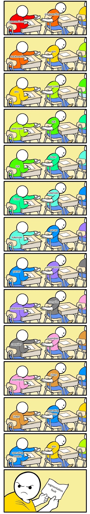

# Programming Language Processing & Program Execution

[TOC]

## Res
### Related Topics
↗ [ASM (Assembly Languages)](../👩‍💻%20Computer%20Languages%20&%20Programming%20Methodology/ASM%20(Assembly%20Languages)/ASM%20(Assembly%20Languages).md)
↗ [Instruction Set Architecture (ISA) & Processor Architecture](../👷🏾‍♂️%20Computer%20(Host)%20System/Computer%20Architecture/Instruction%20Set%20Architecture%20(ISA)%20&%20Processor%20Architecture/Instruction%20Set%20Architecture%20(ISA)%20&%20Processor%20Architecture.md)
↗ [ISA Instruction Basics](../👷🏾‍♂️%20Computer%20(Host)%20System/Computer%20Architecture/Instruction%20Set%20Architecture%20(ISA)%20&%20Processor%20Architecture/📌%20ISA%20Basics/📌%20ISA%20Instruction%20Basics/ISA%20Instruction%20Basics.md)
↗ [Operating System & OS Kernel (Theory Part)](../👷🏾‍♂️%20Computer%20(Host)%20System/Operating%20System%20&%20OS%20Kernel%20(Theory%20Part)/Operating%20System%20&%20OS%20Kernel%20(Theory%20Part).md)
- ↗ [System Software Engineering](../../Software%20Engineering/👇%20System%20Software%20Engineering/System%20Software%20Engineering.md)

↗ [The Essence of Computing - Programs & The Semantics of Programs](../../🗺%20CS%20Overview/The%20Essence%20of%20Computing%20-%20Programs%20&%20The%20Semantics%20of%20Programs.md)

↗ [File Types & File Formats](../👷🏾‍♂️%20Computer%20(Host)%20System/Operating%20System%20&%20OS%20Kernel%20(Theory%20Part)/OS%20IO%20System/IO%20Generality%20(via%20Abstraction)/File%20&%20File%20System/File%20Types%20&%20File%20Formats.md)
- ↗ [ELF (Executable and Linkable Format)](../🥷🏼%20Operating%20Systems%20&%20Kernels%20(Engineering%20Part)/Linux%20(Derived%20From%20UNIX%20Family)/🔩%20Linux%20Kernel/Linux%20IO%20&%20Files%20Management/🤔%20Linux%20File%20System/Linux%20File%20Types%20&%20Formats/ELF%20(Executable%20and%20Linkable%20Format)/ELF%20(Executable%20and%20Linkable%20Format).md)
- ↗ [Windows PE (Portable Executable) File](../🥷🏼%20Operating%20Systems%20&%20Kernels%20(Engineering%20Part)/Microsoft%20Operating%20Systems/Windows/📌%20Windows%20NT%20(New%20Technology)%20Kernel/Windows%20IO%20&%20Files%20Management/Windows%20File%20System/Window%20File%20Types%20&%20Formats/Windows%20PE%20(Portable%20Executable)%20File/Windows%20PE%20(Portable%20Executable)%20File.md)

↗ [SCA (Static Code Analysis) & SAST](../../CyberSecurity/🏰%20Cybersecurity%20Basics%20&%20InfoSec/🍦%20Software%20Security/🪆%20Software%20(Program)%20Analysis%20&%20Binary%20Engineering/📌%20Software%20(Program)%20Analysis%20Basics/👚%20SCA%20(Static%20Code%20Analysis)%20&%20SAST/SCA%20(Static%20Code%20Analysis)%20&%20SAST.md)
↗ [DCA (Dynamic Code Analysis) & DAST](../../CyberSecurity/🏰%20Cybersecurity%20Basics%20&%20InfoSec/🍦%20Software%20Security/🪆%20Software%20(Program)%20Analysis%20&%20Binary%20Engineering/📌%20Software%20(Program)%20Analysis%20Basics/👙%20DCA%20(Dynamic%20Code%20Analysis)%20&%20DAST/DCA%20(Dynamic%20Code%20Analysis)%20&%20DAST.md)
↗ [Computer Languages & Programming Methodology](../👩‍💻%20Computer%20Languages%20&%20Programming%20Methodology/Computer%20Languages%20&%20Programming%20Methodology.md)
↗ [Application Runtimes & SDKs](../👩‍💻%20Computer%20Languages%20&%20Programming%20Methodology/🛠️%20Programming%20Tool%20Chain/🚠%20Application%20Runtimes%20&%20SDKs/Application%20Runtimes%20&%20SDKs.md)
↗ [Cloud Runtime](../../Software%20Engineering/☁️%20Cloud%20Computing%20&%20Cloud%20Native/Cloud%20Operating%20System%20&%20Platform%20(System%20Level%20Engineering)/Cloud%20Runtime/Cloud%20Runtime.md)

↗ [OS Processes & Automata Management (CPU + Main Memory Resource)](../👷🏾‍♂️%20Computer%20(Host)%20System/Operating%20System%20&%20OS%20Kernel%20(Theory%20Part)/OS%20Processes%20&%20Automata%20Management%20(CPU%20+%20Main%20Memory%20Resource)/OS%20Processes%20&%20Automata%20Management%20(CPU%20+%20Main%20Memory%20Resource).md)
↗ [Firmware and Computer (OS) Booting](../👷🏾‍♂️%20Computer%20(Host)%20System/Firmware%20and%20Computer%20(OS)%20Booting/Firmware%20and%20Computer%20(OS)%20Booting.md)
- ↗ [Computer Bootstrap (Boot)](../👷🏾‍♂️%20Computer%20(Host)%20System/Firmware%20and%20Computer%20(OS)%20Booting/🌽%20Computer%20Bootstrap%20(Boot)/Computer%20Bootstrap%20(Boot).md)

↗ [Programming Tool Chain](../👩‍💻%20Computer%20Languages%20&%20Programming%20Methodology/🛠️%20Programming%20Tool%20Chain/Programming%20Tool%20Chain.md)
- ↗ [Application Runtimes & SDKs](../👩‍💻%20Computer%20Languages%20&%20Programming%20Methodology/🛠️%20Programming%20Tool%20Chain/🚠%20Application%20Runtimes%20&%20SDKs/Application%20Runtimes%20&%20SDKs.md)
- ↗ [Compilation & Program Loading Tools](../👩‍💻%20Computer%20Languages%20&%20Programming%20Methodology/🛠️%20Programming%20Tool%20Chain/Compilation%20&%20Program%20Loading%20Tools/Compilation%20&%20Program%20Loading%20Tools.md)

↗ [IDE (Integrated Development Environment)](../../Software%20Engineering/CASE%20(Computer-Aided%20Software%20Engineering)%20Tools/Lower%20CASE%20Tools/IDE%20(Integrated%20Development%20Environment)/IDE%20(Integrated%20Development%20Environment).md)

↗ [Natural Language Processing (NLP) & Computational Linguistics](../../🧠%20Computing%20Methodologies/👽%20Artificial%20Intelligence/Natural%20Language%20Processing%20(NLP)%20&%20Computational%20Linguistics/Natural%20Language%20Processing%20(NLP)%20&%20Computational%20Linguistics.md)

### Learning Resources
#### Books
📖 CSAPP: Computer System: A Programmer's Perspective
↗ [Intro to Computer Science](../../🗺%20CS%20Overview/💋%20Intro%20to%20Computer%20Science/Intro%20to%20Computer%20Science.md)

📖 程序员的自我修养：编译，链接，库

🔥 👍 从裸机启动开始运行一个C++程序
http://t.csdnimg.cn/fpEXy

📖 Compilers: Principles, Techniques, and Tools -- Alfred V.Aho, Ravi Sethi, Jeffrey D.Ullman

📖 Modern Compiler Implementation in C -- Andrew W.Appel, with Jens Palsberg

📖 Advanced Compiler Design and Implementation -- Steven S.Muchnick
#### Online Resources
https://www.zhihu.com/column/c_1309081772639563776
linux内核技术

## Intro
### What is a Program?
↗ [The Essence of Computing - Programs & The Semantics of Programs](../../🗺%20CS%20Overview/The%20Essence%20of%20Computing%20-%20Programs%20&%20The%20Semantics%20of%20Programs.md)

user's perspective:
system's perspective:
software perspective:
hardware perspective:

### Compilation Systems from Programmers' Perspective (Reasons for Programers to Understand Compilation Systems)
> Quote from CSAPP

However, there are some important reasons why programmers need to understand how compilation systems work:
- **Optimizing program performance**. Modern compilers are sophisticated tools that usually produce good code. As programmers, we do not need to know the inner workings of the compiler in order to write efficient code. However, in order to make good coding decisions in our C programs, we do need a basic understanding of machine-level code and how the compiler translates different C statements into machine code.
	- For example, is a switch statement always more efficient than a sequence of if-else statements? How much overhead is incurred by a function call? Is a while loop more efficient than a for loop? Are pointer references more efficient than array indexes? Why does our loop run so much faster if we sum into a local variable instead of an argument that is passed by reference? How can a function run faster when we simply rearrange the parentheses in an arithmetic expression?
- **Understanding link-time errors**. In our experience, some of the most perplexing programming errors are related to the operation of the linker, especially when you are trying to build large software systems. 
	- For example, what does it mean when the linker reports that it cannot resolve a reference? What is the difference between a static variable and a global variable? What happens if you define two global variables in different C files with the same name? What is the difference between a static library and a dynamic library? Why does it matter what order we list libraries on the command line? And scariest of all, why do some linker-related errors not appear until run time? 
- **Avoiding security holes**. For many years, buffer overflow vulnerabilities have accounted for many of the security holes in network and Internet servers. These vulnerabilities exist because too few programmers understand the need to carefully restrict the quantity and forms of data they accept from untrusted sources. A first step in learning secure programming is to understand the consequences of the way data and control information are stored on the program stack.

## Phases in Programming Language Processing

<small>src: CSAPP</small>

<small>Application Execution and Computer Data Flow</small>

<small>The process of compilation</small>

### 0️⃣ Information, Encoding, Computer/Digital System Data Representations & Computer File Formats
↗ [(Text) Data Representations & Storage in Computer](../../🗺%20CS%20Overview/💋%20Intro%20to%20Computer%20Science/😤%20Information,%20Data,%20Number%20and%20Math%20in%20Digital%20Systems/(Text)%20Data%20Representations%20&%20Storage%20in%20Computer.md)
↗ [Encodings](../../🗺%20CS%20Overview/💋%20Intro%20to%20Computer%20Science/😤%20Information,%20Data,%20Number%20and%20Math%20in%20Digital%20Systems/Encodings.md)

↗ [Reliable Data Transfer (RDT)](../🏎️%20Computer%20Networking%20and%20Communication/📌%20Computer%20Networking%20Basics%20(Protocol%20Part)/Reliable%20Data%20Transfer%20(RDT)/Reliable%20Data%20Transfer%20(RDT).md)
↗ [Information Theory](../../🧮%20Mathematics/🥸%20Information%20Theory/Information%20Theory.md)

↗ [OS /File System](../👷🏾‍♂️%20Computer%20(Host)%20System/Operating%20System%20&%20OS%20Kernel%20(Theory%20Part)/OS%20IO%20System/IO%20Generality%20(via%20Abstraction)/File%20&%20File%20System/File%20&%20File%20System.md)
↗ [OS /Linux /Linux File Formats](../🥷🏼%20Operating%20Systems%20&%20Kernels%20(Engineering%20Part)/Linux%20(Derived%20From%20UNIX%20Family)/🔩%20Linux%20Kernel/Linux%20IO%20&%20Files%20Management/🤔%20Linux%20File%20System/Linux%20File%20Types%20&%20Formats/Linux%20File%20Types%20&%20Formats.md)

### 0️⃣ (Compiled) Programming Languages
↗ [Computer Languages & Programming Methodology](../👩‍💻%20Computer%20Languages%20&%20Programming%20Methodology/Computer%20Languages%20&%20Programming%20Methodology.md)
- ↗ [Compiled Languages](../👩‍💻%20Computer%20Languages%20&%20Programming%20Methodology/Compiled%20Languages/Compiled%20Languages.md)
- ↗ [Interpreted Languages](../👩‍💻%20Computer%20Languages%20&%20Programming%20Methodology/Interpreted%20Languages/Interpreted%20Languages.md)
- ↗ [ASM (Assembly Languages)](../👩‍💻%20Computer%20Languages%20&%20Programming%20Methodology/ASM%20(Assembly%20Languages)/ASM%20(Assembly%20Languages).md)
- ↗ [DSL(Domain Specific Languages) & GPL(General Purpose Languages)](../👩‍💻%20Computer%20Languages%20&%20Programming%20Methodology/Other%20Languages%20for%20Specific%20Areas/🪁%20DSL(Domain%20Specific%20Languages)%20&%20GPL(General%20Purpose%20Languages)/DSL(Domain%20Specific%20Languages)%20&%20GPL(General%20Purpose%20Languages).md)
- ↗ [Media Formats & Standards & Codec (Coder-Decoder)](../🧙‍♂️%20Algorithm%20&%20Data%20Structure/Other%20Topics%20in%20Algorithms/Data%20Compression%20Technologies/Media%20Formats%20&%20Standards%20&%20Codec%20(Coder-Decoder)/Media%20Formats%20&%20Standards%20&%20Codec%20(Coder-Decoder).md)

↗ [Automata Theory and (Formal) Language Theory](../../🧮%20Mathematics/🤼‍♀️%20Mathematical%20Logic%20(Foundations%20of%20Mathematics)/😶‍🌫️%20Theory%20of%20Computation/🍏%20Automata%20Theory%20and%20(Formal)%20Language%20Theory/Automata%20Theory%20and%20(Formal)%20Language%20Theory.md)
↗ [Natural Language Processing (NLP) & Computational Linguistics](../../🧠%20Computing%20Methodologies/👽%20Artificial%20Intelligence/Natural%20Language%20Processing%20(NLP)%20&%20Computational%20Linguistics/Natural%20Language%20Processing%20(NLP)%20&%20Computational%20Linguistics.md)

### 1️⃣ Compilation (Compile-time)
↗ [Program Language Processing & Compilation Theory (Compile-time)](🚮%20Program%20Language%20Processing%20&%20Compilation%20Theory%20(Compile-time)/Program%20Language%20Processing%20&%20Compilation%20Theory%20(Compile-time).md)
- ↗ [Compilation Phase](🚮%20Program%20Language%20Processing%20&%20Compilation%20Theory%20(Compile-time)/Compilation%20Phase/Compilation%20Phase.md)
- ↗ [Assembly Phase](🚮%20Program%20Language%20Processing%20&%20Compilation%20Theory%20(Compile-time)/Assembly%20Phase/Assembly%20Phase.md)

↗ [Software (Program) Analysis & Binary Engineering](../../CyberSecurity/🏰%20Cybersecurity%20Basics%20&%20InfoSec/🍦%20Software%20Security/🪆%20Software%20(Program)%20Analysis%20&%20Binary%20Engineering/Software%20(Program)%20Analysis%20&%20Binary%20Engineering.md)
- ↗ [SCA (Static Code Analysis) & SAST](../../CyberSecurity/🏰%20Cybersecurity%20Basics%20&%20InfoSec/🍦%20Software%20Security/🪆%20Software%20(Program)%20Analysis%20&%20Binary%20Engineering/📌%20Software%20(Program)%20Analysis%20Basics/👚%20SCA%20(Static%20Code%20Analysis)%20&%20SAST/SCA%20(Static%20Code%20Analysis)%20&%20SAST.md)

### 2️⃣/3️⃣ Linking (Link-time) & Loading (Load-time)
↗ [Program Linking & Loading (Link-time & Load-time)](🚽%20Program%20Linking%20&%20Loading%20(Link-time%20&%20Load-time)/Program%20Linking%20&%20Loading%20(Link-time%20&%20Load-time).md)
↗ [Assembly Phase](🚮%20Program%20Language%20Processing%20&%20Compilation%20Theory%20(Compile-time)/Assembly%20Phase/Assembly%20Phase.md)

### 4️⃣ Execution (Runtime)
↗ [von Neumann Based Microarchitecture /Memory Access](🤡%20Program%20Execution%20(Runtime)/Instruction%20Execution/Memory%20Access%20&%20Addressing.md)
↗ [System Security /Memory Attack](../../CyberSecurity/System%20Security/🏃%20Software%20Runtime%20Security/📝%20Memory%20Security/Memory%20Threats%20&%20Attacks/Memory%20Threats%20&%20Attacks.md)

↗ [Program Execution (Runtime)](🤡%20Program%20Execution%20(Runtime)/Program%20Execution%20(Runtime).md)
↗ [Application Runtimes & SDKs](../👩‍💻%20Computer%20Languages%20&%20Programming%20Methodology/🛠️%20Programming%20Tool%20Chain/🚠%20Application%20Runtimes%20&%20SDKs/Application%20Runtimes%20&%20SDKs.md)

↗ [Operating System & OS Kernel (Theory Part)](../👷🏾‍♂️%20Computer%20(Host)%20System/Operating%20System%20&%20OS%20Kernel%20(Theory%20Part)/Operating%20System%20&%20OS%20Kernel%20(Theory%20Part).md)
- ↗ [OS Processes & Automata Management (CPU + Main Memory Resource)](../👷🏾‍♂️%20Computer%20(Host)%20System/Operating%20System%20&%20OS%20Kernel%20(Theory%20Part)/OS%20Processes%20&%20Automata%20Management%20(CPU%20+%20Main%20Memory%20Resource)/OS%20Processes%20&%20Automata%20Management%20(CPU%20+%20Main%20Memory%20Resource).md)
- ↗ [OS Memory Management (Main Memory + Secondary Memory Resource)](../👷🏾‍♂️%20Computer%20(Host)%20System/Operating%20System%20&%20OS%20Kernel%20(Theory%20Part)/OS%20Memory%20Management%20(Main%20Memory%20+%20Secondary%20Memory%20Resource)/OS%20Memory%20Management%20(Main%20Memory%20+%20Secondary%20Memory%20Resource).md)

↗ [System Security](../../CyberSecurity/System%20Security/System%20Security.md)
- ↗ [Software (Program) Analysis & Binary Engineering](../../CyberSecurity/🏰%20Cybersecurity%20Basics%20&%20InfoSec/🍦%20Software%20Security/🪆%20Software%20(Program)%20Analysis%20&%20Binary%20Engineering/Software%20(Program)%20Analysis%20&%20Binary%20Engineering.md)
- ↗ [Anti-Reverse Engineering & Software Protection](../../CyberSecurity/🏰%20Cybersecurity%20Basics%20&%20InfoSec/🍦%20Software%20Security/🪆%20Software%20(Program)%20Analysis%20&%20Binary%20Engineering/Anti-Reverse%20Engineering%20&%20Software%20Protection/Anti-Reverse%20Engineering%20&%20Software%20Protection.md)
- ↗ [Techniques - Vulnerability Disclosure & Discovery](../../CyberSecurity/🏰%20Cybersecurity%20Basics%20&%20InfoSec/🍦%20Software%20Security/🐒%20Software%20Vulnerability%20&%20Weakness/Vulnerability%20Mangement%20Techniques/Techniques%20-%20Vulnerability%20Disclosure%20&%20Discovery.md)
- ↗ [Software Vulnerability & Weakness](../../CyberSecurity/🏰%20Cybersecurity%20Basics%20&%20InfoSec/🍦%20Software%20Security/🐒%20Software%20Vulnerability%20&%20Weakness/Software%20Vulnerability%20&%20Weakness.md)
#### High-Level Language Function-Level Execution (Logical Execution)
> ↗ [Program Execution (Runtime)](🤡%20Program%20Execution%20(Runtime)/Program%20Execution%20(Runtime).md)

> Use Linux program execution for example
> 🔗 https://gist.github.com/x0nu11byt3/bcb35c3de461e5fb66173071a2379779

Summary:
- `_start` calls the libc `__libc_start_main`;
- `__libc_start_main` calls the executable `__libc_csu_init` (statically-linked part of the libc);
- `__libc_csu_init` calls the executable constructors (and other initialisatios);
- `__libc_start_main` calls the executable `main()`;
- `__libc_start_main` calls the executable `exit()`.

#### CPU-Level Execution (Instruction Execution)
↗ [ISA /Instruction Basics](../👷🏾‍♂️%20Computer%20(Host)%20System/Computer%20Architecture/Instruction%20Set%20Architecture%20(ISA)%20&%20Processor%20Architecture/📌%20ISA%20Basics/📌%20ISA%20Instruction%20Basics/ISA%20Instruction%20Basics.md)
↗ [ISA /Instruction Execution](🤡%20Program%20Execution%20(Runtime)/Instruction%20Execution/Instruction%20Execution.md)

<small>Instruction Processing Level</small>

## Ref
[Execution (computing) | Wikipedia]: https://en.wikipedia.org/wiki/Execution_(computing)

[程序的编译、装载与链接 - piginzoo的文章 - 知乎]: https://zhuanlan.zhihu.com/p/139026433
[《链接、装载与库》 阅读笔记 (1)- 基本概念与静态链接]: https://wulc.me/2020/05/31/《链接、装载与库》阅读笔记(1)-基本概念与静态链接/

[高级语言的编译：链接及装载过程介绍]: https://tech.meituan.com/2015/01/22/linker.html

[《程序员的自我修养》——全书思维导图（上）]: https://www.zhihu.com/tardis/zm/art/111682188?source_id=1003
[【读书】《程序员的自我修养》——全书思维导图（中） - 一尾66的文章 - 知乎]: 
https://zhuanlan.zhihu.com/p/138345701

[编译原理三大经典：龙书 虎书 鲸书 | cnblog]: https://www.cnblogs.com/Arthurian/p/7881889.html

[程序翻译与程序解释 | cnblog]: https://www.cnblogs.com/jvStarBlog/p/11941513.html

**硬件逻辑层**：主要由门电路、触发器等逻辑电路组成，属于电子工程的领域，这里就不展开介绍了。

**微程序机器层**：编程语言主要是微指令集，微指令所组成的微程序直接交由硬件执行，主要是由生产硬件的公司的程序员来编写的。

**传统机器层**：编程语言主要是CPU指令集（机器指令），和硬件是直接相关的，程序员所用机器指令编写的程序可以交由微程序直接进行解析，而这里提到的指令集，存储在CPU内部，对CPU的运算进行指导和优化，拥有指令集，CPU就可以有效地运行。我们知道，CPU的制造商分为AMD和Intel两大阵营，那么这两大厂商生产的CPU最大的区别是——指令集不同，Intel的CPU所使用的指令集不适合AMD的CPU，同样的，AMD的CPU所使用的指令集也不适合Intel。除了不同厂商以后，同一个厂商也可以生产不同指令集的CPU，即不同架构的CPU使用不同的CPU指令集。

**操作系统层**：操作系统，一方面，向上提供了简易的操作界面，使得用户能够容易地操作计算机；同时，向下对接了指令系统，管理硬件资源。操作系统对用户程序所使用机器的各种资源进行管理和分配，包括CPU、存储器等等，比如说，当一个用户程序需要运行的时候，首先由操作系统将其加载到内存中，这就需要操作系统首先为其分配内存空间来进行存储。再比如说，某一个程序需要使用某一个输出设备进行结果输出的时候，需要操作系统为其提供该设备的控制权。由此可见，操作系统是在软件和硬件之间的适配层。

**汇编语言层**：编程语言是汇编语言，汇编语言可以翻译成可直接执行的机器语言，完成这个翻译过程的程序就是汇编器。从这一层开始，它们所使用的编程语言就是人类比较容易理解的语言了。

**高级语言层**：编程语言就是为广大程序员所接受的高级语言，种类非常多，有几百种，常见的编程语言有Python、Java、C/C++、Golang等。

**应用层**：计算机针对某种用途而设计的应用，像Word、Excel等。
