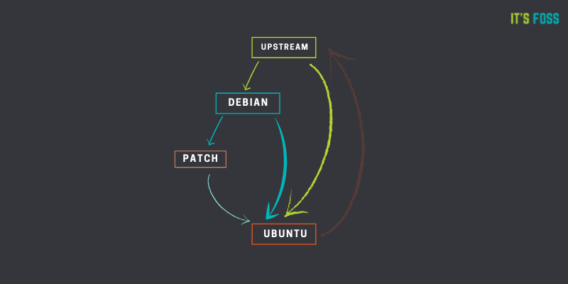

# Ubuntu

[TOC]

## Res
### Canonical Version Ubuntu
🏠 https://ubuntu.com
💰 [Canonical](https://canonical.com) is leading the Ubuntu ecosystem.

📂 https://ubuntu.com/server/docs/ (Canonical Official server docs)

📂 🫂 https://ubuntu.com/community/support
The Ubuntu Community provides a number of resources to help support new and experienced users, provide spaces for discussion, and help troubleshoot common technical issues.

📂 👥 https://help.ubuntu.com/ (Ubuntu Official Doc & Community Help Wiki)

📂 👥 👷🏻 https://launchpad.net/ubuntu/  (Ubuntu Dev Community)
> Launchpad is an open source suite of tools that help people and teams to work together on software projects. [See the tour](https://launchpad.net/+tour) for an introduction to what you can do with Launchpad.

As an active member of our community, you probably should check out what else is going on in the world of Ubuntu: 
- [The Fridge](http://fridge.ubuntu.com/) posts all the latest News and Upcoming Events. 
- [Planet Ubuntu](http://planet.ubuntu.com/) is a collection of community blogs.

If you are interested in getting to know other Ubuntu users or seeing a list of Ubuntu teams outside the general Ubuntu world, check out our [social network page](https://wiki.ubuntu.com/Social).

📄 https://manpages.ubuntu.com
Ubuntu man page repository

### Community Version Ubuntu
📂 https://wiki.ubuntu.com/Home (Community version against Canonical version??)

## Intro
> **TL;DR**
> 
> **Devian vs Ubuntu**
> [Debian](https://www.debian.org/) is a volunteer project that has developed and maintained a GNU/Linux operating system for well over a decade.
>
> **Canonical** leads the Ubuntu ecosystem, partnering with public cloud and hardware providers.
>
> 👉 more info on the difference between the two distros at ↗ [FAQ/ 👉 Diff between Ubuntu & Debian](../../FAQ.md#👉%20Diff%20between%20Ubuntu%20&%20Debian)

Ubuntu is derived from Debian. It means that Ubuntu uses the same APT packaging system as Debian and shares a huge number of packages and libraries from Debian repositories. It utilizes the Debian infrastructure as base.

That’s what most ‘derived’ distributions do. They use the same package management system and share packages as the base distribution. But they also add some packages and changes of their own. And that is how Ubuntu is different from Debian despite being derived from it.

## Ref

