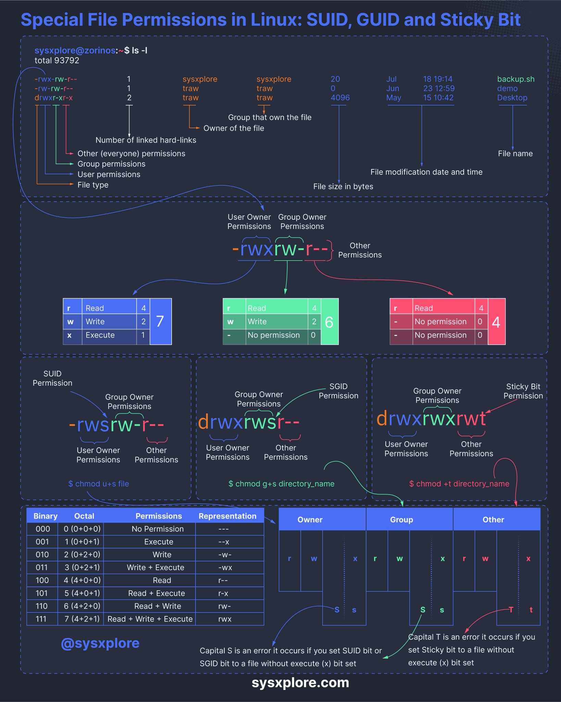

# Linux File Permissions

[TOC]


## Res
### Related Topics
↗ [SeedLab - Software Security / Set-UID](../../../../../../CyberSecurity/☠️%20Kill%20Chain%20&%20Security%20Tool%20Box/🎯%20Cyber%20Ranges%20&%20Labs/🧪%20Ranges%20&%20Security%20Labs/SEED%20Project/SeedLab%20-%20Software%20Security.md)
↗ [Text & File & Dir Management Basics](../../../Linux%20Free%20Software%20&%20OSS%20(Open%20Source%20Software)/Text%20&%20File%20&%20Dir%20Management/Text%20&%20File%20&%20Dir%20Management%20Basics.md)


### Other Resources


## Intro

<small>Special FIle Permissions in Linux: SUID, SGID, and Sticky Bit. Not the head of the image has a typo.</small>


## Linux Special Permissions: SUID, SGID, Sticky Bit
> 🔗 https://www.redhat.com/sysadmin/suid-sgid-sticky-bit

Special permissions make up a fourth access level in addition to **user**, **group**, and **other**. Special permissions allow for additional privileges over the standard permission sets (as the name suggests). There is a special permission option for each access level discussed previously. 


### 1️⃣ user + s(pecial), SUID, Set-UID
> ↗ [SeedLab - Software Security / Set-UID](../../../../../../CyberSecurity/☠️%20Kill%20Chain%20&%20Security%20Tool%20Box/🎯%20Cyber%20Ranges%20&%20Labs/🧪%20Ranges%20&%20Security%20Labs/SEED%20Project/SeedLab%20-%20Software%20Security.md)

Commonly noted as **SUID**, the special permission for the user access level has a single function: A file with **SUID** always executes as the user who owns the file, regardless of the user passing the command. If the file owner doesn't have execute permissions, then use an uppercase **S** here.

Now, to see this in a practical light, let's look at the `/usr/bin/passwd` command. This command, by default, has the SUID permission set:
```shell
[tcarrigan@server ~]$ ls -l /usr/bin/passwd 
-rwsr-xr-x. 1 root root 33544 Dec 13  2019 /usr/bin/passwd
```

Note the **s** where **x** would usually indicate execute permissions for the user.


### 2️⃣ group + s(pecial), SGID, Set-GID
Commonly noted as **SGID**, this special permission has a couple of functions:
- If set on a file, it allows the file to be executed as the **group** that owns the file (similar to SUID)
- If set on a directory, any files created in the directory will have their **group**ownership set to that of the directory owner
```shell
[tcarrigan@server article_submissions]$ ls -l 
total 0
drwxrws---. 2 tcarrigan tcarrigan  69 Apr  7 11:31 my_articles
```

This permission set is noted by a lowercase **s** where the **x** would normally indicate **execute** privileges for the **group**. It is also especially useful for directories that are often used in collaborative efforts between members of a group. Any member of the group can access any new file. This applies to the execution of files, as well. **SGID** is very powerful when utilized properly.

As noted previously for **SUID**, if the owning group does not have execute permissions, then an uppercase **S** is used.


### 3️⃣ other + t(sticky), Sticky Bit
The last special permission has been dubbed the "**sticky bit**". This permission does not affect individual files. However, at the directory level, it restricts file deletion. Only the **owner** (and **root**) of a file can remove the file within that directory. A common example of this is the `/tmp` directory:
```shell
[tcarrigan@server article_submissions]$ ls -ld /tmp/
drwxrwxrwt. 15 root root 4096 Sep 22 15:28 /tmp/
```

The permission set is noted by the lowercase **t**, where the **x** would normally indicate the execute privilege.


### Setting special permissions
To set special permissions on a file or directory, you can utilize either of the two methods outlined for standard permissions above: Symbolic or numerical.

Let's assume that we want to set **SGID** on the directory `community_content`.

To do this using the symbolic method, we do the following:

```shell
[tcarrigan@server article_submissions]$ chmod g+s community_content/
```

Using the numerical method, we need to pass a fourth, preceding digit in our `chmod`command. The digit used is calculated similarly to the standard permission digits:

- Start at 0
- SUID = 4
- SGID = 2
- Sticky = 1

The syntax is:

```shell
[tcarrigan@server ~]$ chmod X### file | directory
```

Where **X** is the special permissions digit.

Here is the command to set **SGID** on `community_content` using the numerical method:

```shell
[tcarrigan@server article_submissions]$ chmod 2770 community_content/
[tcarrigan@server article_submissions]$ ls -ld community_content/
drwxrws---. 2 tcarrigan tcarrigan 113 Apr  7 11:32 community_content/
```


## Ref
[👍 Linux Cygwin知识库（二）：目录、文件及基本操作]: https://silaoa.github.io/2019/2019-05-04-Linux%20Cygwin知识库（二）：目录、文件及基本操作.html

[SUID, SGID, and sticky bit]: https://www.redhat.com/sysadmin/suid-sgid-sticky-bit
[Linux File Permissions: Understanding setuid, setgid, and the Sticky Bit]: https://www.cbtnuggets.com/blog/technology/system-admin/linux-file-permissions-understanding-setuid-setgid-and-the-sticky-bit