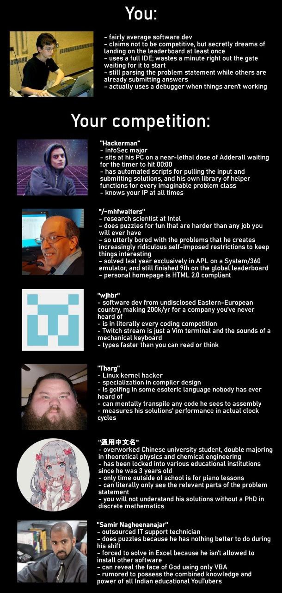

# Intro to Computer Science

[TOC]

## Res
### Related Topics
↗ [🤯 Awesome List](../🤯%20Awesome%20List.md)
↗ [Computer (Host) System](../../🔑%20CS%20Core/👷🏾‍♂️%20Computer%20(Host)%20System/Computer%20(Host)%20System.md)
- ↗ [Computer Taxonomy & Computer (Hardware) Components](../../🔑%20CS%20Core/👷🏾‍♂️%20Computer%20(Host)%20System/Computer%20Taxonomy%20&%20Computer%20(Hardware)%20Components.md)
- ↗ [Computer Architecture](../../🔑%20CS%20Core/👷🏾‍♂️%20Computer%20(Host)%20System/Computer%20Architecture/Computer%20Architecture.md)

↗ [🌲 Road To CS](🌲%20Road%20To%20CS.md)
↗ [一个仅供参考的CS学习规划](CS自学指南（转）/一个仅供参考的CS学习规划.md)

↗ [Universe, Self-Awareness, and Intelligence](../../../Universe,%20Self-Awareness,%20and%20Intelligence.md)

↗ [History of Computing](../../🧠%20Computing%20Methodologies/History%20of%20Computing.md)
↗ [World's Science & Technology History](../../../Other%20Networks%20of%20Knowledge/📜%20Human%20History/World's%20Science%20&%20Technology%20History/World's%20Science%20&%20Technology%20History.md)
↗ [News Focus (IT-exclusive)](../../../Assets/World%20Chronology/News%20Focus%20(IT-exclusive)/News%20Focus%20(IT-exclusive).md)

### Courses
UC Berkeley CS61
- ↗ [CS61A Structure and Interpretation of Computer Programs](👩🏼‍🏫%20Courses%20of%20Universities/UC%20Berkeley/CS61/CS61A%20Structure%20and%20Interpretation%20of%20Computer%20Programs.md)
- ↗ [CS61B Data Structures](👩🏼‍🏫%20Courses%20of%20Universities/UC%20Berkeley/CS61/CS61B%20Data%20Structures.md)
- ↗ [CS61C Great Ideas in Computer Architecture](👩🏼‍🏫%20Courses%20of%20Universities/UC%20Berkeley/CS61/CS61C%20Great%20Ideas%20in%20Computer%20Architecture.md)

CMU Intro to Computer Science
- ↗ [CMU/ICS](👩🏼‍🏫%20Courses%20of%20Universities/CMU/15-213,%2014-513,%2015-513%20(ICS)/15-213,%2014-513,%2015-513%20(ICS).md)
- 📖 [CSAPP](http://csapp.cs.cmu.edu/3e/home.html)
	- [CSAPP Blog Page](http://csappbook.blogspot.com)
	- [gitbook chinese version (partial)](https://hansimov.gitbook.io/csapp/)

↗ [NJU/计算机系统基础](👩🏼‍🏫%20Courses%20of%20Universities/NJU%20南京大学/计算机系统基础/计算机系统基础.md)
↗ [Harvard/CS50x](👩🏼‍🏫%20Courses%20of%20Universities/Harvard/CS50x/CS50x.md)

🎬 [Crash Course Computer Science](https://www.bilibili.com/video/BV1EW411u7th/?p=16&share_source=copy_web&vd_source=7740584ebdab35221363fc24d1582d9d )

https://space.bilibili.com/392208938/channel/collectiondetail?sid=3139667&spm_id_from=333.788.0.0
合集·直观理解计算机技术

### Other Resources
📖 New Perspectives Computer Concepts Comprehensive, June Jamrich Parsons
🔗 https://www.amazon.com/Perspectives-Computer-Concepts-Comprehensive-MindTap/dp/0357674618
- Digital Content
- Digital Devices
- Networks
- The Web
- Social Media
- Software
- Digital Security
- The ICT Industry
- Information Systems
- Databases
- Programming
- Coding with Python

## 🐕 Computer Science Introduction & Overview
### Why is CS needed?
> 💡 This section only stands for personal views. 

TL;DR
- The universe is made of **objects /maters**. According to different frames of references, objects can be still or in movement. 
	- The movement of objects leads to **energy**.
- One unique existence in the universe: objects that has self-consciousness. The universe thus is divided into objects with self-consciousness and objects without self-consciousness.
- Objects with self-consciousness (humans) exists in the way of **information**.
	- Knowledge is connected information. Language or symbolic system is the media of information.
	- The computation of information and the engineering  to the universe compromise the intelligence of self-consciousness, i.e. human intelligence. Human intelligence demonstrates itself in two dimension: logic ability and sentimental ability.
- The universe is thus compromised of three elements: objects /maters, energy, and information.
- The automation of computation of information gives rise to the study of computer science.
	- The ultimate goal of computer science is to reach to the extreme of computational power, i.e. the ability like human intelligence or beyond that in regard of the computation of information.
	- Strong computational power don't make human-like intelligence, the combination of computational power and engineering ability makes human-like intelligence, or even human ourselves. However, a more widely-accepted version of such intelligence, artificial intelligence, aims to only reach the maximal power of computational ability, ignoring the engineering part. 

<small>The relationship of language, information/data, computation, and automation.</small>

<small>From CS to AGI: Computing and Intelligence</small>

↗ [Universe, Self-Awareness, and Intelligence](../../../Universe,%20Self-Awareness,%20and%20Intelligence.md)

### What is CS?
> [!links]
> ↗ [🌲 Road To CS /CS & IT in Difference Aspects](🌲%20Road%20To%20CS.md#CS%20&%20IT%20in%20Difference%20Aspects)
> ↗ [The Essence of Computing - Programs & The Semantics of Programs](../The%20Essence%20of%20Computing%20-%20Programs%20&%20The%20Semantics%20of%20Programs.md)

> 🔗 https://en.wikipedia.org/wiki/Computer_science#Fields
> 🔗 https://en.wikipedia.org/wiki/Outline_of_computer_science

**Computer science is the study of [information](https://en.wikipedia.org/wiki/Information "Information"), [computation](https://en.wikipedia.org/wiki/Computation "Computation"), and [automation](https://en.wikipedia.org/wiki/Automation "Automation").** 

Computer science spans [theoretical disciplines](https://en.wikipedia.org/wiki/Theoretical_computer_science "Theoretical computer science") (such as algorithms, theory of computation, and information theory) to [applied disciplines](https://en.wikipedia.org/wiki/Applied_science "Applied science") (including the design and implementation of hardware and software). 

<small>What can computers do?</small>
#### A Deeper Thinking of Computation

↗ [Universe, Self-Awareness, and Intelligence](../../../Universe,%20Self-Awareness,%20and%20Intelligence.md)
↗ [Information Theory](../../🧮%20Mathematics/🥸%20Information%20Theory/Information%20Theory.md)

↗ [The Essence of Computing - Programs & The Semantics of Programs](../The%20Essence%20of%20Computing%20-%20Programs%20&%20The%20Semantics%20of%20Programs.md)

↗ [Computing Methodologies](../../🧠%20Computing%20Methodologies/Computing%20Methodologies.md)
- ↗ [Artificial Intelligence](../../🧠%20Computing%20Methodologies/👽%20Artificial%20Intelligence/Artificial%20Intelligence.md)
- ↗ [LLM (Large Language Model)](../../🧠%20Computing%20Methodologies/👽%20Artificial%20Intelligence/Natural%20Language%20Processing%20(NLP)%20&%20Computational%20Linguistics/🦑%20LLM%20(Large%20Language%20Model)/LLM%20(Large%20Language%20Model).md)
#### The Domain Knowledge of CS
> [!links]
> ↗ [🌲 Road To CS](🌲%20Road%20To%20CS.md)
> ↗ [Academics 🎓 (In CS)](../../Academics%20🎓%20(In%20CS)/Academics%20🎓%20(In%20CS).md)

<small>Computer System & Computer Science Overview</small>

<small>Computer Networks & Supplements to the Computer Science Overview </small>

<small>Language, Computer Language, and  Programming Language Processing</small>

<small>Computer Program Execution Procedure: Top-down Review</small>

<small><a>https://en.wikipedia.org/wiki/Computer_science#External_links</a></small>

**TL;DR**  (personal opinion)
In general, the domain of computer science includes 3 major areas:
- ==Theoretical & Formal Computer Science== (theories and math)
	- Theory of Computation
	- Algorithms and Data Structures
	- \*Programming Methodology and Languages (Stride from theory to engineering)
	- etc.
- ==Computer Elements and Architecture== (studies about computer itself)
	- Computer Host
		- Computer Hardware and Engineering
			- Computer Organization and Architecture
			- etc.
		- Computer Software and Engineering
			- \*System Level Software and Engineering (Stride from hardware to software)
				- Operating System 
				- Database System
				- Drivers
				- Compilers
				- etc.
			- Application Level Software and Engineering
				- Web Application
				- etc.
	- Computer Networking
		- Hardware
		- Software
		- Protocols
- ==Computer Application & Applied Computing== (studies about using computer)
	- \*Computer Security (Stride from computer elements & arch to applied computing)
		- etc.
	- Computing Methodologies
		- AI & Data Science
		- High Performance Computing
		- Quantum Computing
		- etc.
	- Human-Centered Computing
	- etc.
##### CSAB Classification
> 🔗 https://en.wikipedia.org/wiki/Computer_science#Fields
> 🔗 https://en.wikipedia.org/wiki/Outline_of_computer_science

As a discipline, computer science spans a range of topics from theoretical studies of algorithms and the limits of computation to the practical issues of implementing computing systems in hardware and software. [CSAB](https://en.wikipedia.org/wiki/CSAB_(professional_organization) "CSAB (professional organization)"), formerly called **Computing Sciences Accreditation Board** — which is made up of representatives of the [Association for Computing Machinery](https://en.wikipedia.org/wiki/Association_for_Computing_Machinery "Association for Computing Machinery") (ACM), and the [IEEE Computer Society](https://en.wikipedia.org/wiki/IEEE_Computer_Society "IEEE Computer Society") (IEEE CS) — identifies four areas that it considers crucial to the discipline of computer science: _theory of computation_, _algorithms and data structures_, _programming methodology and languages_, and _computer elements and architecture_. In addition to these four areas, CSAB also identifies fields such as software engineering, artificial intelligence, computer networking and communication, database systems, parallel computation, distributed computation, human–computer interaction, computer graphics, operating systems, and numerical and [symbolic computation](https://en.wikipedia.org/wiki/Symbolic_computation "Symbolic computation") as being important areas of computer science.
##### ACM CCS (Classification of All CS Subjects)
> https://en.wikipedia.org/wiki/ACM_Computing_Classification_System
> The **ACM Computing Classification System** (**CCS**) is a subject classification system for [computing](https://en.wikipedia.org/wiki/Computing "Computing") devised by the [Association for Computing Machinery](https://en.wikipedia.org/wiki/Association_for_Computing_Machinery "Association for Computing Machinery") (ACM). The system is comparable to the [Mathematics Subject Classification](https://en.wikipedia.org/wiki/Mathematics_Subject_Classification "Mathematics Subject Classification") (MSC) in scope, aims, and structure, being used by the various ACM journals to organize subjects by area.

https://dl.acm.org/ccs
The **2012 ACM Computing Classification System (CCS 2012)** has been developed as a poly-hierarchical ontology that can be utilized in semantic web applications. It replaces the traditional 1998 version of the ACM Computing Classification System (CCS), which has served as the de facto standard classification system for the computing field. It is being integrated into the search capabilities and visual topic displays of the [Digital Library](https://dl.acm.org/). It relies on a semantic vocabulary as the single source of categories and concepts that reflect the state of the art of the computing discipline and is receptive to structural change as it evolves in the future. ACM provides 🔍 [a tool within the visual display](https://dl.acm.org/ccs) format to facilitate the application of CCS categories to forthcoming papers and a process to ensure that the CCS stays current and relevant. The CCS visual display has both Interactive and Flat views of the classification tree. You may also opt to download the [CCS SKOS](https://dl.acm.org/pb-assets/dl_ccs/acm_ccs2012-1626988337597.xml) file. The new classification system will play a key role in the development of a people search interface in the ACM Digital Library to supplement its current traditional bibliographic search.
- **Hardware**
	- Printed circuit boards
	- Communication hardware, interfaces and storage
	- Integrated circuits
	- Very large scale integration design
	- Power and energy
	- Electronic design automation
	- Hardware validation
	- Hardware test
	- Robustness
	- Emerging technologies
- **Software and its Engineering** ✅
	- <a>Software organization and properties</a>
		- Contextual software domains
			- E-commerce infrastructure
			- Software infrastructure
			- Operating systems
			- Virtual worlds software
		- Software system structures
			- Embedded software
			- Software architectures
			- Software system models
			- Ultra-large-scale systems
			- Distributed systems organizing principles
			- Real-time systems software
			- Abstraction, modeling and modularity
		- Software functional properties
			- Correctness
			- Formal methods
		- Extra-functional properties
			- Interoperability
			- Software performance
			- Software reliability
			- Software fault tolerance
			- Software safety
			- Software usability
	- <a>Software notations and tools</a>
		- General programming languages
			- Language types
			- Language features
		- Formal language definitions
			- Syntax
			- Semantics
		- Compilers
			- Interpreters
			- Incremental compilers
			- Retargetable compilers
			- Just-in-time compilers
			- Dynamic compilers
			- Translator writing systems and compiler generators
			- Source code generation
			- Runtime environments
			- Preprocessors
			- Parsers
		- Context specific languages
			- Markup languages
			- Scripting languages
			- Domain specific languages
			- Specialized application languages
			- API languages
			- Graphical user interface languages
			- Window managers
			- Command and control languages
			- Macro languages
			- Programming by example
			- State based definitions
			- Visual languages
			- Interface definition languages
		- System description languages
			- Design languages
			- Unified Modeling Language (UML)
			- Architecture description languages
			- System modeling languages
			- Orchestration languages
			- Integration frameworks
			- Specification languages
		- Development frameworks and environments
			- Object oriented frameworks
			- Software as a service orchestration system
			- Integrated and visual development environments
			- Application specific development environments
		- Software configuration management and version control systems
		- Software libraries and repositories
		- Software maintenance tools
	- <a>Software creation and management</a>
		- Designing software
			- Requirements analysis
			- Software design engineering
			- Software design tradeoffs
			- Software implementation planning
		- Software development process management
			- Software development methods
			- Risk management
		- Software development techniques
			- Software prototyping
			- Object oriented development
			- Flowcharts
			- Reusability
			- Error handling and recovery
			- Automatic programming
		- Software verification and validation
			- Software prototyping
			- Operational analysis
			- Software defect analysis
			- Fault tree analysis
			- Process validation
			- Formal software verification
			- Empirical software validation
		- Software post-development issues
			- Software reverse engineering
			- Documentation
			- Backup procedures
			- Software evolution
			- Software version control
			- Maintaining software
			- System administration
		- Collaboration in software development
			- Open source model
			- Programming teams
		- Search-based software engineering
- **Computer Systems Organization**
	- Architectures
	- Embedded and cyber-physical systems
	- Real-time systems
	- Dependable and fault-tolerant systems and networks
- **Networks**
	- Network architectures
	- Network protocols
	- Network components
	- Network algorithms
	- Network performance evaluation
	- Network properties
	- Network services
	- Network types
- **Theory of Computation**
	- Models of computation
	- Formal languages and automata theory
	- Computational complexity and cryptography
	- Logic
	- Design and analysis of algorithms
	- Randomness, geometry and discrete structures
	- Theory and algorithms for application domains
	- Semantics and reasoning
- **Mathematics of Computing**
	- Discrete mathematics
	- Probability and statistics
	- Mathematical software
	- Information theory
	- Mathematical analysis
	- Continuous mathematics
- **Computing Methodologies**
	- Symbolic and algebraic manipulation
	- Parallel computing methodologies
	- Artificial intelligence
	- Machine learning
	- Modeling and simulation
	- Computer graphics
	- Distributed computing methodologies
	- Concurrent computing methodologies
- **Information Systems**
	- Data management systems
	- Information storage systems
	- Information systems applications
	- World Wide Web
	- Information retrieval
- **Security and privacy** ✅
	- <a>Cryptography</a>
		- Key management
		- Public key (asymmetric) techniques
			- Digital signatures
			- Public key encryption
		- Symmetric cryptography and hash functions
			- Block and stream ciphers
			- Hash functions and message authentication codes
		- Cryptanalysis and other attacks
		- Information-theoretic techniques
		- Mathematical foundations of cryptography
	- <a>Formal methods and theory of security</a>
		- Trust frameworks
		- Security requirements
		- Formal security models
		- Logic and verification
	- <a>Security services</a>
		- Authentication
			- Biometrics
			- Graphical / visual passwords
			- Multi-factor authentication
		- Access control
		- Pseudonymity, anonymity and untraceability
		- Privacy-preserving protocols
		- Digital rights management
		- Authorization
	- <a>Intrusion/anomaly detection and malware mitigation</a>
		- Malware and its mitigation
		- Intrusion detection systems
			- Artificial immune systems
		- Social engineering attacks
			- Spoofing attacks
			- Phishing
	- <a>Security in hardware</a>
		- Tamper-proof and tamper-resistant designs
		- Embedded systems security
		- Hardware security implementation
			- Hardware-based security protocols
		- Hardware attacks and countermeasures
			- Malicious design modifications
			- Side-channel analysis and countermeasures
		- Hardware reverse engineering
	- <a>Systems security</a>
		- Operating systems security
			- Mobile platform security
			- Trusted computing
			- Virtualization and security
		- Browser security
		- Distributed systems security
		- Information flow control
		- Denial-of-service attacks
		- Firewalls
		- Vulnerability management
			- Penetration testing
			- Vulnerability scanners
		- File system security
	- <a>Network security</a>
		- Security protocols
		- Web protocol security
		- Mobile and wireless security
		- Denial-of-service attacks
		- Firewalls
	- <a>Database and storage security</a>
		- Data anonymization and sanitization
		- Management and querying of encrypted data
		- Information accountability and usage control
		- Database activity monitoring
	- <a>Software and application security</a>
		- Software security engineering
		- Web application security
		- Social network security and privacy
		- Domain-specific security and privacy architectures
		- Software reverse engineering
	- <a>Human and societal aspects of security and privacy</a>
		- Economics of security and privacy
		- Social aspects of security and privacy
		- Privacy protections
		- Usability in security and privacy
- **Human-Centered Computing**
	- Human computer interaction (HCI)
	- Interaction design
	- Collaborative and social computing
	- Ubiquitous and mobile computing
	- Visualization
	- Accessibility
- **Applied Computing**
    - Electronic commerce
    - Enterprise computing
    - Physical sciences and engineering
    - Life and medical sciences
    - Law, social and behavioral sciences
    - Computer forensics
    - Arts and humanities
    - Computers in other domains
    - Operations research
    - Education
    - Document management and text processing
- **Social and Professional Topics**
	- Professional topics
	- Computing / technology policy
	- User characteristics

### How to learn CS ? 
#### A Beginner-Friendly Learning Path
↗ [🌲 Road To CS](🌲%20Road%20To%20CS.md)
↗ [🌲 Road To CS /2️⃣ CS Specific Fields / CS Applications](🌲%20Road%20To%20CS.md#2️⃣%20CS%20Specific%20Fields%20/%20CS%20Applications)

#### 🤔 Questions Leading my CS Study
> [!links]
> ↗ [🌲 Road To CS /🚀 A Serious CS Roadmap](🌲%20Road%20To%20CS.md#🚀%20A%20Serious%20CS%20Roadmap)
> ↗ [Importance Themes & Ideology in CS](Importance%20Themes%20&%20Ideology%20in%20CS.md)

These questions, from general to specific, track my path in learning CS. The links given are not exhaustive, as there are too many directions to extend from (the ones i list here are only for inspirations). However, in my best efforts, the questions themselves are trying to cover all aspects in CS, threading them into a main logic from philosophy, theory, system, to application.

**Philosophical Part**
1. What is the Universe?
	1. ↗ [Universe, Self-Awareness, and Intelligence](../../../Universe,%20Self-Awareness,%20and%20Intelligence.md)
	2. What is the life?（什么是生命？）
	3. What is the intelligence? What is Human Beings? （什么是智能（从低级到高级）？人类就是目前唯一已知的高级智能（？））
		1. Difference between human and other life objects? Self-consciousness.
		2. Human intelligence?
			1. Intelligence: computation (of information) + engineering
			2. what is human society /civilization and how did it developed?
				1. self-consciousness leads to needs for society and social activities.
		3. Artificial intelligence? (as in a narrower definition)
			1. computation (of information)
		4. Human-like intelligence? (or AI in its broader def?)
			1. artificial intelligence + engineering (Embodied AI)
	4. What is knowledge? What is the science?
		1. Knowledge is connected data /information. (so what is data /information?)
		2. Arts and Humanity 🆚 Natural Science ?
		3. Sentiments 🆚 Logics?
		4. (What is academic research?)
----

**Computer Science Part
(Mathematical) Theory -> Computer System Design -> Applications of Computer**

2. What is data /information?
	1. ↗ [Information Theory](../../🧮%20Mathematics/🥸%20Information%20Theory/Information%20Theory.md)
	2. ↗ [Information, Data, Number and Math in Digital Systems](😤%20Information,%20Data,%20Number%20and%20Math%20in%20Digital%20Systems/Information,%20Data,%20Number%20and%20Math%20in%20Digital%20Systems.md)
3. What is language? and its importance for data /information?
	1. (↗ [Language & Literature](../../../Other%20Networks%20of%20Knowledge/Arts%20&%20Humanities/📃%20Language%20&%20Literature/Language%20&%20Literature.md))
	2. (↗ [Natural Language Processing (NLP) & Computational Linguistics](../../🧠%20Computing%20Methodologies/👽%20Artificial%20Intelligence/Natural%20Language%20Processing%20(NLP)%20&%20Computational%20Linguistics/Natural%20Language%20Processing%20(NLP)%20&%20Computational%20Linguistics.md))
	3. ↗ [Mathematics](../../🧮%20Mathematics/Mathematics.md) "axiomatization & formalization"
		1. ↗ [Mathematical Logic (Foundations of Mathematics)](../../🧮%20Mathematics/🤼‍♀️%20Mathematical%20Logic%20(Foundations%20of%20Mathematics)/Mathematical%20Logic%20(Foundations%20of%20Mathematics).md)
			1. ↗ [Formal System, Formal Logics, and Its Semantics](../../🧮%20Mathematics/🤼‍♀️%20Mathematical%20Logic%20(Foundations%20of%20Mathematics)/📍%20Formal%20System,%20Formal%20Logics,%20and%20Its%20Semantics/Formal%20System,%20Formal%20Logics,%20and%20Its%20Semantics.md)
			2. ↗ [Set Theory & Axiomatic Set Theory](../../🧮%20Mathematics/🤼‍♀️%20Mathematical%20Logic%20(Foundations%20of%20Mathematics)/🛒%20Set%20Theory%20&%20Axiomatic%20Set%20Theory/Set%20Theory%20&%20Axiomatic%20Set%20Theory.md)
		2. ↗ [Algebra](../../🧮%20Mathematics/🧊%20Algebra/Algebra.md)
			1. ↗ [Algebraic Structure & Abstract Algebra & Modern Algebra](../../🧮%20Mathematics/🧊%20Algebra/🎃%20Algebraic%20Structure%20&%20Abstract%20Algebra%20&%20Modern%20Algebra/Algebraic%20Structure%20&%20Abstract%20Algebra%20&%20Modern%20Algebra.md)
			2. ↗ [Category Theory (范畴论)](../../🧮%20Mathematics/🧊%20Algebra/🎃%20Algebraic%20Structure%20&%20Abstract%20Algebra%20&%20Modern%20Algebra/🩻%20Category%20Theory%20(范畴论)/Category%20Theory%20(范畴论).md)
		3. ↗ [Mathematical Analysis (& Analytical Mathematics)](../../🧮%20Mathematics/🧐%20Mathematical%20Analysis%20(&%20Analytical%20Mathematics)/Mathematical%20Analysis%20(&%20Analytical%20Mathematics).md)
	4. Reasoning /Logic via language?
		1. ↗ [Logic (and Critical Thinking)](../../../Other%20Networks%20of%20Knowledge/♂%20Philosophy%20&%20Its%20History/Classical%20Philosophy/Western%20Philosophy%20&%20Its%20History/🎼%20Logic%20(and%20Critical%20Thinking)/Logic%20(and%20Critical%20Thinking).md)
		2. ↗ [Mathematics](../../🧮%20Mathematics/Mathematics.md) "types of proof"
			1. ↗ [Mathematical Logic (Foundations of Mathematics)](../../🧮%20Mathematics/🤼‍♀️%20Mathematical%20Logic%20(Foundations%20of%20Mathematics)/Mathematical%20Logic%20(Foundations%20of%20Mathematics).md)
				1. ↗ [Formal System, Formal Logics, and Its Semantics](../../🧮%20Mathematics/🤼‍♀️%20Mathematical%20Logic%20(Foundations%20of%20Mathematics)/📍%20Formal%20System,%20Formal%20Logics,%20and%20Its%20Semantics/Formal%20System,%20Formal%20Logics,%20and%20Its%20Semantics.md)
				2. ↗ [Classical Logic (Standard Formal Logic)](../../🧮%20Mathematics/🤼‍♀️%20Mathematical%20Logic%20(Foundations%20of%20Mathematics)/📍%20Formal%20System,%20Formal%20Logics,%20and%20Its%20Semantics/Classical%20Logic%20(Standard%20Formal%20Logic)/Classical%20Logic%20(Standard%20Formal%20Logic).md)
4. What is computation? What is a program /algorithm? What is a computer (theoretically)?
	1. ↗ [Theory of Computation](../../🧮%20Mathematics/🤼‍♀️%20Mathematical%20Logic%20(Foundations%20of%20Mathematics)/😶‍🌫️%20Theory%20of%20Computation/Theory%20of%20Computation.md)
		1. ↗ [Models of Computation & Abstract Machines](../../🧮%20Mathematics/🤼‍♀️%20Mathematical%20Logic%20(Foundations%20of%20Mathematics)/😶‍🌫️%20Theory%20of%20Computation/Models%20of%20Computation%20&%20Abstract%20Machines/Models%20of%20Computation%20&%20Abstract%20Machines.md)
		2. ↗ [Computability (Recursion) Theory - Turing Machine and R.E. Language](../../🧮%20Mathematics/🤼‍♀️%20Mathematical%20Logic%20(Foundations%20of%20Mathematics)/😶‍🌫️%20Theory%20of%20Computation/Computability%20(Recursion)%20Theory%20-%20Turing%20Machine%20and%20R.E.%20Language/Computability%20(Recursion)%20Theory%20-%20Turing%20Machine%20and%20R.E.%20Language.md)
		3. ↗ [Complexity Theory & Computational Complexity](../../🧮%20Mathematics/🤼‍♀️%20Mathematical%20Logic%20(Foundations%20of%20Mathematics)/😶‍🌫️%20Theory%20of%20Computation/Complexity%20Theory%20&%20Computational%20Complexity/Complexity%20Theory%20&%20Computational%20Complexity.md)
		4. ↗ [Automata Theory and (Formal) Language Theory](../../🧮%20Mathematics/🤼‍♀️%20Mathematical%20Logic%20(Foundations%20of%20Mathematics)/😶‍🌫️%20Theory%20of%20Computation/🍏%20Automata%20Theory%20and%20(Formal)%20Language%20Theory/Automata%20Theory%20and%20(Formal)%20Language%20Theory.md)
	2. ↗ [Model Theory (模型论)](../../🧮%20Mathematics/🤼‍♀️%20Mathematical%20Logic%20(Foundations%20of%20Mathematics)/Model%20Theory%20(模型论)/Model%20Theory%20(模型论).md)
	3. ↗ [Formal System, Formal Logics, and Its Semantics](../../🧮%20Mathematics/🤼‍♀️%20Mathematical%20Logic%20(Foundations%20of%20Mathematics)/📍%20Formal%20System,%20Formal%20Logics,%20and%20Its%20Semantics/Formal%20System,%20Formal%20Logics,%20and%20Its%20Semantics.md)
		1. ↗ [Lambda Calculus (λ-Calculus)](../../🧮%20Mathematics/🤼‍♀️%20Mathematical%20Logic%20(Foundations%20of%20Mathematics)/📍%20Formal%20System,%20Formal%20Logics,%20and%20Its%20Semantics/🎩%20Higher-Order%20Languages%20&%20Logics%20(HOL)/Lambda%20Calculus%20(λ-Calculus)/Lambda%20Calculus%20(λ-Calculus).md)
		2. ↗ [Type Theory (类型论)](../../🧮%20Mathematics/🤼‍♀️%20Mathematical%20Logic%20(Foundations%20of%20Mathematics)/📍%20Formal%20System,%20Formal%20Logics,%20and%20Its%20Semantics/🪸%20Type%20Theory%20(类型论)/Type%20Theory%20(类型论).md)
	4. ↗ [Proof Theory](../../🧮%20Mathematics/🤼‍♀️%20Mathematical%20Logic%20(Foundations%20of%20Mathematics)/Proof%20Theory/Proof%20Theory.md)
		1. ↗ [Computational Trilogy & Curry–Howard(–Lambek) Correspondence](../../🧮%20Mathematics/🤼‍♀️%20Mathematical%20Logic%20(Foundations%20of%20Mathematics)/Proof%20Theory/Computational%20Trilogy%20&%20Curry–Howard(–Lambek)%20Correspondence.md)
	5. 
5. What is a computer and how is it designed & constructed? (4 aspects: hardware, software, policies & protocols, people)
	1. ↗ [Computer (Host) System](../../🔑%20CS%20Core/👷🏾‍♂️%20Computer%20(Host)%20System/Computer%20(Host)%20System.md) | ↗ [Computer Architecture](../../🔑%20CS%20Core/👷🏾‍♂️%20Computer%20(Host)%20System/Computer%20Architecture/Computer%20Architecture.md) |↗ [Computer Networking and Communication](../../🔑%20CS%20Core/🏎️%20Computer%20Networking%20and%20Communication/Computer%20Networking%20and%20Communication.md)
	2. What composes a computer? /How computer is designed in terms of hardware?
		1. ↗ [EE Related Theories & Hardware Implementation](../../🔑%20CS%20Core/EE%20Related%20Theories%20&%20Hardware%20Implementation/EE%20Related%20Theories%20&%20Hardware%20Implementation.md)
			1. ↗ [Classical Electromagnetism](../../🔑%20CS%20Core/EE%20Related%20Theories%20&%20Hardware%20Implementation/🍏%20Other%20EE%20Theories%20Related%20with%20CS/Classical%20Electromagnetism.md)
			2. ↗ [Digital (Logic) Electronics Foundations](../../🔑%20CS%20Core/EE%20Related%20Theories%20&%20Hardware%20Implementation/⚡️%20Digital%20(Logic)%20Electronics%20Foundations/Digital%20(Logic)%20Electronics%20Foundations.md)
			3. ↗ [Auxiliary Hardware & Peripherals Implementations](../../🔑%20CS%20Core/EE%20Related%20Theories%20&%20Hardware%20Implementation/Auxiliary%20Hardware%20&%20Peripherals%20Implementations/Auxiliary%20Hardware%20&%20Peripherals%20Implementations.md)
			4. ↗ [Computer Implementations, Teardown & Repairs](../../🔑%20CS%20Core/EE%20Related%20Theories%20&%20Hardware%20Implementation/🛠️%20Computer%20Manufacturers%20&%20Implementations/Computer%20Implementations,%20Teardown%20&%20Repairs.md)
		2. ↗ [Computer Architecture](../../🔑%20CS%20Core/👷🏾‍♂️%20Computer%20(Host)%20System/Computer%20Architecture/Computer%20Architecture.md)
			1. ↗ [Computer Microarchitectures (Computer Organization) & von Neumann Model](../../🔑%20CS%20Core/👷🏾‍♂️%20Computer%20(Host)%20System/Computer%20Architecture/Computer%20Microarchitectures%20(Computer%20Organization)%20&%20von%20Neumann%20Model/Computer%20Microarchitectures%20(Computer%20Organization)%20&%20von%20Neumann%20Model.md)
			2. ↗ [Instruction Set Architecture (ISA) & Processor Architecture](../../🔑%20CS%20Core/👷🏾‍♂️%20Computer%20(Host)%20System/Computer%20Architecture/Instruction%20Set%20Architecture%20(ISA)%20&%20Processor%20Architecture/Instruction%20Set%20Architecture%20(ISA)%20&%20Processor%20Architecture.md)
		3. ↗ [Computer Engineering, Embedded & IoT](../../Computer%20Engineering,%20Embedded%20&%20IoT/Computer%20Engineering,%20Embedded%20&%20IoT.md)
	3. What is a program (again?) and how does it work?
		1. ↗ [The Essence of Computing - Programs & The Semantics of Programs](../The%20Essence%20of%20Computing%20-%20Programs%20&%20The%20Semantics%20of%20Programs.md)
		2. ↗ [Computational Trilogy & Curry–Howard(–Lambek) Correspondence](../../🧮%20Mathematics/🤼‍♀️%20Mathematical%20Logic%20(Foundations%20of%20Mathematics)/Proof%20Theory/Computational%20Trilogy%20&%20Curry–Howard(–Lambek)%20Correspondence.md)
		3. Why and how do we program? /How are programming languages designed?
			2. ↗ [Computer Languages & Programming Methodology](../../🔑%20CS%20Core/👩‍💻%20Computer%20Languages%20&%20Programming%20Methodology/Computer%20Languages%20&%20Programming%20Methodology.md)
				1. ↗ [Programming Language Theory (PLT)](../../🔑%20CS%20Core/👩‍💻%20Computer%20Languages%20&%20Programming%20Methodology/🐢%20Programming%20Language%20Theory%20(PLT)/Programming%20Language%20Theory%20(PLT).md)
					1. ↗ [Formal Semantics and Programming Language](../../🔑%20CS%20Core/👩‍💻%20Computer%20Languages%20&%20Programming%20Methodology/🐢%20Programming%20Language%20Theory%20(PLT)/Formal%20Semantics%20and%20Programming%20Language/Formal%20Semantics%20and%20Programming%20Language.md)
				2. ↗ [Programming Tool Chain](../../🔑%20CS%20Core/👩‍💻%20Computer%20Languages%20&%20Programming%20Methodology/🛠️%20Programming%20Tool%20Chain/Programming%20Tool%20Chain.md)
				3. ↗ [ASM (Assembly Languages)](../../🔑%20CS%20Core/👩‍💻%20Computer%20Languages%20&%20Programming%20Methodology/ASM%20(Assembly%20Languages)/ASM%20(Assembly%20Languages).md)
			3. Using programming languages to solve problems:
				1. ↗ [Algorithm & Data Structure](../../🔑%20CS%20Core/🧙‍♂️%20Algorithm%20&%20Data%20Structure/Algorithm%20&%20Data%20Structure.md)
				2. ↗ [C & CPP](../../🔑%20CS%20Core/👩‍💻%20Computer%20Languages%20&%20Programming%20Methodology/Compiled%20Languages/👔%20C-Based%20Languages/🥏%20C%20&%20CPP/C%20&%20CPP.md)
				3. ↗ [Java](../../🔑%20CS%20Core/👩‍💻%20Computer%20Languages%20&%20Programming%20Methodology/Compiled%20+%20Interpreted%20Languages/⚰️%20JVM-Based%20Languages/☕️%20Java/Java.md)
					1. ↗ [JVM Instrument Set & Java Bytecode](../../🔑%20CS%20Core/👷🏾‍♂️%20Computer%20(Host)%20System/Computer%20Architecture/Instruction%20Set%20Architecture%20(ISA)%20&%20Processor%20Architecture/RISC%20(Reduced%20Instruction%20Set%20Computer)/JVM%20Instrument%20Set%20&%20Java%20Bytecode/JVM%20Instrument%20Set%20&%20Java%20Bytecode.md)
					2. ↗ [Java Virtual Machine (JVM)](../../🔑%20CS%20Core/👩‍💻%20Computer%20Languages%20&%20Programming%20Methodology/🛠️%20Programming%20Tool%20Chain/🚠%20Application%20Runtimes%20&%20SDKs/Java%20Runtimes%20(JRE%20&%20JDKs%20Tools)/Java%20Virtual%20Machine%20(JVM)/Java%20Virtual%20Machine%20(JVM).md)
				4. ↗ [Python](../../🔑%20CS%20Core/👩‍💻%20Computer%20Languages%20&%20Programming%20Methodology/Interpreted%20Languages/🐍%20Python/Python.md)
				5. ↗ [ECMAScript-Based Languages & JavaScript](../../🔑%20CS%20Core/👩‍💻%20Computer%20Languages%20&%20Programming%20Methodology/Compiled%20Languages/🐝%20ECMAScript-Based%20Languages%20&%20JavaScript/ECMAScript-Based%20Languages%20&%20JavaScript.md)
				6. ↗ [Golang](../../🔑%20CS%20Core/👩‍💻%20Computer%20Languages%20&%20Programming%20Methodology/Compiled%20Languages/Golang/Golang.md)
				7. ↗ [Rust](../../🔑%20CS%20Core/👩‍💻%20Computer%20Languages%20&%20Programming%20Methodology/Compiled%20Languages/⚙️%20Rust/Rust.md)
		4. What happened when a program is running? /How is software programmed, compiled, and run?
			1. ↗ [Programming Language Processing & Program Execution](../../🔑%20CS%20Core/🛣️%20Programming%20Language%20Processing%20&%20Program%20Execution/Programming%20Language%20Processing%20&%20Program%20Execution.md)
				1. ↗ [Program Language Processing & Compilation Theory (Compile-time)](../../🔑%20CS%20Core/🛣️%20Programming%20Language%20Processing%20&%20Program%20Execution/🚮%20Program%20Language%20Processing%20&%20Compilation%20Theory%20(Compile-time)/Program%20Language%20Processing%20&%20Compilation%20Theory%20(Compile-time).md)
				2. ↗ [Program Linking & Loading (Link-time & Load-time)](../../🔑%20CS%20Core/🛣️%20Programming%20Language%20Processing%20&%20Program%20Execution/🚽%20Program%20Linking%20&%20Loading%20(Link-time%20&%20Load-time)/Program%20Linking%20&%20Loading%20(Link-time%20&%20Load-time).md)
				3. ↗ [Program Execution (Runtime)](../../🔑%20CS%20Core/🛣️%20Programming%20Language%20Processing%20&%20Program%20Execution/🤡%20Program%20Execution%20(Runtime)/Program%20Execution%20(Runtime).md)
				4. 怎么构造一个最小的 helloworld程序？ --- jyy
				5. Where is the first instruction of a C/Python/Java/Go/etc. program?
			2. ↗ [Software (Program) Analysis & Binary Engineering](../../CyberSecurity/🏰%20Cybersecurity%20Basics%20&%20InfoSec/🍦%20Software%20Security/🪆%20Software%20(Program)%20Analysis%20&%20Binary%20Engineering/Software%20(Program)%20Analysis%20&%20Binary%20Engineering.md)
				1. ↗ [Software (Program) Analysis Basics](../../CyberSecurity/🏰%20Cybersecurity%20Basics%20&%20InfoSec/🍦%20Software%20Security/🪆%20Software%20(Program)%20Analysis%20&%20Binary%20Engineering/📌%20Software%20(Program)%20Analysis%20Basics/Software%20(Program)%20Analysis%20Basics.md)
				2. ↗ [SRE (Software Reverse Engineering)](../../CyberSecurity/🏰%20Cybersecurity%20Basics%20&%20InfoSec/🍦%20Software%20Security/🪆%20Software%20(Program)%20Analysis%20&%20Binary%20Engineering/📌%20Software%20(Program)%20Analysis%20Basics/SRE%20(Software%20Reverse%20Engineering)/SRE%20(Software%20Reverse%20Engineering).md)
			3. etc.
	4. What happened during computer booting? /How does computer start running?
		1. ↗ [Firmware and Computer (OS) Booting](../../🔑%20CS%20Core/👷🏾‍♂️%20Computer%20(Host)%20System/Firmware%20and%20Computer%20(OS)%20Booting/Firmware%20and%20Computer%20(OS)%20Booting.md)
		2. ↗ [Computer Bootstrapping (Booting)](../../🔑%20CS%20Core/👷🏾‍♂️%20Computer%20(Host)%20System/Firmware%20and%20Computer%20(OS)%20Booting/🌽%20Computer%20Bootstrapping%20(Booting)/Computer%20Bootstrapping%20(Booting).md)
	5. What happened after computer booting? /How computer is designed in terms of software?
		1. ↗ [Software Engineering](../../Software%20Engineering/Software%20Engineering.md)
		2. ↗ [Computer Languages & Programming Methodology](../../🔑%20CS%20Core/👩‍💻%20Computer%20Languages%20&%20Programming%20Methodology/Computer%20Languages%20&%20Programming%20Methodology.md)
			1. ↗ [Programming Tool Chain](../../🔑%20CS%20Core/👩‍💻%20Computer%20Languages%20&%20Programming%20Methodology/🛠️%20Programming%20Tool%20Chain/Programming%20Tool%20Chain.md)
		3. How does OS work?
			1. ↗ [System Software Engineering](../../Software%20Engineering/👇%20System%20Software%20Engineering/System%20Software%20Engineering.md)
			2. ↗ [Operating System & OS Kernel (Theory Part)](../../🔑%20CS%20Core/👷🏾‍♂️%20Computer%20(Host)%20System/Operating%20System%20&%20OS%20Kernel%20(Theory%20Part)/Operating%20System%20&%20OS%20Kernel%20(Theory%20Part).md)
				1. ↗ [OS Processes & Automata Management (CPU + Main Memory Resource)](../../🔑%20CS%20Core/👷🏾‍♂️%20Computer%20(Host)%20System/Operating%20System%20&%20OS%20Kernel%20(Theory%20Part)/OS%20Processes%20&%20Automata%20Management%20(CPU%20+%20Main%20Memory%20Resource)/OS%20Processes%20&%20Automata%20Management%20(CPU%20+%20Main%20Memory%20Resource).md)
				2. ↗ [OS Memory Management (Main Memory + Secondary Memory Resource)](../../🔑%20CS%20Core/👷🏾‍♂️%20Computer%20(Host)%20System/Operating%20System%20&%20OS%20Kernel%20(Theory%20Part)/OS%20Memory%20Management%20(Main%20Memory%20+%20Secondary%20Memory%20Resource)/OS%20Memory%20Management%20(Main%20Memory%20+%20Secondary%20Memory%20Resource).md)
				3. ↗ [OS Scheduling & Resource Management](../../🔑%20CS%20Core/👷🏾‍♂️%20Computer%20(Host)%20System/Operating%20System%20&%20OS%20Kernel%20(Theory%20Part)/OS%20Scheduling%20&%20Resource%20Management/OS%20Scheduling%20&%20Resource%20Management.md)
			3. ↗ [Operating Systems & Kernels (Engineering Part)](../../🔑%20CS%20Core/🥷🏼%20Operating%20Systems%20&%20Kernels%20(Engineering%20Part)/Operating%20Systems%20&%20Kernels%20(Engineering%20Part).md)
				1. ↗ [Shell & Terminals (Console)](../../🔑%20CS%20Core/🥷🏼%20Operating%20Systems%20&%20Kernels%20(Engineering%20Part)/🐚%20Shell%20&%20Terminals%20(Console)/Shell%20&%20Terminals%20(Console).md)
		4. How do applications work? how to design application software with good quality?
			1. ↗ [Application Software Engineering](../../Software%20Engineering/☝️%20Application%20Software%20Engineering/Application%20Software%20Engineering.md)
				1. ↗ [Web Development & The Internet](../../Software%20Engineering/☝️%20Application%20Software%20Engineering/🕸️%20Web%20Development%20&%20The%20Internet/Web%20Development%20&%20The%20Internet.md)
					1. ↗ [Web BackEnd Dev & Middleware](../../Software%20Engineering/☝️%20Application%20Software%20Engineering/🕸️%20Web%20Development%20&%20The%20Internet/🗄️%20Web%20BackEnd%20Dev%20&%20Middleware/Web%20BackEnd%20Dev%20&%20Middleware.md)
					2. ↗ [Web FrontEnd Dev](../../Software%20Engineering/☝️%20Application%20Software%20Engineering/🕸️%20Web%20Development%20&%20The%20Internet/🖥️%20Web%20FrontEnd%20Dev/Web%20FrontEnd%20Dev.md)
				2. ↗ [CLI Software Development](../../Software%20Engineering/☝️%20Application%20Software%20Engineering/CLI%20Software%20Development/CLI%20Software%20Development.md)
				3. ↗ [Desktop & Monolithic Application Development](../../Software%20Engineering/☝️%20Application%20Software%20Engineering/Desktop%20&%20Monolithic%20Application%20Development/Desktop%20&%20Monolithic%20Application%20Development.md)
				4. ↗ [Mobile Application Development](../../Software%20Engineering/☝️%20Application%20Software%20Engineering/Mobile%20Application%20Development/Mobile%20Application%20Development.md)
			2. ↗ [Information Systems & System Architecture Design](../../Information%20Systems%20&%20System%20Architecture%20Design/Information%20Systems%20&%20System%20Architecture%20Design.md)
	6. What happened when a network request is sent and a response is received? /How does computer network(or the Internet) work?
		1. ↗ [Computer Networking and Communication](../../🔑%20CS%20Core/🏎️%20Computer%20Networking%20and%20Communication/Computer%20Networking%20and%20Communication.md)
		2. ↗ [Web Development & The Internet](../../Software%20Engineering/☝️%20Application%20Software%20Engineering/🕸️%20Web%20Development%20&%20The%20Internet/Web%20Development%20&%20The%20Internet.md)
		3. ↗ [Web Browser Development](../../Software%20Engineering/☝️%20Application%20Software%20Engineering/Desktop%20&%20Monolithic%20Application%20Development/🤠%20Web%20Browser%20Development/Web%20Browser%20Development.md)
			1. ↗ [Google Chrome & Chromium](../../Software%20Engineering/☝️%20Application%20Software%20Engineering/Desktop%20&%20Monolithic%20Application%20Development/🤠%20Web%20Browser%20Development/📌%20Web%20Browser%20Implementations/Google%20Chrome%20&%20Chromium.md)
			2. ↗ [Mozilla Firefox](../../Software%20Engineering/☝️%20Application%20Software%20Engineering/Desktop%20&%20Monolithic%20Application%20Development/🤠%20Web%20Browser%20Development/📌%20Web%20Browser%20Implementations/Mozilla%20Firefox.md)
6. How to apply computer into solving real world problems? Below lists (some) CS fields and related topics:
	1. ↗ [Mathematics](../../🧮%20Mathematics/Mathematics.md) & ↗ [Discrete Mathematics & TCS (Theoretical Computer Science)](../../🧮%20Mathematics/Discrete%20Mathematics%20&%20TCS%20(Theoretical%20Computer%20Science).md)
		2. ↗ [Mathematical Modeling & Real World Problem Solving](../../🧮%20Mathematics/Mathematical%20Modeling%20&%20Real%20World%20Problem%20Solving.md)
		3. ↗ [Algorithm & Data Structure](../../🔑%20CS%20Core/🧙‍♂️%20Algorithm%20&%20Data%20Structure/Algorithm%20&%20Data%20Structure.md)
		4. ↗ [Operations Research (OR)](../../🧮%20Mathematics/🧑‍🦯‍➡️%20Operations%20Research%20(OR)/Operations%20Research%20(OR).md)
		5. ↗ [Cybernetics & Control Theory](../../🧮%20Mathematics/Cybernetics%20&%20Control%20Theory/Cybernetics%20&%20Control%20Theory.md)
		6. etc.
	2. ↗ [Computing Methodologies](../../🧠%20Computing%20Methodologies/Computing%20Methodologies.md)
		1. ↗ [Artificial Intelligence](../../🧠%20Computing%20Methodologies/👽%20Artificial%20Intelligence/Artificial%20Intelligence.md) 🔥
			1. ↗ [AI4X, AGI (Artificial General Intelligence) & AIGC](../../🧠%20Computing%20Methodologies/👽%20Artificial%20Intelligence/❌%20AI4X,%20AGI%20(Artificial%20General%20Intelligence)%20&%20AIGC/AI4X,%20AGI%20(Artificial%20General%20Intelligence)%20&%20AIGC.md) 🤔
			2. ↗ [Natural Language Processing (NLP) & Computational Linguistics](../../🧠%20Computing%20Methodologies/👽%20Artificial%20Intelligence/Natural%20Language%20Processing%20(NLP)%20&%20Computational%20Linguistics/Natural%20Language%20Processing%20(NLP)%20&%20Computational%20Linguistics.md)
				1. ↗ [LLM (Large Language Model)](../../🧠%20Computing%20Methodologies/👽%20Artificial%20Intelligence/Natural%20Language%20Processing%20(NLP)%20&%20Computational%20Linguistics/🦑%20LLM%20(Large%20Language%20Model)/LLM%20(Large%20Language%20Model).md) 🔥 🔥
				2. ↗ [Multimodal AI & MLLM](../../🧠%20Computing%20Methodologies/👽%20Artificial%20Intelligence/Natural%20Language%20Processing%20(NLP)%20&%20Computational%20Linguistics/🐝%20Multimodal%20AI%20&%20MLLM/Multimodal%20AI%20&%20MLLM.md)
			3. ↗ [Computer Vision (CV)](../../🧠%20Computing%20Methodologies/👽%20Artificial%20Intelligence/Computer%20Vision%20(CV)/Computer%20Vision%20(CV).md)
			4. ↗ [AI + Virtual Reality](../../🧠%20Computing%20Methodologies/👽%20Artificial%20Intelligence/❌%20AI4X,%20AGI%20(Artificial%20General%20Intelligence)%20&%20AIGC/🤔%20AI%20Embodiment%20&%20World%20Model/AI%20+%20Virtual%20Reality/AI%20+%20Virtual%20Reality.md)
			5. etc.
		2. ↗ [Scientific Computing](../../🧠%20Computing%20Methodologies/👑%20Scientific%20Computing/Scientific%20Computing.md)
		3. ↗ [High Performance Computing](../../🧠%20Computing%20Methodologies/⚡️%20High%20Performance%20Computing/High%20Performance%20Computing.md)
		4. etc.
	3. ↗ [Computer Engineering, Embedded & IoT](../../Computer%20Engineering,%20Embedded%20&%20IoT/Computer%20Engineering,%20Embedded%20&%20IoT.md)
		1. ↗ [AIoT (AI for IoT) & Edge AI](../../Computer%20Engineering,%20Embedded%20&%20IoT/🎭%20IoT%20Scenarios%20&%20Embedded%20Systems/AIoT%20(AI%20for%20IoT)%20&%20Edge%20AI/AIoT%20(AI%20for%20IoT)%20&%20Edge%20AI.md)
		2. ↗ [Embedded Control System (Software)](../../Computer%20Engineering,%20Embedded%20&%20IoT/🎭%20IoT%20Scenarios%20&%20Embedded%20Systems/Embedded%20Control%20System%20(Software)/Embedded%20Control%20System%20(Software).md)
		3. ↗ [Robots Development](../../Computer%20Engineering,%20Embedded%20&%20IoT/Robots%20Development/Robots%20Development.md) 🔥
		4. ↗ [Autonomous Driving](../../Computer%20Engineering,%20Embedded%20&%20IoT/🎭%20IoT%20Scenarios%20&%20Embedded%20Systems/AIoT%20(AI%20for%20IoT)%20&%20Edge%20AI/Autonomous%20Driving/Autonomous%20Driving.md)
		5. etc.
	4. ↗ [Software Engineering](../../Software%20Engineering/Software%20Engineering.md)
		1. ↗ [Application Software Engineering](../../Software%20Engineering/☝️%20Application%20Software%20Engineering/Application%20Software%20Engineering.md) 🔥
		2. ↗ [System Software Engineering](../../Software%20Engineering/👇%20System%20Software%20Engineering/System%20Software%20Engineering.md)
		3. ↗ [Cloud Computing & Cloud Native](../../Software%20Engineering/☁️%20Cloud%20Computing%20&%20Cloud%20Native/Cloud%20Computing%20&%20Cloud%20Native.md)
		4. ↗ [Computer Virtualization](../../Software%20Engineering/🦄%20Computer%20Virtualization/Computer%20Virtualization.md)
		5. etc.
	5. ↗ [Information Systems & System Architecture Design](../../Information%20Systems%20&%20System%20Architecture%20Design/Information%20Systems%20&%20System%20Architecture%20Design.md)
	6. ↗ [Data-Oriented & Human-Centered Technologies](../../Data-Oriented%20&%20Human-Centered%20Technologies/Data-Oriented%20&%20Human-Centered%20Technologies.md)
		1. ↗ [Human-Computer Interaction](../../Data-Oriented%20&%20Human-Centered%20Technologies/Human-Centered%20Computing/Human-Computer%20Interaction.md)
		2. ↗ [Human-Data Connectivity](../../Data-Oriented%20&%20Human-Centered%20Technologies/Human-Data%20Connectivity/Human-Data%20Connectivity.md)
		3. ↗ [Human-Computer Interaction](../../Data-Oriented%20&%20Human-Centered%20Technologies/Human-Centered%20Computing/Human-Computer%20Interaction.md)
		4. ↗ [Data Science](../../Data-Oriented%20&%20Human-Centered%20Technologies/Data%20Science/Data%20Science.md)
		5. ↗ [Web 3.0 & Decentralized Finance](../../Data-Oriented%20&%20Human-Centered%20Technologies/Web%203.0%20&%20Decentralized%20Finance/Web%203.0%20&%20Decentralized%20Finance.md) 💸
		6. ↗ [Quantitative Investment & Computational Finance](../../../Other%20Networks%20of%20Knowledge/Science%20&%20Application/Social%20Science/💸%20Economics%20&%20Finance/🏦%20Finance%20&%20Financial%20Management/Financial%20Investment/🤑%20Quantitative%20Investment%20&%20Computational%20Finance/Quantitative%20Investment%20&%20Computational%20Finance.md) 💸
		7. etc.
7. ⭐ How to improve our computer /information system? (theory perspective; system perspective; application perspective)
	1. **Application**: how to use existing computer to solve new problems?
	2. **Interaction**: how to make interactions with human more smooth?
	3. **Performance**: how to improve the performance?
		1. Scalability
		2. Resources consumption
			1. manufacture cost
			2. computation complexity
			3. power consumption
		3. Execution speed
		4. Thorough put /concurrency
		5. Correctness
		6. Safety
	4. **Development**: how to speed up / simplify the process of development (under same performance)?
	5. **Maintenance**: how to maintain the system for desired time?
		1. Duration
		2. Cost
		3. Performance: how to maximally reduce the decrease of performance over time?
	6. ↗ [CyberSecurity](../../CyberSecurity/CyberSecurity.md) (note that the security issue is a special topic because it spans all aspects that related to information and information system, unlike other CS-subfields that specialize on just one certain area.)
		1. ↗ [Risk Management](../../CyberSecurity/⛈️%20Risk%20Management/Risk%20Management.md)
			1. ↗ [Cybersecurity Threats & Attacks](../../CyberSecurity/⛈️%20Risk%20Management/🐗%20Cybersecurity%20Threats%20&%20Attacks/Cybersecurity%20Threats%20&%20Attacks.md)
		2. ↗ [Cybersecurity Basics & InfoSec](../../CyberSecurity/🏰%20Cybersecurity%20Basics%20&%20InfoSec/Cybersecurity%20Basics%20&%20InfoSec.md)
		3. ↗ [Cryptology & Secure Communication](../../CyberSecurity/🚬%20Cryptology%20&%20Secure%20Communication/Cryptology%20&%20Secure%20Communication.md)
			1. ↗ [Cryptography](../../CyberSecurity/🚬%20Cryptology%20&%20Secure%20Communication/🤐%20Cryptography/Cryptography.md)
		4. Security aspects \#1:
			1. ↗ [Social Engineering & Physical Security](../../CyberSecurity/⛈️%20Risk%20Management/🐗%20Cybersecurity%20Threats%20&%20Attacks/Social%20Engineering%20&%20Physical%20Security/Social%20Engineering%20&%20Physical%20Security.md)
			2. ↗ [Software Security](../../CyberSecurity/🏰%20Cybersecurity%20Basics%20&%20InfoSec/🍦%20Software%20Security/Software%20Security.md) ✅
			3. ↗ [Hardware Security](../../CyberSecurity/🏰%20Cybersecurity%20Basics%20&%20InfoSec/🪖%20Hardware%20Security/Hardware%20Security.md)
		5. Security aspects \#2:
			1. ↗ [Data Security](../../CyberSecurity/Data%20Security/Data%20Security.md)
			2. ↗ [Application Security](../../CyberSecurity/Application%20Security/Application%20Security.md)
			3. ↗ [Network (& Communication) Security](../../CyberSecurity/Network%20(&%20Communication)%20Security/Network%20(&%20Communication)%20Security.md)
			4. ↗ [System Security](../../CyberSecurity/System%20Security/System%20Security.md)
			5. ↗ [Physical Security](../../CyberSecurity/Physical%20Security/Physical%20Security.md)
		6. etc.

### What can I do after learning CS?
↗ [Learning English the Right Way](../../../Other%20Networks%20of%20Knowledge/Arts%20&%20Humanities/📃%20Language%20&%20Literature/🌐%20Language%20Learning%20&%20(Second)%20Language%20Acquisition/🇬🇧%20🇺🇸%20Learning%20English%20the%20Right%20Way/Learning%20English%20the%20Right%20Way.md)
↗ [International Opportunities](../🤲🏼%20Opportunities%20&%20Career%20Development/International%20Opportunities/International%20Opportunities.md)
#### Keep doing CS!
##### IT Industry
↗ [Electronics & Information Technologies Business Fields Research](../Electronics%20&%20Information%20Technologies%20Business%20Fields%20Research/Electronics%20&%20Information%20Technologies%20Business%20Fields%20Research.md)
↗ [CS & IT Jobs & Interns Related](../🤲🏼%20Opportunities%20&%20Career%20Development/CS%20&%20IT%20Jobs%20&%20Interns%20Related/CS%20&%20IT%20Jobs%20&%20Interns%20Related.md)

↗ [IT Laws & Institutions in United States](../Laws%20&%20Regulations%20in%20Electronic%20&%20Information%20Fields/🇺🇸%20IT%20Laws%20&%20Institutions%20in%20United%20States/IT%20Laws%20&%20Institutions%20in%20United%20States.md)
↗ [IT Laws & Institutions in China](../Laws%20&%20Regulations%20in%20Electronic%20&%20Information%20Fields/🇨🇳%20IT%20Laws%20&%20Institutions%20in%20China/IT%20Laws%20&%20Institutions%20in%20China.md)
##### IT Academia
↗ [Academics 🎓 (In CS)](../../Academics%20🎓%20(In%20CS)/Academics%20🎓%20(In%20CS).md)
↗ [(CS) Master & PhD Guide - Preparation & Application](../🤲🏼%20Opportunities%20&%20Career%20Development/International%20Opportunities/(CS)%20Master%20&%20PhD%20Guide%20-%20Preparation%20&%20Application/(CS)%20Master%20&%20PhD%20Guide%20-%20Preparation%20&%20Application.md)
↗ [(CS) Academics Roadmap & Tool Chain](../../Academics%20🎓%20(In%20CS)/🚸%20(CS)%20Academics%20Roadmap%20&%20Tool%20Chain/(CS)%20Academics%20Roadmap%20&%20Tool%20Chain.md)
##### Government & Management & Consultation
🤔
#### Explore other parts of the Universe!
↗ [Universe, Self-Awareness, and Intelligence](../../../Universe,%20Self-Awareness,%20and%20Intelligence.md)
- ↗ [Philosophy & Its History](../../../Other%20Networks%20of%20Knowledge/♂%20Philosophy%20&%20Its%20History/Philosophy%20&%20Its%20History.md)
- ↗ [Arts & Humanities](../../../Other%20Networks%20of%20Knowledge/Arts%20&%20Humanities/Arts%20&%20Humanities.md)
- ↗ [Social Science](../../../Other%20Networks%20of%20Knowledge/Science%20&%20Application/Social%20Science/Social%20Science.md)
- ↗ [Natural Science & Engineering and Technology](../../../Other%20Networks%20of%20Knowledge/Science%20&%20Application/Natural%20Science%20&%20Engineering%20and%20Technology/Natural%20Science%20&%20Engineering%20and%20Technology.md)

## Ref
