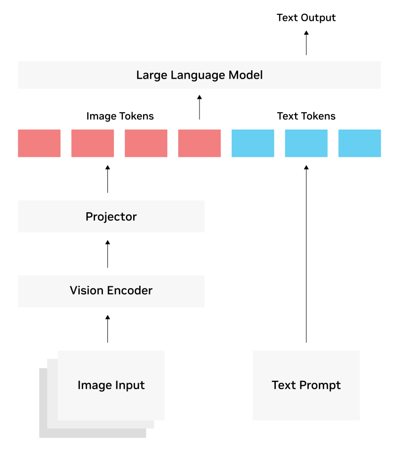

# Image, Video, Vision Models, & VLM (Vision Language Model)

[TOC]

## Res
### Related Topics
↗ [Computer Vision (CV)](../../../Computer%20Vision%20(CV)/Computer%20Vision%20(CV).md)

↗ [AI Embodiment & World Model (WM)](../../../❌%20AI4X,%20AGI%20(Artificial%20General%20Intelligence)%20&%20AIGC/🤔%20AI%20Embodiment%20&%20World%20Model%20(WM)/AI%20Embodiment%20&%20World%20Model%20(WM).md)
↗ [Vision-Language-Action (VLA) Model](../../../❌%20AI4X,%20AGI%20(Artificial%20General%20Intelligence)%20&%20AIGC/🤔%20AI%20Embodiment%20&%20World%20Model%20(WM)/AI%20+%20Robotics%20&%20Robot%20Learning/Vision-Language-Action%20(VLA)%20Model/Vision-Language-Action%20(VLA)%20Model.md)

### Papers
https://jina.ai/vision-encoder-survey.pdf
Vision Encoders in Vision-Language Models: A Survey | Han Xiao, Jina AI by Elastic

Vision encoders have remained comparatively small while language models scaled from billions to hundreds of billions of parameters. This survey analyzes vision encoders across 70+ vision-language models from 2023–2025 and finds that training methodology matters more than encoder size: improvements in loss functions, data curation, and feature objectives yield larger gains than scaling by an order of magnitude. Native resolution handling improves document understanding, and multi-encoder fusion captures complementary features no single encoder provides. We organize encoders into contrastive, self-supervised, and LLM-aligned families, providing a taxonomy and practical selection guidance for encoder design and deployment.

### Research & Papers

### Other Resources
https://github.com/freestylefly/awesome-gpt-image-2
Prompt as Code | GPT-Image2 工业级提示词引擎与模板库

## Intro
> 🔗 https://www.nvidia.com/en-us/glossary/vision-language-models/

A vision language model is an AI system built by combining a [large language model](https://www.nvidia.com/en-us/glossary/large-language-models/) (LLM) with a vision encoder, giving the LLM the ability to “see.”

With this ability, VLMs can process and provide advanced understanding of video, image, and text inputs supplied in the prompt to generate text responses.

Unlike traditional [computer vision](https://www.nvidia.com/en-us/glossary/computer-vision/) (CV) models, VLMs aren’t bound by a fixed set of classes or a specific task, like classification or detection. Retrained on a vast corpus of text and image/video-caption pairs, VLMs can be instructed in natural language and used to handle many classic vision tasks, as well as new generative AI-powered tasks such as summarization and visual Q&A.

<small>Figure 2: A common three-part architecture for vision language models <a>https://www.nvidia.com/en-us/glossary/vision-language-models/</a></small>

## Ref
