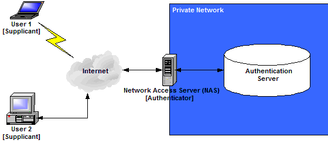
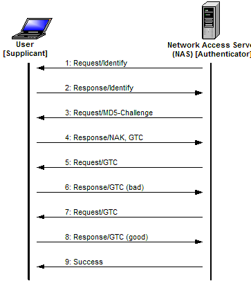

# EAP (Extensible Authentication Protocol)

[TOC]

## Res
↗ [IEEE 802.1x](../IEEE 802/IEEE 802.1x.md) 
↗ [Authentication (身份鉴别)](../../../../../../⛈️%20Risk%20Management/🐺%20Risk%20Countermeasures%20&%20Security%20Control/Identity%20&%20Access%20Management%20(IAM)/Access%20Control%20(访问控制)/Authentication%20(身份鉴别)/Authentication%20(身份鉴别).md)

## Intro

The **Extensible Authentication Protocol** (EAP, defined in  [RFC 3748](https://tools.ietf.org/html/rfc3748) ) is a protocol for **wireless networks** (WLAN) that expands the authentication methods used by the Point-to-Point Protocol ([PPP](https://www.techtarget.com/searchnetworking/definition/PPP)), a protocol often used when connecting a computer to the internet. 

<u>EAP is used on encrypted networks to provide a secure way to send identifying information to provide network authentication.</u> It supports various authentication methods, including as token cards, [smart cards](https://www.techtarget.com/searchsecurity/definition/smart-card), certificates, one-time passwords and [public key encryption](https://www.techtarget.com/searchsecurity/definition/asymmetric-cryptography).

EAP methods **protect a specific portal** so that only users with an [authentication](https://www.techtarget.com/searchsecurity/definition/authentication) key or password can get network access. These methods limit the number of users and help prevent network congestion, making networks faster and more secure. Organizations can use EAP methods to adapt to specific privacy needs and company guidelines.

‼️ 🙈 Extensibility is a key trait of the EAP framework. Some main features of the protocol include the following:

- It **provides the framework** within which the various authentication methods work.
- It **adapts to future security needs**.
- It **can be kept simple** if that's what is wanted.

### Related Glossaries

> 🔗 more IEEE 802 & IEEE 802.1x
>
> [IEEE 802](https://en.wikipedia.org/wiki/IEEE_802) -- wikipedia
> [IEEE 802 LMSC](https://www.ieee802.org) -- official site
> [IEEE 802.1x](https://en.wikipedia.org/wiki/IEEE_802.1X) -- wikipedia

**IEEE 802** defined a set of network services or protocols, map to the lower two layers (data link and physical) of the seven-layer  [Open Systems Interconnection (OSI)](https://en.wikipedia.org/wiki/OSI_model) networking reference model, including Ethernet (802.1), Wi-Fi & WLAN (802.11), etc..
- **IEEE 802** is a family of [Institute of Electrical and Electronics Engineers](https://en.wikipedia.org/wiki/Institute_of_Electrical_and_Electronics_Engineers) (**IEEE**) standards for [local area networks](https://en.wikipedia.org/wiki/Local_area_network) (**LAN**), [personal area network](https://en.wikipedia.org/wiki/Personal_area_network)(**PAN**), and [metropolitan area networks](https://en.wikipedia.org/wiki/Metropolitan_area_network) (**MAN**). The IEEE 802 LAN/MAN Standards Committee (**LMSC**) maintains these standards.

**IEEE 802.1x** defined the authentication machenism used in IEEE 802 network, i.e. EAPoL.
- There are three primary components of 802.1X authentication:
  1. the user's wireless device;
  2. the wireless access point ([AP](https://www.techtarget.com/searchmobilecomputing/definition/access-point)) or authenticator;
  3. the authentication database or the [authentication server](https://www.techtarget.com/searchsecurity/definition/authentication-server).

**EAP** (Extensible Authentication Protocol), defined in [RFC 3748](https://tools.ietf.org/html/rfc3748), is a protocol for authentication purpose. EAP only provides a framework, didn't give a implementation (that's why it's extensible). 
EAP uses the **802.1x standard** as its authentication mechanism over a [local area network](https://www.techtarget.com/searchnetworking/definition/local-area-network-LAN) (**LAN**) or a wireless one (**WLAN**). The organization or user must choose what type of EAP to use based on their requirements. EAP transfers authentication information between the user and the authenticator database or server.

**EAPoL** is an implementation (or an encapsulation of EAP, explained later) of EAP framework over LAN (WLAN, actually) (which falls into the catagory of IEEE 802 network), thus it applies IEEE 802.1x authentication mechanism. 

### EAP Authentication Process
The EAP process works as follows:
1. A user requests connection to a wireless network through an AP -- a station that transmits and receives data, sometimes known as a *[transceiver](https://www.techtarget.com/searchnetworking/definition/transceiver)*.
2. The AP requests identification data from the user and transmits that data to an authentication server.
3. The authentication server asks the AP for proof of the validity of the identification information.
4. The AP obtains verification from the user and sends it back to the authentication server.
5. The user is connected to the network as requested.

### EAP Package Format

> 🔗 More on  [EAP Types – Extensible Authentication Protocol Types information](https://www.vocal.com/secure-communication/eap-types/)

EAP 的基础包格式如下表所示：

| Code   | Identifier | Length  | Data            |
| ------ | ---------- | ------- | --------------- |
| 1 byte | 1 byte     | 2 bytes | variable length |

其中 Code 的分配如下表所示：

| Code | Assignment |
| ---- | ---------- |
| 1    | Request    |
| 2    | Response   |
| 3    | Success    |
| 4    | Failure    |
| 5    | Initiate   |
| 6    | Finish     |

EAP 的 Request 和 Response 包格式如下表所示：

| Code   | Identifier | Length  | Type   | Type-Data       |
| ------ | ---------- | ------- | ------ | --------------- |
| 1 byte | 1 byte     | 2 bytes | 1 byte | variable length |

EAP 的 Success 和 Failure 包格式如下表所示：

| Code   | Identifier | Length  |
| ------ | ---------- | ------- |
| 1 byte | 1 byte     | 2 bytes |

其中部分 Type 分配如下表所示：

| Type | Assignment              |
| ---- | ----------------------- |
| 0    | Reserved                |
| 1    | Identify                |
| 2    | Notification            |
| 3    | NAK (Response Only)     |
| 4    | MD5-Challenge           |
| 5    | OTP, One Time Password  |
| 6    | GTC, Generic Token Card |
| …    | …                       |

### EAP Encapsulation /Implementation

> EAP 一般运行在数据链路层上，作为一种身份验证框架，而不是一种特定的身份验证机制，它为扩展和协商认证协议提供了一个标准，是为了承载多种认证协议而生的。
>
> 所以每个使用 EAP 的协议都定义了一种将用户 EAP 消息封装到该协议的消息中的方法。

#### EAPoL
↗ [EAPoL (EAP over LAN)](../../📌%20Physical%20&%20Link%20Layer%20Standards/IEEE%20802.1x/IEEE%20802.1x%20Implementations/EAPoL%20(EAP%20over%20LAN).md)

## Tunneled EAP methods
There are upwards of 40 EAP methods, including several commonly used ones that are often called *inner methods* or *tunneled EAP methods*. These include the following.

|              | Clear-text | NT hash | MD5 hash | Salted MD5 hash | SHA1 hash | Salted SHA1 hash | Unix Crypt |
| ------------ | ---------- | ------- | -------- | --------------- | --------- | ---------------- | ---------- |
| PAP          | yes        | yes     | yes      | yes             | yes       | yes              | yes        |
| CHAP         | yes        | no      | no       | no              | no        | no               | no         |
| Digest       | yes        | no      | no       | no              | no        | no               | no         |
| MS-CHAP      | yes        | yes     | no       | no              | no        | no               | no         |
| PEAP         | yes        | yes     | no       | no              | no        | no               | no         |
| EAP-MSCHAPv2 | yes        | yes     | no       | no              | no        | no               | no         |
| LEAP         | yes        | yes     | no       | no              | no        | no               | no         |
| EAP-GTC      | yes        | yes     | yes      | yes             | yes       | yes              | yes        |
| EAP-MD5      | yes        | no      | no       | no              | no        | no               | no         |
| EAP-SIM      | yes        | no      | no       | no              | no        | no               | no         |
| EAP-TLS      | no         | no      | no       | no              | no        | no               | no         |

### EAP-TLS (Transport Layer Security)
EAP-[TLS](https://www.techtarget.com/searchsecurity/definition/Transport-Layer-Security-TLS) provides certificate-based, [mutual authentication](https://www.techtarget.com/searchsecurity/definition/mutual-authentication) of the network and the client. Both the client and the server must have certificates to perform this authentication. EAP-TLS randomly generates session-based, user-based Wired Equivalent Privacy ([WEP](https://www.techtarget.com/searchsecurity/definition/Wired-Equivalent-Privacy)) keys. These keys secure communications between the AP and the WLAN client.

One disadvantage of EAP-TLS is the server and client side both must manage the certificates. This can be challenging for organizations with an extensive WLAN.

### EAP-TTLS (Tunneled TLS)
Like EAP-TLS, EAP-TTLS offers an extended security method with certificate-based mutual authentication. However, instead of both the client and the server requiring a certificate, only the server side does. EAP-TTLS enables WLANs to securely reuse legacy user authentication databases, such as Active Directory.

### LEAP (Lightweight EAP)
Cisco created this proprietary EAP authentication type for mutual client and server authentication on its WLANs. The LEAP server sends the client a random challenge, and the client returns a hashed password. Once authenticated, the client asks the server for a password, and a key exchange follows.

### PEAP (Protected EAP)
PEAP was created as a more secure version of LEAP. Like EAP-TTLS, PEAP authenticates clients using [server-side certificates](https://www.techtarget.com/searchitoperations/tip/Secure-configuration-management-tasks-with-a-certificate-authority). It creates a TLS tunnel from the server to the client so the client can be authenticated through that encrypted tunnel. Unlike EAP-TTLS, with PEAP, the client must use a different EAP type.

### EAP-FAST (Flexible Authentication via Secure Tunneling)
Cisco created EAP-FAST to replace LEAP. EAP-FAST uses a tunnel to provide mutual authentication like PEAP and EAP-TTLS. EAP-FAST does not have the server authenticate itself with a digital certificate. Instead, it uses a Protected Access Credential, which creates a one-time provisioning exchange with a shared secret, or PAC key. The PAC key handles the authentication.

### EAP-SIM (Subscriber Identity Module)
This authentication type is based on the Global System for Mobile communication ([GSM](https://www.techtarget.com/searchmobilecomputing/definition/GSM)) SIM card used in cellphones. It uses a per-session WEP key to encrypt the data. This authentication method requires the client to enter a verification code to enable communication with the SIM. EAP-SIM 802.1X requests go through a carrier's roaming gateway to a GSM authentication server. It is used to authenticate devices that roam between commercial 802.11 hotspots and GSM networks.

### EAP-MD5 (Message Digest 5)
EAP-MD5 offers a base level of support and is not recommended when implementing a WLAN. It is easier for threat actors to determine the user's or client's password with this method. It also only provides one-way authentication rather than mutual authentication, and there is no way to develop per-session WEP keys or offer a continuous rotation and distribution of WEP keys. The manual maintenance of the WEP keys can pose challenges.

## Ref

[EAP协议]: https://baike.baidu.com/item/EAP协议/5794582?fr=aladdin
[Extensible Authentication Protocol (EAP)]: https://www.techtarget.com/searchsecurity/definition/Extensible-Authentication-Protocol-EAP
[EAP 详解]: https://www.sulinehk.com/post/eap-details/#eap-md5
[EAP认证]: https://www.cnblogs.com/MomentsLee/p/10162733.html

[802.1X与EAP]: https://blog.csdn.net/hrl7752/article/details/104533634

