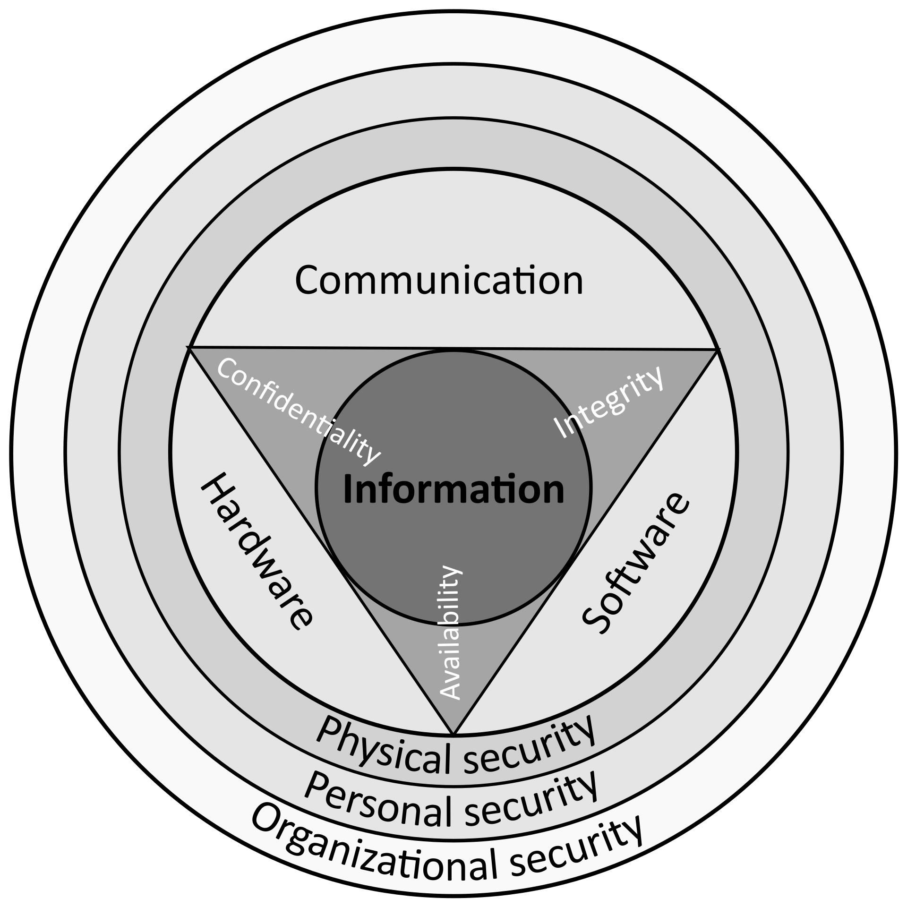

# Network Security

[TOC]

## Res
### Related Topics
↗ [Computer Networking and Communication](../../🔑%20CS%20Core/🏎️%20Computer%20Networking%20and%20Communication/Computer%20Networking%20and%20Communication.md)

↗ [Software Security](../🏰%20Cybersecurity%20Basics%20&%20InfoSec/🍦%20Software%20Security/Software%20Security.md)
↗ [Web Security](../Application%20Security/💉%20Web%20Security/Web%20Security.md)
↗ [Protocol & Policy Security](../🏰%20Cybersecurity%20Basics%20&%20InfoSec/🗂️%20Protocol%20&%20Policy%20Security/Protocol%20&%20Policy%20Security.md)
↗ [Network & Web Security Products](../⛈️%20Risk%20Management/🐺%20Risk%20Countermeasures%20&%20Security%20Control/🛌%20Comprehensive%20Defense%20Systems%20&%20Security%20Products/Network%20&%20Web%20Security%20Products/Network%20&%20Web%20Security%20Products.md)

↗ [Network Traffic Analysis](../⛈️%20Risk%20Management/🐺%20Risk%20Countermeasures%20&%20Security%20Control/Forensics%20&%20Traceability%20Analysis/Network%20Traffic%20Analysis/Network%20Traffic%20Analysis.md)

↗ [Network Penetration (Pen-testing)](../Application%20Security/💉%20Web%20Security/Network%20Penetration%20(Pen-testing)/Network%20Penetration%20(Pen-testing).md)
↗ [Pen-testing Tools](../☠️%20Kill%20Chain%20&%20Security%20Tool%20Box/🍆%20Pen-testing%20Tools/Pen-testing%20Tools.md)

↗ [Packet Analyzing & Sniffing & Spoofing](../../🔑%20CS%20Core/🏎️%20Computer%20Networking%20and%20Communication/Network%20Programming%20&%20RPC/Packet%20Analyzing%20&%20Sniffing%20&%20Spoofing/Packet%20Analyzing%20&%20Sniffing%20&%20Spoofing.md)
↗ [Packet Analyzing & Sniffing & Spoofing Tools](../☠️%20Kill%20Chain%20&%20Security%20Tool%20Box/Reconnaissance%20&%20Exploration%20Tools/📌%20OSINT%20&%20Passive%20Recon%20Tools/Packet%20Analyzing%20&%20Sniffing%20&%20Spoofing%20Tools/Packet%20Analyzing%20&%20Sniffing%20&%20Spoofing%20Tools.md)

↗ [The Nmap Project](../☠️%20Kill%20Chain%20&%20Security%20Tool%20Box/Reconnaissance%20&%20Exploration%20Tools/The%20Nmap%20Project/The%20Nmap%20Project.md)
↗ [Metasploit Framework (MSF)](../☠️%20Kill%20Chain%20&%20Security%20Tool%20Box/Reconnaissance%20&%20Exploration%20Tools/Metasploit%20Framework%20(MSF)/Metasploit%20Framework%20(MSF).md)
↗ [aircrack-ng Suites](../☠️%20Kill%20Chain%20&%20Security%20Tool%20Box/Delivery%20Tools%20&%20Wireless/Wi-Fi%20Cracking/aircrack-ng%20Suites.md)
↗ [hashcat](../☠️%20Kill%20Chain%20&%20Security%20Tool%20Box/Credentials%20&%20Password%20Related%20Tools/Login%20Cracker%20&%20Password%20Cracker/hashcat.md)

### Learn it by doing it!
💉 [Network Penetration (Pen-testing)](../Application%20Security/💉%20Web%20Security/Network%20Penetration%20(Pen-testing)/Network%20Penetration%20(Pen-testing).md)
⚔️ [Red Team & Blue Team](../🏰%20Cybersecurity%20Basics%20&%20InfoSec/CTF%20&%20AWD/AWD/Red%20Team%20&%20Blue%20Team.md)

🎏 [Network Traffic Analysis](../⛈️%20Risk%20Management/🐺%20Risk%20Countermeasures%20&%20Security%20Control/Forensics%20&%20Traceability%20Analysis/Network%20Traffic%20Analysis/Network%20Traffic%20Analysis.md)
↗ [CTF /Web](../🏰%20Cybersecurity%20Basics%20&%20InfoSec/CTF%20&%20AWD/Web/Web.md)

↗ [Web Security](../Application%20Security/💉%20Web%20Security/Web%20Security.md)
↗ [Comprehensive Defense Systems & Security Products](../⛈️%20Risk%20Management/🐺%20Risk%20Countermeasures%20&%20Security%20Control/🛌%20Comprehensive%20Defense%20Systems%20&%20Security%20Products/Comprehensive%20Defense%20Systems%20&%20Security%20Products.md)

🔥 https://github.com/qazbnm456/awesome-web-security
Needless to say, most websites suffer from various types of bugs which may eventually lead to vulnerabilities. Why would this happen so often? There can be many factors involved including misconfiguration, shortage of engineers' security skills, etc. To combat this, here is a curated list of Web Security materials and resources for learning cutting-edge penetration techniques, and I highly encourage you to read the article "[So you want to be a web security researcher?](https://portswigger.net/blog/so-you-want-to-be-a-web-security-researcher)" first.

🏫 https://textbook.cs161.org/network/
CS 161 Textbook
- [Introduction to Networking](https://textbook.cs161.org/network/intro.html)
- [ARP](https://textbook.cs161.org/network/arp.html)
- [DHCP](https://textbook.cs161.org/network/dhcp.html)
- [WPA](https://textbook.cs161.org/network/wpa.html)
- [BGP](https://textbook.cs161.org/network/bgp.html)
- [TCP and UDP](https://textbook.cs161.org/network/transport.html)
- [TLS](https://textbook.cs161.org/network/tls.html)
- [DNS](https://textbook.cs161.org/network/dns.html)
- [DNSSEC](https://textbook.cs161.org/network/dnssec.html)
- [Denial-of-Service (DoS)](https://textbook.cs161.org/network/dos.html)
- [Firewalls](https://textbook.cs161.org/network/firewalls.html)
- [Intrusion Detection](https://textbook.cs161.org/network/intrusion-detection.html)
- [Abusing Intrusion Detection](https://textbook.cs161.org/network/abusing-intrusion-detection.html)
- [Malware](https://textbook.cs161.org/network/malware.html)
- [Anonymity and Tor](https://textbook.cs161.org/network/tor.html)

### Other Resources
[Npcap.com](https://npcap.com/)
- [Seclists.org](https://seclists.org/)
- [Sectools.org](https://sectools.org/)
	- SecTools.Org: Top 125 Network Security Tools
	- For more than a decade, the [Nmap Project](http://nmap.org/) has been cataloguing the network security community's favorite tools. In 2011 this site became much more dynamic, offering ratings, reviews, searching, sorting, and a [new tool suggestion form](http://sectools.org/contrib/). This site allows open source and commercial tools on any platform, except those tools that we maintain (such as the [Nmap Security Scanner](http://nmap.org/), [Ncat network connector](http://nmap.org/ncat/), and [Nping packet manipulator](http://nmap.org/nping/)).
	- We're very impressed by the collective smarts of the security community and we highly recommend reading the whole list and investigating any tools you are unfamiliar with. Click any tool name for more details on that particular application, including the chance to read (and write) reviews. Many site elements are explained by tool tips if you hover your mouse over them. Enjoy!
- [Insecure.org](https://insecure.org/)

## Intro
> 关注对网络设备，通讯链路、服务器、终端的安全，即OSI 7层模型

Network security covers security issues in all OSI 7 layers, including the most popular web security (which is a sub-branch of application layer security). However, it seems that whenever people are talking about network security, most of the time they mean network security but application layer security, i.e. transport layer security, network layer security, etc, whereas they use the term "web security" to refer to application layer security. 🤷

I think this is because there are too many security guys out there who don't have much theoretical knowledge or overall perspectives to the framework of Cybersecurity, yet still managed to make these misused terms the de-facto standard terms of security in OSI 7 layers. 

### Web Security
> ↗ [Web Security](../Application%20Security/💉%20Web%20Security/Web%20Security.md)

In general, web security refers to **the protective measures and protocols that organizations adopt to protect the organization from cyber criminals and threats that use the web channel**. Web security is critical to business continuity and to protecting data, users, and companies from risk.

### ☠️ Network Security
> 🔗 https://en.wikipedia.org/wiki/Network_security

**Network security** consists of the 
1. Security Risk
2. Security Services
3. Security Mechanisms (Policies & Processes & Practices)
	1. prevent
	2. detect
	3. monitor 
	4. defend
unauthorized access, misuse, modification, or denial of a computer network and network-accessible resources.
#### Security Risks

↗ [Network Threats & Attacks](Network%20Threats%20&%20Attacks/Network%20Threats%20&%20Attacks.md)
#### Security Services

Recall the Security Tria:

#### Security Mechanisms
↗ [Cryptography](../🚬%20Cryptology%20&%20Secure%20Communication/🤐%20Cryptography/Cryptography.md)

↗ [Network Security Protocol Stacks](Network%20Security%20Mechanisms/🏇%20Network%20Security%20Protocol%20Stacks/Network%20Security%20Protocol%20Stacks.md)

↗ [Cybersecurity Basics & InfoSec](../🏰%20Cybersecurity%20Basics%20&%20InfoSec/Cybersecurity%20Basics%20&%20InfoSec.md)
- Classification
- Security Control
- Access Control
	- Identification 
	- Authentication 
	- Authorization
↗ [Networking Access Control](Network%20Security%20Mechanisms/🏇%20Network%20Security%20Protocol%20Stacks/Networking%20Access%20Control/Networking%20Access%20Control.md)
↗ [InfoSec /Access Control](../⛈️%20Risk%20Management/🐺%20Risk%20Countermeasures%20&%20Security%20Control/Identity%20&%20Access%20Management%20(IAM)/Access%20Control%20(访问控制)/Access%20Control%20(访问控制).md)

↗ [IDS (Intrusion Detection Systems)](../⛈️%20Risk%20Management/🐺%20Risk%20Countermeasures%20&%20Security%20Control/🛌%20Comprehensive%20Defense%20Systems%20&%20Security%20Products/Network%20&%20Web%20Security%20Products/IDS%20(Intrusion%20Detection%20Systems)/IDS%20(Intrusion%20Detection%20Systems).md)

## Network Security Zones (网络安全域)
> 🔗 https://www.ibm.com/docs/en/zos/2.2.0?topic=concepts-network-security-zones

==A network security zone is an administrative name for a collection of systems that require the same access control policy.== IP addresses are used to map systems into security zones. This requires that the IP addresses used in your multilevel secure network be predictably associated with a single system or group of systems with the same access control policy. A network security zone can contain a single IP address or any combination of IP addresses and subnetworks. All of the IP addresses in a security zone must have the same security label, though all IP addresses with the same security label do not have to be in the same security zone.

[目前网络安全域划分有哪些基本方法]: https://www.wangan.com/wenda/7206
>1. 按照业务系统来划分;
>2. 按照防护等级来划分;
>3. 按照系统行为来划分;

## Ref
[企业网络安全最佳实践指南(五)]: https://www.freebuf.com/articles/es/253992.html

> 1、网络安全防御理论
> 
> 常见的网络安全防御理论有PDR/P2DR模型、边界防御、纵深防御、河防、塔防、下一代纵深防御等。
> （1）PDR/P2DR模型
> （2）边界防御体系
> （3）纵深防御体系
> （4）河防体系
> （5）塔防体系
> （6）下一代纵深防御体系
> * 上述防御体系不一一展开详述。

