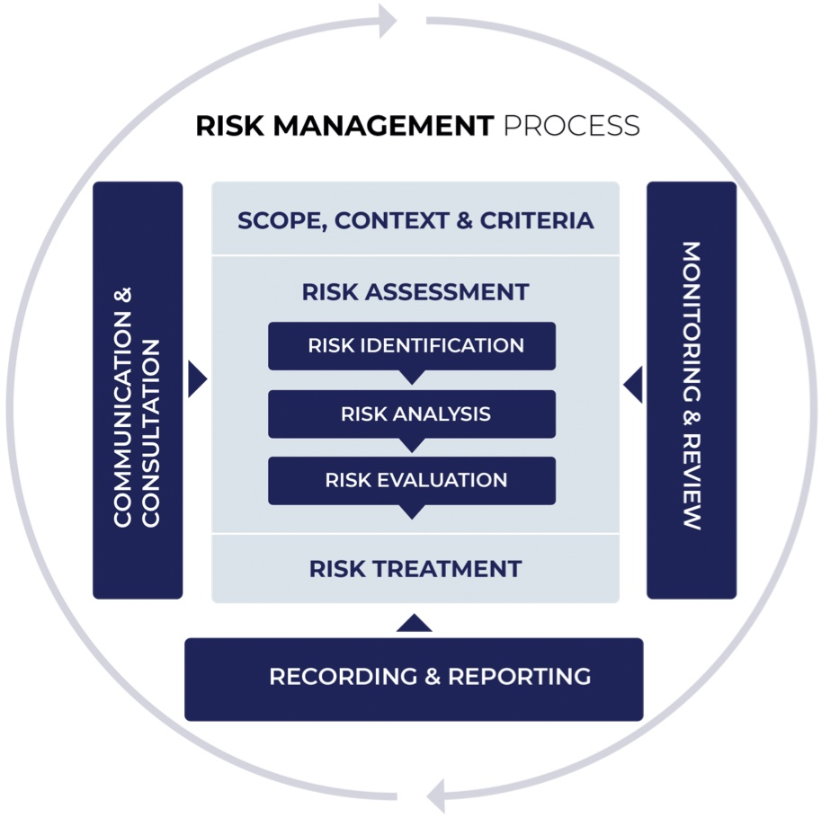

# Risk Management Life Circle

[TOC]

## Res

## Intro

<small>GB/Z 24364</small>

<small>ISO/IEC 31000</small>

## Four Stages in Risk Management (四个阶段)
### 1️⃣ Risk Management Initialization (背景建立)
背景建立是网络空间安全风险管理的第一步骤，确定风险管理的对象和范围，确立实施风险管理的准备，进行相关信息的调查和分析。

### 2️⃣ Risk Assessment （风险评估）⭐

↗ [Risk Assessment](Risk%20Assessment.md)

### 3️⃣ Risk Controls (Security Control)（风险控制/处理）

#### Administrative Control
Administrative controls (also called procedural controls) consist of approved written policies, procedures, standards, and guidelines. Administrative controls form the framework for running the business and managing people.

e.g. the [Payment Card Industry Data Security Standard](https://en.wikipedia.org/wiki/Payment_Card_Industry_Data_Security_Standard)(PCI DSS) required by [Visa](https://en.wikipedia.org/wiki/Visa_Inc.) and [MasterCard](https://en.wikipedia.org/wiki/MasterCard) is such an example. Other examples of administrative controls include the corporate security policy, [password policy](https://en.wikipedia.org/wiki/Password_policy), hiring policies, and disciplinary policies.
#### Logical Control
Logical controls (also called technical controls) use software and data to monitor and control access to information and [computing](https://en.wikipedia.org/wiki/Computing) systems. Passwords, network, and host-based firewalls, network [intrusion detection](https://en.wikipedia.org/wiki/Intrusion_detection) systems, [access control lists](https://en.wikipedia.org/wiki/Access_control_list), and data encryption are examples of logical controls.

> ⚠ An important logical control that is frequently overlooked is **the principle of least privilege,** which requires that an individual, program or system process not be granted any more access privileges than are necessary to perform the task.

- A blatant example of the failure to adhere to the principle of least privilege is logging into Windows as a user Administrator to read email and surf the web
#### Physical Control
Physical controls monitor and control the environment of the workplace and computing facilities. They also monitor and control access to and from such facilities. 

> ⚠ An important physical control that is frequently overlooked is the separation of duties, which ensures that an individual can not complete a critical task by himself.

- For example, an employee who submits a request for reimbursement should not also be able to authorize payment or print the check.
#### 🤔 常用的四类风险处置方法
- **减低风险**
	- 通过对面临风险的资产采取保护措施来降低风险。
	- 首先应当考虑的风险处置措施，通常在安全投入小于负面影响价值的情况下采用。
	- 保护措施可以从构成风险的五个方面来降低风险。
		- 威胁源
			- 采用法律的手段制裁计算机犯罪，发挥法律的威慑作用，从而有效遏制威胁源的动机
		- 威胁行为
			- 采取身份鉴别措施，从而抵制身份假冒这种威胁行为的能力；
		- 脆弱性
			- 及时给系统打补丁，关闭无用的网络服务端口，从而减少系统的脆弱，降低被利用的可能性
		- 资产
			- 采用各种防护措施，建立资产的安全域，从而保证资产不受侵犯，其价值得到保持
		- 影响
			- 采取容灾备份、应急响应和业务连续计划等措施，从而减少安全事件造成的影响程度
- **转移风险**
	- 通过将面临风险的资产或其价值转移到更安全的地方来避免或降低风险。
	- 通常只有当风险不能被降低或避免、且被第三方（被转嫁方）接受时才被采用。一般用于那些低概率、但一旦风险发生时会对组织产生重大影响
	- 具体做法
		- 在本机构不具备足够的安全保障的技术能力时，将信息系统的技术体系（即信息载体部分）外包给满足安全保障要求的第三方机构，从而避免技术风险。的风险。
		- 通过给昂贵的设备上保险，将设备损失的风险转移给保险公司，从而降低资产价值的损失。
- **规避风险**
	- 通过不使用面临风险的资产来避免风险。比如：
		- 在没有足够安全保障的信息系统中，不处理特别敏感的信息，从而防止敏感信息的泄漏。
		- 对于只处理内部业务的信息系统，不使用互联网，从而避免外部的有害入侵和不良攻击。
	- 通常在风险的损失无法接受，又难以通过控制措施减低风险的情况下
- **接受风险**
	- 接受风险是选择对风险不采取进一步的处理措施，接受风险可能带来的结果。
	- 用于那些在采取了降低风险和避免风险措施后，出于实际和经济方面的原因，只要组织进行运营，就必然存在并必须接受的风险。
	- 接受风险不意味着不闻不问，需要对风险态势变化进行持续的监控，一旦发展为无法接受的风险就要进一步采取措施。

### 4️⃣ Risk Monitor（批准监督）
- 批准：是指机构的决策层依据风险评估和风险处理的结果是否满足信息系统的安全要求，做出是否认可风险管理活动的决定
- 监督：是指检查机构检查信息系统以及信息安全相关的环境有无变化，监督变化因素是否有可能引入新风险

## Risk Management Two Throughout (两个贯穿)
### 1️⃣ Monitor & Censurship（监控审查）
监控与审查可以及时发现已经出现或即将出现的变化、偏差和延误等问题，并采取适当的措施进行控制和纠正，从而减少因此造成的损失，保证信息安全风险管理主循环的有效性。

### 2️⃣ Communication & Consultation（沟通咨询）
通过畅通的交流和充分的沟通，保持行动的协调和一致；通过有效的培训和方便的咨询，保证行动者具有足够的知识和技能，就是沟通咨询的意义所在

## Ref
