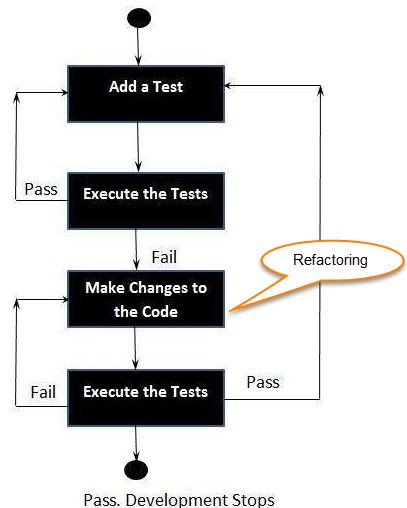

# TDD (Test Driven Development)

[TOC]

## Res
### Related Topics

## Intro
> 🔗 https://en.wikipedia.org/wiki/Test-driven_development

**Test Driven Development (TDD)** is software development approach in which test cases are developed to specify and validate what the code will do. In simple terms, test cases for each functionality are created and tested first and if the test fails then the new code is written in order to pass the test and making code simple and bug-free.

Test-Driven Development starts with designing and developing tests for every small functionality of an application. TDD framework instructs developers to write new code only if an automated test has failed. This avoids duplication of code. The TDD full form is Test-driven development.

## Ref
[What is Test Driven Development (TDD)? Tutorial with Example]: https://www.guru99.com/test-driven-development.html
