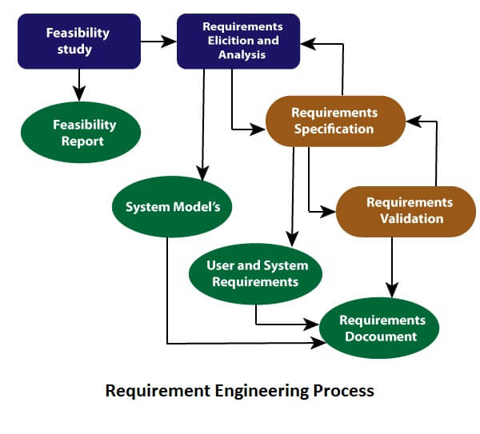

# Software Engineering

[TOC]

## Res
### Related Topics
↗ [The Essence of Computing - Programs & The Semantics of Programs](../🗺%20CS%20Overview/The%20Essence%20of%20Computing%20-%20Programs%20&%20The%20Semantics%20of%20Programs.md)
↗ [Computer Languages & Programming Methodology](../🔑%20CS%20Core/👩‍💻%20Computer%20Languages%20&%20Programming%20Methodology/Computer%20Languages%20&%20Programming%20Methodology.md)

↗ [Development Related Conferences & Events](../🗺%20CS%20Overview/🤲🏼%20Opportunities%20&%20Career%20Development/📆%20IT%20Conference%20&%20Events%20(Industry%20&%20Academia)/Development%20Related%20Conferences%20&%20Events.md)

↗ [C & CPP](../🔑%20CS%20Core/👩‍💻%20Computer%20Languages%20&%20Programming%20Methodology/Compiled%20Languages/👔%20C-Based%20Languages/🥏%20C%20&%20CPP/C%20&%20CPP.md)
↗ [Python](../🔑%20CS%20Core/👩‍💻%20Computer%20Languages%20&%20Programming%20Methodology/Interpreted%20Languages/🐍%20Python/Python.md)
↗ [Golang](../🔑%20CS%20Core/👩‍💻%20Computer%20Languages%20&%20Programming%20Methodology/Compiled%20Languages/Golang/Golang.md)
↗ [Java](../🔑%20CS%20Core/👩‍💻%20Computer%20Languages%20&%20Programming%20Methodology/Compiled%20+%20Interpreted%20Languages/⚰️%20JVM-Based%20Languages/☕️%20Java/Java.md)

🔥 ↗ [Appendix](Appendix.md)
↗ [Galleries & Awesome SE](🏇%20Galleries%20&%20Awesome%20SE/Galleries%20&%20Awesome%20SE.md)
↗ [Cracked Software](../🔑%20CS%20Core/Generic%20Software%20Tools%20&%20Projects/Cracked%20Software.md)

↗ [Software Security](../CyberSecurity/🏰%20Cybersecurity%20Basics%20&%20InfoSec/🍦%20Software%20Security/Software%20Security.md)

↗ [Github](CASE%20(Computer-Aided%20Software%20Engineering)%20Tools/Upper%20CASE%20Tools/🐙%20VCM%20(Version%20Control%20Management)/Git/👩🏼‍🍳%20Git%20Services%20Providers/Github.md)

### Learning Resources

## Intro
> 软件是需求（规约）在计算机数字世界里的投影。
> 
> 【并发 bug 和应对 (死锁/数据竞争/原子性违反；防御性编程和动态分析) [南京大学2022操作系统-P8]】 https://www.bilibili.com/video/BV1sR4y1V7T4/?share_source=copy_web&vd_source=7740584ebdab35221363fc24d1582d9d

### Information, Language, and Computing
↗ [Universe, Self-Awareness, and Intelligence](../../Universe,%20Self-Awareness,%20and%20Intelligence.md)

↗ [Information Theory](../🧮%20Mathematics/🥸%20Information%20Theory/Information%20Theory.md)
↗ [Information, Data, Number and Math in Digital Systems](../🗺%20CS%20Overview/💋%20Intro%20to%20Computer%20Science/😤%20Information,%20Data,%20Number%20and%20Math%20in%20Digital%20Systems/Information,%20Data,%20Number%20and%20Math%20in%20Digital%20Systems.md)
↗ [Language & Literature](../../Other%20Networks%20of%20Knowledge/Arts%20&%20Cultures/📃%20Language%20&%20Literature/Language%20&%20Literature.md)
↗ [Logic (and Critical Thinking)](../../Other%20Networks%20of%20Knowledge/♂%20Philosophy/Philosophy%20by%20Disciplines%20&%20Topics/🎼%20Logic%20(and%20Critical%20Thinking)/Logic%20(and%20Critical%20Thinking).md)

↗ [Mathematics](../🧮%20Mathematics/Mathematics.md)
↗ [Mathematical Logic (Foundations of Mathematics)](../🧮%20Mathematics/🤼‍♀️%20Mathematical%20Logic%20(Foundations%20of%20Mathematics)/Mathematical%20Logic%20(Foundations%20of%20Mathematics).md)

↗ [Theory of Computation](../🧮%20Mathematics/🤼‍♀️%20Mathematical%20Logic%20(Foundations%20of%20Mathematics)/😶‍🌫️%20Theory%20of%20Computation/Theory%20of%20Computation.md)
↗ [Automata Theory and (Formal) Language Theory](../🧮%20Mathematics/🤼‍♀️%20Mathematical%20Logic%20(Foundations%20of%20Mathematics)/😶‍🌫️%20Theory%20of%20Computation/🍏%20Automata%20Theory%20and%20(Formal)%20Language%20Theory/Automata%20Theory%20and%20(Formal)%20Language%20Theory.md)

### Program, Software, and Information Systems
↗ [The Essence of Computing - Programs & The Semantics of Programs](../🗺%20CS%20Overview/The%20Essence%20of%20Computing%20-%20Programs%20&%20The%20Semantics%20of%20Programs.md)
↗ [Program Execution (Runtime)](../🔑%20CS%20Core/🛣️%20Programming%20Language%20Processing%20&%20Program%20Execution/🤡%20Program%20Execution%20(Runtime)/Program%20Execution%20(Runtime).md)

↗ [OS Processes & Automata Management (CPU + Main Memory Resource)](../🔑%20CS%20Core/👷🏾‍♂️%20Computer%20(Host)%20System/Operating%20System%20&%20OS%20Kernel%20(Theory%20Part)/OS%20Processes%20&%20Automata%20Management%20(CPU%20+%20Main%20Memory%20Resource)/OS%20Processes%20&%20Automata%20Management%20(CPU%20+%20Main%20Memory%20Resource).md)

<small>How a program is created and executed.</small>

### Software Engineering in a Nutshell
> 🔗 [software engineering tutorial](https://www.javatpoint.com/software-engineering)

the **software** is a collection of integrated programs.

software subsists of carefully-organized instructions and code written by developers on any of various particular computer languages.

computer programs and related documentation such as requirements, design models and user manuals.

**engineering** is the application of **scientific** and **practical** knowledge to **invent, design, build, maintain**, and **improve frameworks, processes, etc**.

**Software Engineering** is an engineering branch related to the evolution of software product using well-defined scientific principles, techniques, and procedures. The result of software engineering is an effective and reliable software product.

### Categories of Software & Information Systems
↗ [Tertiary Economical Sector](../../Other%20Networks%20of%20Knowledge/Social%20Science/💸%20Economics%20&%20Finance/Macro%20Economics/📌%20Tertiary%20Economical%20Sector/Tertiary%20Economical%20Sector.md)
↗ [Information Technology Industry](../../Other%20Networks%20of%20Knowledge/Social%20Science/💸%20Economics%20&%20Finance/Macro%20Economics/📌%20Tertiary%20Economical%20Sector/Information%20Technology%20Industry/Information%20Technology%20Industry.md)

From computer's perspective: 

<small>Computer System & Computer Science Overview</small>

From society's perspective: (below is not the best illustration. the best illustration should be the overview of economical sectors of human society.)

<small>The relationship of language, information/data, computation, and automation.</small>

## Software Processes & Life Circle
A software process is the set of activities and associated outcome that produce a software product. Software engineers mostly carry out these activities. These are four key process activities, which are common to all software processes. These activities are:

1. **Software specifications:** The functionality of the software and constraints on its operation must be defined.
2. **Software development:** The software to meet the requirement must be produced.
3. **Software validation:** The software must be validated to ensure that it does what the customer wants.
4. **Software evolution:** The software must evolve to meet changing client needs.

> 🆚 Program vs. Software
>
> Software is more than programs. Any program is a subset of software, and it becomes software only if documentation & operating procedures manuals are prepared.

### Software Process Model
A software life cycle model (also termed process model) is a pictorial and diagrammatic representation of the software life cycle. A life cycle model represents all the methods required to make a software product transit through its life cycle stages. It also captures the structure in which these methods are to be undertaken.

See more on ↗️ [SDLC (Software Development Life Circle) & SDLC Models](Software%20Development%20Pattern/🔄%20SDLC%20(Software%20Development%20Life%20Circle)%20&%20SDLC%20Models/SDLC%20(Software%20Development%20Life%20Circle)%20&%20SDLC%20Models.md)

### Software Management
#### Project Management
#### Risk Management
#### Software Metrics

### Software Design & Development
↗️ [Software Development Pattern](Software%20Development%20Pattern/Software%20Development%20Pattern.md)
↗ [Web Application System Architecture Design Pattern](☝️%20Application%20Software%20Engineering/🕸️%20Web%20Development%20&%20The%20Internet/Web%20Application%20Systems%20&%20Architecture%20Design/Web%20Application%20System%20Architecture%20Design%20Pattern/Web%20Application%20System%20Architecture%20Design%20Pattern.md)

↗ [Application Software Engineering](☝️%20Application%20Software%20Engineering/Application%20Software%20Engineering.md)
↗ [System Software Engineering](👇%20System%20Software%20Engineering/System%20Software%20Engineering.md)
#### Requirement Engineering
**Requirements engineering (RE)** refers to the process of defining, documenting, and maintaining requirements in the engineering design process. Requirement engineering provides the appropriate mechanism to understand what the customer desires, analyzing the need, and assessing feasibility, negotiating a reasonable solution, specifying the solution clearly, validating the specifications and managing the requirements as they are transformed into a working system. Thus, requirement engineering is the disciplined application of proven principles, methods, tools, and notation to describe a proposed system's intended behavior and its associated constraints.

- SRS
- Data Flow Diagram
- Entity-Relationship Diagram
#### Software Supply Chain

### Software Quality and Security
↗ [ICT System Reliability (Correctness) & Verification](../CyberSecurity/⛈️%20Risk%20Management/🦟%20Vulnerabilities/ICT%20System%20Reliability%20(Correctness)%20&%20Verification.md)
↗ [Software Quality Assurance (SQA)](🎭%20Software%20Quality%20Assurance%20(SQA)/Software%20Quality%20Assurance%20(SQA).md)

↗️ [Software Testing](../Operations Management/🧪 Software Testing/Software Testing.md)
↗ [Network Penetration (Pen-testing)](../CyberSecurity/Application%20Security/💉%20Web%20Security/Network%20Penetration%20(Pen-testing)/Network%20Penetration%20(Pen-testing).md)
↗ [Vulnerability Discovery & Scanning（漏洞检测 & 扫描）](../CyberSecurity/🏰%20Cybersecurity%20Basics%20&%20InfoSec/🍦%20Software%20Security/🐒%20Software%20Vulnerability%20&%20Weakness/Vulnerability%20Mangement%20Phases/Vulnerability%20Discovery%20&%20Scanning（漏洞检测%20&%20扫描）.md)

### Software Maintenance & Operations
↗ [Web Software Maintenance & Operations Management](☝️%20Application%20Software%20Engineering/🕸️%20Web%20Development%20&%20The%20Internet/Web%20Software%20Maintenance%20&%20Operations%20Management/Web%20Software%20Maintenance%20&%20Operations%20Management.md)

## Ref
[Software Engineering Tutorial]: https://www.javatpoint.com/software-engineering

[pattern.dev](https://www.patterns.dev/posts/#rendering-patterns)

[B端产品设计规范](https://cloud.tencent.com/developer/article/1807553)

[常用的软件需求说明书模板](https://zhuanlan.zhihu.com/p/85037211)

[如何建立一套自己的产品规范?](https://zhuanlan.zhihu.com/p/60867626)
