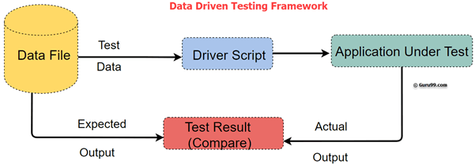

# DDT (Data Driven Test)

[TOC]

## Res
### Related Topics

## Intro
DDT stands for Data Driven Test. **Data Driven Framework** is an automation testing framework in which input values are read from data files and stored into variables in test scripts. It enables testers to build both positive and negative test cases into a single test. Input data in data driven framework can be stored in single or multiple data sources like .xls, .xml, .csv and databases.

## Ref
[What is Data Driven Testing? Learn to create Framework]: https://www.guru99.com/data-driven-testing.html
