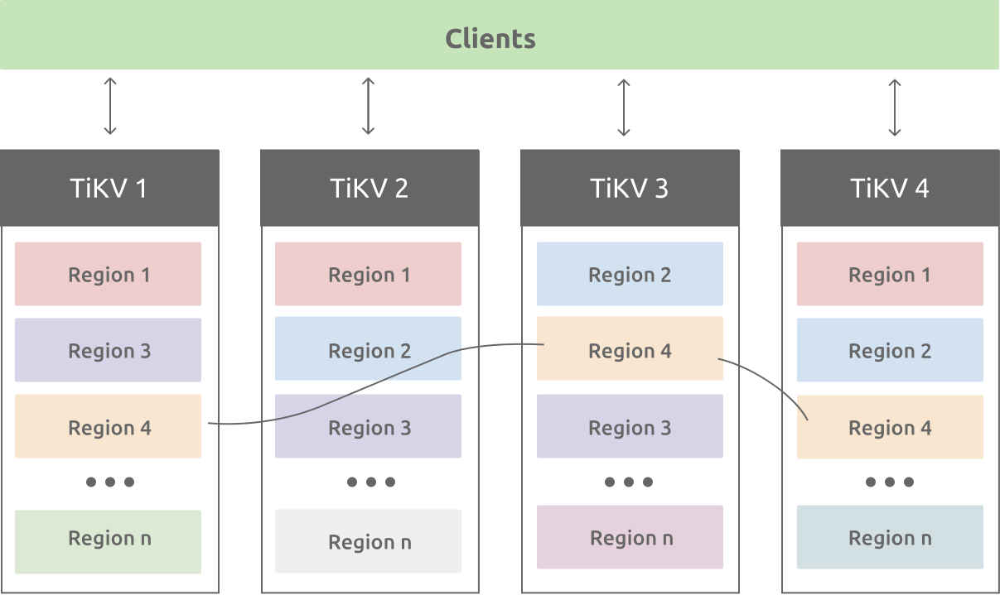

# TiKV

[TOC]

## Res
🏠 https://tikv.org

## Intro

TiKV provides both raw and ACID-compliant transactional key-value API, which is widely used in online serving services, such as the metadata storage system for object storage service, the storage system for recommendation systems, the [online feature store](https://www.featurestore.org/), etc.

TiKV is also widely used as the storage layer for database management systems, for example:
- [TiDB](https://github.com/pingcap/tidb): An open-source MySQL compatible NewSQL database that supports Hybrid Transactional and Analytical Processing (HTAP) workloads.

- [Zetta](https://github.com/zhihu/zetta): An open-source NoSQL database that supports Transaction and Cloud Spanner like API.

- [Tidis](https://github.com/yongman/tidis): a Distributed NoSQL database, providing a Redis protocol API (string, list, hash, set, sorted set), written in Go.

- [Titan](https://github.com/distributedio/titan): A distributed implementation of Redis compatible layer based on TiKV.

- [JuiceFS](https://github.com/juicedata/juicefs): An open-source POSIX file system that is based on TiKV and S3.

  

## Ref

  