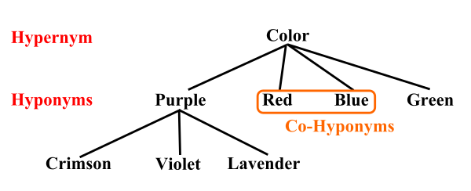

# Computer Languages & Programming Methodology

[TOC]


## Res
### Related Topics
↗ [Automata Theory and (Formal) Language Theory](../../🧮%20Mathematics/🤼‍♀️%20Mathematical%20Logic%20(Foundations%20of%20Mathematics)/😶‍🌫️%20Theory%20of%20Computation/🍏%20Automata%20Theory%20and%20(Formal)%20Language%20Theory/Automata%20Theory%20and%20(Formal)%20Language%20Theory.md)
↗ [SCA (Static Code Analysis) & SAST](../../CyberSecurity/🏰%20Cybersecurity%20Basics%20&%20InfoSec/🍦%20Software%20Security/🪆%20Software%20(Program)%20Analysis%20&%20Binary%20Engineering/📌%20Software%20(Program)%20Analysis%20Basics/👚%20SCA%20(Static%20Code%20Analysis)%20&%20SAST/SCA%20(Static%20Code%20Analysis)%20&%20SAST.md)
↗ [Programming Language Processing & Program Execution](../🛣️%20Programming%20Language%20Processing%20&%20Program%20Execution/Programming%20Language%20Processing%20&%20Program%20Execution.md)
- ↗ [Program Language Processing & Compilation Theory (Compile-time)](../🛣️%20Programming%20Language%20Processing%20&%20Program%20Execution/🚮%20Program%20Language%20Processing%20&%20Compilation%20Theory%20(Compile-time)/Program%20Language%20Processing%20&%20Compilation%20Theory%20(Compile-time).md)
↗ [The Essence of Computing - Programs & The Semantics of Programs](../../🗺%20CS%20Overview/The%20Essence%20of%20Computing%20-%20Programs%20&%20The%20Semantics%20of%20Programs.md)

↗ [Computing Methodologies](../../🧠%20Computing%20Methodologies/Computing%20Methodologies.md)
- ↗ [Concurrent Computing](../../🧠%20Computing%20Methodologies/⚡️%20High%20Performance%20Computing/Concurrent%20Computing/Concurrent%20Computing.md)
- ↗ [Distributed Computing & Systems](../../🧠%20Computing%20Methodologies/Distributed%20Computing%20&%20Systems/Distributed%20Computing%20&%20Systems.md)
- ↗ [Parallel Computing & Programming](../../🧠%20Computing%20Methodologies/⚡️%20High%20Performance%20Computing/Parallel%20Computing%20&%20Programming/Parallel%20Computing%20&%20Programming.md)
- ↗ [Quantum Computing (and Communication)](../../🧠%20Computing%20Methodologies/Quantum%20Computing%20(and%20Communication)/Quantum%20Computing%20(and%20Communication).md)
- etc.

↗ [Algorithm & Data Structure](../🧙‍♂️%20Algorithm%20&%20Data%20Structure/Algorithm%20&%20Data%20Structure.md)

↗ [Database Languages](Other%20Languages%20for%20Specific%20Areas/Database%20Languages/Database%20Languages.md)
↗ [HDL (Hardware Definition Languages)](../../Computer%20Engineering,%20Embedded%20&%20IoT/Embedded%20Programming%20&%20Software%20Development/Languages/HDL%20(Hardware%20Definition%20Languages)/HDL%20(Hardware%20Definition%20Languages).md)
↗ [Web Templating Engines & Languages](../../Software%20Engineering/☝️%20Application%20Software%20Engineering/🕸️%20Web%20Development%20&%20The%20Internet/🖥️%20Web%20FrontEnd%20Dev/⬆️%20Frontend%20Optimization/Web%20Templating/Web%20Templating%20Engines%20&%20Languages/Web%20Templating%20Engines%20&%20Languages.md)

↗ [Information, Data, Number and Math in Digital Systems](../../🗺%20CS%20Overview/💋%20Intro%20to%20Computer%20Science/😤%20Information,%20Data,%20Number%20and%20Math%20in%20Digital%20Systems/Information,%20Data,%20Number%20and%20Math%20in%20Digital%20Systems.md)
↗ [System Software Engineering](../../Software%20Engineering/👇%20System%20Software%20Engineering/System%20Software%20Engineering.md)
- ↗ [Computer (IO Devices) Drivers & Programming](../👷🏾‍♂️%20Computer%20(Host)%20System/Computer%20Interfaces%20&%20Hardware%20Drivers/🛞%20Computer%20(IO%20Devices)%20Drivers%20&%20Programming/Computer%20(IO%20Devices)%20Drivers%20&%20Programming.md)
- ↗ [Compute Unified Device Architecture & CUDA Programming](../👷🏾‍♂️%20Computer%20(Host)%20System/Computer%20Interfaces%20&%20Hardware%20Drivers/🛞%20Computer%20(IO%20Devices)%20Drivers%20&%20Programming/Graphics%20Devices%20Drivers/Compute%20Unified%20Device%20Architecture%20&%20CUDA%20Programming/Compute%20Unified%20Device%20Architecture%20&%20CUDA%20Programming.md)
↗ [Network Programming & RPC](../🏎️%20Computer%20Networking%20and%20Communication/Network%20Programming%20&%20RPC/Network%20Programming%20&%20RPC.md)
- ↗ [DPDK (Data Plane Development Kits)](../🏎️%20Computer%20Networking%20and%20Communication/🚀%20High%20Performance%20Network%20(HPN)%20&%20IDC%20Technologies/DPDK%20(Data%20Plane%20Development%20Kits)/DPDK%20(Data%20Plane%20Development%20Kits).md)
↗ [Foundation Models & Development & SDKs](../../🧠%20Computing%20Methodologies/👽%20Artificial%20Intelligence/🏗️%20AI%20(Data)%20Infrastructure%20&%20Techniques%20Stack/🛫%20Foundation%20Models%20&%20Development%20&%20SDKs/Foundation%20Models%20&%20Development%20&%20SDKs.md)
- ↗ [ML Programming & Frameworks](../../🧠%20Computing%20Methodologies/👽%20Artificial%20Intelligence/🏗️%20AI%20(Data)%20Infrastructure%20&%20Techniques%20Stack/🛫%20Foundation%20Models%20&%20Development%20&%20SDKs/ML%20Programming%20&%20Frameworks/ML%20Programming%20&%20Frameworks.md)
- ↗ [ML Toolkits & Runtimes](../../🧠%20Computing%20Methodologies/👽%20Artificial%20Intelligence/🏗️%20AI%20(Data)%20Infrastructure%20&%20Techniques%20Stack/🛫%20Foundation%20Models%20&%20Development%20&%20SDKs/📌%20ML%20Toolkits%20&%20Runtimes/ML%20Toolkits%20&%20Runtimes.md)
↗ [Computer Graphics Programming](../../Software%20Engineering/☝️%20Application%20Software%20Engineering/🎨%20Computer%20Graphics%20Programming/Computer%20Graphics%20Programming.md)
↗ [Concurrent Programming](../👷🏾‍♂️%20Computer%20(Host)%20System/Operating%20System%20&%20OS%20Kernel%20(Theory%20Part)/OS%20Processes%20&%20Automata%20Management%20(CPU%20+%20Main%20Memory%20Resource)/Concurrent%20Programming.md)
↗ [Embedded Programming & Software Development](../../Computer%20Engineering,%20Embedded%20&%20IoT/Embedded%20Programming%20&%20Software%20Development/Embedded%20Programming%20&%20Software%20Development.md)

↗ [Software Engineering](../../Software%20Engineering/Software%20Engineering.md)
↗ [Galleries & Awesome SE](../../Software%20Engineering/🏇%20Galleries%20&%20Awesome%20SE/Galleries%20&%20Awesome%20SE.md)

↗ [Software Security](../../CyberSecurity/🏰%20Cybersecurity%20Basics%20&%20InfoSec/🍦%20Software%20Security/Software%20Security.md)
↗ [Software (Program) Analysis & Binary Engineering](../../CyberSecurity/🏰%20Cybersecurity%20Basics%20&%20InfoSec/🍦%20Software%20Security/🪆%20Software%20(Program)%20Analysis%20&%20Binary%20Engineering/Software%20(Program)%20Analysis%20&%20Binary%20Engineering.md)

↗ [Natural Language Processing (NLP) & Computational Linguistics](../../🧠%20Computing%20Methodologies/👽%20Artificial%20Intelligence/⚜️%20Natural%20Language%20Processing%20(NLP)%20&%20Computational%20Linguistics/Natural%20Language%20Processing%20(NLP)%20&%20Computational%20Linguistics.md)


### Other Resources
[List Of Some Of The Software Development Trends That Have Dominated The Year 2020](https://www.cisin.com/coffee-break/trends/list-of-some-of-the-software-development-trends-that-have-dominated-the-year-2020.html)

🪜 https://www.tiobe.com/tiobe-index/
TIOBE - programming language rank

🎬【实验生存指南：代码风格和定制化 gdb 调试 [南京大学2023操作系统-P18] (蒋炎岩)】 https://www.bilibili.com/video/BV1aT411H77C/?share_source=copy_web&vd_source=7740584ebdab35221363fc24d1582d9d

https://github.com/jobbole
伯乐在线 - 各种编程资源大全

🏠 https://www.microsoft.com/en-us/makecode
📂 https://makecode.microbit.org/docs
Microsoft MakeCode is a free online learn-to-code platform where anyone can build games, code devices, and mod Minecraft!

https://awesome-programming-books.github.io/
📚经典技术书籍 PDF 文件，涵盖：编程语言、计算机系统、网络协议、数据库、代码艺术、设计模式、算法与数据结构、系统架构、微服务、测试、程序员职业修炼等相关书籍。


## Intro
### 0️⃣ Formal Languages 🆚 Natural Languages
> ↗ [Language & Literature /The Importance of Language: Natural Language 🆚 Formal Language](../../../Other%20Networks%20of%20Knowledge/Arts%20&%20Cultures/📃%20Language%20&%20Literature/Language%20&%20Literature.md#The%20Importance%20of%20Language:%20Natural%20Language%20🆚%20Formal%20Language)
> ↗ [Linguistics](../../../Other%20Networks%20of%20Knowledge/Arts%20&%20Cultures/📃%20Language%20&%20Literature/Linguistics/Linguistics.md)
> ↗ [Mathematical Logic (Foundations of Mathematics)](../../🧮%20Mathematics/🤼‍♀️%20Mathematical%20Logic%20(Foundations%20of%20Mathematics)/Mathematical%20Logic%20(Foundations%20of%20Mathematics).md)

> 🔗 https://runestone.academy/ns/books/published/thinkcspy/GeneralIntro/FormalandNaturalLanguages.html

**Natural languages** are the languages that people speak, such as English, Spanish, and French. They were not designed by people (although people try to impose some order on them); they evolved naturally.

**Formal languages** are languages that are designed by people for specific applications. For example, the notation that mathematicians use is a formal language that is particularly good at denoting relationships among numbers and symbols. Chemists use a formal language to represent the chemical structure of molecules. And most importantly:

> Programming languages are formal languages that have been designed to express computations.

Formal languages tend to have strict rules about syntax. For example, `3+3=6` is a syntactically correct mathematical statement, but `3=+6$` is not. H2O is a syntactically correct chemical name, but 2Zz is not.

Syntax rules come in two flavors, pertaining to **tokens** and **structure**. Tokens are the basic elements of the language, such as words, numbers, and chemical elements. One of the problems with `3=+6$` is that `$` is not a legal token in mathematics (at least as far as we know). Similarly, 2Zz is not legal because there is no element with the abbreviation `Zz`.

The second type of syntax rule pertains to the **structure** of a statement— that is, the way the tokens are arranged. The statement `3=+6$` is structurally illegal because you can’t place a plus sign immediately after an equal sign. Similarly, molecular formulas have to have subscripts after the element name, not before.

When you read a sentence in English or a statement in a formal language, you have to figure out what the structure of the sentence is (although in a natural language you do this subconsciously). This process is called **parsing**.

For example, when you hear the sentence, “The other shoe fell”, you understand that the other shoe is the subject and fell is the verb. Once you have parsed a sentence, you can figure out what it means, or the **semantics** of the sentence. Assuming that you know what a shoe is and what it means to fall, you will understand the general implication of this sentence.

Although formal and natural languages have many features in common — tokens, structure, syntax, and semantics — there are many **differences**:
- ambiguity
	- Natural languages are full of ambiguity, which people deal with by using contextual clues and other information. Formal languages are designed to be nearly or completely unambiguous, which means that any statement has exactly one meaning, regardless of context.
- redundancy
	- In order to make up for ambiguity and reduce misunderstandings, natural languages employ lots of redundancy. As a result, they are often verbose. Formal languages are less redundant and more concise.
- literalness
	- Formal languages mean exactly what they say. On the other hand, natural languages are full of idiom and metaphor. If someone says, “The other shoe fell”, there is probably no shoe and nothing falling.
#### \* Linguistics and Semiotics
> ↗ [Language & Literature](../../../Other%20Networks%20of%20Knowledge/Arts%20&%20Cultures/📃%20Language%20&%20Literature/Language%20&%20Literature.md) 
> ↗ [Linguistics](../../../Other%20Networks%20of%20Knowledge/Arts%20&%20Cultures/📃%20Language%20&%20Literature/Linguistics/Linguistics.md)

> 🔗 https://en.wikipedia.org/wiki/Linguistics

Linguistics is the scientific study of language. The areas of linguistic analysis are syntax (rules governing the structure of sentences), semantics (meaning), morphology (structure of words), phonetics (speech sounds and equivalent gestures in sign languages), phonology (the abstract sound system of a particular language, and analogous systems of sign languages), and pragmatics (how the context of use contributes to meaning). Subdisciplines such as biolinguistics (the study of the biological variables and evolution of language) and psycholinguistics (the study of psychological factors in human language) bridge many of these divisions. 

> 🔗 https://en.wikipedia.org/wiki/Semiotics

Semiotics (/ˌsɛmiˈɒtɪks/ SEM-ee-OT-iks) is the systematic study of sign processes and the communication of meaning. In semiotics, a sign is defined as anything that communicates intentional and unintentional meaning or feelings to the sign's interpreter.

Semiosis is any activity, conduct, or process that involves signs. Signs often are communicated by verbal language, but also by gestures, or by other forms of language, e.g. artistic ones (music, painting, sculpture, etc.). Contemporary semiotics is a branch of science that generally studies meaning-making (whether communicated or not) and various types of knowledge.[1]

Unlike linguistics, semiotics also studies non-linguistic sign systems. Semiotics includes the study of indication, designation, likeness, analogy, allegory, metonymy, metaphor, symbolism, signification, and communication.
#### Mathematical Logic & Formal Logic Language
↗ [Mathematical Logic Basics (Formal Logic)](../../🧮%20Mathematics/🤼‍♀️%20Mathematical%20Logic%20(Foundations%20of%20Mathematics)/📍%20Mathematical%20Logic%20Basics%20(Formal%20Logic)/Mathematical%20Logic%20Basics%20(Formal%20Logic).md)


###  1️⃣ Computer Languages
> 🔗 https://en.wikipedia.org/wiki/Computer_language

A **computer language** is a [formal language](https://en.wikipedia.org/wiki/Formal_language "Formal language") used to communicate with a [computer](https://en.wikipedia.org/wiki/Computer "Computer"). Types of computer languages include:
- [Construction language](https://en.wikipedia.org/wiki/Software_construction#Construction_languages "Software construction") – all forms of communication by which a human can [specify an executable problem solution to a computer](https://en.wikipedia.org/wiki/Computer_programming "Computer programming")
    - [Command language](https://en.wikipedia.org/wiki/Command_language "Command language") – a language used to control the tasks of the computer itself, such as starting programs
    - [Configuration language](https://en.wikipedia.org/wiki/Configuration_file#Configuration_languages "Configuration file") – a language used to write [configuration files](https://en.wikipedia.org/wiki/Configuration_files "Configuration files")
    - [Programming language](https://en.wikipedia.org/wiki/Programming_language "Programming language") – a formal language designed to communicate instructions to a machine, particularly a computer
        - [Scripting language](https://en.wikipedia.org/wiki/Scripting_language "Scripting language") – a type of programming language which typically is interpreted at runtime rather than being compiled
    - [Query language](https://en.wikipedia.org/wiki/Query_language "Query language") – a language used to make [queries](https://en.wikipedia.org/wiki/Information_retrieval "Information retrieval") in [databases](https://en.wikipedia.org/wiki/Databases "Databases") and [information systems](https://en.wikipedia.org/wiki/Information_systems "Information systems")
    - [Transformation language](https://en.wikipedia.org/wiki/Transformation_language "Transformation language") – designed to transform some input text in a certain formal language into a modified output text that meets some specific goal
- [Data exchange language](https://en.wikipedia.org/wiki/Data_exchange#Data_exchange_languages "Data exchange") – a language that is domain-independent and can be used for data from any kind of discipline; examples: [JSON](https://en.wikipedia.org/wiki/JSON "JSON"), [XML](https://en.wikipedia.org/wiki/XML "XML")
- [Markup language](https://en.wikipedia.org/wiki/Markup_language "Markup language") – a grammar for annotating a document in a way that is syntactically distinguishable from the text, such as [HTML](https://en.wikipedia.org/wiki/HTML "HTML")
- [Modeling language](https://en.wikipedia.org/wiki/Modeling_language "Modeling language") – an artificial language used to express information or knowledge, often for use in computer system design
    - [Architecture description language](https://en.wikipedia.org/wiki/Architecture_description_language "Architecture description language") – used as a language (or a conceptual model) to describe and represent system architectures
    - [Hardware description language](https://en.wikipedia.org/wiki/Hardware_description_language "Hardware description language") – used to model [integrated circuits](https://en.wikipedia.org/wiki/Integrated_circuits "Integrated circuits")
- [Page description language](https://en.wikipedia.org/wiki/Page_description_language "Page description language") – describes the appearance of a printed page in a higher level than an actual output [bitmap](https://en.wikipedia.org/wiki/Bitmap "Bitmap")
- [Simulation language](https://en.wikipedia.org/wiki/Simulation_language "Simulation language") – a language used to describe [simulations](https://en.wikipedia.org/wiki/Simulations "Simulations")
- [Specification language](https://en.wikipedia.org/wiki/Specification_language "Specification language") – a language used to describe what a system should do
- [Style sheet language](https://en.wikipedia.org/wiki/Style_sheet_language "Style sheet language") – a computer language that expresses the presentation of structured documents, such as [CSS](https://en.wikipedia.org/wiki/CSS "CSS")
- [Expression language](https://en.wikipedia.org/wiki/Expression_language) -- a [computer language](https://en.wikipedia.org/wiki/Computer_language "Computer language") for creating a [machine readable](https://en.wikipedia.org/wiki/Machine_readable "Machine readable") representation of specific [domain knowledge](https://en.wikipedia.org/wiki/Domain_knowledge "Domain knowledge"). Examples include:
	- [Advanced Boolean Expression Language](https://en.wikipedia.org/wiki/Advanced_Boolean_Expression_Language "Advanced Boolean Expression Language"), an obsolete hardware description language for hardware descriptions
	- [Data Analysis Expressions](https://en.wikipedia.org/wiki/Data_Analysis_Expressions "Data Analysis Expressions") (DAX), an expression language developed by Microsoft and used in Power Pivot, among other places
	- [Jakarta Expression Language](https://en.wikipedia.org/wiki/Jakarta_Expression_Language "Jakarta Expression Language"), a domain-specific language used in Jakarta EE web applications. Formerly known as "Unified Expression Language", "Expression Language" or just "the Expression Language").
	- [Rights Expression Languages](https://en.wikipedia.org/wiki/Rights_Expression_Language "Rights Expression Language"), machine processable language used for representing immaterial rights such as copyright and license information


### 2️⃣ Programming Language
> 🔗 https://en.wikipedia.org/wiki/Programming_language

A programming language is a system of notation for writing computer programs. Programming languages are described in terms of their **syntax (form)** and **semantics (meaning)**, usually defined by a formal language. Languages usually provide features such as a **type system**, **variables**, and **mechanisms for error handling**. An implementation of a programming language is required in order to execute programs, namely an interpreter or a compiler. An interpreter directly executes the source code, while a compiler produces an executable program.

Computer architecture has strongly influenced the design of programming languages, with the most common type (imperative languages—which implement operations in a specified order) developed to perform well on the popular von Neumann architecture. While early programming languages were closely tied to the hardware, over time they have developed more abstraction to hide implementation details for greater simplicity.


<small><a>https://zh.wikipedia.org/wiki/%E7%BC%96%E7%A8%8B%E8%AF%AD%E8%A8%80#%E5%A4%96%E9%83%A8%E9%93%BE%E6%8E%A5</a></small>
#### History & Generations of (High-Level) Programming Languages
> ↗ https://en.wikipedia.org/wiki/Hyponymy_and_hypernymy 




> ↗ https://zh.wikipedia.org/zh-cn/程式語言歷史
+ Hyponymy & hyperymy

> 📖 Compilers Principles Techniques and Tools 2nd Edition


> ↗ https://en.wikipedia.org/wiki/History_of_programming_languages

1. Early History
	1. During 1842–1849, **Ada Lovelace** translated the memoir of Italian mathematician Luigi Menabrea about Charles Babbage's newest proposed machine: the **Analytical Engine**; she supplemented the memoir with notes that specified in detail a method for calculating Bernoulli numbers with the engine, recognized by most of historians as the **world's first published computer program**.
	2. **Jacquard Looms** and **Charles Babbage**'s **Difference Engine** both were designed to utilize punched cards, which would describe the sequence of operations that their programmable machines should perform.
	3. The **first computer codes** were specialized for their applications: e.g., Alonzo Church was able to express the lambda calculus in a formulaic way and the Turing machine was an abstraction of the operation of a tape-marking machine.
	4. In the 1940s, the **first recognizably modern electrically powered computers** were created. The limited speed and memory capacity forced programmers to write hand-tuned assembly language programs. It was eventually realized that programming in assembly language required a great deal of intellectual effort. An early proposal for a high-level programming language was Plankalkül, developed by Konrad Zuse for his Z1 computer between 1942 and 1945 but not implemented at the time. 
	5. The **first functioning programming languages** designed to communicate instructions to a computer were written in the early 1950s. John Mauchly's Short Code, proposed in 1949, was one of the first high-level languages ever developed for an electronic computer. Unlike machine code, Short Code statements represented mathematical expressions in understandable form. However, the program had to be interpreted into machine code every time it ran, making the process much slower than running the equivalent machine code.
2. 1950 ～ 1967
	1. Some notable languages that were developed in this period include:
	2. 1951 – [Regional Assembly Language](https://en.wikipedia.org/wiki/Assembly_language "Assembly language")
	3. 1952 – [Autocode](https://en.wikipedia.org/wiki/Autocode "Autocode")
	4. 1954 – [IPL](https://en.wikipedia.org/wiki/Information_Processing_Language "Information Processing Language") (forerunner to LISP)
	5. 1955 – [FLOW-MATIC](https://en.wikipedia.org/wiki/FLOW-MATIC "FLOW-MATIC") (led to COBOL)
	6. 1957 – [FORTRAN](https://en.wikipedia.org/wiki/Fortran "Fortran") (first compiler)
	7. 1957 – [COMTRAN](https://en.wikipedia.org/wiki/COMTRAN "COMTRAN") (precursor to COBOL)
	8. 1958 – [LISP](https://en.wikipedia.org/wiki/Lisp_\(programming_language\) "Lisp (programming language)")
	9. 1958 – [ALGOL 58](https://en.wikipedia.org/wiki/ALGOL_58 "ALGOL 58")
	10. 1959 – [FACT](https://en.wikipedia.org/wiki/FACT_computer_language "FACT computer language") (forerunner to COBOL)
	11. 1959 – [COBOL](https://en.wikipedia.org/wiki/COBOL "COBOL")
	12. 1959 – [RPG](https://en.wikipedia.org/wiki/IBM_RPG "IBM RPG")
	13. 1960 – [ALGOL 60](https://en.wikipedia.org/wiki/ALGOL_60 "ALGOL 60")
	14. 1962 – [APL](https://en.wikipedia.org/wiki/APL_\(programming_language\) "APL (programming language)")
	15. 1962 – [Simula](https://en.wikipedia.org/wiki/Simula "Simula")
	16. 1962 – [SNOBOL](https://en.wikipedia.org/wiki/SNOBOL "SNOBOL")
	17. 1963 – [CPL](https://en.wikipedia.org/wiki/Combined_Programming_Language "Combined Programming Language") (forerunner to C)
	18. 1964 – [Speakeasy](https://en.wikipedia.org/wiki/Speakeasy_\(computational_environment\) "Speakeasy (computational environment)")
	19. 1964 – [BASIC](https://en.wikipedia.org/wiki/BASIC "BASIC")
	20. 1964 – [PL/I](https://en.wikipedia.org/wiki/PL/I "PL/I")
	21. 1966 – [JOSS](https://en.wikipedia.org/wiki/JOSS "JOSS")
	22. 1966 – [MUMPS](https://en.wikipedia.org/wiki/MUMPS "MUMPS")
	23. 1967 – [BCPL](https://en.wikipedia.org/wiki/BCPL "BCPL") (forerunner to C)
	24. 1967 – [Logo](https://en.wikipedia.org/wiki/Logo_\(programming_language\) "Logo (programming language)") (an educational language that later influenced [Smalltalk](https://en.wikipedia.org/wiki/Smalltalk "Smalltalk") and [Scratch](https://en.wikipedia.org/wiki/Scratch_\(programming_language\) "Scratch (programming language)")).
3. 1967 ～ 1978
	1. Some notable languages that were developed in this period include:
	2. 1967 – [BCPL](https://en.wikipedia.org/wiki/BCPL "BCPL") (forerunner to B)
	3. 1967 – [Logo](https://en.wikipedia.org/wiki/Logo_\(programming_language\) "Logo (programming language)")
	4. 1969 – [B](https://en.wikipedia.org/wiki/B_\(programming_language\) "B (programming language)") (forerunner to C)
	5. 1970 – [Pascal](https://en.wikipedia.org/wiki/Pascal_\(programming_language\) "Pascal (programming language)")
	6. 1970 – [Forth](https://en.wikipedia.org/wiki/Forth_\(programming_language\) "Forth (programming language)")
	7. 1972 – [C](https://en.wikipedia.org/wiki/C_\(programming_language\) "C (programming language)")
	8. 1972 – [Smalltalk](https://en.wikipedia.org/wiki/Smalltalk "Smalltalk")
	9. 1972 – [Prolog](https://en.wikipedia.org/wiki/Prolog "Prolog")
	10. 1973 – [ML](https://en.wikipedia.org/wiki/ML_\(programming_language\) "ML (programming language)")
	11. 1975 – [Scheme](https://en.wikipedia.org/wiki/Scheme_\(programming_language\) "Scheme (programming language)")
	12. 1978 – [SQL](https://en.wikipedia.org/wiki/SQL "SQL") (a query language, later extended)
4. 1980 ～
	1. Some notable languages that were developed in this period include:
	2. 1980 – [C++](https://en.wikipedia.org/wiki/C%2B%2B "C++") (as [C with classes](https://en.wikipedia.org/wiki/C_with_classes "C with classes"), renamed in 1983)
	3. 1983 – [Ada](https://en.wikipedia.org/wiki/Ada_\(programming_language\) "Ada (programming language)")
	4. 1984 – [Common Lisp](https://en.wikipedia.org/wiki/Common_Lisp "Common Lisp")
	5. 1984 – [MATLAB](https://en.wikipedia.org/wiki/MATLAB "MATLAB")
	6. 1984 – dBase III, dBase III Plus ([Clipper](https://en.wikipedia.org/wiki/Clipper_\(programming_language\) "Clipper (programming language)") and [FoxPro](https://en.wikipedia.org/wiki/FoxPro "FoxPro") as [FoxBASE](https://en.wikipedia.org/wiki/FoxBASE "FoxBASE"))
	7. 1985 – [Eiffel](https://en.wikipedia.org/wiki/Eiffel_\(programming_language\) "Eiffel (programming language)")
	8. 1986 – [Objective-C](https://en.wikipedia.org/wiki/Objective-C "Objective-C")
	9. 1986 – [LabVIEW](https://en.wikipedia.org/wiki/LabVIEW "LabVIEW") ([visual programming language](https://en.wikipedia.org/wiki/Visual_programming_language "Visual programming language"))
	10. 1986 – [Erlang](https://en.wikipedia.org/wiki/Erlang_\(programming_language\) "Erlang (programming language)")
	11. 1987 – [Perl](https://en.wikipedia.org/wiki/Perl "Perl")
	12. 1988 – [PIC (markup language)](https://en.wikipedia.org/wiki/PIC_\(markup_language\) "PIC (markup language)")
	13. 1988 – [Tcl](https://en.wikipedia.org/wiki/Tcl "Tcl")
	14. 1988 – [Wolfram Language](https://en.wikipedia.org/wiki/Wolfram_Language "Wolfram Language") (as part of [Mathematica](https://en.wikipedia.org/wiki/Mathematica "Mathematica"), only got a separate name in June 2013)
	15. 1989 – [FL](https://en.wikipedia.org/wiki/FL_\(programming_language\) "FL (programming language)") (Backus)
5. 1990 ～
	1. Some notable languages that were developed in this period include:
	2. 1990 – [Haskell](https://en.wikipedia.org/wiki/Haskell "Haskell")
	3. 1991 – [Python](https://en.wikipedia.org/wiki/Python_\(programming_language\) "Python (programming language)")
	4. 1991 – [Visual Basic](https://en.wikipedia.org/wiki/Visual_Basic_\(classic\) "Visual Basic (classic)")
	5. 1993 – [Lua](https://en.wikipedia.org/wiki/Lua_\(programming_language\) "Lua (programming language)")
	6. 1993 – [R](https://en.wikipedia.org/wiki/R_\(programming_language\) "R (programming language)")
	7. 1994 – [CLOS](https://en.wikipedia.org/wiki/CLOS "CLOS") (part of ANSI [Common Lisp](https://en.wikipedia.org/wiki/Common_Lisp "Common Lisp"))
	8. 1995 – [Ruby](https://en.wikipedia.org/wiki/Ruby_\(programming_language\) "Ruby (programming language)")
	9. 1995 – [Ada 95](https://en.wikipedia.org/wiki/Ada_95 "Ada 95")
	10. 1995 – [Java](https://en.wikipedia.org/wiki/Java_\(programming_language\) "Java (programming language)")
	11. 1995 – [Delphi](https://en.wikipedia.org/wiki/Delphi_\(software\) "Delphi (software)") ([Object Pascal](https://en.wikipedia.org/wiki/Object_Pascal "Object Pascal"))
	12. 1995 – [Visual FoxPro](https://en.wikipedia.org/wiki/Visual_FoxPro "Visual FoxPro")
	13. 1995 – [JavaScript](https://en.wikipedia.org/wiki/JavaScript "JavaScript")
	14. 1995 – [PHP](https://en.wikipedia.org/wiki/PHP "PHP")
	15. 1996 – [OCaml](https://en.wikipedia.org/wiki/OCaml "OCaml")
	16. 1997 – [Rebol](https://en.wikipedia.org/wiki/Rebol "Rebol")
6. 2000 ～ 
	1. Some notable languages developed during this period include:
	2. 2000 – [ActionScript](https://en.wikipedia.org/wiki/ActionScript "ActionScript")
	3. 2001 – [C#](https://en.wikipedia.org/wiki/C_Sharp_\(programming_language\) "C Sharp (programming language)")
	4. 2001 – [D](https://en.wikipedia.org/wiki/D_\(programming_language\) "D (programming language)")
	5. 2002 – [Scratch](https://en.wikipedia.org/wiki/Scratch_\(programming_language\) "Scratch (programming language)")
	6. 2003 – [Groovy](https://en.wikipedia.org/wiki/Groovy_\(programming_language\) "Groovy (programming language)")
	7. 2003 – [Scala](https://en.wikipedia.org/wiki/Scala_\(programming_language\) "Scala (programming language)")
	8. 2005 – [F#](https://en.wikipedia.org/wiki/F_Sharp_\(programming_language\) "F Sharp (programming language)")
	9. 2005 – [Haxe](https://en.wikipedia.org/wiki/Haxe "Haxe")
	10. 2006 – [PowerShell](https://en.wikipedia.org/wiki/Windows_PowerShell "Windows PowerShell")
	11. 2007 – [Clojure](https://en.wikipedia.org/wiki/Clojure "Clojure")
	12. 2008 – [Nim](https://en.wikipedia.org/wiki/Nim_\(programming_language\) "Nim (programming language)")
	13. 2009 – [Go](https://en.wikipedia.org/wiki/Go_\(programming_language\) "Go (programming language)")
7. 2010 ~
	1. Some notable languages developed during this period include:
	2. 2011 – [Dart](https://en.wikipedia.org/wiki/Dart_\(programming_language\) "Dart (programming language)")
	3. 2011 – [Kotlin](https://en.wikipedia.org/wiki/Kotlin_\(programming_language\) "Kotlin (programming language)")
	4. 2012 – [Julia](https://en.wikipedia.org/wiki/Julia_\(programming_language\) "Julia (programming language)")
	5. 2012 – [TypeScript](https://en.wikipedia.org/wiki/TypeScript "TypeScript")
	6. 2012 – [Elixir](https://en.wikipedia.org/wiki/Elixir_\(programming_language\) "Elixir (programming language)")
	7. 2014 – [Swift](https://en.wikipedia.org/wiki/Swift_\(programming_language\) "Swift (programming language)")
	8. 2014 – [Hack](https://en.wikipedia.org/wiki/Hack_\(programming_language\) "Hack (programming language)")
	9. 2015 – [Rust](https://en.wikipedia.org/wiki/Rust_\(programming_language\) "Rust (programming language)")
	10. 2015 – [Raku](https://en.wikipedia.org/wiki/Raku_\(programming_language\) "Raku (programming language)")
	11. 2016 – [Ring](https://en.wikipedia.org/wiki/Ring_\(programming_language\) "Ring (programming language)")
	12. 2016 – [Zig](https://en.wikipedia.org/wiki/Zig_\(programming_language\) "Zig (programming language)")
8. 2020 ~
	1. Some notable new programming languages include:
	2. 2021 – [Power Fx](https://en.wikipedia.org/wiki/Microsoft_Power_Fx "Microsoft Power Fx")
	3. 2022 – [Carbon](https://en.wikipedia.org/wiki/Carbon_\(programming_language\) "Carbon (programming language)")
	4. 2023 – [Mojo](https://en.wikipedia.org/wiki/Mojo_\(programming_language\) "Mojo (programming language)")

---
> 🔗 https://cs.stackexchange.com/a/102417/174354

There are supposedly generations of languages. According to [Wikipedia](https://en.wikipedia.org/wiki/Fifth_generation_computer):
- First generation: Machine language.
- Second generation: Low-level programming languages such as assembly language.
- Third generation: Structured high-level programming languages such as C, COBOL and FORTRAN.
- Fourth generation: Domain-specific high-level programming languages such as SQL (for database access) and TeX (for text formatting)
- The fifth generation was supposed to be developed by Japan's fifth generation project in the 1980s but didn't really go anywhere. Some people consider constraint-based languages to be fifth generation ([Wikipedia](https://en.wikipedia.org/wiki/Fifth-generation_programming_language)).

There is also a supposed hierarchy of language power, expressed by Paul Graham as the "[Blub Paradox](https://en.wikipedia.org/wiki/Paul_Graham_\(programmer\)#The_Blub_paradox)" in his essay [Beating the Averages](http://www.paulgraham.com/avg.html). In this controversial approach, languages such as Basic and Cobol are low in the hierarchy, Python and Perl would be in the middle, and Lisp would be at the top.


#### Programming Language Theory: The Designing of A Programming Language
> ↗ [Programming Language Theory (PLT)](🐢%20Programming%20Language%20Theory%20(PLT)/Programming%20Language%20Theory%20(PLT).md)

> 🔗 https://en.wikipedia.org/wiki/Programming_language_theory

Programming language theory (PLT) is a branch of computer science that deals with the design, implementation, analysis, characterization, and classification of formal languages known as programming languages. Programming language theory is closely related to other fields including mathematics, software engineering, and linguistics.


## Programming Languages Taxonomy
### Lists of Programming Languages
> 🔗 https://en.wikipedia.org/wiki/Lists_of_programming_languages
> 
> This is an index to notable programming languages, in current or historical use. Dialects of BASIC (which have their own page), esoteric programming languages, and markup languages are not included. A programming language does not need to be imperative or Turing-complete, but must be executable and so does not include markup languages such as HTML or XML, but does include domain-specific languages such as SQL and its dialects.

 - [List of programming languages](https://en.wikipedia.org/wiki/List_of_programming_languages "List of programming languages")
 - [List of programming languages by type](https://en.wikipedia.org/wiki/List_of_programming_languages_by_type "List of programming languages by type")
 - [Lists of programming languages](https://en.wikipedia.org/wiki/Lists_of_programming_languages "Lists of programming languages")
 - [List of programming languages for artificial intelligence](https://en.wikipedia.org/wiki/List_of_programming_languages_for_artificial_intelligence "List of programming languages for artificial intelligence")
 - [List of audio programming languages](https://en.wikipedia.org/wiki/List_of_audio_programming_languages "List of audio programming languages")
 - [List of BASIC dialects](https://en.wikipedia.org/wiki/List_of_BASIC_dialects "List of BASIC dialects")
 - [List of C-family programming languages](https://en.wikipedia.org/wiki/List_of_C-family_programming_languages "List of C-family programming languages")
 - [List of CLI languages](https://en.wikipedia.org/wiki/List_of_CLI_languages "List of CLI languages")
 - [List of concurrent and parallel programming languages](https://en.wikipedia.org/wiki/List_of_concurrent_and_parallel_programming_languages "List of concurrent and parallel programming languages")
 - [List of educational programming languages](https://en.wikipedia.org/wiki/List_of_educational_programming_languages "List of educational programming languages")
 - [Generational list of programming languages](https://en.wikipedia.org/wiki/Generational_list_of_programming_languages "Generational list of programming languages")
 - [List of JVM languages](https://en.wikipedia.org/wiki/List_of_JVM_languages "List of JVM languages")
 - [List of Lisp-family programming languages](https://en.wikipedia.org/wiki/List_of_Lisp-family_programming_languages "List of Lisp-family programming languages")
 - [List of open-source programming languages](https://en.wikipedia.org/wiki/List_of_open-source_programming_languages "List of open-source programming languages")
 - [Non-English-based programming languages](https://en.wikipedia.org/wiki/Non-English-based_programming_languages "Non-English-based programming languages")
 - [List of object-oriented programming languages](https://en.wikipedia.org/wiki/List_of_object-oriented_programming_languages "List of object-oriented programming languages")
 - [List of reflective programming languages and platforms](https://en.wikipedia.org/wiki/List_of_reflective_programming_languages_and_platforms "List of reflective programming languages and platforms")
 - [Timeline of programming languages](https://en.wikipedia.org/wiki/Timeline_of_programming_languages "Timeline of programming languages")
 - [Unisys MCP programming languages](https://en.wikipedia.org/wiki/Unisys_MCP_programming_languages "Unisys MCP programming languages")


### 👉 By Programming Eco/Platform/Frameworks
#### [.NET](https://zh.wikipedia.org/wiki/.NET%E6%A1%86%E6%9E%B6 ".NET框架")
- [C#](https://zh.wikipedia.org/wiki/C%E2%99%AF "C♯") 
    - [Visual C#](https://zh.wikipedia.org/wiki/Microsoft_Visual_C%E2%99%AF "Microsoft Visual C♯")
- [C++/CLI](https://zh.wikipedia.org/wiki/C%2B%2B/CLI "C++/CLI") 
	- [Visual C++](https://zh.wikipedia.org/wiki/Microsoft_Visual_C%2B%2B "Microsoft Visual C++")
- [F#](https://zh.wikipedia.org/wiki/F%E2%99%AF "F♯")
- [PowerShell](https://zh.wikipedia.org/wiki/PowerShell "PowerShell")
- [IronPython](https://zh.wikipedia.org/wiki/IronPython "IronPython")
- [IronScheme](https://zh.wikipedia.org/w/index.php?title=IronScheme&action=edit&redlink=1)
- [VB.NET](https://zh.wikipedia.org/wiki/Visual_Basic_.NET "Visual Basic .NET")
- [Small Basic](https://zh.wikipedia.org/wiki/Microsoft_Small_Basic "Microsoft Small Basic")
#### JVM
- [Java](https://zh.wikipedia.org/wiki/Java "Java") 
    - [AspectJ](https://zh.wikipedia.org/w/index.php?title=AspectJ&action=edit&redlink=1)
    - [JSP](https://zh.wikipedia.org/wiki/JSP "JSP")
- [Scala](https://zh.wikipedia.org/wiki/Scala "Scala")
- [Clojure](https://zh.wikipedia.org/wiki/Clojure "Clojure")
- [JRuby](https://zh.wikipedia.org/wiki/JRuby "JRuby")
- [Jython](https://zh.wikipedia.org/wiki/Jython "Jython")
- [Kawa](https://zh.wikipedia.org/w/index.php?title=Kawa&action=edit&redlink=1)
- [Groovy](https://zh.wikipedia.org/wiki/Groovy "Groovy")
- [Kotlin](https://zh.wikipedia.org/wiki/Kotlin "Kotlin")
#### [Xcode](https://zh.wikipedia.org/wiki/Xcode "Xcode")
- [Objective-C](https://zh.wikipedia.org/wiki/Objective-C "Objective-C")
- [AppleScript](https://zh.wikipedia.org/wiki/AppleScript "AppleScript")
- [Swift](https://zh.wikipedia.org/wiki/Swift_(%E7%A8%8B%E5%BC%8F%E8%AA%9E%E8%A8%80) "Swift (程式語言)")


### 👉 By Programming Paradigm
> 🔗 https://www.geeksforgeeks.org/introduction-of-programming-paradigms/

**Paradigm** can also be termed as method to solve some problem or do some task. Programming paradigm is an approach to solve problem using some programming language or also we can say it is a method to solve a problem using tools and techniques that are available to us following some approach. There are lots for programming language that are known but all of them need to follow some strategy when they are implemented and this methodology/strategy is paradigms.


<small><a>https://www.geeksforgeeks.org/introduction-of-programming-paradigms/</a></small>
#### 1️⃣ Declarative Programming Paradigm
> 💡 [Reactive Programming](https://en.wikipedia.org/wiki/Reactive_programming) is a declarative programming paradigm concerned with data streams and the propagation of change. With this paradigm, it's possible to express static (e.g., arrays) or dynamic (e.g., event emitters) data streams with ease, and also communicate that an inferred dependency within the associated execution model exists, which facilitates the automatic propagation of the changed data flow.
> 
> My notes of Reactive Programing Paradigm can be found in ↗ [Software Engineering/Dev Pattern/RX](../../Software%20Engineering/Software%20Development%20Pattern/RX%20(ReactiveX)/RX%20(ReactiveX).md)

It is divided as Logic, Functional, Database. In computer science the _declarative programming_ is **a style of building programs that expresses logic of computation without talking about its control flow**. It often considers programs as theories of some logic. It may simplify writing parallel programs. The focus is on what needs to be done rather how it should be done basically emphasize on what code is actually doing. It just declares the result we want rather how it has be produced. This is the only difference between imperative (how to do) and declarative (what to do) programming paradigms. Getting into deeper we would see logic, functional and database.
##### 1. Logic Programming Paradigm
It can be termed as abstract model of computation. It would solve logical problems like puzzles, series etc. In logic programming we have a knowledge base which we know before and along with the question and knowledge base which is given to machine, it produces result. In normal programming languages, such concept of knowledge base is not available but while using the concept of artificial intelligence, machine learning we have some models like Perception model which is using the same mechanism.   
In logical programming the main emphasize is on knowledge base and the problem. The execution of the program is very much like proof of mathematical statement, e.g., Prolog.

↗ [Logic Programming Languages](Other%20Languages%20for%20Specific%20Areas/Logic%20Programming%20Languages/Logic%20Programming%20Languages.md)
- 👉 [Lambda Calculus (λ-Calculus)](Other%20Languages%20for%20Specific%20Areas/Logic%20Programming%20Languages/Lambda%20Calculus%20(λ-Calculus).md)
- 👉 [Prolog (Programmation en Logique)](Other%20Languages%20for%20Specific%20Areas/Logic%20Programming%20Languages/Prolog%20(Programmation%20en%20Logique)/Prolog%20(Programmation%20en%20Logique).md)
- 👉 [Datalog (Data Logic)](Other%20Languages%20for%20Specific%20Areas/Logic%20Programming%20Languages/Datalog%20(Data%20Logic)/Datalog%20(Data%20Logic).md)
##### 2. Functional Programming
e.g.
- 👉 [ECMAScript-Based Languages & JavaScript](Compiled%20Languages/🐝%20ECMAScript-Based%20Languages%20&%20JavaScript/ECMAScript-Based%20Languages%20&%20JavaScript.md): developed by Brendan Eich
- 👉 [Haskell](Other%20Languages%20for%20Specific%20Areas/Functional%20Programming%20Languages/Haskell/Haskell.md): developed by Lennart Augustsson, Dave Barton
- 👉 [Scala](Compiled%20+%20Interpreted%20Languages/⚰️%20JVM-Based%20Languages/Scala/Scala.md): developed by Martin Odersky
- 👉 **Erlang**: developed by Joe Armstrong, Robert Virding
- ↗ [Lisp-Based Languages](Compiled%20Languages/Lisp-Based%20Languages/Lisp-Based%20Languages.md)
	- 👉 [Lisp](Compiled%20Languages/Lisp-Based%20Languages/Lisp/Lisp.md): developed by John Mccarthy
	- 👉 **ML**: developed by Robin Milner
	- 👉 [Clojure](Compiled%20Languages/Lisp-Based%20Languages/Clojure/Clojure.md): developed by Rich Hickey
##### 3. Database Processing Approach
e.g.
- ↗ [Database Languages](Other%20Languages%20for%20Specific%20Areas/Database%20Languages/Database%20Languages.md)
	- ↗ [Record-Based Data Model Languages](Other%20Languages%20for%20Specific%20Areas/Database%20Languages/Record-Based%20Data%20Model%20Languages/Record-Based%20Data%20Model%20Languages.md)
	- ↗ [Object-Based Data Model Languages](Other%20Languages%20for%20Specific%20Areas/Database%20Languages/Object-Based%20Data%20Model%20Languages/Object-Based%20Data%20Model%20Languages.md)
	- ↗ [Query Languages (Data Query Languages, DQL)](Other%20Languages%20for%20Specific%20Areas/Database%20Languages/🦆%20Query%20Languages%20(Data%20Query%20Languages,%20DQL)/Query%20Languages%20(Data%20Query%20Languages,%20DQL).md)
		- ↗ [SQL (Structured Query Language)](Other%20Languages%20for%20Specific%20Areas/Database%20Languages/🦆%20Query%20Languages%20(Data%20Query%20Languages,%20DQL)/🩼%20SQL%20(Structured%20Query%20Language)/SQL%20(Structured%20Query%20Language).md)

```mysql
CREATE DATABASE databaseAddress;
CREATE TABLE Addr (
    PersonID int,
    LastName varchar(200),
    FirstName varchar(200),
    Address varchar(200),
    City varchar(200),
    State varchar(200)
);
```
#### 2️⃣ Imperative Programming Paradigm
It is one of the oldest programming paradigm. It features close relation to machine architecture. It is based on Von Neumann architecture. It works by changing the program state through assignment statements. It performs step by step task by changing state. The main focus is on how to achieve the goal. The paradigm consist of several statements and after execution of all the result is stored.

> Examples of **Imperative** programming paradigm:
> 
> **C**: developed by Dennis Ritchie and Ken Thompson
> **Fortran**: developed by John Backus for IBM
> **Basic**: developed by John G Kemeny and Thomas E Kurtz
##### 1. Procedural Programming Paradigm
e.g.
- ↗ [C-Based Languages](Compiled%20Languages/👔%20C-Based%20Languages/C-Based%20Languages.md)
- ↗ [C & CPP](Compiled%20Languages/👔%20C-Based%20Languages/🥏%20C%20&%20CPP/C%20&%20CPP.md)
	- 👉 **C**: developed by Dennis Ritchie and Ken Thompson
	- 👉 **C++**: developed by Bjarne Stroustrup
- ↗ [JVM-Based Languages](Compiled%20+%20Interpreted%20Languages/⚰️%20JVM-Based%20Languages/JVM-Based%20Languages.md)
	- 👉 [Java](Compiled%20+%20Interpreted%20Languages/⚰️%20JVM-Based%20Languages/☕️%20Java/Java.md): developed by James Gosling at Sun Microsystems
- 👉 **ColdFusion**: developed by J J Allaire
- 👉 **Pascal**: developed by Niklaus Wirth
##### 2. Object Oriented Programming (OOP)
e.g.
- 👉 **Simula**: first OOP language
- 👉 [Java](Compiled%20+%20Interpreted%20Languages/⚰️%20JVM-Based%20Languages/☕️%20Java/Java.md): developed by James Gosling at Sun Microsystems
- 👉 **C++**: developed by Bjarne Stroustrup
- 👉 [Objective-C](Compiled%20Languages/👔%20C-Based%20Languages/Objective-C/Objective-C.md): designed by Brad Cox
- 👉 [Dot.Net-Based Languages](Compiled%20+%20Interpreted%20Languages/Dot.Net-Based%20Languages/Dot.Net-Based%20Languages.md): developed by Microsoft
- 👉 [Python](Interpreted%20Languages/🐍%20Python/Python.md): developed by Guido van Rossum
- 👉 [Ruby](Interpreted%20Languages/Ruby/Ruby.md): developed by Yukihiro Matsumoto
- 👉 **Smalltalk**: developed by Alan Kay, Dan Ingalls, Adele Goldberg
##### 3. Parallel Processing Approach
Parallel processing is the processing of program instructions by dividing them among multiple processors. A parallel processing system posses many numbers of processor with the objective of running a program in less time by dividing them. This approach seems to be like divide and conquer. 

Examples are NESL (one of the oldest one) and C/C++ also supports because of some library function.


### 👉 By Programming Scenario
1. scientific computing
2. application development
3. OS/kernel/driver development
4. other?


## Programming Language Basics
### 1️⃣ Programming Model (Designer's Perspective)

<small>Above is a complete Java program ☕️ BinarySearch.java (<a>https://algs4.cs.princeton.edu/11model/BinarySearch.java.html</a>) that illustrates many of the basic features of our programming model. It implement a classic algorithm known as <b>binary search</b> and tests it for an application known as <b>allowlist filtering</b>.<br><a>https://algs4.cs.princeton.edu/11model/</a></small>
#### 📌 The Evolution of Computing Model: From Finite Sates Machine to Turing Machine
↗ [Mathematical Logic (Foundations of Mathematics)](../../🧮%20Mathematics/🤼‍♀️%20Mathematical%20Logic%20(Foundations%20of%20Mathematics)/Mathematical%20Logic%20(Foundations%20of%20Mathematics).md)
- ↗ [First-Order Logic & Predicate Calculus -（一阶）谓词逻辑](../../🧮%20Mathematics/🤼‍♀️%20Mathematical%20Logic%20(Foundations%20of%20Mathematics)/📍%20Mathematical%20Logic%20Basics%20(Formal%20Logic)/Classical%20Logic%20(Standard%20Logic)/First-Order%20Logic%20&%20Predicate%20Calculus%20-（一阶）谓词逻辑.md)
↗ [Automata Theory and (Formal) Language Theory](../../🧮%20Mathematics/🤼‍♀️%20Mathematical%20Logic%20(Foundations%20of%20Mathematics)/😶‍🌫️%20Theory%20of%20Computation/🍏%20Automata%20Theory%20and%20(Formal)%20Language%20Theory/Automata%20Theory%20and%20(Formal)%20Language%20Theory.md)
#### Components and Grammars
> 🔗 https://algs4.cs.princeton.edu/11model/
> The book takes OOP Language of java for example. However, contents below generalize to other languages as well.

- Primitive data types and expressions
	- A _data type_ is a set of values and a set of operations on those values.The following four primitive data types are the basis of the Java language:
		- _Integers_, with arithmetic operations (int)
		- _Real numbers_, again with arithmetic operations (double)
		- _Booleans_, the set of values { _true_, _false_ } with logical operations (boolean)
		- _Characters_, the alphanumeric characters and symbols that you type (char)
	- A (Java) program manipulates _variables_ that are named with _identifiers_. Each variable is associated with a data type and stores one of the permissible data-type values. We use _expressions_ to apply the operations associated with each type.

<small>Example: Java Language<br><a>https://algs4.cs.princeton.edu/11model/</a></small>

- Other important data types:
	- _**Abstract data types (ADT).**_ An _abstract data type_ is a data type whose internal representation is hidden from the client.
	- **Bags, Queue, and the Stack. (ADT, basic data structures)** Several fundamental data types involve collections of objects. Specifically, the set of values is a collection of objects, and the operations revolve around adding, removing, or examining objects in the collection. They differ in the specification of which object is to be removed or examined next. ↗ [Data Structures](../🧙‍♂️%20Algorithm%20&%20Data%20Structure/📌%20Algorithms%20Basics%20&%20Data%20Structure/Data%20Structures/Data%20Structures.md)
		- Array and resizing array implementations of collections.
		- Linked-list implementations of collections.
- Other operators:
	- bitwise logical operations
	- etc.

- Statements
	- A (Java) program is composed of _statements_, which define the computation by creating and manipulating variables, assigning data-type values to them, and controlling the flow of execution of such operations.

<small>Example: Java Language<br><a>https://algs4.cs.princeton.edu/11model/</a></small>

- Arrays
	- An _array_ stores a sequence of values that are all of the same type. If we have N values, we can use the notation a\[i\] to refer to the ith value for any value of i from 0 to N-1.

- Strings
	- A String is an indexed sequence of char values. A literal String is a sequence of characters within double quotes, such as "Hello, World". The data type String is a Java data type but it is not a primitive type. We consider String now because it is a fundamental data type that almost every (Java) program uses.
	- String values are similar to arrays of characters, but the two are not the same.
	- Computing with strings is an essential component of modern computing.

- Methods & API
	- Static methods
		- Static methods are called _functions_ in many programming languages, since they can behave like mathematical functions. Each static method is a sequence of statements that are executed, one after the other, when the static method is _called_.
		- 
		- <small>Example: Java Language<br><a>https://algs4.cs.princeton.edu/11model/</a></small>
	- Dynamic methods
	- Libraries and modular programming
		- (quote from the book *Algorithhms 4th Edition by Robert Sedgewick, Kevin Wayne*)
		- Of critical importance in this model is that libraries of static methods enable modular programming where we build libraries of static methods (modules) and a static method in one library can call static methods defined in other libraries. This approach has many important advantages. It allows us to
			- Work with modules of reasonable size, even in program involving a large amount of code
			- Share and reuse code without having to reimplement it
			- Easily substitute improved implementations
			- Develop appropriate abstract models for addressing programming problems
			- Localize debugging (see the paragraph below on unit testing)
			- etc.
	- API (Application Programming Interface)
		- To specify the behavior of an abstract data type, we use an _application programming interface_ (API), which (in Java) is a list of _constructors_ and _instance methods_ (operations), with an informal description of the effect of each.
			- 
			- <small>Example: Java Language<br><a>https://algs4.cs.princeton.edu/13stacks/</a></small>
		- We use the term *client* to refer to a program that calls a method in another library and the term *implementation* to describe the code that implements the methods in an API.
		- (quote from the book *Algorithms 4th Edition by Robert Sedgewick, Kevin Wayne*)
			- **The purpose of an API** is to separate the client from the implementation: the client should know nothing about the implementation other than information given in the API, and the implementation should not take properties of any particular client into account. APIs enable us to separately develop code for various purposes, then reuse it widely. No Java library can contain all the methods that we might need for a given computation, so this ability is a crucial step in addressing complex programming applications. Accordingly, programmers normally think of the API as a contract between the client and the implementation that is a clear specification of what each method is to do. Our goal when developing an implementation is to honor the terms of the contract. Often, there are many ways to do so, and separating client code from implementation code gives us the freedom to substitute new and improved implementations. In the study of algorithms, this ability is an important ingredient in our ability to understand the impact of algorithmic improvements that we develop.
			- **Maintaining multiple implementations.** Multiple implementations of the same API can present maintenance and nomenclature issues. In some cases, we simply want to replace an old implementation with an improved one. In others, we may need to maintain two implementations, one suitable for some clients, the other suitable for others.
				- For this reason, we generally adopt an informal naming convention where we:
					- Identify different implementations of the same API by prepending a descriptive modifier. For example, we might name our Date implementations on the previous page BasicDate and SmallDate, and we might wish to develop a SmartDate implementation that can validate that dates are legal.
					- Maintain a reference implementation with no prefix that makes a choice that should be suitable for most clients. That is, most clients should just use Date. (while for other implementations use specific prefixes to indicate the purpose of this particular implementation)
				- In a large system, this solution is not ideal, as it might involve changing client code. For example, if we were to develop a new implementation ExtraSmallDate, then our only options are to change client code or to make it the reference implementation for use by all clients. Java has various advanced language mechanisms for maintaining multiple implementations without needing to change client code, but we use them sparingly because their use is challenging (and even controversial) even for experts, especially in conjunction with other advanced language features that we do value (generics and iterators). These issues are important (for example, ignoring them led to the celebrated Y2K problem at the turn of the millennium, because many programs used their own implementations of the date abstraction that did not take into account the first two digits of the year), but detailed consideration of these issues would take us rather far afield from the study of algorithms.
	- Unite testing
- Properties of methods
	- A complete detailed description of the properties of methods is beyond our scope, but the following points are worth noting:
		- Arguments are passed by value.
		- Method names can be overloaded.
		- A method has a single return value but may have multiple return statements.
		- A method can have side effects.
		- ==**Recursion**: a method can call itself.==
			- (quote from the book *Algorithhms 4th Edition by Robert Sedgewick, Kevin Wayne*)
			- We often use recursive implementations of methods because they can lead to compact, elegant code that is easier to understand than a corresponding implementation that does not use recursion.
			- There are three important rules of thumb in developing recursive programs:
				- The recursion has a base case—we always include a conditional statement as the first statement in the program that has a return.
				- Recursive calls must address subproblems that are smaller in some sense, so that recursive calls converge to the base case. In the code below, the difference between the values of the fourth and the third arguments always decreases.
				- Recursive calls should not address subproblems that overlap. In the code below, the portions of the array referenced by the two subproblems are disjoint.
			- Violating any of these guidelines is likely to lead to incorrect results or a spectacularly inefficient program (see Exercises 1.1.19 and 1.1.27). Adhering to them is likely to lead to a clear and correct program whose performance is easy to understand. Another reason to use recursive methods is that they lead to mathematical models that we can use to understand performance. We address this issue for binary search in Section 3.2 and in several other instances throughout the book.

- Input & Output
	- ↗ [Shell & Terminals (Console)](../🥷🏼%20Operating%20Systems%20&%20Kernels%20(Engineering%20Part)/🐚%20Shell%20&%20Terminals%20(Console)/Shell%20&%20Terminals%20(Console).md)
	- Commands and arguments
	- Standard Input /Output (STD I/O)
	- Formatted Output
	- Redirection & Piping
---

(JAVA /OOP specific:)

> 📖 Algorithhms 4th Edition by Robert Sedgewick, Kevin Wayne

==A Java program ( class) is either a library of static methods (functions) or a data type definition. ==To create libraries of static methods and data-type definitions, we use the following five components, the basis of programming in Java and many other modern languages:
- Primitive data types precisely define the meaning of terms like integer, real number, and boolean value within a computer program. Their definition includes the set of possible values and operations on those values, which can be combined into expressions like mathematical expressions that define values.
- Statements allow us to define a computation by creating and assigning values to variables, controlling execution flow, or causing side effects. We use six types of statements: declarations, assignments, conditionals, loops, calls, and returns.
- Arrays allow us to work with multiple values of the same type. Static methods allow us to encapsulate and reuse code and to develop programs as a set of independent modules.
- Strings are sequences of characters. Some operations on them are built in to Java.
- Input/output sets up communication between programs and the outside world.
- Data abstraction extends encapsulation and reuse to allow us to define non-primitive data types, thus supporting object-oriented programming.

...

==Modern programming goes one step further by the idea of **data abstraction**, sometimes known as **object-oriented programming**.== Simply put, the idea behind data abstraction is to allow a program to define data types (sets of values and sets of operations on those values), not just static methods that operate on predefined data types.

...

Programming in Java is largely based on building data types known as **reference types** with the familiar Java class. This style of programming is known as object-oriented programming, as it revolves around the concept of an object, an entity that holds a data type value. With Java’s primitive types we are largely confined to programs that operate on numbers, but with reference types we can write programs that operate on strings, pictures, sounds, any of hundreds of other abstractions that are available in Java’s standard libraries or on our booksite. Even more significant than libraries of predefined data types is that the range of data types available in Java programming is open-ended, because you can define your own data types to implement any abstraction whatsoever.


> ↗ [Java](Compiled%20+%20Interpreted%20Languages/⚰️%20JVM-Based%20Languages/☕️%20Java/Java.md)
> 🔗 https://algs4.cs.princeton.edu/12oop/

- _**Abstract data types (ADT).**_ An _abstract data type_ is a data type whose internal representation is hidden from the client. (i.e. object as in OOP)
	- 
	- <small>Algorithms 4th Edition by Robert Sedgewick, Kevin Wayne. 1.2 data abstraction</small>
- _**Client.**_ A client is a program that uses a data type.
- _**Objects.**_ An _object_ is an entity that can take on a data-type value. 
	- (quote from the book *Algorithms 4th Edition by Robert Sedgewick, Kevin Wayne - page 67, section 1.2 data abstraction*)
	- Objects are characterized by three essential properties: state, identity, and behavior. The state of an object is a value from its data type. The identity of an object distinguishes one object from another. It is useful to think of an object’s identity as the place where its value is stored in memory. The behavior of an object is the heads effect of data-type operations. The implementation has the sole responsibility for maintaining an object’s identity, so that client code can use a data type without regard to the representation of its state by conforming to an API that describes an object’s behavior. An object’s state might be used to provide information to a client or cause a side effect or be changed by one of its data type’s operations, but the details of the representation of the data-type value are not relevant to client code.
	- A **reference** is a mechanism for accessing an object. Java nomenclature makes clear the distinction from primitive types (where variables are associated with values) by using the term reference types for non-primitive types. The details of implementing references vary in Java implementations, but it is useful to think of a reference as a memory address, as shown at right (for brevity, we use heads tails three-digit memory addresses in the diagram).
	- In Java, every value of any non-primitive type is an object.
	- Operations with an object:
		- creation
		- instance methods invoking
		- usage
			- aliasing & assignment statements
		- objects as arguments
		- objects as return values
		- arrays of objects
			- Arrays are objects (in java)

> 📖 *Algorithhms 4th Edition by Robert Sedgewick, Kevin Wayne*
> 
> With this focus on objects, writing code that embraces data abstraction (defining and using data types, with data-type values held in objects) is widely referred to as object-oriented programming. The basic concepts that we have just covered are the starting point for object-oriented programming, so it is worthwhile to briefly summarize them. A data type is a set of values and a set of operations defined on those values. We implement data types in independent Java class modules and write client programs that use them. An object is an entity that can take on a data-type value or an instance of a data type. Objects are characterized by three essential properties: state, identity, and behavior. A data-type implementation supports clients of the data type as follows:
> - Client code can create objects (establish identity) by using the new construct to invoke a constructor that creates an object, initializes its instance variables, and returns a reference to that object.
> - Client code can manipulate data-type values (control an object’s behavior, possibly changing its state) by using a variable associated with an object to invoke an instance method that operates on that object’s instance variables.
> - Client code can manipulate objects by creating arrays of objects and passing them and returning them to methods, in the same way as for primitive-type values, except that variables refer to references to values, not the values themselves. These capabilities are the foundation of a flexible, modern, and widely useful programming style that we will use as the basis for studying algorithms in this book.

More about ADT and programming model:
- Use of ADT:
	- A client does not need to know how a data type is implemented in order to be able to use it.
- Implementation of ADT:
	- We implement ADTs with a _Java class_, putting the code in a file with the same name as the class, followed by the .java extension. The first statements in the file declare _instance variables_ that define the data-type values. Following the instance variables are the _constructor_ and the _instance methods_ that implement operations on data-type values.
	- 
	- 
- Designing ADT
	- _Encapsulation_
		- A hallmark of object-oriented programming is that it enables us to encapsulate data types within their implementations, to facilitate separate development of clients and data type implementations. Encapsulation enables modular programming, allowing us to
			- Independently develop of client and implementation code
			- Substitute improved implementations without affecting clients
			- Support programs not yet written (the API is a guide for any future client) Encapsulation also isolates data-type operations, which leads to the possibility of
			- Limiting the potential for error
			- Adding consistency checks and other debugging tools in implementations
			- Clarifying client code
	- _Designing APIs_
		-  One of the most important and most challenging steps in building modern software is designing APIs. This task takes practice, careful deliberation, and many iterations, but any time spent designing a good API is certain to be repaid in time saved debugging or code reuse. Articulating an API might seem to be overkill when writing a small program, but you should consider writing every program as though you will need to reuse the code someday. 
		- Ideally, an API would clearly articulate behavior for all possible inputs, including side effects, and then we would have software to check that implementations meet the specification. Unfortunately, a fundamental result from theoretical computer science known as the specification problem implies that this goal is actually **impossible** to achieve. Briefly, such a specification would have to be written in a formal language like a programming language, and the problem of determining whether two programs perform the same computation is known, mathematically, to be undecidable. Therefore, our APIs are brief English-language descriptions of the set of values in the associated abstract data type along with a list of constructors and instance methods, again with brief English-language descriptions of their purpose, including side effects. To validate the design, we always include examples of client code in the text surrounding our APIs. 
		- Within this broad outline, there are numerous pitfalls that every API design is susceptible to (...) These considerations are sometimes summarized in yet another motto: ==provide to clients the methods they need and no others==.
	- _Algorithms and ADTs_
		- Data abstraction is naturally suited to the study of algorithms, because it helps us provide a framework within which we can precisely specify both what an algorithm needs to accomplish and how a client can make use of an algorithm.
	- Inheritance 
		- _Interface inheritance_
			- Java provides language support for defining relationships among objects, known as _inheritance_. The first inheritance mechanism that we consider is known as _subtyping_, which allows us to specify a relationship between otherwise unrelated classes by specifying in an _interface_ a set of common methods that each implementing class must contain. We use interface inheritance for _comparison_ and for _iteration_.
		- _Implementation inheritance_
			- Java also supports another inheritance mechanism known as _subclassing_, which is a powerful technique that enables a programmer to change behavior and add functionality without rewriting an entire class from scratch. The idea is to define a new class (_subclass_) that inherits instance methods and instance variables from another class (_superclass_). We avoid subclassing in this book because it generally works against encapsulation. Certain vestiges of the approach are built in to Java and therefore unavoidable: specifically, every class is a subclass of [Object](http://download.oracle.com/javase/6/docs/api/java/lang/Object.html).
	- _String conversion_
	- _Wrapper types_
		- Java supplies built-in reference types known as _wrapper types_, one for each of the primitive types
			- boolean -> [Boolean](http://download.oracle.com/javase/6/docs/api/java/lang/Boolean.html)
			- byte -> [Byte](http://download.oracle.com/javase/6/docs/api/java/lang/Byte.html)
			- char -> [Character](http://download.oracle.com/javase/6/docs/api/java/lang/Character.html)
			- double -> [Double](http://download.oracle.com/javase/6/docs/api/java/lang/Double.html)
			- float -> [Float](http://download.oracle.com/javase/6/docs/api/java/lang/Float.html)
			- int -> [Integer](http://download.oracle.com/javase/6/docs/api/java/lang/Integer.html)
			- long -> [Long](http://download.oracle.com/javase/6/docs/api/java/lang/Long.html)
			- short -> [Short](http://download.oracle.com/javase/6/docs/api/java/lang/Short.html)
		- Java automatically converts from primitive types to wrapper types (_autoboxing_) and back (_auto-unboxing_) when warranted.
	- _Equality_
		- What does it mean for two objects to be equal? If we test equality with (a == b) where a and b are reference variables of the same type, we are testing whether they have the same identity: whether the _references_ are equal. Typical clients would rather be able to test whether the _data-type values_ (object state) are the same. Every Java type inherits the method equals() from [Object](http://download.oracle.com/javase/6/docs/api/java/lang/Object.html). Java provides natural implementations both for standard types such as Integer, Double, and String and for more complicated types such as [java.io.File](http://download.oracle.com/javase/6/docs/api/java/io/File.html) and [java.net.URL](http://download.oracle.com/javase/6/docs/api/java/net/URL.html). When we define our own data types we need to override equals(). Java's convention is that equals() must be an _equivalence relation_:
			- _Reflexive_: x.equals(x) is true.
			- _Symmetric_: x.equals(y) is true if and only if y.equals(x) is true.
			- _Transitive_: if x.equals(y) and y.equals(z) are true, then so is x.equals(z).
		- In addition, it must take an Object as argument and satisfy the following properties.
			- _Consistent_: multiple invocations of x.equals(y) consistently return the same value, provided neither object is modified.
			- _Not null_: x.equals(null) returns false.
		- Adhering to these Java conventions can be tricky, as illustrated for [Date.java](https://algs4.cs.princeton.edu/12oop/Date.java.html) and [Transaction.java](https://algs4.cs.princeton.edu/12oop/Transaction.java.html).
	- _Memory management_
	- _Immutability_
		- An immutable data type, such as Date, has the property that the value of an object never changes once constructed. By contrast, a mutable data type, such as Counter or Accumulator, manipulates object values that are intended to change. Java’s language support for helping to enforce immutability is the final modifier.
	- Visibility
		- public & private
	- Design by contract.
	- _Exceptions and errors_
	- _Assertions_

#### Control Flow

#### State Spaces


### 2️⃣ Design Consideration of Programming Language (Compiler Engineer's Perspective)
> Compilers Principles Techniques and Tools 2nd Edition - 1 .6 Programming Language Basics
> In this section, we shall cover the most important terminology and distinctions that appear in the study of programming languages.
#### The Static/Dynamic Distinction

#### Environments and States

#### Static Scope and Block Structure

#### Explicit Access Control

#### Dynamic Scope

#### Parameter Passing Mechanisms

#### Aliasing


### 3️⃣ Program in Practice: Data CRUD, Data Structure & Algorithm, and API Calling (Programmer's Perspective)
> Personally, I believe the best way to get to know the basic principles and practical details of programming languages, whether in order to learn a new programming language or to explore the designing principles of that language, is to learn in writing algorithms of that language.
> ↗ [C & CPP](Compiled%20Languages/👔%20C-Based%20Languages/🥏%20C%20&%20CPP/C%20&%20CPP.md)
> ↗ [Python](Interpreted%20Languages/🐍%20Python/Python.md)
> ↗ [Java](Compiled%20+%20Interpreted%20Languages/⚰️%20JVM-Based%20Languages/☕️%20Java/Java.md)

> ↗ [Algorithm & Data Structure](../🧙‍♂️%20Algorithm%20&%20Data%20Structure/Algorithm%20&%20Data%20Structure.md)
> 
> https://algs4.cs.princeton.edu/11model/
> Algorithms, 4th edition, 1.1 section, Programming Model
> 
> https://introcs.cs.princeton.edu/java/home/
> Programming in Java   ·   Computer Science   ·   An Interdisciplinary Approach


### Program Execution: What's Under The Hood?
> ↗ [The Essence of Computing - Programs & The Semantics of Programs](../../🗺%20CS%20Overview/The%20Essence%20of%20Computing%20-%20Programs%20&%20The%20Semantics%20of%20Programs.md)
> ↗ [Program Compilation & Execution](../🔑%20CS%20Core/🛣️%20Program%20Compilation%20&%20Execution/Program%20Compilation%20&%20Execution.md)


<small>Application Execution and Computer Data Flow</small>


## Ref
[程序翻译与程序解释 | cnblog]: https://www.cnblogs.com/jvStarBlog/p/11941513.html


**硬件逻辑层**：主要由门电路、触发器等逻辑电路组成，属于电子工程的领域，这里就不展开介绍了。

**微程序机器层**：编程语言主要是微指令集，微指令所组成的微程序直接交由硬件执行，主要是由生产硬件的公司的程序员来编写的。

**传统机器层**：编程语言主要是CPU指令集（机器指令），和硬件是直接相关的，程序员所用机器指令编写的程序可以交由微程序直接进行解析，而这里提到的指令集，存储在CPU内部，对CPU的运算进行指导和优化，拥有指令集，CPU就可以有效地运行。我们知道，CPU的制造商分为AMD和Intel两大阵营，那么这两大厂商生产的CPU最大的区别是——指令集不同，Intel的CPU所使用的指令集不适合AMD的CPU，同样的，AMD的CPU所使用的指令集也不适合Intel。除了不同厂商以后，同一个厂商也可以生产不同指令集的CPU，即不同架构的CPU使用不同的CPU指令集。

**操作系统层**：操作系统，一方面，向上提供了简易的操作界面，使得用户能够容易地操作计算机；同时，向下对接了指令系统，管理硬件资源。操作系统对用户程序所使用机器的各种资源进行管理和分配，包括CPU、存储器等等，比如说，当一个用户程序需要运行的时候，首先由操作系统将其加载到内存中，这就需要操作系统首先为其分配内存空间来进行存储。再比如说，某一个程序需要使用某一个输出设备进行结果输出的时候，需要操作系统为其提供该设备的控制权。由此可见，操作系统是在软件和硬件之间的适配层。

**汇编语言层**：编程语言是汇编语言，汇编语言可以翻译成可直接执行的机器语言，完成这个翻译过程的程序就是汇编器。从这一层开始，它们所使用的编程语言就是人类比较容易理解的语言了。

**高级语言层**：编程语言就是为广大程序员所接受的高级语言，种类非常多，有几百种，常见的编程语言有Python、Java、C/C++、Golang等。

**应用层**：计算机针对某种用途而设计的应用，像Word、Excel等。