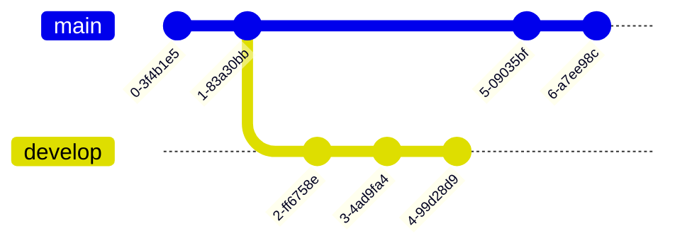
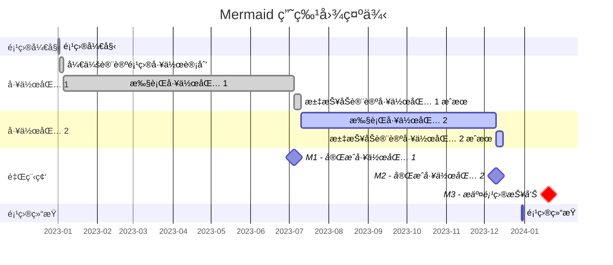

# Mermaid

[TOC]

## Res
🠠https://mermaid-js.github.io/mermaid/#/

## Intro

```mermaid
gitGraph
	commit
	commit
	branch develop
	commit
	commit
	commit
	checkout main
	commit
	commit
```

```mermaid 
gantt

title Mermaid 甘特图示例 
%% èµ·æ­¢æ—¥æœŸè¯­æ³•æ ¼å¼ 
dateFormat YYYY-MM-DD
%% æœ€ä¸‹æ–¹æ—¶é—´è½´æ—¥æœŸæ ¼å¼ 
axisFormat %Y-%m 
%% 最下方时间轴时间间隔 
tickInterval 1month 
%% è¡¨ç¤ºä»Šå¤©æ ‡è®°çš„æ˜¾ç¤ºæ ·å¼ 
todayMarker stroke-width:3px,stroke:#FBBC05,opacity:0.6 

%% 定义任务分类/区 
section 项目开始 
项目开始: done, a0, 2023-01-01, 1d 

section 工作包 1 
开会讨论项目工作计划: done, a1, after a0, 2023-01-05 
执行工作包 1: done, a2, after a1, 6M 
汇报åŠè®¨è®ºå·¥ä½œåŒ… 1 æˆæœ: done, a3, after a2, 5d 

section 工作包 2 
执行工作包 2: active, a4, after a3, 5M 
汇报åŠè®¨è®ºå·¥ä½œåŒ… 2 æˆæœ: active, a5, after a4, 5d

section 里程碑 

M1 - 完æˆå·¥ä½œåŒ… 1: milestone, after a2, 0d 
M2 - 完æˆå·¥ä½œåŒ… 2: milestone, after a4, 0d 
M3 - æ交项目报告: crit, milestone, 2024-01-20, 0d 

section é¡¹ç›®ç»“æŸ 
项目结æŸ: active, 2023-12-30, 1d
```

## Ref
