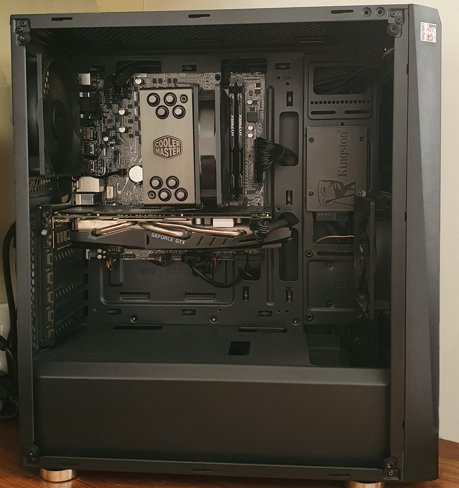

# Computer Taxonomy & Computer (Hardware) Components

[TOC]

> 💡 The contents of this article are based on **von-Neumann architecture designed computers**. Some of the descriptions may not fit non-von Neumann computers.

## Res
### Related Topics
↗ [Computer Microarchitectures (Computer Organization) & von Neumann Model](Computer%20Architecture/Computer%20Microarchitectures%20(Computer%20Organization)%20&%20von%20Neumann%20Model/Computer%20Microarchitectures%20(Computer%20Organization)%20&%20von%20Neumann%20Model.md)
↗ [Computer System Implementations](../Hardware%20&%20EE%20Related%20Theories/🛠️%20Computer%20System%20Implementations/Computer%20System%20Implementations.md)
↗ [Small Form Factor Computer](../../🧠%20Computing%20Methodologies/Small%20Form%20Factor%20Computer.md)

↗ [Systems on Chip (SOC)](Computer%20Architecture/Computer%20Microarchitectures%20(Computer%20Organization)%20&%20von%20Neumann%20Model/Systems%20on%20Chip%20(SOC).md)
↗ [IDC & Data Center Networking](../🏎️%20Computer%20Networking%20and%20Communication/🚀%20High%20Performance%20Network%20(HPN)%20&%20IDC%20Technologies/IDC%20&%20Data%20Center%20Networking.md)
↗ [Datacenter](../🍕%20Computer%20Storage%20&%20Database%20Systems/🚀%20High%20Performance%20Storage%20(HPS)/Datacenter.md)

↗ [Auxiliary Hardware & Peripherals (IO Devices)](../Hardware%20&%20EE%20Related%20Theories/Auxiliary%20Hardware%20&%20Peripherals%20(IO%20Devices)/Auxiliary%20Hardware%20&%20Peripherals%20(IO%20Devices).md)
↗ [Network Devices Overview](../🏎️%20Computer%20Networking%20and%20Communication/📌%20Computer%20Networking%20Basics%20(Protocol%20Part)/Network%20Devices%20Overview.md)

↗ [Semiconductor Industry & Companies](../../🗺%20CS%20Overview/Electronics%20&%20Information%20Technologies%20Business%20Fields%20Research/Hardware%20Industry%20&%20Manufacturers/Semiconductor%20Industry%20&%20Companies/Semiconductor%20Industry%20&%20Companies.md)

## Intro
> 🔗 https://en.wikipedia.org/wiki/Computer_hardware#

<small>https://en.wikipedia.org/wiki/Computer_hardware#External_links</small>

### PCB (Printed Circuit Board)

## 🎯 Basic Computer Components
### Motherboard
↗ [Motherboard & Mainboard](Computer%20Architecture/Computer%20Microarchitectures%20(Computer%20Organization)%20&%20von%20Neumann%20Model/Motherboard%20&%20Mainboard.md)

### PSU (Power Supply Unit) /PMU (Power Management Unit)
> 🔗 https://en.wikipedia.org/wiki/Power_supply_unit_(computer)

A power supply unit (PSU) converts mains AC to low-voltage regulated DC power for the internal components of a computer. Modern personal computers universally use switched-mode power supplies. Some power supplies have a manual switch for selecting input voltage, while others automatically adapt to the main voltage.

Most modern desktop personal computer power supplies conform to the ATX specification, which includes form factor and voltage tolerances. While an ATX power supply is connected to the mains supply, it always provides a 5-volt standby (5VSB) power so that the standby functions on the computer and certain peripherals are powered. ATX power supplies are turned on and off by a signal from the motherboard. They also provide a signal to the motherboard to indicate when the DC voltages are in spec, so that the computer is able to safely power up and boot. The most recent ATX PSU standard is version 3.0 as of mid-2022.
#### DC Power Delivery

#### AC Power Delivery

### Ports & Interfaces
↗ [Expansion Bus (Ports & Computer Bus Interfaces)](Computer%20Architecture/Computer%20Microarchitectures%20(Computer%20Organization)%20&%20von%20Neumann%20Model/Computer%20Bus%20(Datapath)%20&%20Interfaces%20&%20Protocols/🛣️%20Expansion%20Bus%20(Ports%20&%20Computer%20Bus%20Interfaces)/Expansion%20Bus%20(Ports%20&%20Computer%20Bus%20Interfaces).md)
↗ [Device Controllers & Adapter Cards (Expansion Cards)](Computer%20Architecture/Computer%20Microarchitectures%20(Computer%20Organization)%20&%20von%20Neumann%20Model/Computer%20IO%20System/Device%20Controllers%20&%20Adapter%20Cards%20(Expansion%20Cards)/Device%20Controllers%20&%20Adapter%20Cards%20(Expansion%20Cards).md)

### IO Modules
#### Network Modules
#### Secondary Storage
↗ [Secondary (Auxiliary) Storage Technologies & DAS (Directly Attached Storage)](Computer%20Architecture/Computer%20Microarchitectures%20(Computer%20Organization)%20&%20von%20Neumann%20Model/Computer%20Memory%20&%20Storage/Secondary%20(Auxiliary)%20Storage%20Technologies%20&%20DAS%20(Directly%20Attached%20Storage)/Secondary%20(Auxiliary)%20Storage%20Technologies%20&%20DAS%20(Directly%20Attached%20Storage).md)

### Computer Case
> 🔗 https://en.wikipedia.org/wiki/Computer_case#

A **computer case**, also known as a **computer chassis**, is the enclosure that contains most of the hardware of a personal computer. The components housed inside the case (such as the CPU, motherboard, memory, mass storage devices, power supply unit and various expansion cards) are referred as the internal hardware, while hardware outside the case (typically cable-linked or plug-and-play devices such as the display, speakers, keyboard, mouse and USB flash drives) are known as peripherals.

Conventional computer cases are fully enclosed, with small holes (mostly in the back panel) that allow ventilation and cutout openings that provide access to plugs/sockets (back) and removable media drive bays (front). The structural frame (chassis) of a case is usually constructed from rigid metals such as steel (often SECC — steel, electrogalvanized, cold-rolled, coil) and aluminium alloy, with hardpoints and through holes for mounting internal hardware, case fans/coolers and for organizing cable management. The external case panels, at least one of which are removable, cover the chassis from the front, sides and top to shield the internal components from physical intrusion and dust collection, and are typically made from painted metallic and/or plastic material, while other materials such as mesh, tempered glass, acrylic, wood and even Lego bricks have appeared in many modern commercial or home-built cases. In recent years, open frame or open air cases that are only partly enclosed (with freer ventilation and thus theoretically better cooling) have become available in the premium gaming PC market.

<small>An ATX case. The motherboard (microATX)) is in a horizontal position at the top, and the peripheral connectors go at the panel located at the rear of the case and USB ports at the top. The fans are also at the rear and front. The power supply is on the bottom rear.</small>

### System-on-Chip (SoC)
↗ [Systems on Chip (SOC)](Computer%20Architecture/Computer%20Microarchitectures%20(Computer%20Organization)%20&%20von%20Neumann%20Model/Systems%20on%20Chip%20(SOC).md)

## 🎯 Computer Taxonomy
### Personal Computers

### Embedded Computers
↗ [Computer Engineering, Embedded & IoT](../../Computer%20Engineering,%20Embedded%20&%20IoT/Computer%20Engineering,%20Embedded%20&%20IoT.md)
↗ [Embedded Computer Systems](../../Computer%20Engineering,%20Embedded%20&%20IoT/🚟%20Embedded%20Computer%20Systems/Embedded%20Computer%20Systems.md)

### Mainframe Computers & Data Center
↗ [IDC & Data Center Networking](../🏎️%20Computer%20Networking%20and%20Communication/🚀%20High%20Performance%20Network%20(HPN)%20&%20IDC%20Technologies/IDC%20&%20Data%20Center%20Networking.md)
↗ [Datacenter](../🍕%20Computer%20Storage%20&%20Database%20Systems/🚀%20High%20Performance%20Storage%20(HPS)/Datacenter.md)
↗ [Cloud Computing & Cloud Native](../../Software%20Engineering/☁️%20Cloud%20Computing%20&%20Cloud%20Native/Cloud%20Computing%20&%20Cloud%20Native.md)
↗ [Distributed Computing & Systems](../../🧠%20Computing%20Methodologies/Distributed%20Computing%20&%20Systems/Distributed%20Computing%20&%20Systems.md)

### Super Computers
↗ [High Performance Computing](../../🧠%20Computing%20Methodologies/⚡️%20High%20Performance%20Computing/High%20Performance%20Computing.md)
↗ [High Performance Computer (HPC)](../../🧠%20Computing%20Methodologies/⚡️%20High%20Performance%20Computing/High%20Performance%20Computer%20(HPC).md)

## Ref
🎬【雷神MIX游戏迷你主机全网首发评测：一手掌握的40系独显主机】 https://www.bilibili.com/video/BV1nm4y157fG/?share_source=copy_web&vd_source=7740584ebdab35221363fc24d1582d9d

🎬【2.5升16GB独显NUC12 蝰蛇峡谷测评，intel首款3i平台NUC产品水深水浅？】 https://www.bilibili.com/video/BV1sR4y1D7TD/?share_source=copy_web&vd_source=7740584ebdab35221363fc24d1582d9d

[一台电脑由哪些部分构成？]: https://www.cnblogs.com/skzxc/p/12914063.html