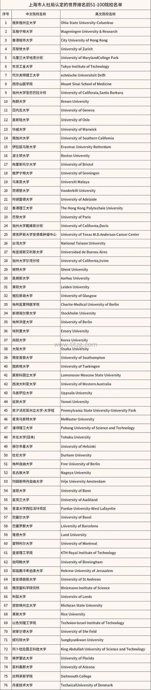

# (CS) Master & PhD Guide - Preparation & Application

[TOC]

## Res
### Related Topics
↗ [🌲 Road To CS](../../../💋%20Intro%20to%20Computer%20Science/🌲%20Road%20To%20CS.md)
↗ [Academics](../../../../Academics%20🎓/Academics.md)
- ↗ [FAQ - Academia and Research /📌 PhD Candidate /Academic Researcher ?](../../../../Academics%20🎓/FAQ%20-%20Academia%20and%20Research.md#📌%20PhD%20Candidate%20/Academic%20Researcher%20?)

### 🥰 Application Guides /Tips /Experiences
【金山文档 | WPS云文档】 寄托25瑞典
https://kdocs.cn/l/cvXSs1xFm83g
【金山文档 | WPS云文档】 寄托23瑞典
https://www.kdocs.cn/l/cuSHmNK2KAXO

https://docs.qq.com/aio/DRGlmTG5LanhPSUdP?p=K0azlTGvet02xOd2FZGDJ2
DIY 留学攻略指北「共享编辑」
- https://github.com/Ryleeing/GlobalApplication_Co-createdStudyAbroadTutorials
- 这是一份DIY的留学申请的教程，欢迎所有人edit，我有初始备份。也欢迎各个专业的人前来分享。
- 因为我知道这份教程只能现在停止在24fall，未来肯定还会有很多申请变化。希望你在收到我帮之后，也能在你的申请季结束之来参与这份文件的编辑。
- 增加信息的人可以直接写。我认为欧陆申请是完全可以DIY/半DIY的，因为它不复杂。
- 我们不需要中介，我们需要的是勇气。欢迎来到新世界
- it sucks, but you gonna like it.

https://survivesjtu.github.io/SJTU-Application/
上海交通大学大学飞跃手册
https://sustech-application.com/#/
南方科技大学飞跃手册
https://hust-feiyue.github.io/
华中科技大学光电飞跃手册
http://scu-flying.com/
四川大学飞跃手册
etc..

https://www.cs.utexas.edu/~vijay/links.htm | Useful Links for Students
1. Email Etiquette
	1. [Getting in Contact (for prospective students)](https://www.cs.utah.edu/~tdenning/students.html) by [Tamara Denning](https://www.cs.utah.edu/~tdenning/)
	2. [How to send and reply to email](http://matt.might.net/articles/how-to-email/) (applies for all professional interactions, esp. with professors) by [Matt Might](http://matt.might.net/)
	3. [How to get a busy person to respond to your email](https://medium.com/@mattangriffel/how-to-get-a-busy-person-to-respond-to-your-email-52e5d4d69671) by [Mattan Griffel](https://medium.com/@mattangriffel)
2. For students applying to grad school
	1. [How to Pick a Graduate Advisor](http://www.cell.com/neuron/fulltext/S0896-6273(13)00907-0) by [Ben Barres](https://profiles.stanford.edu/ben-barres)
	2. [Advice to Graduate School Recommendation Letter Writers](http://cs.brown.edu/~sk/Memos/Grad-School-Recos/) by [Shriram Krishnamurthi](http://cs.brown.edu/~sk/) (**Have your LOR writers read this!**)
	3. [How to get a great letter of recommendation](http://matt.might.net/articles/how-to-recommendation-letter/) by [Matt Might](http://matt.might.net/)
	4. [HOWTO: Get into grad school for science, engineering, math and computer science](http://matt.might.net/articles/how-to-apply-and-get-in-to-graduate-school-in-science-mathematics-engineering-or-computer-science/) by [Matt Might](http://matt.might.net/)
	5. [How CS Master's Funding Works (and Why You Can't Seem to Get Any)](http://cs.brown.edu/~sk/Memos/Funding-CS-Grad-School/) by [Shriram Krishnamurthi](http://cs.brown.edu/~sk/)
	6. [A Five-Minute Guide to Ph.D. Program Applications](http://www.pgbovine.net/PhD-application-tips.htm) by [Philip Guo](http://www.pgbovine.net/)
	7. [How to pick a grad school for a PhD in Computer Science](https://medium.com/@vijayc/how-to-pick-a-grad-school-for-a-phd-in-computer-science-a5ce7dceb246) by me.
	8. [Twitter Thread on what to write in a SOP/research statement](https://threadreaderapp.com/thread/933388419589459969.html) by me.
3. For undergrads considering doing research
	1. [The Benefits of Working on Research As An Undergraduate Student](http://cacm.acm.org/blogs/blog-cacm/173645-the-benefits-of-working-on-research-as-an-undergraduate-student/fulltext) by [Philip Guo](http://www.pgbovine.net/)
4. For students considering a PhD
	1. [Why Pursue A Ph.D.? Three Practical Reasons](https://vimeo.com/80236275) by [Philip Guo](http://www.pgbovine.net/)
	2. [The illustrated guide to a Ph.D](http://matt.might.net/articles/phd-school-in-pictures/) by [Matt Might](http://matt.might.net/)
	3. [3 qualities of successful Ph.D. students: Perseverance, tenacity and cogency](http://matt.might.net/articles/successful-phd-students/) (notice it doesn't say smart/genius etc.) by [Matt Might](http://matt.might.net/)
5. For PhD students
	1. [Pep talk for new Ph.D. students](http://www.pgbovine.net/pep-talk-for-new-PhD-students.htm) by [Philip Guo](http://www.pgbovine.net/)
	2. [Keys to Grad School](https://www.youtube.com/watch?v=fqPSnjewkuA&feature=youtu.be) by [Remzi Arpaci-Dusseau](http://pages.cs.wisc.edu/~remzi/)
	3. [Advice for new Ph.D. students](http://pgbovine.net/early-stage-PhD-advice.htm) by [Philip Guo](http://www.pgbovine.net/)
	4. [10 easy ways to fail a Ph.D.](http://matt.might.net/articles/ways-to-fail-a-phd/) by [Matt Might](http://matt.might.net/)

https://www.cmu.edu/student-success/programs/index.html
Student Academic Success Center | CMU

https://mitcommlab.mit.edu/eecs/
MIT EECS Communication Lab | MIT

https://www.cs.utexas.edu/~vijay/prospective-students.htm

[The PhD Grind, and Why Research Isn’t Like Sex](https://blog.regehr.org/archives/743)

https://www.haojianj.in/prospective.html

### General Information about International Universities & Countries' Lives
↗ [Academics / 文献计量学与学术评价](../../../../Academics%20🎓/Academics.md#📈%20Bibliometrics)  | 文献计量学与学术评价
- https://www.topuniversities.com/world-university-rankings | QS, Quacquarelli Symonds
- https://www.shanghairanking.com/rankings/arwu/ | ARWU, Shanghai Jiao Tong University
- https://www.timeshighereducation.com/world-university-rankings | THE, Times Higher Education
- https://www.usnews.com/best-colleges/rankings/national-universities | U.S. News, 

https://www.niche.com/
School Ranking, Apply, Review, and Others..

[TransferWiki](https://transferwiki.com/)
TransferWiki 详细介绍了 transfer 相关信息。transfer 到海本可以极大方便找工/移民/硕博申请，推荐本科低年级同学了解

https://www.payscale.com/college-salary-report
College Salary Report (US)

https://www.numbeo.com/cost-of-living/
Cost of Living

2025上海留学生落户名单更新！超10所英美院校升级为世界前50！ - 新东方国际教育雅思托福的文章 - 知乎: https://zhuanlan.zhihu.com/p/25263482873
https://www.tltzg.com/luohu/8402.html

### CS Related Information
#### General CS Info
[CS Open Rankings](https://drafty.cs.brown.edu/csopenrankings/) (Canada + U.S.)
CS Open Rankings 是结合了 U.S. News, csrankings.org, placement rank, best paper awards 进行的综合排名

> Rankings are an [ideology](https://jeffhuang.com/computer-science-open-data/#bias-in-computer-science-rankings). Each is biased in its own way. So choose and combine existing rankings to generate your preferred meta ranking for computer science programs in the United States and Canada. Ranking sources represent: reputation ([U.S. News](https://www.usnews.com/best-graduate-schools/top-science-schools/computer-science-rankings)*), faculty publications ([csrankings.org](https://csrankings.org/)*), academic placement ([placement rank](https://drafty.cs.brown.edu/csopenrankings/placement-rank.html)), and recognition ([best paper awards](https://jeffhuang.com/best_paper_awards/)). Use this to find the best computer science program for you in artificial intelligence, systems, or theory.

[CSRankings](https://csrankings.org/)
CSRankings 根据 dblp 中收录顶会论文数量进行排名

https://www.universities.com
Get the latest on degrees, college, and scholarship opportunities straight to your inbox.

[CS Open Application (CS Masters Application)](https://opencs.app)
> Insights
> 我们很高兴宣布[DataPoints©](https://csmsapp.org/datapoints/)，快来尝试吧！期待大家[提交新的 DataPoints](https://csmsapp.org/datapoints_submit.md)
> [申请 FAQ](https://csmsapp.org/faq/)栏目中收集了一些群内大家常问的问题及解答，欢迎补充！
> [外部链接](https://csmsapp.org/link/)中收录了非常有用的工具网站，give it a try!

https://global-cs-application.github.io
这是一个针对**欧洲/港新**地区计算机硕士相关项目的介绍网站
（如果你更关心北美地区的项目，请移步[openCS](https://opencs.app/) ╥﹏╥）
我们理解并支持每一位同学的选择，项目的所有信息仅辅助所有用户的个人决策。

[Collection of advice for prospective and current PhD students](https://github.com/pliang279/awesome-phd-advice)
为 CS PhD 申请者提供的建议精选列表，由互联网上的博客组成，略微偏重于 AI/ML 和 NLP 领域。

[Awesome CS PhD application advice ](https://github.com/jedyang97/awesome-cs-phd-application-advice)
为未来和当前的博士生收集的建议

[Computer Science Open Data](https://jeffhuang.com/computer-science-open-data/)
各校教授，排名，最佳论文，津贴信息

[Computer Science Professors](https://drafty.cs.brown.edu/csprofessors?src=csopendata)
Computer Science Professors 收录了各校各年度新晋 faculty 名录和研究兴趣，方便进行 POI 选择

Grantome 美国教授科研经费查询 [https://grantome.com/search](https://grantome.com/search)
NIH 美国教授科研经费查询 [https://report.nih.gov/](https://report.nih.gov/)

EURAXESS Jobs
Academic Positions
FindAPhD
ResearchGate
Nature Jobs
Jobs.ac.uk
THEunijobs
Linkedin
ScholarshipPortal
#### Specific CS Infos
https://www.universities.com/find/us/best/computer-technology/cyber-security
Best Cyber Security colleges in U.S.

https://www.imperial.ac.uk/study/courses/postgraduate-taught/computing-security-reliability-msc/
Computing (Security and Reliability) Major Intro (Imperial College London)
Enhance your knowledge of IT security and reliability to prepare for a career in the computing industry.

### Others
https://www.csc.edu.cn/chuguo/list/73
中国国家留学网

## 🥸 Why Master /PhD?
### Why Master Degree?

### Why PhD Degree?
[非机器学习方向的 CS PhD 有必要读么？ - 巴山轮的荣光的回答 - 知乎]: https://www.zhihu.com/question/307580157/answer/1783828492
[对于未来的CS PhD申请者来说，暑假应该做实习还是去实验室更好呢？ - Bihan Wen的回答 - 知乎]: https://www.zhihu.com/question/308026281/answer/566961945

[🤔 中科院敏感专业，学硕转博还是硬刚美国博士？]: https://www.1point3acres.com/bbs/thread-648011-1-1.html

[美国top15 CS本科在读，有能力的情况下毕业就工作（也就是当码农），还是读PhD？ - 从不沉船的零氪玩家的回答 - 知乎]: https://www.zhihu.com/question/443091161/answer/2974932598

[美国top15 CS本科在读，有能力的情况下毕业就工作（也就是当码农），还是读PhD？ - MONO77的回答 - 知乎]: https://www.zhihu.com/question/443091161/answer/2967331041
好家伙，这么多人劝退PhD吗...

没想到居然真有人跟我一个处境哈哈哈，虽然题主的学校比我好多了。

我现在是UW-Madison CS 大三，跟题主一样，有去大厂工作的能力。大二的时候我就已经去Google实习了一次，今年暑假我其实可以return，甚至有两个组都给我offer了，并且上次实习的host有答应说如果两次internship，会帮我争取无面试转正。姑且相信他吧。

但是吧，这个暑假还是选择了withdraw return去做科研，主要的原因就是不想直接进大厂工作，而是想先实现一下科研的梦想。

我不清楚题主有没有在Google之类的大厂实习过，至少按照我实习的体验，我可以说刚进去的Entry Level，真的不会有任何有挑战性的工作，纯纯的就是Feature Monkey这种，讲真我那实习的工作，换成高中的我也能做... 实在是没啥成就感。至于说那些比较fancy的组，至少我没那个connection进去，而且据我观察，PhD在这些组的比例还是很高的。而另一边，在科研里面，因为一个组就那么多人，即使是本科生也是有一定的exposure：只要你在初期表现出完成任务的能力，导师还是很乐意给你一些机会的。

除了成就感，我也想说一下职业规划，毕竟作为本科生，视野比较局限，所以可能说的有失偏颇，大伙图一乐就好，如果有老哥愿意指点一下，也是非常感谢。因为实习时候的Host最近升职了嘛，然后我也就跟他聊了一下，按照他的说法，其实从Junior到Staff，无非就是做的事情更抽象，从实现具体的功能变成需要考虑商业因素。实话说，我不是很喜欢这个路线，我更希望能做一些技术上的突破。抛开这些目标性的不谈，读PhD也算是给自己开了一条新的路吧，如果最后不想做计算机了，也可以去金融、咨询这些公司，感觉他们还是比较喜欢PhD这个牌子的。

最后一点自然就是钱了。我个人其实不是很在意说当下要赚多少。尤其在美国，我个人感觉，在村子里赚几万刀和在湾区赚十几万刀，很难在生活上拉开本质的差距... 是，十几万刀是很多，但是得考虑税（到手先砍一半的那种）和更高的房租以及其他生活成本吧。我个人感觉读博给我带来的成就感、职业发展的提升，会超过在最开始的几年多赚的钱。

实话说我在这方面的思考还非常浅薄，因为想读博也是大三才开始思考的。我个人感觉还是先把手上的事情做好，比如先拿到不错的PhD Offer再来决定这件事情。After all，如果真的读博发现自己不适合，还可以drop的，我非常喜欢PhD给我的这种flexibility。

[去美国排名弱校读phd回国有意义吗？ - Tech阿乐的回答 - 知乎]: https://www.zhihu.com/question/588853191/answer/2939075571

[读 CS PhD 还是直接工作? - deepAF的回答 - 知乎]: https://www.zhihu.com/question/472465580/answer/2011277731
学弟你好，我[伯克利](https://zhida.zhihu.com/search?content_id=395768946&content_type=Answer&match_order=1&q=%E4%BC%AF%E5%85%8B%E5%88%A9&zhida_source=entity)刚刚毕业。我选择了去[cmu](https://zhida.zhihu.com/search?content_id=395768946&content_type=Answer&match_order=1&q=cmu&zhida_source=entity)读[robot learning](https://zhida.zhihu.com/search?content_id=395768946&content_type=Answer&match_order=1&q=robot+learning&zhida_source=entity)的grad school。

你现在大一暑假，机会还有很多，既然你上完了188，fall的时候可以跟[sergey](https://zhida.zhihu.com/search?content_id=395768946&content_type=Answer&match_order=1&q=sergey&zhida_source=entity)上285，那个课特别好，会给你一个很大的boost。关于ion的riselab，我推荐你上完162再考虑，因为那个lab需要os和ml的知识，所以你需要上162和189。

申请phd的话，你需要很solid的科研精力，你上完285之后就有资格进abbeel或者sergey的实验室了，从数据来看这两个实验室的毕业生申请结果是最好的。sergey和abbeel实验室今年好像每个出来了三个[Stanford](https://zhida.zhihu.com/search?content_id=395768946&content_type=Answer&match_order=1&q=Stanford&zhida_source=entity)，[mit](https://zhida.zhihu.com/search?content_id=395768946&content_type=Answer&match_order=1&q=mit&zhida_source=entity)的录取。争取大二下学期开始帮他们打杂，然后大二暑假留校科研，发表文章到[icra](https://zhida.zhihu.com/search?content_id=395768946&content_type=Answer&match_order=1&q=icra&zhida_source=entity)或者[corl](https://zhida.zhihu.com/search?content_id=395768946&content_type=Answer&match_order=1&q=corl&zhida_source=entity)。这样你就会省出很多时间。

至于工作，如果你对research感兴趣的话，我建议你申请grad school，如果phd没有准备好可以申请我校的5th year ms，出来之后可以找工作或者接着phd。

有关[quant](https://zhida.zhihu.com/search?content_id=395768946&content_type=Answer&match_order=1&q=quant&zhida_source=entity)方面，我同意楼上的观点：你需要学习一下market的基本知识，可以从看书或者YouTube视频开始。github上也有开源的[trading bot](https://zhida.zhihu.com/search?content_id=395768946&content_type=Answer&match_order=1&q=trading+bot&zhida_source=entity)，你也可以看看。[2sigma](https://zhida.zhihu.com/search?content_id=395768946&content_type=Answer&match_order=1&q=2sigma&zhida_source=entity)，[tower](https://zhida.zhihu.com/search?content_id=395768946&content_type=Answer&match_order=1&q=tower&zhida_source=entity)，Renaissance，[citadel](https://zhida.zhihu.com/search?content_id=395768946&content_type=Answer&match_order=1&q=citadel&zhida_source=entity)这种公司，现在偏向招理工科phd，不需要你有太强金融背景。所以你要是读完一个ai的phd也可以转行去quant做trading。我cornell的一个phd学长毕业进了tower，年薪700k，但是压力也巨大。

总之你刚开始，有的是时间。我建议接着把189, 285这些课上好然后进实验室，到时就能接着做决定了。

## Master /PhD Preparation?
### How to choose a university & Country?
↗ [International Master & PhD Programmes](International%20Master%20&%20PhD%20Programmes.md)

## Master /PhD Application?
### How to Prepare Materials?
Admission Materials: 
1. [Statement of Purpose (SoP) & Statement of Intent (SoI)](Admission%20Materials/Statement%20of%20Purpose%20(SoP)%20&%20Statement%20of%20Intent%20(SoI).md)
2. [Personal Statement (PS)](Admission%20Materials/Personal%20Statement%20(PS).md)
3. [Letter of Recommendations (LORs)](Admission%20Materials/Letter%20of%20Recommendations%20(LORs).md)
4. [Research Proposal (RP)](Admission%20Materials/Research%20Proposal%20(RP).md)
5. [Academic Resume & Curriculum Vitae (CV)](Admission%20Materials/Academic%20Resume%20&%20Curriculum%20Vitae%20(CV).md)
6. [Scholarship Essay](Admission%20Materials/Scholarship%20Essay.md)

Language Learning:
1. [GRE (Graduate Record Examinations)](Language%20Certificates/GRE%20(Graduate%20Record%20Examinations)/GRE%20(Graduate%20Record%20Examinations).md)
2. [IELTS (International English Language Testing System)](Language%20Certificates/IELTS%20(International%20English%20Language%20Testing%20System).md)
3. [TOEFL (Test of English as a Foreign Language)](Language%20Certificates/TOEFL%20(Test%20of%20English%20as%20a%20Foreign%20Language).md)

90 【🇨🇭审完150份PhD申请 有负作用的经历 - 没滑雪的Alex | 小红书 - 你的生活兴趣社区】 😆 E6RlxXFrC8uzSYD 😆 https://www.xiaohongshu.com/discovery/item/678c11520000000018014144?source=webshare&xhsshare=pc_web&xsec_token=ABcbYlSmeAEoLvkGPZBw1y5ZOzhBR8968sck4JIVLVkA4=&xsec_source=pc_share
接上一条，我们组的PhD职位deadline当天多了二十份申请，我又看了一下午 感谢大家喜欢！为了确保我的博后导师和我能够对PhD学生提供足够多的指导，我们一直在控制PhD人数，现在没法接待访问学生。
	
上一条提到了坏习惯，不是所有的经历都是正面效果。
1. 简历看着很好，十个项目无产出，负分。（吃过教训）
2. 水论文全A+B的（有一两篇没关系，有科研经历起码）
3. 习惯了低标准，做一点就想发论文，负分。（起码要让人看到你的标准在进步，特别是硕士）
4. 糊弄自己糊弄别人。 （不懂的东西不要乱写）
5. 有结果就行，不思考结果的含义。 （猴子乱按也是结果，当RA切记思考自己做的东西意味着什么，合不合理）
6. 不接受失败的尝试。（科研是会失败的，甚至可以说大部分时间是没有进展的，学会接受尝试所付出的时间精力的代价，并从中学习到为什么这条路不通，能把这个讲清楚比多一两篇水文重要多了）
	
以上内容是可以从CV里面看出来的。
	
想进流水线组当螺丝的以上都不适用，卷数量就好了，+1+1+1……

### How to Contact Tutors /Make Connections?
> 🔗 https://www.haojianj.in/prospective.html

Email tips:  
- Please title your email as “Prospective [Ph.D. Student|Visitor|UCSD Student]: YourName - YourAffliation”.
- Briefly introduce what research problem that you are interested in.
- Briefly introduce yourself, including education background, research experiences, and programming skills. Connect your strengths and interests to mine.
- Briefly explain your motivations and expectations of working with me.
- Include your CV and transcript.

Tips for your application (adapted from Henny Admoni's website):  
- Show me you know what research involves. This means describing prior research projects, including how you came up with a novel idea, what you did to solve it, and how you communicated the outcome. The best candidates are ones who are familiar with all phases of the research process, even if they weren’t the ones leading the project themselves. 
- In describing your research, tell me what challenges you faced and how you adapted to those challenges. Research is not a linear process, and I am looking for students who show perseverance and creativity in the face of setbacks. Ph.D. is not easy for anyone. You need to have [Grit](https://www.amazon.com/Grit-Passion-Perseverance-Angela-Duckworth/dp/1501111108).
- Give me evidence that you are able to work independently, seek out new avenues for growth, and take responsibility for your learning. Strong candidates show this through activities outside the classroom, for example by doing research internships, joining clubs that allow for hands-on projects, or participating reading groups to discuss current research.

### ⭐ Admission Decision-Making: Academic Committee or Professor?
[CS PhD强committee&强professor List(仅供参考) - Frankdark的文章 - 知乎]: https://zhuanlan.zhihu.com/p/128037373

PhD申请无疑会遇到套磁的困惑，有些学校是强professor制，若能套磁成功则可能一步登天直接被录取；然而有些学校是强committee制，即便套磁的教授对自己非常感兴趣，但若不能过委员会这一关，则前功尽弃。理论上来说学校越好，越可能是强committee制，比如四大(S, UCB, CMU, MIT)，但其实也不乏UCLA,UVA等校是强导师制。整体来看，还是强committee占主流。关于PhD录取制，可以参考 **[申请录取委员会制度是怎么回事(上)](https://link.zhihu.com/?target=https%3A//www.1point3acres.com/%25E7%25BE%258E%25E5%259B%25BD%25E5%25BD%2595%25E5%258F%2596%25E5%25A7%2594%25E5%2591%2598%25E4%25BC%259A%25E5%2588%25B6%25E6%258B%259B%25E7%2594%259F%25E6%2598%25AF%25E6%2580%258E%25E4%25B9%2588%25E5%259B%259E%25E4%25BA%258B/)** 和 **[申请录取委员会制度是怎么回事(下)](https://link.zhihu.com/?target=https%3A//www.1point3acres.com/%25E7%25BE%258E%25E5%259B%25BD%25E5%25A4%25A7%25E5%25AD%25A6%25E7%2594%25B3%25E8%25AF%25B7%25E5%25BD%2595%25E5%258F%2596%25E5%25A7%2594%25E5%2591%2598%25E4%25BC%259A%25E5%2588%25B6%25E5%25BA%25A6%25E6%2598%25AF%25E6%2580%258E%25E4%25B9%2588%25E5%259B%259E%25E4%25BA%258B%25E4%25B8%258B/)。** 另外，根据[如何得到/推测学校的admission committee是哪些教授](https://link.zhihu.com/?target=http%3A//bbs.gter.net/forum.php%3Fmod%3Dviewthread%26tid%3D1926185)，**一般委员会成员里面大多都是AP，而且是新来的AP。chair可能是associate或者full，一个系里面系主任一般不会做committee chair的，professor的作用都是去招募系里新AP。**

由于本人也是即将申请PhD的2021Fall选手，因此在咨询了不同的学长学姐，导师和教授之后，获取了如下的信息(**同一学校不同院系的录取制度不完全相同，以下均是从EECS进行汇总，仅供参考**)

93 【PhD申请——招生委员会到底在关注什么 - 博士毕业了还没文章 | 小红书 - 你的生活兴趣社区】 😆 7y8EBYttS5tfaew 😆 https://www.xiaohongshu.com/discovery/item/67b589b5000000000d0145f4?source=webshare&xhsshare=pc_web&xsec_token=ABuhhHB-4ZTLd3ySj9ZIfU4PLdJ1ZEHC4sBT7lYiMF6Gk=&xsec_source=pc_share

## Master and PhD Stories
### How do they succeed in applying master /PhD
[陆本陆硕申请CS PhD 25fall总结分享 - 绝对领域小摩托的文章 - 知乎]: https://zhuanlan.zhihu.com/p/22584081346
[北美24Fall CS PhD申请心路，非大神 - 苍梧听雨的文章 - 知乎]: https://zhuanlan.zhihu.com/p/682302345
[2024 Fall CS PhD 申请反思 (AI/CV方向) - Shaun的文章 - 知乎]: https://zhuanlan.zhihu.com/p/690240135

### How do they succeed from master /PhD
[我的奋斗：从找不到工作的穷留学生到沙特阿卜杜拉国王科技大学（KAUST）第一位华人高级网络工程师 - 弈心的文章 - 知乎]: https://zhuanlan.zhihu.com/p/146003181

[工作五年反思 - 李沐的文章 - 知乎]: https://zhuanlan.zhihu.com/p/374777591
[博士这五年 - 李沐的文章 - 知乎]: https://zhuanlan.zhihu.com/p/25099638

## Ref
[👍 another annotated sop]: https://eugenielai.github.io/posts/another-annotated-sop.html

[为什么有人说去美国读 PhD 要避开亚裔、女性、助理教授（AP）、未婚四类导师？ - Feng的回答 - 知乎]: https://www.zhihu.com/question/51703875/answer/1528878088
