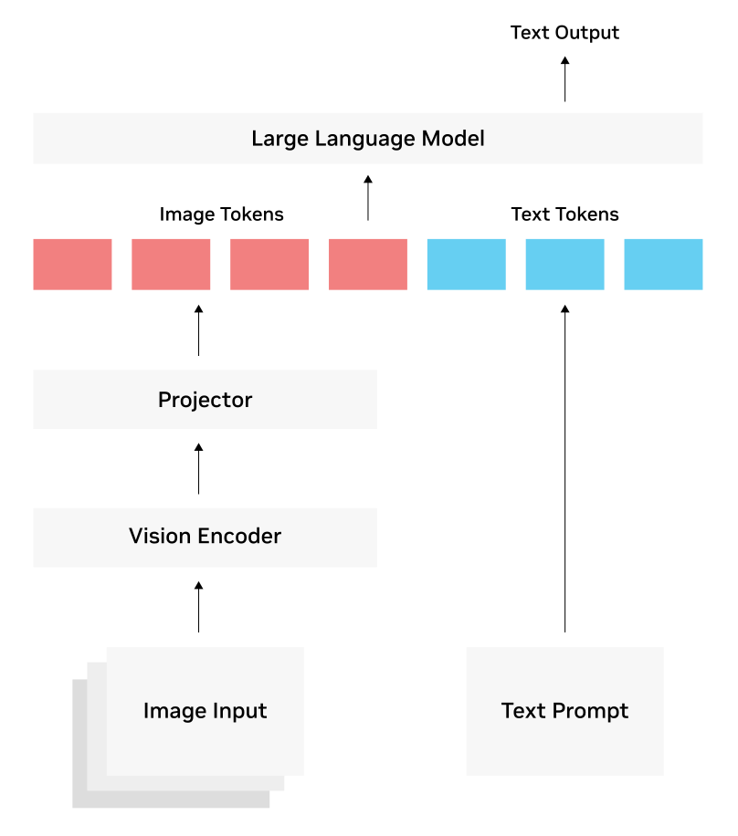

# Video Generation & VLM (Vision Language Model)

[TOC]

## Res
### Related Topics
↗ [Vision-Language-Action Model](../../../❌%20AI4X,%20AGI%20(Artificial%20General%20Intelligence)%20&%20AIGC/🤔%20AI%20Embodiment%20&%20World%20Model/AI%20+%20Robotics%20&%20Robot%20Learning/Vision-Language-Action%20Model/Vision-Language-Action%20Model.md)

### Other Resources

## Intro
> 🔗 https://www.nvidia.com/en-us/glossary/vision-language-models/

A vision language model is an AI system built by combining a [large language model](https://www.nvidia.com/en-us/glossary/large-language-models/) (LLM) with a vision encoder, giving the LLM the ability to “see.”

With this ability, VLMs can process and provide advanced understanding of video, image, and text inputs supplied in the prompt to generate text responses.

Unlike traditional [computer vision](https://www.nvidia.com/en-us/glossary/computer-vision/) (CV) models, VLMs aren’t bound by a fixed set of classes or a specific task, like classification or detection. Retrained on a vast corpus of text and image/video-caption pairs, VLMs can be instructed in natural language and used to handle many classic vision tasks, as well as new generative AI-powered tasks such as summarization and visual Q&A.

<small>Figure 2: A common three-part architecture for vision language models <a>https://www.nvidia.com/en-us/glossary/vision-language-models/</a></small>

## Ref
