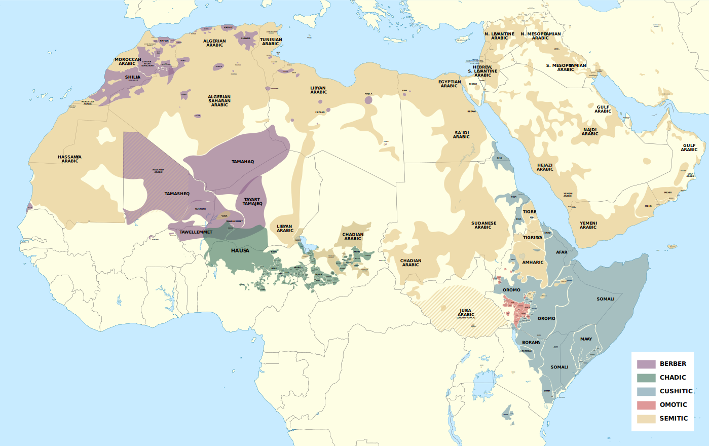

# Language & Literature

[TOC]

## Res
### Related Topics
↗ [Natural Language Processing (NLP)](../../../CS/🧠%20Computing%20Methodologies/👽%20Artificial%20Intelligence/🔥%20Natural%20Language%20Processing%20(NLP)/Natural%20Language%20Processing%20(NLP).md)
↗ [LLM (Large Language Model)](../../../CS/🧠%20Computing%20Methodologies/👽%20Artificial%20Intelligence/🔥%20Natural%20Language%20Processing%20(NLP)/🦑%20LLM%20(Large%20Language%20Model)/LLM%20(Large%20Language%20Model).md)

### Other Resources
📖 https://opentextbc.ca/psyclanguage/
In this textbook, students are introduced to the fundamental principles of linguistics and psycholinguistics. Students will explore theories and models of language development, comprehension and production as well as bilingualism and reading. All of these topics are approached from a Canadian perspective and include ideas from indigenous cultures and languages of Canada.

## Intro: Language & Linguistics
### Taxonomy of Languages
#### Genealogical Typology & Language Family (语系)
> 🔗 https://en.wikipedia.org/wiki/Language_family

<small>2005 map of the contemporary distribution of the world's primary language families</small>

A **language family** is a group of [languages](https://en.wikipedia.org/wiki/Language "Language") related through descent from a common ancestor, called the [proto-language](https://en.wikipedia.org/wiki/Proto-language "Proto-language") of that family. The term _family_ is a metaphor borrowed from biology, with the [tree model](https://en.wikipedia.org/wiki/Tree_model "Tree model") used in [historical linguistics](https://en.wikipedia.org/wiki/Historical_linguistics "Historical linguistics") analogous to a [family tree](https://en.wikipedia.org/wiki/Family_tree "Family tree"), or to [phylogenetic trees](https://en.wikipedia.org/wiki/Phylogenetic_tree "Phylogenetic tree") of taxa used in evolutionary [taxonomy](https://en.wikipedia.org/wiki/Taxonomy_\(biology\) "Taxonomy (biology)"). Linguists thus describe the _daughter languages_ within a language family as being ==**genetically related**==.) The divergence of a proto-language into daughter languages typically occurs through geographical separation, with different [regional dialects](https://en.wikipedia.org/wiki/Regional_dialect "Regional dialect") of the proto-language undergoing different [language changes](https://en.wikipedia.org/wiki/Language_change "Language change") and thus becoming distinct languages over time.

A language family is usually said to contain at least two languages, although [language isolates](https://en.wikipedia.org/wiki/Language_isolate "Language isolate") — languages that are not related to any other language — are occasionally referred to as families that contain one language. Inversely, there is no upper bound to the number of languages a family can contain. Some families, such as the [Austronesian languages](https://en.wikipedia.org/wiki/Austronesian_languages "Austronesian languages"), contain over 1000.

Language families can be identified from shared characteristics amongst languages. [Sound changes](https://en.wikipedia.org/wiki/Sound_change "Sound change") are one of the strongest pieces of evidence that can be used to identify a genetic relationship because of their predictable and consistent nature, and through the [comparative method](https://en.wikipedia.org/wiki/Comparative_method "Comparative method") can be used to reconstruct proto-languages. However, languages can also change through [language contact](https://en.wikipedia.org/wiki/Language_contact "Language contact") which can falsely suggest genetic relationships. For example, the [Mongolic](https://en.wikipedia.org/wiki/Mongolic_languages "Mongolic languages"), [Tungusic](https://en.wikipedia.org/wiki/Tungusic_languages "Tungusic languages"), and [Turkic languages](https://en.wikipedia.org/wiki/Turkic_languages "Turkic languages") share a great deal of similarities that lead several scholars to believe [they were related](https://en.wikipedia.org/wiki/Altaic_languages "Altaic languages"). These supposed relationships were later discovered to be derived through language contact and thus they are not truly related. Eventually though, high amounts of language contact and inconsistent changes will render it essentially impossible to derive any more relationships; even the oldest demonstrable language family, [Afroasiatic](https://en.wikipedia.org/wiki/Afroasiatic_languages "Afroasiatic languages"), is far younger than language itself.

##### Major Language Families
Estimates of the number of language families in the world may vary widely. According to _[Ethnologue](https://en.wikipedia.org/wiki/Ethnologue "Ethnologue")_ there are 7,151 [living human languages](https://en.wikipedia.org/wiki/Living_language "Living language") distributed in 142 different language families. [Lyle Campbell](https://en.wikipedia.org/wiki/Lyle_Campbell "Lyle Campbell") (2019) identifies a total of 406 independent language families, including isolates.

_[Ethnologue](https://en.wikipedia.org/wiki/Ethnologue "Ethnologue")_ 27 (2024) lists the following families that contain at least 1% of the 7,164 known languages in the world:
1. [Niger–Congo](https://en.wikipedia.org/wiki/Niger-Congo_languages "Niger-Congo languages") (1,552 languages)
2. [Austronesian](https://en.wikipedia.org/wiki/Austronesian_languages "Austronesian languages") (1,256 languages)
3. [Trans–New Guinea](https://en.wikipedia.org/wiki/Trans%E2%80%93New_Guinea_languages "Trans–New Guinea languages") (481 languages)
4. [Sino-Tibetan](https://en.wikipedia.org/wiki/Sino-Tibetan_languages "Sino-Tibetan languages") (458 languages)
5. [Indo-European](https://en.wikipedia.org/wiki/Indo-European_languages "Indo-European languages") (454 languages)
6. [Australian](https://en.wikipedia.org/wiki/Australian_Aboriginal_languages "Australian Aboriginal languages") (384 languages)
7. [Afroasiatic](https://en.wikipedia.org/wiki/Afroasiatic_languages "Afroasiatic languages") (382 languages)
8. [Nilo-Saharan](https://en.wikipedia.org/wiki/Nilo-Saharan_languages "Nilo-Saharan languages") (210 languages)
9. [Otomanguean](https://en.wikipedia.org/wiki/Oto-Manguean_languages "Oto-Manguean languages") (179 languages)
10. [Austroasiatic](https://en.wikipedia.org/wiki/Austroasiatic_languages "Austroasiatic languages") (167 languages)
11. [Kra-Dai](https://en.wikipedia.org/wiki/Kra-Dai_languages "Kra-Dai languages") (91 languages)
12. [Dravidian](https://en.wikipedia.org/wiki/Dravidian_languages "Dravidian languages") (85 languages)

_[Glottolog](https://en.wikipedia.org/wiki/Glottolog "Glottolog")_ 5.0 (2024) lists the following as the largest families, of 7,788 languages (other than [sign languages](https://en.wikipedia.org/wiki/Sign_language "Sign language"), [pidgins](https://en.wikipedia.org/wiki/Pidgin "Pidgin"), and [unclassifiable languages](https://en.wikipedia.org/wiki/Unclassified_language "Unclassified language")):
1. [Atlantic–Congo](https://en.wikipedia.org/wiki/Atlantic%E2%80%93Congo_languages "Atlantic–Congo languages") (1,410 languages)
2. [Austronesian](https://en.wikipedia.org/wiki/Austronesian_languages "Austronesian languages") (1,274 languages)
3. [Indo-European](https://en.wikipedia.org/wiki/Indo-European_languages "Indo-European languages") (586 languages)
4. [Sino-Tibetan](https://en.wikipedia.org/wiki/Sino-Tibetan_languages "Sino-Tibetan languages") (514 languages)
5. [Afroasiatic](https://en.wikipedia.org/wiki/Afro-Asiatic_languages "Afro-Asiatic languages") (381 languages)
6. Nuclear [Trans–New Guinea](https://en.wikipedia.org/wiki/Trans%E2%80%93New_Guinea_languages "Trans–New Guinea languages") (316 languages)
7. [Pama–Nyungan](https://en.wikipedia.org/wiki/Pama-Nyungan_languages "Pama-Nyungan languages") (250 languages)
8. [Otomanguean](https://en.wikipedia.org/wiki/Oto-Manguean_languages "Oto-Manguean languages") (181 languages)
9. [Austroasiatic](https://en.wikipedia.org/wiki/Austroasiatic_languages "Austroasiatic languages") (158 languages)
10. [Tai–Kadai](https://en.wikipedia.org/wiki/Tai-Kadai_languages "Tai-Kadai languages") (95 languages)
11. [Dravidian](https://en.wikipedia.org/wiki/Dravidian_languages "Dravidian languages") (85 languages)
12. [Arawakan](https://en.wikipedia.org/wiki/Arawakan_languages "Arawakan languages") (77 languages)

Language counts can vary significantly depending on what is considered a dialect; for example [Lyle Campbell](https://en.wikipedia.org/wiki/Lyle_Campbell "Lyle Campbell") counts only 27 Otomanguean languages, although he, _Ethnologue_ and _Glottolog_ also disagree as to which languages belong in the family.

Neither Ethnologue nor Glottolog list the language families of [sign languages](https://en.wikipedia.org/wiki/Sign_language "Sign language"). Of sign language families, the [Francosign family](https://en.wikipedia.org/wiki/Francosign_languages "Francosign languages"), hosting around 70 languages, is by far the largest and most widespread.

The largest five language families in terms of number of speakers (Indo-European, Sino-Tibetan, Afro-Asiatic, Niger-Congo and Austronesian) make up five-sixths (almost 83.3%) of the world’s population.

<small><a>https://en.wikipedia.org/wiki/Language_family#See_also</a></small>
##### Sino-Tibetan Language Family (汉藏语系)
> 🔗 https://en.wikipedia.org/wiki/Sino-Tibetan_languages

**Sino–Tibetan** (also referred to as **Trans–Himalayan**) is a [family](https://en.wikipedia.org/wiki/Language_family "Language family") of more than 400 languages, second only to [Indo–European](https://en.wikipedia.org/wiki/Indo-European_languages "Indo-European languages") in number of native speakers. Around 1.4 billion people speak a Sino–Tibetan language. The vast majority of these are the 1.3 billion native speakers of ==[Sinitic languages](https://en.wikipedia.org/wiki/Sinitic_languages "Sinitic languages")==. Other Sino–Tibetan languages with large numbers of speakers include ==[Burmese](https://en.wikipedia.org/wiki/Burmese_language "Burmese language") (33 million) and the [Tibetic languages](https://en.wikipedia.org/wiki/Tibetic_languages "Tibetic languages") (6 million)==. Four [United Nations](https://en.wikipedia.org/wiki/United_Nations "United Nations") member states ([China](https://en.wikipedia.org/wiki/China "China"), [Singapore](https://en.wikipedia.org/wiki/Singapore "Singapore"), [Myanmar](https://en.wikipedia.org/wiki/Myanmar "Myanmar"), and [Bhutan](https://en.wikipedia.org/wiki/Bhutan "Bhutan")) have a Sino–Tibetan language as a main native language. Other languages of the family are spoken in the [Himalayas](https://en.wikipedia.org/wiki/Himalayas "Himalayas"), the [Southeast Asian Massif](https://en.wikipedia.org/wiki/Southeast_Asian_Massif "Southeast Asian Massif"), and the eastern edge of the [Tibetan Plateau](https://en.wikipedia.org/wiki/Tibetan_Plateau "Tibetan Plateau"). Most of these have small speech communities in remote mountain areas, and as such are poorly documented.

<small>Distribution of the larger branches of Sino–Tibetan, with proportion of first-language speakers.   <a>https://en.wikipedia.org/wiki/Sino-Tibetan_languages#Distribution</a></small>
###### Sinitic Languages / Chinese Languages (汉语族)
> 🔗 https://en.wikipedia.org/wiki/Sinitic_languages#Population

| Branch                                                                                                             | Speakers      | pct.   |
| ------------------------------------------------------------------------------------------------------------------ | ------------- | ------ |
| [Mandarin](https://en.wikipedia.org/wiki/Mandarin_Chinese "Mandarin Chinese") (官话)                                 | 1,118,584,040 | 73.50% |
| [Yue](https://en.wikipedia.org/wiki/Yue_Chinese "Yue Chinese") / Cantonese (粤语)                                    | 85,576,570    | 5.62%  |
| [Wu](https://en.wikipedia.org/wiki/Wu_Chinese "Wu Chinese") (吴语)                                                   | 81,817,790    | 5.38%  |
| [Min](https://en.wikipedia.org/wiki/Min_Chinese "Min Chinese") (闽语)                                                | 75,633,810    | 4.97%  |
| [Jin](https://en.wikipedia.org/wiki/Jin_Chinese "Jin Chinese") (晋语)                                                | 47,100,000    | 3.09%  |
| [Hakka](https://en.wikipedia.org/wiki/Hakka_Chinese "Hakka Chinese") (客家话)                                         | 44,065,190    | 2.90%  |
| [Xiang](https://en.wikipedia.org/wiki/Xiang_Chinese "Xiang Chinese") (襄语)                                          | 37,400,000    | 2.46%  |
| [Gan](https://en.wikipedia.org/wiki/Gan_Chinese "Gan Chinese") (赣语)                                                | 22,200,000    | 1.46%  |
| [Huizhou](https://en.wikipedia.org/wiki/Huizhou_Chinese "Huizhou Chinese") (徽州话)                                   | 5,380,000     | 0.35%  |
| [Pinghua](https://en.wikipedia.org/wiki/Pinghua_Chinese "Pinghua Chinese") (平话)                                    | 4,130,000     | 0.27%  |
| [Dungan](https://en.wikipedia.org/wiki/Dungan_language "Dungan language") (东干话) (Хуэйзў йүян 回族語言 خُوِزُو یُوِیًا) | 56,300        | 0.004% |
| Total                                                                                                              | 1,521,943,700 | 100%   |
##### Indo-European Language Family (印欧语系)
> 🔗 https://en.wikipedia.org/wiki/Indo-European_languages

The **Indo-European languages** are a [language family](https://en.wikipedia.org/wiki/Language_family "Language family") native to the northern [Indian subcontinent](https://en.wikipedia.org/wiki/Indian_subcontinent "Indian subcontinent"), most of [Europe](https://en.wikipedia.org/wiki/Europe "Europe"), and the [Iranian plateau](https://en.wikipedia.org/wiki/Iranian_plateau "Iranian plateau") with additional native branches found in regions such as [Sri Lanka](https://en.wikipedia.org/wiki/Sri_Lanka "Sri Lanka"), the [Maldives](https://en.wikipedia.org/wiki/Maldives "Maldives"), parts of Central Asia (e.g., [Tajikistan](https://en.wikipedia.org/wiki/Tajikistan "Tajikistan") and [Afghanistan](https://en.wikipedia.org/wiki/Afghanistan "Afghanistan")), [Armenia](https://en.wikipedia.org/wiki/Armenia "Armenia"), and areas of southern India. Historically, Indo-European languages were also spoken in [Anatolia](https://en.wikipedia.org/wiki/Anatolia "Anatolia"). Some European languages of this family—[English](https://en.wikipedia.org/wiki/English_language "English language"), [French](https://en.wikipedia.org/wiki/French_language "French language"), [Portuguese](https://en.wikipedia.org/wiki/Portuguese_language "Portuguese language"), [Russian](https://en.wikipedia.org/wiki/Russian_language "Russian language"), [Spanish](https://en.wikipedia.org/wiki/Spanish_language "Spanish language"), and [Dutch](https://en.wikipedia.org/wiki/Dutch_language "Dutch language")—have expanded through [colonialism](https://en.wikipedia.org/wiki/Colonialism "Colonialism") in the modern period and are now spoken across several continents. 

The Indo-European family is divided into several branches or sub-families, including [Albanian](https://en.wikipedia.org/wiki/Albanian_language "Albanian language"), [Armenian](https://en.wikipedia.org/wiki/Armenian_language "Armenian language"), [Balto-Slavic](https://en.wikipedia.org/wiki/Balto-Slavic "Balto-Slavic"), [Celtic](https://en.wikipedia.org/wiki/Celtic_languages "Celtic languages"), [Germanic](https://en.wikipedia.org/wiki/Germanic_languages "Germanic languages"), [Hellenic](https://en.wikipedia.org/wiki/Hellenic_languages "Hellenic languages"), [Indo-Iranian](https://en.wikipedia.org/wiki/Indo-Iranian_languages "Indo-Iranian languages"), and [Italic](https://en.wikipedia.org/wiki/Italic_languages "Italic languages"), all of which contain present-day living languages; as well as many more [extinct](https://en.wikipedia.org/wiki/Extinct_language "Extinct language") branches.

Today, the individual Indo-European languages with the most native speakers are English, Spanish, Portuguese, Russian, [Hindustani](https://en.wikipedia.org/wiki/Hindustani_language "Hindustani language"), [Bengali](https://en.wikipedia.org/wiki/Bengali_language "Bengali language"), French, and [German](https://en.wikipedia.org/wiki/German_language "German language"); many others spoken by smaller groups are in danger of extinction. Over 3.4 billion people (42% of the global population) speak an Indo-European language as a [first language](https://en.wikipedia.org/wiki/First_language "First language")—by far the most of any language family. There are about 446 living Indo-European languages, according to an estimate by _[Ethnologue](https://en.wikipedia.org/wiki/Ethnologue "Ethnologue")_, of which 313 belong to the Indo-Iranian branch.

All Indo-European languages are descended from a single prehistoric language, [linguistically reconstructed](https://en.wikipedia.org/wiki/Linguistically_reconstructed "Linguistically reconstructed") as [Proto-Indo-European](https://en.wikipedia.org/wiki/Proto-Indo-European "Proto-Indo-European"), spoken sometime during the [Neolithic](https://en.wikipedia.org/wiki/Neolithic "Neolithic") or early [Bronze Age](https://en.wikipedia.org/wiki/Bronze_Age "Bronze Age") (c. 3300 – c. 1200 BC).

<small>Present-day distribution of Indo-European languages in Eurasia.   <a>https://en.wikipedia.org/wiki/Indo-European_languages</a></small>
###### Subgroups of Indo-European Language Family
> 🔗 https://en.wikipedia.org/wiki/Indo-European_languages#Classification

The various subgroups of the Indo-European language family include ten major branches, listed below in alphabetical order:
- [Albanian](https://en.wikipedia.org/wiki/Albanian_language "Albanian language"), attested from the 13th century; [Proto-Albanian](https://en.wikipedia.org/wiki/Proto-Albanian "Proto-Albanian") evolved from an ancient [Paleo-Balkan language](https://en.wikipedia.org/wiki/Paleo-Balkan_language "Paleo-Balkan language"), traditionally thought to be [Illyrian](https://en.wikipedia.org/wiki/Illyrian_languages "Illyrian languages"), or otherwise a totally unattested Balkan [Indo-European language](https://en.wikipedia.org/wiki/Indo-European_language "Indo-European language") that was closely related to Illyrian and [Messapic](https://en.wikipedia.org/wiki/Messapic "Messapic").
- [Anatolian](https://en.wikipedia.org/wiki/Anatolian_languages "Anatolian languages"), extinct by [Late Antiquity](https://en.wikipedia.org/wiki/Late_Antiquity "Late Antiquity"), spoken in [Anatolia](https://en.wikipedia.org/wiki/Anatolia "Anatolia"), attested in isolated terms in [Luwian](https://en.wikipedia.org/wiki/Luwian "Luwian")/[Hittite](https://en.wikipedia.org/wiki/Hittites "Hittites") mentioned in Semitic [Old Assyrian](https://en.wikipedia.org/wiki/Akkadian_language "Akkadian language") texts from the 20th and 19th centuries BC, [Hittite texts](https://en.wikipedia.org/wiki/Hittite_texts "Hittite texts") from about 1650 BC.
- [Armenian](https://en.wikipedia.org/wiki/Armenian_language "Armenian language"), attested from the early 5th century AD. It evolved from the [Proto-Armenian language](https://en.wikipedia.org/wiki/Proto-Armenian_language "Proto-Armenian language") which, according to the [Armenian hypothesis](https://en.wikipedia.org/wiki/Armenian_hypothesis "Armenian hypothesis"), developed _in situ_ from the [Proto-Indo-European language](https://en.wikipedia.org/wiki/Proto-Indo-European_language "Proto-Indo-European language") of the 3rd millennium BC.
- ==[Balto-Slavic](https://en.wikipedia.org/wiki/Balto-Slavic "Balto-Slavic")==, believed by most Indo-Europeanists to form a phylogenetic unit, while a minority ascribes similarities to prolonged language-contact.
    - [Slavic](https://en.wikipedia.org/wiki/Slavic_languages "Slavic languages") (from [Proto-Slavic](https://en.wikipedia.org/wiki/Proto-Slavic "Proto-Slavic")), attested from the 9th century AD ([possibly earlier](https://en.wikipedia.org/wiki/Pre-Christian_Slavic_writing "Pre-Christian Slavic writing")), earliest texts in [Old Church Slavonic](https://en.wikipedia.org/wiki/Old_Church_Slavonic "Old Church Slavonic"). Slavic languages include [Bulgarian](https://en.wikipedia.org/wiki/Bulgarian_language "Bulgarian language"), [Russian](https://en.wikipedia.org/wiki/Russian_language "Russian language"), [Polish](https://en.wikipedia.org/wiki/Polish_language "Polish language"), [Czech](https://en.wikipedia.org/wiki/Czech_language "Czech language"), [Slovak](https://en.wikipedia.org/wiki/Slovak_language "Slovak language"), [Silesian](https://en.wikipedia.org/wiki/Silesian_language "Silesian language"), [Kashubian](https://en.wikipedia.org/wiki/Kashubian_language "Kashubian language"), [Macedonian](https://en.wikipedia.org/wiki/Macedonian_language "Macedonian language"), [Serbo-Croatian](https://en.wikipedia.org/wiki/Serbo-Croatian "Serbo-Croatian") ([Bosnian](https://en.wikipedia.org/wiki/Bosnian_language "Bosnian language"), [Croatian](https://en.wikipedia.org/wiki/Croatian_language "Croatian language"), [Montenegrin](https://en.wikipedia.org/wiki/Montenegrin_language "Montenegrin language"), [Serbian](https://en.wikipedia.org/wiki/Serbian_language "Serbian language")), [Sorbian](https://en.wikipedia.org/wiki/Sorbian_language "Sorbian language"), [Slovenian](https://en.wikipedia.org/wiki/Slovenian_language "Slovenian language"), [Ukrainian](https://en.wikipedia.org/wiki/Ukrainian_language "Ukrainian language"), [Belarusian](https://en.wikipedia.org/wiki/Belarusian_language "Belarusian language"), and [Rusyn](https://en.wikipedia.org/wiki/Rusyn_language "Rusyn language").
    - [Baltic](https://en.wikipedia.org/wiki/Baltic_languages "Baltic languages"), attested from the 14th century; although attested relatively recently, they retain many archaic features attributed to [Proto-Indo-European](https://en.wikipedia.org/wiki/Proto-Indo-European "Proto-Indo-European") (PIE). Living examples are [Lithuanian](https://en.wikipedia.org/wiki/Lithuanian_language "Lithuanian language") and [Latvian](https://en.wikipedia.org/wiki/Latvian_language "Latvian language").
- [Celtic](https://en.wikipedia.org/wiki/Celtic_languages "Celtic languages") (from [Proto-Celtic](https://en.wikipedia.org/wiki/Proto-Celtic "Proto-Celtic")), attested since the 6th century BC; [Lepontic](https://en.wikipedia.org/wiki/Lepontic "Lepontic") inscriptions date as early as the 6th century BC; [Celtiberian](https://en.wikipedia.org/wiki/Celtiberian_language "Celtiberian language") from the 2nd century BC; Primitive Irish [Ogham inscriptions](https://en.wikipedia.org/wiki/Ogham_inscription "Ogham inscription") from the 4th or 5th century AD, earliest inscriptions in [Old Welsh](https://en.wikipedia.org/wiki/Old_Welsh "Old Welsh") from the 7th century AD. Modern Celtic languages include [Welsh](https://en.wikipedia.org/wiki/Welsh_language "Welsh language"), [Cornish](https://en.wikipedia.org/wiki/Cornish_language "Cornish language"), [Breton](https://en.wikipedia.org/wiki/Breton_language "Breton language"), [Scottish Gaelic](https://en.wikipedia.org/wiki/Scottish_Gaelic "Scottish Gaelic"), [Irish](https://en.wikipedia.org/wiki/Irish_language "Irish language") and [Manx](https://en.wikipedia.org/wiki/Manx_language "Manx language").
- ==[Germanic](https://en.wikipedia.org/wiki/Germanic_languages "Germanic languages")== (from [Proto-Germanic](https://en.wikipedia.org/wiki/Proto-Germanic "Proto-Germanic")), earliest attestations in [runic](https://en.wikipedia.org/wiki/Runic "Runic") inscriptions from around the 2nd century AD, earliest coherent texts in [Gothic](https://en.wikipedia.org/wiki/Gothic_language "Gothic language"), 4th century AD. [Old English](https://en.wikipedia.org/wiki/Old_English "Old English") manuscript tradition from about the 8th century AD. Includes [English](https://en.wikipedia.org/wiki/English_language "English language"), [Frisian](https://en.wikipedia.org/wiki/Frisian_languages "Frisian languages"), [German](https://en.wikipedia.org/wiki/German_language "German language"), [Dutch](https://en.wikipedia.org/wiki/Dutch_language "Dutch language"), [Scots](https://en.wikipedia.org/wiki/Scots_language "Scots language"), [Danish](https://en.wikipedia.org/wiki/Danish_language "Danish language"), [Swedish](https://en.wikipedia.org/wiki/Swedish_language "Swedish language"), [Norwegian](https://en.wikipedia.org/wiki/Norwegian_language "Norwegian language"), [Afrikaans](https://en.wikipedia.org/wiki/Afrikaans "Afrikaans"), [Yiddish](https://en.wikipedia.org/wiki/Yiddish "Yiddish"), [Low German](https://en.wikipedia.org/wiki/Low_German "Low German"), [Icelandic](https://en.wikipedia.org/wiki/Icelandic_language "Icelandic language"), [Elfdalian](https://en.wikipedia.org/wiki/Elfdalian "Elfdalian"), and [Faroese](https://en.wikipedia.org/wiki/Faroese_language "Faroese language").
- [Hellenic](https://en.wikipedia.org/wiki/Hellenic_languages "Hellenic languages") (from [Proto-Greek](https://en.wikipedia.org/wiki/Proto-Greek "Proto-Greek"), see also [History of Greek](https://en.wikipedia.org/wiki/History_of_Greek "History of Greek")); fragmentary records in [Mycenaean](https://en.wikipedia.org/wiki/Mycenaean_language "Mycenaean language") Greek from between 1450 and 1350 BC have been found. [Homeric](https://en.wikipedia.org/wiki/Homer "Homer") texts date to the 8th century BC.
- [Indo-Iranian](https://en.wikipedia.org/wiki/Indo-Iranian_languages "Indo-Iranian languages"), attested c. 1400 BC, descended from [Proto-Indo-Iranian](https://en.wikipedia.org/wiki/Proto-Indo-Iranian "Proto-Indo-Iranian") (dated to the late 3rd millennium BC).
    - [Indo-Aryan](https://en.wikipedia.org/wiki/Indo-Aryan_languages "Indo-Aryan languages"), attested from around 1400 BC in [Hittite](https://en.wikipedia.org/wiki/Hittite_language "Hittite language") texts from [Anatolia](https://en.wikipedia.org/wiki/Anatolia "Anatolia"), showing [traces of Indo-Aryan](https://en.wikipedia.org/wiki/Indo-Aryan_superstrate_in_Mitanni "Indo-Aryan superstrate in Mitanni") words. Epigraphically from the 3rd century BC in the form of [Prakrit](https://en.wikipedia.org/wiki/Prakrit "Prakrit") ([Edicts of Ashoka](https://en.wikipedia.org/wiki/Edicts_of_Ashoka "Edicts of Ashoka")). The [Rigveda](https://en.wikipedia.org/wiki/Rigveda "Rigveda") is assumed to preserve intact records [via oral tradition](https://en.wikipedia.org/wiki/Patha "Patha") dating from c. the mid-2nd millennium BC in the form of [Vedic Sanskrit](https://en.wikipedia.org/wiki/Vedic_Sanskrit "Vedic Sanskrit"). Includes a wide range of modern languages from [North India](https://en.wikipedia.org/wiki/North_India "North India"), Eastern Pakistan and Bangladesh, including [Hindustani](https://en.wikipedia.org/wiki/Hindustani_language "Hindustani language") ([Hindi](https://en.wikipedia.org/wiki/Hindi "Hindi"), [Urdu](https://en.wikipedia.org/wiki/Urdu "Urdu")), [Bengali](https://en.wikipedia.org/wiki/Bengali_language "Bengali language"), [Odia](https://en.wikipedia.org/wiki/Odia_language "Odia language"), [Assamese](https://en.wikipedia.org/wiki/Assamese_language "Assamese language"), [Punjabi](https://en.wikipedia.org/wiki/Punjabi_language "Punjabi language"), [Kashmiri](https://en.wikipedia.org/wiki/Kashmiri_language "Kashmiri language"), [Gujarati](https://en.wikipedia.org/wiki/Gujarati_language "Gujarati language"), [Marathi](https://en.wikipedia.org/wiki/Marathi_language "Marathi language"), [Sindhi](https://en.wikipedia.org/wiki/Sindhi_language "Sindhi language") and [Nepali](https://en.wikipedia.org/wiki/Nepali_language "Nepali language"), as well as [Sinhala](https://en.wikipedia.org/wiki/Sinhala_language "Sinhala language") of [Sri Lanka](https://en.wikipedia.org/wiki/Sri_Lanka "Sri Lanka") and [Dhivehi](https://en.wikipedia.org/wiki/Maldivian_language "Maldivian language") of the [Maldives](https://en.wikipedia.org/wiki/Maldives "Maldives") and [Minicoy](https://en.wikipedia.org/wiki/Minicoy "Minicoy").
    - [Iranian](https://en.wikipedia.org/wiki/Iranian_languages "Iranian languages") or Iranic, attested from roughly 1000 BC in the form of [Avestan](https://en.wikipedia.org/wiki/Avestan "Avestan"). Epigraphically from 520 BC in the form of [Old Persian](https://en.wikipedia.org/wiki/Old_Persian "Old Persian") ([Behistun inscription](https://en.wikipedia.org/wiki/Behistun_inscription "Behistun inscription")). Includes [Persian](https://en.wikipedia.org/wiki/Persian_language "Persian language"), [Pashto](https://en.wikipedia.org/wiki/Pashto "Pashto"), [Kurdish](https://en.wikipedia.org/wiki/Kurdish_languages "Kurdish languages"), [Balochi](https://en.wikipedia.org/wiki/Balochi_language "Balochi language"), [Luri](https://en.wikipedia.org/wiki/Luri_language "Luri language"), and [Ossetian](https://en.wikipedia.org/wiki/Ossetian_language "Ossetian language").
    - [Nuristani](https://en.wikipedia.org/wiki/Nuristani_languages "Nuristani languages"), attested since the 20th century, are among the newest Indo-European languages to be studied. Includes [Katë](https://en.wikipedia.org/wiki/Kat%C3%AB "Katë"), [Prasun](https://en.wikipedia.org/wiki/Wasi-wari "Wasi-wari"), [Ashkun](https://en.wikipedia.org/wiki/Askunu_language "Askunu language"), [Nuristani Kalasha](https://en.wikipedia.org/wiki/Nuristani_Kalasha "Nuristani Kalasha"), [Tregami](https://en.wikipedia.org/wiki/Tregami "Tregami"), and [Zemiaki](https://en.wikipedia.org/wiki/Zemiaki "Zemiaki").
- ==[Italic](https://en.wikipedia.org/wiki/Italic_languages "Italic languages")== (from [Proto-Italic](https://en.wikipedia.org/wiki/Proto-Italic "Proto-Italic")), attested from the 7th century BC. Includes the ancient [Osco-Umbrian languages](https://en.wikipedia.org/wiki/Osco-Umbrian_languages "Osco-Umbrian languages"), [Faliscan](https://en.wikipedia.org/wiki/Faliscan_language "Faliscan language"), as well as [Latin](https://en.wikipedia.org/wiki/Latin "Latin") and its descendants, the ==[Romance languages](https://en.wikipedia.org/wiki/Romance_languages "Romance languages")==. (The Romance languages, also known as the Latin or Neo-Latin languages, are the languages that are directly descended from Vulgar Latin.) The five [most widely spoken Romance languages](https://en.wikipedia.org/wiki/List_of_languages_by_number_of_native_speakers "List of languages by number of native speakers") by number of native speakers (2024) are:
	- [Spanish](https://en.wikipedia.org/wiki/Spanish_language "Spanish language") (489 million): official language in [Spain](https://en.wikipedia.org/wiki/Spain "Spain"), [Mexico](https://en.wikipedia.org/wiki/Mexico "Mexico"), [Equatorial Guinea](https://en.wikipedia.org/wiki/Equatorial_Guinea "Equatorial Guinea"), the [SADR](https://en.wikipedia.org/wiki/Sahrawi_Arab_Democratic_Republic "Sahrawi Arab Democratic Republic"), [Cuba](https://en.wikipedia.org/wiki/Cuba "Cuba"), [Dominican Republic](https://en.wikipedia.org/wiki/Dominican_Republic "Dominican Republic"), [Puerto Rico](https://en.wikipedia.org/wiki/Puerto_Rico "Puerto Rico") and most of [Central](https://en.wikipedia.org/wiki/Central_America "Central America") and [South America](https://en.wikipedia.org/wiki/South_America "South America")
	- [Portuguese](https://en.wikipedia.org/wiki/Portuguese_language "Portuguese language") (240 million): official in [Portugal](https://en.wikipedia.org/wiki/Portugal "Portugal"), [Brazil](https://en.wikipedia.org/wiki/Brazil "Brazil"), [Portuguese-speaking Africa](https://en.wikipedia.org/wiki/Portuguese-speaking_African_countries "Portuguese-speaking African countries"), [Timor-Leste](https://en.wikipedia.org/wiki/Timor-Leste "Timor-Leste") and [Macau](https://en.wikipedia.org/wiki/Macau "Macau")
	- [French](https://en.wikipedia.org/wiki/French_language "French language") (310 million): official in 26 countries
	- [Italian](https://en.wikipedia.org/wiki/Italian_language "Italian language") (67 million): official in [Italy](https://en.wikipedia.org/wiki/Italy "Italy"), [Vatican City](https://en.wikipedia.org/wiki/Vatican_City "Vatican City"), [San Marino](https://en.wikipedia.org/wiki/San_Marino "San Marino"), [Switzerland](https://en.wikipedia.org/wiki/Switzerland "Switzerland"); minority language in [Croatia](https://en.wikipedia.org/wiki/Croatia "Croatia"); regional in [Slovenia](https://en.wikipedia.org/wiki/Slovenia "Slovenia") ([Istria](https://en.wikipedia.org/wiki/Istria "Istria")) and [Brazil](https://en.wikipedia.org/wiki/Brazil "Brazil") ([Santa Teresa, Espírito Santo](https://en.wikipedia.org/wiki/Santa_Teresa,_Esp%C3%ADrito_Santo "Santa Teresa, Espírito Santo") and [Encantado, Rio Grande do Sul](https://en.wikipedia.org/wiki/Encantado,_Rio_Grande_do_Sul "Encantado, Rio Grande do Sul")).
	- [Romanian](https://en.wikipedia.org/wiki/Romanian_language "Romanian language") (25 million): official in [Romania](https://en.wikipedia.org/wiki/Romania "Romania"), [Moldova](https://en.wikipedia.org/wiki/Moldova "Moldova")) and the [Autonomous Province of Vojvodina](https://en.wikipedia.org/wiki/Vojvodina "Vojvodina") in [Serbia](https://en.wikipedia.org/wiki/Serbia "Serbia"); minority language in [Hungary](https://en.wikipedia.org/wiki/Hungary "Hungary"), the rest of Serbia and [Ukraine](https://en.wikipedia.org/wiki/Ukraine "Ukraine").
- [Tocharian](https://en.wikipedia.org/wiki/Tocharian_languages "Tocharian languages"), with proposed links to the [Afanasevo culture](https://en.wikipedia.org/wiki/Afanasevo_culture "Afanasevo culture") of Southern Siberia. Extant in two dialects (Turfanian and Kuchean, or Tocharian A and B), attested during roughly the 6th–9th centuries AD. Marginalized by the Old Turkic [Uyghur Khaganate](https://en.wikipedia.org/wiki/Uyghur_Khaganate "Uyghur Khaganate") and probably extinct by the 10th century.
##### Altaic languages (阿尔泰语系)
> 🔗 https://en.wikipedia.org/wiki/Altaic_languages

The **Altaic** ([/ælˈteɪ.ɪk/](https://en.wikipedia.org/wiki/Help:IPA/English "Help:IPA/English")) languages are a group of languages comprising the ==[Turkic](https://en.wikipedia.org/wiki/Turkic_languages "Turkic languages"), [Mongolic](https://en.wikipedia.org/wiki/Mongolic_languages "Mongolic languages") and [Tungusic language families](https://en.wikipedia.org/wiki/Tungusic_languages "Tungusic languages"), with some linguists including the [Koreanic](https://en.wikipedia.org/wiki/Koreanic_languages "Koreanic languages") and [Japonic](https://en.wikipedia.org/wiki/Japonic_languages "Japonic languages") families==. These languages share [agglutinative](https://en.wikipedia.org/wiki/Agglutinative_language "Agglutinative language") morphology, [head-final](https://en.wikipedia.org/wiki/Head-final "Head-final") word order and some vocabulary. The once-popular theory attributing these similarities to a common ancestry has long been rejected by most [comparative linguists](https://en.wikipedia.org/wiki/Comparative_linguistics "Comparative linguistics") in favor of [language contact](https://en.wikipedia.org/wiki/Language_contact "Language contact"), although it continues to be supported by a small but stable scholarly minority. Like the [Uralic](https://en.wikipedia.org/wiki/Uralic_languages "Uralic languages") language family, which is named after the Ural Mountains, the group is named after the [Altai mountain range](https://en.wikipedia.org/wiki/Altai_Mountains "Altai Mountains") in the center of Asia. The core grouping of Turkic, Mongolic and Tungusic is sometimes called "**Micro-Altaic**", with the expanded group including Koreanic and Japonic labelled as "**Macro-Altaic**" or "Transeurasian".

<small><a>https://en.wikipedia.org/wiki/Altaic_languages</a></small>
###### Turkic Languages (突厥语族)
> 🔗 https://en.wikipedia.org/wiki/Turkic_languages

The **Turkic languages** are a [language family](https://en.wikipedia.org/wiki/Language_family "Language family") of more than 35 documented languages, spoken by the [Turkic peoples](https://en.wikipedia.org/wiki/Turkic_peoples "Turkic peoples") of [Eurasia](https://en.wikipedia.org/wiki/Eurasia "Eurasia") from [Eastern Europe](https://en.wikipedia.org/wiki/Eastern_Europe "Eastern Europe") and [Southern Europe](https://en.wikipedia.org/wiki/Southern_Europe "Southern Europe") to [Central Asia](https://en.wikipedia.org/wiki/Central_Asia "Central Asia"), [East Asia](https://en.wikipedia.org/wiki/East_Asia "East Asia"), [North Asia](https://en.wikipedia.org/wiki/North_Asia "North Asia") ([Siberia](https://en.wikipedia.org/wiki/Siberia "Siberia")), and [West Asia](https://en.wikipedia.org/wiki/West_Asia "West Asia"). The Turkic languages originated in a region of East Asia spanning from [Mongolia](https://en.wikipedia.org/wiki/Mongolia "Mongolia") to [Northwest China](https://en.wikipedia.org/wiki/Northwest_China "Northwest China"), where [Proto-Turkic](https://en.wikipedia.org/wiki/Proto-Turkic_language "Proto-Turkic language") is thought to have been spoken, from where they [expanded](https://en.wikipedia.org/wiki/Turkic_migration "Turkic migration") to Central Asia and farther west during the first millennium. They are characterized as a [dialect continuum](https://en.wikipedia.org/wiki/Dialect_continuum "Dialect continuum").
###### Tungusic Languages (通古斯满语族)
> 🔗 https://en.wikipedia.org/wiki/Tungusic_languages

The **Tungusic languages** [/tʊŋˈɡʊsɪk/](https://en.wikipedia.org/wiki/Help:IPA/English "Help:IPA/English") (also known as **Manchu–Tungus** and **Tungus**) form a [language family](https://en.wikipedia.org/wiki/Language_family "Language family") spoken in Eastern [Siberia](https://en.wikipedia.org/wiki/Siberia "Siberia") and [Manchuria](https://en.wikipedia.org/wiki/Manchuria "Manchuria") by [Tungusic peoples](https://en.wikipedia.org/wiki/Tungusic_peoples "Tungusic peoples"). Many Tungusic languages are endangered. There are approximately 75,000 native speakers of the dozen living languages of the Tungusic language family. The term "Tungusic" is from an [exonym](https://en.wikipedia.org/wiki/Exonym "Exonym") for the [Evenk people](https://en.wikipedia.org/wiki/Evenks "Evenks") (Ewenki) used by the [Yakuts](https://en.wikipedia.org/wiki/Yakuts "Yakuts") ("tongus").
###### Koreanic Languages (朝鲜语系)
> 🔗 https://en.wikipedia.org/wiki/Koreanic_languages

**Koreanic** is a small [language family](https://en.wikipedia.org/wiki/Language_family "Language family") consisting of the [Korean](https://en.wikipedia.org/wiki/Korean_language "Korean language") and [Jeju](https://en.wikipedia.org/wiki/Jeju_language "Jeju language") languages. The latter is often described as a dialect of Korean but is mutually unintelligible with mainland Korean varieties. [Alexander Vovin](https://en.wikipedia.org/wiki/Alexander_Vovin "Alexander Vovin") suggested that the [Yukjin dialect](https://en.wikipedia.org/wiki/Yukjin_dialect "Yukjin dialect") of the far northeast should be similarly distinguished. Yukjin also makes up a large component of [Koryo-mar](https://en.wikipedia.org/wiki/Koryo-mar "Koryo-mar"), the forms of Korean spoken by the descendants of people deported from the [Russian Far East](https://en.wikipedia.org/wiki/Russian_Far_East "Russian Far East") to Central Asia by [Stalin](https://en.wikipedia.org/wiki/Stalin "Stalin").
###### Japonic languages (日本语系) 
> 🔗 https://zh.wikipedia.org/wiki/%E6%97%A5%E6%9C%AC-%E7%90%89%E7%90%83%E8%AF%AD%E7%B3%BB

**日本-琉球语系**（英语：Japanese-Ryukyuan languages），或称**日本语系**（英语：Japonic languages），是一个[语系](https://zh.wikipedia.org/wiki/%E8%AA%9E%E7%B3%BB "语系")，包括在日本主要岛屿使用的[日语](https://zh.wikipedia.org/wiki/%E6%97%A5%E8%AA%9E "日语")和在琉球群岛使用的[琉球语](https://zh.wikipedia.org/wiki/%E7%90%89%E7%90%83%E8%AA%9E "琉球语")。 该语族被[语言学家](https://zh.wikipedia.org/wiki/%E8%AA%9E%E8%A8%80%E5%AD%B8%E5%AE%B6 "语言学家")普遍接受，在重建[原始语言](https://zh.wikipedia.org/wiki/%E7%A5%96%E8%AA%9E "祖语")方面取得了重大进展。重建意味着日本的所有方言和所有琉球方言之间的分裂，可能发生在7世纪之前。 [伊豆群岛](https://zh.wikipedia.org/wiki/%E4%BC%8A%E8%B1%86%E7%BE%A4%E5%B3%B6 "伊豆群岛")上使用的[八丈语](https://zh.wikipedia.org/wiki/%E5%85%AB%E4%B8%88%E8%AA%9E "八丈语")也包括在内，但其在该语系中的地位尚不清楚。
##### Afroasiatic (亚非语系)
> 🔗 https://zh.wikipedia.org/wiki/%E4%BA%9A%E9%9D%9E%E8%AF%AD%E7%B3%BB

**亚非语系**，又称**非亚语系，全称亚细亚-阿非罗语系**，旧称**闪米特－含米特语系（省称闪含语系）**，是现今世界的主要[语系](https://zh.wikipedia.org/wiki/%E8%AF%AD%E7%B3%BB "语系")之一，包含300种语言，主要分布在[亚洲](https://zh.wikipedia.org/wiki/%E4%BA%9A%E6%B4%B2 "亚洲")西部的[阿拉伯半岛](https://zh.wikipedia.org/wiki/%E9%98%BF%E6%8B%89%E4%BC%AF%E5%8D%8A%E5%B2%9B "阿拉伯半岛")、[非洲](https://zh.wikipedia.org/wiki/%E9%9D%9E%E6%B4%B2 "非洲")北部和[非洲之角](https://zh.wikipedia.org/wiki/%E9%9D%9E%E6%B4%B2%E4%B9%8B%E8%A7%92 "非洲之角")。全球有5亿人母语为亚非语系语言，使之成为世界上母语人口第4多的语系，位在[印欧语系](https://zh.wikipedia.org/wiki/%E5%8D%B0%E6%AC%A7%E8%AF%AD%E7%B3%BB "印欧语系")、[汉藏语系](https://zh.wikipedia.org/wiki/%E6%B1%89%E8%97%8F%E8%AF%AD%E7%B3%BB "汉藏语系")和[尼日尔-刚果语系](https://zh.wikipedia.org/wiki/%E5%B0%BC%E6%97%A5%E5%B0%94-%E5%88%9A%E6%9E%9C%E8%AF%AD%E7%B3%BB "尼日尔-刚果语系")之后。==亚非语系包括六个不同的[语族](https://zh.wikipedia.org/wiki/%E8%AF%AD%E6%97%8F "语族")：[柏柏尔语族](https://zh.wikipedia.org/wiki/%E6%9F%8F%E6%9F%8F%E5%B0%94%E8%AF%AD%E6%97%8F "柏柏尔语族")、[乍得语族](https://zh.wikipedia.org/wiki/%E4%B9%8D%E5%BE%97%E8%AF%AD%E6%97%8F "乍得语族")、[闪米特语族](https://zh.wikipedia.org/wiki/%E9%97%AA%E7%B1%B3%E7%89%B9%E8%AF%AD%E6%97%8F "闪米特语族")、[库希特语族](https://zh.wikipedia.org/wiki/%E5%BA%AB%E5%B8%8C%E7%89%B9%E8%AA%9E%E6%97%8F "库希特语族")、[奥摩语族](https://zh.wikipedia.org/wiki/%E5%A5%A5%E6%91%A9%E8%AF%AD%E6%97%8F "奥摩语族")和已灭绝的[埃及语族](https://zh.wikipedia.org/wiki/%E5%9F%83%E5%8F%8A%E8%AF%AD "埃及语")==。亚非语系中使用人数最多的语言是[现代标准阿拉伯语](https://zh.wikipedia.org/wiki/%E7%8E%B0%E4%BB%A3%E6%A0%87%E5%87%86%E9%98%BF%E6%8B%89%E4%BC%AF%E8%AF%AD "现代标准阿拉伯语")，而如果包括所有[阿拉伯语变体](https://zh.wikipedia.org/wiki/%E9%98%BF%E6%8B%89%E4%BC%AF%E8%AF%AD%E5%8F%98%E4%BD%93 "阿拉伯语变体")的母语人口在内，亚非语系的“[阿拉伯语](https://zh.wikipedia.org/wiki/%E9%98%BF%E6%8B%89%E4%BC%AF%E8%AF%AD "阿拉伯语")”共有3.1亿人作为母语，广泛分布在西亚、北非和东非地区。其他广泛使用的亚非语系语言还包括[豪萨语](https://zh.wikipedia.org/wiki/%E8%B1%AA%E8%90%A8%E8%AF%AD "豪萨语")、[奥罗莫语](https://zh.wikipedia.org/wiki/%E5%A5%A5%E7%BD%97%E8%8E%AB%E8%AF%AD "奥罗莫语")、[阿姆哈拉语](https://zh.wikipedia.org/wiki/%E9%98%BF%E5%A7%86%E5%93%88%E6%8B%89%E8%AF%AD "阿姆哈拉语")、[索马里语](https://zh.wikipedia.org/wiki/%E7%B4%A2%E9%A9%AC%E9%87%8C%E8%AF%AD "索马里语")、[希伯来语](https://zh.wikipedia.org/wiki/%E5%B8%8C%E4%BC%AF%E6%9D%A5%E8%AF%AD "希伯来语")、[提格里尼亚语](https://zh.wikipedia.org/wiki/%E6%8F%90%E6%A0%BC%E9%87%8C%E5%B0%BC%E4%BA%9A%E8%AF%AD "提格里尼亚语")、[卡拜尔语](https://zh.wikipedia.org/wiki/%E5%8D%A1%E6%8B%9C%E7%88%BE%E8%AA%9E "卡拜尔语")、[亚拉姆语](https://zh.wikipedia.org/wiki/%E4%BA%9A%E6%8B%89%E5%A7%86%E8%AF%AD "亚拉姆语")和中阿特拉斯柏柏尔语。除上述的现存主要语言之外，许多具有极大历史价值的[已灭绝语言](https://zh.wikipedia.org/wiki/%E8%AF%AD%E8%A8%80%E7%81%AD%E7%BB%9D "语言灭绝")也属于亚非语系，如[埃及语](https://zh.wikipedia.org/wiki/%E5%9F%83%E5%8F%8A%E8%AF%AD "埃及语")、[阿卡德语](https://zh.wikipedia.org/wiki/%E9%98%BF%E5%8D%A1%E5%BE%B7%E8%AF%AD "阿卡德语")、圣经希伯来语和古亚拉姆语等。

---
> 🔗 https://en.wikipedia.org/wiki/Afroasiatic_languages

<small>Distribution of the Afroasiatic languages</small>

The **Afroasiatic languages** (also known as **Afro-Asiatic**, **Afrasian**, **Hamito-Semitic**, or **Semito-Hamitic**) are a [language family](https://en.wikipedia.org/wiki/Language_family "Language family") (or "phylum") of about 400 languages spoken predominantly in [West Asia](https://en.wikipedia.org/wiki/West_Asia "West Asia"), [North Africa](https://en.wikipedia.org/wiki/North_Africa "North Africa"), the [Horn of Africa](https://en.wikipedia.org/wiki/Horn_of_Africa "Horn of Africa"), and parts of the [Sahara](https://en.wikipedia.org/wiki/Sahara "Sahara") and [Sahel](https://en.wikipedia.org/wiki/Sahel "Sahel"). Over 500 million people are native speakers of an Afroasiatic language, constituting the fourth-largest language family after [Indo-European](https://en.wikipedia.org/wiki/Indo-European_languages "Indo-European languages"), [Sino-Tibetan](https://en.wikipedia.org/wiki/Sino-Tibetan_languages "Sino-Tibetan languages"), and [Niger–Congo](https://en.wikipedia.org/wiki/Niger%E2%80%93Congo_languages "Niger–Congo languages"). ==Most linguists divide the family into six branches: [Berber (Amazigh)](https://en.wikipedia.org/wiki/Berber_languages "Berber languages"), [Chadic](https://en.wikipedia.org/wiki/Chadic_languages "Chadic languages"), [Cushitic](https://en.wikipedia.org/wiki/Cushitic_languages "Cushitic languages"), [Egyptian](https://en.wikipedia.org/wiki/Egyptian_language "Egyptian language"), [Omotic](https://en.wikipedia.org/wiki/Omotic_languages "Omotic languages"), and [Semitic](https://en.wikipedia.org/wiki/Semitic_languages "Semitic languages")==. The vast majority of Afroasiatic languages are considered indigenous to the [African continent](https://en.wikipedia.org/wiki/Africa "Africa"), including all those not belonging to the Semitic branch (which originated in West Asia).

The five most spoken languages are; [Arabic](https://en.wikipedia.org/wiki/Arabic "Arabic") (of all [varieties](https://en.wikipedia.org/wiki/Varieties_of_Arabic "Varieties of Arabic")) which is by far the most widely spoken within the family, with around 411 million native speakers concentrated primarily in West Asia and North Africa, the Chadic [Hausa language](https://en.wikipedia.org/wiki/Hausa_language "Hausa language") with over 58 million in [West Africa](https://en.wikipedia.org/wiki/West_Africa "West Africa"), the Cushitic [Oromo language](https://en.wikipedia.org/wiki/Oromo_language "Oromo language") with 45 million native speakers, the Semitic [Amharic](https://en.wikipedia.org/wiki/Amharic "Amharic") language with 35 million, and the Cushitic [Somali language](https://en.wikipedia.org/wiki/Somali_language "Somali language") with 24 million, all the latter three in the Horn of Africa. Other Afroasiatic languages with millions of native speakers include the Semitic [Tigrinya](https://en.wikipedia.org/wiki/Tigrinya_language "Tigrinya language"), [Tigre](https://en.wikipedia.org/wiki/Tigre_language "Tigre language") and [Modern Hebrew](https://en.wikipedia.org/wiki/Modern_Hebrew "Modern Hebrew"), the Cushitic [Beja](https://en.wikipedia.org/wiki/Beja_language "Beja language"), [Sidama](https://en.wikipedia.org/wiki/Sidama_language "Sidama language") and [Afar](https://en.wikipedia.org/wiki/Afar_language "Afar language") languages, the Berber languages ([Shilha](https://en.wikipedia.org/wiki/Shilha_language "Shilha language"), [Kabyle](https://en.wikipedia.org/wiki/Kabyle_language "Kabyle language"), [Central Atlas Tamazight](https://en.wikipedia.org/wiki/Central_Atlas_Tamazight "Central Atlas Tamazight"), [Shawiya](https://en.wikipedia.org/wiki/Shawiya_language "Shawiya language") and [Tarifit](https://en.wikipedia.org/wiki/Riffian_language "Riffian language")), and the Omotic [Wolaitta language](https://en.wikipedia.org/wiki/Wolaitta_language "Wolaitta language"), though most languages within the family are much smaller in size.
###### Semitic Languages
> 🔗 https://en.wikipedia.org/wiki/Semitic_languages

The **Semitic languages** are a branch of the [Afroasiatic language family](https://en.wikipedia.org/wiki/Afroasiatic_languages "Afroasiatic languages"). They include [Arabic](https://en.wikipedia.org/wiki/Arabic "Arabic"), [Amharic](https://en.wikipedia.org/wiki/Amharic "Amharic"), [Tigrinya](https://en.wikipedia.org/wiki/Tigrinya_language "Tigrinya language"), [Aramaic](https://en.wikipedia.org/wiki/Aramaic "Aramaic"), [Hebrew](https://en.wikipedia.org/wiki/Hebrew_language "Hebrew language"), [Maltese](https://en.wikipedia.org/wiki/Maltese_language "Maltese language"), [Modern South Arabian languages](https://en.wikipedia.org/wiki/Modern_South_Arabian_languages "Modern South Arabian languages") and numerous other ancient and modern languages. They are spoken by more than 330 million people across much of [West Asia](https://en.wikipedia.org/wiki/Western_Asia "Western Asia"), [North Africa](https://en.wikipedia.org/wiki/North_Africa "North Africa"), the [Horn of Africa](https://en.wikipedia.org/wiki/Horn_of_Africa "Horn of Africa"), and in large [immigrant](https://en.wikipedia.org/wiki/Immigration "Immigration") and [expatriate communities](https://en.wikipedia.org/wiki/Expatriate "Expatriate") in [North America](https://en.wikipedia.org/wiki/North_America "North America"), [Europe](https://en.wikipedia.org/wiki/Europe "Europe"), and [Australasia](https://en.wikipedia.org/wiki/Australasia "Australasia"). The terminology was first used in the 1780s by members of the [Göttingen school of history](https://en.wikipedia.org/wiki/G%C3%B6ttingen_school_of_history "Göttingen school of history"), who derived the name from [Shem](https://en.wikipedia.org/wiki/Shem "Shem"), one of the three [sons of Noah](https://en.wikipedia.org/wiki/Generations_of_Noah "Generations of Noah") in the [Book of Genesis](https://en.wikipedia.org/wiki/Book_of_Genesis "Book of Genesis").
#### Morphological Typology
> 🔗 https://en.wikipedia.org/wiki/Morphological_typology

**Morphological typology** is a [way](https://en.wikipedia.org/wiki/Linguistic_typology "Linguistic typology") of classifying the languages of the world that groups languages according to their common [morphological](https://en.wikipedia.org/wiki/Morphology_\(linguistics\) "Morphology (linguistics)") structures. The field organizes languages on the basis of ==how those languages form [words](https://en.wikipedia.org/wiki/Word "Word") by combining [morphemes](https://en.wikipedia.org/wiki/Morpheme "Morpheme"). ==
- [Analytic](https://en.wikipedia.org/wiki/Analytic_language "Analytic language") languages contain very little [inflection](https://en.wikipedia.org/wiki/Inflection "Inflection"), instead relying on features like [word order](https://en.wikipedia.org/wiki/Word_order "Word order") and auxiliary words to convey meaning.
- [Synthetic](https://en.wikipedia.org/wiki/Synthetic_language "Synthetic language") languages, ones that are not analytic, are divided into two categories: [agglutinative](https://en.wikipedia.org/wiki/Agglutinative_language "Agglutinative language") and [fusional](https://en.wikipedia.org/wiki/Fusional_language "Fusional language") languages.
	- **Agglutinative languages** rely primarily on discrete particles ([prefixes](https://en.wikipedia.org/wiki/Prefix "Prefix"), [suffixes](https://en.wikipedia.org/wiki/Suffix "Suffix"), and [infixes](https://en.wikipedia.org/wiki/Infix "Infix")) for inflection.
		- A further subcategory of agglutinative languages are **[polysynthetic](https://en.wikipedia.org/wiki/Polysynthetic_language "Polysynthetic language") languages**, which take [agglutination](https://en.wikipedia.org/wiki/Agglutination "Agglutination") to a higher level by constructing entire sentences, including [nouns](https://en.wikipedia.org/wiki/Noun "Noun"), as one word.
	- **Fusional languages** "fuse" inflectional categories together, often allowing one word ending to contain several categories, such that the original root can be difficult to extract.
##### Analytic Languages (分析语)
> 🔗 https://en.wikipedia.org/wiki/Morphological_typology#Analytic_languages

Analytic languages show a **low ratio** of [morphemes](https://en.wikipedia.org/wiki/Morphemes "Morphemes") to [words](https://en.wikipedia.org/wiki/Words "Words"); in fact, the correspondence is nearly one-to-one. Sentences in analytic languages are composed of independent root morphemes. Grammatical relations between words are expressed by separate words where they might otherwise be expressed by affixes, which are present to a minimal degree in such languages. There is little to no morphological change in words: they tend to be uninflected. Grammatical categories are indicated by word order (for example, inversion of verb and subject for interrogative sentences) or by bringing in additional words (for example, a word for "some" or "many" instead of a plural [inflection](https://en.wikipedia.org/wiki/Inflection "Inflection") like English _-s_). Individual words carry a general meaning (root concept); nuances are expressed by other words. Finally, in analytic languages context and syntax are more important than [morphology](https://en.wikipedia.org/wiki/Morphology_\(linguistics\) "Morphology (linguistics)").

==Analytic languages include some of the major [East Asian languages](https://en.wikipedia.org/wiki/East_Asian_languages "East Asian languages"), such as [Chinese](https://en.wikipedia.org/wiki/Chinese_language "Chinese language"), and [Vietnamese](https://en.wikipedia.org/wiki/Vietnamese_language "Vietnamese language").== Note that the [ideographic writing](https://en.wikipedia.org/wiki/Ideographic_writing "Ideographic writing") systems of these languages play a strong role in regimenting linguistic continuity according to an analytic, or isolating, morphology (cf. [orthography](https://en.wikipedia.org/wiki/Orthography "Orthography")).

Additionally, [English](https://en.wikipedia.org/wiki/English_language "English language") is moderately analytic, and it and [Afrikaans](https://en.wikipedia.org/wiki/Afrikaans "Afrikaans") can be considered as some of the most analytic of all Indo-European languages. However, they are traditionally analyzed as [fusional languages](https://en.wikipedia.org/wiki/Fusional_language "Fusional language").

> A related concept is the **[isolating language](https://en.wikipedia.org/wiki/Isolating_language "Isolating language")**, one in which there is only one, or on average close to one, [morpheme](https://en.wikipedia.org/wiki/Morpheme "Morpheme") per word. Not all analytic languages are isolating; for example, Chinese and English possess many [compound words](https://en.wikipedia.org/wiki/Compound_word "Compound word"), but contain few inflections for them.
##### Synthetic Languages (综合语)
> 🔗 https://en.wikipedia.org/wiki/Morphological_typology#Synthetic_languages

Synthetic languages form words by **affixing a given number of dependent morphemes to a root morpheme**. The morphemes may be distinguishable from the root, or they may not. They may be fused with it or among themselves (in that multiple pieces of grammatical information may potentially be packed into one morpheme). Word order is less important for these languages than it is for analytic languages, since individual words express the grammatical relations that would otherwise be indicated by syntax. In addition, there tends to be a high degree of [concordance](https://en.wikipedia.org/wiki/Agreement_\(linguistics\) "Agreement (linguistics)") (agreement, or cross-reference between different parts of the sentence). **Therefore, morphology in synthetic languages is more important than syntax.** Most [Indo-European languages](https://en.wikipedia.org/wiki/Indo-European_languages "Indo-European languages") are moderately synthetic.

> 黏着语单纯将多个语素以黏着的方式构词，较容易分析语素之间的关系；而屈折语使用不规则的方式构词，或将多个概念的语素融合在一起构词，因此有时较难分析出原始的构词关系。

###### Fusional Languages (Inflectional or Flectional) (屈折语)
> 🔗 https://en.wikipedia.org/wiki/Morphological_typology#Fusional_languages

Morphemes in fusional languages are not readily distinguishable from the root or among themselves. Several grammatical bits of meaning may be fused into one affix. Morphemes may also be expressed by internal phonological changes in the root (i.e. [morphophonology](https://en.wikipedia.org/wiki/Morphophonology "Morphophonology")), such as [consonant gradation](https://en.wikipedia.org/wiki/Consonant_gradation "Consonant gradation") and [vowel gradation](https://en.wikipedia.org/wiki/Ablaut "Ablaut"), or by [suprasegmental](https://en.wikipedia.org/wiki/Suprasegmental "Suprasegmental") features such as [stress](https://en.wikipedia.org/wiki/Stress_\(linguistics\) "Stress (linguistics)") or [tone](https://en.wikipedia.org/wiki/Tone_\(linguistics\) "Tone (linguistics)"), which are of course inseparable from the root.

==The [Indo-European](https://en.wikipedia.org/wiki/Indo-European_languages "Indo-European languages") and [Semitic](https://en.wikipedia.org/wiki/Semitic_languages "Semitic languages") languages are the most typically cited examples of fusional languages.== However, others have been described. For example, [Navajo](https://en.wikipedia.org/wiki/Navajo_language "Navajo language") is sometimes categorized as a fusional language because its complex system of verbal affixes has become condensed and irregular enough that discerning individual morphemes is rarely possible. Some [Uralic languages](https://en.wikipedia.org/wiki/Uralic_languages "Uralic languages") are described as fusional, particularly the [Sami languages](https://en.wikipedia.org/wiki/Sami_languages "Sami languages") and [Estonian](https://en.wikipedia.org/wiki/Estonian_language "Estonian language"). On the other hand, not all Indo-European languages are fusional; for example, English and [Afrikaans](https://en.wikipedia.org/wiki/Afrikaans "Afrikaans"), as well as some [North Germanic languages](https://en.wikipedia.org/wiki/North_Germanic_languages "North Germanic languages") lean more toward the analytic.
###### Agglutinative Languages (黏着语)
> 🔗 https://en.wikipedia.org/wiki/Morphological_typology#Agglutinative_languages

Agglutinative languages have words containing several morphemes that are always clearly differentiable from one another in that each morpheme represents only one grammatical meaning and the boundaries between those morphemes are easily demarcated; that is, the bound morphemes are affixes, and they may be individually identified. Agglutinative languages tend to have a high number of morphemes per word, and their morphology is usually highly regular, with a notable exception being [Georgian](https://en.wikipedia.org/wiki/Georgian_language "Georgian language"), among others.

Agglutinative languages include [Hungarian](https://en.wikipedia.org/wiki/Hungarian_language "Hungarian language"), [Tamil](https://en.wikipedia.org/wiki/Tamil_language "Tamil language"), [Telugu](https://en.wikipedia.org/wiki/Telugu_language "Telugu language"), [Kannada](https://en.wikipedia.org/wiki/Kannada_language "Kannada language"), [Malayalam](https://en.wikipedia.org/wiki/Malayalam_language "Malayalam language"), [Turkish](https://en.wikipedia.org/wiki/Turkish_language "Turkish language"), [Saho](https://en.wikipedia.org/wiki/Saho_language "Saho language"), [Mongolian](https://en.wikipedia.org/wiki/Mongolian_language "Mongolian language"), ==[Korean](https://en.wikipedia.org/wiki/Korean_language "Korean language"), [Japanese](https://en.wikipedia.org/wiki/Japanese_language "Japanese language")==, [Swahili](https://en.wikipedia.org/wiki/Swahili_language "Swahili language"), [Zulu](https://en.wikipedia.org/wiki/Zulu_language "Zulu language") and [Indonesian](https://en.wikipedia.org/wiki/Indonesian_language "Indonesian language").

### Language Changes

### Script /Writing Systems
> 🔗 https://zh.wikipedia.org/wiki/%E6%96%87%E5%AD%97

**文字**（script）是人类用来记录和传播[语言](https://zh.wikipedia.org/wiki/%E8%AF%AD%E8%A8%80 "语言")的书写[符号](https://zh.wikipedia.org/wiki/%E7%AC%A6%E5%8F%B7 "符号")[体系](https://zh.wikipedia.org/wiki/%E7%B3%BB%E7%BB%9F "系统")，可单独或经组合表达某种或某些语意信息。**书写体系**（writing system）则是一种基于文字和使用[规则](https://zh.wikipedia.org/wiki/%E6%AD%A3%E5%AF%AB%E6%B3%95 "正写法")以利在视觉上表现口语[沟通](https://zh.wikipedia.org/wiki/%E6%B2%9F%E9%80%9A "沟通")的方法。

[类文字](https://zh.wikipedia.org/wiki/%E7%B1%BB%E6%96%87%E5%AD%97 "类文字")是[新石器时代](https://zh.wikipedia.org/wiki/%E6%96%B0%E7%9F%B3%E5%99%A8%E6%97%B6%E4%BB%A3 "新石器时代")早期的书写[符号](https://zh.wikipedia.org/wiki/%E8%A6%8F%E7%B4%84%E7%AC%A6%E8%99%9F "规约符号")体系，用来记录特定事物、简化[图像](https://zh.wikipedia.org/wiki/%E5%9C%96%E5%83%8F "图像")。文字在发展早期都是[图画](https://zh.wikipedia.org/wiki/%E5%9B%BE%E7%94%BB "图画")形式的，有些是以形表意，有些是以形表音，其中有[表意文字](https://zh.wikipedia.org/wiki/%E5%BD%A2%E6%84%8F%E6%96%87%E5%AD%97 "形意文字")（[象形文字](https://zh.wikipedia.org/wiki/%E8%B1%A1%E5%BD%A2%E6%96%87%E5%AD%97 "象形文字")，以形表意的文字），与[语音](https://zh.wikipedia.org/wiki/%E8%AA%9E%E9%9F%B3 "语音")无甚关系，[中国文字](https://zh.wikipedia.org/wiki/%E4%B8%AD%E5%9C%8B%E6%96%87%E5%AD%97 "中国文字")便是从此渐次演变而成。有些中文字可以从表面、[部首](https://zh.wikipedia.org/wiki/%E9%83%A8%E9%A6%96 "部首")、字旁看到一些联系旁通的字义。而这些特色是[拼音文字](https://zh.wikipedia.org/wiki/%E6%8B%BC%E9%9F%B3%E6%96%87%E5%AD%97 "拼音文字")所没有的。所以古代中国文字在不同的语系区域拥有不同发音，即[方言](https://zh.wikipedia.org/wiki/%E6%96%B9%E8%A8%80 "方言")的存在。汉字已经被邻近的族群借用其文字用作为书写纪录。==一般认为，文字是[文明](https://zh.wikipedia.org/wiki/%E6%96%87%E6%98%8E "文明")社会的标志。==

有些文字是以形表音的[图画](https://zh.wikipedia.org/wiki/%E5%9B%BE%E7%94%BB "图画")文字，其后历经不同演变，部分发展成[语言](https://zh.wikipedia.org/wiki/%E8%AF%AD%E8%A8%80 "语言")的[符号](https://zh.wikipedia.org/wiki/%E7%AC%A6%E5%8F%B7 "符号")体系，后亦可用来纪录人生[经验](https://zh.wikipedia.org/wiki/%E7%B6%93%E9%A9%97 "经验")与见闻。除了汉字及其衍生文字之外，当代世界绝大部分的文字的历史都可追溯至[古埃及圣书体文字](https://zh.wikipedia.org/wiki/%E5%9C%A3%E4%B9%A6%E4%BD%93 "圣书体")。

以形表音的图画文字经过不断的发展，从古[埃及文](https://zh.wikipedia.org/wiki/%E5%9F%83%E5%8F%8A%E6%96%87 "埃及文")、罗马文字、及[拉丁文](https://zh.wikipedia.org/wiki/%E6%8B%89%E4%B8%81%E6%96%87 "拉丁文")字则发展到后期都成为语音符号，即文字的[字母](https://zh.wikipedia.org/wiki/%E5%AD%97%E6%AF%8D "字母")，不同的字母合并成一个文字。由于不同字母分别付予一个**音**，不同的字母合并成**切音**（混音），形成音节，合并不合的音节，成为了记录语音的[表音文字](https://zh.wikipedia.org/wiki/%E8%A1%A8%E9%9F%B3%E6%96%87%E5%AD%97 "表音文字")。
#### Phonogram (表音文字)
> 🔗 https://en.wikipedia.org/wiki/Phonogram_(linguistics)

A **phonogram** or **phonograph** (from [Ancient Greek](https://en.wikipedia.org/wiki/Ancient_Greek "Ancient Greek") _phōnḗ_ 'sound' + _grắphō_ 'writing') is a basic unit of writing (or _[grapheme](https://en.wikipedia.org/wiki/Grapheme "Grapheme")_) that represents a sound used when speaking a particular language, like a [phoneme](https://en.wikipedia.org/wiki/Phoneme "Phoneme") or [syllable](https://en.wikipedia.org/wiki/Syllable "Syllable"). For example, in the English word _high_, ⟨igh⟩ is a grapheme representing the phoneme [/aɪ/](https://en.wikipedia.org/wiki/Help:IPA/English "Help:IPA/English")—while ⟨igh⟩ is written using three [letters](https://en.wikipedia.org/wiki/Letter_\(alphabet\) "Letter (alphabet)") potentially treated as distinct in other contexts, they cannot be analyzed separately in this case, as the intended sound is only indicated when read as a single unit. While the word _phoneme_ refers to the sound itself, _phonogram_ instead refers to the written representation of the sound.
#### Logogram / Logograph (语素文字 /表意文字)
> 🔗 https://en.wikipedia.org/wiki/Logogram

In a [written language](https://en.wikipedia.org/wiki/Written_language "Written language"), a **logogram** (from [Ancient Greek](https://en.wikipedia.org/wiki/Ancient_Greek "Ancient Greek") _logos_ 'word', and _gramma_ 'that which is drawn or written'), also **logograph** or **lexigraph**, is a [written character](https://en.wikipedia.org/wiki/Written_character "Written character") that represents a [semantic](https://en.wikipedia.org/wiki/Semantic "Semantic") component of a language, such as a [word](https://en.wikipedia.org/wiki/Word "Word") or [morpheme](https://en.wikipedia.org/wiki/Morpheme "Morpheme"). [Chinese characters](https://en.wikipedia.org/wiki/Chinese_characters "Chinese characters") as used in [Chinese](https://en.wikipedia.org/wiki/Written_Chinese "Written Chinese") as well as other languages are logograms, as are [Egyptian hieroglyphs](https://en.wikipedia.org/wiki/Egyptian_hieroglyphs "Egyptian hieroglyphs") and characters in [cuneiform script](https://en.wikipedia.org/wiki/Cuneiform_script "Cuneiform script"). A [writing system](https://en.wikipedia.org/wiki/Writing_system "Writing system") that primarily uses logograms is called a _logography_. Non-logographic writing systems, such as [alphabets](https://en.wikipedia.org/wiki/Alphabet "Alphabet") and [syllabaries](https://en.wikipedia.org/wiki/Syllabaries "Syllabaries"), are _phonemic_: their individual symbols represent sounds directly and lack any inherent meaning. However, all known logographies have some phonetic component, generally based on the [rebus principle](https://en.wikipedia.org/wiki/Rebus_principle "Rebus principle"), and the addition of a phonetic component to pure [ideographs](https://en.wikipedia.org/wiki/Ideographs "Ideographs") is considered to be a key innovation in enabling the writing system to adequately encode human language.

## Intro: Literature

## Intro: Interpretation & Translation

## Ref
