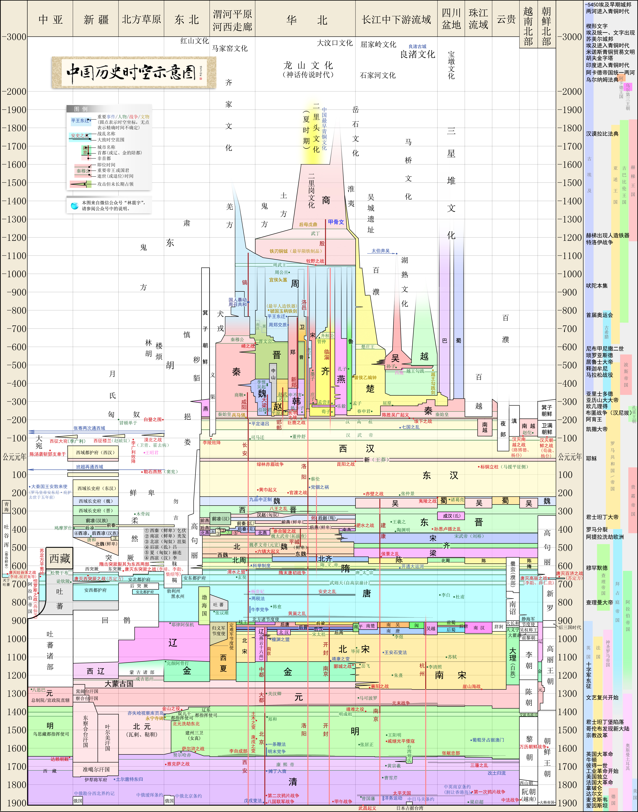
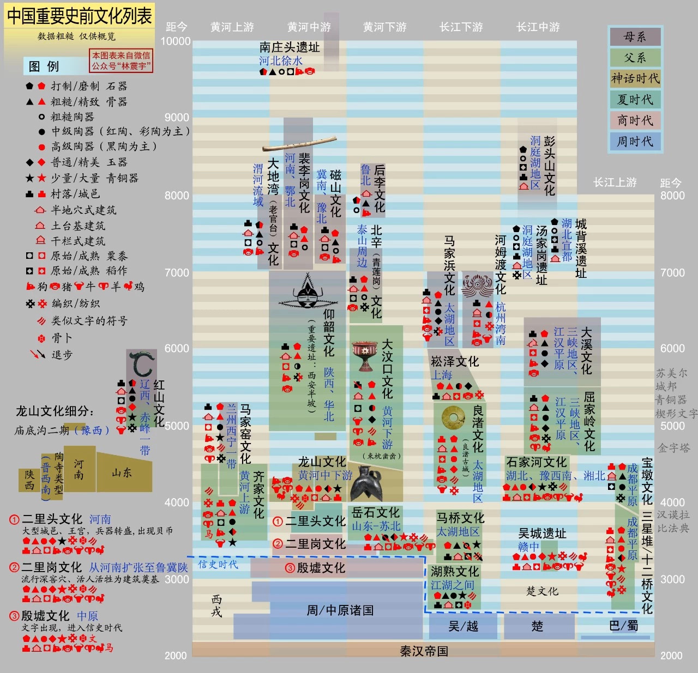
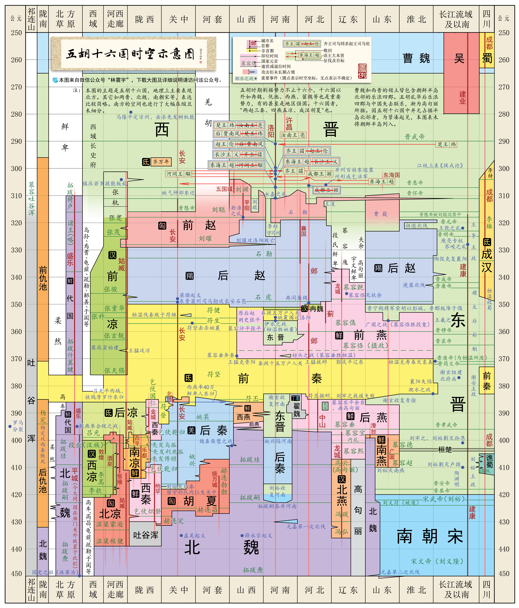
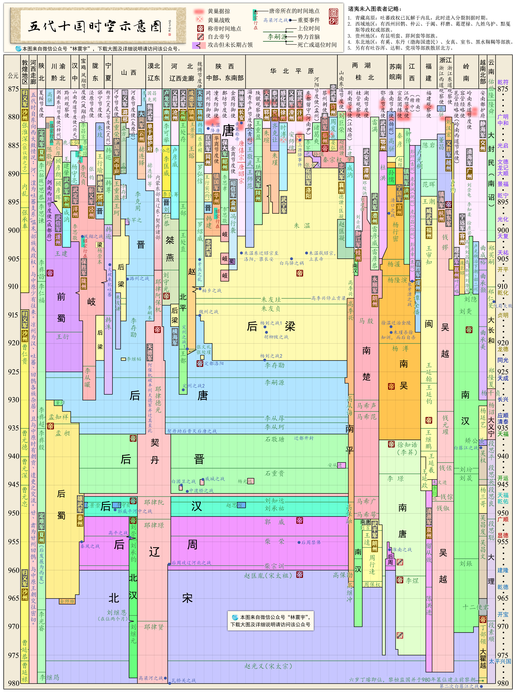

# 中华文明历史概况

[TOC]

## 资源
### 相关外部链接
↗ [Human History](../../../../../../../📜%20Human%20History/Human%20History.md)
↗ [U.S. History Overview](../../../America/United%20States%20🇺🇸/U.S.%20History%20Overview/U.S.%20History%20Overview.md)
↗ [History of Europe](../../../../../../../📜%20Human%20History/🐎%20⚓️%20🌾%20World's%20History%20-%20Dynasties%20and%20Ages/🏰%20History%20of%20Europe/History%20of%20Europe.md)
↗ [Russia History Overview](../../../Europe/Russia%20🇷🇺/📜%20Russia%20History%20Overview/Russia%20History%20Overview.md)
↗ [Japanese History Overview](../../Japan%20🇯🇵/📜%20Japanese%20History%20Overview/Japanese%20History%20Overview.md)
↗ [Korean History Overview](../../Korea%20🇰🇵%20🇰🇷/📜%20Korean%20History%20Overview/Korean%20History%20Overview.md)

↗ [Chinese Philosophy & Its History](../../../../../../../♂%20Philosophy%20&%20Its%20History/Classical%20Philosophy/Chinese%20Philosophy%20&%20Its%20History/Chinese%20Philosophy%20&%20Its%20History.md)

↗ [中国税制概况与发展历史](../中国大陆地区/🐲%20中国政治概况/中国政府与行政管理/中国中央人民政府（国务院）/中国财政%20&%20财政部/中国税制概况与发展历史.md)
↗ [中国共产党党史](../中国大陆地区/🐲%20中国政治概况/中国共产党%20(Communist%20Party%20of%20China)/中国共产党党史.md)

### 其它资源
https://mp.weixin.qq.com/s/ygwnoofUdbeX-BsYe1AB7Q
中国历朝历代时空示意图

wikipedia
- [华夏文化](https://zh.wikipedia.org/wiki/%E8%8F%AF%E5%A4%8F%E6%96%87%E5%8C%96 "华夏文化")
- [汉学](https://zh.wikipedia.org/wiki/%E6%B1%89%E5%AD%A6 "汉学")
- [中华文明](https://zh.wikipedia.org/wiki/%E4%B8%AD%E5%8D%8E%E6%96%87%E5%8C%96 "中华文化")
- [剑桥中国史](https://zh.wikipedia.org/wiki/%E5%8A%8D%E6%A9%8B%E4%B8%AD%E5%9C%8B%E5%8F%B2 "剑桥中国史")
- [中国北方与南方](https://zh.wikipedia.org/wiki/%E4%B8%AD%E5%9B%BD%E5%8C%97%E6%96%B9%E4%B8%8E%E5%8D%97%E6%96%B9 "中国北方与南方")
- [中国古都](https://zh.wikipedia.org/wiki/%E4%B8%AD%E5%9B%BD%E5%8F%A4%E9%83%BD "中国古都")
---
- [中国历史年表](https://zh.wikipedia.org/zh-cn/%E4%B8%AD%E5%9B%BD%E5%8E%86%E5%8F%B2%E5%B9%B4%E8%A1%A8#) ✅
	- **[中国历史](https://zh.wikipedia.org/wiki/%E4%B8%AD%E5%9C%8B%E6%AD%B7%E5%8F%B2 "中国历史")年表**，是依年份列出[中国历史](https://zh.wikipedia.org/wiki/%E4%B8%AD%E5%9C%8B%E6%AD%B7%E5%8F%B2 "中国历史")上的重大事件。在朝代更迭之间，执政权经常不会立即转移，朝代结束的下一年，并非代表该年份为朝代的真正起始点。
- [中国年号列表](https://zh.wikipedia.org/wiki/%E4%B8%AD%E5%9C%8B%E5%B9%B4%E8%99%9F%E5%88%97%E8%A1%A8 "中国年号列表")
- [中国制度史年表](https://zh.wikipedia.org/wiki/%E4%B8%AD%E5%9C%8B%E5%88%B6%E5%BA%A6%E5%8F%B2%E5%B9%B4%E8%A1%A8 "中国制度史年表")
- [诸侯会盟](https://zh.wikipedia.org/wiki/%E8%AF%B8%E4%BE%AF%E4%BC%9A%E7%9B%9F "诸侯会盟")
- [中国君主列表](https://zh.wikipedia.org/wiki/%E4%B8%AD%E5%9B%BD%E5%90%9B%E4%B8%BB%E5%88%97%E8%A1%A8 "中国君主列表")
- [中国公主列表](https://zh.wikipedia.org/wiki/%E4%B8%AD%E5%9C%8B%E5%85%AC%E4%B8%BB%E5%88%97%E8%A1%A8 "中国公主列表")
- [中国皇后及妃嫔列表](https://zh.wikipedia.org/wiki/%E4%B8%AD%E5%9B%BD%E7%9A%87%E5%90%8E%E5%8F%8A%E5%A6%83%E5%AB%94%E5%88%97%E8%A1%A8 "中国皇后及妃嫔列表")
- [中国宰相列表](https://zh.wikipedia.org/wiki/%E4%B8%AD%E5%9C%8B%E5%AE%B0%E7%9B%B8%E5%88%97%E8%A1%A8 "中国宰相列表")
- [中华人民共和国历史年表](https://zh.wikipedia.org/wiki/%E4%B8%AD%E5%8D%8E%E4%BA%BA%E6%B0%91%E5%85%B1%E5%92%8C%E5%9B%BD%E5%8E%86%E5%8F%B2%E5%B9%B4%E8%A1%A8 "中华人民共和国历史年表")
- [中华民国时期君主列表](https://zh.wikipedia.org/wiki/%E4%B8%AD%E8%8F%AF%E6%B0%91%E5%9C%8B%E6%99%82%E6%9C%9F%E5%90%9B%E4%B8%BB%E5%88%97%E8%A1%A8 "中华民国时期君主列表")
- [中国古代题材电视剧列表](https://zh.wikipedia.org/wiki/%E4%B8%AD%E5%9B%BD%E5%8F%A4%E4%BB%A3%E9%A2%98%E6%9D%90%E7%94%B5%E8%A7%86%E5%89%A7%E5%88%97%E8%A1%A8 "中国古代题材电视剧列表")
- [中国朝代](https://zh.wikipedia.org/wiki/%E4%B8%AD%E5%9B%BD%E6%9C%9D%E4%BB%A3 "中国朝代")
- [夏商周断代工程](https://zh.wikipedia.org/wiki/%E5%A4%8F%E5%95%86%E5%91%A8%E6%96%AD%E4%BB%A3%E5%B7%A5%E7%A8%8B "夏商周断代工程")
- [中国新石器文化列表](https://zh.wikipedia.org/wiki/%E4%B8%AD%E5%9B%BD%E6%96%B0%E7%9F%B3%E5%99%A8%E6%96%87%E5%8C%96%E5%88%97%E8%A1%A8 "中国新石器文化列表")
- [中国战争列表](https://zh.wikipedia.org/wiki/%E4%B8%AD%E5%9B%BD%E6%88%98%E4%BA%89%E5%88%97%E8%A1%A8 "中国战争列表")
- [中国地震列表](https://zh.wikipedia.org/wiki/%E4%B8%AD%E5%9B%BD%E5%9C%B0%E9%9C%87%E5%88%97%E8%A1%A8 "中国地震列表")
- [中国瘟疫史](https://zh.wikipedia.org/wiki/%E4%B8%AD%E5%9C%8B%E7%98%9F%E7%96%AB%E5%8F%B2 "中国瘟疫史")
- [中国蝗灾史](https://zh.wikipedia.org/wiki/%E4%B8%AD%E5%9C%8B%E8%9D%97%E7%81%BD%E5%8F%B2 "中国蝗灾史")
- [中国旱灾史](https://zh.wikipedia.org/wiki/%E4%B8%AD%E5%9C%8B%E6%97%B1%E7%81%BD%E5%8F%B2 "中国旱灾史")
- [中国水灾史](https://zh.wikipedia.org/wiki/%E4%B8%AD%E5%9C%8B%E6%B0%B4%E7%81%BD%E5%8F%B2 "中国水灾史")
- [中国皇帝](https://zh.wikipedia.org/wiki/%E4%B8%AD%E5%9B%BD%E7%9A%87%E5%B8%9D "中国皇帝")
- [中国君主世系图列表](https://zh.wikipedia.org/wiki/%E4%B8%AD%E5%9C%8B%E5%90%9B%E4%B8%BB%E4%B8%96%E7%B3%BB%E5%9C%96%E5%88%97%E8%A1%A8 "中国君主世系图列表")
- [中国君王诸子女列表](https://zh.wikipedia.org/wiki/%E4%B8%AD%E5%9C%8B%E5%90%9B%E7%8E%8B%E8%AB%B8%E5%AD%90%E5%A5%B3%E5%88%97%E8%A1%A8 "中国君王诸子女列表")
- [中国历史之最](https://zh.wikipedia.org/w/index.php?title=%E4%B8%AD%E5%9C%8B%E6%AD%B7%E5%8F%B2%E4%B9%8B%E6%9C%80&action=edit&redlink=1 "中国历史之最（页面不存在）")
- [中国历史人物列表](https://zh.wikipedia.org/wiki/Category:%E4%B8%AD%E5%9B%BD%E5%8E%86%E5%8F%B2%E4%BA%BA%E7%89%A9 "Category:中国历史人物")

|                                                                                                                                                                                                                                                                                                                                                                                                                                                                                                                                                                                                                                                                                                                                                                                                                                                                                                                                                                                                                                                                                                                                                                                                                                            |                                                                                                                                                                                                                                                                                                                                                                                                                                                                                                                                                                                                                                |                                                                                                                                                                                                                                                                                                                                                                                                                                               |                                                                                                                                                                                                                                                                                                                                                                                                                                                                                                                                                                                                                                                                                                                                                                                                                                                                                                                |                                                                                                                                                                                                                                                                                                                                                                                                                                                                                                                                                                                                                                                                                                                                                                                                                                                                                                                                                                       |                                                                                                                                                                                                                                                                                                                                                                                                                                                                                                                                                                                                                                                                                                                      |                                                                                                                                                                                                                                                                                                    |
| ------------------------------------------------------------------------------------------------------------------------------------------------------------------------------------------------------------------------------------------------------------------------------------------------------------------------------------------------------------------------------------------------------------------------------------------------------------------------------------------------------------------------------------------------------------------------------------------------------------------------------------------------------------------------------------------------------------------------------------------------------------------------------------------------------------------------------------------------------------------------------------------------------------------------------------------------------------------------------------------------------------------------------------------------------------------------------------------------------------------------------------------------------------------------------------------------------------------------------------------ | ------------------------------------------------------------------------------------------------------------------------------------------------------------------------------------------------------------------------------------------------------------------------------------------------------------------------------------------------------------------------------------------------------------------------------------------------------------------------------------------------------------------------------------------------------------------------------------------------------------------------------ | --------------------------------------------------------------------------------------------------------------------------------------------------------------------------------------------------------------------------------------------------------------------------------------------------------------------------------------------------------------------------------------------------------------------------------------------- | -------------------------------------------------------------------------------------------------------------------------------------------------------------------------------------------------------------------------------------------------------------------------------------------------------------------------------------------------------------------------------------------------------------------------------------------------------------------------------------------------------------------------------------------------------------------------------------------------------------------------------------------------------------------------------------------------------------------------------------------------------------------------------------------------------------------------------------------------------------------------------------------------------------- | --------------------------------------------------------------------------------------------------------------------------------------------------------------------------------------------------------------------------------------------------------------------------------------------------------------------------------------------------------------------------------------------------------------------------------------------------------------------------------------------------------------------------------------------------------------------------------------------------------------------------------------------------------------------------------------------------------------------------------------------------------------------------------------------------------------------------------------------------------------------------------------------------------------------------------------------------------------------- | -------------------------------------------------------------------------------------------------------------------------------------------------------------------------------------------------------------------------------------------------------------------------------------------------------------------------------------------------------------------------------------------------------------------------------------------------------------------------------------------------------------------------------------------------------------------------------------------------------------------------------------------------------------------------------------------------------------------- | -------------------------------------------------------------------------------------------------------------------------------------------------------------------------------------------------------------------------------------------------------------------------------------------------- |
| - [中国政治史](https://zh.wikipedia.org/wiki/%E4%B8%AD%E5%9C%8B%E6%94%BF%E6%B2%BB%E5%8F%B2 "中国政治史") - [中国政党史](https://zh.wikipedia.org/wiki/%E4%B8%AD%E5%9B%BD%E6%94%BF%E5%85%9A%E5%8F%B2 "中国政党史") - [中国近代史](https://zh.wikipedia.org/wiki/%E4%B8%AD%E5%9C%8B%E8%BF%91%E4%BB%A3%E5%8F%B2 "中国近代史") - [中国对外关系史](https://zh.wikipedia.org/wiki/%E4%B8%AD%E5%9C%8B%E5%B0%8D%E5%A4%96%E9%97%9C%E4%BF%82%E5%8F%B2 "中国对外关系史") - [中国护照史](https://zh.wikipedia.org/wiki/%E4%B8%AD%E5%9C%8B%E8%AD%B7%E7%85%A7%E5%8F%B2 "中国护照史") - [中国宗族史](https://zh.wikipedia.org/wiki/%E4%B8%AD%E5%9C%8B%E5%AE%97%E6%97%8F%E5%8F%B2 "中国宗族史") - [中国疆域史](https://zh.wikipedia.org/wiki/%E4%B8%AD%E5%9B%BD%E7%96%86%E5%9F%9F%E5%8F%B2 "中国疆域史") - [中国城市史](https://zh.wikipedia.org/wiki/%E4%B8%AD%E5%9C%8B%E5%9F%8E%E5%B8%82%E5%8F%B2 "中国城市史") - [中国驿站史](https://zh.wikipedia.org/wiki/%E4%B8%AD%E5%9C%8B%E9%A9%9B%E7%AB%99%E5%8F%B2 "中国驿站史") - [中国邮政史](https://zh.wikipedia.org/wiki/%E4%B8%AD%E5%9C%8B%E9%83%B5%E6%94%BF%E5%8F%B2 "中国邮政史") - [中国法制史](https://zh.wikipedia.org/wiki/%E4%B8%AD%E5%9C%8B%E6%B3%95%E5%88%B6%E5%8F%B2 "中国法制史") - [中国军事史](https://zh.wikipedia.org/wiki/%E4%B8%AD%E5%9B%BD%E5%86%9B%E4%BA%8B%E5%8F%B2 "中国军事史") | - [中国经济史](https://zh.wikipedia.org/wiki/%E4%B8%AD%E5%9B%BD%E7%BB%8F%E6%B5%8E%E5%8F%B2 "中国经济史") - [中国土地兼并史](https://zh.wikipedia.org/wiki/%E4%B8%AD%E5%9C%8B%E5%9C%9F%E5%9C%B0%E5%85%BC%E4%BD%B5%E5%8F%B2 "中国土地兼并史") - [中国证券史](https://zh.wikipedia.org/wiki/%E4%B8%AD%E5%9B%BD%E8%AF%81%E5%88%B8%E5%8F%B2 "中国证券史") - [中国通商史](https://zh.wikipedia.org/wiki/%E4%B8%AD%E5%9B%BD%E9%80%9A%E5%95%86%E5%8F%B2 "中国通商史") - [中国盐业史](https://zh.wikipedia.org/wiki/%E4%B8%AD%E5%9C%8B%E9%B9%BD%E6%A5%AD%E5%8F%B2 "中国盐业史") - [中国水利史](https://zh.wikipedia.org/wiki/%E4%B8%AD%E5%9C%8B%E6%B0%B4%E5%88%A9%E5%8F%B2 "中国水利史") | - [中国科技史](https://zh.wikipedia.org/wiki/%E4%B8%AD%E5%9B%BD%E7%A7%91%E5%AD%A6%E6%8A%80%E6%9C%AF%E7%AE%80%E5%8F%B2 "中国科学技术简史") - [中国天文学史](https://zh.wikipedia.org/wiki/%E4%B8%AD%E5%9B%BD%E5%A4%A9%E6%96%87%E5%AD%A6%E5%8F%B2 "中国天文学史") - [中国医学史](https://zh.wikipedia.org/wiki/%E4%B8%AD%E5%9C%8B%E9%86%AB%E5%AD%B8%E5%8F%B2 "中国医学史") - [中国化学史](https://zh.wikipedia.org/wiki/%E4%B8%AD%E5%9B%BD%E5%8C%96%E5%AD%A6%E5%8F%B2 "中国化学史") | - [中国文化史](https://zh.wikipedia.org/wiki/%E4%B8%AD%E5%9C%8B%E6%96%87%E5%8C%96%E5%8F%B2 "中国文化史") - [中国教育史](https://zh.wikipedia.org/wiki/%E4%B8%AD%E5%9B%BD%E6%95%99%E8%82%B2%E5%8F%B2 "中国教育史") - [中国藏书史](https://zh.wikipedia.org/wiki/%E4%B8%AD%E5%9C%8B%E8%97%8F%E6%9B%B8%E5%8F%B2 "中国藏书史") - [中国史学史](https://zh.wikipedia.org/wiki/%E4%B8%AD%E5%9B%BD%E5%8F%B2%E5%AD%A6%E5%8F%B2 "中国史学史") - [中国新闻史](https://zh.wikipedia.org/wiki/%E4%B8%AD%E5%9B%BD%E6%96%B0%E9%97%BB%E5%8F%B2 "中国新闻史") - [中国文学史](https://zh.wikipedia.org/wiki/%E4%B8%AD%E5%9B%BD%E6%96%87%E5%AD%A6%E5%8F%B2 "中国文学史") - [中国书法史](https://zh.wikipedia.org/wiki/%E4%B8%AD%E5%9B%BD%E4%B9%A6%E6%B3%95%E5%8F%B2 "中国书法史") - [中国艺术史](https://zh.wikipedia.org/wiki/%E4%B8%AD%E5%9B%BD%E7%BE%8E%E6%9C%AF%E5%8F%B2 "中国美术史") - [中国体育史](https://zh.wikipedia.org/wiki/%E4%B8%AD%E5%9C%8B%E9%AB%94%E8%82%B2%E5%8F%B2 "中国体育史") | - [中国慈善事业史](https://zh.wikipedia.org/wiki/%E4%B8%AD%E5%9C%8B%E6%85%88%E5%96%84%E4%BA%8B%E6%A5%AD%E5%8F%B2 "中国慈善事业史") - [中国人口史](https://zh.wikipedia.org/wiki/%E4%B8%AD%E5%9B%BD%E4%BA%BA%E5%8F%A3%E5%8F%B2 "中国人口史") - [中国乞丐史](https://zh.wikipedia.org/wiki/%E4%B8%AD%E5%9C%8B%E4%B9%9E%E4%B8%90%E5%8F%B2 "中国乞丐史") - [中国流寇史](https://zh.wikipedia.org/wiki/%E4%B8%AD%E5%9C%8B%E6%B5%81%E5%AF%87%E5%8F%B2 "中国流寇史") - [中国同性恋史](https://zh.wikipedia.org/wiki/%E4%B8%AD%E5%9C%8B%E5%90%8C%E6%80%A7%E6%88%80%E5%8F%B2 "中国同性恋史") - [中国妇女生活史](https://zh.wikipedia.org/wiki/%E4%B8%AD%E5%9C%8B%E5%A9%A6%E5%A5%B3%E7%94%9F%E6%B4%BB%E5%8F%B2 "中国妇女生活史") - [中国娼妓史](https://zh.wikipedia.org/wiki/%E4%B8%AD%E5%9C%8B%E5%A8%BC%E5%A6%93%E5%8F%B2 "中国娼妓史") - [中国生殉史](https://zh.wikipedia.org/wiki/%E4%B8%AD%E5%9C%8B%E7%94%9F%E6%AE%89%E5%8F%B2 "中国生殉史") - [中国盗墓史](https://zh.wikipedia.org/wiki/%E4%B8%AD%E5%9C%8B%E7%9B%9C%E5%A2%93%E5%8F%B2 "中国盗墓史") | - [中国环境史](https://zh.wikipedia.org/wiki/%E4%B8%AD%E5%9C%8B%E7%92%B0%E5%A2%83%E5%8F%B2 "中国环境史") - [中国荒政史](https://zh.wikipedia.org/wiki/%E4%B8%AD%E5%9C%8B%E8%8D%92%E6%94%BF%E5%8F%B2 "中国荒政史") - [中国地震史](https://zh.wikipedia.org/wiki/%E4%B8%AD%E5%9B%BD%E5%9C%B0%E9%9C%87%E5%88%97%E8%A1%A8 "中国地震列表") - [中国旱灾史](https://zh.wikipedia.org/wiki/%E4%B8%AD%E5%9C%8B%E6%97%B1%E7%81%BD%E5%8F%B2 "中国旱灾史") - [中国水灾史](https://zh.wikipedia.org/wiki/%E4%B8%AD%E5%9C%8B%E6%B0%B4%E7%81%BD%E5%8F%B2 "中国水灾史") - [中国蝗灾史](https://zh.wikipedia.org/wiki/%E4%B8%AD%E5%9C%8B%E8%9D%97%E7%81%BD%E5%8F%B2 "中国蝗灾史") - [中国瘟疫史](https://zh.wikipedia.org/wiki/%E4%B8%AD%E5%9C%8B%E7%98%9F%E7%96%AB%E5%8F%B2 "中国瘟疫史") | - [中国思想史](https://zh.wikipedia.org/wiki/%E4%B8%AD%E5%9B%BD%E6%80%9D%E6%83%B3%E5%8F%B2 "中国思想史") - [中国哲学史](https://zh.wikipedia.org/wiki/%E4%B8%AD%E5%9B%BD%E5%93%B2%E5%AD%A6%E5%8F%B2 "中国哲学史") - [中国逻辑史](https://zh.wikipedia.org/wiki/%E4%B8%AD%E5%9B%BD%E9%80%BB%E8%BE%91%E5%8F%B2 "中国逻辑史") |

| 20世紀至今各年[中國](https://zh.wikipedia.org/wiki/%E4%B8%AD%E5%9C%8B "中國")（[大陸](https://zh.wikipedia.org/wiki/%E4%B8%AD%E5%9B%BD%E5%A4%A7%E9%99%86 "中国大陆")） |                                                                                                                                                                                                                                                                                                                                                                                                                                                                                                                                                                                                                                                                                                                                                                                                                                                                                                                                                                                                                                                                                                                                                                                                                                                                                                                                                                                                                                                                                                                                                                                                                                                                                                                                                                                                                                                                                                                                                                                                                                                                                                                                                                                                                                                                                                                                                                                                                                                                                                                                                                                                                                                                                                                                                                                                                                                                                                                                                                                                                                                                                                                                                                                                                                                                                                                                                                                                                                                                                                                                                                                                                                                                                                                                                                                                                                                                                                                                                                                                                                                                                                                                                                                                                                                                                                                                                                                                                                                                                                                                                                                                                                                                                                                                                                                                                                                                                                                                                                                                                                                                                                                                                                                                                                                                                                                                                                                                                                                                                                                                                                                                                                                                                                                                                                                                                                                                                                                                                                                                                                                                                                                                                                                                                                                                                                                                                                                                                                                                                                                                                                                                                                                                                                                                                                                                                                                                                                                                                                                                                                                                                                                                                                                                                                                                                                                                                                                                                                                                                                                                                                                                                                                                                                                                                                                                                                                                                                                                                                                                                                                                                                                                                                                                                                                                                                                                                                                                                                                                                                                                                                                                                                                                                                                                                                                                                                                                                                                                                                                                                                                                                                                                                                                                                                                                                                                                                                                                                                                                                                                                                                                                                                                                                                                                                                                                                                                                                                                                                                                                                                                                                                                                                                                                                                                                                                                                                                                                                                                                                                                                                                                                                                                                                                                                                                                                                                                                                                                                                                                                                                                                                                                                                                                                                                                                                                                                                                                                                                                                                                                                                                                                                                                                                                                                                                                                                                                                                                                                                                                                                                                                                                                                                                                 |
| ---------------------------------------------------------------------------------------------------------------------------------------------------- | ------------------------------------------------------------------------------------------------------------------------------------------------------------------------------------------------------------------------------------------------------------------------------------------------------------------------------------------------------------------------------------------------------------------------------------------------------------------------------------------------------------------------------------------------------------------------------------------------------------------------------------------------------------------------------------------------------------------------------------------------------------------------------------------------------------------------------------------------------------------------------------------------------------------------------------------------------------------------------------------------------------------------------------------------------------------------------------------------------------------------------------------------------------------------------------------------------------------------------------------------------------------------------------------------------------------------------------------------------------------------------------------------------------------------------------------------------------------------------------------------------------------------------------------------------------------------------------------------------------------------------------------------------------------------------------------------------------------------------------------------------------------------------------------------------------------------------------------------------------------------------------------------------------------------------------------------------------------------------------------------------------------------------------------------------------------------------------------------------------------------------------------------------------------------------------------------------------------------------------------------------------------------------------------------------------------------------------------------------------------------------------------------------------------------------------------------------------------------------------------------------------------------------------------------------------------------------------------------------------------------------------------------------------------------------------------------------------------------------------------------------------------------------------------------------------------------------------------------------------------------------------------------------------------------------------------------------------------------------------------------------------------------------------------------------------------------------------------------------------------------------------------------------------------------------------------------------------------------------------------------------------------------------------------------------------------------------------------------------------------------------------------------------------------------------------------------------------------------------------------------------------------------------------------------------------------------------------------------------------------------------------------------------------------------------------------------------------------------------------------------------------------------------------------------------------------------------------------------------------------------------------------------------------------------------------------------------------------------------------------------------------------------------------------------------------------------------------------------------------------------------------------------------------------------------------------------------------------------------------------------------------------------------------------------------------------------------------------------------------------------------------------------------------------------------------------------------------------------------------------------------------------------------------------------------------------------------------------------------------------------------------------------------------------------------------------------------------------------------------------------------------------------------------------------------------------------------------------------------------------------------------------------------------------------------------------------------------------------------------------------------------------------------------------------------------------------------------------------------------------------------------------------------------------------------------------------------------------------------------------------------------------------------------------------------------------------------------------------------------------------------------------------------------------------------------------------------------------------------------------------------------------------------------------------------------------------------------------------------------------------------------------------------------------------------------------------------------------------------------------------------------------------------------------------------------------------------------------------------------------------------------------------------------------------------------------------------------------------------------------------------------------------------------------------------------------------------------------------------------------------------------------------------------------------------------------------------------------------------------------------------------------------------------------------------------------------------------------------------------------------------------------------------------------------------------------------------------------------------------------------------------------------------------------------------------------------------------------------------------------------------------------------------------------------------------------------------------------------------------------------------------------------------------------------------------------------------------------------------------------------------------------------------------------------------------------------------------------------------------------------------------------------------------------------------------------------------------------------------------------------------------------------------------------------------------------------------------------------------------------------------------------------------------------------------------------------------------------------------------------------------------------------------------------------------------------------------------------------------------------------------------------------------------------------------------------------------------------------------------------------------------------------------------------------------------------------------------------------------------------------------------------------------------------------------------------------------------------------------------------------------------------------------------------------------------------------------------------------------------------------------------------------------------------------------------------------------------------------------------------------------------------------------------------------------------------------------------------------------------------------------------------------------------------------------------------------------------------------------------------------------------------------------------------------------------------------------------------------------------------------------------------------------------------------------------------------------------------------------------------------------------------------------------------------------------------------------------------------------------------------------------------------------------------------------------------------------------------------------------------------------------------------------------------------------------------------------------------------------------------------------------------------------------------------------------------------------------------------------------------------------------------------------------------------------------------------------------------------------------------------------------------------------------------------------------------------------------------------------------------------------------------------------------------------------------------------------------------------------------------------------------------------------------------------------------------------------------------------------------------------------------------------------------------------------------------------------------------------------------------------------------------------------------------------------------------------------------------------------------------------------------------------------------------------------------------------------------------------------------------------------------------------------------------------------------------------------------------------------------------------------------------------------------------------------------------------------------------------------------------------------------------------------------------------------------------------------------------------------------------------------------------------------------------------------------------------------------------------------------------------------------------------------------------------------------------------------------------------------------------------------------------------------------------------------------------------------------------------------------------------------------------------------------------------------------------------------------------------------------------------------------------------------------------------------------------------------------------------------------------------------------------------------------------------------------------------------------------------------------------------------------------------------------------------------------------------------------------------------------------------------------------------------------------------------------------------------------------------------------------------------------------------------------------------------------------------------------------------------------------------------------------------------------------------------------------------------------------------------------------------------------------------------------------------------------------------------------------------------------------------------------------------------------------------------------------------------------------------------------------------------------------------------------------------------------------------------------------------------------------------------------------------------------------------------------------------------------------------------------------------------------------------------------------------------- |
| 20世紀                                                                                                                                                 | \|   \|   \| \|---\|---\| \|[1900年代](https://zh.wikipedia.org/wiki/1900%E5%B9%B4%E4%BB%A3%E4%B8%AD%E5%9B%BD "1900年代中国")\|- [1900年](https://zh.wikipedia.org/w/index.php?title=1900%E5%B9%B4%E4%B8%AD%E5%9C%8B&action=edit&redlink=1 "1900年中國（页面不存在）") - [1901年](https://zh.wikipedia.org/w/index.php?title=1901%E5%B9%B4%E4%B8%AD%E5%9C%8B&action=edit&redlink=1 "1901年中國（页面不存在）") - [1902年](https://zh.wikipedia.org/w/index.php?title=1902%E5%B9%B4%E4%B8%AD%E5%9C%8B&action=edit&redlink=1 "1902年中國（页面不存在）") - [1903年](https://zh.wikipedia.org/w/index.php?title=1903%E5%B9%B4%E4%B8%AD%E5%9C%8B&action=edit&redlink=1 "1903年中國（页面不存在）") - [1904年](https://zh.wikipedia.org/w/index.php?title=1904%E5%B9%B4%E4%B8%AD%E5%9C%8B&action=edit&redlink=1 "1904年中國（页面不存在）") - [1905年](https://zh.wikipedia.org/wiki/1905%E5%B9%B4%E4%B8%AD%E5%9B%BD "1905年中国") - [1906年](https://zh.wikipedia.org/wiki/1906%E5%B9%B4%E4%B8%AD%E5%9B%BD "1906年中国") - [1907年](https://zh.wikipedia.org/wiki/1907%E5%B9%B4%E4%B8%AD%E5%9B%BD "1907年中国") - [1908年](https://zh.wikipedia.org/wiki/1908%E5%B9%B4%E4%B8%AD%E5%9B%BD "1908年中国") - [1909年](https://zh.wikipedia.org/wiki/1909%E5%B9%B4%E4%B8%AD%E5%9B%BD "1909年中国")\| \|[1910年代](https://zh.wikipedia.org/wiki/1910%E5%B9%B4%E4%BB%A3%E4%B8%AD%E5%9B%BD "1910年代中国")\|- [1910年](https://zh.wikipedia.org/wiki/1910%E5%B9%B4%E4%B8%AD%E5%9B%BD "1910年中国") - [1911年](https://zh.wikipedia.org/wiki/1911%E5%B9%B4%E4%B8%AD%E5%9B%BD "1911年中国") - [1912年](https://zh.wikipedia.org/wiki/1912%E5%B9%B4%E4%B8%AD%E5%9B%BD "1912年中国") - [1913年](https://zh.wikipedia.org/w/index.php?title=1913%E5%B9%B4%E4%B8%AD%E5%9C%8B&action=edit&redlink=1 "1913年中國（页面不存在）") - [1914年](https://zh.wikipedia.org/w/index.php?title=1914%E5%B9%B4%E4%B8%AD%E5%9C%8B&action=edit&redlink=1 "1914年中國（页面不存在）") - [1915年](https://zh.wikipedia.org/w/index.php?title=1915%E5%B9%B4%E4%B8%AD%E5%9C%8B&action=edit&redlink=1 "1915年中國（页面不存在）") - [1916年](https://zh.wikipedia.org/wiki/1916%E5%B9%B4%E4%B8%AD%E5%9B%BD "1916年中国") - [1917年](https://zh.wikipedia.org/wiki/1917%E5%B9%B4%E4%B8%AD%E5%9B%BD "1917年中国") - [1918年](https://zh.wikipedia.org/wiki/1918%E5%B9%B4%E4%B8%AD%E5%9B%BD "1918年中国") - [1919年](https://zh.wikipedia.org/wiki/1919%E5%B9%B4%E4%B8%AD%E5%9B%BD "1919年中国")\| \|[1920年代](https://zh.wikipedia.org/wiki/1920%E5%B9%B4%E4%BB%A3%E4%B8%AD%E5%9B%BD "1920年代中国")\|- [1920年](https://zh.wikipedia.org/wiki/1920%E5%B9%B4%E4%B8%AD%E5%9B%BD "1920年中国") - [1921年](https://zh.wikipedia.org/wiki/1921%E5%B9%B4%E4%B8%AD%E5%9B%BD "1921年中国") - [1922年](https://zh.wikipedia.org/wiki/1922%E5%B9%B4%E4%B8%AD%E5%9B%BD "1922年中国") - [1923年](https://zh.wikipedia.org/wiki/1923%E5%B9%B4%E4%B8%AD%E5%9B%BD "1923年中国") - [1924年](https://zh.wikipedia.org/wiki/1924%E5%B9%B4%E4%B8%AD%E5%9B%BD "1924年中国") - [1925年](https://zh.wikipedia.org/wiki/1925%E5%B9%B4%E4%B8%AD%E5%9B%BD "1925年中国") - [1926年](https://zh.wikipedia.org/wiki/1926%E5%B9%B4%E4%B8%AD%E5%9B%BD "1926年中国") - [1927年](https://zh.wikipedia.org/wiki/1927%E5%B9%B4%E4%B8%AD%E5%9B%BD "1927年中国") - [1928年](https://zh.wikipedia.org/wiki/1928%E5%B9%B4%E4%B8%AD%E5%9B%BD "1928年中国") - [1929年](https://zh.wikipedia.org/wiki/1929%E5%B9%B4%E4%B8%AD%E5%9B%BD "1929年中国")\| \|[1930年代](https://zh.wikipedia.org/wiki/1930%E5%B9%B4%E4%BB%A3%E4%B8%AD%E5%9B%BD "1930年代中国")\|- [1930年](https://zh.wikipedia.org/wiki/1930%E5%B9%B4%E4%B8%AD%E5%9B%BD "1930年中国") - [1931年](https://zh.wikipedia.org/wiki/1931%E5%B9%B4%E4%B8%AD%E5%9B%BD "1931年中国") - [1932年](https://zh.wikipedia.org/wiki/1932%E5%B9%B4%E4%B8%AD%E5%9B%BD "1932年中国") - [1933年](https://zh.wikipedia.org/wiki/1933%E5%B9%B4%E4%B8%AD%E5%9B%BD "1933年中国") - [1934年](https://zh.wikipedia.org/wiki/1934%E5%B9%B4%E4%B8%AD%E5%9B%BD "1934年中国") - [1935年](https://zh.wikipedia.org/wiki/1935%E5%B9%B4%E4%B8%AD%E5%9B%BD "1935年中国") - [1936年](https://zh.wikipedia.org/wiki/1936%E5%B9%B4%E4%B8%AD%E5%9B%BD "1936年中国") - [1937年](https://zh.wikipedia.org/wiki/1937%E5%B9%B4%E4%B8%AD%E5%9B%BD "1937年中国") - [1938年](https://zh.wikipedia.org/wiki/1938%E5%B9%B4%E4%B8%AD%E5%9B%BD "1938年中国") - [1939年](https://zh.wikipedia.org/wiki/1939%E5%B9%B4%E4%B8%AD%E5%9B%BD "1939年中国")\| \|[1940年代](https://zh.wikipedia.org/wiki/1940%E5%B9%B4%E4%BB%A3%E4%B8%AD%E5%9B%BD "1940年代中国")\|- [1940年](https://zh.wikipedia.org/wiki/1940%E5%B9%B4%E4%B8%AD%E5%9B%BD "1940年中国") - [1941年](https://zh.wikipedia.org/wiki/1941%E5%B9%B4%E4%B8%AD%E5%9B%BD "1941年中国") - [1942年](https://zh.wikipedia.org/wiki/1942%E5%B9%B4%E4%B8%AD%E5%9B%BD "1942年中国") - [1943年](https://zh.wikipedia.org/wiki/1943%E5%B9%B4%E4%B8%AD%E5%9B%BD "1943年中国") - [1944年](https://zh.wikipedia.org/wiki/1944%E5%B9%B4%E4%B8%AD%E5%9B%BD "1944年中国") - [1945年](https://zh.wikipedia.org/wiki/1945%E5%B9%B4%E4%B8%AD%E5%9B%BD "1945年中国") - [1946年](https://zh.wikipedia.org/wiki/1946%E5%B9%B4%E4%B8%AD%E5%9B%BD "1946年中国") - [1947年](https://zh.wikipedia.org/wiki/1947%E5%B9%B4%E4%B8%AD%E5%9B%BD "1947年中国") - [1948年](https://zh.wikipedia.org/wiki/1948%E5%B9%B4%E4%B8%AD%E5%9B%BD "1948年中国") - [1949年](https://zh.wikipedia.org/wiki/1949%E5%B9%B4%E4%B8%AD%E5%9C%8B "1949年中國")\| \|[1950年代](https://zh.wikipedia.org/w/index.php?title=1950%E5%B9%B4%E4%BB%A3%E4%B8%AD%E5%9C%8B%E5%A4%A7%E9%99%B8&action=edit&redlink=1 "1950年代中國大陸（页面不存在）")\|- [1950年](https://zh.wikipedia.org/wiki/1950%E5%B9%B4%E4%B8%AD%E5%9B%BD%E5%A4%A7%E9%99%86 "1950年中国大陆") - [1951年](https://zh.wikipedia.org/wiki/1951%E5%B9%B4%E4%B8%AD%E5%9B%BD%E5%A4%A7%E9%99%86 "1951年中国大陆") - [1952年](https://zh.wikipedia.org/wiki/1952%E5%B9%B4%E4%B8%AD%E5%9B%BD%E5%A4%A7%E9%99%86 "1952年中国大陆") - [1953年](https://zh.wikipedia.org/wiki/1953%E5%B9%B4%E4%B8%AD%E5%9B%BD%E5%A4%A7%E9%99%86 "1953年中国大陆") - [1954年](https://zh.wikipedia.org/wiki/1954%E5%B9%B4%E4%B8%AD%E5%9B%BD%E5%A4%A7%E9%99%86 "1954年中国大陆") - [1955年](https://zh.wikipedia.org/wiki/1955%E5%B9%B4%E4%B8%AD%E5%9B%BD%E5%A4%A7%E9%99%86 "1955年中国大陆") - [1956年](https://zh.wikipedia.org/wiki/1956%E5%B9%B4%E4%B8%AD%E5%9B%BD%E5%A4%A7%E9%99%86 "1956年中国大陆") - [1957年](https://zh.wikipedia.org/wiki/1957%E5%B9%B4%E4%B8%AD%E5%9B%BD%E5%A4%A7%E9%99%86 "1957年中国大陆") - [1958年](https://zh.wikipedia.org/wiki/1958%E5%B9%B4%E4%B8%AD%E5%9B%BD%E5%A4%A7%E9%99%86 "1958年中国大陆") - [1959年](https://zh.wikipedia.org/wiki/1959%E5%B9%B4%E4%B8%AD%E5%9B%BD%E5%A4%A7%E9%99%86 "1959年中国大陆")\| \|[1960年代](https://zh.wikipedia.org/w/index.php?title=1960%E5%B9%B4%E4%BB%A3%E4%B8%AD%E5%9C%8B%E5%A4%A7%E9%99%B8&action=edit&redlink=1 "1960年代中國大陸（页面不存在）")\|- [1960年](https://zh.wikipedia.org/w/index.php?title=1960%E5%B9%B4%E4%B8%AD%E5%9C%8B%E5%A4%A7%E9%99%B8&action=edit&redlink=1 "1960年中國大陸（页面不存在）") - [1961年](https://zh.wikipedia.org/wiki/1961%E5%B9%B4%E4%B8%AD%E5%9B%BD%E5%A4%A7%E9%99%86 "1961年中国大陆") - [1962年](https://zh.wikipedia.org/w/index.php?title=1962%E5%B9%B4%E4%B8%AD%E5%9C%8B%E5%A4%A7%E9%99%B8&action=edit&redlink=1 "1962年中國大陸（页面不存在）") - [1963年](https://zh.wikipedia.org/w/index.php?title=1963%E5%B9%B4%E4%B8%AD%E5%9C%8B%E5%A4%A7%E9%99%B8&action=edit&redlink=1 "1963年中國大陸（页面不存在）") - [1964年](https://zh.wikipedia.org/wiki/1964%E5%B9%B4%E4%B8%AD%E5%9B%BD%E5%A4%A7%E9%99%86 "1964年中国大陆") - [1965年](https://zh.wikipedia.org/w/index.php?title=1965%E5%B9%B4%E4%B8%AD%E5%9C%8B%E5%A4%A7%E9%99%B8&action=edit&redlink=1 "1965年中國大陸（页面不存在）") - [1966年](https://zh.wikipedia.org/w/index.php?title=1966%E5%B9%B4%E4%B8%AD%E5%9C%8B%E5%A4%A7%E9%99%B8&action=edit&redlink=1 "1966年中國大陸（页面不存在）") - [1967年](https://zh.wikipedia.org/w/index.php?title=1967%E5%B9%B4%E4%B8%AD%E5%9C%8B%E5%A4%A7%E9%99%B8&action=edit&redlink=1 "1967年中國大陸（页面不存在）") - [1968年](https://zh.wikipedia.org/wiki/1968%E5%B9%B4%E4%B8%AD%E5%9B%BD%E5%A4%A7%E9%99%86 "1968年中国大陆") - [1969年](https://zh.wikipedia.org/w/index.php?title=1969%E5%B9%B4%E4%B8%AD%E5%9C%8B%E5%A4%A7%E9%99%B8&action=edit&redlink=1 "1969年中國大陸（页面不存在）")\| \|[1970年代](https://zh.wikipedia.org/w/index.php?title=1970%E5%B9%B4%E4%BB%A3%E4%B8%AD%E5%9C%8B%E5%A4%A7%E9%99%B8&action=edit&redlink=1 "1970年代中國大陸（页面不存在）")\|- [1970年](https://zh.wikipedia.org/w/index.php?title=1970%E5%B9%B4%E4%B8%AD%E5%9C%8B%E5%A4%A7%E9%99%B8&action=edit&redlink=1 "1970年中國大陸（页面不存在）") - [1971年](https://zh.wikipedia.org/w/index.php?title=1971%E5%B9%B4%E4%B8%AD%E5%9C%8B%E5%A4%A7%E9%99%B8&action=edit&redlink=1 "1971年中國大陸（页面不存在）") - [1972年](https://zh.wikipedia.org/w/index.php?title=1972%E5%B9%B4%E4%B8%AD%E5%9C%8B%E5%A4%A7%E9%99%B8&action=edit&redlink=1 "1972年中國大陸（页面不存在）") - [1973年](https://zh.wikipedia.org/wiki/1973%E5%B9%B4%E4%B8%AD%E5%9B%BD%E5%A4%A7%E9%99%86 "1973年中国大陆") - [1974年](https://zh.wikipedia.org/wiki/1974%E5%B9%B4%E4%B8%AD%E5%9B%BD%E5%A4%A7%E9%99%86 "1974年中国大陆") - [1975年](https://zh.wikipedia.org/w/index.php?title=1975%E5%B9%B4%E4%B8%AD%E5%9C%8B%E5%A4%A7%E9%99%B8&action=edit&redlink=1 "1975年中國大陸（页面不存在）") - [1976年](https://zh.wikipedia.org/wiki/1976%E5%B9%B4%E4%B8%AD%E5%9B%BD%E5%A4%A7%E9%99%86 "1976年中国大陆") - [1977年](https://zh.wikipedia.org/w/index.php?title=1977%E5%B9%B4%E4%B8%AD%E5%9C%8B%E5%A4%A7%E9%99%B8&action=edit&redlink=1 "1977年中國大陸（页面不存在）") - [1978年](https://zh.wikipedia.org/w/index.php?title=1978%E5%B9%B4%E4%B8%AD%E5%9C%8B%E5%A4%A7%E9%99%B8&action=edit&redlink=1 "1978年中國大陸（页面不存在）") - [1979年](https://zh.wikipedia.org/wiki/1979%E5%B9%B4%E4%B8%AD%E5%9B%BD%E5%A4%A7%E9%99%86 "1979年中国大陆")\| \|[1980年代](https://zh.wikipedia.org/w/index.php?title=1980%E5%B9%B4%E4%BB%A3%E4%B8%AD%E5%9C%8B%E5%A4%A7%E9%99%B8&action=edit&redlink=1 "1980年代中國大陸（页面不存在）")\|- 1980年 - [1981年](https://zh.wikipedia.org/wiki/1981%E5%B9%B4%E4%B8%AD%E5%9B%BD%E5%A4%A7%E9%99%86 "1981年中国大陆") - [1982年](https://zh.wikipedia.org/wiki/1982%E5%B9%B4%E4%B8%AD%E5%9B%BD%E5%A4%A7%E9%99%86 "1982年中国大陆") - [1983年](https://zh.wikipedia.org/wiki/1983%E5%B9%B4%E4%B8%AD%E5%9B%BD%E5%A4%A7%E9%99%86 "1983年中国大陆") - [1984年](https://zh.wikipedia.org/wiki/1984%E5%B9%B4%E4%B8%AD%E5%9B%BD%E5%A4%A7%E9%99%86 "1984年中国大陆") - [1985年](https://zh.wikipedia.org/wiki/1985%E5%B9%B4%E4%B8%AD%E5%9B%BD%E5%A4%A7%E9%99%86 "1985年中国大陆") - [1986年](https://zh.wikipedia.org/wiki/1986%E5%B9%B4%E4%B8%AD%E5%9B%BD%E5%A4%A7%E9%99%86 "1986年中国大陆") - [1987年](https://zh.wikipedia.org/wiki/1987%E5%B9%B4%E4%B8%AD%E5%9B%BD%E5%A4%A7%E9%99%86 "1987年中国大陆") - [1988年](https://zh.wikipedia.org/wiki/1988%E5%B9%B4%E4%B8%AD%E5%9B%BD%E5%A4%A7%E9%99%86 "1988年中国大陆") - [1989年](https://zh.wikipedia.org/wiki/1989%E5%B9%B4%E4%B8%AD%E5%9B%BD%E5%A4%A7%E9%99%86 "1989年中国大陆")\| \|[1990年代](https://zh.wikipedia.org/w/index.php?title=1990%E5%B9%B4%E4%BB%A3%E4%B8%AD%E5%9C%8B%E5%A4%A7%E9%99%B8&action=edit&redlink=1 "1990年代中國大陸（页面不存在）")\|- [1990年](https://zh.wikipedia.org/wiki/1990%E5%B9%B4%E4%B8%AD%E5%9B%BD%E5%A4%A7%E9%99%86 "1990年中国大陆") - [1991年](https://zh.wikipedia.org/wiki/1991%E5%B9%B4%E4%B8%AD%E5%9B%BD%E5%A4%A7%E9%99%86 "1991年中国大陆") - [1992年](https://zh.wikipedia.org/wiki/1992%E5%B9%B4%E4%B8%AD%E5%9B%BD%E5%A4%A7%E9%99%86 "1992年中国大陆") - [1993年](https://zh.wikipedia.org/wiki/1993%E5%B9%B4%E4%B8%AD%E5%9B%BD%E5%A4%A7%E9%99%86 "1993年中国大陆") - [1994年](https://zh.wikipedia.org/wiki/1994%E5%B9%B4%E4%B8%AD%E5%9B%BD%E5%A4%A7%E9%99%86 "1994年中国大陆") - [1995年](https://zh.wikipedia.org/wiki/1995%E5%B9%B4%E4%B8%AD%E5%9B%BD%E5%A4%A7%E9%99%86 "1995年中国大陆") - [1996年](https://zh.wikipedia.org/wiki/1996%E5%B9%B4%E4%B8%AD%E5%9B%BD%E5%A4%A7%E9%99%86 "1996年中国大陆") - [1997年](https://zh.wikipedia.org/wiki/1997%E5%B9%B4%E4%B8%AD%E5%9B%BD%E5%A4%A7%E9%99%86 "1997年中国大陆") - [1998年](https://zh.wikipedia.org/wiki/1998%E5%B9%B4%E4%B8%AD%E5%9B%BD%E5%A4%A7%E9%99%86 "1998年中国大陆") - [1999年](https://zh.wikipedia.org/wiki/1999%E5%B9%B4%E4%B8%AD%E5%9B%BD%E5%A4%A7%E9%99%86 "1999年中国大陆")\| |
| 21世紀                                                                                                                                                 | \|   \|   \| \|---\|---\| \|[2000年代](https://zh.wikipedia.org/w/index.php?title=2000%E5%B9%B4%E4%BB%A3%E4%B8%AD%E5%9C%8B%E5%A4%A7%E9%99%B8&action=edit&redlink=1 "2000年代中國大陸（页面不存在）")\|- [2000年](https://zh.wikipedia.org/wiki/2000%E5%B9%B4%E4%B8%AD%E5%9B%BD%E5%A4%A7%E9%99%86 "2000年中国大陆") - [2001年](https://zh.wikipedia.org/wiki/2001%E5%B9%B4%E4%B8%AD%E5%9B%BD%E5%A4%A7%E9%99%86 "2001年中国大陆") - [2002年](https://zh.wikipedia.org/wiki/2002%E5%B9%B4%E4%B8%AD%E5%9B%BD%E5%A4%A7%E9%99%86 "2002年中国大陆") - [2003年](https://zh.wikipedia.org/wiki/2003%E5%B9%B4%E4%B8%AD%E5%9B%BD%E5%A4%A7%E9%99%86 "2003年中国大陆") - [2004年](https://zh.wikipedia.org/wiki/2004%E5%B9%B4%E4%B8%AD%E5%9B%BD%E5%A4%A7%E9%99%86 "2004年中国大陆") - [2005年](https://zh.wikipedia.org/wiki/2005%E5%B9%B4%E4%B8%AD%E5%9B%BD%E5%A4%A7%E9%99%86 "2005年中国大陆") - [2006年](https://zh.wikipedia.org/wiki/2006%E5%B9%B4%E4%B8%AD%E5%9B%BD%E5%A4%A7%E9%99%86 "2006年中国大陆") - [2007年](https://zh.wikipedia.org/wiki/2007%E5%B9%B4%E4%B8%AD%E5%9B%BD%E5%A4%A7%E9%99%86 "2007年中国大陆") - [2008年](https://zh.wikipedia.org/wiki/2008%E5%B9%B4%E4%B8%AD%E5%9B%BD%E5%A4%A7%E9%99%86 "2008年中国大陆") - [2009年](https://zh.wikipedia.org/wiki/2009%E5%B9%B4%E4%B8%AD%E5%9B%BD%E5%A4%A7%E9%99%86 "2009年中国大陆")\| \|[2010年代](https://zh.wikipedia.org/w/index.php?title=2010%E5%B9%B4%E4%BB%A3%E4%B8%AD%E5%9C%8B%E5%A4%A7%E9%99%B8&action=edit&redlink=1 "2010年代中國大陸（页面不存在）")\|- [2010年](https://zh.wikipedia.org/wiki/2010%E5%B9%B4%E4%B8%AD%E5%9B%BD%E5%A4%A7%E9%99%86 "2010年中国大陆") - [2011年](https://zh.wikipedia.org/wiki/2011%E5%B9%B4%E4%B8%AD%E5%9B%BD%E5%A4%A7%E9%99%86 "2011年中国大陆") - [2012年](https://zh.wikipedia.org/wiki/2012%E5%B9%B4%E4%B8%AD%E5%9B%BD%E5%A4%A7%E9%99%86 "2012年中国大陆") - [2013年](https://zh.wikipedia.org/wiki/2013%E5%B9%B4%E4%B8%AD%E5%9B%BD%E5%A4%A7%E9%99%86 "2013年中国大陆") - [2014年](https://zh.wikipedia.org/wiki/2014%E5%B9%B4%E4%B8%AD%E5%9B%BD%E5%A4%A7%E9%99%86 "2014年中国大陆") - [2015年](https://zh.wikipedia.org/wiki/2015%E5%B9%B4%E4%B8%AD%E5%9B%BD%E5%A4%A7%E9%99%86 "2015年中国大陆") - [2016年](https://zh.wikipedia.org/wiki/2016%E5%B9%B4%E4%B8%AD%E5%9B%BD%E5%A4%A7%E9%99%86 "2016年中国大陆") - [2017年](https://zh.wikipedia.org/wiki/2017%E5%B9%B4%E4%B8%AD%E5%9B%BD%E5%A4%A7%E9%99%86 "2017年中国大陆") - [2018年](https://zh.wikipedia.org/wiki/2018%E5%B9%B4%E4%B8%AD%E5%9B%BD%E5%A4%A7%E9%99%86 "2018年中国大陆") - [2019年](https://zh.wikipedia.org/wiki/2019%E5%B9%B4%E4%B8%AD%E5%9B%BD%E5%A4%A7%E9%99%86 "2019年中国大陆")\| \|[2020年代](https://zh.wikipedia.org/w/index.php?title=2010%E5%B9%B4%E4%BB%A3%E4%B8%AD%E5%9C%8B%E5%A4%A7%E9%99%B8&action=edit&redlink=1 "2010年代中國大陸（页面不存在）")\|- [2020年](https://zh.wikipedia.org/wiki/2020%E5%B9%B4%E4%B8%AD%E5%9B%BD%E5%A4%A7%E9%99%86 "2020年中国大陆") - [2021年](https://zh.wikipedia.org/wiki/2021%E5%B9%B4%E4%B8%AD%E5%9B%BD%E5%A4%A7%E9%99%86 "2021年中国大陆") - [2022年](https://zh.wikipedia.org/wiki/2022%E5%B9%B4%E4%B8%AD%E5%9B%BD%E5%A4%A7%E9%99%86 "2022年中国大陆") - [2023年](https://zh.wikipedia.org/wiki/2023%E5%B9%B4%E4%B8%AD%E5%9B%BD%E5%A4%A7%E9%99%86 "2023年中国大陆") - [2024年](https://zh.wikipedia.org/wiki/2024%E5%B9%B4%E4%B8%AD%E5%9B%BD%E5%A4%A7%E9%99%86 "2024年中国大陆") - [2025年](https://zh.wikipedia.org/wiki/2025%E5%B9%B4%E4%B8%AD%E5%9C%8B%E5%A4%A7%E9%99%B8 "2025年中國大陸") - [2026年](https://zh.wikipedia.org/wiki/2026%E5%B9%B4%E4%B8%AD%E5%9B%BD%E5%A4%A7%E9%99%86 "2026年中国大陆")\|                                                                                                                                                                                                                                                                                                                                                                                                                                                                                                                                                                                                                                                                                                                                                                                                                                                                                                                                                                                                                                                                                                                                                                                                                                                                                                                                                                                                                                                                                                                                                                                                                                                                                                                                                                                                                                                                                                                                                                                                                                                                                                                                                                                                                                                                                                                                                                                                                                                                                                                                                                                                                                                                                                                                                                                                                                                                                                                                                                                                                                                                                                                                                                                                                                                                                                                                                                                                                                                                                                                                                                                                                                                                                                                                                                                                                                                                                                                                                                                                                                                                                                                                                                                                                                                                                                                                                                                                                                                                                                                                                                                                                                                                                                                                                                                                                                                                                                                                                                                                                                                                                                                                                                                                                                                                                                                                                                                                                                                                                                                                                                                                                                                                                                                                                                                                                                                                                                                                                                                                                                                                                                                                                                                                                                                                                                                                                                                                                                                                                                                                                                                                                                                                                                                                                                                                                                                                                                                                                                                                                                                                                                                                                                                                                                                                                                                                                                                                                                                                                                                                                                                                                                                                                                                                                                                                                                                                                                                                                                                                                                                                                                                                                                                                                                                                                                                                                                                                                                                                                                                                                                                                                                                                         |

https://ytliu0.github.io/ChineseCalendar/era_names_simp.html
中 国 历 史 纪 年 表
资料来源:
1. [《中 國 歷 史 紀 年 表》](https://books.google.com/books/about/%E4%B8%AD%E5%9C%8B%E6%AD%B7%E5%8F%B2%E7%B4%80%E5%B9%B4%E8%A1%A8.html?id=xVMFAQAAIAAJ)萬 國 鼎 編，中 華 書 局 (北 京) 出 版 (1978 年 11 月)。
2. [维 基 百 科: 中 国 年 号 列 表](https://zh.wikipedia.org/zh-cn/%E4%B8%AD%E5%9B%BD%E5%B9%B4%E5%8F%B7%E5%88%97%E8%A1%A8)
3. [维 基 百 科: 东 周](https://zh.wikipedia.org/zh-cn/%E4%B8%9C%E5%91%A8)
4. [维 基 百 科: 鲁 国](https://zh.wikipedia.org/zh-cn/%E9%B2%81%E5%9B%BD)
5. [维 基 百 科: 秦 国 君 主 列 表](https://zh.wikipedia.org/zh-cn/%E7%A7%A6%E5%9C%8B%E5%90%9B%E4%B8%BB%E5%88%97%E8%A1%A8)

https://digicol.dpm.org.cn/
故宫博物院数字文物库

https://www.e-dunhuang.com/
敦煌石窟是中国古代文明的一个璀璨的艺术宝库，也是古代丝绸之路上曾经发生过的不同文明之间对话和交流的重要见证。“数字敦煌”项目利用先进的科学技术与文物保护理念，对敦煌石窟和相关文物进行全面的数字化采集、加工和存储。将已经获得和将要获得的图像、视频、三维等多种数据和文献数据汇集起来，构建一个多元化与智能化相结合的石窟文物数字化资源库、通过互联网和移动互联网面向全球共享，并建立数字资产管理系统和数字资源科学的保障体系。

https://g2.ltfc.net/home
中华珍宝馆

https://sinica.digitalarchives.tw/index.php
中央研究院数位典藏

https://banned-historical-archives.github.io/
和谐历史档案馆，[开源](https://github.com/banned-historical-archives/banned-historical-archives.github.io)的数字档案馆。我们致力于搜集、整合各类受官方封禁的文件、报纸、杂志和多媒体资料，对并它们进行标准化处理，通过解析、识别和分类，形成规范化的文档和多媒体档案数据库。

https://jiapu.library.sh.cn/#/
家谱检索-踏上寻根问祖的文化之旅 | 中国家谱知识服务平台

## 中华文明历史概况（中原文化为起源的汉族主体文明）

<small><a>https://mp.weixin.qq.com/s/ygwnoofUdbeX-BsYe1AB7Q</a></small>

> 🔗 https://zh.wikipedia.org/zh-cn/%E4%B8%AD%E5%9B%BD%E5%8E%86%E5%8F%B2

**中国历史**横跨数千年，地域辽阔，民族与语言多样，如今称中华世界的各地都历经分合、兴衰。传统观点将[黄河](https://zh.wikipedia.org/wiki/%E9%BB%83%E6%B2%B3 "黄河")视为华夏文明起源，[黄河流域](https://zh.wikipedia.org/wiki/%E9%BB%84%E6%B2%B3%E6%B5%81%E5%9F%9F "黄河流域")与[长江流域](https://zh.wikipedia.org/wiki/%E9%95%B7%E6%B1%9F%E6%B5%81%E5%9F%9F "长江流域")共同构成了[中华文化圈](https://zh.wikipedia.org/wiki/%E4%B8%AD%E8%8F%AF%E6%96%87%E5%8C%96%E5%9C%88 "中华文化圈")，然而当代观点认为中华文明形成自江、河两大流域同时发展。[王朝更迭](https://zh.wikipedia.org/wiki/%E4%B8%AD%E5%9C%8B%E6%9C%9D%E4%BB%A3 "中国朝代")为中国史的传统叙事轴心：王朝荣枯交替，各自有特定功绩被归于名下。该叙事也倾向假定中华文明[得以溯源千年](https://zh.wikipedia.org/wiki/%E4%B8%AD%E5%8D%8E%E6%96%87%E6%98%8E%E4%BA%94%E5%8D%83%E5%B9%B4%E8%AF%B4 "中华文明五千年说")，乃一脉相承，因而为[文明摇篮](https://zh.wikipedia.org/wiki/%E6%96%87%E6%98%8E%E6%91%87%E7%AF%AE "文明摇篮")之一。历代以来，不同代表主流中国文化的王朝，极盛时西及[天山](https://zh.wikipedia.org/wiki/%E5%A4%A9%E5%B1%B1 "天山")、[塔里木盆地](https://zh.wikipedia.org/wiki/%E5%A1%94%E9%87%8C%E6%9C%A8%E7%9B%86%E5%9C%B0 "塔里木盆地")和[喜马拉雅](https://zh.wikipedia.org/wiki/%E5%96%9C%E9%A6%AC%E6%8B%89%E9%9B%85 "喜马拉雅")，北抵[萨彦岭](https://zh.wikipedia.org/wiki/%E8%96%A9%E5%BD%A5%E5%B6%BA "萨彦岭")，南达[红河三角洲](https://zh.wikipedia.org/wiki/%E7%B4%85%E6%B2%B3%E4%B8%89%E8%A7%92%E6%B4%B2 "红河三角洲")。

[商朝](https://zh.wikipedia.org/wiki/%E5%95%86%E6%9C%9D "商朝")中期（[前13世纪](https://zh.wikipedia.org/wiki/%E5%89%8D13%E4%B8%96%E7%B4%80 "前13世纪")）[甲骨文](https://zh.wikipedia.org/wiki/%E7%94%B2%E9%AA%A8%E6%96%87 "甲骨文")出现，首次形成[信史](https://zh.wikipedia.org/wiki/%E4%BF%A1%E5%8F%B2 "信史")，自此算起约3,300年；[考古学](https://zh.wikipedia.org/wiki/%E8%80%83%E5%8F%A4%E5%AD%A6 "考古学")中，广域王权甫形成，具都城地位的[二里头文化](https://zh.wikipedia.org/wiki/%E4%BA%8C%E9%87%8C%E5%A4%B4%E6%96%87%E5%8C%96 "二里头文化")遗址（[前1920年](https://zh.wikipedia.org/wiki/%E5%89%8D1920%E5%B9%B4 "前1920年")）算起约3,700年；[西周](https://zh.wikipedia.org/wiki/%E8%A5%BF%E5%91%A8 "西周")文献中的[夏朝](https://zh.wikipedia.org/wiki/%E5%A4%8F%E6%9C%9D "夏朝")（[前2070年](https://zh.wikipedia.org/wiki/%E5%A4%8F%E5%95%86%E5%91%A8%E6%96%AD%E4%BB%A3%E5%B7%A5%E7%A8%8B "夏商周断代工程")）算起约4,100年；西周文献中的传说君主[尧](https://zh.wikipedia.org/wiki/%E5%B0%A7 "尧")（[前2350年](https://zh.wikipedia.org/wiki/%E5%A4%8F%E5%95%86%E5%91%A8%E6%96%AD%E4%BB%A3%E5%B7%A5%E7%A8%8B "夏商周断代工程")）算起约4400年；从[孔子](https://zh.wikipedia.org/wiki/%E5%AD%94%E5%AD%90 "孔子")纪录[三皇五帝](https://zh.wikipedia.org/wiki/%E4%B8%89%E7%9A%87%E4%BA%94%E5%B8%9D "三皇五帝")的[传说时代](https://zh.wikipedia.org/wiki/%E4%B8%AD%E5%9C%8B%E5%82%B3%E8%AA%AA%E6%99%82%E4%BB%A3 "中国传说时代")算起约4,700年（[前2698年](https://zh.wikipedia.org/wiki/%E9%BB%83%E5%B8%9D%E7%B4%80%E5%85%83 "黄帝纪元")）；已发现的最早城市[良渚文化](https://zh.wikipedia.org/wiki/%E8%89%AF%E6%B8%9A%E6%96%87%E5%8C%96 "良渚文化")遗址算起约5,300年（也有观点认为良渚文化仍属史前时期）；从[盘古](https://zh.wikipedia.org/wiki/%E7%9B%A4%E5%8F%A4 "盘古")、[女娲](https://zh.wikipedia.org/wiki/%E5%A5%B3%E5%AA%A7 "女娲")、[有巢氏](https://zh.wikipedia.org/wiki/%E6%9C%89%E5%B7%A2%E6%B0%8F "有巢氏")等不确定的[神话时代](https://zh.wikipedia.org/wiki/%E4%B8%AD%E5%9C%8B%E7%A5%9E%E8%A9%B1 "中国神话")算起“[约五千年](https://zh.wikipedia.org/wiki/%E4%B8%AD%E5%8D%8E%E6%96%87%E6%98%8E%E4%BA%94%E5%8D%83%E5%B9%B4%E8%AF%B4 "中华文明五千年说")”（亦是传统民间认知上的长度）；从考古学上具有[酋邦](https://zh.wikipedia.org/wiki/%E9%85%8B%E9%82%A6 "酋邦")定位的[西辽河流域](https://zh.wikipedia.org/wiki/%E8%A5%BF%E8%BE%BD%E6%B2%B3 "西辽河")[牛河梁遗址](https://zh.wikipedia.org/wiki/%E7%89%9B%E6%B2%B3%E6%A2%81%E9%81%97%E5%9D%80 "牛河梁遗址")（[古国时代](https://zh.wikipedia.org/wiki/%E5%8F%A4%E5%9B%BD%E6%97%B6%E4%BB%A3 "古国时代")开端）算起有5800年；从第一座城市高庙文化[彭头山遗迹](https://zh.wikipedia.org/wiki/%E5%BD%AD%E5%A4%B4%E5%B1%B1%E6%96%87%E5%8C%96 "彭头山文化")算起有6800年；从最早的文字雏形[贾湖契刻符号](https://zh.wikipedia.org/wiki/%E8%B4%BE%E6%B9%96%E5%A5%91%E5%88%BB%E7%AC%A6%E5%8F%B7 "贾湖契刻符号")开始算起有8600年。

中国的传说有[伏羲](https://zh.wikipedia.org/wiki/%E4%BC%8F%E7%BE%B2 "伏羲")做[八卦](https://zh.wikipedia.org/wiki/%E5%85%AB%E5%8D%A6 "八卦")，而近代在湖广[高庙遗址](https://zh.wikipedia.org/wiki/%E9%AB%98%E5%BA%99%E9%81%97%E5%9D%80 "高庙遗址")则出土了形状为八角星的占卜盘；[黄帝](https://zh.wikipedia.org/wiki/%E9%BB%83%E5%B8%9D "黄帝")时代[仓颉](https://zh.wikipedia.org/wiki/%E5%80%89%E9%A0%A1 "仓颉")造[字](https://zh.wikipedia.org/wiki/%E6%BC%A2%E5%AD%97 "汉字")，而近代考古出土则发现3,300年前（前1300年）的[甲骨文](https://zh.wikipedia.org/wiki/%E7%94%B2%E9%AA%A8%E6%96%87 "甲骨文")、4,500年前的[陶文](https://zh.wikipedia.org/wiki/%E9%99%B6%E6%96%87 "陶文")、约5,000年前至8,000年前具有文字性质的龟骨契刻符号；[黄帝](https://zh.wikipedia.org/wiki/%E9%BB%83%E5%B8%9D "黄帝")时代[杜康](https://zh.wikipedia.org/wiki/%E6%9D%9C%E5%BA%B7 "杜康")造[酒](https://zh.wikipedia.org/wiki/%E9%85%92 "酒")，而近代考古学家则在10,000年前至7,000年前的[裴李岗文化](https://zh.wikipedia.org/wiki/%E8%A3%B4%E6%9D%8E%E5%B2%97%E6%96%87%E5%8C%96 "裴李岗文化")[贾湖遗址](https://zh.wikipedia.org/wiki/%E8%B4%BE%E6%B9%96%E9%81%97%E5%9D%80 "贾湖遗址")发现了世界上最早的酿造酒。

而据有[文字记载的历史](https://zh.wikipedia.org/wiki/%E6%AD%B7%E5%8F%B2%E8%A8%98%E8%BC%89 "历史记载")，[夏朝](https://zh.wikipedia.org/wiki/%E5%A4%8F%E6%9C%9D "夏朝")已经形成[世袭](https://zh.wikipedia.org/wiki/%E4%B8%96%E8%A5%B2 "世袭")君王，[周朝](https://zh.wikipedia.org/wiki/%E5%91%A8%E6%9C%9D "周朝")建立完备的[礼制](https://zh.wikipedia.org/wiki/%E7%A4%BC%E4%B9%90%E5%88%B6%E5%BA%A6 "礼乐制度")和[封建](https://zh.wikipedia.org/wiki/%E5%B0%81%E5%BB%BA "封建")体系，至[东周](https://zh.wikipedia.org/wiki/%E6%9D%B1%E5%91%A8 "东周")逐渐解构，[秦朝](https://zh.wikipedia.org/wiki/%E7%A7%A6%E6%9C%9D "秦朝")统一各国和民间许多[分歧的度量衡](https://zh.wikipedia.org/wiki/%E4%B8%AD%E5%9C%8B%E5%BA%A6%E9%87%8F%E8%A1%A1 "中国度量衡")，并建立[中央集权](https://zh.wikipedia.org/wiki/%E4%B8%AD%E5%A4%AE%E9%9B%86%E6%AC%8A "中央集权")的君权统治，自[汉朝](https://zh.wikipedia.org/wiki/%E6%BC%A2%E6%9C%9D "汉朝")起以[文官](https://zh.wikipedia.org/wiki/%E6%96%87%E5%AE%98 "文官")主治国家直至[清朝](https://zh.wikipedia.org/wiki/%E6%B8%85%E6%9C%9D "清朝")。清末以降，从[西方世界](https://zh.wikipedia.org/wiki/%E8%A5%BF%E6%96%B9%E4%B8%96%E7%95%8C "西方世界")东传的[民主](https://zh.wikipedia.org/wiki/%E6%B0%91%E4%B8%BB "民主")、[社会主义](https://zh.wikipedia.org/wiki/%E7%A4%BE%E6%9C%83%E4%B8%BB%E7%BE%A9 "社会主义")等各种新思潮始大幅流传。20世纪初，[辛亥革命](https://zh.wikipedia.org/wiki/%E8%BE%9B%E4%BA%A5%E9%9D%A9%E5%91%BD "辛亥革命")爆发，推翻数千年来的[帝制](https://zh.wikipedia.org/wiki/%E4%B8%AD%E5%9B%BD%E7%9A%87%E5%B8%9D "中国皇帝")及[封建社会](https://zh.wikipedia.org/wiki/%E5%B0%81%E5%BB%BA%E5%88%B6%E5%BA%A6_\(%E4%B8%AD%E5%9C%8B\) "封建制度 (中国)")等传统，并于1912年建立首次[共和制](https://zh.wikipedia.org/wiki/%E5%85%B1%E5%92%8C%E5%88%B6 "共和制")——[中华民国](https://zh.wikipedia.org/wiki/%E4%B8%AD%E8%8F%AF%E6%B0%91%E5%9C%8B "中华民国")。1949年10月1日，[中国共产党](https://zh.wikipedia.org/wiki/%E4%B8%AD%E5%9B%BD%E5%85%B1%E4%BA%A7%E5%85%9A "中国共产党")在[大陆](https://zh.wikipedia.org/wiki/%E4%B8%AD%E5%9B%BD%E5%A4%A7%E9%99%86 "中国大陆")建立[中华人民共和国](https://zh.wikipedia.org/wiki/%E4%B8%AD%E5%8D%8E%E4%BA%BA%E6%B0%91%E5%85%B1%E5%92%8C%E5%9B%BD "中华人民共和国")，而[中国国民党](https://zh.wikipedia.org/wiki/%E4%B8%AD%E5%9C%8B%E5%9C%8B%E6%B0%91%E9%BB%A8 "中国国民党")执政的[中华民国政府](https://zh.wikipedia.org/wiki/%E4%B8%AD%E8%8F%AF%E6%B0%91%E5%9C%8B%E6%94%BF%E5%BA%9C "中华民国政府")因[国共内战](https://zh.wikipedia.org/wiki/%E5%9C%8B%E5%85%B1%E5%85%A7%E6%88%B0 "国共内战")[退守至台湾](https://zh.wikipedia.org/wiki/%E4%B8%AD%E8%8F%AF%E6%B0%91%E5%9C%8B%E6%94%BF%E5%BA%9C%E9%81%B7%E5%8F%B0 "中华民国政府迁台")，76年以来维持[两岸分治](https://zh.wikipedia.org/wiki/%E8%87%BA%E6%B5%B7%E7%8F%BE%E7%8B%80 "台海现状")及[战后和平](https://zh.wikipedia.org/wiki/%E8%87%BA%E7%81%A3%E5%95%8F%E9%A1%8C "台湾问题")格局至今。

从[经济](https://zh.wikipedia.org/wiki/%E4%B8%AD%E5%9B%BD%E7%BB%8F%E6%B5%8E%E5%8F%B2 "中国经济史")形态观察，中国史上人口主要由[自由人](https://zh.wikipedia.org/wiki/%E5%B9%B3%E6%B0%91 "平民")构成，[私有制](https://zh.wikipedia.org/wiki/%E7%A7%81%E6%9C%89%E5%88%B6 "私有制")、[商业](https://zh.wikipedia.org/wiki/%E5%95%86%E6%A5%AD "商业")活动发达。[周朝](https://zh.wikipedia.org/wiki/%E5%91%A8%E6%9C%9D "周朝")时商业主要由[封建](https://zh.wikipedia.org/wiki/%E5%B0%81%E5%BB%BA "封建")领主阶层控制的官商贸易和[庶人](https://zh.wikipedia.org/wiki/%E5%BA%B6%E4%BA%BA "庶人")的自由贸易构成。秦汉以后实行[中央集权](https://zh.wikipedia.org/wiki/%E4%B8%AD%E5%A4%AE%E9%9B%86%E6%AC%8A "中央集权")，人口由[士](https://zh.wikipedia.org/wiki/%E5%A3%AB%E5%A4%A7%E5%A4%AB "士大夫")、[农](https://zh.wikipedia.org/wiki/%E8%BE%B2%E6%B0%91 "农民")、[工](https://zh.wikipedia.org/wiki/%E5%B7%A5%E4%BA%BA "工人")、[商](https://zh.wikipedia.org/wiki/%E5%95%86%E4%BA%BA "商人")等构成，其中以从事农业的自由民为主体，是一个以土地为主要生产资本，君权官僚制下较为自由的商业经济社会，一些重要的行业譬如[油](https://zh.wikipedia.org/wiki/%E9%A3%9F%E7%94%A8%E6%B2%B9 "食用油")、[盐](https://zh.wikipedia.org/wiki/%E9%A3%9F%E7%9B%90 "食盐")、[米](https://zh.wikipedia.org/wiki/%E7%A8%BB "稻")等由[官僚](https://zh.wikipedia.org/wiki/%E5%AE%98%E5%83%9A "官僚")和[商人](https://zh.wikipedia.org/wiki/%E5%95%86%E4%BA%BA "商人")[垄断](https://zh.wikipedia.org/wiki/%E5%9E%84%E6%96%AD "垄断")。除了[农业](https://zh.wikipedia.org/wiki/%E5%86%9C%E4%B8%9A "农业")，[手工业](https://zh.wikipedia.org/wiki/%E6%89%8B%E5%B7%A5%E4%B8%9A "手工业")及商业贸易也有很大的发展。早在汉朝[丝绸之路](https://zh.wikipedia.org/wiki/%E7%B5%B2%E7%B6%A2%E4%B9%8B%E8%B7%AF "丝绸之路")的开通，促进东亚、[中亚](https://zh.wikipedia.org/wiki/%E4%B8%AD%E4%BA%9E "中亚")、[近东](https://zh.wikipedia.org/wiki/%E8%BF%91%E6%9D%B1 "近东")至[欧洲](https://zh.wikipedia.org/wiki/%E6%AD%90%E6%B4%B2 "欧洲")的陆上交通时，国际贸易早已起步。隋唐时开通的[大运河](https://zh.wikipedia.org/wiki/%E9%9A%8B%E5%94%90%E5%A4%A7%E8%BF%90%E6%B2%B3 "隋唐大运河")促进南北贸易；[唐朝](https://zh.wikipedia.org/wiki/%E5%94%90%E6%9C%9D "唐朝")的盛世及外交开放、交通建设，更使各国文化、物资得以交流；唐代出现类似汇兑[证券](https://zh.wikipedia.org/wiki/%E8%A8%BC%E5%88%B8 "证券")的[飞钱](https://zh.wikipedia.org/wiki/%E9%A3%9B%E9%8C%A2 "飞钱")，宋代时出现[纸币](https://zh.wikipedia.org/wiki/%E7%B4%99%E5%B9%A3 "纸币")，元代时更因为全面开通商旅的关卡使得与[中亚](https://zh.wikipedia.org/wiki/%E4%B8%AD%E4%BA%9E "中亚")的商业交流十分繁荣；[明清](https://zh.wikipedia.org/wiki/%E6%98%8E%E6%B8%85 "明清")时实行[海禁](https://zh.wikipedia.org/wiki/%E6%B5%B7%E7%A6%81 "海禁")，清末则受到西方国家的影响，[海上丝路](https://zh.wikipedia.org/wiki/%E6%B5%B7%E4%B8%8A%E7%B5%B2%E8%B7%AF "海上丝路")的[国际贸易](https://zh.wikipedia.org/wiki/%E5%9C%8B%E9%9A%9B%E8%B2%BF%E6%98%93 "国际贸易")发展迅速。20世纪初中华民国实行[私有制](https://zh.wikipedia.org/wiki/%E7%A7%81%E6%9C%89%E5%88%B6 "私有制")和[资本主义](https://zh.wikipedia.org/wiki/%E8%B5%84%E6%9C%AC%E4%B8%BB%E4%B9%89 "资本主义")制度，普遍被认为带有[官僚资本主义](https://zh.wikipedia.org/wiki/%E8%A3%99%E5%B8%B6%E8%B3%87%E6%9C%AC%E4%B8%BB%E7%BE%A9 "裙带资本主义")色彩；而中华人民共和国成立初期，起先为[公有制](https://zh.wikipedia.org/wiki/%E5%85%AC%E6%9C%89%E5%88%B6 "公有制")的[计划经济](https://zh.wikipedia.org/wiki/%E8%A8%88%E5%8A%83%E7%B6%93%E6%BF%9F "计划经济")社会，1978年起治国方向调整为[改革开放](https://zh.wikipedia.org/wiki/%E6%94%B9%E9%9D%A9%E9%96%8B%E6%94%BE "改革开放")，逐步朝向私有制、资本式的[市场经济](https://zh.wikipedia.org/wiki/%E5%B8%82%E5%A0%B4%E7%B6%93%E6%BF%9F "市场经济")社会之转型，该形态被称为[宏观调控](https://zh.wikipedia.org/wiki/%E5%AE%8F%E8%A7%80%E8%AA%BF%E6%8E%A7 "宏观调控")下的[中国特色](https://zh.wikipedia.org/wiki/%E4%B8%AD%E5%9B%BD%E7%89%B9%E8%89%B2%E7%A4%BE%E4%BC%9A%E4%B8%BB%E4%B9%89 "中国特色社会主义")[社会主义市场经济](https://zh.wikipedia.org/wiki/%E7%A4%BE%E6%9C%83%E4%B8%BB%E7%BE%A9%E5%B8%82%E5%A0%B4%E7%B6%93%E6%BF%9F "社会主义市场经济")，同时[工业化](https://zh.wikipedia.org/wiki/%E5%B7%A5%E6%A5%AD%E5%8C%96 "工业化")及[都市化](https://zh.wikipedia.org/wiki/%E9%83%BD%E5%B8%82%E5%8C%96 "都市化")发展迅速，数亿人口在短短20多年内从农民转为城市工商业就业。21世纪初，[中国](https://zh.wikipedia.org/wiki/%E4%B8%AD%E5%8D%8E%E4%BA%BA%E6%B0%91%E5%85%B1%E5%92%8C%E5%9B%BD "中华人民共和国")成为世界第二大[经济体](https://zh.wikipedia.org/wiki/%E7%B6%93%E6%BF%9F%E9%AB%94 "经济体")。

[钱穆](https://zh.wikipedia.org/wiki/%E9%92%B1%E7%A9%86 "钱穆")在[著作](https://zh.wikipedia.org/wiki/%E8%91%97%E4%BD%9C "著作")《中国历史》（由[孙国栋](https://zh.wikipedia.org/wiki/%E5%AD%AB%E5%9C%8B%E6%A3%9F_\(%E6%95%99%E6%8E%88\) "孙国栋 (教授)")、苏庆彬、胡咏超编著）的导言中提到：

> 附随于事者，应知此事所发生之[地域](https://zh.wikipedia.org/wiki/%E5%9C%B0%E5%9F%9F "地域")；附随于[人](https://zh.wikipedia.org/wiki/%E4%BA%BA "人")者，应知其人之家世与[种姓](https://zh.wikipedia.org/wiki/%E7%A8%AE%E5%A7%93 "种姓")。故学历史，又必兼通[地理](https://zh.wikipedia.org/wiki/%E5%9C%B0%E7%90%86 "地理")与[民族](https://zh.wikipedia.org/wiki/%E6%B0%91%E6%97%8F "民族")。在中国历史上，民族关系较为单纯，而地域范围则甚广大，因此治中国史，地理知识尤更需要。循此以往，乃有[政治制度](https://zh.wikipedia.org/wiki/%E6%94%BF%E6%B2%BB%E5%88%B6%E5%BA%A6 "政治制度")、[社会](https://zh.wikipedia.org/wiki/%E7%A4%BE%E6%9C%83 "社会")背景、[经济](https://zh.wikipedia.org/wiki/%E7%B6%93%E6%BF%9F "经济")活动、[学术](https://zh.wikipedia.org/wiki/%E5%AD%A6%E6%9C%AF "学术")派别、[思想](https://zh.wikipedia.org/wiki/%E6%80%9D%E6%83%B3 "思想")流变、[宗教](https://zh.wikipedia.org/wiki/%E5%AE%97%E6%95%99 "宗教")信仰、[艺术](https://zh.wikipedia.org/wiki/%E8%97%9D%E8%A1%93 "艺术")创造诸端，此皆与历史有关，并于历史中亦占重要地位，然[性质](https://zh.wikipedia.org/wiki/%E6%80%A7%E8%B4%A8_\(%E5%93%B2%E5%AD%A6\) "性质 (哲学)")较专门，内容较[复杂](https://zh.wikipedia.org/wiki/%E5%A4%8D%E6%9D%82%E7%B3%BB%E7%BB%9F "复杂系统")。

### 中国重要史前文化与中华文明起源（中原文化）

<small><a>https://mp.weixin.qq.com/s/eevaMjGrMtTQqDMpTWK0hw</a></small>

> 🔗 https://zh.wikipedia.org/wiki/%E5%8D%8E%E5%A4%8F

汉族先民分支｜先秦部落名（在《汉族民间信仰特质的人类学分析》一文表示汉族族源主要有炎黄集团、东夷集团、百越集团、三苗集团、戎狄集团。）
- 先夏
- [戎](https://zh.wikipedia.org/wiki/%E8%A5%BF%E6%88%8E "西戎")[狄](https://zh.wikipedia.org/wiki/%E5%8C%97%E7%8B%84 "北狄")[注 2](https://zh.wikipedia.org/wiki/%E5%8D%8E%E5%A4%8F#cite_note-A-21)
- [东夷](https://zh.wikipedia.org/wiki/%E6%9D%B1%E5%A4%B7 "东夷")
- [百越](https://zh.wikipedia.org/wiki/%E7%99%BE%E8%B6%8A "百越")[注 3](https://zh.wikipedia.org/wiki/%E5%8D%8E%E5%A4%8F#cite_note-B-22)[注 4](https://zh.wikipedia.org/wiki/%E5%8D%8E%E5%A4%8F#cite_note-C-23)
- 荆楚（[三苗](https://zh.wikipedia.org/wiki/%E4%B8%89%E8%8B%97 "三苗")）[注 5](https://zh.wikipedia.org/wiki/%E5%8D%8E%E5%A4%8F#cite_note-D-24)

> 🔗 https://www.chnmuseum.cn/yj/xscg/xslw/202012/t20201217_248584.shtml
> 中国史前社会的阶段性变化及早期国家的形成
> 戴向明  《考古学报》 2020年第3期

人类所赖以生存的地球有着丰富多样的环境，不同的环境生长着不同的人群。自有人类以来的数百万年间，人类自身及其文化、社会总体呈现“进化”的趋势。但在世界不同地区，社会进化的速率和表现方式是不一致的。就中国而言，多样的环境造就了不同的地域文化及发展传统，而这些几乎都可以上溯到远古的史前时代。

严文明在谈到中华文明发祥的环境背景时指出，中国的周边以高山、大漠、广袤的草原和浩瀚的海洋与外界相隔离，形成了一个相对独立的地理单元，在这个单元之内，地势又呈西高东低的阶梯状分布；结合气候等方面的因素，最宜居的地带主要集中于二、三级阶梯的东部季风区。在史前时代，最适宜发展农业的地区主要是以旱地农业为主的黄河流域和以稻作农业为主的长江流域。又因地理环境的多样性，==在新石器时代就形成了八大文化区，分别是黄河上中下游的甘青区、中原区和海岱区，长江上中下游的巴蜀区、两湖区和江浙区，此外还有燕山以北到辽河流域的燕辽区和位于陕、晋、冀北部及内蒙古中南部的雁北区，其中甘青区和雁北区属于从中原区分化出去的亚文化系统。这八大文化区也是历史时期古代中国文化与社会发展的核心区域。==在这些文化区之内，都经历了速度不一、程度不同、形态多样的社会复杂化进程，我们可以统称之为“核心文化区”（图一）。而在这些区域之外的周边地区，受环境制约，整个史前时代大多以渔猎采集经济为主（有些地方到史前晚期也有了农业但不发达），社会组织长期呈现为小规模的简单形态，社会、文化的进化处于明显的滞后状态（只有个别地方到史前末期出现了初步的社会分化，如广东的石峡文化），我们可以统称之为“边地文化区”。本文对中国史前社会发展阶段的考察主要集中在核心文化区即上述八大文化区之内。

- **一 旧石器时代到新石器时代早期**
- **二 新石器时代中期**
- **三 新石器时代晚期至青铜时代初期**
- **四 总结与讨论**
	- 本文粗线条地梳理了中国石器时代社会发展演变的历程，讨论的重点在“核心文化区”的新石器时代晚期，往下则落脚到青铜时代。从中我们可以看到，与世界许多地区相似，中国境内史前社会亦呈明显的阶段性变化，并表现出“进化”的特征。从旧石器时代到新石器时代中期，人类社会组织大概经历了从接近动物的原始群到实行族外婚的血亲家族、再到发达的氏族这样一个漫长而缓慢的发展过程，社会群体规模逐渐扩大。从公元前第四千纪的新石器时代晚期开始，中国各核心文化区都相继开启了社会复杂化或“文明化”的进程，直至出现一些早期国家。下面着重对晚期阶段的社会演变做出概括总结和进一步的讨论。

> 🔗 [中国新石器文化列表](https://zh.wikipedia.org/wiki/%E4%B8%AD%E5%9B%BD%E6%96%B0%E7%9F%B3%E5%99%A8%E6%96%87%E5%8C%96%E5%88%97%E8%A1%A8)
> 
> 🔗 https://zh.wikipedia.org/wiki/%E4%B8%AD%E5%9B%BD%E6%96%B0%E7%9F%B3%E5%99%A8%E6%96%87%E5%8C%96%E5%88%97%E8%A1%A8#%E5%8F%82%E8%80%83%E8%B5%84%E6%96%99 | 中国新石器时代至上古时代考古文化年表（含周边地区）
> 
> 本表列举考古发掘所发现的中国新石器文化列表，分成区域文化区系表与简易时间线。中国考古学研究一般是从1921年瑞典人安特生发现河南三门峡地区的仰韶遗址开始。在研究中国文明形成过程，在近百年的探索中先后有多种认知学说诞生与推翻。
> 
> 本表的文化区分采用中国新石器时代区域文化区系学说，即“六大区系说”（苏秉琦）、“相互作用圈说”（张光直）与“多元一体说”（李学勤、费孝通、严文明）等等学说的结合，文化趋势大致上由满天星斗走向月明星稀。
> 
> 本表的年代时间均为公元前（BC），采用碳14定年法，存在一定的误差。所以文化之间的关系均为大略的相对关系，会随后续最新考古发现与研究而更新与修正。

[智人](https://zh.wikipedia.org/wiki/%E6%99%BA%E4%BA%BA "智人")约近20万年前出现在非洲，七万年前离开非洲，一支约四万到五万年前进入中国。中国大约在前1万年就已进入[新石器时代](https://zh.wikipedia.org/wiki/%E6%96%B0%E7%9F%B3%E5%99%A8%E6%99%82%E4%BB%A3 "新石器时代")。由于地域辽阔，各区域自然地理环境不尽相同，新石器文化的面貌也有很大区别，大致分为三大类经济文化区：
- [中国东部季风区](https://zh.wikipedia.org/wiki/%E4%B8%AD%E5%9B%BD%E6%B0%94%E5%80%99 "中国气候")的[黄河流域](https://zh.wikipedia.org/wiki/%E9%BB%83%E6%B2%B3 "黄河")、[海河](https://zh.wikipedia.org/wiki/%E6%B5%B7%E6%B2%B3 "海河")与[辽河](https://zh.wikipedia.org/wiki/%E9%81%BC%E6%B2%B3 "辽河")等流域形成数个“**栗黍农业经济文化区**”，这里是[粟](https://zh.wikipedia.org/wiki/%E7%B2%9F "粟")、[黍](https://zh.wikipedia.org/wiki/%E9%BB%8D "黍")等旱作农业起源地，很早就饲养猪、狗，以后又养牛、羊等。
- 中国东部季风区的[长江流域](https://zh.wikipedia.org/wiki/%E9%95%B7%E6%B1%9F "长江")形成数个“**稻谷农业经济文化区**”，本区很早就种植[水稻](https://zh.wikipedia.org/wiki/%E6%B0%B4%E7%A8%BB "水稻")，是稻作农业的重要起源地。早期饲养猪、狗，以后陆续养水牛和羊。
- 位于中国东部季风区外围，北至[长城以北地区](https://zh.wikipedia.org/wiki/%E5%A1%9E%E5%8C%97 "塞北")、[东北平原](https://zh.wikipedia.org/wiki/%E6%9D%B1%E5%8C%97%E5%B9%B3%E5%8E%9F "东北平原")、南至[华南亚热带到热带地区](https://zh.wikipedia.org/wiki/%E8%8F%AF%E5%8D%97%E5%9C%B0%E5%8D%80 "华南地区")、西至[新疆](https://zh.wikipedia.org/wiki/%E6%96%B0%E7%96%86 "新疆")与[青藏高原](https://zh.wikipedia.org/wiki/%E9%9D%92%E8%97%8F%E9%AB%98%E5%8E%9F "青藏高原")等地区，大多以[渔猎采集经济](https://zh.wikipedia.org/wiki/%E7%8B%A9%E7%8D%B5%E6%8E%A1%E9%9B%86 "狩猎采集")为主，农业为辅，形成数个“**狩猎采集经济文化区**”。这些狩猎采集区除个别地方外基本上没有农业，细石器特别发达而很少磨制石器，陶器也不甚发达。

<small>中国新石器文化区的分布图 🟧：栗黍农业经济文化区 🟩：稻谷农业经济文化区。 🟪：狩猎采集经济文化区。 超级聚落和大遗址：1.陶寺遗址 2.二里头遗址 3.石峁遗址 4.牛河梁遗址 5.西朱封遗址 6.尧王城遗址 7.良渚遗址 8.石家河遗址 9.宝墩遗址 10.三星堆遗址。</small>

这些农业区陆续发展出六大文化区系与两个分离自中原区的亚文化区系，总共为八大文化区系。八大文化区系构成重瓣花朵的内圈花瓣，外围文化区系构成重瓣花朵的外圈花瓣:
- 栗黍农业经济文化区（八大文化区系）：
    - 甘青区：黄河上游流域、长城地带西部地区与青海湖一带，分离自中原区。  
        代表：[马家窑文化](https://zh.wikipedia.org/wiki/%E9%A6%AC%E5%AE%B6%E7%AA%AF%E6%96%87%E5%8C%96 "马家窑文化")、[齐家文化](https://zh.wikipedia.org/wiki/%E9%BD%8A%E5%AE%B6%E6%96%87%E5%8C%96 "齐家文化")
    - ==中原区==：黄河中游流域、渭河流域区、汾河流域区与淮河流域区。  
        代表：[裴李岗文化](https://zh.wikipedia.org/wiki/%E8%A3%B4%E6%9D%8E%E5%B4%97%E6%96%87%E5%8C%96 "裴李岗文化")、[仰韶文化](https://zh.wikipedia.org/wiki/%E4%BB%B0%E9%9F%B6%E6%96%87%E5%8C%96 "仰韶文化")（[半坡类型](https://zh.wikipedia.org/wiki/%E4%BB%B0%E9%9F%B6%E6%96%87%E5%8C%96%E5%8D%8A%E5%9D%A1%E9%A1%9E%E5%9E%8B "仰韶文化半坡类型")、[庙底沟类型](https://zh.wikipedia.org/wiki/%E4%BB%B0%E9%9F%B6%E6%96%87%E5%8C%96%E5%BB%9F%E5%BA%95%E6%BA%9D%E9%A1%9E%E5%9E%8B "仰韶文化庙底沟类型")）、[河南龙山文化](https://zh.wikipedia.org/wiki/%E6%B2%B3%E5%8D%97%E9%BE%99%E5%B1%B1%E6%96%87%E5%8C%96 "河南龙山文化")、[二里头文化](https://zh.wikipedia.org/wiki/%E4%BA%8C%E9%87%8C%E9%A0%AD%E6%96%87%E5%8C%96 "二里头文化")（青铜）
    - 海岱区：黄河下游流域、山东半岛与淮河流域区。  
        代表：[大汶口文化](https://zh.wikipedia.org/wiki/%E5%A4%A7%E6%B1%B6%E5%8F%A3%E6%96%87%E5%8C%96 "大汶口文化")、[龙山文化](https://zh.wikipedia.org/wiki/%E9%BE%8D%E5%B1%B1%E6%96%87%E5%8C%96 "龙山文化")、[岳石文化](https://zh.wikipedia.org/wiki/%E5%B2%B3%E7%9F%B3%E6%96%87%E5%8C%96 "岳石文化")（青铜）
    - 燕辽区：海河流域、燕山以北到辽河流域区、辽东半岛?。  
        代表：[红山文化](https://zh.wikipedia.org/wiki/%E7%B4%85%E5%B1%B1%E6%96%87%E5%8C%96 "红山文化")、[夏家店下层文化](https://zh.wikipedia.org/wiki/%E5%A4%8F%E5%AE%B6%E5%BA%97%E4%B8%8B%E5%B1%A4%E6%96%87%E5%8C%96 "夏家店下层文化")（青铜）
    - 雁北区：河套平原、陕北高原、晋北、冀北等地区，分离自中原区。  
        代表：[老虎山文化](https://zh.wikipedia.org/w/index.php?title=%E8%80%81%E8%99%8E%E5%B1%B1%E6%96%87%E5%8C%96&action=edit&redlink=1 "老虎山文化（页面不存在）")（[石峁类型](https://zh.wikipedia.org/wiki/%E7%9F%B3%E5%B3%81%E9%81%BA%E5%9D%80 "石峁遗址")）、[朱开沟](https://zh.wikipedia.org/wiki/%E6%9C%B1%E5%BC%80%E6%B2%9F%E6%96%87%E5%8C%96 "朱开沟文化")（青铜）
- 稻谷农业经济文化区（八大文化区系）：
    - 巴蜀区：长江上游流域与四川盆地。  
        代表：[哨棚嘴文化](https://zh.wikipedia.org/w/index.php?title=%E5%93%A8%E6%A3%9A%E5%98%B4%E6%96%87%E5%8C%96&action=edit&redlink=1 "哨棚嘴文化（页面不存在）")、[宝墩文化](https://zh.wikipedia.org/wiki/%E5%AE%9D%E5%A2%A9%E6%96%87%E5%8C%96 "宝墩文化")、[三星堆文化](https://zh.wikipedia.org/wiki/%E4%B8%89%E6%98%9F%E5%A0%86%E6%96%87%E5%8C%96 "三星堆文化")（青铜）
    - 两湖区：长江中游流域与洞庭湖和汉水流域区。  
        代表：[大溪文化](https://zh.wikipedia.org/wiki/%E5%A4%A7%E6%BA%AA%E6%96%87%E5%8C%96 "大溪文化")、[屈家岭文化](https://zh.wikipedia.org/wiki/%E5%B1%88%E5%AE%B6%E5%B6%BA%E6%96%87%E5%8C%96 "屈家岭文化")、[石家河文化](https://zh.wikipedia.org/wiki/%E7%9F%B3%E5%AE%B6%E6%B2%B3%E6%96%87%E5%8C%96 "石家河文化")
    - 江浙区：长江下游流域与太湖和浙江流域区。  
        代表：[马家浜文化](https://zh.wikipedia.org/wiki/%E9%A6%AC%E5%AE%B6%E6%B5%9C%E6%96%87%E5%8C%96 "马家浜文化")、[河姆渡文化](https://zh.wikipedia.org/wiki/%E6%B2%B3%E5%A7%86%E6%B8%A1%E6%96%87%E5%8C%96 "河姆渡文化")、[凌家滩文化](https://zh.wikipedia.org/wiki/%E5%87%8C%E5%AE%B6%E6%BB%A9%E6%96%87%E5%8C%96 "凌家滩文化")、[良渚文化](https://zh.wikipedia.org/wiki/%E8%89%AF%E6%B8%9A%E6%96%87%E5%8C%96 "良渚文化")
- 狩猎采集经济文化区（外围文化区系）：
    - 岭南东南区：鄱阳湖、东南丘陵与沿海诸岛、珠江流域与红河流域等地区。  
        代表：[山背文化](https://zh.wikipedia.org/wiki/%E5%B1%B1%E8%83%8C%E6%96%87%E5%8C%96 "山背文化")、[大坌坑文化](https://zh.wikipedia.org/wiki/%E5%A4%A7%E5%9D%8C%E5%9D%91%E6%96%87%E5%8C%96 "大坌坑文化")、[石峡文化](https://zh.wikipedia.org/w/index.php?title=%E7%9F%B3%E5%B3%BD%E6%96%87%E5%8C%96&action=edit&redlink=1 "石峡文化（页面不存在）")
    - 西南区：西南云贵高原和藏南纵谷等地区。  
        代表：[卡若文化](https://zh.wikipedia.org/wiki/%E5%8D%A1%E8%8B%A5%E6%96%87%E5%8C%96 "卡若文化")
    - 东北区：辽东半岛?、东北平原与黑龙江、松花江、嫩江等流域地区。  
        代表：[昂昂溪文化](https://zh.wikipedia.org/w/index.php?title=%E6%98%82%E6%98%82%E6%BA%AA%E6%96%87%E5%8C%96&action=edit&redlink=1 "昂昂溪文化（页面不存在）")
    - 还有新疆区、蒙古区、以及其他的外围文化区系。

而时间分区的部分，依据栗黍农业经济文化区和稻谷农业经济文化区发展程度的早晚，[中国新石器时代](https://zh.wikipedia.org/wiki/%E4%B8%AD%E5%9C%8B%E6%96%B0%E7%9F%B3%E5%99%A8%E6%99%82%E4%BB%A3 "中国新石器时代")又可分成如下时期。各文化区受[1500年气候周期](https://zh.wikipedia.org/wiki/1500%E5%B9%B4%E6%B0%A3%E5%80%99%E5%91%A8%E6%9C%9F "1500年气候周期")影响其兴衰：
- 中国新石器时代早期：（约公元前10000 - 前7000年）
    - 约公元前9100年左右，[新仙女木期](https://zh.wikipedia.org/wiki/%E6%96%B0%E4%BB%99%E5%A5%B3%E6%9C%A8%E6%9C%9F "新仙女木期")冰期结束。（8）
    - 约公元前7400年左右，[埃尔达伦活动](https://zh.wikipedia.org/w/index.php?title=%E5%9F%83%E7%88%BE%E9%81%94%E5%80%AB%E6%B4%BB%E5%8B%95&action=edit&redlink=1 "埃尔达伦活动（页面不存在）")，气候变冷。（6）
- 中国新石器时代中期：（约公元前7000 - 前5000年）
    - 约公元前6200年左右，[8.2千年事件](https://zh.wikipedia.org/wiki/8.2%E5%8D%83%E5%B9%B4%E4%BA%8B%E4%BB%B6 "8.2千年事件")，气候变冷，持续2-4个世纪。（5）
- 中国新石器时代晚期：（约公元前5000 - 前3500年）
    - 约公元前3900年左右，[5.9千年事件](https://zh.wikipedia.org/wiki/5.9%E5%8D%83%E5%B9%B4%E4%BA%8B%E4%BB%B6 "5.9千年事件")，气候干旱。（4）
- 中国铜石并用时期：（约公元前3500 - 前2000年，可不归属新石器时代）
    - 约公元前2200年左右，[4.2千年事件](https://zh.wikipedia.org/wiki/4.2%E5%8D%83%E5%B9%B4%E4%BA%8B%E4%BB%B6 "4.2千年事件")，持续1个世纪。（3）

全面进入[中国青铜器时代](https://zh.wikipedia.org/wiki/%E4%B8%AD%E5%9C%8B%E9%9D%92%E9%8A%85%E5%99%A8%E6%99%82%E4%BB%A3 "中国青铜器时代")（约公元前2000年）后，==中原区==在[上古时代](https://zh.wikipedia.org/wiki/%E4%B8%8A%E5%8F%A4%E6%99%82%E4%BB%A3 "上古时代")又有如下的考古学文化：
- 夏代：
    - [王湾三期](https://zh.wikipedia.org/wiki/%E7%8E%8B%E6%B9%BE%E9%81%97%E5%9D%80 "王湾遗址")、[王城岗](https://zh.wikipedia.org/wiki/%E7%8E%8B%E5%9F%8E%E5%B2%97%E5%8F%8A%E9%98%B3%E5%9F%8E%E9%81%97%E5%9D%80 "王城岗及阳城遗址")至[新砦](https://zh.wikipedia.org/wiki/%E6%96%B0%E7%A0%A6%E9%81%97%E5%9D%80 "新砦遗址")文化（疑为[先夏](https://zh.wikipedia.org/wiki/%E5%A4%8F%E5%90%8E%E6%B0%8F "夏后氏")至[夏朝](https://zh.wikipedia.org/wiki/%E5%A4%8F%E6%9C%9D "夏朝")，断代未定）
    - [二里头](https://zh.wikipedia.org/wiki/%E4%BA%8C%E9%87%8C%E9%A0%AD%E6%96%87%E5%8C%96 "二里头文化")文化（疑为[夏朝](https://zh.wikipedia.org/wiki/%E5%A4%8F%E6%9C%9D "夏朝")，后世商代甲骨文的西邑可能就指夏）
- 商代：
    - [二里岗](https://zh.wikipedia.org/wiki/%E4%BA%8C%E9%87%8C%E5%B2%97%E6%96%87%E5%8C%96 "二里岗文化")至[小双桥](https://zh.wikipedia.org/wiki/%E5%B0%8F%E5%8F%8C%E6%A1%A5%E9%81%97%E5%9D%80 "小双桥遗址")文化（疑为[商朝](https://zh.wikipedia.org/wiki/%E5%95%86%E6%9C%9D "商朝")早中期）
    - [殷墟](https://zh.wikipedia.org/wiki/%E6%AE%B7%E5%A2%9F "殷墟")文化（[商朝](https://zh.wikipedia.org/wiki/%E5%95%86%E6%9C%9D "商朝")晚期，殷墟遗址发现大量文字“[甲骨文](https://zh.wikipedia.org/wiki/%E7%94%B2%E9%AA%A8%E6%96%87 "甲骨文")”而确定为[信史](https://zh.wikipedia.org/wiki/%E6%AD%B7%E5%8F%B2%E8%A8%98%E8%BC%89 "历史记载")时代）
- 周代：
    - [西周时期](https://zh.wikipedia.org/wiki/%E5%91%A8%E6%9C%9D "周朝")早中期
    - 西周晚期（出现明确纪年“[共和元年](https://zh.wikipedia.org/wiki/%E5%85%B1%E5%92%8C_\(%E8%A5%BF%E5%91%A8\) "共和 (西周)")”，即公元前841年）
    - 约公元前800年左右，[铁器时代冷期](https://zh.wikipedia.org/w/index.php?title=%E9%93%81%E5%99%A8%E6%97%B6%E4%BB%A3%E5%86%B7%E6%9C%9F&action=edit&redlink=1 "铁器时代冷期（页面不存在）")（2）
- 本表还列出[春秋时期](https://zh.wikipedia.org/wiki/%E6%98%A5%E7%A7%8B%E6%99%82%E6%9C%9F "春秋时期")、[战国时期](https://zh.wikipedia.org/wiki/%E6%88%B0%E5%9C%8B%E6%99%82%E6%9C%9F "战国时期")、[秦朝](https://zh.wikipedia.org/wiki/%E7%A7%A6%E6%9C%9D "秦朝")（含[西楚](https://zh.wikipedia.org/wiki/%E8%A5%BF%E6%A5%9A "西楚")）、直至[西汉](https://zh.wikipedia.org/wiki/%E6%BC%A2%E6%9C%9D "汉朝")为止中原区与周边各文化交流的过程

总之，中国农耕文明的起源是多元的，数个经济文化区系齐头并进，互向交流，==逐渐由多元文化走向以中原区为核心、以黄河流域和长江流域为主体的多元一体格局==。

周边各文化入主中原，又向四周各文化扩展，反复多次，最后逐渐融合形成[夏商周三代文明](https://zh.wikipedia.org/wiki/%E4%B8%8A%E5%8F%A4%E6%99%82%E4%BB%A3 "上古时代")。

西周灭亡后，华夏诸国分立，[四夷](https://zh.wikipedia.org/wiki/%E5%9B%9B%E5%A4%B7 "四夷")入中原，直到[战国七雄](https://zh.wikipedia.org/wiki/%E6%88%B0%E5%9C%8B%E4%B8%83%E9%9B%84 "战国七雄")争霸，[秦统一六国](https://zh.wikipedia.org/wiki/%E7%A7%A6%E6%BB%85%E5%85%AD%E5%9C%8B%E4%B9%8B%E6%88%B0 "秦灭六国之战")、秦始皇[南征](https://zh.wikipedia.org/wiki/%E7%A7%A6%E6%94%BB%E7%99%BE%E8%B6%8A%E4%B9%8B%E6%88%98 "秦攻百越之战")[北讨](https://zh.wikipedia.org/wiki/%E7%A7%A6%E8%92%99%E6%81%AC%E6%94%BB%E5%8C%88%E5%A5%B4%E4%B9%8B%E6%88%98 "秦蒙恬攻匈奴之战")后[中国本土](https://zh.wikipedia.org/wiki/%E4%B8%AD%E5%9C%8B%E6%9C%AC%E5%9C%9F "中国本土")成为政治[大一统](https://zh.wikipedia.org/wiki/%E5%A4%A7%E4%B8%80%E7%B5%B1 "大一统")的中国。

秦亡后又分成西楚为首的[数个诸侯国](https://zh.wikipedia.org/wiki/%E9%A1%B9%E7%BE%BD%E5%8D%81%E5%85%AB%E8%AF%B8%E4%BE%AF%E5%88%97%E8%A1%A8 "项羽十八诸侯列表")，历经[楚汉战争](https://zh.wikipedia.org/wiki/%E6%A5%9A%E6%BC%A2%E6%88%B0%E7%88%AD "楚汉战争")、西汉[七国之乱](https://zh.wikipedia.org/wiki/%E5%90%B4%E6%A5%9A%E4%B8%83%E5%9B%BD%E4%B9%8B%E4%B9%B1 "吴楚七国之乱")与[汉武帝南征北讨](https://zh.wikipedia.org/wiki/%E6%B1%89%E6%AD%A6%E5%B8%9D#%E5%86%9B%E4%BA%8B "汉武帝")后[中国本土](https://zh.wikipedia.org/wiki/%E4%B8%AD%E5%9C%8B%E6%9C%AC%E5%9C%9F "中国本土")才逐渐融合成文化一统的中国。
#### 夏与二里头文化

### 商周时期（信史开始）
> 🔗 https://zh.wikipedia.org/wiki/%E5%8F%B2%E5%89%8D%E6%99%82%E4%BB%A3
> 史前时代，意即有历史记载之前的时代，一般是指人类出现文字之前的时代。由于各地人类发明文字的时间都有不同，所以史前时代没有一个广泛适用于各地的特定时间。但是，作为一个泛称，史前时代通常指公元前4000年以前的时期。举例，尚未发现文字记载的石器时代（前250万年－前4000年）是史前时代，青铜器时代（前4000年－各地不同时期完结）以后有文字记载之起就可称为信史时期。例如中国的五帝和夏朝就是史前时代，而商朝人则使用甲骨文和金文，甚至已经有“作册”等史官在竹简帛书上记载历史，故而中国从商朝开始就是信史。

#### 商

#### 西周

#### 东周与春秋战国时期

### 秦汉时期
#### 秦朝大一统
#### 楚汉争霸
#### 西汉
#### 王莽新朝
#### 东汉

### 魏晋南北朝与五胡十六国
#### 三国时期（魏、蜀、吴）
↗ [东汉末 - 三国（魏，蜀，吴）](📜%20中国历史：朝代与时期/封建时期历史/魏晋南北朝与五胡十六国/东汉末%20-%20三国（魏，蜀，吴）.md)

#### 西晋

#### 东晋与五胡十六国

<small><a>https://mp.weixin.qq.com/s/XikXd2NBU1DjzdKV1kGflA</a></small>
#### 南北朝

### 隋唐五代
#### 隋代
#### 唐代
#### 五代十国与契丹（辽）

<small><a>https://mp.weixin.qq.com/s/WeKruIAnAR021xQMlrkdaQ</a></small>

### 宋辽金夏
#### 北宋/辽（契丹）/西夏
#### 南宋/金（女真）/西夏

### 元代与大元大蒙古帝国

### 明代

### 清代

### 中华民国与军阀混战

#### 国共战争时期

## 中华人民共和国与中国现当代史（汉族为主体的56个民族共同体）
↗ [中国共产党党史](../中国大陆地区/🐲%20中国政治概况/中国共产党%20(Communist%20Party%20of%20China)/中国共产党党史.md)
↗ [新中国史（中华人民共和国时期）](📜%20中国历史：朝代与时期/新中国史（中华人民共和国时期）/新中国史（中华人民共和国时期）.md)

## Ref
[《中国历史纪年表》出版]: http://lishisuo.cass.cn/xsyj/qhs/yjcg/201812/t20181227_4802122.shtml
