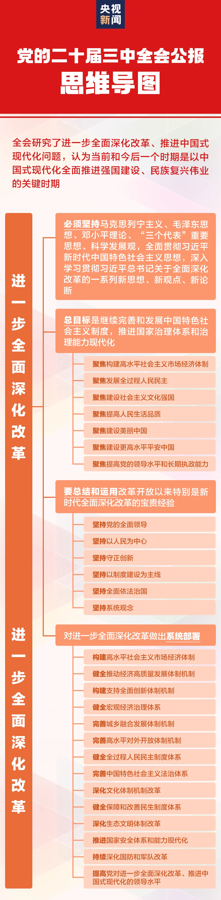

# 中国政治概况

[TOC]

## 资源
### 相关外部链接
↗ [中国共产党党史](中国共产党%20(Communist%20Party%20of%20China)/中国共产党党史.md)
↗ [中国共产党思想体系](中国共产党%20(Communist%20Party%20of%20China)/中国共产党思想体系/中国共产党思想体系.md)

↗ [中国武装力量](🔫%20中国武装力量/中国武装力量.md)

### 其他资源

## 简介
> 🔗 https://zh.wikipedia.org/wiki/%E4%B8%AD%E5%8D%8E%E4%BA%BA%E6%B0%91%E5%85%B1%E5%92%8C%E5%9B%BD

中华人民共和国是一个位于东亚的社会主义国家，首都为北京市，国土面积约为960万平方千米。全国共划分为23个省、5个自治区、4个直辖市和2个特别行政区共34个省级行政区，国土面积位居世界第三。

抗日战争结束后，毛泽东领导下的中国共产党和人民解放军在第二次国共内战中逐步取得优势，并于1949年10月1日在北京宣告成立中华人民共和国中央人民政府。1950年代后，中华人民共和国实际控制中国大陆地区，与控制台湾地区的中华民国形成两岸分治的格局。

截至2023年末，中华人民共和国有约14.1亿人，约占世界人口的17.6%，为世界上人口第二多的国家。中华人民共和国民族众多，仅官方承认的民族就有56个。不过除汉族外，其他民族仅占总人口的8.89%。中华人民共和国的国家通用语言文字是普通话与规范汉字。中华人民共和国于1986年后实行九年义务教育制度，截至2020年已有2.4亿人接受高等教育。

目前（2024），中华人民共和国为世界第二大经济体，2023年国内生产总值（GDP）总量达129.4万亿人民币，依国际汇率折合18.37万亿美元，位居世界第二，仅次于美国；按购买力平价则位列世界第一。中华人民共和国是世界上最大的商品出口国及第二大的进口国。1978年改革开放后，中华人民共和国很快成为经济增长最快的主要经济体之一。贫困问题随着经济增长也逐渐得到好转，832个国家级贫困县在2020年底全部完成脱贫摘帽，但区域间发展不均衡以及国民贫富差距较大这两大问题仍需解决。

军事方面，中华人民共和国拥有世界第一大规模的常备部队和世界排名第二的海军舰队，且具备三位一体的核打击能力。航天方面，中华人民共和国是世界上第三个能独立完成载人航天、自主空间站建设、月球软着陆与采样返回、火星软着陆等航天任务的国家。

外交层面，中华人民共和国奉行和平共处五项原则，其于1971年在联合国代替中华民国联合国大会第2758号决议取得中国代表权及联合国安全理事会常任理事国席位，之后成为上海合作组织、二十国集团、金砖国家、东亚峰会、亚投行、RCEP等国际组织的创始国和主导国。随着综合国力的上升，中华人民共和国已被认为是潜在超级大国。

> 🔗 https://www.gov.cn/guoqing/index.htm

中国位于亚洲东部，太平洋西岸。陆地总面积约960万平方千米，海域总面积约473万平方千米。中国陆地边界长度约2.2万千米，大陆海岸线长度约1.8万千米。海域分布着大小岛屿7600个，面积最大的是台湾岛，面积35759平方千米。目前中国有34个省级行政区，包括23个省、5个自治区、4个直辖市、2个特别行政区。北京是中国的首都。

政治
- [中国共产党第二十届中央领导机构](https://www.gov.cn/guoqing/2022-10/23/content_5720988.htm)
- [全国人民代表大会常务委员会](https://www.gov.cn/guoqing/2023-03/12/content_5746231.htm)
    - [中华人民共和国主席](https://www.gov.cn/guoqing/2023-03/10/content_5745803.htm)
    - [国务院](https://www.gov.cn/gwyzzjg/)
    - [中央军事委员会](https://www.gov.cn/guoqing/2018-03/17/content_5274966.htm)
    - [国家监察委员会](https://www.gov.cn/guoqing/2023-03/11/content_5746070.htm)
    - [最高人民法院](https://www.gov.cn/guoqing/2023-03/11/content_5747845.htm)
    - [最高人民检察院](https://www.gov.cn/guoqing/2023-03/11/content_5747848.htm)
- [中国人民政治协商会议全国委员会](https://www.gov.cn/guoqing/2023-03/11/content_5746028.htm)
    - [民主党派](https://www.gov.cn/guoqing/2023-03/10/content_5745769.htm)

经济
- [国民经济和社会发展](https://www.gov.cn/lianbo/bumen/202402/content_6934935.htm)
- [居民收入和消费支出](https://www.gov.cn/lianbo/bumen/202401/content_6926492.htm)
- [中国的全面小康](https://www.gov.cn/zhengce/2021-09/28/content_5639778.htm)
- [新时代的中国绿色发展](https://www.gov.cn/zhengce/2023-01/19/content_5737923.htm)
- [新时代的中国能源发展](https://www.gov.cn/zhengce/2020-12/21/content_5571916.htm)
- [中国的粮食安全](https://www.gov.cn/zhengce/2019-10/14/content_5439410.htm)
- [永久基本农田信息查询](https://yncx.mnr.gov.cn/yn/#/home)

社会
- [中国共产党尊重和保障人权的伟大实践](https://www.gov.cn/zhengce/2021-06/24/content_5620505.htm)
- [新时代的中国青年](https://www.gov.cn/zhengce/2022-04/21/content_5686435.htm)
- [新中国70年妇女事业的发展与进步](https://www.gov.cn/zhengce/2019-09/19/content_5431327.htm)
- [第七次全国人口普查公报](https://www.gov.cn/guoqing/2021-05/13/content_5606149.htm)
- [生育政策](https://www.gov.cn/zhengce/2021-07/20/content_5626190.htm)
- [中华各民族](https://www.neac.gov.cn/seac/ztzl/zgmzjs/index.shtml)

历史
- [中国共产党一百年大事记 （1921年7月－2021年6月）](https://www.gov.cn/xinwen/2021-06/28/content_5621160.htm)
- [中华人民共和国大事记 （1949年10月－2019年9月）](https://www.gov.cn/xinwen/2019-09/27/content_5434223.htm)

人文
- [文化和旅游发展统计公报](https://www.gov.cn/lianbo/bumen/202409/content_6972211.htm)
- [中国文物保护状况](https://www.gov.cn/guoqing/2012-04/11/content_2584143.htm)
- [中国世界文化遗产名录](http://www.ncha.gov.cn/col/col2266/index.html)
- [中国保障宗教信仰自由的政策和实践](https://www.gov.cn/zhengce/2018-04/03/content_5279419.htm)
- [中国健康事业的发展与人权进步](https://www.gov.cn/zhengce/2017-09/29/content_5228551.htm)

地理
- [中国地势图](https://www.gov.cn/guoqing/2005-09/13/content_2582621.htm)

## 中国政治权力系统
### 四套班子 /五套班子 /六套班子
🔗 https://zh.wikipedia.org/wiki/%E5%85%9A%E5%92%8C%E5%9B%BD%E5%AE%B6%E6%9C%BA%E6%9E%84
党和国家机构，俗称四套班子或四大班子，是中华人民共和国政治术语，指从中央到地方各级政治机构的领导集体，分别为**党委、人大、政府、政协**。除奉行一国两制的香港、澳门外，中国内地31个省级行政区均有设置。在中央级，中共中央、全国人大常委会、国务院、全国政协与中央军委并列为国家层面的五套班子。**而在地方各级机构中，当地四套班子与纪委监委并称为五套班子或五大班子**。2018年，新成立的各省级行政区监察委员会全部组建完成，中华人民共和国国家监察委员会宣告成立，与纪委合署办公；而在地方级，若加上军事部门，则称**六套班子或六大班子**。

我们常说的“四大班子”，是指各级党委、政府部门的领导群体，分别是党委领导班子、人大领导班子、政府领导班子和政协领导班子。
关于四大班子的具体职能，大家可以网上自行搜索查看，概括来说“四大班子”职能如下：
- 党委是最高领导机关，统领一切，管方向、定方针、做决策；
- 人大是立法监督机关，制定法律法规、监督政府运作、选举政府领导人，并研究审议重大决策等；
- 政府是权力执行机关，负责执行党委的决策部署、推动本地区经济社会发展；
- 政协是参政议政机关，确切说是政治协商机构，可以看做人大的补充，因为人大是法律监督，政协是民主监督。

民间曾有个段子调侃“四大班子”职能：
- 党委是爸爸，整天指手画脚、背着个手光知道训人；人大是爷爷，想管事又力不从心，整天提着个鸟笼子晃悠，啥事也不管，只要大家知道这个家还有个老爷子就行了；政府是妈妈，整天有干不完的活，干好了是应该的，干得不好还要挨爸爸的训；政协是奶奶，整天瞎担心，唠唠叨叨，谁也不听她的。

==概括起来就是一句话：党委有权，政府有钱，人大举手，政协发言。==

---

#### 中南海

#### 选举流程
##### 国家领导人的选举
> 🤖 GPT-5.0
> https://chatgpt.com/share/697604b1-6ca4-800f-9d8a-081f58aa67ff

中国国家主席的产生，实质上遵循“党内先定、国家再选”的双轨制结构：  
党通过党代会和一中全会决定核心领导；国家通过全国人大依法完成宪法意义上的选举与任命。

一、党内流程（决定“谁掌权”）
① 召开 **中国共产党全国代表大会（党代会）**
- 五年一次
- 主要任务：
    - 审议党的报告、党章修改
    - **选举新一届中央委员会（中央委员、候补委员）**
    - 选举中央纪律检查委员会
⚠️ 注意：  
**这一步只选“中央委员”，不直接选总书记**

② 召开 **中共中央委员会第一次全体会议（一中全会）**
- **紧接着党代会闭幕后立即举行**
- 由刚刚选出的新一届中央委员会参加
- 在这一会议上：
    - 选举 **中央政治局**
    - 选举 **中央政治局常委**
    - 选举 **中共中央总书记**
    - 决定 **中央军委主席（党内）**
    - 批准书记处成员
👉 **这一步才是真正决定最高党内领导人**
> ✔️ 国家主席人选，事实上已经在这里“确定人选方向”了

二、国家流程（法律上的“确认”）
③ 召开 **全国人民代表大会（通常次年3月）**
也就是你说的“两会”中的“人大”
在人大上：
- 根据宪法和选举法：
    - **选举国家主席、副主席**
    - 决定国务院总理（由国家主席提名）
    - 选举中央军委主席（国家机构）
    - 选举其他国家机关领导人
⚠️ 关键点：
- **国家主席是在人大选的**
- 但人选来自此前已完成的党内决定
- 人大程序是**宪法合法性确认**

### 0️⃣ 最高国家元首：中华人民共和国国家主席（ President of the People's Republic of China ）
https://zh.wikipedia.org/wiki/%E4%B8%AD%E5%8D%8E%E4%BA%BA%E6%B0%91%E5%85%B1%E5%92%8C%E5%9B%BD%E4%B8%BB%E5%B8%AD#cite_note-President-11

中华人民共和国主席，简称中国国家主席、国家主席，是中华人民共和国的国家元首，为礼仪性和象征性的虚位元首，地位从属于全国人民代表大会，与全国人大常委会共同行使职权，是目前中华人民共和国政治排名第二的正国级职务。

根据《中华人民共和国宪法》规定，国家主席的主要职能是根据全国人大或其常委会的决定签发主席令和代表中华人民共和国进行国事和外交活动。国家主席也是国家机构之一，国家主席机构处于最高国家权力机关全国人民代表大会的从属地位。

中华人民共和国的政体是人民代表大会制度，国家主席是不掌握实权的虚位元首，职能是代表中华人民共和国进行国事活动。国家主席不领导任何国家机关，不承担行政、立法、军事权力与责任，仅负责签署全国人大及常委会通过的法令。不过自江泽民以来的国家主席，由于均同时担任中共中央总书记和中央军委主席，而成为实际的最高领导人。

国家主席职务自1954年召开的第一届全国人民代表大会以后开始设立。1968年文化大革命期间，时任国家主席刘少奇被罢免后开始缺位，1975年第四届全国人民代表大会通过的第二部《宪法》废除此一职务。1982年通过的第四部《宪法》恢复主席和副主席设置

> 《五四宪法》初次设立中华人民共和国主席职务，该职务官方英文译名为“Chairman of the People's Republic of China”。《八二宪法》恢复设立中华人民共和国主席职务后，该职务官方英文译名改为“President of the People's Republic of China”。中国外文出版发行事业局前副局长黄友义回忆道，“当年我参加翻译1982年制定的中国宪法时，国家主席到底是延续以前Chairman的英文表述，还是改为President，译者们有过不同的意见。一种意见认为，从建国开始，国家主席的英文就是Chairman，另一种意见认为，宪法里没有说要成立国务委员会，按照英文的逻辑，没有Committee，哪里来的Chairman？加之那时候年轻，说话没有顾忌，我坚持认为用Chairman这个单词不符合英文逻辑，而应该用President。”自此，国际上遵循中国外文局的官方译法，称国家主席为“President”，词汇含义类似于“总统”。
> https://zh.wikipedia.org/wiki/%E4%B8%AD%E5%8D%8E%E4%BA%BA%E6%B0%91%E5%85%B1%E5%92%8C%E5%9B%BD%E4%B8%BB%E5%B8%AD#cite_note-President-11

### 1️⃣ 中国共产党 (Communist Party of China)
↗ [中国共产党 (Communist Party of China)](中国共产党%20(Communist%20Party%20of%20China)/中国共产党%20(Communist%20Party%20of%20China).md)

<small><a>https://zh.wikipedia.org/wiki/%E4%B8%AD%E5%9B%BD%E5%85%B1%E4%BA%A7%E5%85%9A%E4%B8%AD%E5%A4%AE%E5%A7%94%E5%91%98%E4%BC%9A</a></small>

### 2️⃣ 中国人民政府 (Chinese Government）
↗ [中国政府与行政管理](中国政府与行政管理/中国政府与行政管理.md)

### 🤔 中国政府与中国共产党的关系

### 两会 (Two Sessions)
🔗 https://baike.baidu.com/item/%E4%B8%A4%E4%BC%9A/1009697
两会是对自1959年以来历年召开的[中华人民共和国全国人民代表大会](https://baike.baidu.com/item/%E4%B8%AD%E5%8D%8E%E4%BA%BA%E6%B0%91%E5%85%B1%E5%92%8C%E5%9B%BD%E5%85%A8%E5%9B%BD%E4%BA%BA%E6%B0%91%E4%BB%A3%E8%A1%A8%E5%A4%A7%E4%BC%9A/4463614?fromModule=lemma_inlink)和[中国人民政治协商会议](https://baike.baidu.com/item/%E4%B8%AD%E5%9B%BD%E4%BA%BA%E6%B0%91%E6%94%BF%E6%B2%BB%E5%8D%8F%E5%95%86%E4%BC%9A%E8%AE%AE/458631?fromModule=lemma_inlink)的统称。由于两场会议会期基本重合，而且对于国家运作的重要程度都非常的高，故简称做“两会”。从省级地方到中央，各地的政协及人大的全体会议的会期全部基本重合，所以两会的名称可以同时适用于全国及各省（市、自治区）。 

**两会每5年称为一届，每年会议称X届X次会议**。根据中国宪法规定：“两会”召开的意义在于将“两会”代表从人民中得来的信息和要求进行收集及整理，传达给党中央。“两会”代表是代表着广大选民的一种利益的，代表着选民在召开两会期间，向政府有关部门提出选民们自己的意见和要求。地方每年召开的人大和政协也称为两会，通常召开的时间比全国“两会”时间要早。

[1978年-2025年全国两会](https://baike.baidu.com/starmap/view?nodeId=f9ba484ea6529af19e8afd4e&lemmaTitle=%E4%B8%A4%E4%BC%9A&lemmaId=1009697&starMapFrom=lemma_starMap&fromModule=lemma_starMap)
#### 3️⃣ 中华人民共和国全国人民代表大会 (The National People's Congress of the People's Republic of China)
http://www.npc.gov.cn/npc/index.html

https://baike.baidu.com/item/%E4%B8%AD%E5%8D%8E%E4%BA%BA%E6%B0%91%E5%85%B1%E5%92%8C%E5%9B%BD%E5%85%A8%E5%9B%BD%E4%BA%BA%E6%B0%91%E4%BB%A3%E8%A1%A8%E5%A4%A7%E4%BC%9A/4463614
中华人民共和国全国人民代表大会，是中国最高国家权力机关。它的常设机关是全国人民代表大会常务委员会。全国人民代表大会和全国人民代表大会常务委员会行使国家立法权。全国人民代表大会由省、自治区、直辖市、特别行政区和军队选出的代表组成。各少数民族都应当有适当名额的代表。（摘自《中华人民共和国宪法》）
全国人民代表大会及其常务委员会坚持中国共产党的领导，坚持以马克思列宁主义、毛泽东思想、邓小平理论、“三个代表”重要思想、科学发展观、习近平新时代中国特色社会主义思想为指导，依照宪法和法律规定行使职权。
全国人民代表大会每届任期五年。全国人民代表大会会议每年举行一次，由全国人民代表大会常务委员会召集。全国人民代表大会常务委员会认为必要，或者有五分之一以上的全国人民代表大会代表提议，可以临时召集全国人民代表大会会议

[历届中华人民共和国全国人民代表大会](https://baike.baidu.com/starmap/view?nodeId=ab7fe12610d33dec1002938e&lemmaTitle=%E4%B8%AD%E5%8D%8E%E4%BA%BA%E6%B0%91%E5%85%B1%E5%92%8C%E5%9B%BD%E5%85%A8%E5%9B%BD%E4%BA%BA%E6%B0%91%E4%BB%A3%E8%A1%A8%E5%A4%A7%E4%BC%9A&lemmaId=4463614&starMapFrom=lemma_starMap&fromModule=lemma_starMap)
- [中华人民共和国第十四届全国人民代表大会代表名单](https://baike.baidu.com/starmap/view?nodeId=d44f4524b78f5eabe2205c17&lemmaTitle=%E4%B8%AD%E5%8D%8E%E4%BA%BA%E6%B0%91%E5%85%B1%E5%92%8C%E5%9B%BD%E5%85%A8%E5%9B%BD%E4%BA%BA%E6%B0%91%E4%BB%A3%E8%A1%A8%E5%A4%A7%E4%BC%9A&lemmaId=4463614&starMapFrom=lemma_starMap&fromModule=lemma_starMap)
- [第十四届全国人大常委会委员长、副委员长、秘书长名单](https://baike.baidu.com/starmap/view?nodeId=6d6b44f74810b81e14d81ec4&lemmaTitle=%E4%B8%AD%E5%8D%8E%E4%BA%BA%E6%B0%91%E5%85%B1%E5%92%8C%E5%9B%BD%E5%85%A8%E5%9B%BD%E4%BA%BA%E6%B0%91%E4%BB%A3%E8%A1%A8%E5%A4%A7%E4%BC%9A&lemmaId=4463614&starMapFrom=lemma_starMap&fromModule=lemma_starMap)
#### 4️⃣ 中国人民政治协商会议 (Chinese People's Political Consultative Conference)
http://www.cppcc.gov.cn/

https://baike.baidu.com/item/%E4%B8%AD%E5%9B%BD%E4%BA%BA%E6%B0%91%E6%94%BF%E6%B2%BB%E5%8D%8F%E5%95%86%E4%BC%9A%E8%AE%AE%E5%85%A8%E5%9B%BD%E5%A7%94%E5%91%98%E4%BC%9A/2266761
中国人民政治协商会议全国委员会，简称政协全国委员会或全国政协，由中国共产党、各民主党派、无党派人士、人民团体、各少数民族和各界的代表，香港特别行政区同胞、澳门特别行政区同胞、台湾同胞和归国侨胞的代表以及特别邀请的人士组成，每届任期5年。

[中国人民政治协商会议第十四届全国委员会](https://www.gov.cn/guoqing/2023-03/11/content_5746028.htm)
##### 各民主党派
- [中国国民党革命委员会](http://www.minge.gov.cn/)
- [中国民主同盟](http://www.dem-league.org.cn/)
- [中国民主建国会](http://www.cndca.org.cn/)
- [中国民主促进会](http://www.mj.org.cn/)
- [中国农工民主党](http://www.ngd.org.cn/)
- [中国致公党](http://www.zg.org.cn/)
- [九三学社](http://www.93.gov.cn/)
- [台湾民主自治同盟](http://www.taimeng.org.cn/)

> 🔗 https://zh.wikipedia.org/wiki/%E4%B8%AD%E8%8F%AF%E4%BA%BA%E6%B0%91%E5%85%B1%E5%92%8C%E5%9C%8B%E6%94%BF%E9%BB%A8

中华人民共和国政党是指中华人民共和国境内的政治团体。根据中华人民共和国宪法第三十五条所载明的“中华人民共和国公民有言论、出版、集会、结社、游行、示威的自由”，而保障人民的集会和结社权。截至目前，中华人民共和国大陆地区共有9个合法政党存在，但只有中国共产党拥有执政权。

<small><a>https://zh.wikipedia.org/wiki/%E4%B8%AD%E8%8F%AF%E4%BA%BA%E6%B0%91%E5%85%B1%E5%92%8C%E5%9C%8B%E6%94%BF%E9%BB%A8</a></small>

### 5️⃣ 中纪委、国监委
#### 中共中央纪律检查委员会 (Central Commission for Discipline Inspection)
https://www.ccdi.gov.cn/
 
中国共产党中央纪律检查委员会，简称中纪委，是中国共产党的最高纪律检查机关，**与中华人民共和国国家监察委员会合署办公**。中国共产党中央纪律检查委员会负责维护《中国共产党章程》和其他党内法规，检查党的路线方针政策和决议执行情况，对党员领导干部行使权力进行监督，维护宪法法律，对公职人员依法履职、秉公用权、廉洁从政以及道德操守情况进行监督检查，对涉嫌职务违法和职务犯罪的行为进行调查并作出政务处分决定，对履行职责不力、失职失责的领导人员进行问责，负责组织协调党风廉政建设和反腐败宣传等。中央纪委实行书记负责制。
#### 中华人民共和国国家监察委员会 (National Supervisory Commission of the People's Republic of China)
中华人民共和国国家监察委员会，简称国家监委，是中华人民共和国最高监察机关，为副国级单位。**国家监察委员会与中国共产党中央纪律检查委员会的机关合署办公**，国家监察委员会主任由中共中央纪委副书记担任。省、自治区、直辖市、自治州、县、自治县、市、市辖区设立监察委员会。 国家监察委员会由全国人民代表大会产生，负责全国监察工作。 国家监察委员会由主任、副主任若干人、委员若干人组成，主任由全国人民代表大会选举，副主任、委员由国家监察委员会主任提请全国人民代表大会常务委员会任免。

国家监察委员会依据宪法及相关的法律负责监督、调查、处置公职人员依法履职、秉公用权、廉洁从政从业以及道德操守问题。国家监察委员会依照法律规定独立行使监察权，不受行政机关、社会团体和个人的干涉。

2018年第十三届全国人民代表大会第一次会议修改《中华人民共和国宪法》及通过《中华人民共和国监察法》后设立。

### 6️⃣ 中央军委和中国武装力量
↗ [中国武装力量](🔫%20中国武装力量/中国武装力量.md)
#### 中华人民共和国中央军事委员会 (Central Military Commission)
[中国共产党第二十届中共中央军事委员会 + 中华人民共和国中央军事委员会](http://www.mod.gov.cn/gfbw/gc/index.html)

中国共产党和中华人民共和国中央军事委员会，通称中央军事委员会，简称中央军委、军委，是中国共产党和中华人民共和国武装力量最高军事领导机构的总称，包括以下两个机构：
- 中国共产党中央军事委员会
- 中华人民共和国中央军事委员会
1982年12月，中华人民共和国中央军事委员会成立后，中共中央军事委员会和国家中央军事委员会的组成人员基本相同，实际上是“一个机构两块牌子”。中共中央军事委员会由中国共产党中央委员会产生或罢免。国家中央军事委员会由全国人民代表大会产生或罢免，对全国人大及其常务委员会负责。对国家武装力量发布命令、授予军衔警衔、授予勋章奖章时一般以“中华人民共和国中央军事委员会”名义发布。

### 7️⃣ 两高
#### 中华人民共和国最高人民法院（Supreme People's Court）
- https://www.court.gov.cn/index.html
- 中华人民共和国最高人民法院（简称最高法、最高院、高法院）是中华人民共和国的最高审判机关，监督地方各级人民法院和专门人民法院的工作。最高人民法院的裁判为终审裁判，不得上诉。最高人民法院和最高人民检察院并称“两高”，同属中华人民共和国司法机关。
- 依据宪法，最高人民法院由全国人民代表大会产生，对全国人大及其常委会负责并受其监督。最高人民法院院长由全国人大选举产生，代表最高人民法院向全国人大汇报工作。全国人大有权罢免最高人民法院院长。根据最高人民法院院长的提请，全国人大常委会任免最高人民法院副院长、审判员、审判委员会委员和军事法院院长。
#### 中华人民共和国最高人民检察院（The Supreme People's Procuratorate of the People's Republic of China）
- https://www.spp.gov.cn/
- 中华人民共和国最高人民检察院（简称最高检、高检院）是中华人民共和国的最高检察机关和最高法律监督机关，领导地方各级人民检察院和专门人民检察院的工作。最高人民检察院和最高人民法院并称“两高”，同属中华人民共和国司法机关。
- 依据宪法，最高人民检察院由全国人民代表大会产生，对全国人大及其常委会负责并受其监督。最高人民检察院检察长由全国人大选举产生，代表最高人民检察院向全国人大汇报工作。全国人大有权罢免最高人民检察院检察长。根据最高人民检察院检察长的提请，全国人大常委会任免最高人民检察院副检察长、检察员、检察委员会委员和军事检察院检察长，并且批准省、自治区、直辖市的人民检察院检察长的任免。

## 中国军事体制
↗ [中国武装力量](🔫%20中国武装力量/中国武装力量.md)

## 中国经济体制
↗ [中国经济发展](../🚀%20中国发展力量概况/中国经济发展/中国经济发展.md)

## 中国社会治理及科教文卫事业的发展
↗ [中国社会建设与人口治理](../中国社会建设与人口治理/中国社会建设与人口治理.md)
- ↗ [中国社会监控监管与思想内容审查](../中国社会建设与人口治理/中国社会监控监管与思想内容审查.md) 🤔
- ↗ [中国社会保障与福利体系](../中国社会建设与人口治理/中国社会保障与福利体系.md)
- ↗ [中国本土民族文化构成与外来移民](../中国社会建设与人口治理/中国本土民族文化构成与外来移民.md)
- ↗ [中国宗教发展与现状](../中国社会建设与人口治理/中国宗教发展与现状.md)
- ↗ [中国城乡与基础设施建设及规划](../中国社会建设与人口治理/中国城乡与基础设施建设及规划.md)

↗ [中国文化发展](../🚀%20中国发展力量概况/中国文化发展/中国文化发展.md)

↗ [中国科技发展](../🚀%20中国发展力量概况/中国科技发展/中国科技发展.md)

↗ [中国经济发展](../🚀%20中国发展力量概况/中国经济发展/中国经济发展.md)
- ↗ [中国教育与培训业](../🚀%20中国发展力量概况/中国经济发展/📌%20第三产业/🧑🏽‍🏫%20中国教育与培训业/中国教育与培训业.md)
- ↗ [中国大消费](../🚀%20中国发展力量概况/中国经济发展/📌%20第三产业/中国大消费/中国大消费.md)
	- ↗ [中国大健康](../🚀%20中国发展力量概况/中国经济发展/📌%20第三产业/中国大消费/中国大健康/中国大健康.md)
		- ↗ [中国医疗产业](../🚀%20中国发展力量概况/中国经济发展/📌%20第三产业/中国大消费/中国大健康/中国医疗产业/中国医疗产业.md)
		- ↗ [中国卫生与保健产业](../🚀%20中国发展力量概况/中国经济发展/📌%20第三产业/中国大消费/中国大健康/中国卫生与保健产业/中国卫生与保健产业.md)

## 中国大陆与台湾问题
> [!links]
> ↗ [新中国史（中华人民共和国时期）](../../中华文明历史概况/📜%20中国历史：朝代与时期/新中国史（中华人民共和国时期）/新中国史（中华人民共和国时期）.md)
> ↗ [台湾政治概况](../../中国台湾地区/台湾政治概况/台湾政治概况.md)

> 🤖 GPT-5.0
> https://chatgpt.com/share/697604b1-6ca4-800f-9d8a-081f58aa67ff

台湾问题在中共政治中的定位，已经发生变化。在政治优先级上，大致经历了三阶段：

| 阶段        | 定位                 |
| --------- | ------------------ |
| 改革开放早期    | 外交问题 / 历史遗留问题      |
| 2000年代    | 国家主权问题             |
| **十八大以来** | **政权安全 + 历史合法性问题** |

在台湾问题上，中共最担心的不是“打不赢”，而是“不可控”。
不可控包括三种情况：
1. 军事层面的误判或擅自升级
2. 指挥链条不清晰
3. 内部对战略目标理解不一致

👉 因此，军队建设的首要目标不是“冒险能力”，而是： **确保任何行动（包括不行动）都完全服从政治判断。**

军队层面：台湾问题推动军队从“能力建设逻辑”向“控制优先逻辑”进一步倾斜。
派系层面：台湾问题压缩了所有非核心政治网络的生存空间，使派系退化为履历背景。
体制层面：台湾问题成为权力高度集中、反腐高压、组织频繁调整的**长期理由**。

台湾问题 → 历史叙事完整性 → 领导权威 → 精英服从 → 军队控制 → 政权安全
1️⃣ **台湾问题之于中共，已从外交议题转化为政权合法性的核心锚点**  
2️⃣ **在这一问题上显现退让，会引发历史叙事、精英政治与军队控制的连锁不稳定**  
3️⃣ **因此，“坚定态度”首先是内政逻辑，其次才是对外战略**

三句话总结（高度概括，可直接引用）
1️⃣ **台湾问题是二十大以来中国党—军体系高度整合化的最大外部牵引变量**  
2️⃣ **军队改革与反腐的核心目标，是确保任何涉台决策都不存在组织层面的不确定性**  
3️⃣ **派系政治在台湾议题上被系统性压缩，以防止风险外溢和个人化政治博弈**

为什么“高压但避免决战”是理性选择？
先说结论（非常关键）：**高压但不决战，在政治学上是一种“风险最小化的最优可控均衡”，而不是犹豫或无能。** 

1️⃣ **“高压但避免决战”是一种最大化可控性、最小化不可逆风险的理性均衡**  
2️⃣ **台湾问题在未解决状态下，为政权提供了合法性、动员力与组织整合的结构性支点**  
3️⃣ **真正的挑战不在于“如何收复台湾”，而在于“收复之后如何维持政治稳定”**

## Ref
[一张思维导图全解二十届三中全会公报要点→]: https://mp.weixin.qq.com/s/0y_D1FOziRUuQr-vb044Iw

.webp)
.webp)

[【百年真相】秦刚离奇失踪 落马原因探秘 | 大元]: https://www.epochtimes.com/gb/25/5/12/n14506923.htm
[中国任命火箭军新领导层 引发军中“清洗”猜测 |  BBC]: https://www.bbc.com/zhongwen/simp/chinese-news-66371405
